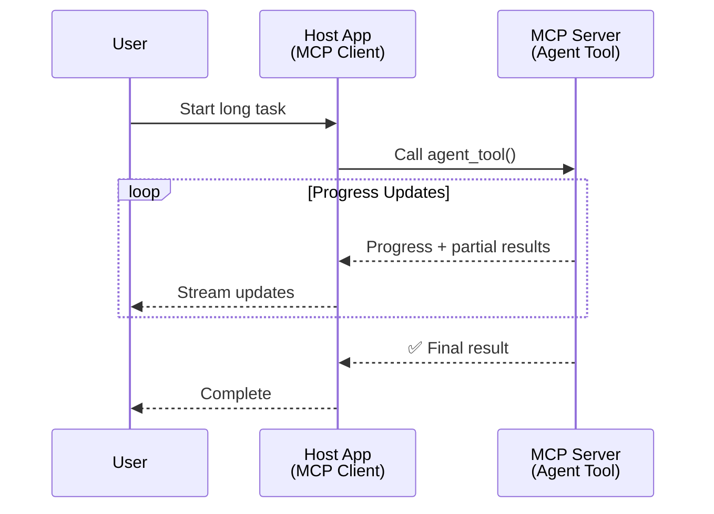
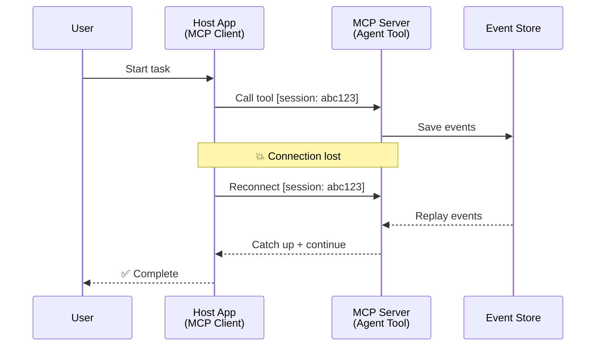
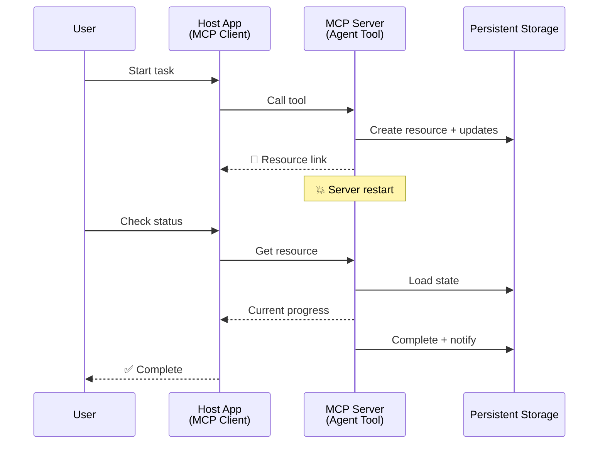
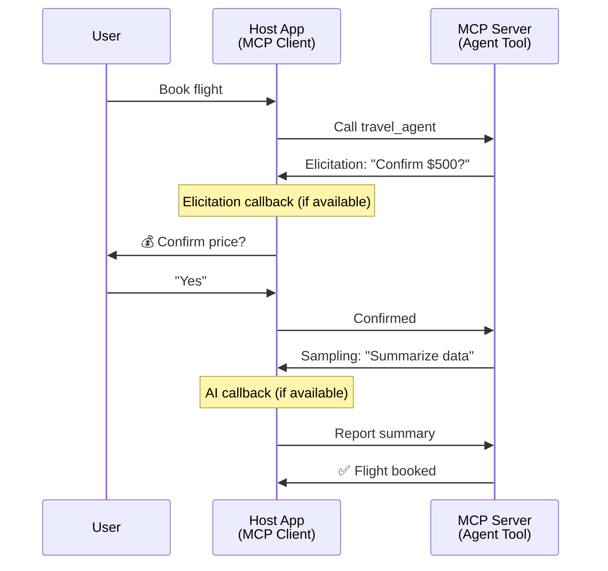

<!--
CO_OP_TRANSLATOR_METADATA:
{
  "original_hash": "5cc6836626047aa055e8960c8484a7d0",
  "translation_date": "2025-08-30T00:11:13+00:00",
  "source_file": "11-agentic-protocols/code_samples/mcp-agents/README.md",
  "language_code": "sr"
}
-->
# Изградња система за комуникацију између агената уз MCP

> Укратко - Можете ли изградити комуникацију између агената уз MCP? Да!

MCP је значајно еволуирао изван своје првобитне сврхе „обезбеђивања контекста за LLM-ове“. Са недавним побољшањима као што су [стримови који се могу наставити](https://modelcontextprotocol.io/docs/concepts/transports#resumability-and-redelivery), [елицитација](https://modelcontextprotocol.io/specification/2025-06-18/client/elicitation), [семплинг](https://modelcontextprotocol.io/specification/2025-06-18/client/sampling) и обавештења ([напредак](https://modelcontextprotocol.io/specification/2025-06-18/basic/utilities/progress) и [ресурси](https://modelcontextprotocol.io/specification/2025-06-18/schema#resourceupdatednotification)), MCP сада пружа робусну основу за изградњу сложених система за комуникацију између агената.

## Заблуда о агенти/алат концепту

Како све више програмера истражује алате са агентским понашањем (дуготрајно извршавање, потреба за додатним уносом током извршења итд.), честа је заблуда да MCP није погодан, углавном зато што су рани примери његових алата били фокусирани на једноставне обрасце захтев-одговор.

Овај утисак је застарео. MCP спецификација је значајно побољшана у последњих неколико месеци, са могућностима које омогућавају изградњу дуготрајног агентског понашања:

- **Стримовање и делимични резултати**: Ажурирања напретка у реалном времену током извршења
- **Настављивост**: Клијенти могу поново успоставити везу и наставити након прекида
- **Трајност**: Резултати опстају након рестарта сервера (нпр. преко линкова ка ресурсима)
- **Више корака**: Интерактивни унос током извршења уз елицитацију и семплинг

Ове функције могу се комбиновати за омогућавање сложених агентских и мулти-агентских апликација, све уз MCP протокол.

За референцу, агента ћемо називати „алатом“ који је доступан на MCP серверу. Ово подразумева постојање хост апликације која имплементира MCP клијента, успоставља сесију са MCP сервером и може позивати агента.

## Шта MCP алат чини „агентским“?

Пре него што пређемо на имплементацију, хајде да утврдимо које инфраструктурне могућности су потребне за подршку дуготрајним агентима.

> Дефинисаћемо агента као ентитет који може аутономно функционисати током дужег периода, способан да обавља сложене задатке који могу захтевати више интеракција или прилагођавања на основу повратних информација у реалном времену.

### 1. Стримовање и делимични резултати

Традиционални обрасци захтев-одговор нису погодни за дуготрајне задатке. Агенти морају пружати:

- Ажурирања напретка у реалном времену
- Прелиминарне резултате

**Подршка у MCP-у**: Обавештења о ажурирању ресурса омогућавају стримовање делимичних резултата, мада је потребан пажљив дизајн како би се избегли конфликти са JSON-RPC моделом 1:1 захтев/одговор.

| Функција                  | Пример употребе                                                                                                                                                                   | Подршка у MCP-у                                                                          |
| ------------------------- | -------------------------------------------------------------------------------------------------------------------------------------------------------------------------------- | --------------------------------------------------------------------------------------- |
| Ажурирања напретка у реалном времену | Корисник захтева задатак миграције кода. Агент стримује напредак: „10% - Анализа зависности... 25% - Конверзија TypeScript фајлова... 50% - Ажурирање увоза...“          | ✅ Обавештења о напретку                                                                 |
| Делимични резултати       | Задатак „Генериши књигу“ стримује делимичне резултате, нпр. 1) Преглед приче, 2) Листа поглавља, 3) Свака завршена глава. Хост може прегледати, отказати или преусмерити у било којој фази. | ✅ Обавештења се могу „проширити“ да укључе делимичне резултате, видети предлоге на PR 383, 776 |

<strong>Слика 1:</strong> Овај дијаграм илуструје како MCP агент стримује ажурирања напретка у реалном времену и делимичне резултате хост апликацији током дуготрајног задатка, омогућавајући кориснику да прати извршење у реалном времену.

### 2. Настављивост

Агенти морају руковати прекидима мреже на елегантан начин:

- Поновно успостављање везе након прекида (клијент)
- Наставак од тачке где су стали (редостављање порука)

**Подршка у MCP-у**: MCP StreamableHTTP транспорт данас подржава наставак сесије и редостављање порука уз ID-еве сесије и ID-еве последњих догађаја. Важно је напоменути да сервер мора имплементирати EventStore који омогућава репродукцију догађаја при поновном повезивању клијента.  
Напомена: постоји предлог заједнице (PR #975) који истражује транспортно-агностичне стримове који се могу наставити.

| Функција      | Пример употребе                                                                                                                                         | Подршка у MCP-у                                                            |
| ------------- | ------------------------------------------------------------------------------------------------------------------------------------------------------ | -------------------------------------------------------------------------- |
| Настављивост  | Клијент се прекида током дуготрајног задатка. При поновном повезивању, сесија се наставља са репродукцијом пропуштених догађаја, настављајући беспрекорно. | ✅ StreamableHTTP транспорт са ID-евима сесије, репродукцијом догађаја и EventStore |

<strong>Слика 2:</strong> Овај дијаграм показује како MCP-ов StreamableHTTP транспорт и EventStore омогућавају беспрекорно настављање сесије: ако се клијент прекине, може се поново повезати и репродуковати пропуштене догађаје, настављајући задатак без губитка напретка.

### 3. Трајност

Дуготрајни агенти захтевају перзистентно стање:

- Резултати опстају након рестарта сервера
- Статус се може добити ван сесије
- Праћење напретка кроз сесије

**Подршка у MCP-у**: MCP сада подржава тип повратка Resource линка за позиве алата. Данас је могуће дизајнирати алат који креира ресурс и одмах враћа линк ка ресурсу. Алат може наставити да обрађује задатак у позадини и ажурира ресурс. Клијент може изабрати да проверава стање овог ресурса како би добио делимичне или потпуне резултате (на основу ажурирања ресурса које сервер пружа) или да се претплати на ресурс ради обавештења о ажурирањима.

Једно ограничење је да проверавање ресурса или претплата на ажурирања може трошити ресурсе, што има импликације на скалабилност. Постоји отворени предлог заједнице (укључујући #992) који истражује могућност укључивања вебхукова или тригера које сервер може позвати како би обавестио клијента/хост апликацију о ажурирањима.

| Функција    | Пример употребе                                                                                                                                    | Подршка у MCP-у                                                    |
| ----------- | ------------------------------------------------------------------------------------------------------------------------------------------------- | ------------------------------------------------------------------ |
| Трајност    | Сервер се руши током задатка миграције података. Резултати и напредак опстају након рестарта, клијент може проверити статус и наставити из перзистентног ресурса. | ✅ Линкови ка ресурсима са перзистентним складиштењем и обавештењима о статусу |

Данас је уобичајен образац дизајнирати алат који креира ресурс и одмах враћа линк ка ресурсу. Алат може у позадини обрађивати задатак, издавати обавештења о ресурсу која служе као ажурирања напретка или укључивати делимичне резултате, и ажурирати садржај у ресурсу по потреби.

<strong>Слика 3:</strong> Овај дијаграм демонстрира како MCP агенти користе перзистентне ресурсе и обавештења о статусу како би осигурали да дуготрајни задаци опстану након рестарта сервера, омогућавајући клијентима да провере напредак и преузму резултате чак и након отказа.

### 4. Више корака интеракције

Агенти често захтевају додатни унос током извршења:

- Људско разјашњење или одобрење
- Помоћ AI-а за сложене одлуке
- Динамичко прилагођавање параметара

**Подршка у MCP-у**: Потпуно подржано преко семплинга (за AI унос) и елицитације (за људски унос).

| Функција                 | Пример употребе                                                                                                                         | Подршка у MCP-у                                       |
| ------------------------ | --------------------------------------------------------------------------------------------------------------------------------------- | --------------------------------------------------- |
| Више корака интеракције  | Агент за резервацију путовања тражи потврду цене од корисника, затим тражи од AI-а да сажме податке о путовању пре него што заврши трансакцију. | ✅ Елицитација за људски унос, семплинг за AI унос |

<strong>Слика 4:</strong> Овај дијаграм приказује како MCP агенти могу интерактивно тражити људски унос или захтевати помоћ AI-а током извршења, подржавајући сложене, више корака радне токове као што су потврде и динамичко доношење одлука.

...

---

**Одрицање од одговорности**:  
Овај документ је преведен коришћењем услуге за превођење помоћу вештачке интелигенције [Co-op Translator](https://github.com/Azure/co-op-translator). Иако се трудимо да обезбедимо тачност, молимо вас да имате у виду да аутоматски преводи могу садржати грешке или нетачности. Оригинални документ на његовом изворном језику треба сматрати ауторитативним извором. За критичне информације препоручује се професионални превод од стране људи. Не преузимамо одговорност за било каква погрешна тумачења или неспоразуме који могу настати услед коришћења овог превода.