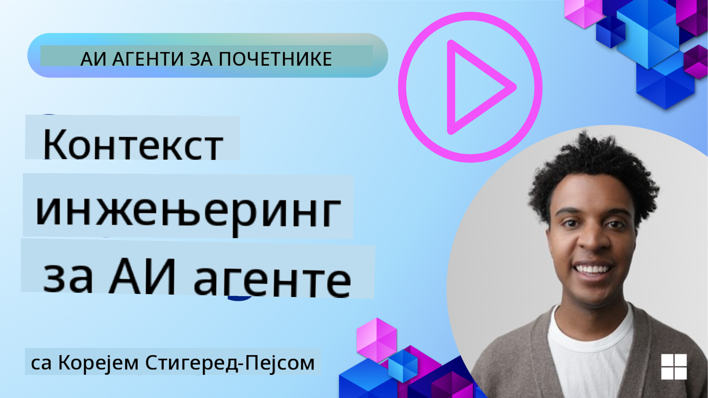
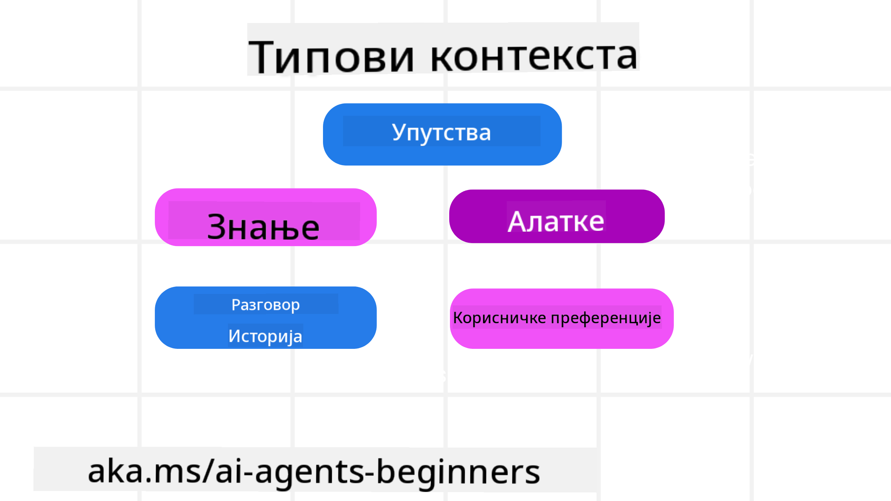
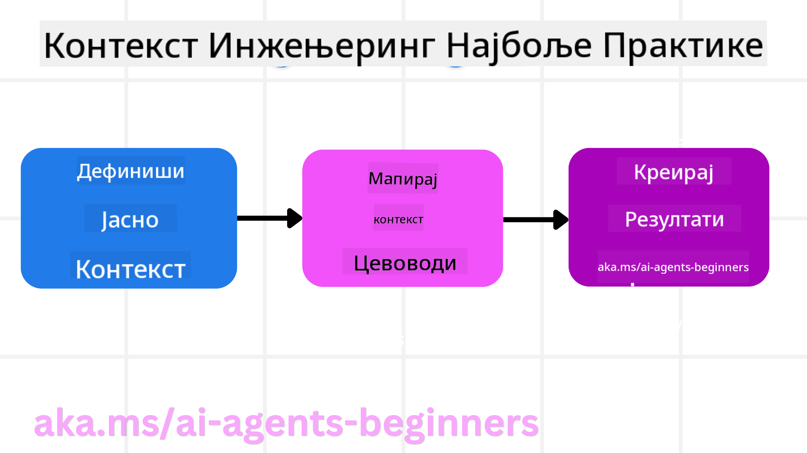

<!--
CO_OP_TRANSLATOR_METADATA:
{
  "original_hash": "cb7e50f471905ce6fdb92a30269a7a98",
  "translation_date": "2025-09-04T10:28:47+00:00",
  "source_file": "12-context-engineering/README.md",
  "language_code": "sr"
}
-->
# Инжењеринг контекста за AI агенте

> _(Кликните на слику изнад да бисте погледали видео лекцију)_

Разумевање сложености апликације за коју градите AI агента је кључно за стварање поузданог система. Потребно је да изградимо AI агенте који ефикасно управљају информацијама како би одговорили на сложене потребе које превазилазе само инжењеринг упутстава.

У овој лекцији ћемо истражити шта је инжењеринг контекста и његову улогу у изградњи AI агената.

## Увод

Ова лекција ће обухватити:

• **Шта је инжењеринг контекста** и зашто се разликује од инжењеринга упутстава.

• **Стратегије за ефикасан инжењеринг контекста**, укључујући како писати, бирати, компресовати и изоловати информације.

• **Уобичајени неуспеси у контексту** који могу пореметити рад вашег AI агента и како их исправити.

## Циљеви учења

Након завршетка ове лекције, знаћете како да:

• **Дефинишете инжењеринг контекста** и разликујете га од инжењеринга упутстава.

• **Идентификујете кључне компоненте контекста** у апликацијама заснованим на великим језичким моделима (LLM).

• **Примените стратегије за писање, одабир, компресију и изолацију контекста** како бисте побољшали перформансе агента.

• **Препознате уобичајене неуспехе у контексту** као што су тровање, ометање, конфузија и сукоб, и примените технике за њихово ублажавање.

## Шта је инжењеринг контекста?

За AI агенте, контекст је оно што покреће планирање агента да предузме одређене акције. Инжењеринг контекста је пракса осигуравања да AI агент има праве информације за извршење следећег корака задатка. Прозор контекста је ограничен по величини, па као градитељи агената морамо изградити системе и процесе за управљање додавањем, уклањањем и кондензовањем информација у прозору контекста.

### Инжењеринг упутстава vs Инжењеринг контекста

Инжењеринг упутстава се фокусира на један скуп статичних инструкција како би се AI агенти ефикасно водили низом правила. Инжењеринг контекста се бави управљањем динамичким скупом информација, укључујући почетна упутства, како би се осигурало да AI агент има оно што му је потребно током времена. Главна идеја инжењеринга контекста је да овај процес буде понављив и поуздан.

### Типови контекста

Важно је запамтити да контекст није само једна ствар. Информације које су потребне AI агенту могу долазити из различитих извора, а на нама је да осигурамо да агент има приступ тим изворима:

Типови контекста које AI агент може морати да управља укључују:

• **Упутства:** Ово су као "правила" агента – упутства, системске поруке, примери са неколико корака (који показују AI-у како да нешто уради) и описи алата које може користити. Овде се фокус инжењеринга упутстава спаја са инжењерингом контекста.

• **Знање:** Ово обухвата чињенице, информације преузете из база података или дугорочна сећања која је агент акумулирао. Ово укључује интеграцију система за генерисање уз помоћ преузимања (RAG) ако агенту треба приступ различитим изворима знања и базама података.

• **Алатке:** Ово су дефиниције спољних функција, API-ја и MCP сервера које агент може позвати, заједно са повратним информацијама (резултатима) које добија њиховим коришћењем.

• **Историја разговора:** Текући дијалог са корисником. Како време пролази, ови разговори постају дужи и сложенији, што значи да заузимају простор у прозору контекста.

• **Корисничке преференције:** Информације научене о корисниковим свиђањима или несвиђањима током времена. Оне се могу чувати и позивати приликом доношења кључних одлука како би се помогло кориснику.

## Стратегије за ефикасан инжењеринг контекста

### Стратегије планирања

Добар инжењеринг контекста почиње добрим планирањем. Ево приступа који ће вам помоћи да почнете да размишљате о примени концепта инжењеринга контекста:

1. **Дефинишите јасне резултате** – Резултати задатака који ће бити додељени AI агентима треба да буду јасно дефинисани. Одговорите на питање – "Како ће свет изгледати када AI агент заврши свој задатак?" Другим речима, коју промену, информацију или одговор корисник треба да добије након интеракције са AI агентом.

2. **Мапирајте контекст** – Када дефинишете резултате AI агента, потребно је да одговорите на питање "Које информације су потребне AI агенту да би завршио овај задатак?". На овај начин можете почети да мапирате контекст и локације где се те информације могу наћи.

3. **Креирајте контекстуалне канале** – Сада када знате где се налазе информације, потребно је да одговорите на питање "Како ће агент добити те информације?". Ово се може урадити на различите начине, укључујући RAG, коришћење MCP сервера и других алата.

### Практичне стратегије

Планирање је важно, али када информације почну да пристижу у прозор контекста вашег агента, потребно је имати практичне стратегије за њихово управљање:

#### Управљање контекстом

Док ће неке информације бити аутоматски додате у прозор контекста, инжењеринг контекста подразумева активнију улогу у управљању тим информацијама, што се може постићи следећим стратегијама:

1. **Бележница агента**  
Омогућава AI агенту да бележи релевантне информације о тренутним задацима и интеракцијама са корисником током једне сесије. Ово би требало да постоји ван прозора контекста у датотеци или објекту у току рада који агент може касније да преузме током те сесије ако је потребно.

2. **Сећања**  
Бележнице су добре за управљање информацијама ван прозора контекста једне сесије. Сећања омогућавају агентима да чувају и преузимају релевантне информације током више сесија. Ово може укључивати резимее, корисничке преференције и повратне информације за будућа побољшања.

3. **Компресија контекста**  
Када прозор контекста расте и приближава се свом лимиту, могу се користити технике као што су сажимање и скраћивање. Ово укључује задржавање само најрелевантнијих информација или уклањање старијих порука.

4. **Системи са више агената**  
Развој система са више агената је облик инжењеринга контекста јер сваки агент има свој прозор контекста. Како се тај контекст дели и преноси између различитих агената је још једна ствар коју треба испланирати приликом изградње ових система.

5. **Песковници (Sandbox Environments)**  
Ако агент треба да изврши неки код или обради велике количине информација у документу, то може захтевати велики број токена за обраду резултата. Уместо да све то буде сачувано у прозору контекста, агент може користити песковник који је у стању да изврши тај код и прочита само резултате и друге релевантне информације.

6. **Објекти стања у току рада (Runtime State Objects)**  
Ово се постиже креирањем контејнера информација за управљање ситуацијама када агенту треба приступ одређеним информацијама. За сложен задатак, ово би омогућило агенту да чува резултате сваког подзадатка корак по корак, омогућавајући контексту да остане повезан само са тим специфичним подзадатком.

### Пример инжењеринга контекста

Рецимо да желимо да AI агент **"Резервише путовање у Париз."**

• Једноставан агент који користи само инжењеринг упутстава могао би само да одговори: **"У реду, када желите да идете у Париз?"**. Он је обрадио само ваше директно питање у тренутку када сте га поставили.

• Агент који користи стратегије инжењеринга контекста које смо обрадили урадио би много више. Пре него што одговори, његов систем би могао:

  ◦ **Проверити ваш календар** за доступне датуме (преузимање података у реалном времену).

  ◦ **Присетити се претходних путних преференција** (из дугорочног памћења) као што су ваша омиљена авио-компанија, буџет или да ли преферирате директне летове.

  ◦ **Идентификовати доступне алате** за резервацију летова и хотела.

- Затим, пример одговора могао би бити: "Здраво [Ваше име]! Видим да сте слободни прве недеље октобра. Да ли да потражим директне летове за Париз на [Омиљена авио-компанија] у оквиру вашег уобичајеног буџета од [Буџет]?" Овај богатији, контекстуално свестан одговор демонстрира моћ инжењеринга контекста.

## Уобичајени неуспеси у контексту

### Тровање контекста

**Шта је то:** Када халуцинација (лажна информација коју генерише LLM) или грешка уђе у контекст и понавља се, узрокујући да агент тежи немогућим циљевима или развија бесмислене стратегије.

**Шта урадити:** Примените **валидацију контекста** и **карантин**. Валидација информација пре него што се додају у дугорочно памћење. Ако се открије потенцијално тровање, започните нове контекстуалне нити како бисте спречили ширење лоших информација.

**Пример резервације путовања:** Ваш агент халуцинира **директан лет са малог локалног аеродрома до удаљеног међународног града** који заправо не нуди међународне летове. Овај непостојећи детаљ лета се чува у контексту. Касније, када затражите резервацију, агент наставља да покушава да пронађе карте за ову немогућу руту, што доводи до поновљених грешака.

**Решење:** Примените корак који **валидира постојање летова и рута у реалном времену преко API-ја** _пре_ него што се детаљи лета додају у радни контекст агента. Ако валидација не успе, погрешна информација се "ставља у карантин" и више се не користи.

### Ометање контекста

**Шта је то:** Када контекст постане толико велик да се модел превише фокусира на акумулирану историју уместо на оно што је научио током тренинга, што доводи до понављајућих или неупотребљивих акција. Модели могу почети да праве грешке чак и пре него што се прозор контекста попуни.

**Шта урадити:** Користите **сажимање контекста**. Периодично компресујте акумулиране информације у краће сажетке, задржавајући важне детаље док уклањате сувишну историју. Ово помаже да се "ресетује" фокус.

**Пример резервације путовања:** Дуго разговарате о разним дестинацијама из снова, укључујући детаљно препричавање вашег путовања са ранцем од пре две године. Када коначно затражите **"пронађи ми јефтин лет за следећи месец"**, агент се заглави у старим, ирелевантним детаљима и наставља да пита о вашој опреми за ранац или прошлим итинерерима, занемарујући ваш тренутни захтев.

**Решење:** Након одређеног броја корака или када контекст постане превелик, агент би требало да **сажме најновије и најрелевантније делове разговора** – фокусирајући се на ваше тренутне датуме путовања и дестинацију – и користи тај кондензовани сажетак за следећи позив LLM-у, одбацујући мање релевантну историју.

### Конфузија у контексту

**Шта је то:** Када непотребан контекст, често у облику превише доступних алата, узрокује да модел генерише лоше одговоре или позива ирелевантне алате. Мањи модели су посебно подложни овоме.

**Шта урадити:** Примените **управљање алатима** користећи RAG технике. Чувајте описе алата у векторској бази података и изаберите _само_ најрелевантније алате за сваки специфичан задатак. Истраживања показују да ограничавање избора алата на мање од 30 побољшава перформансе.

**Пример резервације путовања:** Ваш агент има приступ десетинама алата: `book_flight`, `book_hotel`, `rent_car`, `find_tours`, `currency_converter`, `weather_forecast`, `restaurant_reservations`, итд. Питате, **"Који је најбољи начин да се крећем по Паризу?"** Због великог броја алата, агент се збуњује и покушава да позове `book_flight` _унутар_ Париза, или `rent_car` иако преферирате јавни превоз, јер се описи алата могу преклапати или једноставно не може да разликује најбољи.

**Решење:** Користите **RAG преко описа алата**. Када питате о кретању по Паризу, систем динамички преузима _само_ најрелевантније алате као што су `rent_car` или `public_transport_info` на основу вашег упита, представљајући фокусиран "сет алата" за LLM.

### Сукоб у контексту

**Шта је то:** Када у контексту постоје конфликтне информације, што доводи до неконзистентног резоновања или лоших коначних одговора. Ово се често дешава када информације стижу у

---

**Одрицање од одговорности**:  
Овај документ је преведен коришћењем услуге за превођење помоћу вештачке интелигенције [Co-op Translator](https://github.com/Azure/co-op-translator). Иако се трудимо да обезбедимо тачност, молимо вас да имате у виду да аутоматски преводи могу садржати грешке или нетачности. Оригинални документ на његовом изворном језику треба сматрати меродавним извором. За критичне информације препоручује се професионални превод од стране људи. Не преузимамо одговорност за било каква погрешна тумачења или неспоразуме који могу настати услед коришћења овог превода.