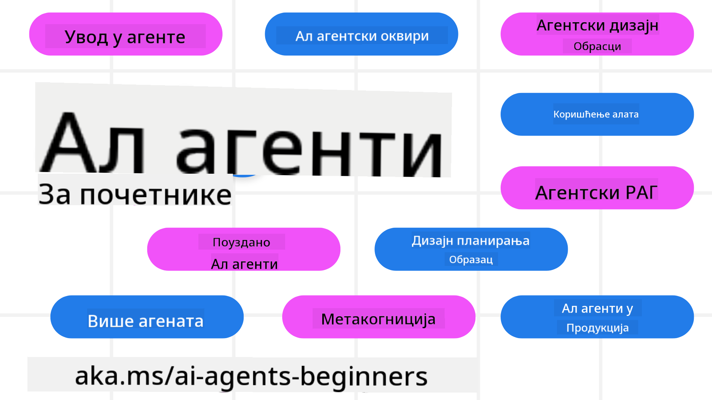

<!--
CO_OP_TRANSLATOR_METADATA:
{
  "original_hash": "6b07046397366e6f6f4524c9ddeba1e1",
  "translation_date": "2025-07-12T15:01:00+00:00",
  "source_file": "README.md",
  "language_code": "sr"
}
-->
# AI агенти за почетнике - курс

## 11 лекција које вас уче свему што треба да знате да бисте почели да правите AI агенте

### 🌐 Подршка за више језика

#### Подржано преко GitHub Action (аутоматски и увек ажурирано)

[French](../fr/README.md) | [Spanish](../es/README.md) | [German](../de/README.md) | [Russian](../ru/README.md) | [Arabic](../ar/README.md) | [Persian (Farsi)](../fa/README.md) | [Urdu](../ur/README.md) | [Chinese (Simplified)](../zh/README.md) | [Chinese (Traditional, Macau)](../mo/README.md) | [Chinese (Traditional, Hong Kong)](../hk/README.md) | [Chinese (Traditional, Taiwan)](../tw/README.md) | [Japanese](../ja/README.md) | [Korean](../ko/README.md) | [Hindi](../hi/README.md) | [Bengali](../bn/README.md) | [Marathi](../mr/README.md) | [Nepali](../ne/README.md) | [Punjabi (Gurmukhi)](../pa/README.md) | [Portuguese (Portugal)](../pt/README.md) | [Portuguese (Brazil)](../br/README.md) | [Italian](../it/README.md) | [Polish](../pl/README.md) | [Turkish](../tr/README.md) | [Greek](../el/README.md) | [Thai](../th/README.md) | [Swedish](../sv/README.md) | [Danish](../da/README.md) | [Norwegian](../no/README.md) | [Finnish](../fi/README.md) | [Dutch](../nl/README.md) | [Hebrew](../he/README.md) | [Vietnamese](../vi/README.md) | [Indonesian](../id/README.md) | [Malay](../ms/README.md) | [Tagalog (Filipino)](../tl/README.md) | [Swahili](../sw/README.md) | [Hungarian](../hu/README.md) | [Czech](../cs/README.md) | [Slovak](../sk/README.md) | [Romanian](../ro/README.md) | [Bulgarian](../bg/README.md) | [Serbian (Cyrillic)](./README.md) | [Croatian](../hr/README.md) | [Slovenian](../sl/README.md) | [Ukrainian](../uk/README.md) | [Burmese (Myanmar)](../my/README.md)

**Ако желите да подржимо још језика, листа подржаних језика је доступна [овде](https://github.com/Azure/co-op-translator/blob/main/getting_started/supported-languages.md)**

## 🌱 Почетак рада

Овај курс има 11 лекција које покривају основе прављења AI агената. Свака лекција обрађује своју тему, па почните где год желите!

Постоји подршка за више језика за овај курс. Погледајте наше [доступне језике овде](../..).

Ако вам је ово први пут да радите са генеративним AI моделима, погледајте наш курс [Generative AI For Beginners](https://aka.ms/genai-beginners), који садржи 21 лекцију о раду са GenAI.

Не заборавите да [означите (🌟) овај репозиторијум](https://docs.github.com/en/get-started/exploring-projects-on-github/saving-repositories-with-stars?WT.mc_id=academic-105485-koreyst) и [форкујете овај репозиторијум](https://github.com/microsoft/ai-agents-for-beginners/fork) да бисте покренули код.

### Шта вам је потребно

Свака лекција у овом курсу садржи примере кода, који се налазе у фолдеру code_samples. Можете [форковати овај репозиторијум](https://github.com/microsoft/ai-agents-for-beginners/fork) да направите своју копију.

Примери кода у овим вежбама користе Azure AI Foundry и GitHub Model Catalogs за интеракцију са језичким моделима:

- [Github Models](https://aka.ms/ai-agents-beginners/github-models) - Бесплатно / Ограничено
- [Azure AI Foundry](https://aka.ms/ai-agents-beginners/ai-foundry) - Потребан Azure налог

Овај курс такође користи следеће AI Agent оквире и сервисе из Microsoft-а:

- [Azure AI Agent Service](https://aka.ms/ai-agents-beginners/ai-agent-service)
- [Semantic Kernel](https://aka.ms/ai-agents-beginners/semantic-kernel)
- [AutoGen](https://aka.ms/ai-agents/autogen)

За више информација о покретању кода за овај курс, погледајте [Course Setup](./00-course-setup/README.md).

## 🙏 Желите да помогнете?

Имате предлоге или сте пронашли правописне или кодне грешке? [Отворите issue](https://github.com/microsoft/ai-agents-for-beginners/issues?WT.mc_id=academic-105485-koreyst) или [направите pull request](https://github.com/microsoft/ai-agents-for-beginners/pulls?WT.mc_id=academic-105485-koreyst)

Ако запнете или имате питања о прављењу AI агената, придружите се нашем [Azure AI Foundry Community Discord-у](https://discord.gg/kzRShWzttr)

Ако имате повратне информације о производу или грешке током рада, посетите наш [Azure AI Foundry Developer Forum](https://aka.ms/azureaifoundry/forum)

## 📂 Свака лекција садржи

- Писану лекцију у README-у и кратак видео
- Python примере кода који подржавају Azure AI Foundry и Github Models (бесплатно)
- Линкове ка додатним ресурсима за наставак учења

## 🗃️ Лекције

| **Лекција**                              | **Текст и код**                                    | **Видео**                                                  | **Додатно учење**                                                                     |
|------------------------------------------|----------------------------------------------------|------------------------------------------------------------|----------------------------------------------------------------------------------------|
| Увод у AI агенте и примере коришћења    | [Линк](./01-intro-to-ai-agents/README.md)          | [Видео](https://youtu.be/3zgm60bXmQk?si=z8QygFvYQv-9WtO1)  | [Линк](https://aka.ms/ai-agents-beginners/collection?WT.mc_id=academic-105485-koreyst) |
| Истраживање AI агентских оквира         | [Линк](./02-explore-agentic-frameworks/README.md)  | [Видео](https://youtu.be/ODwF-EZo_O8?si=Vawth4hzVaHv-u0H)  | [Линк](https://aka.ms/ai-agents-beginners/collection?WT.mc_id=academic-105485-koreyst) |
| Разумевање AI агентских дизајн образаца | [Линк](./03-agentic-design-patterns/README.md)     | [Видео](https://youtu.be/m9lM8qqoOEA?si=BIzHwzstTPL8o9GF)  | [Линк](https://aka.ms/ai-agents-beginners/collection?WT.mc_id=academic-105485-koreyst) |
| Образац коришћења алата                 | [Линк](./04-tool-use/README.md)                    | [Видео](https://youtu.be/vieRiPRx-gI?si=2z6O2Xu2cu_Jz46N)  | [Линк](https://aka.ms/ai-agents-beginners/collection?WT.mc_id=academic-105485-koreyst) |
| Agentic RAG                            | [Линк](./05-agentic-rag/README.md)                 | [Видео](https://youtu.be/WcjAARvdL7I?si=gKPWsQpKiIlDH9A3)  | [Линк](https://aka.ms/ai-agents-beginners/collection?WT.mc_id=academic-105485-koreyst) |
| Прављење поузданих AI агената           | [Линк](./06-building-trustworthy-agents/README.md) | [Видео](https://youtu.be/iZKkMEGBCUQ?si=jZjpiMnGFOE9L8OK ) | [Линк](https://aka.ms/ai-agents-beginners/collection?WT.mc_id=academic-105485-koreyst) |
| Образац планирања                       | [Линк](./07-planning-design/README.md)             | [Видео](https://youtu.be/kPfJ2BrBCMY?si=6SC_iv_E5-mzucnC)  | [Линк](https://aka.ms/ai-agents-beginners/collection?WT.mc_id=academic-105485-koreyst) |
| Образац мулти-агента                    | [Линк](./08-multi-agent/README.md)                 | [Видео](https://youtu.be/V6HpE9hZEx0?si=rMgDhEu7wXo2uo6g)  | [Линк](https://aka.ms/ai-agents-beginners/collection?WT.mc_id=academic-105485-koreyst) |
| Образац метакогниције                   | [Линк](./09-metacognition/README.md)               | [Видео](https://youtu.be/His9R6gw6Ec?si=8gck6vvdSNCt6OcF)  | [Линк](https://aka.ms/ai-agents-beginners/collection?WT.mc_id=academic-105485-koreyst) |
| AI агенти у продукцији                  | [Линк](./10-ai-agents-production/README.md)        | [Видео](https://youtu.be/l4TP6IyJxmQ?si=31dnhexRo6yLRJDl)  | [Линк](https://aka.ms/ai-agents-beginners/collection?WT.mc_id=academic-105485-koreyst) |
| AI агенти са MCP                       | [Линк](./11-mcp/README.md)                         |                                                            | [Линк](https://aka.ms/mcp-for-beginners)                                               |

## 🎒 Остали курсеви

Наш тим прави и друге курсеве! Погледајте:
- [**НОВИ** Model Context Protocol (MCP) за почетнике](https://github.com/microsoft/mcp-for-beginners?WT.mc_id=academic-105485-koreyst)
- [Generative AI за почетнике користећи .NET](https://github.com/microsoft/Generative-AI-for-beginners-dotnet?WT.mc_id=academic-105485-koreyst)
- [Generative AI за почетнике](https://github.com/microsoft/generative-ai-for-beginners?WT.mc_id=academic-105485-koreyst)
- [ML за почетнике](https://aka.ms/ml-beginners?WT.mc_id=academic-105485-koreyst)
- [Data Science за почетнике](https://aka.ms/datascience-beginners?WT.mc_id=academic-105485-koreyst)
- [AI за почетнике](https://aka.ms/ai-beginners?WT.mc_id=academic-105485-koreyst)
- [Cybersecurity за почетнике](https://github.com/microsoft/Security-101??WT.mc_id=academic-96948-sayoung)
- [Web Dev за почетнике](https://aka.ms/webdev-beginners?WT.mc_id=academic-105485-koreyst)
- [IoT за почетнике](https://aka.ms/iot-beginners?WT.mc_id=academic-105485-koreyst)
- [XR Development за почетнике](https://github.com/microsoft/xr-development-for-beginners?WT.mc_id=academic-105485-koreyst)
- [Savladavanje GitHub Copilot за AI парско програмирање](https://aka.ms/GitHubCopilotAI?WT.mc_id=academic-105485-koreyst)
- [Savladavanje GitHub Copilot за C#/.NET програмере](https://github.com/microsoft/mastering-github-copilot-for-dotnet-csharp-developers?WT.mc_id=academic-105485-koreyst)
- [Изабери своју Copilot авантуру](https://github.com/microsoft/CopilotAdventures?WT.mc_id=academic-105485-koreyst)

## 🌟 Захвалност заједници

Захваљујемо [Shivam Goyal](https://www.linkedin.com/in/shivam2003/) на доприносу важних примера кода који илуструју Agentic RAG.

## Допринос

Овај пројекат поздравља доприносе и предлоге. Већина доприноса захтева да се сложите са
Contributor License Agreement (CLA) у којем изјављујете да имате право и заиста нам дајете
права да користимо ваш допринос. За детаље посетите
<https://cla.opensource.microsoft.com>.

Када пошаљете pull request, CLA бот ће аутоматски одредити да ли је потребно да доставите
CLA и одговарајуће означити PR (нпр. провера статуса, коментар). Једноставно пратите упутства
која пружа бот. Ово ћете морати да урадите само једном за све репозиторијуме који користе наш CLA.

Овај пројекат је усвојио [Microsoft Open Source Code of Conduct](https://opensource.microsoft.com/codeofconduct/).
За више информација погледајте [Code of Conduct FAQ](https://opensource.microsoft.com/codeofconduct/faq/) или
контактирајте [opencode@microsoft.com](mailto:opencode@microsoft.com) за додатна питања или коментаре.

## Заштитни знаци

Овај пројекат може садржати заштитне знакове или логотипе пројеката, производа или услуга. Овлашћена употреба Microsoft
заштитних знакова или логотипа подлеже и мора се придржавати
[Microsoft-ових смерница за заштитне знакове и бренд](https://www.microsoft.com/legal/intellectualproperty/trademarks/usage/general).
Употреба Microsoft заштитних знакова или логотипа у измењеним верзијама овог пројекта не сме изазивати забуну нити имплицирати Microsoft спонзорство.
Свака употреба заштитних знакова или логотипа трећих страна подлеже политикама тих трећих страна.

**Одрицање од одговорности**:  
Овај документ је преведен коришћењем AI преводилачке услуге [Co-op Translator](https://github.com/Azure/co-op-translator). Иако се трудимо да превод буде тачан, молимо вас да имате у виду да аутоматски преводи могу садржати грешке или нетачности. Оригинални документ на његовом изворном језику треба сматрати ауторитетним извором. За критичне информације препоручује се професионални људски превод. Нисмо одговорни за било каква неспоразума или погрешна тумачења која произилазе из коришћења овог превода.