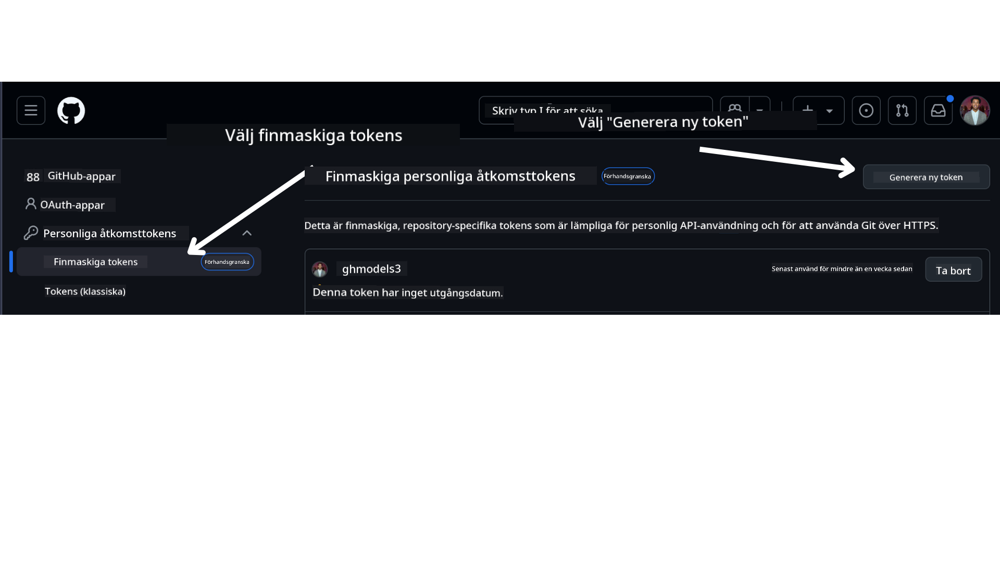

<!--
CO_OP_TRANSLATOR_METADATA:
{
  "original_hash": "76945069b52a49cd0432ae3e0b0ba22e",
  "translation_date": "2025-07-12T07:51:24+00:00",
  "source_file": "00-course-setup/README.md",
  "language_code": "sv"
}
-->
i ditt GitHub-konto.

Välj alternativet `Fine-grained tokens` på vänster sida av skärmen.

Välj sedan `Generate new token`.



Du kommer att bli ombedd att ange ett namn för din token, välja utgångsdatum (Rekommenderat: 30 dagar) och välja behörigheter för din token (Publika repositories).

Det är också nödvändigt att redigera behörigheterna för denna token: Permissions -> Models -> Tillåter åtkomst till GitHub Models

Kopiera din nya token som du just skapade. Du kommer nu att lägga till denna i din `.env`-fil som ingår i denna kurs.

### Steg 2: Skapa din `.env`-fil

För att skapa din `.env`-fil, kör följande kommando i din terminal.

```bash
cp .env.example .env
```

Detta kopierar exempel-filen och skapar en `.env` i din katalog där du fyller i värdena för miljövariablerna.

Med din token kopierad, öppna `.env`-filen i din favorittextredigerare och klistra in din token i fältet `GITHUB_TOKEN`.

Du bör nu kunna köra kodexemplen i denna kurs.

## Uppställning för exempel som använder Azure AI Foundry och Azure AI Agent Service

### Steg 1: Hämta din Azure-projekts slutpunkt

Följ stegen för att skapa en hubb och ett projekt i Azure AI Foundry som finns här: [Hub resources overview](https://learn.microsoft.com/en-us/azure/ai-foundry/concepts/ai-resources)

När du har skapat ditt projekt behöver du hämta anslutningssträngen för ditt projekt.

Detta görs genom att gå till **Overview**-sidan för ditt projekt i Azure AI Foundry-portalen.


### Steg 2: Skapa din `.env`-fil

För att skapa din `.env`-fil, kör följande kommando i din terminal.

```bash
cp .env.example .env
```

Detta kopierar exempel-filen och skapar en `.env` i din katalog där du fyller i värdena för miljövariablerna.

Med din token kopierad, öppna `.env`-filen i din favorittextredigerare och klistra in din token i fältet `PROJECT_ENDPOINT`.

### Steg 3: Logga in på Azure

Som en säkerhetspraxis kommer vi att använda [keyless authentication](https://learn.microsoft.com/azure/developer/ai/keyless-connections?tabs=csharp%2Cazure-cli?WT.mc_id=academic-105485-koreyst) för att autentisera mot Azure OpenAI med Microsoft Entra ID. Innan du kan göra detta behöver du först installera **Azure CLI** enligt [installationsinstruktionerna](https://learn.microsoft.com/cli/azure/install-azure-cli?WT.mc_id=academic-105485-koreyst) för ditt operativsystem.

Öppna sedan en terminal och kör `az login --use-device-code` för att logga in på ditt Azure-konto.

När du har loggat in, välj din prenumeration i terminalen.

## Ytterligare miljövariabler - Azure Search och Azure OpenAI

För Agentic RAG-lektionen - Lektion 5 - finns det exempel som använder Azure Search och Azure OpenAI.

Om du vill köra dessa exempel behöver du lägga till följande miljövariabler i din `.env`-fil:

### Översiktssida (Projekt)

- `AZURE_SUBSCRIPTION_ID` - Kontrollera **Project details** på **Overview**-sidan för ditt projekt.

- `AZURE_AI_PROJECT_NAME` - Titta högst upp på **Overview**-sidan för ditt projekt.

- `AZURE_OPENAI_SERVICE` - Finns under fliken **Included capabilities** för **Azure OpenAI Service** på **Overview**-sidan.

### Management Center

- `AZURE_OPENAI_RESOURCE_GROUP` - Gå till **Project properties** på **Overview**-sidan i **Management Center**.

- `GLOBAL_LLM_SERVICE` - Under **Connected resources**, hitta anslutningsnamnet för **Azure AI Services**. Om det inte finns listat, kontrollera i **Azure-portalen** under din resursgrupp för AI Services-resursens namn.

### Models + Endpoints-sida

- `AZURE_OPENAI_EMBEDDING_DEPLOYMENT_NAME` - Välj din embedding-modell (t.ex. `text-embedding-ada-002`) och notera **Deployment name** från modellens detaljer.

- `AZURE_OPENAI_CHAT_DEPLOYMENT_NAME` - Välj din chattmodell (t.ex. `gpt-4o-mini`) och notera **Deployment name** från modellens detaljer.

### Azure-portalen

- `AZURE_OPENAI_ENDPOINT` - Leta efter **Azure AI services**, klicka på den, gå till **Resource Management**, **Keys and Endpoint**, scrolla ner till "Azure OpenAI endpoints" och kopiera den som heter "Language APIs".

- `AZURE_OPENAI_API_KEY` - Från samma skärm, kopiera KEY 1 eller KEY 2.

- `AZURE_SEARCH_SERVICE_ENDPOINT` - Hitta din **Azure AI Search**-resurs, klicka på den och se **Overview**.

- `AZURE_SEARCH_API_KEY` - Gå sedan till **Settings** och därefter **Keys** för att kopiera primär eller sekundär administratörsnyckel.

### Extern webbsida

- `AZURE_OPENAI_API_VERSION` - Besök sidan [API version lifecycle](https://learn.microsoft.com/en-us/azure/ai-services/openai/api-version-deprecation#latest-ga-api-release) under **Latest GA API release**.

### Ställ in keyless authentication

Istället för att hårdkoda dina autentiseringsuppgifter kommer vi att använda en keyless-anslutning med Azure OpenAI. För att göra detta importerar vi `DefaultAzureCredential` och anropar senare funktionen `DefaultAzureCredential` för att hämta autentiseringsuppgifterna.

```python
from azure.identity import DefaultAzureCredential, InteractiveBrowserCredential
```

## Fastnat någonstans?

Om du har problem med att köra denna uppsättning, hoppa in i vår

eller

.

## Nästa lektion

Du är nu redo att köra koden för denna kurs. Lycka till med att lära dig mer om AI-agenter!

[Introduction to AI Agents and Agent Use Cases](../01-intro-to-ai-agents/README.md)

**Ansvarsfriskrivning**:  
Detta dokument har översatts med hjälp av AI-översättningstjänsten [Co-op Translator](https://github.com/Azure/co-op-translator). Även om vi strävar efter noggrannhet, vänligen observera att automatiska översättningar kan innehålla fel eller brister. Det ursprungliga dokumentet på dess modersmål bör betraktas som den auktoritativa källan. För kritisk information rekommenderas professionell mänsklig översättning. Vi ansvarar inte för några missförstånd eller feltolkningar som uppstår till följd av användningen av denna översättning.