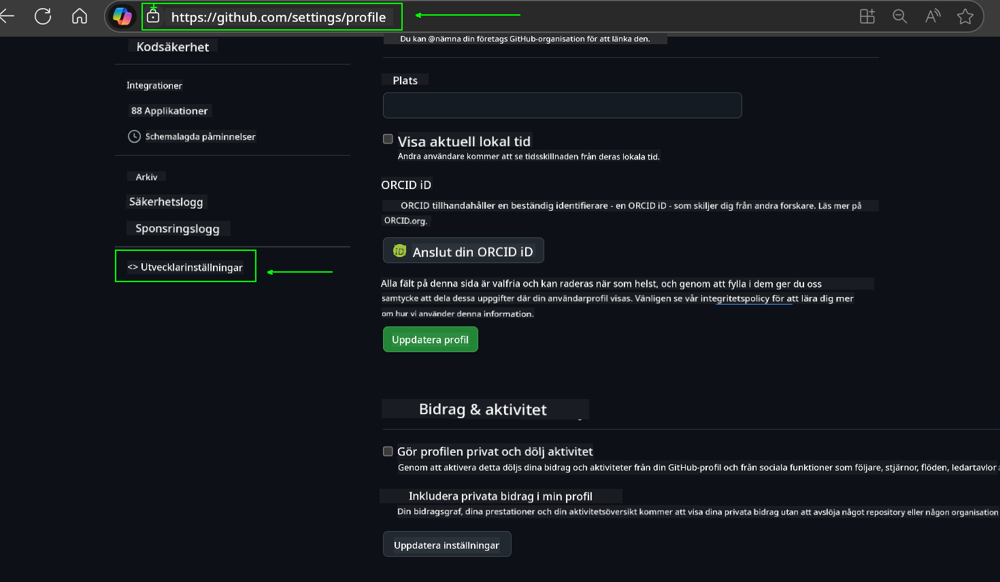
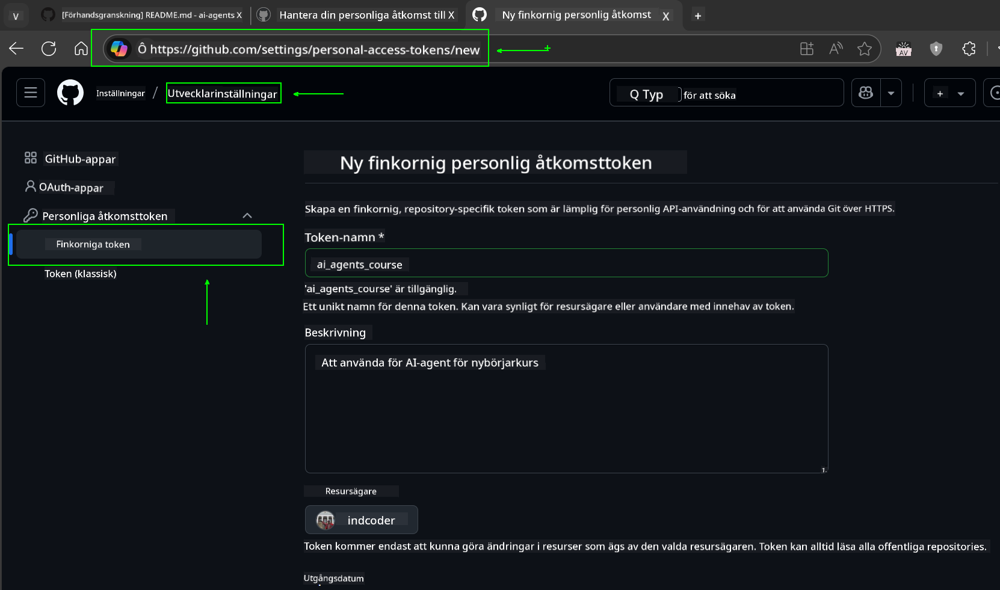
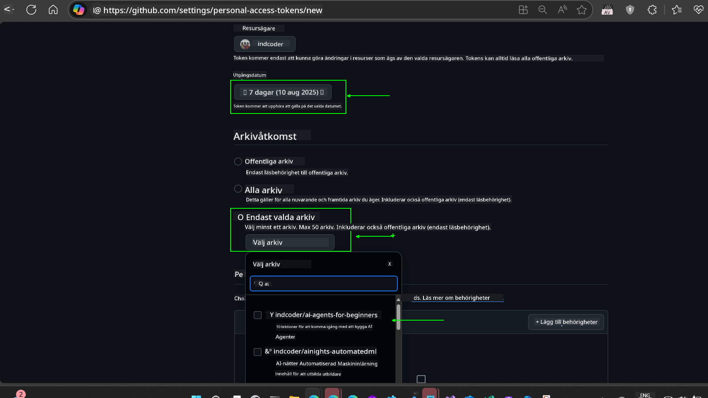
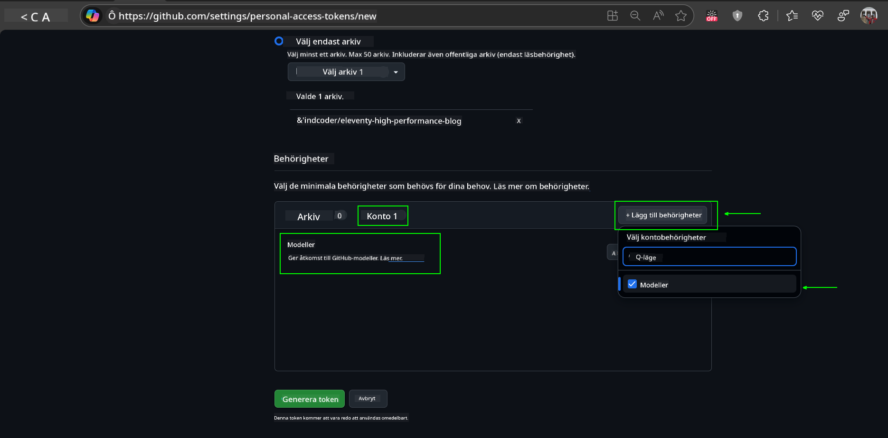
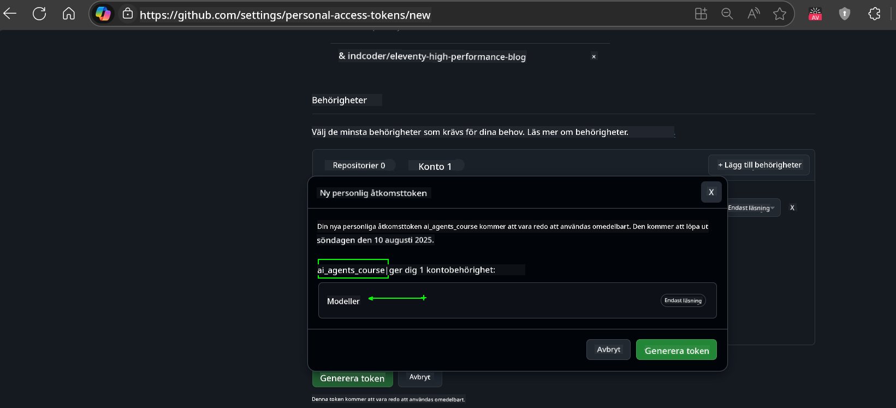
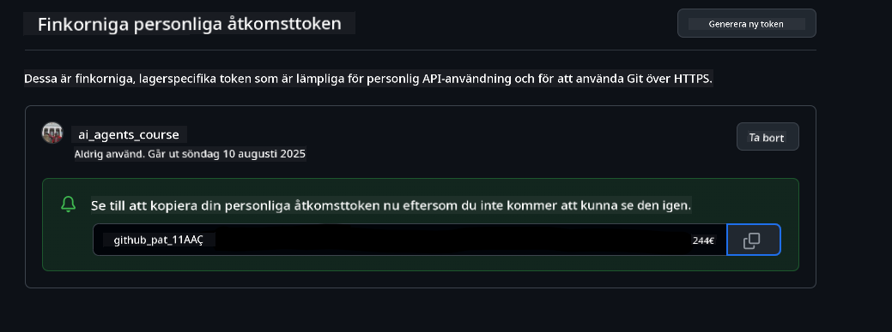
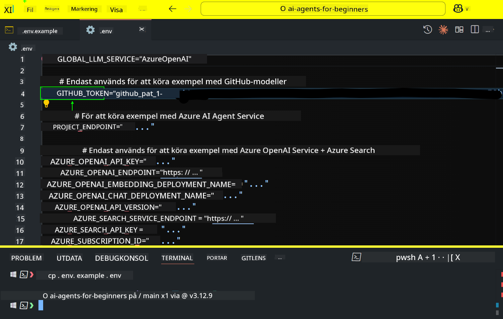

<!--
CO_OP_TRANSLATOR_METADATA:
{
  "original_hash": "c55b973b1562abf5aadf6a4028265ac5",
  "translation_date": "2025-08-29T15:26:13+00:00",
  "source_file": "00-course-setup/README.md",
  "language_code": "sv"
}
-->
# Kursinställning

## Introduktion

Den här lektionen kommer att täcka hur du kör kodexemplen i denna kurs.

## Gå med andra deltagare och få hjälp

Innan du börjar klona ditt repo, gå med i [AI Agents For Beginners Discord-kanalen](https://aka.ms/ai-agents/discord) för att få hjälp med inställningen, ställa frågor om kursen eller ansluta med andra deltagare.

## Klona eller förgrena detta repo

För att börja, klona eller förgrena GitHub-repositoriet. Detta skapar din egen version av kursmaterialet så att du kan köra, testa och justera koden!

Detta kan göras genom att klicka på länken till

Du bör nu ha din egen förgrenade version av denna kurs på följande länk:


## Köra koden

Denna kurs erbjuder en serie Jupyter Notebooks som du kan köra för att få praktisk erfarenhet av att bygga AI-agenter.

Kodexemplen använder antingen:

**Kräver GitHub-konto - Gratis**:

1) Semantic Kernel Agent Framework + GitHub Models Marketplace. Märkt som (semantic-kernel.ipynb)
2) AutoGen Framework + GitHub Models Marketplace. Märkt som (autogen.ipynb)

**Kräver Azure-abonnemang**:
3) Azure AI Foundry + Azure AI Agent Service. Märkt som (azureaiagent.ipynb)

Vi uppmuntrar dig att prova alla tre typer av exempel för att se vilken som fungerar bäst för dig.

Vilket alternativ du än väljer kommer att avgöra vilka installationssteg du behöver följa nedan:

## Krav

- Python 3.12+
  - **OBS**: Om du inte har Python 3.12 installerat, se till att installera det. Skapa sedan din venv med python3.12 för att säkerställa att rätt versioner installeras från filen requirements.txt.
- Ett GitHub-konto - För åtkomst till GitHub Models Marketplace
- Azure-abonnemang - För åtkomst till Azure AI Foundry
- Azure AI Foundry-konto - För åtkomst till Azure AI Agent Service

Vi har inkluderat en `requirements.txt`-fil i rotkatalogen för detta repo som innehåller alla nödvändiga Python-paket för att köra kodexemplen.

Du kan installera dem genom att köra följande kommando i din terminal vid rotkatalogen för repositoriet:

```bash
pip install -r requirements.txt
```
Vi rekommenderar att du skapar en Python-virtuell miljö för att undvika konflikter och problem.

## Installera VSCode
Se till att du använder rätt version av Python i VSCode.


## Inställning för exempel med GitHub-modeller

### Steg 1: Hämta din GitHub Personal Access Token (PAT)

Denna kurs använder GitHub Models Marketplace, som ger gratis åtkomst till Large Language Models (LLMs) som du kommer att använda för att bygga AI-agenter.

För att använda GitHub-modellerna måste du skapa en [GitHub Personal Access Token](https://docs.github.com/en/authentication/keeping-your-account-and-data-secure/managing-your-personal-access-tokens).

Detta kan göras genom att gå till ditt GitHub-konto.

Följ [Principen om minst privilegium](https://docs.github.com/en/get-started/learning-to-code/storing-your-secrets-safely) när du skapar din token. Detta innebär att du endast ska ge token de behörigheter som behövs för att köra kodexemplen i denna kurs.

1. Välj alternativet `Fine-grained tokens` på vänster sida av skärmen genom att navigera till **Developer settings**.
   

    Välj sedan `Generate new token`.

    

2. Ange ett beskrivande namn för din token som reflekterar dess syfte, vilket gör det enkelt att identifiera senare.

    🔐 Rekommendation för tokenens varaktighet

    Rekommenderad varaktighet: 30 dagar  
    För en säkrare inställning kan du välja en kortare period—som 7 dagar 🛡️  
    Det är ett bra sätt att sätta ett personligt mål och slutföra kursen medan din lärandeenergi är hög 🚀.

    

3. Begränsa tokenens räckvidd till din förgrening av detta repo.

    

4. Begränsa tokenens behörigheter: Under **Permissions**, klicka på fliken **Account** och klicka på knappen "+ Add permissions". En dropdown-meny kommer att visas. Sök efter **Models** och markera rutan för det.
    

5. Verifiera de behörigheter som krävs innan du genererar token. 

6. Innan du genererar token, se till att du är redo att lagra token på en säker plats som en lösenordshanterare, eftersom den inte kommer att visas igen efter att du har skapat den. 

Kopiera din nya token som du just har skapat. Du kommer nu att lägga till detta i din `.env`-fil som ingår i denna kurs.

### Steg 2: Skapa din `.env`-fil

För att skapa din `.env`-fil, kör följande kommando i din terminal.

```bash
cp .env.example .env
```

Detta kommer att kopiera exempel-filen och skapa en `.env` i din katalog där du fyller i värdena för miljövariablerna.

Med din token kopierad, öppna `.env`-filen i din favorittextredigerare och klistra in din token i fältet `GITHUB_TOKEN`.  


Du bör nu kunna köra kodexemplen i denna kurs.

## Inställning för exempel med Azure AI Foundry och Azure AI Agent Service

### Steg 1: Hämta din Azure-projektendpoint

Följ stegen för att skapa en hub och projekt i Azure AI Foundry som finns här: [Hub-resurser översikt](https://learn.microsoft.com/en-us/azure/ai-foundry/concepts/ai-resources)

När du har skapat ditt projekt måste du hämta anslutningssträngen för ditt projekt.

Detta kan göras genom att gå till **Översikt**-sidan för ditt projekt i Azure AI Foundry-portalen.


### Steg 2: Skapa din `.env`-fil

För att skapa din `.env`-fil, kör följande kommando i din terminal.

```bash
cp .env.example .env
```

Detta kommer att kopiera exempel-filen och skapa en `.env` i din katalog där du fyller i värdena för miljövariablerna.

Med din token kopierad, öppna `.env`-filen i din favorittextredigerare och klistra in din token i fältet `PROJECT_ENDPOINT`.

### Steg 3: Logga in på Azure

Som en säkerhetsbästa praxis kommer vi att använda [nyckellös autentisering](https://learn.microsoft.com/azure/developer/ai/keyless-connections?tabs=csharp%2Cazure-cli?WT.mc_id=academic-105485-koreyst) för att autentisera till Azure OpenAI med Microsoft Entra ID.

Öppna sedan en terminal och kör `az login --use-device-code` för att logga in på ditt Azure-konto.

När du har loggat in, välj ditt abonnemang i terminalen.

## Ytterligare miljövariabler - Azure Search och Azure OpenAI

För lektionen Agentic RAG - Lektion 5 - finns det exempel som använder Azure Search och Azure OpenAI.

Om du vill köra dessa exempel måste du lägga till följande miljövariabler i din `.env`-fil:

### Översiktssida (Projekt)

- `AZURE_SUBSCRIPTION_ID` - Kontrollera **Projektinformation** på **Översikt**-sidan för ditt projekt.

- `AZURE_AI_PROJECT_NAME` - Titta längst upp på **Översikt**-sidan för ditt projekt.

- `AZURE_OPENAI_SERVICE` - Hitta detta i fliken **Inkluderade funktioner** för **Azure OpenAI Service** på **Översikt**-sidan.

### Hanteringscenter

- `AZURE_OPENAI_RESOURCE_GROUP` - Gå till **Projektinställningar** på **Översikt**-sidan för **Hanteringscenter**.

- `GLOBAL_LLM_SERVICE` - Under **Anslutna resurser**, hitta anslutningsnamnet för **Azure AI Services**. Om det inte listas, kontrollera **Azure-portalen** under din resursgrupp för AI Services-resursnamnet.

### Models + Endpoints-sida

- `AZURE_OPENAI_EMBEDDING_DEPLOYMENT_NAME` - Välj din embedding-modell (t.ex. `text-embedding-ada-002`) och notera **Deployment name** från modellinformationen.

- `AZURE_OPENAI_CHAT_DEPLOYMENT_NAME` - Välj din chat-modell (t.ex. `gpt-4o-mini`) och notera **Deployment name** från modellinformationen.

### Azure Portal

- `AZURE_OPENAI_ENDPOINT` - Leta efter **Azure AI Services**, klicka på det, gå sedan till **Resurshantering**, **Nycklar och Endpoint**, scrolla ner till "Azure OpenAI endpoints" och kopiera den som säger "Language APIs".

- `AZURE_OPENAI_API_KEY` - Från samma skärm, kopiera KEY 1 eller KEY 2.

- `AZURE_SEARCH_SERVICE_ENDPOINT` - Hitta din **Azure AI Search**-resurs, klicka på den och se **Översikt**.

- `AZURE_SEARCH_API_KEY` - Gå sedan till **Inställningar** och sedan **Nycklar** för att kopiera den primära eller sekundära administratörsnyckeln.

### Extern webbsida

- `AZURE_OPENAI_API_VERSION` - Besök sidan [API-versionens livscykel](https://learn.microsoft.com/en-us/azure/ai-services/openai/api-version-deprecation#latest-ga-api-release) under **Senaste GA API-release**.

### Ställ in nyckellös autentisering

Istället för att hårdkoda dina autentiseringsuppgifter kommer vi att använda en nyckellös anslutning med Azure OpenAI. För att göra detta kommer vi att importera `DefaultAzureCredential` och senare kalla på funktionen `DefaultAzureCredential` för att få autentiseringen.

```python
from azure.identity import DefaultAzureCredential, InteractiveBrowserCredential
```

## Fastnat någonstans?

Om du har några problem med att köra denna inställning, hoppa in i vår

eller.

## Nästa lektion

Du är nu redo att köra koden för denna kurs. Lycka till med att lära dig mer om AI-agenter!  

[Introduktion till AI-agenter och användningsfall för agenter](../01-intro-to-ai-agents/README.md)

---

**Ansvarsfriskrivning**:  
Detta dokument har översatts med hjälp av AI-översättningstjänsten [Co-op Translator](https://github.com/Azure/co-op-translator). Även om vi strävar efter noggrannhet, vänligen notera att automatiska översättningar kan innehålla fel eller felaktigheter. Det ursprungliga dokumentet på dess originalspråk bör betraktas som den auktoritativa källan. För kritisk information rekommenderas professionell mänsklig översättning. Vi ansvarar inte för eventuella missförstånd eller feltolkningar som uppstår vid användning av denna översättning.