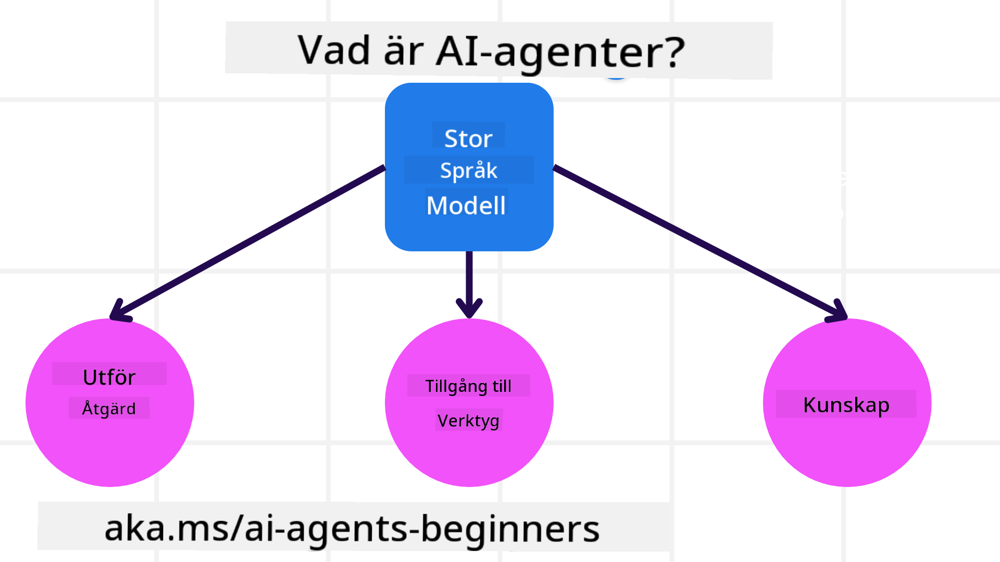
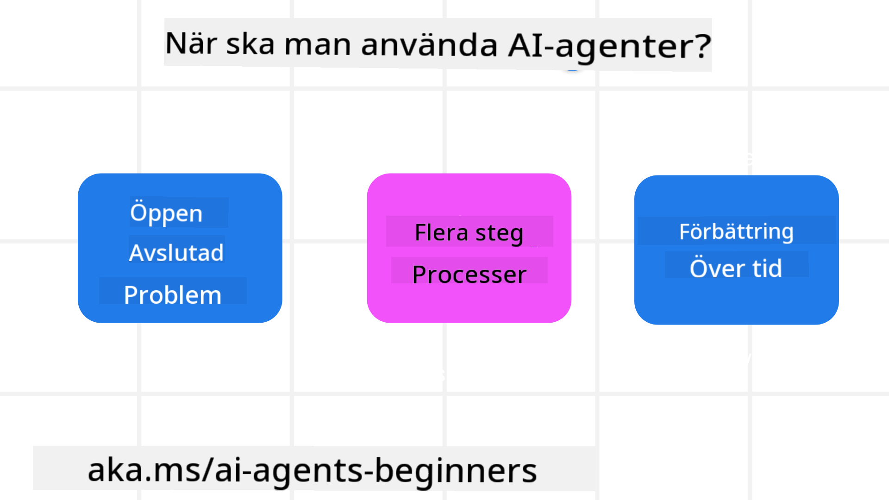

<!--
CO_OP_TRANSLATOR_METADATA:
{
  "original_hash": "d84943abc8f001ad4670418d32c2d899",
  "translation_date": "2025-07-12T08:07:42+00:00",
  "source_file": "01-intro-to-ai-agents/README.md",
  "language_code": "sv"
}
-->
för att träffa andra deltagare och AI Agent-byggare samt ställa frågor om kursen.

För att starta denna kurs börjar vi med att få en bättre förståelse för vad AI Agents är och hur vi kan använda dem i de applikationer och arbetsflöden vi bygger.

## Introduktion

Denna lektion täcker:

- Vad är AI Agents och vilka olika typer av agenter finns det?
- Vilka användningsfall passar bäst för AI Agents och hur kan de hjälpa oss?
- Vilka är några av de grundläggande byggstenarna när man designar agentbaserade lösningar?

## Lärandemål
Efter att ha genomfört denna lektion ska du kunna:

- Förstå AI Agent-koncept och hur de skiljer sig från andra AI-lösningar.
- Använda AI Agents på ett effektivt sätt.
- Designa agentbaserade lösningar produktivt för både användare och kunder.

## Definition av AI Agents och typer av AI Agents

### Vad är AI Agents?

AI Agents är **system** som gör det möjligt för **Large Language Models (LLMs)** att **utföra handlingar** genom att utöka deras kapabiliteter genom att ge LLMs **åtkomst till verktyg** och **kunskap**.

Låt oss bryta ner denna definition i mindre delar:

- **System** – Det är viktigt att tänka på agenter inte bara som en enskild komponent utan som ett system av många komponenter. På grundläggande nivå är komponenterna i en AI Agent:
  - **Miljö** – Det definierade utrymmet där AI Agenten verkar. Till exempel, om vi hade en reseboknings-AI Agent, kan miljön vara resebokningssystemet som AI Agenten använder för att slutföra uppgifter.
  - **Sensorer** – Miljöer har information och ger feedback. AI Agents använder sensorer för att samla in och tolka denna information om miljöns aktuella tillstånd. I exemplet med resebokningsagenten kan systemet ge information som hotell tillgänglighet eller flygpriser.
  - **Aktuatorer** – När AI Agenten mottagit miljöns aktuella tillstånd, avgör agenten för den aktuella uppgiften vilken handling som ska utföras för att förändra miljön. För resebokningsagenten kan det vara att boka ett tillgängligt rum åt användaren.

**Large Language Models** – Agentkonceptet fanns innan LLMs skapades. Fördelen med att bygga AI Agents med LLMs är deras förmåga att tolka mänskligt språk och data. Denna förmåga gör det möjligt för LLMs att tolka miljöinformation och definiera en plan för att förändra miljön.

**Utföra handlingar** – Utanför AI Agent-system är LLMs begränsade till situationer där handlingen är att generera innehåll eller information baserat på en användares prompt. Inom AI Agent-system kan LLMs utföra uppgifter genom att tolka användarens begäran och använda verktyg som finns tillgängliga i deras miljö.

**Åtkomst till verktyg** – Vilka verktyg LLM har tillgång till definieras av 1) miljön den verkar i och 2) utvecklaren av AI Agenten. I vårt exempel med reseagenten är agentens verktyg begränsade till de operationer som finns i bokningssystemet, och/eller kan utvecklaren begränsa agentens verktygsåtkomst till flyg.

**Minne + Kunskap** – Minne kan vara kortsiktigt i kontexten av samtalet mellan användaren och agenten. På lång sikt, utöver informationen som miljön tillhandahåller, kan AI Agents också hämta kunskap från andra system, tjänster, verktyg och till och med andra agenter. I reseagentexemplet kan denna kunskap vara information om användarens resepreferenser som finns i en kunddatabas.

### Olika typer av agenter

Nu när vi har en allmän definition av AI Agents, låt oss titta på några specifika agenttyper och hur de skulle tillämpas på en reseboknings-AI agent.

| **Agenttyp**                  | **Beskrivning**                                                                                                                      | **Exempel**                                                                                                                                                                                                                  |
| ----------------------------- | ----------------------------------------------------------------------------------------------------------------------------------- | ---------------------------------------------------------------------------------------------------------------------------------------------------------------------------------------------------------------------------- |
| **Enkla reflexagenter**       | Utför omedelbara handlingar baserat på fördefinierade regler.                                                                        | Resagenten tolkar kontexten i ett e-postmeddelande och vidarebefordrar reseklagomål till kundtjänst.                                                                                                                         |
| **Modellbaserade reflexagenter** | Utför handlingar baserat på en modell av världen och förändringar i den modellen.                                                    | Resagenten prioriterar rutter med betydande prisförändringar baserat på tillgång till historisk prisdata.                                                                                                                   |
| **Målorienterade agenter**    | Skapar planer för att uppnå specifika mål genom att tolka målet och bestämma handlingar för att nå det.                             | Resagenten bokar en resa genom att bestämma nödvändiga researrangemang (bil, kollektivtrafik, flyg) från nuvarande plats till destination.                                                                                   |
| **Nytta-baserade agenter**    | Tar hänsyn till preferenser och väger avvägningar numeriskt för att avgöra hur mål ska uppnås.                                       | Resagenten maximerar nytta genom att väga bekvämlighet mot kostnad vid bokning av resa.                                                                                                                                     |
| **Lärande agenter**           | Förbättras över tid genom att svara på feedback och justera handlingar därefter.                                                     | Resagenten förbättras genom att använda kundfeedback från efterresenkäter för att göra justeringar i framtida bokningar.                                                                                                    |
| **Hierarkiska agenter**       | Har flera agenter i ett hierarkiskt system, där högre nivåer delar uppgifter i deluppgifter för lägre nivåer att slutföra.          | Resagenten avbokar en resa genom att dela upp uppgiften i deluppgifter (t.ex. avboka specifika bokningar) och låta lägre nivåers agenter slutföra dem och rapportera tillbaka till den högre nivån.                            |
| **Multi-Agent System (MAS)**  | Agenter slutför uppgifter självständigt, antingen samarbetsvilligt eller konkurrerande.                                              | Samarbete: Flera agenter bokar specifika resetjänster som hotell, flyg och underhållning. Konkurrens: Flera agenter hanterar och tävlar om en gemensam hotellbokningskalender för att boka kunder på hotellet.               |

## När ska man använda AI Agents

I det tidigare avsnittet använde vi reseagentens användningsfall för att förklara hur olika typer av agenter kan användas i olika scenarier för resebokning. Vi kommer att fortsätta använda denna applikation genom hela kursen.

Låt oss titta på vilka typer av användningsfall som AI Agents passar bäst för:

- **Öppna problem** – låta LLM bestämma vilka steg som behövs för att slutföra en uppgift eftersom det inte alltid går att hårdkoda i ett arbetsflöde.
- **Flerstegsprocesser** – uppgifter som kräver en viss komplexitet där AI Agenten behöver använda verktyg eller information över flera steg istället för att hämta allt på en gång.
- **Förbättring över tid** – uppgifter där agenten kan förbättras över tid genom att ta emot feedback från antingen sin miljö eller användare för att kunna erbjuda bättre nytta.

Vi tar upp fler överväganden kring användning av AI Agents i lektionen Bygga pålitliga AI Agents.

## Grunderna i agentbaserade lösningar

### Agentutveckling

Det första steget i att designa ett AI Agent-system är att definiera verktyg, handlingar och beteenden. I denna kurs fokuserar vi på att använda **Azure AI Agent Service** för att definiera våra agenter. Den erbjuder funktioner som:

- Val av öppna modeller som OpenAI, Mistral och Llama
- Användning av licensierad data genom leverantörer som Tripadvisor
- Användning av standardiserade OpenAPI 3.0-verktyg

### Agentmönster

Kommunikation med LLMs sker via prompts. Med tanke på AI Agents semi-autonoma natur är det inte alltid möjligt eller nödvändigt att manuellt skicka nya prompts till LLM efter en förändring i miljön. Vi använder **agentmönster** som gör det möjligt att prompta LLM över flera steg på ett mer skalbart sätt.

Denna kurs är indelad i några av de nu populära agentmönstren.

### Agentramverk

Agentramverk gör det möjligt för utvecklare att implementera agentmönster via kod. Dessa ramverk erbjuder mallar, plugins och verktyg för bättre samarbete mellan AI Agents. Dessa fördelar ger möjligheter till bättre observabilitet och felsökning av AI Agent-system.

I denna kurs kommer vi att utforska det forskningsdrivna AutoGen-ramverket och det produktionsklara Agent-ramverket från Semantic Kernel.

## Föregående lektion

[Course Setup](../00-course-setup/README.md)

## Nästa lektion

[Exploring Agentic Frameworks](../02-explore-agentic-frameworks/README.md)

**Ansvarsfriskrivning**:  
Detta dokument har översatts med hjälp av AI-översättningstjänsten [Co-op Translator](https://github.com/Azure/co-op-translator). Även om vi strävar efter noggrannhet, vänligen observera att automatiska översättningar kan innehålla fel eller brister. Det ursprungliga dokumentet på dess modersmål bör betraktas som den auktoritativa källan. För kritisk information rekommenderas professionell mänsklig översättning. Vi ansvarar inte för några missförstånd eller feltolkningar som uppstår vid användning av denna översättning.