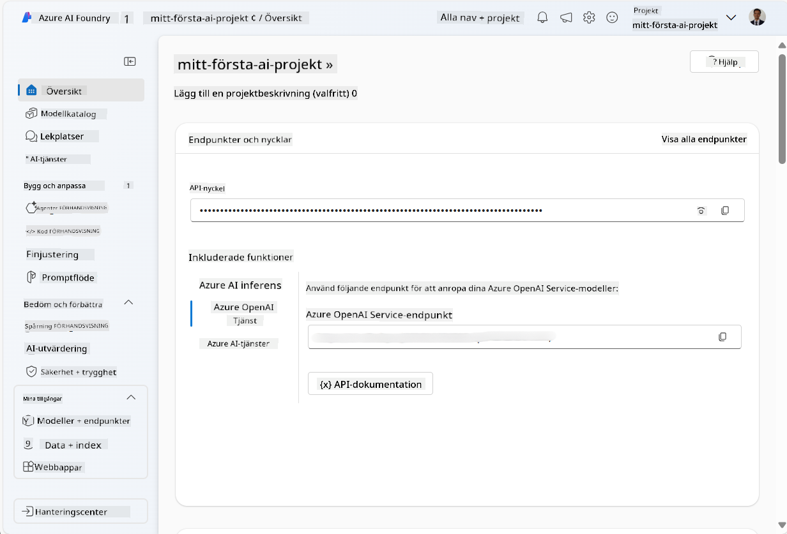
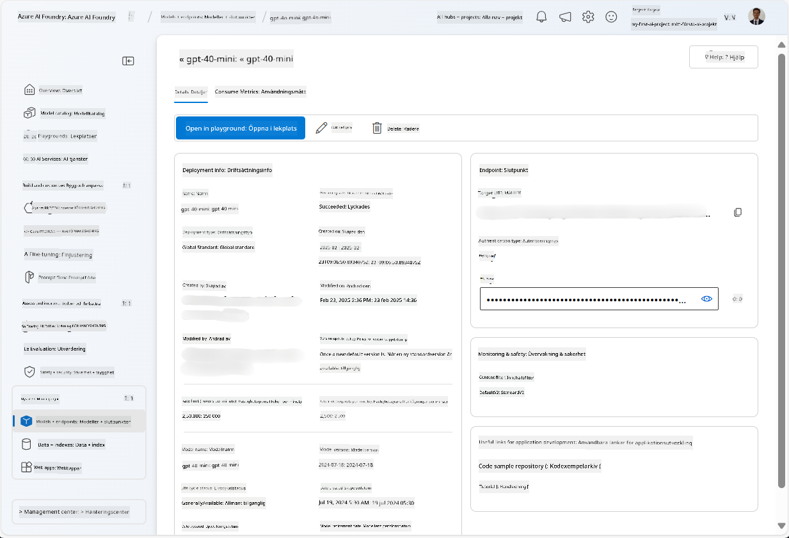
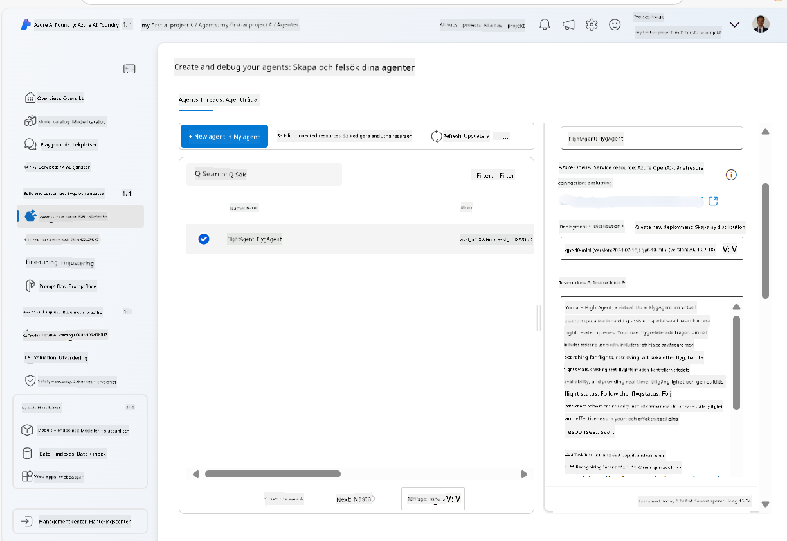
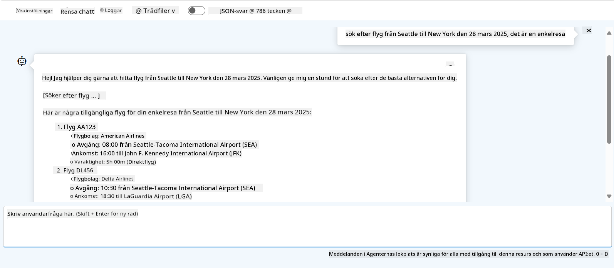

<!--
CO_OP_TRANSLATOR_METADATA:
{
  "original_hash": "7e92870dc0843e13d4dabc620c09d2d9",
  "translation_date": "2025-07-12T08:19:39+00:00",
  "source_file": "02-explore-agentic-frameworks/azure-ai-foundry-agent-creation.md",
  "language_code": "sv"
}
-->
# Azure AI Agent Service-utveckling

I denna övning använder du verktygen i Azure AI Agent-tjänsten i [Azure AI Foundry-portalen](https://ai.azure.com/?WT.mc_id=academic-105485-koreyst) för att skapa en agent för flygbokning. Agenten kommer att kunna interagera med användare och ge information om flyg.

## Förutsättningar

För att slutföra denna övning behöver du följande:
1. Ett Azure-konto med en aktiv prenumeration. [Skapa ett konto gratis](https://azure.microsoft.com/free/?WT.mc_id=academic-105485-koreyst).
2. Du behöver behörighet att skapa en Azure AI Foundry-hubb eller ha en skapad åt dig.
    - Om din roll är Contributor eller Owner kan du följa stegen i denna handledning.

## Skapa en Azure AI Foundry-hubb

> **Note:** Azure AI Foundry hette tidigare Azure AI Studio.

1. Följ riktlinjerna i [Azure AI Foundry](https://learn.microsoft.com/en-us/azure/ai-studio/?WT.mc_id=academic-105485-koreyst) blogginlägg för att skapa en Azure AI Foundry-hubb.
2. När ditt projekt är skapat, stäng eventuella tips som visas och granska projektsidan i Azure AI Foundry-portalen, som bör se ut ungefär som på bilden nedan:

    

## Distribuera en modell

1. I panelen till vänster för ditt projekt, under avsnittet **My assets**, välj sidan **Models + endpoints**.
2. På sidan **Models + endpoints**, under fliken **Model deployments**, välj i menyn **+ Deploy model** alternativet **Deploy base model**.
3. Sök efter modellen `gpt-4o-mini` i listan, välj den och bekräfta.

    > **Note**: Att minska TPM hjälper till att undvika överanvändning av kvoten i den prenumeration du använder.

    

## Skapa en agent

Nu när du har distribuerat en modell kan du skapa en agent. En agent är en konverserande AI-modell som kan användas för att interagera med användare.

1. I panelen till vänster för ditt projekt, under avsnittet **Build & Customize**, välj sidan **Agents**.
2. Klicka på **+ Create agent** för att skapa en ny agent. Under dialogrutan **Agent Setup**:
    - Ange ett namn för agenten, till exempel `FlightAgent`.
    - Se till att den modellutplacering `gpt-4o-mini` som du skapade tidigare är vald.
    - Ställ in **Instructions** enligt den prompt du vill att agenten ska följa. Här är ett exempel:
    ```
    You are FlightAgent, a virtual assistant specialized in handling flight-related queries. Your role includes assisting users with searching for flights, retrieving flight details, checking seat availability, and providing real-time flight status. Follow the instructions below to ensure clarity and effectiveness in your responses:

    ### Task Instructions:
    1. **Recognizing Intent**:
       - Identify the user's intent based on their request, focusing on one of the following categories:
         - Searching for flights
         - Retrieving flight details using a flight ID
         - Checking seat availability for a specified flight
         - Providing real-time flight status using a flight number
       - If the intent is unclear, politely ask users to clarify or provide more details.
        
    2. **Processing Requests**:
        - Depending on the identified intent, perform the required task:
        - For flight searches: Request details such as origin, destination, departure date, and optionally return date.
        - For flight details: Request a valid flight ID.
        - For seat availability: Request the flight ID and date and validate inputs.
        - For flight status: Request a valid flight number.
        - Perform validations on provided data (e.g., formats of dates, flight numbers, or IDs). If the information is incomplete or invalid, return a friendly request for clarification.

    3. **Generating Responses**:
    - Use a tone that is friendly, concise, and supportive.
    - Provide clear and actionable suggestions based on the output of each task.
    - If no data is found or an error occurs, explain it to the user gently and offer alternative actions (e.g., refine search, try another query).
    
    ```
> [!NOTE]
> För en mer detaljerad prompt kan du kolla in [detta repository](https://github.com/ShivamGoyal03/RoamMind) för mer information.
    
> Dessutom kan du lägga till **Knowledge Base** och **Actions** för att förbättra agentens förmåga att ge mer information och utföra automatiserade uppgifter baserat på användarens förfrågningar. För denna övning kan du hoppa över dessa steg.
    


3. För att skapa en ny multi-AI-agent, klicka helt enkelt på **New Agent**. Den nyss skapade agenten visas sedan på Agents-sidan.

## Testa agenten

Efter att ha skapat agenten kan du testa hur den svarar på användarfrågor i Azure AI Foundry-portals lekplats.

1. Överst i **Setup**-panelen för din agent, välj **Try in playground**.
2. I **Playground**-panelen kan du interagera med agenten genom att skriva frågor i chattfönstret. Till exempel kan du be agenten att söka efter flyg från Seattle till New York den 28:e.

    > **Note**: Agenten kanske inte ger exakta svar eftersom ingen realtidsdata används i denna övning. Syftet är att testa agentens förmåga att förstå och svara på användarfrågor baserat på de instruktioner som ges.

    

3. Efter att ha testat agenten kan du anpassa den ytterligare genom att lägga till fler intents, träningsdata och actions för att förbättra dess kapacitet.

## Rensa upp resurser

När du är klar med att testa agenten kan du ta bort den för att undvika extra kostnader.
1. Öppna [Azure-portalen](https://portal.azure.com) och visa innehållet i resursgruppen där du distribuerade hubbresurserna som användes i denna övning.
2. I verktygsfältet, välj **Delete resource group**.
3. Ange resursgruppens namn och bekräfta att du vill ta bort den.

## Resurser

- [Azure AI Foundry-dokumentation](https://learn.microsoft.com/en-us/azure/ai-studio/?WT.mc_id=academic-105485-koreyst)
- [Azure AI Foundry-portal](https://ai.azure.com/?WT.mc_id=academic-105485-koreyst)
- [Kom igång med Azure AI Studio](https://techcommunity.microsoft.com/blog/educatordeveloperblog/getting-started-with-azure-ai-studio/4095602?WT.mc_id=academic-105485-koreyst)
- [Grundläggande om AI-agenter på Azure](https://learn.microsoft.com/en-us/training/modules/ai-agent-fundamentals/?WT.mc_id=academic-105485-koreyst)
- [Azure AI Discord](https://aka.ms/AzureAI/Discord)

**Ansvarsfriskrivning**:  
Detta dokument har översatts med hjälp av AI-översättningstjänsten [Co-op Translator](https://github.com/Azure/co-op-translator). Även om vi strävar efter noggrannhet, vänligen observera att automatiska översättningar kan innehålla fel eller brister. Det ursprungliga dokumentet på dess modersmål bör betraktas som den auktoritativa källan. För kritisk information rekommenderas professionell mänsklig översättning. Vi ansvarar inte för några missförstånd eller feltolkningar som uppstår vid användning av denna översättning.