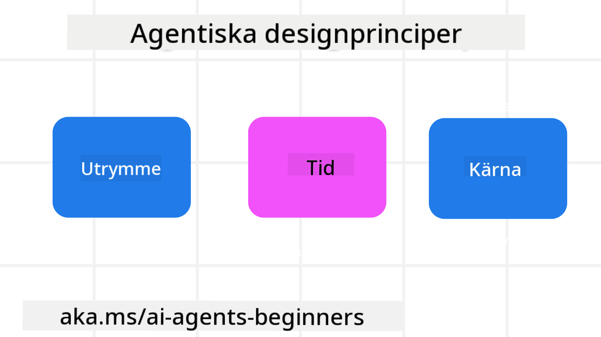

<!--
CO_OP_TRANSLATOR_METADATA:
{
  "original_hash": "4c46e4ff9e349c521e2b0b17f51afa64",
  "translation_date": "2025-08-29T15:32:25+00:00",
  "source_file": "03-agentic-design-patterns/README.md",
  "language_code": "sv"
}
-->

> _(Klicka på bilden ovan för att se videon för denna lektion)_
# Principer för agentisk AI-design

## Introduktion

Det finns många sätt att tänka kring att bygga agentiska AI-system. Eftersom tvetydighet är en funktion och inte en bugg i designen av generativ AI, kan det ibland vara svårt för ingenjörer att veta var de ska börja. Vi har skapat en uppsättning människocentrerade UX-designprinciper för att möjliggöra för utvecklare att bygga kundcentrerade agentiska system som löser deras affärsbehov. Dessa designprinciper är inte en föreskrivande arkitektur utan snarare en utgångspunkt för team som definierar och bygger agentupplevelser.

Generellt sett bör agenter:

- Bredda och skala mänskliga förmågor (idéutveckling, problemlösning, automatisering, etc.)
- Fylla kunskapsluckor (hjälpa mig att komma ikapp inom kunskapsområden, översättning, etc.)
- Underlätta och stödja samarbete på de sätt vi som individer föredrar att arbeta med andra
- Göra oss till bättre versioner av oss själva (t.ex. livscoach/uppgiftsmästare, hjälpa oss att lära oss emotionell reglering och mindfulness, bygga motståndskraft, etc.)

## Denna lektion kommer att täcka

- Vad är de agentiska designprinciperna
- Vilka riktlinjer bör följas vid implementering av dessa designprinciper
- Exempel på användning av designprinciperna

## Lärandemål

Efter att ha avslutat denna lektion kommer du att kunna:

1. Förklara vad de agentiska designprinciperna är
2. Förklara riktlinjerna för att använda de agentiska designprinciperna
3. Förstå hur man bygger en agent med hjälp av de agentiska designprinciperna

## De agentiska designprinciperna

### Agent (Plats)

Detta är miljön där agenten verkar. Dessa principer informerar hur vi designar agenter för att engagera sig i fysiska och digitala världar.

- **Koppla samman, inte kollapsa** – hjälp till att koppla människor till andra människor, händelser och användbar kunskap för att möjliggöra samarbete och anslutning.
- Agenter hjälper till att koppla samman händelser, kunskap och människor.
- Agenter för människor närmare varandra. De är inte designade för att ersätta eller förminska människor.
- **Lättillgänglig men ibland osynlig** – agenten verkar till stor del i bakgrunden och ger oss endast en knuff när det är relevant och lämpligt.
  - Agenten är lätt att upptäcka och tillgänglig för auktoriserade användare på alla enheter eller plattformar.
  - Agenten stödjer multimodala in- och utgångar (ljud, röst, text, etc.).
  - Agenten kan sömlöst växla mellan förgrund och bakgrund; mellan proaktiv och reaktiv, beroende på dess avkänning av användarens behov.
  - Agenten kan verka i osynlig form, men dess bakgrundsprocessväg och samarbete med andra agenter är transparenta och kontrollerbara av användaren.

### Agent (Tid)

Detta är hur agenten verkar över tid. Dessa principer informerar hur vi designar agenter som interagerar över det förflutna, nuet och framtiden.

- **Förflutet**: Reflektera över historik som inkluderar både tillstånd och kontext.
  - Agenten tillhandahåller mer relevanta resultat baserat på analys av rikare historiska data bortom endast händelsen, människor eller tillstånd.
  - Agenten skapar kopplingar från tidigare händelser och reflekterar aktivt över minnet för att engagera sig i aktuella situationer.
- **Nu**: Knuffa mer än notifiera.
  - Agenten förkroppsligar ett omfattande tillvägagångssätt för att interagera med människor. När en händelse inträffar går agenten bortom statisk notifiering eller annan statisk formalitet. Agenten kan förenkla flöden eller dynamiskt generera ledtrådar för att rikta användarens uppmärksamhet vid rätt tillfälle.
  - Agenten levererar information baserat på kontextuell miljö, sociala och kulturella förändringar och anpassad till användarens avsikt.
  - Agentens interaktion kan vara gradvis, utvecklas/växa i komplexitet för att stärka användaren på lång sikt.
- **Framtid**: Anpassa och utvecklas.
  - Agenten anpassar sig till olika enheter, plattformar och modaliteter.
  - Agenten anpassar sig till användarbeteende, tillgänglighetsbehov och är fritt anpassningsbar.
  - Agenten formas av och utvecklas genom kontinuerlig användarinteraktion.

### Agent (Kärna)

Detta är de centrala elementen i kärnan av en agents design.

- **Omfamna osäkerhet men etablera förtroende**.
  - En viss nivå av osäkerhet hos agenten är att förvänta. Osäkerhet är ett nyckelelement i agentdesign.
  - Förtroende och transparens är grundläggande lager i agentdesign.
  - Människor har kontroll över när agenten är på/av och agentens status är tydligt synlig hela tiden.

## Riktlinjer för att implementera dessa principer

När du använder de tidigare designprinciperna, följ dessa riktlinjer:

1. **Transparens**: Informera användaren om att AI är involverad, hur den fungerar (inklusive tidigare handlingar) och hur man ger feedback och modifierar systemet.
2. **Kontroll**: Gör det möjligt för användaren att anpassa, specificera preferenser och personalisera, samt ha kontroll över systemet och dess attribut (inklusive möjligheten att glömma).
3. **Konsekvens**: Sträva efter konsekventa, multimodala upplevelser över enheter och slutpunkter. Använd välbekanta UI/UX-element där det är möjligt (t.ex. mikrofonikon för röstinteraktion) och minska kundens kognitiva belastning så mycket som möjligt (t.ex. sträva efter kortfattade svar, visuella hjälpmedel och innehåll för "Läs mer").

## Hur man designar en reseagent med hjälp av dessa principer och riktlinjer

Föreställ dig att du designar en reseagent, här är hur du kan tänka kring att använda designprinciperna och riktlinjerna:

1. **Transparens** – Informera användaren om att reseagenten är en AI-driven agent. Ge några grundläggande instruktioner om hur man kommer igång (t.ex. ett "Hej"-meddelande, exempel på frågor). Dokumentera detta tydligt på produktsidan. Visa listan över frågor som användaren har ställt tidigare. Gör det tydligt hur man ger feedback (tummen upp och ner, Skicka feedback-knapp, etc.). Klargör om agenten har användnings- eller ämnesbegränsningar.
2. **Kontroll** – Se till att det är tydligt hur användaren kan modifiera agenten efter att den har skapats, med saker som systemprompten. Gör det möjligt för användaren att välja hur utförlig agenten är, dess skrivstil och eventuella förbehåll om vad agenten inte bör prata om. Tillåt användaren att visa och radera eventuella associerade filer eller data, frågor och tidigare konversationer.
3. **Konsekvens** – Se till att ikonerna för Dela fråga, lägga till en fil eller bild och tagga någon eller något är standardiserade och igenkännbara. Använd gemikonen för att indikera filuppladdning/delning med agenten och en bildikon för att indikera uppladdning av grafik.

### Har du fler frågor om agentiska AI-designmönster?

Gå med i [Azure AI Foundry Discord](https://aka.ms/ai-agents/discord) för att träffa andra elever, delta i öppet hus och få svar på dina frågor om AI-agenter.

## Ytterligare resurser

## Föregående lektion

[Utforska agentiska ramverk](../02-explore-agentic-frameworks/README.md)

## Nästa lektion

[Designmönster för verktygsanvändning](../04-tool-use/README.md)

---

**Ansvarsfriskrivning**:  
Detta dokument har översatts med hjälp av AI-översättningstjänsten [Co-op Translator](https://github.com/Azure/co-op-translator). Även om vi strävar efter noggrannhet, bör du vara medveten om att automatiska översättningar kan innehålla fel eller felaktigheter. Det ursprungliga dokumentet på dess originalspråk bör betraktas som den auktoritativa källan. För kritisk information rekommenderas professionell mänsklig översättning. Vi ansvarar inte för eventuella missförstånd eller feltolkningar som uppstår vid användning av denna översättning.