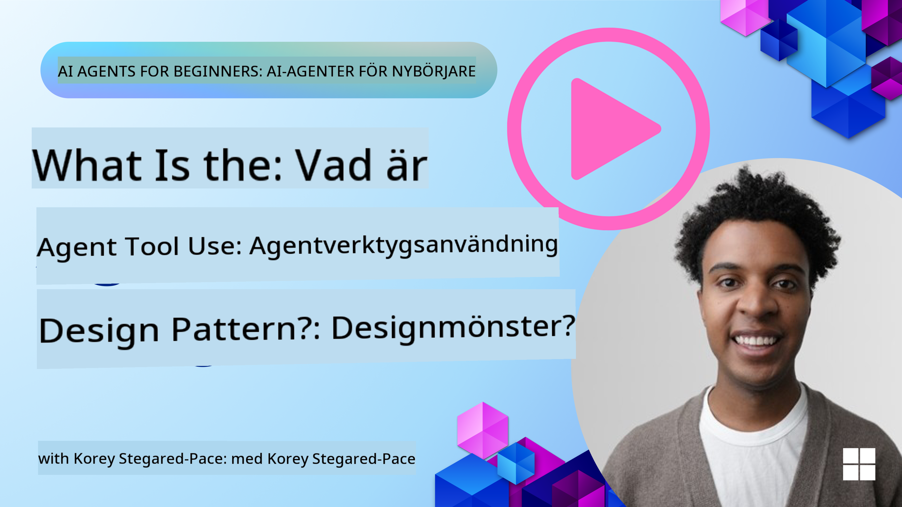
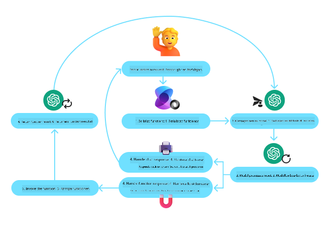

<!--
CO_OP_TRANSLATOR_METADATA:
{
  "original_hash": "88258b03f2893aa2e69eb8fb24baabbc",
  "translation_date": "2025-07-12T09:35:57+00:00",
  "source_file": "04-tool-use/README.md",
  "language_code": "sv"
}
-->
[](https://youtu.be/vieRiPRx-gI?si=cEZ8ApnT6Sus9rhn)

> _(Klicka på bilden ovan för att se videon för denna lektion)_

# Designmönstret för verktygsanvändning

Verktyg är intressanta eftersom de ger AI-agenter en bredare uppsättning möjligheter. Istället för att agenten bara har en begränsad mängd åtgärder den kan utföra, kan agenten genom att lägga till ett verktyg nu utföra en mängd olika handlingar. I detta kapitel kommer vi att titta på designmönstret för verktygsanvändning, som beskriver hur AI-agenter kan använda specifika verktyg för att nå sina mål.

## Introduktion

I denna lektion vill vi besvara följande frågor:

- Vad är designmönstret för verktygsanvändning?
- Vilka användningsområden kan det tillämpas på?
- Vilka element/byggstenar behövs för att implementera designmönstret?
- Vilka särskilda överväganden finns vid användning av designmönstret för verktygsanvändning för att bygga pålitliga AI-agenter?

## Lärandemål

Efter att ha genomfört denna lektion kommer du att kunna:

- Definiera designmönstret för verktygsanvändning och dess syfte.
- Identifiera användningsfall där designmönstret för verktygsanvändning är tillämpligt.
- Förstå de viktigaste elementen som behövs för att implementera designmönstret.
- Känna igen överväganden för att säkerställa pålitlighet hos AI-agenter som använder detta designmönster.

## Vad är designmönstret för verktygsanvändning?

**Designmönstret för verktygsanvändning** fokuserar på att ge LLM:er möjlighet att interagera med externa verktyg för att uppnå specifika mål. Verktyg är kod som kan köras av en agent för att utföra handlingar. Ett verktyg kan vara en enkel funktion som en kalkylator, eller ett API-anrop till en tredjepartstjänst som aktiekursuppslagning eller väderprognos. I AI-agenters sammanhang är verktyg designade för att köras av agenter som svar på **modellgenererade funktionsanrop**.

## Vilka användningsområden kan det tillämpas på?

AI-agenter kan använda verktyg för att slutföra komplexa uppgifter, hämta information eller fatta beslut. Designmönstret för verktygsanvändning används ofta i scenarier som kräver dynamisk interaktion med externa system, såsom databaser, webbtjänster eller kodtolkare. Denna förmåga är användbar för flera olika användningsfall, inklusive:

- **Dynamisk informationshämtning:** Agenter kan fråga externa API:er eller databaser för att hämta uppdaterad data (t.ex. fråga en SQLite-databas för dataanalys, hämta aktiekurser eller väderinformation).
- **Kodkörning och tolkning:** Agenter kan köra kod eller skript för att lösa matematiska problem, generera rapporter eller utföra simuleringar.
- **Automatisering av arbetsflöden:** Automatisera repetitiva eller flerstegsarbetsflöden genom att integrera verktyg som schemaläggare, e-posttjänster eller datapipelines.
- **Kundsupport:** Agenter kan interagera med CRM-system, ärendehanteringsplattformar eller kunskapsdatabaser för att lösa användarfrågor.
- **Innehållsgenerering och redigering:** Agenter kan använda verktyg som grammatikkontroller, textsammanfattare eller innehållssäkerhetsutvärderare för att hjälpa till med innehållsskapande.

## Vilka element/byggstenar behövs för att implementera designmönstret för verktygsanvändning?

Dessa byggstenar gör det möjligt för AI-agenten att utföra en mängd olika uppgifter. Låt oss titta på de viktigaste elementen som behövs för att implementera designmönstret för verktygsanvändning:

- **Funktions-/verktygsscheman**: Detaljerade definitioner av tillgängliga verktyg, inklusive funktionsnamn, syfte, nödvändiga parametrar och förväntade utdata. Dessa scheman gör det möjligt för LLM att förstå vilka verktyg som finns och hur man konstruerar giltiga förfrågningar.

- **Logik för funktionskörning**: Styr hur och när verktyg anropas baserat på användarens avsikt och konversationens kontext. Detta kan inkludera planeringsmoduler, routningsmekanismer eller villkorliga flöden som dynamiskt bestämmer verktygsanvändning.

- **Meddelandehanteringssystem**: Komponenter som hanterar konversationsflödet mellan användarinmatningar, LLM-svar, verktygsanrop och verktygsutdata.

- **Verktygsintegrationsramverk**: Infrastruktur som kopplar agenten till olika verktyg, vare sig det är enkla funktioner eller komplexa externa tjänster.

- **Felhante­ring och validering**: Mekanismer för att hantera fel vid verktygskörning, validera parametrar och hantera oväntade svar.

- **Tillståndshantering**: Spårar konversationskontext, tidigare verktygsinteraktioner och persistent data för att säkerställa konsekvens över flera interaktioner.

Nästa steg är att titta närmare på Funktions-/verktygsanrop.

### Funktions-/verktygsanrop

Funktionsanrop är det huvudsakliga sättet vi möjliggör för stora språkmodeller (LLM) att interagera med verktyg. Du kommer ofta att se 'funktion' och 'verktyg' användas omväxlande eftersom 'funktioner' (återanvändbara kodblock) är de 'verktyg' som agenter använder för att utföra uppgifter. För att en funktionskod ska kunna anropas måste LLM jämföra användarens förfrågan med funktionens beskrivning. För detta skickas ett schema som innehåller beskrivningar av alla tillgängliga funktioner till LLM. LLM väljer sedan den mest lämpliga funktionen för uppgiften och returnerar dess namn och argument. Den valda funktionen anropas, dess svar skickas tillbaka till LLM, som använder informationen för att svara på användarens förfrågan.

För utvecklare som vill implementera funktionsanrop för agenter behövs:

1. En LLM-modell som stödjer funktionsanrop
2. Ett schema med funktionsbeskrivningar
3. Koden för varje beskriven funktion

Låt oss använda exemplet att hämta aktuell tid i en stad för att illustrera:

1. **Initiera en LLM som stödjer funktionsanrop:**

    Inte alla modeller stödjer funktionsanrop, så det är viktigt att kontrollera att den LLM du använder gör det. <a href="https://learn.microsoft.com/azure/ai-services/openai/how-to/function-calling" target="_blank">Azure OpenAI</a> stödjer funktionsanrop. Vi kan börja med att initiera Azure OpenAI-klienten.

    ```python
    # Initialize the Azure OpenAI client
    client = AzureOpenAI(
        azure_endpoint = os.getenv("AZURE_OPENAI_ENDPOINT"), 
        api_key=os.getenv("AZURE_OPENAI_API_KEY"),  
        api_version="2024-05-01-preview"
    )
    ```

1. **Skapa ett funktionsschema:**

    Nästa steg är att definiera ett JSON-schema som innehåller funktionsnamnet, en beskrivning av vad funktionen gör, samt namn och beskrivningar av funktionsparametrarna. Vi skickar sedan detta schema till klienten som skapades tidigare, tillsammans med användarens förfrågan att hitta tiden i San Francisco. Det viktiga att notera är att ett **verktygsanrop** är vad som returneras, **inte** det slutgiltiga svaret på frågan. Som nämnts tidigare returnerar LLM namnet på den funktion den valt för uppgiften och argumenten som ska skickas till den.

    ```python
    # Function description for the model to read
    tools = [
        {
            "type": "function",
            "function": {
                "name": "get_current_time",
                "description": "Get the current time in a given location",
                "parameters": {
                    "type": "object",
                    "properties": {
                        "location": {
                            "type": "string",
                            "description": "The city name, e.g. San Francisco",
                        },
                    },
                    "required": ["location"],
                },
            }
        }
    ]
    ```
   
    ```python
  
    # Initial user message
    messages = [{"role": "user", "content": "What's the current time in San Francisco"}] 
  
    # First API call: Ask the model to use the function
      response = client.chat.completions.create(
          model=deployment_name,
          messages=messages,
          tools=tools,
          tool_choice="auto",
      )
  
      # Process the model's response
      response_message = response.choices[0].message
      messages.append(response_message)
  
      print("Model's response:")  

      print(response_message)
  
    ```

    ```bash
    Model's response:
    ChatCompletionMessage(content=None, role='assistant', function_call=None, tool_calls=[ChatCompletionMessageToolCall(id='call_pOsKdUlqvdyttYB67MOj434b', function=Function(arguments='{"location":"San Francisco"}', name='get_current_time'), type='function')])
    ```
  
1. **Funktionskoden som krävs för att utföra uppgiften:**

    Nu när LLM har valt vilken funktion som ska köras måste koden som utför uppgiften implementeras och köras. Vi kan implementera koden för att hämta aktuell tid i Python. Vi behöver också skriva kod för att extrahera namn och argument från response_message för att få slutresultatet.

    ```python
      def get_current_time(location):
        """Get the current time for a given location"""
        print(f"get_current_time called with location: {location}")  
        location_lower = location.lower()
        
        for key, timezone in TIMEZONE_DATA.items():
            if key in location_lower:
                print(f"Timezone found for {key}")  
                current_time = datetime.now(ZoneInfo(timezone)).strftime("%I:%M %p")
                return json.dumps({
                    "location": location,
                    "current_time": current_time
                })
      
        print(f"No timezone data found for {location_lower}")  
        return json.dumps({"location": location, "current_time": "unknown"})
    ```

    ```python
     # Handle function calls
      if response_message.tool_calls:
          for tool_call in response_message.tool_calls:
              if tool_call.function.name == "get_current_time":
     
                  function_args = json.loads(tool_call.function.arguments)
     
                  time_response = get_current_time(
                      location=function_args.get("location")
                  )
     
                  messages.append({
                      "tool_call_id": tool_call.id,
                      "role": "tool",
                      "name": "get_current_time",
                      "content": time_response,
                  })
      else:
          print("No tool calls were made by the model.")  
  
      # Second API call: Get the final response from the model
      final_response = client.chat.completions.create(
          model=deployment_name,
          messages=messages,
      )
  
      return final_response.choices[0].message.content
     ```

    ```bash
      get_current_time called with location: San Francisco
      Timezone found for san francisco
      The current time in San Francisco is 09:24 AM.
     ```

Funktionsanrop är kärnan i de flesta, om inte alla, agenters design för verktygsanvändning, men att implementera det från grunden kan ibland vara utmanande. Som vi lärde oss i [Lektion 2](../../../02-explore-agentic-frameworks) erbjuder agentramverk färdiga byggstenar för att implementera verktygsanvändning.

## Exempel på verktygsanvändning med agentramverk

Här är några exempel på hur du kan implementera designmönstret för verktygsanvändning med olika agentramverk:

### Semantic Kernel

<a href="https://learn.microsoft.com/azure/ai-services/agents/overview" target="_blank">Semantic Kernel</a> är ett open source AI-ramverk för .NET-, Python- och Java-utvecklare som arbetar med stora språkmodeller (LLM). Det förenklar processen att använda funktionsanrop genom att automatiskt beskriva dina funktioner och deras parametrar för modellen via en process som kallas <a href="https://learn.microsoft.com/semantic-kernel/concepts/ai-services/chat-completion/function-calling/?pivots=programming-language-python#1-serializing-the-functions" target="_blank">serialisering</a>. Det hanterar också kommunikationen fram och tillbaka mellan modellen och din kod. En annan fördel med att använda ett agentramverk som Semantic Kernel är att det ger tillgång till färdiga verktyg som <a href="https://github.com/microsoft/semantic-kernel/blob/main/python/samples/getting_started_with_agents/openai_assistant/step4_assistant_tool_file_search.py" target="_blank">File Search</a> och <a href="https://github.com/microsoft/semantic-kernel/blob/main/python/samples/getting_started_with_agents/openai_assistant/step3_assistant_tool_code_interpreter.py" target="_blank">Code Interpreter</a>.

Följande diagram illustrerar processen för funktionsanrop med Semantic Kernel:



I Semantic Kernel kallas funktioner/verktyg <a href="https://learn.microsoft.com/semantic-kernel/concepts/plugins/?pivots=programming-language-python" target="_blank">Plugins</a>. Vi kan omvandla funktionen `get_current_time` som vi såg tidigare till en plugin genom att göra den till en klass med funktionen inuti. Vi kan också importera dekoratorn `kernel_function`, som tar in en beskrivning av funktionen. När du sedan skapar en kernel med GetCurrentTimePlugin serialiserar kerneln automatiskt funktionen och dess parametrar, och skapar schemat som skickas till LLM i processen.

```python
from semantic_kernel.functions import kernel_function

class GetCurrentTimePlugin:
    async def __init__(self, location):
        self.location = location

    @kernel_function(
        description="Get the current time for a given location"
    )
    def get_current_time(location: str = ""):
        ...

```

```python 
from semantic_kernel import Kernel

# Create the kernel
kernel = Kernel()

# Create the plugin
get_current_time_plugin = GetCurrentTimePlugin(location)

# Add the plugin to the kernel
kernel.add_plugin(get_current_time_plugin)
```
  
### Azure AI Agent Service

<a href="https://learn.microsoft.com/azure/ai-services/agents/overview" target="_blank">Azure AI Agent Service</a> är ett nyare agentramverk som är designat för att ge utvecklare möjlighet att säkert bygga, distribuera och skala högkvalitativa och utbyggbara AI-agenter utan att behöva hantera underliggande beräknings- och lagringsresurser. Det är särskilt användbart för företagsapplikationer eftersom det är en helt hanterad tjänst med företagsklassad säkerhet.

Jämfört med att utveckla direkt med LLM API erbjuder Azure AI Agent Service flera fördelar, bland annat:

- Automatisk verktygsanrop – ingen behov av att tolka ett verktygsanrop, anropa verktyget och hantera svaret; allt detta görs nu på serversidan
- Säker hantering av data – istället för att hantera ditt eget konversationsstatus kan du förlita dig på trådar som lagrar all information du behöver
- Färdiga verktyg – Verktyg som du kan använda för att interagera med dina datakällor, såsom Bing, Azure AI Search och Azure Functions.

Verktygen som finns tillgängliga i Azure AI Agent Service kan delas in i två kategorier:

1. Kunskapsverktyg:
    - <a href="https://learn.microsoft.com/azure/ai-services/agents/how-to/tools/bing-grounding?tabs=python&pivots=overview" target="_blank">Grundning med Bing Search</a>
    - <a href="https://learn.microsoft.com/azure/ai-services/agents/how-to/tools/file-search?tabs=python&pivots=overview" target="_blank">File Search</a>
    - <a href="https://learn.microsoft.com/azure/ai-services/agents/how-to/tools/azure-ai-search?tabs=azurecli%2Cpython&pivots=overview-azure-ai-search" target="_blank">Azure AI Search</a>

2. Åtgärdsverktyg:
    - <a href="https://learn.microsoft.com/azure/ai-services/agents/how-to/tools/function-calling?tabs=python&pivots=overview" target="_blank">Function Calling</a>
    - <a href="https://learn.microsoft.com/azure/ai-services/agents/how-to/tools/code-interpreter?tabs=python&pivots=overview" target="_blank">Code Interpreter</a>
    - <a href="https://learn.microsoft.com/azure/ai-services/agents/how-to/tools/openapi-spec?tabs=python&pivots=overview" target="_blank">OpenAI definierade verktyg</a>
    - <a href="https://learn.microsoft.com/azure/ai-services/agents/how-to/tools/azure-functions?pivots=overview" target="_blank">Azure Functions</a>

Agent Service gör det möjligt för oss att använda dessa verktyg tillsammans som en `toolset`. Den använder också `threads` som håller reda på meddelandehistoriken från en specifik konversation.

Föreställ dig att du är en säljagent på ett företag som heter Contoso. Du vill utveckla en konversationsagent som kan svara på frågor om din försäljningsdata.

Följande bild illustrerar hur du kan använda Azure AI Agent Service för att analysera din försäljningsdata:


För att använda något av dessa verktyg med tjänsten kan vi skapa en klient och definiera ett verktyg eller en verktygsuppsättning. För att implementera detta praktiskt kan vi använda följande Python-kod. LLM kommer att kunna titta på verktygsuppsättningen och avgöra om den ska använda den användarskapade funktionen `fetch_sales_data_using_sqlite_query` eller den förbyggda Code Interpreter beroende på användarens förfrågan.

```python 
import os
from azure.ai.projects import AIProjectClient
from azure.identity import DefaultAzureCredential
from fecth_sales_data_functions import fetch_sales_data_using_sqlite_query # fetch_sales_data_using_sqlite_query function which can be found in a fetch_sales_data_functions.py file.
from azure.ai.projects.models import ToolSet, FunctionTool, CodeInterpreterTool

project_client = AIProjectClient.from_connection_string(
    credential=DefaultAzureCredential(),
    conn_str=os.environ["PROJECT_CONNECTION_STRING"],
)

# Initialize function calling agent with the fetch_sales_data_using_sqlite_query function and adding it to the toolset
fetch_data_function = FunctionTool(fetch_sales_data_using_sqlite_query)
toolset = ToolSet()
toolset.add(fetch_data_function)

# Initialize Code Interpreter tool and adding it to the toolset. 
code_interpreter = code_interpreter = CodeInterpreterTool()
toolset = ToolSet()
toolset.add(code_interpreter)

agent = project_client.agents.create_agent(
    model="gpt-4o-mini", name="my-agent", instructions="You are helpful agent", 
    toolset=toolset
)
```

## Vilka särskilda överväganden finns vid användning av designmönstret för verktygsanvändning för att bygga pålitliga AI-agenter?

En vanlig oro med SQL som genereras dynamiskt av LLM:er är säkerheten, särskilt risken för SQL-injektion eller skadliga handlingar, såsom att ta bort eller manipulera databasen. Även om dessa farhågor är giltiga kan de effektivt hanteras genom att korrekt konfigurera databasens åtkomsträttigheter. För de flesta databaser innebär detta att konfigurera databasen som skrivskyddad. För databastjänster som PostgreSQL eller Azure SQL bör appen tilldelas en skrivskyddad (SELECT) roll.

Att köra appen i en säker miljö ökar skyddet ytterligare. I företagsmiljöer extraheras och transformeras data vanligtvis från operativa system till en skrivskyddad databas eller datalager med ett användarvänligt schema. Denna metod säkerställer att data är säker, optimerad för prestanda och tillgänglighet, samt att appen har begränsad, skrivskyddad åtkomst.

## Ytterligare resurser

-
<a href="https://microsoft.github.io/build-your-first-agent-with-azure-ai-agent-service-workshop/" target="_blank">
Azure AI Agents Service Workshop</a>
- <a href="https://github.com/Azure-Samples/contoso-creative-writer/tree/main/docs/workshop" target="_blank">Contoso Creative Writer Multi-Agent Workshop</a>
- <a href="https://learn.microsoft.com/semantic-kernel/concepts/ai-services/chat-completion/function-calling/?pivots=programming-language-python#1-serializing-the-functions" target="_blank">Semantic Kernel Function Calling Tutorial</a>
- <a href="https://github.com/microsoft/semantic-kernel/blob/main/python/samples/getting_started_with_agents/openai_assistant/step3_assistant_tool_code_interpreter.py" target="_blank">Semantic Kernel Code Interpreter</a>
- <a href="https://microsoft.github.io/autogen/dev/user-guide/core-user-guide/components/tools.html" target="_blank">Autogen Tools</a>

## Föregående lektion

[Understanding Agentic Design Patterns](../03-agentic-design-patterns/README.md)

## Nästa lektion

[Agentic RAG](../05-agentic-rag/README.md)

**Ansvarsfriskrivning**:  
Detta dokument har översatts med hjälp av AI-översättningstjänsten [Co-op Translator](https://github.com/Azure/co-op-translator). Även om vi strävar efter noggrannhet, vänligen observera att automatiska översättningar kan innehålla fel eller brister. Det ursprungliga dokumentet på dess modersmål bör betraktas som den auktoritativa källan. För kritisk information rekommenderas professionell mänsklig översättning. Vi ansvarar inte för några missförstånd eller feltolkningar som uppstår till följd av användningen av denna översättning.