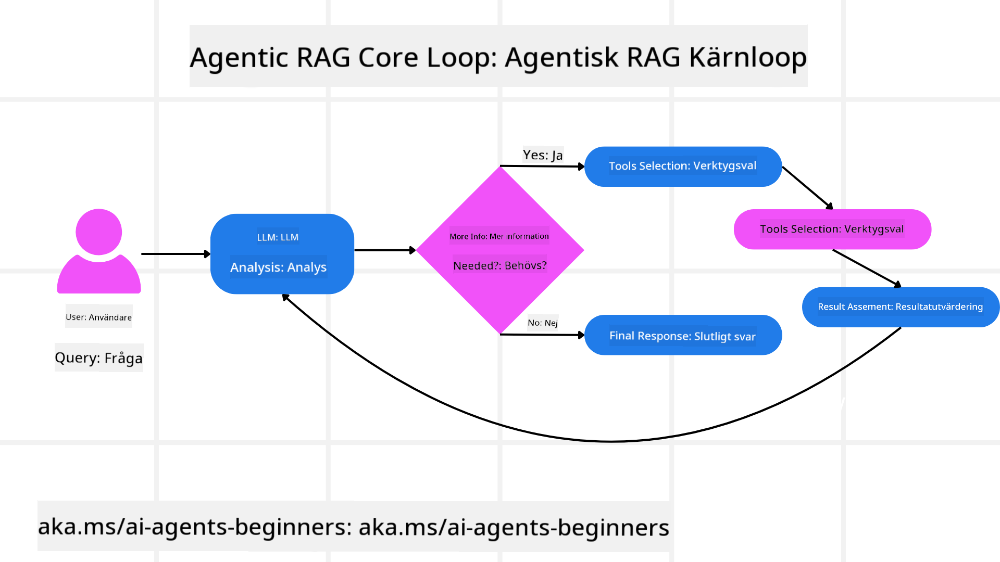
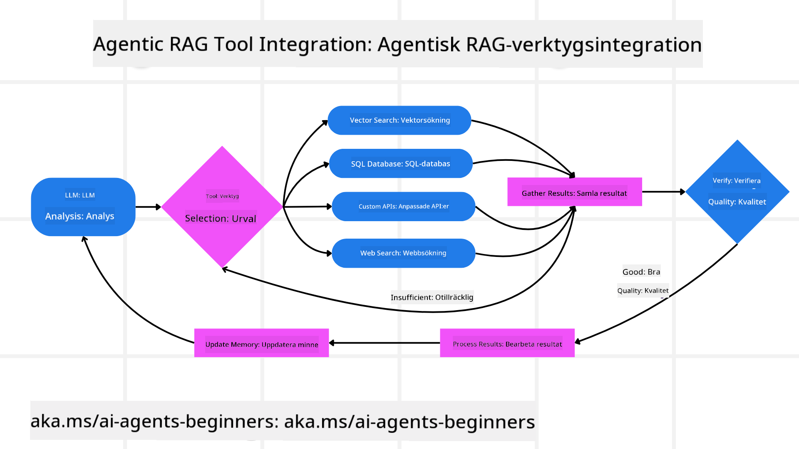
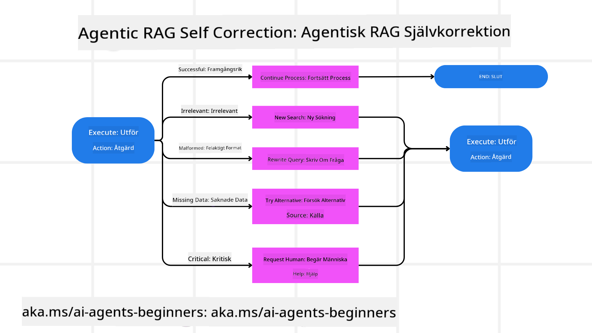
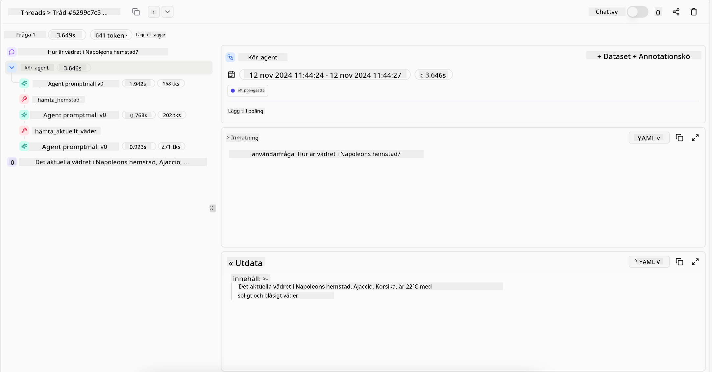

<!--
CO_OP_TRANSLATOR_METADATA:
{
  "original_hash": "7622aa72f9e676e593339f5f694ecd7d",
  "translation_date": "2025-07-12T10:04:11+00:00",
  "source_file": "05-agentic-rag/README.md",
  "language_code": "sv"
}
-->

> _(Klicka på bilden ovan för att se videon av denna lektion)_

# Agentic RAG

Denna lektion ger en omfattande översikt över Agentic Retrieval-Augmented Generation (Agentic RAG), ett framväxande AI-paradigm där stora språkmodeller (LLM) självständigt planerar sina nästa steg samtidigt som de hämtar information från externa källor. Till skillnad från statiska mönster där man först hämtar och sedan läser, innebär Agentic RAG iterativa anrop till LLM, varvade med verktygs- eller funktionsanrop och strukturerade svar. Systemet utvärderar resultaten, förfinar frågorna, anropar ytterligare verktyg vid behov och fortsätter denna cykel tills en tillfredsställande lösning uppnås.

## Introduktion

Denna lektion kommer att täcka

- **Förstå Agentic RAG:** Lär dig om det framväxande paradigmet inom AI där stora språkmodeller (LLM) självständigt planerar sina nästa steg samtidigt som de hämtar information från externa datakällor.
- **Greppa Iterativ Maker-Checker-stil:** Förstå loopen med iterativa anrop till LLM, varvade med verktygs- eller funktionsanrop och strukturerade svar, utformade för att förbättra korrekthet och hantera felaktiga frågor.
- **Utforska Praktiska Tillämpningar:** Identifiera scenarier där Agentic RAG utmärker sig, såsom miljöer med fokus på korrekthet, komplexa databashanteringar och längre arbetsflöden.

## Lärandemål

Efter att ha genomfört denna lektion kommer du att kunna/förstå:

- **Förstå Agentic RAG:** Lär dig om det framväxande paradigmet inom AI där stora språkmodeller (LLM) självständigt planerar sina nästa steg samtidigt som de hämtar information från externa datakällor.
- **Iterativ Maker-Checker-stil:** Greppa konceptet med en loop av iterativa anrop till LLM, varvade med verktygs- eller funktionsanrop och strukturerade svar, utformade för att förbättra korrekthet och hantera felaktiga frågor.
- **Äga Resoneringsprocessen:** Förstå systemets förmåga att äga sin resoneringsprocess, fatta beslut om hur problem ska angripas utan att förlita sig på fördefinierade vägar.
- **Arbetsflöde:** Förstå hur en agentisk modell självständigt beslutar att hämta marknadstrendrapporter, identifiera konkurrentdata, korrelera interna försäljningsmått, syntetisera fynd och utvärdera strategin.
- **Iterativa Loopar, Verktygsintegration och Minne:** Lär dig om systemets beroende av ett loopat interaktionsmönster, där tillstånd och minne bevaras över steg för att undvika repetitiva loopar och fatta välgrundade beslut.
- **Hantering av Fel och Självkorrektion:** Utforska systemets robusta självkorrektionsmekanismer, inklusive iteration och omfrågning, användning av diagnostiska verktyg och att falla tillbaka på mänsklig övervakning.
- **Agenturens Gränser:** Förstå begränsningarna för Agentic RAG, med fokus på domänspecifik autonomi, beroende av infrastruktur och respekt för skyddsmekanismer.
- **Praktiska Användningsfall och Värde:** Identifiera scenarier där Agentic RAG utmärker sig, såsom miljöer med fokus på korrekthet, komplexa databashanteringar och längre arbetsflöden.
- **Styrning, Transparens och Förtroende:** Lär dig om vikten av styrning och transparens, inklusive förklarbar resoneringsprocess, kontroll av bias och mänsklig övervakning.

## Vad är Agentic RAG?

Agentic Retrieval-Augmented Generation (Agentic RAG) är ett framväxande AI-paradigm där stora språkmodeller (LLM) självständigt planerar sina nästa steg samtidigt som de hämtar information från externa källor. Till skillnad från statiska mönster där man först hämtar och sedan läser, innebär Agentic RAG iterativa anrop till LLM, varvade med verktygs- eller funktionsanrop och strukturerade svar. Systemet utvärderar resultaten, förfinar frågorna, anropar ytterligare verktyg vid behov och fortsätter denna cykel tills en tillfredsställande lösning uppnås. Denna iterativa "maker-checker"-stil förbättrar korrekthet, hanterar felaktiga frågor och säkerställer högkvalitativa resultat.

Systemet äger aktivt sin resoneringsprocess, skriver om misslyckade frågor, väljer olika sökmetoder och integrerar flera verktyg — såsom vektorsökning i Azure AI Search, SQL-databaser eller anpassade API:er — innan det slutgiltiga svaret fastställs. Den utmärkande egenskapen hos ett agentiskt system är dess förmåga att äga sin resoneringsprocess. Traditionella RAG-implementationer förlitar sig på fördefinierade vägar, men ett agentiskt system bestämmer självständigt sekvensen av steg baserat på kvaliteten på den information det hittar.

## Definition av Agentic Retrieval-Augmented Generation (Agentic RAG)

Agentic Retrieval-Augmented Generation (Agentic RAG) är ett framväxande paradigm inom AI-utveckling där LLM inte bara hämtar information från externa datakällor utan också självständigt planerar sina nästa steg. Till skillnad från statiska mönster där man först hämtar och sedan läser eller noggrant skriptade promptsekvenser, innebär Agentic RAG en loop av iterativa anrop till LLM, varvade med verktygs- eller funktionsanrop och strukturerade svar. Vid varje steg utvärderar systemet de resultat det fått, avgör om det ska förfina sina frågor, anropar ytterligare verktyg vid behov och fortsätter denna cykel tills en tillfredsställande lösning uppnås.

Denna iterativa "maker-checker"-stil är utformad för att förbättra korrekthet, hantera felaktiga frågor till strukturerade databaser (t.ex. NL2SQL) och säkerställa balanserade, högkvalitativa resultat. Istället för att enbart förlita sig på noggrant utformade promptkedjor äger systemet aktivt sin resoneringsprocess. Det kan skriva om frågor som misslyckas, välja olika sökmetoder och integrera flera verktyg — såsom vektorsökning i Azure AI Search, SQL-databaser eller anpassade API:er — innan svaret slutgiltigt fastställs. Detta eliminerar behovet av alltför komplexa orkestreringsramverk. Istället kan en relativt enkel loop av "LLM-anrop → verktygsanvändning → LLM-anrop → …" ge sofistikerade och välgrundade svar.

## Äga Resoneringsprocessen

Den utmärkande egenskapen som gör ett system "agentiskt" är dess förmåga att äga sin resoneringsprocess. Traditionella RAG-implementationer är ofta beroende av att människor fördefinierar en väg för modellen: en tankekedja som beskriver vad som ska hämtas och när.  
Men när ett system är verkligt agentiskt, bestämmer det internt hur problemet ska angripas. Det kör inte bara ett skript; det bestämmer självständigt sekvensen av steg baserat på kvaliteten på den information det hittar.  
Till exempel, om det ombeds skapa en produktlanseringsstrategi, förlitar det sig inte enbart på en prompt som beskriver hela forsknings- och beslutsprocessen. Istället beslutar den agentiska modellen självständigt att:

1. Hämta aktuella marknadstrendrapporter med Bing Web Grounding  
2. Identifiera relevant konkurrentdata med Azure AI Search  
3. Korrelera historiska interna försäljningsmått med Azure SQL Database  
4. Syntetisera resultaten till en sammanhängande strategi orkestrerad via Azure OpenAI Service  
5. Utvärdera strategin för luckor eller inkonsekvenser och vid behov initiera ytterligare en runda av informationshämtning  

Alla dessa steg — förfina frågor, välja källor, iterera tills modellen är "nöjd" med svaret — beslutas av modellen, inte förskrivet av en människa.

## Iterativa Loopar, Verktygsintegration och Minne

Ett agentiskt system bygger på ett loopat interaktionsmönster:

- **Initialt Anrop:** Användarens mål (dvs. användarprompten) presenteras för LLM.  
- **Verktygsanrop:** Om modellen identifierar saknad information eller otydliga instruktioner väljer den ett verktyg eller en sökmetod — som en vektordatabasfråga (t.ex. Azure AI Search Hybrid-sökning över privat data) eller ett strukturerat SQL-anrop — för att samla mer kontext.  
- **Utvärdering & Förfining:** Efter att ha granskat den returnerade datan avgör modellen om informationen är tillräcklig. Om inte, förfinar den frågan, provar ett annat verktyg eller justerar sin strategi.  
- **Upprepa Tills Nöjd:** Denna cykel fortsätter tills modellen bedömer att den har tillräcklig klarhet och bevis för att leverera ett slutgiltigt, välgrundat svar.  
- **Minne & Tillstånd:** Eftersom systemet bevarar tillstånd och minne över stegen kan det minnas tidigare försök och deras resultat, undvika repetitiva loopar och fatta mer informerade beslut under processen.

Med tiden skapas en känsla av utvecklad förståelse, vilket gör att modellen kan navigera komplexa, flerstegsuppgifter utan att en människa behöver ingripa eller omforma prompten kontinuerligt.

## Hantering av Fel och Självkorrektion

Agentic RAG:s autonomi innefattar också robusta självkorrektionsmekanismer. När systemet stöter på återvändsgränder — som att hämta irrelevanta dokument eller möta felaktiga frågor — kan det:

- **Iterera och Omfråga:** Istället för att returnera svar med lågt värde försöker modellen nya sökstrategier, skriver om databasfrågor eller tittar på alternativa datamängder.  
- **Använda Diagnostiska Verktyg:** Systemet kan anropa ytterligare funktioner som hjälper till att felsöka resoneringsstegen eller bekräfta korrektheten i den hämtade datan. Verktyg som Azure AI Tracing är viktiga för att möjliggöra robust observabilitet och övervakning.  
- **Falla Tillbaka på Mänsklig Övervakning:** Vid högst kritiska eller upprepade fel kan modellen flagga osäkerhet och begära mänsklig vägledning. När människan ger korrigerande feedback kan modellen inkorporera denna lärdom framöver.

Denna iterativa och dynamiska metod gör att modellen kontinuerligt kan förbättras, vilket säkerställer att det inte bara är ett engångssystem utan ett som lär sig av sina misstag under en session.

## Agenturens Gränser

Trots sin autonomi inom en uppgift är Agentic RAG inte jämförbart med artificiell generell intelligens. Dess "agentiska" förmågor är begränsade till de verktyg, datakällor och policyer som tillhandahålls av mänskliga utvecklare. Den kan inte uppfinna egna verktyg eller gå utanför de domängränser som satts. Istället utmärker den sig i att dynamiskt orkestrera de resurser som finns till hands.  
Viktiga skillnader från mer avancerade AI-former inkluderar:

1. **Domänspecifik Autonomi:** Agentic RAG-system fokuserar på att uppnå användardefinierade mål inom en känd domän, och använder strategier som omskrivning av frågor eller verktygsval för att förbättra resultat.  
2. **Infrastrukturberoende:** Systemets kapacitet är beroende av de verktyg och data som utvecklarna integrerat. Det kan inte överskrida dessa gränser utan mänskligt ingripande.  
3. **Respekt för Skyddsmekanismer:** Etiska riktlinjer, regelverk och affärspolicyer är mycket viktiga. Agentens frihet är alltid begränsad av säkerhetsåtgärder och övervakningsmekanismer (förhoppningsvis).

## Praktiska Användningsfall och Värde

Agentic RAG utmärker sig i scenarier som kräver iterativ förfining och precision:

1. **Miljöer med Fokus på Korrekthet:** Vid efterlevnadskontroller, regulatoriska analyser eller juridisk forskning kan den agentiska modellen upprepade gånger verifiera fakta, konsultera flera källor och skriva om frågor tills den levererar ett noggrant granskad svar.  
2. **Komplexa Databashanteringar:** Vid hantering av strukturerad data där frågor ofta kan misslyckas eller behöva justeras kan systemet självständigt förfina sina frågor med Azure SQL eller Microsoft Fabric OneLake, vilket säkerställer att slutresultatet överensstämmer med användarens avsikt.  
3. **Längre Arbetsflöden:** Längre sessioner kan utvecklas i takt med att ny information framkommer. Agentic RAG kan kontinuerligt inkorporera ny data och anpassa strategier när den lär sig mer om problemområdet.

## Styrning, Transparens och Förtroende

När dessa system blir mer autonoma i sin resoneringsförmåga är styrning och transparens avgörande:

- **Förklarbar Resoneringsprocess:** Modellen kan tillhandahålla en revisionskedja över de frågor den ställt, de källor den konsulterat och de resoneringssteg den tagit för att nå sin slutsats. Verktyg som Azure AI Content Safety och Azure AI Tracing / GenAIOps kan hjälpa till att upprätthålla transparens och minska risker.  
- **Kontroll av Bias och Balanserad Informationshämtning:** Utvecklare kan justera sökstrategier för att säkerställa att balanserade och representativa datakällor beaktas, och regelbundet granska resultat för att upptäcka bias eller snedvridna mönster med hjälp av anpassade modeller för avancerade data science-organisationer som använder Azure Machine Learning.  
- **Mänsklig Övervakning och Efterlevnad:** Vid känsliga uppgifter är mänsklig granskning fortfarande avgörande. Agentic RAG ersätter inte mänskligt omdöme i kritiska beslut — det förstärker det genom att leverera mer noggrant granskade alternativ.

Att ha verktyg som ger en tydlig dokumentation av åtgärder är avgörande. Utan dem kan felsökning av en flerstegsprocess vara mycket svårt. Se följande exempel från Literal AI (företaget bakom Chainlit) för en Agent-körning:

## Slutsats

Agentic RAG representerar en naturlig utveckling i hur AI-system hanterar komplexa, dataintensiva uppgifter. Genom att anta ett loopat interaktionsmönster, självständigt välja verktyg och förfina frågor tills ett högkvalitativt resultat uppnås, går systemet bortom statiskt promptföljande till en mer adaptiv, kontextmedveten beslutsfattare. Även om det fortfarande är begränsat av mänskligt definierade infrastrukturer och etiska riktlinjer, möjliggör dessa agentiska förmågor rikare, mer dynamiska och i slutändan mer användbara AI-interaktioner för både företag och slutanvändare.

## Ytterligare Resurser

- <a href="https://learn.microsoft.com/training/modules/use-own-data-azure-openai" target="_blank">Implement Retrieval Augmented Generation (RAG) with Azure OpenAI Service: Learn how to use your own data with the Azure OpenAI Service. This Microsoft Learn module provides a comprehensive guide on implementing RAG

- <a href="https://learn.microsoft.com/azure/ai-studio/concepts/evaluation-approach-gen-ai" target="_blank">Utvärdering av generativa AI-applikationer med Azure AI Foundry: Den här artikeln täcker utvärdering och jämförelse av modeller på offentligt tillgängliga dataset, inklusive Agentic AI-applikationer och RAG-arkitekturer</a>
- <a href="https://weaviate.io/blog/what-is-agentic-rag" target="_blank">Vad är Agentic RAG | Weaviate</a>
- <a href="https://ragaboutit.com/agentic-rag-a-complete-guide-to-agent-based-retrieval-augmented-generation/" target="_blank">Agentic RAG: En komplett guide till agentbaserad Retrieval Augmented Generation – Nyheter från generation RAG</a>
- <a href="https://huggingface.co/learn/cookbook/agent_rag" target="_blank">Agentic RAG: ge din RAG extra kraft med omformulering av frågor och självfrågeställning! Hugging Face Open-Source AI Cookbook</a>
- <a href="https://youtu.be/aQ4yQXeB1Ss?si=2HUqBzHoeB5tR04U" target="_blank">Lägga till Agentic-lager till RAG</a>
- <a href="https://www.youtube.com/watch?v=zeAyuLc_f3Q&t=244s" target="_blank">Framtiden för kunskapassistenter: Jerry Liu</a>
- <a href="https://www.youtube.com/watch?v=AOSjiXP1jmQ" target="_blank">Hur man bygger Agentic RAG-system</a>
- <a href="https://ignite.microsoft.com/sessions/BRK102?source=sessions" target="_blank">Använda Azure AI Foundry Agent Service för att skala dina AI-agenter</a>

### Akademiska artiklar

- <a href="https://arxiv.org/abs/2303.17651" target="_blank">2303.17651 Self-Refine: Iterativ förfining med självfeedback</a>
- <a href="https://arxiv.org/abs/2303.11366" target="_blank">2303.11366 Reflexion: Språkagenter med verbal förstärkningsinlärning</a>
- <a href="https://arxiv.org/abs/2305.11738" target="_blank">2305.11738 CRITIC: Stora språkmodeller kan självkorrigera med verktygsinteraktiv kritik</a>
- <a href="https://arxiv.org/abs/2501.09136" target="_blank">2501.09136 Agentic Retrieval-Augmented Generation: En översikt över Agentic RAG</a>

## Föregående lektion

[Tool Use Design Pattern](../04-tool-use/README.md)

## Nästa lektion

[Building Trustworthy AI Agents](../06-building-trustworthy-agents/README.md)

**Ansvarsfriskrivning**:  
Detta dokument har översatts med hjälp av AI-översättningstjänsten [Co-op Translator](https://github.com/Azure/co-op-translator). Även om vi strävar efter noggrannhet, vänligen observera att automatiska översättningar kan innehålla fel eller brister. Det ursprungliga dokumentet på dess modersmål bör betraktas som den auktoritativa källan. För kritisk information rekommenderas professionell mänsklig översättning. Vi ansvarar inte för några missförstånd eller feltolkningar som uppstår till följd av användningen av denna översättning.