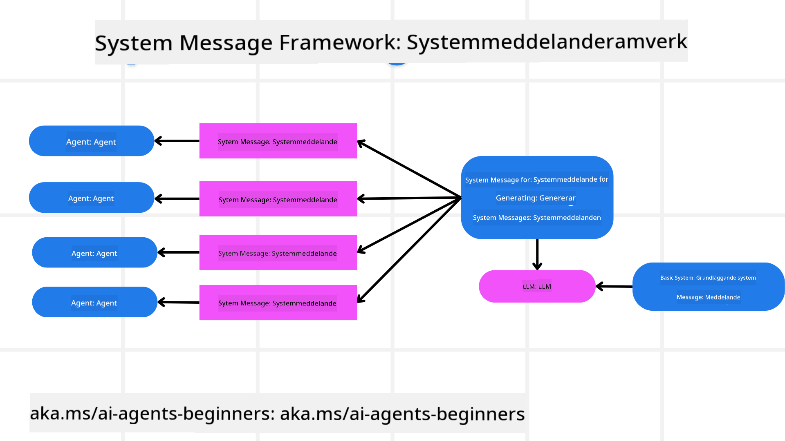
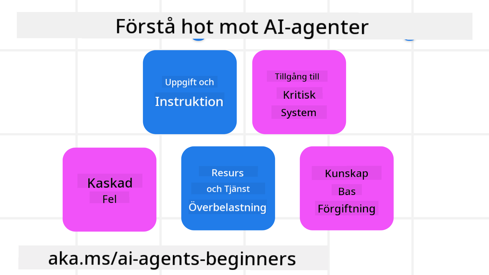
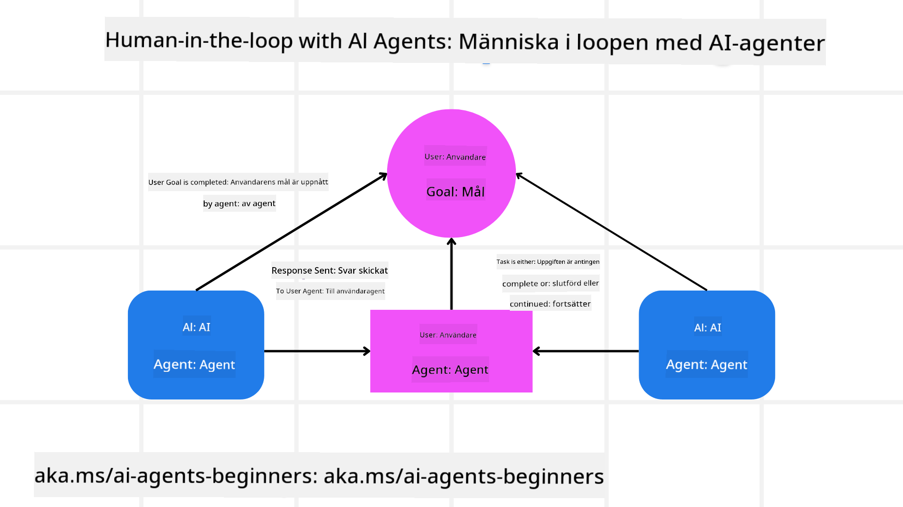

<!--
CO_OP_TRANSLATOR_METADATA:
{
  "original_hash": "f57852cac3a86c4a5ef47f793cc12178",
  "translation_date": "2025-07-12T10:27:57+00:00",
  "source_file": "06-building-trustworthy-agents/README.md",
  "language_code": "sv"
}
-->
[](https://youtu.be/iZKkMEGBCUQ?si=Q-kEbcyHUMPoHp8L)

> _(Klicka på bilden ovan för att se videon av denna lektion)_

# Bygga pålitliga AI-agenter

## Introduktion

Denna lektion kommer att täcka:

- Hur man bygger och distribuerar säkra och effektiva AI-agenter
- Viktiga säkerhetsaspekter vid utveckling av AI-agenter
- Hur man upprätthåller data- och användarintegritet vid utveckling av AI-agenter

## Lärandemål

Efter att ha genomfört denna lektion kommer du att kunna:

- Identifiera och minska risker vid skapande av AI-agenter
- Implementera säkerhetsåtgärder för att säkerställa korrekt hantering av data och åtkomst
- Skapa AI-agenter som bevarar dataintegritet och ger en kvalitativ användarupplevelse

## Säkerhet

Låt oss först titta på hur man bygger säkra agentbaserade applikationer. Säkerhet innebär att AI-agenten fungerar som avsett. Som utvecklare av agentbaserade applikationer har vi metoder och verktyg för att maximera säkerheten:

### Bygga ett ramverk för systemmeddelanden

Om du någonsin har byggt en AI-applikation med hjälp av Large Language Models (LLMs) vet du hur viktigt det är att designa en robust systemprompt eller systemmeddelande. Dessa prompts fastställer metaregler, instruktioner och riktlinjer för hur LLM ska interagera med användaren och data.

För AI-agenter är systemprompten ännu viktigare eftersom AI-agenterna behöver mycket specifika instruktioner för att slutföra de uppgifter vi har designat för dem.

För att skapa skalbara systemprompter kan vi använda ett ramverk för systemmeddelanden för att bygga en eller flera agenter i vår applikation:



#### Steg 1: Skapa ett meta systemmeddelande

Meta-prompten kommer att användas av en LLM för att generera systemprompter för de agenter vi skapar. Vi designar den som en mall så att vi effektivt kan skapa flera agenter vid behov.

Här är ett exempel på ett meta systemmeddelande som vi skulle ge till LLM:

```plaintext
You are an expert at creating AI agent assistants. 
You will be provided a company name, role, responsibilities and other
information that you will use to provide a system prompt for.
To create the system prompt, be descriptive as possible and provide a structure that a system using an LLM can better understand the role and responsibilities of the AI assistant. 
```

#### Steg 2: Skapa en grundläggande prompt

Nästa steg är att skapa en grundläggande prompt som beskriver AI-agenten. Du bör inkludera agentens roll, de uppgifter agenten ska utföra och eventuella andra ansvarsområden.

Här är ett exempel:

```plaintext
You are a travel agent for Contoso Travel that is great at booking flights for customers. To help customers you can perform the following tasks: lookup available flights, book flights, ask for preferences in seating and times for flights, cancel any previously booked flights and alert customers on any delays or cancellations of flights.  
```

#### Steg 3: Ge grundläggande systemmeddelande till LLM

Nu kan vi optimera detta systemmeddelande genom att tillhandahålla meta systemmeddelandet som systemmeddelande tillsammans med vårt grundläggande systemmeddelande.

Detta kommer att producera ett systemmeddelande som är bättre utformat för att vägleda våra AI-agenter:

```markdown
**Company Name:** Contoso Travel  
**Role:** Travel Agent Assistant

**Objective:**  
You are an AI-powered travel agent assistant for Contoso Travel, specializing in booking flights and providing exceptional customer service. Your main goal is to assist customers in finding, booking, and managing their flights, all while ensuring that their preferences and needs are met efficiently.

**Key Responsibilities:**

1. **Flight Lookup:**
    
    - Assist customers in searching for available flights based on their specified destination, dates, and any other relevant preferences.
    - Provide a list of options, including flight times, airlines, layovers, and pricing.
2. **Flight Booking:**
    
    - Facilitate the booking of flights for customers, ensuring that all details are correctly entered into the system.
    - Confirm bookings and provide customers with their itinerary, including confirmation numbers and any other pertinent information.
3. **Customer Preference Inquiry:**
    
    - Actively ask customers for their preferences regarding seating (e.g., aisle, window, extra legroom) and preferred times for flights (e.g., morning, afternoon, evening).
    - Record these preferences for future reference and tailor suggestions accordingly.
4. **Flight Cancellation:**
    
    - Assist customers in canceling previously booked flights if needed, following company policies and procedures.
    - Notify customers of any necessary refunds or additional steps that may be required for cancellations.
5. **Flight Monitoring:**
    
    - Monitor the status of booked flights and alert customers in real-time about any delays, cancellations, or changes to their flight schedule.
    - Provide updates through preferred communication channels (e.g., email, SMS) as needed.

**Tone and Style:**

- Maintain a friendly, professional, and approachable demeanor in all interactions with customers.
- Ensure that all communication is clear, informative, and tailored to the customer's specific needs and inquiries.

**User Interaction Instructions:**

- Respond to customer queries promptly and accurately.
- Use a conversational style while ensuring professionalism.
- Prioritize customer satisfaction by being attentive, empathetic, and proactive in all assistance provided.

**Additional Notes:**

- Stay updated on any changes to airline policies, travel restrictions, and other relevant information that could impact flight bookings and customer experience.
- Use clear and concise language to explain options and processes, avoiding jargon where possible for better customer understanding.

This AI assistant is designed to streamline the flight booking process for customers of Contoso Travel, ensuring that all their travel needs are met efficiently and effectively.

```

#### Steg 4: Iterera och förbättra

Värdet med detta ramverk för systemmeddelanden är att det gör det enklare att skala upp skapandet av systemmeddelanden för flera agenter samt att förbättra dina systemmeddelanden över tid. Det är ovanligt att du får ett systemmeddelande som fungerar perfekt första gången för hela ditt användningsfall. Att kunna göra små justeringar och förbättringar genom att ändra det grundläggande systemmeddelandet och köra det genom systemet gör att du kan jämföra och utvärdera resultat.

## Förstå hot

För att bygga pålitliga AI-agenter är det viktigt att förstå och minska risker och hot mot din AI-agent. Låt oss titta på några av de olika hoten mot AI-agenter och hur du kan planera och förbereda dig bättre för dem.



### Uppgift och instruktion

**Beskrivning:** Angripare försöker ändra instruktionerna eller målen för AI-agenten genom prompting eller manipulation av indata.

**Motåtgärd:** Utför valideringskontroller och filtrering av indata för att upptäcka potentiellt farliga prompts innan de bearbetas av AI-agenten. Eftersom dessa attacker ofta kräver frekvent interaktion med agenten är en annan metod att begränsa antalet turer i en konversation för att förhindra denna typ av attacker.

### Åtkomst till kritiska system

**Beskrivning:** Om en AI-agent har åtkomst till system och tjänster som lagrar känslig data kan angripare kompromettera kommunikationen mellan agenten och dessa tjänster. Detta kan vara direkta attacker eller indirekta försök att få information om systemen via agenten.

**Motåtgärd:** AI-agenter bör ha åtkomst till system endast vid behov för att förhindra denna typ av attacker. Kommunikationen mellan agenten och systemet bör också vara säker. Implementering av autentisering och åtkomstkontroll är ytterligare ett sätt att skydda denna information.

### Överbelastning av resurser och tjänster

**Beskrivning:** AI-agenter kan använda olika verktyg och tjänster för att slutföra uppgifter. Angripare kan utnyttja denna förmåga för att attackera dessa tjänster genom att skicka en stor mängd förfrågningar via AI-agenten, vilket kan leda till systemfel eller höga kostnader.

**Motåtgärd:** Inför policyer för att begränsa antalet förfrågningar en AI-agent kan göra till en tjänst. Att begränsa antalet konversationsrundor och förfrågningar till din AI-agent är också ett sätt att förhindra denna typ av attacker.

### Förgiftning av kunskapsbasen

**Beskrivning:** Denna typ av attack riktar sig inte direkt mot AI-agenten utan mot kunskapsbasen och andra tjänster som AI-agenten använder. Det kan handla om att korrupta data eller information som AI-agenten använder för att slutföra en uppgift, vilket leder till partiska eller oavsiktliga svar till användaren.

**Motåtgärd:** Utför regelbunden verifiering av den data som AI-agenten använder i sina arbetsflöden. Säkerställ att åtkomst till denna data är säker och endast kan ändras av betrodda personer för att undvika denna typ av attack.

### Kaskaderande fel

**Beskrivning:** AI-agenter använder olika verktyg och tjänster för att slutföra uppgifter. Fel orsakade av angripare kan leda till att andra system som AI-agenten är kopplad till också fallerar, vilket gör attacken mer omfattande och svårare att felsöka.

**Motåtgärd:** Ett sätt att undvika detta är att låta AI-agenten arbeta i en begränsad miljö, till exempel genom att utföra uppgifter i en Docker-container, för att förhindra direkta systemattacker. Att skapa fallback-mekanismer och logik för omförsök när vissa system svarar med fel är ett annat sätt att förhindra större systemfel.

## Human-in-the-Loop

Ett annat effektivt sätt att bygga pålitliga AI-agentssystem är att använda Human-in-the-loop. Detta skapar ett flöde där användare kan ge feedback till agenterna under körningen. Användare fungerar i praktiken som agenter i ett multi-agent-system genom att godkänna eller avbryta den pågående processen.



Här är ett kodexempel som använder AutoGen för att visa hur detta koncept implementeras:

```python

# Create the agents.
model_client = OpenAIChatCompletionClient(model="gpt-4o-mini")
assistant = AssistantAgent("assistant", model_client=model_client)
user_proxy = UserProxyAgent("user_proxy", input_func=input)  # Use input() to get user input from console.

# Create the termination condition which will end the conversation when the user says "APPROVE".
termination = TextMentionTermination("APPROVE")

# Create the team.
team = RoundRobinGroupChat([assistant, user_proxy], termination_condition=termination)

# Run the conversation and stream to the console.
stream = team.run_stream(task="Write a 4-line poem about the ocean.")
# Use asyncio.run(...) when running in a script.
await Console(stream)

```

## Slutsats

Att bygga pålitliga AI-agenter kräver noggrann design, robusta säkerhetsåtgärder och kontinuerlig iteration. Genom att implementera strukturerade meta-promptsystem, förstå potentiella hot och tillämpa motåtgärder kan utvecklare skapa AI-agenter som är både säkra och effektiva. Dessutom säkerställer en human-in-the-loop-ansats att AI-agenter förblir anpassade efter användarnas behov samtidigt som riskerna minimeras. Allteftersom AI fortsätter att utvecklas kommer en proaktiv inställning till säkerhet, integritet och etiska överväganden vara avgörande för att främja förtroende och tillförlitlighet i AI-drivna system.

## Ytterligare resurser

- <a href="https://learn.microsoft.com/azure/ai-studio/responsible-use-of-ai-overview" target="_blank">Responsible AI overview</a>
- <a href="https://learn.microsoft.com/azure/ai-studio/concepts/evaluation-approach-gen-ai" target="_blank">Evaluation of generative AI models and AI applications</a>
- <a href="https://learn.microsoft.com/azure/ai-services/openai/concepts/system-message?context=%2Fazure%2Fai-studio%2Fcontext%2Fcontext&tabs=top-techniques" target="_blank">Safety system messages</a>
- <a href="https://blogs.microsoft.com/wp-content/uploads/prod/sites/5/2022/06/Microsoft-RAI-Impact-Assessment-Template.pdf?culture=en-us&country=us" target="_blank">Risk Assessment Template</a>

## Föregående lektion

[Agentic RAG](../05-agentic-rag/README.md)

## Nästa lektion

[Planning Design Pattern](../07-planning-design/README.md)

**Ansvarsfriskrivning**:  
Detta dokument har översatts med hjälp av AI-översättningstjänsten [Co-op Translator](https://github.com/Azure/co-op-translator). Även om vi strävar efter noggrannhet, vänligen observera att automatiska översättningar kan innehålla fel eller brister. Det ursprungliga dokumentet på dess modersmål bör betraktas som den auktoritativa källan. För kritisk information rekommenderas professionell mänsklig översättning. Vi ansvarar inte för eventuella missförstånd eller feltolkningar som uppstår vid användning av denna översättning.