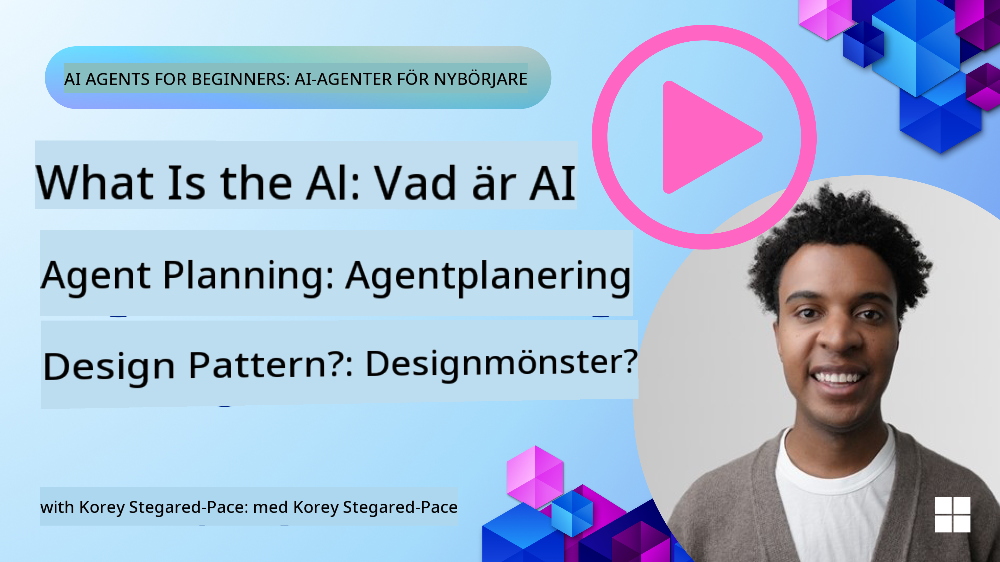
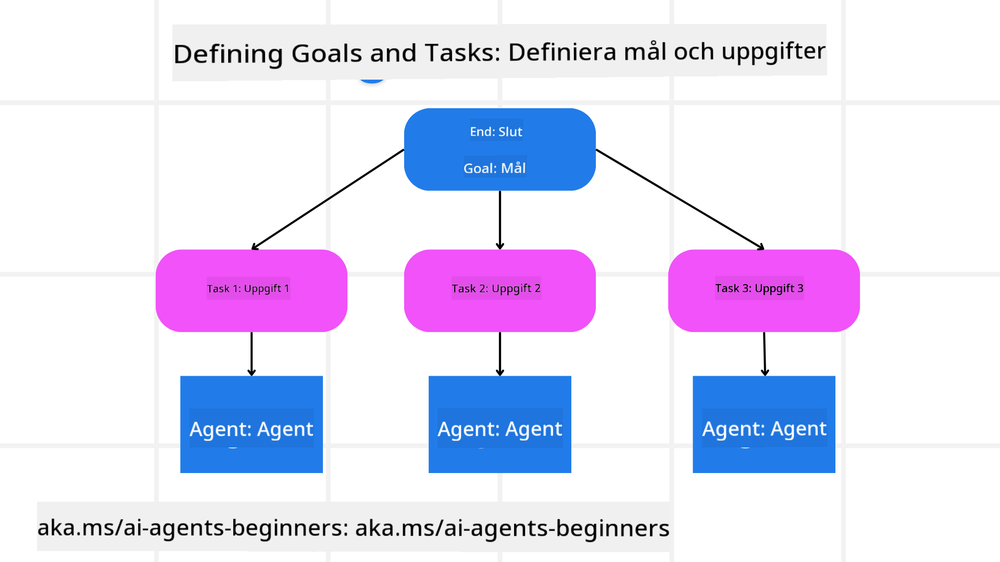

<!--
CO_OP_TRANSLATOR_METADATA:
{
  "original_hash": "a28d30590704ea13b6a08d4793cf9c2b",
  "translation_date": "2025-08-29T15:32:01+00:00",
  "source_file": "07-planning-design/README.md",
  "language_code": "sv"
}
-->
[](https://youtu.be/kPfJ2BrBCMY?si=9pYpPXp0sSbK91Dr)

> _(Klicka på bilden ovan för att se videon för denna lektion)_

# Planeringsdesign

## Introduktion

Denna lektion kommer att täcka:

* Att definiera ett tydligt övergripande mål och bryta ner en komplex uppgift i hanterbara delar.
* Att använda strukturerad output för mer tillförlitliga och maskinläsbara svar.
* Att tillämpa en händelsedriven metod för att hantera dynamiska uppgifter och oväntade indata.

## Lärandemål

Efter att ha genomfört denna lektion kommer du att förstå:

* Hur man identifierar och sätter ett övergripande mål för en AI-agent, så att den tydligt vet vad som ska uppnås.
* Hur man bryter ner en komplex uppgift i hanterbara deluppgifter och organiserar dem i en logisk sekvens.
* Hur man utrustar agenter med rätt verktyg (t.ex. sökverktyg eller dataanalysverktyg), beslutar när och hur de ska användas, och hanterar oväntade situationer som uppstår.
* Hur man utvärderar resultatet av deluppgifter, mäter prestanda och itererar åtgärder för att förbättra slutresultatet.

## Definiera det övergripande målet och bryta ner en uppgift



De flesta uppgifter i verkligheten är för komplexa för att hanteras i ett enda steg. En AI-agent behöver ett tydligt mål för att vägleda sin planering och sina åtgärder. Till exempel, överväg målet:

    "Skapa en 3-dagars resplan."

Även om det är enkelt att formulera, behöver det fortfarande förfinas. Ju tydligare målet är, desto bättre kan agenten (och eventuella mänskliga samarbetspartners) fokusera på att uppnå rätt resultat, som att skapa en omfattande resplan med flygalternativ, hotellrekommendationer och aktivitetsförslag.

### Uppgiftsnedbrytning

Stora eller komplexa uppgifter blir mer hanterbara när de delas upp i mindre, målinriktade deluppgifter.  
För exemplet med resplanen kan du bryta ner målet i:

* Flygbokning
* Hotellbokning
* Biluthyrning
* Personalisering

Varje deluppgift kan sedan hanteras av dedikerade agenter eller processer. En agent kan specialisera sig på att söka efter de bästa flygerbjudandena, en annan fokuserar på hotellbokningar, och så vidare. En koordinerande eller "nedströms" agent kan sedan sammanställa dessa resultat till en sammanhängande resplan för slutanvändaren.

Denna modulära metod möjliggör också stegvisa förbättringar. Till exempel kan du lägga till specialiserade agenter för matrekommendationer eller lokala aktivitetsförslag och förfina resplanen över tid.

### Strukturerad output

Stora språkmodeller (LLMs) kan generera strukturerad output (t.ex. JSON) som är enklare för nedströmsagenter eller tjänster att tolka och bearbeta. Detta är särskilt användbart i en multi-agent-kontext, där vi kan agera på dessa uppgifter efter att planeringsoutputen har mottagits. Se detta för en snabb översikt.

Följande Python-exempel visar en enkel planeringsagent som bryter ner ett mål i deluppgifter och genererar en strukturerad plan:

```python
from pydantic import BaseModel
from enum import Enum
from typing import List, Optional, Union
import json
import os
from typing import Optional
from pprint import pprint
from autogen_core.models import UserMessage, SystemMessage, AssistantMessage
from autogen_ext.models.azure import AzureAIChatCompletionClient
from azure.core.credentials import AzureKeyCredential

class AgentEnum(str, Enum):
    FlightBooking = "flight_booking"
    HotelBooking = "hotel_booking"
    CarRental = "car_rental"
    ActivitiesBooking = "activities_booking"
    DestinationInfo = "destination_info"
    DefaultAgent = "default_agent"
    GroupChatManager = "group_chat_manager"

# Travel SubTask Model
class TravelSubTask(BaseModel):
    task_details: str
    assigned_agent: AgentEnum  # we want to assign the task to the agent

class TravelPlan(BaseModel):
    main_task: str
    subtasks: List[TravelSubTask]
    is_greeting: bool

client = AzureAIChatCompletionClient(
    model="gpt-4o-mini",
    endpoint="https://models.inference.ai.azure.com",
    # To authenticate with the model you will need to generate a personal access token (PAT) in your GitHub settings.
    # Create your PAT token by following instructions here: https://docs.github.com/en/authentication/keeping-your-account-and-data-secure/managing-your-personal-access-tokens
    credential=AzureKeyCredential(os.environ["GITHUB_TOKEN"]),
    model_info={
        "json_output": False,
        "function_calling": True,
        "vision": True,
        "family": "unknown",
    },
)

# Define the user message
messages = [
    SystemMessage(content="""You are an planner agent.
    Your job is to decide which agents to run based on the user's request.
                      Provide your response in JSON format with the following structure:
{'main_task': 'Plan a family trip from Singapore to Melbourne.',
 'subtasks': [{'assigned_agent': 'flight_booking',
               'task_details': 'Book round-trip flights from Singapore to '
                               'Melbourne.'}
    Below are the available agents specialised in different tasks:
    - FlightBooking: For booking flights and providing flight information
    - HotelBooking: For booking hotels and providing hotel information
    - CarRental: For booking cars and providing car rental information
    - ActivitiesBooking: For booking activities and providing activity information
    - DestinationInfo: For providing information about destinations
    - DefaultAgent: For handling general requests""", source="system"),
    UserMessage(
        content="Create a travel plan for a family of 2 kids from Singapore to Melboune", source="user"),
]

response = await client.create(messages=messages, extra_create_args={"response_format": 'json_object'})

response_content: Optional[str] = response.content if isinstance(
    response.content, str) else None
if response_content is None:
    raise ValueError("Response content is not a valid JSON string" )

pprint(json.loads(response_content))

# # Ensure the response content is a valid JSON string before loading it
# response_content: Optional[str] = response.content if isinstance(
#     response.content, str) else None
# if response_content is None:
#     raise ValueError("Response content is not a valid JSON string")

# # Print the response content after loading it as JSON
# pprint(json.loads(response_content))

# Validate the response content with the MathReasoning model
# TravelPlan.model_validate(json.loads(response_content))
```

### Planeringsagent med multi-agent-orkestrering

I detta exempel tar en Semantic Router Agent emot en användarförfrågan (t.ex. "Jag behöver en hotellplan för min resa.").

Planeraren gör sedan följande:

* Tar emot hotellplanen: Planeraren tar användarens meddelande och, baserat på ett systemprompt (inklusive tillgängliga agentdetaljer), genererar en strukturerad resplan.
* Listar agenter och deras verktyg: Agentregistret innehåller en lista över agenter (t.ex. för flyg, hotell, biluthyrning och aktiviteter) tillsammans med de funktioner eller verktyg de erbjuder.
* Dirigerar planen till respektive agenter: Beroende på antalet deluppgifter skickar planeraren antingen meddelandet direkt till en dedikerad agent (för enkla uppgifter) eller koordinerar via en gruppchatt-hanterare för samarbete mellan flera agenter.
* Sammanfattar resultatet: Slutligen sammanfattar planeraren den genererade planen för tydlighet.

Följande Python-kodexempel illustrerar dessa steg:

```python

from pydantic import BaseModel

from enum import Enum
from typing import List, Optional, Union

class AgentEnum(str, Enum):
    FlightBooking = "flight_booking"
    HotelBooking = "hotel_booking"
    CarRental = "car_rental"
    ActivitiesBooking = "activities_booking"
    DestinationInfo = "destination_info"
    DefaultAgent = "default_agent"
    GroupChatManager = "group_chat_manager"

# Travel SubTask Model

class TravelSubTask(BaseModel):
    task_details: str
    assigned_agent: AgentEnum # we want to assign the task to the agent

class TravelPlan(BaseModel):
    main_task: str
    subtasks: List[TravelSubTask]
    is_greeting: bool
import json
import os
from typing import Optional

from autogen_core.models import UserMessage, SystemMessage, AssistantMessage
from autogen_ext.models.openai import AzureOpenAIChatCompletionClient

# Create the client with type-checked environment variables

client = AzureOpenAIChatCompletionClient(
    azure_deployment=os.getenv("AZURE_OPENAI_DEPLOYMENT_NAME"),
    model=os.getenv("AZURE_OPENAI_DEPLOYMENT_NAME"),
    api_version=os.getenv("AZURE_OPENAI_API_VERSION"),
    azure_endpoint=os.getenv("AZURE_OPENAI_ENDPOINT"),
    api_key=os.getenv("AZURE_OPENAI_API_KEY"),
)

from pprint import pprint

# Define the user message

messages = [
    SystemMessage(content="""You are an planner agent.
    Your job is to decide which agents to run based on the user's request.
    Below are the available agents specialized in different tasks:
    - FlightBooking: For booking flights and providing flight information
    - HotelBooking: For booking hotels and providing hotel information
    - CarRental: For booking cars and providing car rental information
    - ActivitiesBooking: For booking activities and providing activity information
    - DestinationInfo: For providing information about destinations
    - DefaultAgent: For handling general requests""", source="system"),
    UserMessage(content="Create a travel plan for a family of 2 kids from Singapore to Melbourne", source="user"),
]

response = await client.create(messages=messages, extra_create_args={"response_format": TravelPlan})

# Ensure the response content is a valid JSON string before loading it

response_content: Optional[str] = response.content if isinstance(response.content, str) else None
if response_content is None:
    raise ValueError("Response content is not a valid JSON string")

# Print the response content after loading it as JSON

pprint(json.loads(response_content))
```

Nedan visas output från föregående kod, och du kan sedan använda denna strukturerade output för att dirigera till `assigned_agent` och sammanfatta resplanen för slutanvändaren.

```json
{
    "is_greeting": "False",
    "main_task": "Plan a family trip from Singapore to Melbourne.",
    "subtasks": [
        {
            "assigned_agent": "flight_booking",
            "task_details": "Book round-trip flights from Singapore to Melbourne."
        },
        {
            "assigned_agent": "hotel_booking",
            "task_details": "Find family-friendly hotels in Melbourne."
        },
        {
            "assigned_agent": "car_rental",
            "task_details": "Arrange a car rental suitable for a family of four in Melbourne."
        },
        {
            "assigned_agent": "activities_booking",
            "task_details": "List family-friendly activities in Melbourne."
        },
        {
            "assigned_agent": "destination_info",
            "task_details": "Provide information about Melbourne as a travel destination."
        }
    ]
}
```

Ett exempel på en notebook med föregående kod finns [här](07-autogen.ipynb).

### Iterativ planering

Vissa uppgifter kräver en fram-och-tillbaka-process eller omplanering, där resultatet av en deluppgift påverkar nästa. Till exempel, om agenten upptäcker ett oväntat dataformat vid flygbokning, kan den behöva anpassa sin strategi innan den går vidare till hotellbokning.

Dessutom kan användarfeedback (t.ex. en människa som bestämmer sig för att de föredrar ett tidigare flyg) utlösa en partiell omplanering. Denna dynamiska, iterativa metod säkerställer att den slutliga lösningen överensstämmer med verkliga begränsningar och föränderliga användarpreferenser.

Exempel på kod:

```python
from autogen_core.models import UserMessage, SystemMessage, AssistantMessage
#.. same as previous code and pass on the user history, current plan
messages = [
    SystemMessage(content="""You are a planner agent to optimize the
    Your job is to decide which agents to run based on the user's request.
    Below are the available agents specialized in different tasks:
    - FlightBooking: For booking flights and providing flight information
    - HotelBooking: For booking hotels and providing hotel information
    - CarRental: For booking cars and providing car rental information
    - ActivitiesBooking: For booking activities and providing activity information
    - DestinationInfo: For providing information about destinations
    - DefaultAgent: For handling general requests""", source="system"),
    UserMessage(content="Create a travel plan for a family of 2 kids from Singapore to Melbourne", source="user"),
    AssistantMessage(content=f"Previous travel plan - {TravelPlan}", source="assistant")
]
# .. re-plan and send the tasks to respective agents
```

För mer omfattande planering, kolla in Magnetic One för att lösa komplexa uppgifter.

## Sammanfattning

I denna artikel har vi tittat på ett exempel på hur vi kan skapa en planerare som dynamiskt kan välja de tillgängliga agenter som definierats. Outputen från planeraren bryter ner uppgifterna och tilldelar agenter så att de kan utföras. Det antas att agenterna har tillgång till de funktioner/verktyg som krävs för att utföra uppgiften. Förutom agenterna kan du inkludera andra mönster som reflektion, sammanfattning och round-robin-chatt för att ytterligare anpassa.

## Ytterligare resurser

* AutoGen Magnetic One - Ett generalistiskt multi-agent-system för att lösa komplexa uppgifter som har uppnått imponerande resultat på flera utmanande agentiska benchmarks. Referens:

. I denna implementation skapar orkestratorn en uppgiftsspecifik plan och delegerar dessa uppgifter till de tillgängliga agenterna. Förutom planering använder orkestratorn också en spårningsmekanism för att övervaka uppgiftens framsteg och omplanera vid behov.

### Har du fler frågor om planeringsdesignmönstret?

Gå med i [Azure AI Foundry Discord](https://aka.ms/ai-agents/discord) för att träffa andra elever, delta i öppet hus och få svar på dina frågor om AI-agenter.

## Föregående lektion

[Bygga pålitliga AI-agenter](../06-building-trustworthy-agents/README.md)

## Nästa lektion

[Multi-agent-designmönster](../08-multi-agent/README.md)

---

**Ansvarsfriskrivning**:  
Detta dokument har översatts med hjälp av AI-översättningstjänsten [Co-op Translator](https://github.com/Azure/co-op-translator). Även om vi strävar efter noggrannhet, vänligen notera att automatiska översättningar kan innehålla fel eller felaktigheter. Det ursprungliga dokumentet på dess originalspråk bör betraktas som den auktoritativa källan. För kritisk information rekommenderas professionell mänsklig översättning. Vi ansvarar inte för eventuella missförstånd eller feltolkningar som uppstår vid användning av denna översättning.