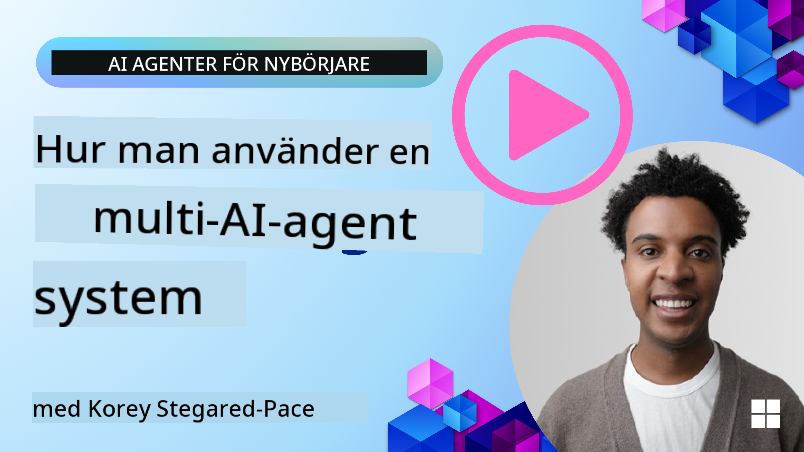
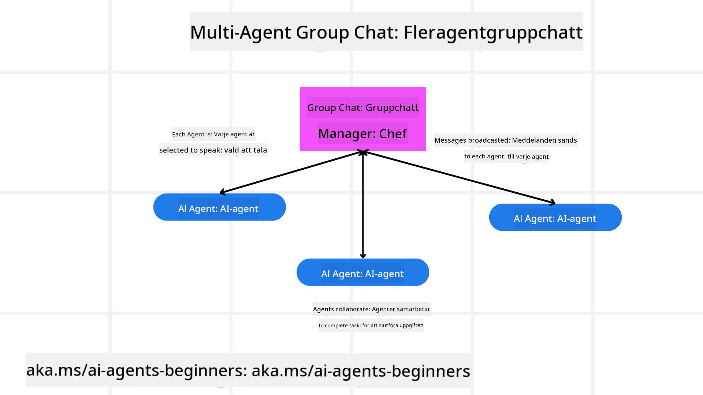
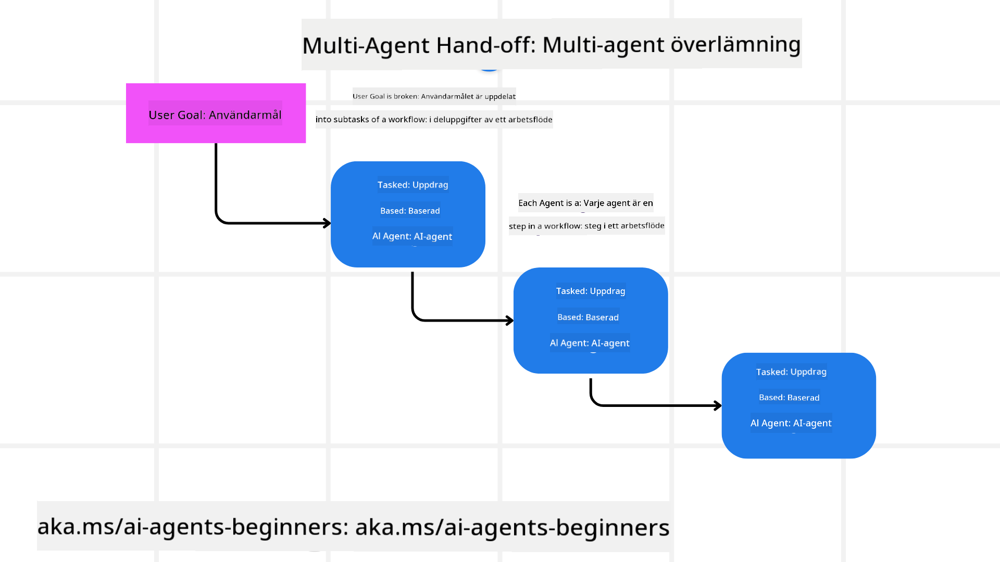
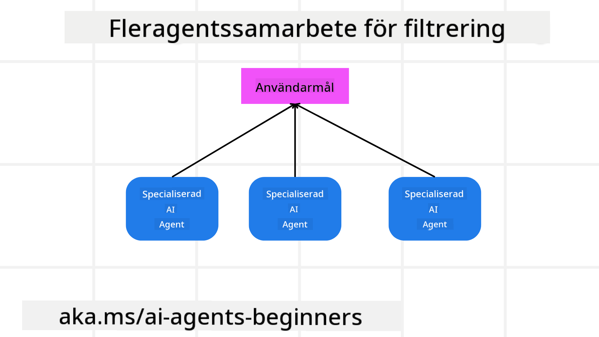

<!--
CO_OP_TRANSLATOR_METADATA:
{
  "original_hash": "c692a8975d7d5b99575a553de1c5e8a7",
  "translation_date": "2025-07-12T11:12:45+00:00",
  "source_file": "08-multi-agent/README.md",
  "language_code": "sv"
}
-->

> _(Klicka på bilden ovan för att se videon av denna lektion)_

# Multi-agent designmönster

Så fort du börjar arbeta på ett projekt som involverar flera agenter behöver du överväga multi-agent designmönstret. Det kan dock vara oklart när man ska byta till multi-agenter och vilka fördelarna är.

## Introduktion

I denna lektion vill vi besvara följande frågor:

- Vilka scenarier är lämpliga för multi-agenter?
- Vilka är fördelarna med att använda multi-agenter jämfört med en enda agent som utför flera uppgifter?
- Vilka är byggstenarna för att implementera multi-agent designmönstret?
- Hur får vi insyn i hur de flera agenterna interagerar med varandra?

## Lärandemål

Efter denna lektion ska du kunna:

- Identifiera scenarier där multi-agenter är tillämpliga
- Känna igen fördelarna med att använda multi-agenter jämfört med en enskild agent
- Förstå byggstenarna för att implementera multi-agent designmönstret

Vad är den större bilden?

*Multi-agenter är ett designmönster som tillåter flera agenter att samarbeta för att uppnå ett gemensamt mål*.

Detta mönster används brett inom olika områden, inklusive robotik, autonoma system och distribuerad databehandling.

## Scenarier där multi-agenter är tillämpliga

Så vilka scenarier är bra användningsområden för multi-agenter? Svaret är att det finns många situationer där det är fördelaktigt att använda flera agenter, särskilt i följande fall:

- **Stora arbetsbelastningar**: Stora arbetsuppgifter kan delas upp i mindre delar och tilldelas olika agenter, vilket möjliggör parallell bearbetning och snabbare slutförande. Ett exempel är vid stora databehandlingsuppgifter.
- **Komplexa uppgifter**: Komplexa uppgifter, likt stora arbetsbelastningar, kan brytas ner i mindre deluppgifter och tilldelas olika agenter, där varje agent specialiserar sig på en specifik del. Ett bra exempel är autonoma fordon där olika agenter hanterar navigation, hinderupptäckt och kommunikation med andra fordon.
- **Mångsidig expertis**: Olika agenter kan ha olika expertis, vilket gör att de kan hantera olika delar av en uppgift mer effektivt än en enda agent. Ett exempel är inom vården där agenter kan hantera diagnostik, behandlingsplaner och patientövervakning.

## Fördelar med att använda multi-agenter jämfört med en enskild agent

Ett system med en enda agent kan fungera bra för enkla uppgifter, men för mer komplexa uppgifter kan användning av flera agenter ge flera fördelar:

- **Specialisering**: Varje agent kan specialisera sig på en specifik uppgift. Brist på specialisering i en enda agent innebär att agenten kan göra allt men kan bli förvirrad när den ställs inför en komplex uppgift. Den kan till exempel hamna att utföra en uppgift som den inte är bäst lämpad för.
- **Skalbarhet**: Det är enklare att skala system genom att lägga till fler agenter än att överbelasta en enda agent.
- **Fel tolerans**: Om en agent misslyckas kan andra fortsätta fungera, vilket säkerställer systemets tillförlitlighet.

Låt oss ta ett exempel: att boka en resa för en användare. Ett system med en enda agent skulle behöva hantera alla delar av bokningsprocessen, från att hitta flyg till att boka hotell och hyrbilar. För att klara detta med en enda agent skulle agenten behöva ha verktyg för att hantera alla dessa uppgifter. Detta kan leda till ett komplext och monolitiskt system som är svårt att underhålla och skala. Ett multi-agent system, å andra sidan, kan ha olika agenter specialiserade på att hitta flyg, boka hotell och hyrbilar. Detta gör systemet mer modulärt, lättare att underhålla och skalbart.

Jämför detta med en resebyrå som drivs som en liten familjeägd butik kontra en resebyrå som drivs som en franchise. Den familjeägda butiken skulle ha en enda agent som hanterar alla delar av bokningsprocessen, medan franchisen skulle ha olika agenter som hanterar olika delar av bokningsprocessen.

## Byggstenar för att implementera multi-agent designmönstret

Innan du kan implementera multi-agent designmönstret behöver du förstå byggstenarna som utgör mönstret.

Låt oss göra detta mer konkret genom att återigen titta på exemplet med att boka en resa för en användare. I detta fall skulle byggstenarna inkludera:

- **Agentkommunikation**: Agenter för att hitta flyg, boka hotell och hyrbilar behöver kommunicera och dela information om användarens preferenser och begränsningar. Du behöver bestämma protokoll och metoder för denna kommunikation. Konkret betyder detta att agenten för att hitta flyg behöver kommunicera med agenten för att boka hotell för att säkerställa att hotellet bokas för samma datum som flyget. Det innebär att agenterna behöver dela information om användarens resdatum, vilket betyder att du behöver bestämma *vilka agenter som delar information och hur de delar den*.
- **Koordineringsmekanismer**: Agenter behöver koordinera sina handlingar för att säkerställa att användarens preferenser och begränsningar uppfylls. En användarpreferens kan vara att de vill ha ett hotell nära flygplatsen medan en begränsning kan vara att hyrbilar endast finns tillgängliga på flygplatsen. Detta innebär att agenten för att boka hotell behöver koordinera med agenten för att boka hyrbilar för att säkerställa att användarens preferenser och begränsningar uppfylls. Det betyder att du behöver bestämma *hur agenterna koordinerar sina handlingar*.
- **Agentarkitektur**: Agenter behöver ha en intern struktur för att fatta beslut och lära sig från sina interaktioner med användaren. Detta innebär att agenten för att hitta flyg behöver ha en intern struktur för att fatta beslut om vilka flyg som ska rekommenderas till användaren. Det betyder att du behöver bestämma *hur agenterna fattar beslut och lär sig från sina interaktioner med användaren*. Exempel på hur en agent lär sig och förbättras kan vara att agenten för att hitta flyg använder en maskininlärningsmodell för att rekommendera flyg baserat på användarens tidigare preferenser.
- **Insyn i multi-agent interaktioner**: Du behöver ha insyn i hur de flera agenterna interagerar med varandra. Det innebär att du behöver verktyg och tekniker för att spåra agenters aktiviteter och interaktioner. Detta kan vara i form av loggning och övervakningsverktyg, visualiseringsverktyg och prestationsmått.
- **Multi-agent mönster**: Det finns olika mönster för att implementera multi-agent system, såsom centraliserade, decentraliserade och hybrida arkitekturer. Du behöver välja det mönster som passar bäst för ditt användningsfall.
- **Människa i loopen**: I de flesta fall kommer du ha en människa i loopen och du behöver instruera agenterna när de ska be om mänsklig inblandning. Detta kan vara i form av att en användare begär ett specifikt hotell eller flyg som agenterna inte har rekommenderat, eller att be om bekräftelse innan en flyg- eller hotellbokning görs.

## Insyn i multi-agent interaktioner

Det är viktigt att du har insyn i hur de flera agenterna interagerar med varandra. Denna insyn är avgörande för felsökning, optimering och för att säkerställa systemets övergripande effektivitet. För att uppnå detta behöver du verktyg och tekniker för att spåra agenters aktiviteter och interaktioner. Detta kan vara i form av loggning och övervakningsverktyg, visualiseringsverktyg och prestationsmått.

Till exempel, i fallet med att boka en resa för en användare, kan du ha en instrumentpanel som visar status för varje agent, användarens preferenser och begränsningar samt interaktionerna mellan agenterna. Denna instrumentpanel kan visa användarens resdatum, de flyg som flygagenten rekommenderar, hotellen som hotellagenten rekommenderar och hyrbilarna som hyrbilsagenten rekommenderar. Detta ger dig en tydlig bild av hur agenterna interagerar med varandra och om användarens preferenser och begränsningar uppfylls.

Låt oss titta närmare på varje aspekt.

- **Loggning och övervakningsverktyg**: Du vill ha loggning för varje åtgärd som en agent utför. En loggpost kan lagra information om vilken agent som utförde åtgärden, vilken åtgärd som utfördes, när den utfördes och resultatet av åtgärden. Denna information kan sedan användas för felsökning, optimering med mera.

- **Visualiseringsverktyg**: Visualiseringsverktyg kan hjälpa dig att se interaktionerna mellan agenter på ett mer intuitivt sätt. Till exempel kan du ha en graf som visar informationsflödet mellan agenter. Detta kan hjälpa dig att identifiera flaskhalsar, ineffektivitet och andra problem i systemet.

- **Prestationsmått**: Prestationsmått kan hjälpa dig att följa effektiviteten i multi-agent systemet. Till exempel kan du mäta tiden det tar att slutföra en uppgift, antalet uppgifter som slutförs per tidsenhet och noggrannheten i de rekommendationer som agenterna ger. Denna information kan hjälpa dig att identifiera förbättringsområden och optimera systemet.

## Multi-agent mönster

Låt oss dyka in i några konkreta mönster som vi kan använda för att skapa multi-agent-appar. Här är några intressanta mönster värda att överväga:

### Gruppchatt

Detta mönster är användbart när du vill skapa en gruppchattapplikation där flera agenter kan kommunicera med varandra. Typiska användningsområden för detta mönster inkluderar teamarbete, kundsupport och sociala nätverk.

I detta mönster representerar varje agent en användare i gruppchatten, och meddelanden utbyts mellan agenter med hjälp av ett meddelandeprotokoll. Agenterna kan skicka meddelanden till gruppchatten, ta emot meddelanden från gruppchatten och svara på meddelanden från andra agenter.

Detta mönster kan implementeras med en centraliserad arkitektur där alla meddelanden går via en central server, eller en decentraliserad arkitektur där meddelanden utbyts direkt.

### Överlämning

Detta mönster är användbart när du vill skapa en applikation där flera agenter kan överlämna uppgifter till varandra.

Typiska användningsområden för detta mönster inkluderar kundsupport, uppgiftshantering och arbetsflödesautomatisering.

I detta mönster representerar varje agent en uppgift eller ett steg i ett arbetsflöde, och agenter kan överlämna uppgifter till andra agenter baserat på fördefinierade regler.

### Samarbetsfiltrering

Detta mönster är användbart när du vill skapa en applikation där flera agenter kan samarbeta för att ge rekommendationer till användare.

Anledningen till att man vill att flera agenter samarbetar är att varje agent kan ha olika expertis och kan bidra till rekommendationsprocessen på olika sätt.

Låt oss ta ett exempel där en användare vill ha en rekommendation om vilken aktie som är bäst att köpa på börsen.

- **Branschexpert**: En agent kan vara expert inom en specifik bransch.
- **Teknisk analys**: En annan agent kan vara expert på teknisk analys.
- **Fundamental analys**: Och en annan agent kan vara expert på fundamental analys. Genom att samarbeta kan dessa agenter ge en mer heltäckande rekommendation till användaren.

## Scenario: Återbetalningsprocess

Tänk dig ett scenario där en kund försöker få en återbetalning för en produkt. Det kan finnas ganska många agenter involverade i denna process, men låt oss dela upp dem i agenter specifika för denna process och generella agenter som kan användas i andra processer.

**Agenter specifika för återbetalningsprocessen**:

Följande är några agenter som kan vara involverade i återbetalningsprocessen:

- **Kundagent**: Denna agent representerar kunden och ansvarar för att initiera återbetalningsprocessen.
- **Säljaragent**: Denna agent representerar säljaren och ansvarar för att hantera återbetalningen.
- **Betalningsagent**: Denna agent representerar betalningsprocessen och ansvarar för att återbetala kundens betalning.
- **Lösningsagent**: Denna agent representerar lösningsprocessen och ansvarar för att lösa eventuella problem som uppstår under återbetalningsprocessen.
- **Efterlevnadsagent**: Denna agent representerar efterlevnadsprocessen och ansvarar för att säkerställa att återbetalningsprocessen följer regler och policyer.

**Generella agenter**:

Dessa agenter kan användas i andra delar av din verksamhet.

- **Fraktagent**: Denna agent representerar fraktprocessen och ansvarar för att skicka produkten tillbaka till säljaren. Denna agent kan användas både för återbetalningsprocessen och för generell frakt av en produkt vid köp till exempel.
- **Feedbackagent**: Denna agent representerar feedbackprocessen och ansvarar för att samla in feedback från kunden. Feedback kan samlas in när som helst, inte bara under återbetalningsprocessen.
- **Eskaleringsagent**: Denna agent representerar eskaleringsprocessen och ansvarar för att eskalera problem till en högre supportnivå. Du kan använda denna typ av agent för vilken process som helst där du behöver eskalera ett problem.
- **Notifieringsagent**: Denna agent representerar notifieringsprocessen och ansvarar för att skicka meddelanden till kunden i olika steg av återbetalningsprocessen.
- **Analysagent**: Denna agent representerar analysprocessen och ansvarar för att analysera data relaterad till återbetalningsprocessen.
- **Revisionsagent**: Denna agent representerar revisionsprocessen och ansvarar för att granska återbetalningsprocessen för att säkerställa att den genomförs korrekt.
- **Rapporteringsagent**: Denna agent representerar rapporteringsprocessen och ansvarar för att generera rapporter om återbetalningsprocessen.
- **Kunskapsagent**: Denna agent representerar kunskapsprocessen och ansvarar för att underhålla en kunskapsbas med information relaterad till återbetalningsprocessen. Denna agent kan vara kunnig både om återbetalningar och andra delar av din verksamhet.
- **Säkerhetsagent**: Denna agent representerar säkerhetsprocessen och ansvarar för att säkerställa säkerheten i återbetalningsprocessen.
- **Kvalitetsagent**: Denna agent representerar kvalitetsprocessen och ansvarar för att säkerställa kvaliteten i återbetalningsprocessen.

Det finns alltså ganska många agenter listade ovan, både för den specifika återbetalningsprocessen men också för de generella agenter som kan användas i andra delar av din verksamhet. Förhoppningsvis ger detta dig en idé om hur du kan bestämma vilka agenter du ska använda i ditt multi-agent system.

## Uppgift
## Föregående lektion

[Planeringsdesign](../07-planning-design/README.md)

## Nästa lektion

[Metakognition i AI-agenter](../09-metacognition/README.md)

**Ansvarsfriskrivning**:  
Detta dokument har översatts med hjälp av AI-översättningstjänsten [Co-op Translator](https://github.com/Azure/co-op-translator). Även om vi strävar efter noggrannhet, vänligen observera att automatiska översättningar kan innehålla fel eller brister. Det ursprungliga dokumentet på dess modersmål bör betraktas som den auktoritativa källan. För kritisk information rekommenderas professionell mänsklig översättning. Vi ansvarar inte för några missförstånd eller feltolkningar som uppstår till följd av användningen av denna översättning.