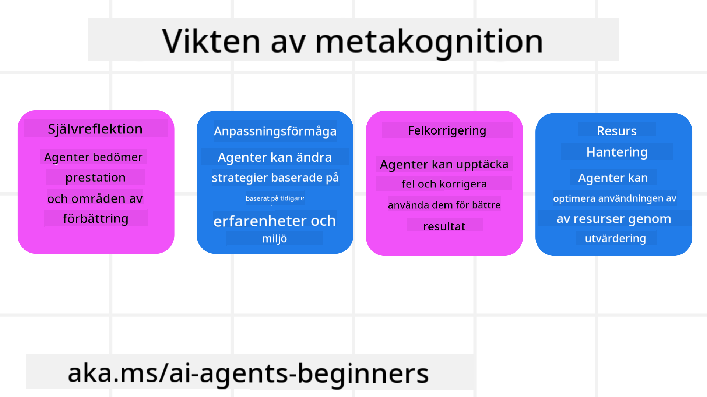
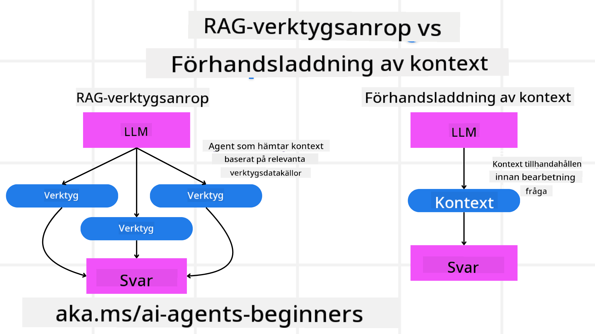

<!--
CO_OP_TRANSLATOR_METADATA:
{
  "original_hash": "8cbf460468c802c7994aa62e0e0779c9",
  "translation_date": "2025-07-12T12:42:43+00:00",
  "source_file": "09-metacognition/README.md",
  "language_code": "sv"
}
-->
[](https://youtu.be/His9R6gw6Ec?si=3_RMb8VprNvdLRhX)

> _(Klicka på bilden ovan för att se videon till denna lektion)_
# Metakognition i AI-agenter

## Introduktion

Välkommen till lektionen om metakognition i AI-agenter! Detta kapitel är utformat för nybörjare som är nyfikna på hur AI-agenter kan reflektera över sina egna tankegångar. I slutet av denna lektion kommer du att förstå viktiga begrepp och ha praktiska exempel för att tillämpa metakognition i designen av AI-agenter.

## Lärandemål

Efter att ha genomfört denna lektion kommer du att kunna:

1. Förstå konsekvenserna av resonemangscykler i agentdefinitioner.
2. Använda planerings- och utvärderingstekniker för att hjälpa självkorrekta agenter.
3. Skapa egna agenter som kan manipulera kod för att utföra uppgifter.

## Introduktion till Metakognition

Metakognition syftar på högre ordningens kognitiva processer som handlar om att tänka på sitt eget tänkande. För AI-agenter innebär detta att kunna utvärdera och justera sina handlingar baserat på självmedvetenhet och tidigare erfarenheter. Metakognition, eller "att tänka på tänkandet," är ett viktigt koncept i utvecklingen av agentbaserade AI-system. Det innebär att AI-system är medvetna om sina egna interna processer och kan övervaka, reglera och anpassa sitt beteende därefter. Precis som vi gör när vi "läser rummet" eller betraktar ett problem. Denna självmedvetenhet kan hjälpa AI-system att fatta bättre beslut, identifiera fel och förbättra sin prestation över tid – vilket återkopplar till Turingtestet och debatten om huruvida AI kommer att ta över.

I sammanhanget med agentbaserade AI-system kan metakognition hjälpa till att hantera flera utmaningar, såsom:
- Transparens: Säkerställa att AI-system kan förklara sitt resonemang och sina beslut.
- Resonemang: Förbättra AI-systemens förmåga att syntetisera information och fatta välgrundade beslut.
- Anpassning: Möjliggöra för AI-system att anpassa sig till nya miljöer och förändrade förhållanden.
- Perception: Förbättra AI-systemens noggrannhet i att känna igen och tolka data från sin omgivning.

### Vad är Metakognition?

Metakognition, eller "att tänka på tänkandet," är en högre ordningens kognitiv process som innefattar självmedvetenhet och självreglering av ens kognitiva processer. Inom AI ger metakognition agenter möjlighet att utvärdera och anpassa sina strategier och handlingar, vilket leder till förbättrad problemlösning och beslutsfattande. Genom att förstå metakognition kan du designa AI-agenter som inte bara är mer intelligenta utan också mer anpassningsbara och effektiva. I äkta metakognition ser man att AI uttryckligen resonerar kring sitt eget resonemang.

Exempel: ”Jag prioriterade billigare flyg eftersom… Jag kanske missar direktflyg, så låt mig dubbelkolla.”
Hålla koll på hur eller varför den valde en viss rutt.
- Notera att den gjorde misstag eftersom den förlitade sig för mycket på användarens preferenser från förra gången, så den ändrar sin beslutsstrategi, inte bara den slutgiltiga rekommendationen.
- Diagnostisera mönster som: ”När jag ser att användaren nämner ’för trångt’, bör jag inte bara ta bort vissa attraktioner utan också reflektera över att min metod för att välja ’topattraktioner’ är bristfällig om jag alltid rankar efter popularitet.”

### Metakognitionens betydelse i AI-agenter

Metakognition spelar en avgörande roll i designen av AI-agenter av flera skäl:



- Självreflektion: Agenter kan bedöma sin egen prestation och identifiera förbättringsområden.
- Anpassningsförmåga: Agenter kan ändra sina strategier baserat på tidigare erfarenheter och förändrade miljöer.
- Felkorrigering: Agenter kan upptäcka och rätta till fel autonomt, vilket leder till mer exakta resultat.
- Resurshantering: Agenter kan optimera användningen av resurser, såsom tid och beräkningskraft, genom att planera och utvärdera sina handlingar.

## Komponenter i en AI-agent

Innan vi går in på metakognitiva processer är det viktigt att förstå de grundläggande komponenterna i en AI-agent. En AI-agent består vanligtvis av:

- Persona: Agentens personlighet och egenskaper, som definierar hur den interagerar med användare.
- Verktyg: De kapaciteter och funktioner som agenten kan utföra.
- Färdigheter: Den kunskap och expertis som agenten besitter.

Dessa komponenter samverkar för att skapa en "expertisenhet" som kan utföra specifika uppgifter.

**Exempel**:
Tänk på en reseagent, en agenttjänst som inte bara planerar din semester utan också anpassar sin väg baserat på realtidsdata och tidigare kundresor.

### Exempel: Metakognition i en reseagenttjänst

Föreställ dig att du designar en reseagenttjänst som drivs av AI. Denna agent, "Travel Agent," hjälper användare att planera sina semestrar. För att inkludera metakognition behöver Travel Agent utvärdera och justera sina handlingar baserat på självmedvetenhet och tidigare erfarenheter. Så här kan metakognition spela en roll:

#### Nuvarande uppgift

Den aktuella uppgiften är att hjälpa en användare att planera en resa till Paris.

#### Steg för att slutföra uppgiften

1. **Samla in användarpreferenser**: Fråga användaren om resedatum, budget, intressen (t.ex. museer, mat, shopping) och eventuella specifika krav.
2. **Hämta information**: Sök efter flygalternativ, boenden, sevärdheter och restauranger som matchar användarens preferenser.
3. **Generera rekommendationer**: Ge en personlig resplan med flygdetaljer, hotellbokningar och föreslagna aktiviteter.
4. **Justera baserat på feedback**: Be användaren om feedback på rekommendationerna och gör nödvändiga justeringar.

#### Nödvändiga resurser

- Tillgång till databaser för flyg- och hotellbokningar.
- Information om sevärdheter och restauranger i Paris.
- Användarfeedback från tidigare interaktioner.

#### Erfarenhet och självreflektion

Travel Agent använder metakognition för att utvärdera sin prestation och lära sig av tidigare erfarenheter. Till exempel:

1. **Analysera användarfeedback**: Travel Agent granskar feedback för att avgöra vilka rekommendationer som mottogs väl och vilka som inte gjorde det. Den anpassar sina framtida förslag därefter.
2. **Anpassningsförmåga**: Om en användare tidigare nämnt att de ogillar trånga platser, undviker Travel Agent att rekommendera populära turistmål under rusningstid i framtiden.
3. **Felkorrigering**: Om Travel Agent gjorde ett misstag vid en tidigare bokning, som att föreslå ett hotell som var fullbokat, lär den sig att kontrollera tillgänglighet noggrannare innan rekommendationer ges.

#### Praktiskt exempel för utvecklare

Här är ett förenklat exempel på hur Travel Agents kod kan se ut när metakognition inkluderas:

```python
class Travel_Agent:
    def __init__(self):
        self.user_preferences = {}
        self.experience_data = []

    def gather_preferences(self, preferences):
        self.user_preferences = preferences

    def retrieve_information(self):
        # Search for flights, hotels, and attractions based on preferences
        flights = search_flights(self.user_preferences)
        hotels = search_hotels(self.user_preferences)
        attractions = search_attractions(self.user_preferences)
        return flights, hotels, attractions

    def generate_recommendations(self):
        flights, hotels, attractions = self.retrieve_information()
        itinerary = create_itinerary(flights, hotels, attractions)
        return itinerary

    def adjust_based_on_feedback(self, feedback):
        self.experience_data.append(feedback)
        # Analyze feedback and adjust future recommendations
        self.user_preferences = adjust_preferences(self.user_preferences, feedback)

# Example usage
travel_agent = Travel_Agent()
preferences = {
    "destination": "Paris",
    "dates": "2025-04-01 to 2025-04-10",
    "budget": "moderate",
    "interests": ["museums", "cuisine"]
}
travel_agent.gather_preferences(preferences)
itinerary = travel_agent.generate_recommendations()
print("Suggested Itinerary:", itinerary)
feedback = {"liked": ["Louvre Museum"], "disliked": ["Eiffel Tower (too crowded)"]}
travel_agent.adjust_based_on_feedback(feedback)
```

#### Varför metakognition är viktigt

- **Självreflektion**: Agenter kan analysera sin prestation och identifiera förbättringsområden.
- **Anpassningsförmåga**: Agenter kan ändra strategier baserat på feedback och förändrade förhållanden.
- **Felkorrigering**: Agenter kan autonomt upptäcka och rätta till misstag.
- **Resurshantering**: Agenter kan optimera resursanvändning, såsom tid och beräkningskraft.

Genom att inkludera metakognition kan Travel Agent erbjuda mer personliga och korrekta reseförslag, vilket förbättrar användarupplevelsen.

---

## 2. Planering i agenter

Planering är en kritisk del av AI-agenters beteende. Det innebär att skissera de steg som behövs för att nå ett mål, med hänsyn till nuvarande tillstånd, resurser och möjliga hinder.

### Planeringens element

- **Nuvarande uppgift**: Definiera uppgiften tydligt.
- **Steg för att slutföra uppgiften**: Dela upp uppgiften i hanterbara steg.
- **Nödvändiga resurser**: Identifiera vilka resurser som krävs.
- **Erfarenhet**: Använd tidigare erfarenheter för att informera planeringen.

**Exempel**:
Här är stegen som Travel Agent behöver ta för att effektivt hjälpa en användare att planera sin resa:

### Steg för Travel Agent

1. **Samla in användarpreferenser**
   - Fråga användaren om detaljer kring resedatum, budget, intressen och eventuella specifika krav.
   - Exempel: "När planerar du att resa?" "Vad är din budget?" "Vilka aktiviteter tycker du om på semestern?"

2. **Hämta information**
   - Sök efter relevanta resealternativ baserat på användarens preferenser.
   - **Flyg**: Leta efter tillgängliga flyg inom användarens budget och önskade datum.
   - **Boenden**: Hitta hotell eller hyrbostäder som matchar användarens önskemål om läge, pris och bekvämligheter.
   - **Sevärdheter och restauranger**: Identifiera populära attraktioner, aktiviteter och matställen som passar användarens intressen.

3. **Generera rekommendationer**
   - Sammanställ den insamlade informationen till en personlig resplan.
   - Ge detaljer som flygalternativ, hotellbokningar och föreslagna aktiviteter, anpassade efter användarens preferenser.

4. **Presentera resplanen för användaren**
   - Dela den föreslagna resplanen för användarens granskning.
   - Exempel: "Här är ett förslag på resplan för din resa till Paris. Den inkluderar flygdetaljer, hotellbokningar och en lista med rekommenderade aktiviteter och restauranger. Vad tycker du?"

5. **Samla in feedback**
   - Be användaren om synpunkter på den föreslagna resplanen.
   - Exempel: "Gillar du flygalternativen?" "Passar hotellet dina behov?" "Finns det några aktiviteter du vill lägga till eller ta bort?"

6. **Justera baserat på feedback**
   - Ändra resplanen utifrån användarens synpunkter.
   - Gör nödvändiga ändringar i flyg, boende och aktivitetsrekommendationer för att bättre matcha användarens önskemål.

7. **Slutgiltig bekräftelse**
   - Presentera den uppdaterade resplanen för användaren för slutgiltigt godkännande.
   - Exempel: "Jag har gjort ändringarna baserat på din feedback. Här är den uppdaterade resplanen. Ser allt bra ut?"

8. **Boka och bekräfta reservationer**
   - När användaren godkänner resplanen, gå vidare med bokning av flyg, boenden och eventuella förbokade aktiviteter.
   - Skicka bekräftelseinformation till användaren.

9. **Erbjuda löpande support**
   - Var tillgänglig för att hjälpa användaren med eventuella ändringar eller ytterligare önskemål före och under resan.
   - Exempel: "Om du behöver hjälp under resan, tveka inte att kontakta mig när som helst!"

### Exempel på interaktion

```python
class Travel_Agent:
    def __init__(self):
        self.user_preferences = {}
        self.experience_data = []

    def gather_preferences(self, preferences):
        self.user_preferences = preferences

    def retrieve_information(self):
        flights = search_flights(self.user_preferences)
        hotels = search_hotels(self.user_preferences)
        attractions = search_attractions(self.user_preferences)
        return flights, hotels, attractions

    def generate_recommendations(self):
        flights, hotels, attractions = self.retrieve_information()
        itinerary = create_itinerary(flights, hotels, attractions)
        return itinerary

    def adjust_based_on_feedback(self, feedback):
        self.experience_data.append(feedback)
        self.user_preferences = adjust_preferences(self.user_preferences, feedback)

# Example usage within a booing request
travel_agent = Travel_Agent()
preferences = {
    "destination": "Paris",
    "dates": "2025-04-01 to 2025-04-10",
    "budget": "moderate",
    "interests": ["museums", "cuisine"]
}
travel_agent.gather_preferences(preferences)
itinerary = travel_agent.generate_recommendations()
print("Suggested Itinerary:", itinerary)
feedback = {"liked": ["Louvre Museum"], "disliked": ["Eiffel Tower (too crowded)"]}
travel_agent.adjust_based_on_feedback(feedback)
```

## 3. Korrigerande RAG-system

Låt oss först förstå skillnaden mellan RAG-verktyget och Pre-emptive Context Load.



### Retrieval-Augmented Generation (RAG)

RAG kombinerar ett återhämtningssystem med en generativ modell. När en fråga ställs hämtar återhämtningssystemet relevanta dokument eller data från en extern källa, och denna hämtade information används för att förstärka input till den generativa modellen. Detta hjälper modellen att generera mer exakta och kontextuellt relevanta svar.

I ett RAG-system hämtar agenten relevant information från en kunskapsbas och använder den för att generera lämpliga svar eller handlingar.

### Korrigerande RAG-metod

Den korrigerande RAG-metoden fokuserar på att använda RAG-tekniker för att rätta till fel och förbättra AI-agenters noggrannhet. Detta innefattar:

1. **Prompting-teknik**: Använda specifika prompts för att styra agenten att hämta relevant information.
2. **Verktyg**: Implementera algoritmer och mekanismer som gör det möjligt för agenten att utvärdera relevansen av den hämtade informationen och generera korrekta svar.
3. **Utvärdering**: Kontinuerligt bedöma agentens prestation och göra justeringar för att förbättra dess noggrannhet och effektivitet.

#### Exempel: Korrigerande RAG i en sökagent

Tänk på en sökagent som hämtar information från webben för att svara på användarfrågor. Den korrigerande RAG-metoden kan innebära:

1. **Prompting-teknik**: Formulera sökfrågor baserat på användarens input.
2. **Verktyg**: Använda naturlig språkbehandling och maskininlärningsalgoritmer för att rangordna och filtrera sökresultat.
3. **Utvärdering**: Analysera användarfeedback för att identifiera och rätta till felaktigheter i den hämtade informationen.

### Korrigerande RAG i Travel Agent

Korrigerande RAG (Retrieval-Augmented Generation) förbättrar en AI:s förmåga att hämta och generera information samtidigt som eventuella fel rättas till. Låt oss se hur Travel Agent kan använda den korrigerande RAG-metoden för att ge mer exakta och relevanta reseförslag.

Detta innebär:

- **Prompting-teknik:** Använda specifika prompts för att styra agenten att hämta relevant information.
- **Verktyg:** Implementera algoritmer och mekanismer som gör det möjligt för agenten att utvärdera relevansen av den hämtade informationen och generera korrekta svar.
- **Utvärdering:** Kontinuerligt bedöma agentens prestation och göra justeringar för att förbättra dess noggrannhet och effektivitet.

#### Steg för att implementera korrigerande RAG i Travel Agent

1. **Initial användarinteraktion**
   - Travel Agent samlar in användarens initiala preferenser, såsom destination, resedatum, budget och intressen.
   - Exempel:

     ```python
     preferences = {
         "destination": "Paris",
         "dates": "2025-04-01 to 2025-04-10",
         "budget": "moderate",
         "interests": ["museums", "cuisine"]
     }
     ```

2. **Informationshämtning**
   - Travel Agent hämtar information om flyg, boenden, sevärdheter och restauranger baserat på användarens preferenser.
   - Exempel:

     ```python
     flights = search_flights(preferences)
     hotels = search_hotels(preferences)
     attractions = search_attractions(preferences)
     ```

3. **Generera initiala rekommendationer**
   - Travel Agent använder den hämtade informationen för att skapa en personlig resplan.
   - Exempel:

     ```python
     itinerary = create_itinerary(flights, hotels, attractions)
     print("Suggested Itinerary:", itinerary)
     ```

4. **Samla in användarfeedback**
   - Travel Agent ber användaren om feedback på de initiala rekommendationerna.
   - Exempel:

     ```python
     feedback = {
         "liked": ["Louvre Museum"],
         "disliked": ["Eiffel Tower (too crowded)"]
     }
     ```

5. **Korrigerande RAG-process**
   - **Prompting-teknik**: Travel Agent formulerar nya sökfrågor baserat på användarens feedback.
     - Exempel:

       ```python
       if "disliked" in feedback:
           preferences["avoid"] = feedback["disliked"]
       ```

   - **Verktyg**: Travel Agent använder algoritmer för att rangordna och filtrera nya sökresultat, med fokus på relevans baserat på användarens feedback.
     - Exempel:

       ```python
       new_attractions = search_attractions(preferences)
       new_itinerary = create_itinerary(flights, hotels, new_attractions)
       print("Updated Itinerary:", new_itinerary)
       ```

   - **Utvärdering**: Travel Agent bedömer kontinuerligt relevansen och noggrannheten i sina rekommendationer genom att analysera användarfeedback och göra nödvändiga justeringar.
     - Exempel:

       ```python
       def adjust_preferences(preferences, feedback):
           if "liked" in feedback:
               preferences["favorites"] = feedback["liked"]
           if "disliked" in feedback:
               preferences["avoid"] = feedback["disliked"]
           return preferences

       preferences = adjust_preferences(preferences, feedback)
       ```

#### Praktiskt exempel

Här är ett förenklat Python-exempel som inkluderar den korrigerande RAG-metoden i Travel Agent:
### Förhandsladdning av Kontext

Förhandsladdning av kontext innebär att relevant kontext eller bakgrundsinformation laddas in i modellen innan en fråga bearbetas. Det betyder att modellen har tillgång till denna information från början, vilket kan hjälpa den att generera mer välgrundade svar utan att behöva hämta ytterligare data under processen.

Här är ett förenklat exempel på hur en förhandsladdning av kontext kan se ut för en resebyråapplikation i Python:

```python
class TravelAgent:
    def __init__(self):
        # Pre-load popular destinations and their information
        self.context = {
            "Paris": {"country": "France", "currency": "Euro", "language": "French", "attractions": ["Eiffel Tower", "Louvre Museum"]},
            "Tokyo": {"country": "Japan", "currency": "Yen", "language": "Japanese", "attractions": ["Tokyo Tower", "Shibuya Crossing"]},
            "New York": {"country": "USA", "currency": "Dollar", "language": "English", "attractions": ["Statue of Liberty", "Times Square"]},
            "Sydney": {"country": "Australia", "currency": "Dollar", "language": "English", "attractions": ["Sydney Opera House", "Bondi Beach"]}
        }

    def get_destination_info(self, destination):
        # Fetch destination information from pre-loaded context
        info = self.context.get(destination)
        if info:
            return f"{destination}:\nCountry: {info['country']}\nCurrency: {info['currency']}\nLanguage: {info['language']}\nAttractions: {', '.join(info['attractions'])}"
        else:
            return f"Sorry, we don't have information on {destination}."

# Example usage
travel_agent = TravelAgent()
print(travel_agent.get_destination_info("Paris"))
print(travel_agent.get_destination_info("Tokyo"))
```

#### Förklaring

1. **Initiering (`__init__`-metoden)**: `TravelAgent`-klassen förladdar en ordbok med information om populära resmål som Paris, Tokyo, New York och Sydney. Denna ordbok innehåller detaljer som land, valuta, språk och stora sevärdheter för varje resmål.

2. **Hämta information (`get_destination_info`-metoden)**: När en användare frågar om ett specifikt resmål hämtar `get_destination_info`-metoden relevant information från den förladdade kontextordboken.

Genom att förladda kontexten kan resebyråapplikationen snabbt svara på användarfrågor utan att behöva hämta information från en extern källa i realtid. Detta gör applikationen mer effektiv och responsiv.

### Starta Planen med ett Mål Innan Iteration

Att starta en plan med ett mål innebär att börja med ett tydligt syfte eller önskat resultat i åtanke. Genom att definiera detta mål från början kan modellen använda det som en vägledande princip under hela den iterativa processen. Detta hjälper till att säkerställa att varje iteration för planen närmare det önskade resultatet, vilket gör processen mer effektiv och fokuserad.

Här är ett exempel på hur du kan starta en reseplan med ett mål innan du itererar för en resebyrå i Python:

### Scenario

En resebyrå vill planera en skräddarsydd semester för en kund. Målet är att skapa en resplan som maximerar kundens tillfredsställelse baserat på deras preferenser och budget.

### Steg

1. Definiera kundens preferenser och budget.
2. Starta den initiala planen baserat på dessa preferenser.
3. Iterera för att förfina planen och optimera för kundens tillfredsställelse.

#### Python-kod

```python
class TravelAgent:
    def __init__(self, destinations):
        self.destinations = destinations

    def bootstrap_plan(self, preferences, budget):
        plan = []
        total_cost = 0

        for destination in self.destinations:
            if total_cost + destination['cost'] <= budget and self.match_preferences(destination, preferences):
                plan.append(destination)
                total_cost += destination['cost']

        return plan

    def match_preferences(self, destination, preferences):
        for key, value in preferences.items():
            if destination.get(key) != value:
                return False
        return True

    def iterate_plan(self, plan, preferences, budget):
        for i in range(len(plan)):
            for destination in self.destinations:
                if destination not in plan and self.match_preferences(destination, preferences) and self.calculate_cost(plan, destination) <= budget:
                    plan[i] = destination
                    break
        return plan

    def calculate_cost(self, plan, new_destination):
        return sum(destination['cost'] for destination in plan) + new_destination['cost']

# Example usage
destinations = [
    {"name": "Paris", "cost": 1000, "activity": "sightseeing"},
    {"name": "Tokyo", "cost": 1200, "activity": "shopping"},
    {"name": "New York", "cost": 900, "activity": "sightseeing"},
    {"name": "Sydney", "cost": 1100, "activity": "beach"},
]

preferences = {"activity": "sightseeing"}
budget = 2000

travel_agent = TravelAgent(destinations)
initial_plan = travel_agent.bootstrap_plan(preferences, budget)
print("Initial Plan:", initial_plan)

refined_plan = travel_agent.iterate_plan(initial_plan, preferences, budget)
print("Refined Plan:", refined_plan)
```

#### Kodförklaring

1. **Initiering (`__init__`-metoden)**: `TravelAgent`-klassen initieras med en lista över potentiella resmål, där varje resmål har attribut som namn, kostnad och aktivitetstyp.

2. **Starta planen (`bootstrap_plan`-metoden)**: Denna metod skapar en initial resplan baserat på kundens preferenser och budget. Den går igenom listan med resmål och lägger till dem i planen om de matchar kundens preferenser och ryms inom budgeten.

3. **Matcha preferenser (`match_preferences`-metoden)**: Denna metod kontrollerar om ett resmål matchar kundens preferenser.

4. **Iterera planen (`iterate_plan`-metoden)**: Denna metod förfinar den initiala planen genom att försöka ersätta varje resmål i planen med ett bättre alternativ, med hänsyn till kundens preferenser och budgetbegränsningar.

5. **Beräkna kostnad (`calculate_cost`-metoden)**: Denna metod beräknar den totala kostnaden för den aktuella planen, inklusive ett potentiellt nytt resmål.

#### Exempel på användning

- **Initial plan**: Resebyrån skapar en initial plan baserat på kundens preferenser för sightseeing och en budget på 2000 dollar.
- **Förfinad plan**: Resebyrån itererar planen och optimerar för kundens preferenser och budget.

Genom att starta planen med ett tydligt mål (t.ex. att maximera kundens tillfredsställelse) och iterera för att förfina planen kan resebyrån skapa en skräddarsydd och optimerad resplan för kunden. Detta tillvägagångssätt säkerställer att resplanen från början stämmer överens med kundens preferenser och budget och förbättras vid varje iteration.

### Utnyttja LLM för Omrankning och Poängsättning

Stora språkmodeller (LLM) kan användas för omrankning och poängsättning genom att utvärdera relevansen och kvaliteten på hämtade dokument eller genererade svar. Så här fungerar det:

**Hämtning:** Det initiala steget hämtar en uppsättning kandidatdokument eller svar baserat på frågan.

**Omrankning:** LLM utvärderar dessa kandidater och omrankar dem baserat på deras relevans och kvalitet. Detta steg säkerställer att den mest relevanta och högkvalitativa informationen presenteras först.

**Poängsättning:** LLM tilldelar poäng till varje kandidat som speglar deras relevans och kvalitet. Detta hjälper till att välja det bästa svaret eller dokumentet för användaren.

Genom att använda LLM för omrankning och poängsättning kan systemet leverera mer exakta och kontextuellt relevanta svar, vilket förbättrar användarupplevelsen.

Här är ett exempel på hur en resebyrå kan använda en stor språkmodell (LLM) för omrankning och poängsättning av resmål baserat på användarpreferenser i Python:

#### Scenario – Resa baserat på preferenser

En resebyrå vill rekommendera de bästa resmålen till en kund baserat på deras preferenser. LLM hjälper till att omrank och poängsätta resmålen för att säkerställa att de mest relevanta alternativen presenteras.

#### Steg:

1. Samla in användarpreferenser.
2. Hämta en lista med potentiella resmål.
3. Använd LLM för att omrank och poängsätta resmålen baserat på användarpreferenser.

Så här kan du uppdatera det tidigare exemplet för att använda Azure OpenAI Services:

#### Krav

1. Du behöver ha ett Azure-abonnemang.
2. Skapa en Azure OpenAI-resurs och få din API-nyckel.

#### Exempel på Python-kod

```python
import requests
import json

class TravelAgent:
    def __init__(self, destinations):
        self.destinations = destinations

    def get_recommendations(self, preferences, api_key, endpoint):
        # Generate a prompt for the Azure OpenAI
        prompt = self.generate_prompt(preferences)
        
        # Define headers and payload for the request
        headers = {
            'Content-Type': 'application/json',
            'Authorization': f'Bearer {api_key}'
        }
        payload = {
            "prompt": prompt,
            "max_tokens": 150,
            "temperature": 0.7
        }
        
        # Call the Azure OpenAI API to get the re-ranked and scored destinations
        response = requests.post(endpoint, headers=headers, json=payload)
        response_data = response.json()
        
        # Extract and return the recommendations
        recommendations = response_data['choices'][0]['text'].strip().split('\n')
        return recommendations

    def generate_prompt(self, preferences):
        prompt = "Here are the travel destinations ranked and scored based on the following user preferences:\n"
        for key, value in preferences.items():
            prompt += f"{key}: {value}\n"
        prompt += "\nDestinations:\n"
        for destination in self.destinations:
            prompt += f"- {destination['name']}: {destination['description']}\n"
        return prompt

# Example usage
destinations = [
    {"name": "Paris", "description": "City of lights, known for its art, fashion, and culture."},
    {"name": "Tokyo", "description": "Vibrant city, famous for its modernity and traditional temples."},
    {"name": "New York", "description": "The city that never sleeps, with iconic landmarks and diverse culture."},
    {"name": "Sydney", "description": "Beautiful harbour city, known for its opera house and stunning beaches."},
]

preferences = {"activity": "sightseeing", "culture": "diverse"}
api_key = 'your_azure_openai_api_key'
endpoint = 'https://your-endpoint.com/openai/deployments/your-deployment-name/completions?api-version=2022-12-01'

travel_agent = TravelAgent(destinations)
recommendations = travel_agent.get_recommendations(preferences, api_key, endpoint)
print("Recommended Destinations:")
for rec in recommendations:
    print(rec)
```

#### Kodförklaring – Preference Booker

1. **Initiering**: `TravelAgent`-klassen initieras med en lista över potentiella resmål, där varje resmål har attribut som namn och beskrivning.

2. **Hämta rekommendationer (`get_recommendations`-metoden)**: Denna metod genererar en prompt för Azure OpenAI-tjänsten baserat på användarens preferenser och gör en HTTP POST-förfrågan till Azure OpenAI API för att få omrankade och poängsatta resmål.

3. **Generera prompt (`generate_prompt`-metoden)**: Denna metod konstruerar en prompt för Azure OpenAI, inklusive användarens preferenser och listan över resmål. Prompten styr modellen att omrank och poängsätta resmålen baserat på de angivna preferenserna.

4. **API-anrop**: `requests`-biblioteket används för att göra en HTTP POST-förfrågan till Azure OpenAI API-slutpunkten. Svaret innehåller de omrankade och poängsatta resmålen.

5. **Exempel på användning**: Resebyrån samlar in användarpreferenser (t.ex. intresse för sightseeing och mångkulturell upplevelse) och använder Azure OpenAI-tjänsten för att få omrankade och poängsatta rekommendationer för resmål.

Se till att byta ut `your_azure_openai_api_key` mot din faktiska Azure OpenAI API-nyckel och `https://your-endpoint.com/...` mot den faktiska slutpunkts-URL:en för din Azure OpenAI-distribution.

Genom att utnyttja LLM för omrankning och poängsättning kan resebyrån erbjuda mer personliga och relevanta reseförslag till kunder, vilket förbättrar deras totala upplevelse.

### RAG: Prompting-teknik vs Verktyg

Retrieval-Augmented Generation (RAG) kan vara både en prompting-teknik och ett verktyg vid utveckling av AI-agenter. Att förstå skillnaden mellan de två kan hjälpa dig att använda RAG mer effektivt i dina projekt.

#### RAG som Prompting-teknik

**Vad är det?**

- Som en prompting-teknik innebär RAG att formulera specifika frågor eller prompts för att styra hämtningen av relevant information från en stor datamängd eller databas. Denna information används sedan för att generera svar eller handlingar.

**Hur det fungerar:**

1. **Formulera prompts**: Skapa välstrukturerade prompts eller frågor baserat på uppgiften eller användarens input.
2. **Hämta information**: Använd prompts för att söka efter relevant data från en befintlig kunskapsbas eller dataset.
3. **Generera svar**: Kombinera den hämtade informationen med generativa AI-modeller för att producera ett omfattande och sammanhängande svar.

**Exempel i resebyrå:**

- Användarinput: "Jag vill besöka museer i Paris."
- Prompt: "Hitta de bästa museerna i Paris."
- Hämtad information: Detaljer om Louvre, Musée d'Orsay, etc.
- Genererat svar: "Här är några av de bästa museerna i Paris: Louvre, Musée d'Orsay och Centre Pompidou."

#### RAG som Verktyg

**Vad är det?**

- Som ett verktyg är RAG ett integrerat system som automatiserar hämtning och generering, vilket gör det enklare för utvecklare att implementera komplexa AI-funktioner utan att manuellt skapa prompts för varje fråga.

**Hur det fungerar:**

1. **Integration**: Bädda in RAG i AI-agentens arkitektur så att den automatiskt hanterar hämtning och generering.
2. **Automatisering**: Verktyget sköter hela processen, från att ta emot användarinput till att generera slutgiltigt svar, utan att kräva explicita prompts för varje steg.
3. **Effektivitet**: Förbättrar agentens prestanda genom att effektivisera hämtning och generering, vilket möjliggör snabbare och mer precisa svar.

**Exempel i resebyrå:**

- Användarinput: "Jag vill besöka museer i Paris."
- RAG-verktyg: Hämtar automatiskt information om museer och genererar ett svar.
- Genererat svar: "Här är några av de bästa museerna i Paris: Louvre, Musée d'Orsay och Centre Pompidou."

### Jämförelse

| Aspekt                 | Prompting-teknik                                         | Verktyg                                               |
|------------------------|----------------------------------------------------------|------------------------------------------------------|
| **Manuellt vs Automatiskt** | Manuell formulering av prompts för varje fråga.          | Automatiserad process för hämtning och generering.   |
| **Kontroll**            | Ger mer kontroll över hämtning.                          | Effektiviserar och automatiserar hämtning och generering. |
| **Flexibilitet**        | Tillåter anpassade prompts baserat på specifika behov.  | Mer effektivt för storskaliga implementationer.      |
| **Komplexitet**         | Kräver skapande och justering av prompts.                | Lättare att integrera i AI-agentens arkitektur.       |

### Praktiska Exempel

**Exempel på Prompting-teknik:**

```python
def search_museums_in_paris():
    prompt = "Find top museums in Paris"
    search_results = search_web(prompt)
    return search_results

museums = search_museums_in_paris()
print("Top Museums in Paris:", museums)
```

**Exempel på Verktyg:**

```python
class Travel_Agent:
    def __init__(self):
        self.rag_tool = RAGTool()

    def get_museums_in_paris(self):
        user_input = "I want to visit museums in Paris."
        response = self.rag_tool.retrieve_and_generate(user_input)
        return response

travel_agent = Travel_Agent()
museums = travel_agent.get_museums_in_paris()
print("Top Museums in Paris:", museums)
```

### Utvärdera Relevans

Att utvärdera relevans är en avgörande del av AI-agenters prestanda. Det säkerställer att informationen som hämtas och genereras av agenten är lämplig, korrekt och användbar för användaren. Låt oss utforska hur man kan utvärdera relevans i AI-agenter, inklusive praktiska exempel och tekniker.

#### Nyckelkoncept för att utvärdera relevans

1. **Kontextmedvetenhet**:
   - Agenten måste förstå kontexten i användarens fråga för att hämta och generera relevant information.
   - Exempel: Om en användare frågar efter "bästa restaurangerna i Paris" bör agenten ta hänsyn till användarens preferenser, som typ av kök och budget.

2. **Noggrannhet**:
   - Informationen som agenten tillhandahåller ska vara faktamässigt korrekt och uppdaterad.
   - Exempel: Rekommendera restauranger som är öppna och har goda recensioner, snarare än inaktuella eller stängda alternativ.

3. **Användarens avsikt**:
   - Agenten bör tolka användarens avsikt bakom frågan för att ge den mest relevanta informationen.
   - Exempel: Om en användare frågar efter "prisvärda hotell" bör agenten prioritera prisvärda alternativ.

4. **Feedback-loop**:
   - Kontinuerlig insamling och analys av användarfeedback hjälper agenten att förbättra sin relevansbedömning.
   - Exempel: Inkorporera användarbetyg och feedback på tidigare rekommendationer för att förbättra framtida svar.

#### Praktiska tekniker för att utvärdera relevans

1. **Relevanspoängsättning**:
   - Tilldela varje hämtat objekt en relevanspoäng baserat på hur väl det matchar användarens fråga och preferenser.
   - Exempel:

     ```python
     def relevance_score(item, query):
         score = 0
         if item['category'] in query['interests']:
             score += 1
         if item['price'] <= query['budget']:
             score += 1
         if item['location'] == query['destination']:
             score += 1
         return score
     ```

2. **Filtrering och rangordning**:
   - Filtrera bort irrelevanta objekt och rangordna de återstående baserat på deras relevanspoäng.
   - Exempel:

     ```python
     def filter_and_rank(items, query):
         ranked_items = sorted(items, key=lambda item: relevance_score(item, query), reverse=True)
         return ranked_items[:10]  # Return top 10 relevant items
     ```

3. **Naturlig språkbehandling (NLP)**:
   - Använd NLP-tekniker för att förstå användarens fråga och hämta relevant information.
   - Exempel:

     ```python
     def process_query(query):
         # Use NLP to extract key information from the user's query
         processed_query = nlp(query)
         return processed_query
     ```

4. **Integrering av användarfeedback**:
   - Samla in användarfeedback på de rekommendationer som ges och använd den för att justera framtida relevansbedömningar.
   - Exempel:

     ```python
     def adjust_based_on_feedback(feedback, items):
         for item in items:
             if item['name'] in feedback['liked']:
                 item['relevance'] += 1
             if item['name'] in feedback['disliked']:
                 item['relevance'] -= 1
         return items
     ```

#### Exempel: Utvärdera relevans i Travel Agent

Här är ett praktiskt exempel på hur Travel Agent kan utvärdera relevansen av reseförslag:

```python
class Travel_Agent:
    def __init__(self):
        self.user_preferences = {}
        self.experience_data = []

    def gather_preferences(self, preferences):
        self.user_preferences = preferences

    def retrieve_information(self):
        flights = search_flights(self.user_preferences)
        hotels = search_hotels(self.user_preferences)
        attractions = search_attractions(self.user_preferences)
        return flights, hotels, attractions

    def generate_recommendations(self):
        flights, hotels, attractions = self.retrieve_information()
        ranked_hotels = self.filter_and_rank(hotels, self.user_preferences)
        itinerary = create_itinerary(flights, ranked_hotels, attractions)
        return itinerary

    def filter_and_rank(self, items, query):
        ranked_items = sorted(items, key=lambda item: self.relevance_score(item, query), reverse=True)
        return ranked_items[:10]  # Return top 10 relevant items

    def relevance_score(self, item, query):
        score = 0
        if item['category'] in query['interests']:
            score += 1
        if item['price'] <= query['budget']:
            score += 1
        if item['location'] == query['destination']:
            score += 1
        return score

    def adjust_based_on_feedback(self, feedback, items):
        for item in items:
            if item['name'] in feedback['liked']:
                item['relevance'] += 1
            if item['name'] in feedback['disliked']:
                item['relevance'] -= 1
        return items

# Example usage
travel_agent = Travel_Agent()
preferences = {
    "destination": "Paris",
    "dates": "2025-04-01 to 2025-04-10",
    "budget": "moderate",
    "interests": ["museums", "cuisine"]
}
travel_agent.gather_preferences(preferences)
itinerary = travel_agent.generate_recommendations()
print("Suggested Itinerary:", itinerary)
feedback = {"liked": ["Louvre Museum"], "disliked": ["Eiffel Tower (too crowded)"]}
updated_items = travel_agent.adjust_based_on_feedback(feedback, itinerary['hotels'])
print("Updated Itinerary with Feedback:", updated_items)
```

### Söka med Avsikt

Att söka med avsikt innebär att förstå och tolka det underliggande syftet eller målet bakom en användares fråga för att hämta och generera den mest relevanta och användbara informationen. Detta tillvägagångssätt går bortom att bara matcha nyckelord och fokuserar på att greppa användarens faktiska behov och kontext.

#### Nyckelkoncept i att söka med avsikt

1. **Förstå användarens avsikt**:
   - Användarens avsikt kan delas in i tre huvudtyper: informativ, navigerande och transaktionell.
     - **Informativ avsikt**: Användaren söker information om ett ämne (t.ex. "Vilka är de bästa museerna i Paris?").
     - **Navigerande avsikt**: Användaren vill navigera till en specifik webbplats eller sida (t.ex. "Louvre Museums officiella webbplats").
     - **Transaktionell avsikt**: Användaren vill utföra en transaktion, som att boka en flygning eller göra ett köp (t.ex. "Boka en flygning till Paris").

2. **Kontextmedvetenhet**:
   - Att analysera kontexten i användarens fråga hjälper till att korrekt identifiera deras avsikt. Detta inkluderar att ta hänsyn till tidigare interaktioner, användarpreferenser och specifika detaljer i den aktuella frågan.

3. **Naturlig språkbehandling (NLP)**:
   - NLP-tekniker används för att förstå och tolka de naturliga språkfrågor som användarna ställer. Detta inkluderar uppgifter som entitetsigenkänning, sentimentanalys och frågeparsing.

4. **Personalisering**:
   - Att anpassa sökresultaten baserat på användarens historik, preferenser och feedback förbättrar relevansen i den information som hämtas.
#### Praktiskt exempel: Söka med avsikt i Travel Agent

Låt oss ta Travel Agent som exempel för att se hur sökning med avsikt kan implementeras.

1. **Samla in användarpreferenser**

   ```python
   class Travel_Agent:
       def __init__(self):
           self.user_preferences = {}

       def gather_preferences(self, preferences):
           self.user_preferences = preferences
   ```

2. **Förstå användarens avsikt**

   ```python
   def identify_intent(query):
       if "book" in query or "purchase" in query:
           return "transactional"
       elif "website" in query or "official" in query:
           return "navigational"
       else:
           return "informational"
   ```

3. **Kontextmedvetenhet**

   ```python
   def analyze_context(query, user_history):
       # Combine current query with user history to understand context
       context = {
           "current_query": query,
           "user_history": user_history
       }
       return context
   ```

4. **Sök och anpassa resultat**

   ```python
   def search_with_intent(query, preferences, user_history):
       intent = identify_intent(query)
       context = analyze_context(query, user_history)
       if intent == "informational":
           search_results = search_information(query, preferences)
       elif intent == "navigational":
           search_results = search_navigation(query)
       elif intent == "transactional":
           search_results = search_transaction(query, preferences)
       personalized_results = personalize_results(search_results, user_history)
       return personalized_results

   def search_information(query, preferences):
       # Example search logic for informational intent
       results = search_web(f"best {preferences['interests']} in {preferences['destination']}")
       return results

   def search_navigation(query):
       # Example search logic for navigational intent
       results = search_web(query)
       return results

   def search_transaction(query, preferences):
       # Example search logic for transactional intent
       results = search_web(f"book {query} to {preferences['destination']}")
       return results

   def personalize_results(results, user_history):
       # Example personalization logic
       personalized = [result for result in results if result not in user_history]
       return personalized[:10]  # Return top 10 personalized results
   ```

5. **Exempel på användning**

   ```python
   travel_agent = Travel_Agent()
   preferences = {
       "destination": "Paris",
       "interests": ["museums", "cuisine"]
   }
   travel_agent.gather_preferences(preferences)
   user_history = ["Louvre Museum website", "Book flight to Paris"]
   query = "best museums in Paris"
   results = search_with_intent(query, preferences, user_history)
   print("Search Results:", results)
   ```

---

## 4. Generera kod som ett verktyg

Kodgenererande agenter använder AI-modeller för att skriva och köra kod, lösa komplexa problem och automatisera uppgifter.

### Kodgenererande agenter

Kodgenererande agenter använder generativa AI-modeller för att skriva och köra kod. Dessa agenter kan lösa komplexa problem, automatisera uppgifter och ge värdefulla insikter genom att generera och köra kod i olika programmeringsspråk.

#### Praktiska tillämpningar

1. **Automatisk kodgenerering**: Generera kodsnuttar för specifika uppgifter, som dataanalys, webbsökning eller maskininlärning.
2. **SQL som RAG**: Använd SQL-frågor för att hämta och manipulera data från databaser.
3. **Problemlösning**: Skapa och kör kod för att lösa specifika problem, som att optimera algoritmer eller analysera data.

#### Exempel: Kodgenererande agent för dataanalys

Föreställ dig att du designar en kodgenererande agent. Så här kan den fungera:

1. **Uppgift**: Analysera en dataset för att identifiera trender och mönster.
2. **Steg**:
   - Ladda in datasetet i ett dataanalysverktyg.
   - Generera SQL-frågor för att filtrera och aggregera data.
   - Kör frågorna och hämta resultaten.
   - Använd resultaten för att skapa visualiseringar och insikter.
3. **Nödvändiga resurser**: Tillgång till dataset, dataanalysverktyg och SQL-funktioner.
4. **Erfarenhet**: Använd tidigare analysresultat för att förbättra noggrannheten och relevansen i framtida analyser.

### Exempel: Kodgenererande agent för Travel Agent

I detta exempel designar vi en kodgenererande agent, Travel Agent, som hjälper användare att planera sin resa genom att generera och köra kod. Denna agent kan hantera uppgifter som att hämta resealternativ, filtrera resultat och sammanställa en resplan med hjälp av generativ AI.

#### Översikt av den kodgenererande agenten

1. **Samla in användarpreferenser**: Samlar in användarens input som destination, resedatum, budget och intressen.
2. **Generera kod för att hämta data**: Skapar kodsnuttar för att hämta information om flyg, hotell och sevärdheter.
3. **Köra genererad kod**: Kör den genererade koden för att hämta realtidsinformation.
4. **Generera resplan**: Sammanställer den hämtade datan till en personlig reseplan.
5. **Justera baserat på feedback**: Tar emot användarfeedback och genererar om koden vid behov för att förfina resultaten.

#### Steg-för-steg-implementering

1. **Samla in användarpreferenser**

   ```python
   class Travel_Agent:
       def __init__(self):
           self.user_preferences = {}

       def gather_preferences(self, preferences):
           self.user_preferences = preferences
   ```

2. **Generera kod för att hämta data**

   ```python
   def generate_code_to_fetch_data(preferences):
       # Example: Generate code to search for flights based on user preferences
       code = f"""
       def search_flights():
           import requests
           response = requests.get('https://api.example.com/flights', params={preferences})
           return response.json()
       """
       return code

   def generate_code_to_fetch_hotels(preferences):
       # Example: Generate code to search for hotels
       code = f"""
       def search_hotels():
           import requests
           response = requests.get('https://api.example.com/hotels', params={preferences})
           return response.json()
       """
       return code
   ```

3. **Köra genererad kod**

   ```python
   def execute_code(code):
       # Execute the generated code using exec
       exec(code)
       result = locals()
       return result

   travel_agent = Travel_Agent()
   preferences = {
       "destination": "Paris",
       "dates": "2025-04-01 to 2025-04-10",
       "budget": "moderate",
       "interests": ["museums", "cuisine"]
   }
   travel_agent.gather_preferences(preferences)
   
   flight_code = generate_code_to_fetch_data(preferences)
   hotel_code = generate_code_to_fetch_hotels(preferences)
   
   flights = execute_code(flight_code)
   hotels = execute_code(hotel_code)

   print("Flight Options:", flights)
   print("Hotel Options:", hotels)
   ```

4. **Generera resplan**

   ```python
   def generate_itinerary(flights, hotels, attractions):
       itinerary = {
           "flights": flights,
           "hotels": hotels,
           "attractions": attractions
       }
       return itinerary

   attractions = search_attractions(preferences)
   itinerary = generate_itinerary(flights, hotels, attractions)
   print("Suggested Itinerary:", itinerary)
   ```

5. **Justera baserat på feedback**

   ```python
   def adjust_based_on_feedback(feedback, preferences):
       # Adjust preferences based on user feedback
       if "liked" in feedback:
           preferences["favorites"] = feedback["liked"]
       if "disliked" in feedback:
           preferences["avoid"] = feedback["disliked"]
       return preferences

   feedback = {"liked": ["Louvre Museum"], "disliked": ["Eiffel Tower (too crowded)"]}
   updated_preferences = adjust_based_on_feedback(feedback, preferences)
   
   # Regenerate and execute code with updated preferences
   updated_flight_code = generate_code_to_fetch_data(updated_preferences)
   updated_hotel_code = generate_code_to_fetch_hotels(updated_preferences)
   
   updated_flights = execute_code(updated_flight_code)
   updated_hotels = execute_code(updated_hotel_code)
   
   updated_itinerary = generate_itinerary(updated_flights, updated_hotels, attractions)
   print("Updated Itinerary:", updated_itinerary)
   ```

### Utnyttja miljömedvetenhet och resonemang

Att basera sig på tabellens schema kan verkligen förbättra processen för att generera frågor genom att utnyttja miljömedvetenhet och resonemang.

Här är ett exempel på hur detta kan göras:

1. **Förstå schemat**: Systemet förstår tabellens schema och använder denna information för att förankra frågegenerationen.
2. **Justera baserat på feedback**: Systemet anpassar användarpreferenser baserat på feedback och resonerar kring vilka fält i schemat som behöver uppdateras.
3. **Generera och köra frågor**: Systemet genererar och kör frågor för att hämta uppdaterad flyg- och hotellinformation baserat på de nya preferenserna.

Här är ett uppdaterat Python-exempel som inkluderar dessa koncept:

```python
def adjust_based_on_feedback(feedback, preferences, schema):
    # Adjust preferences based on user feedback
    if "liked" in feedback:
        preferences["favorites"] = feedback["liked"]
    if "disliked" in feedback:
        preferences["avoid"] = feedback["disliked"]
    # Reasoning based on schema to adjust other related preferences
    for field in schema:
        if field in preferences:
            preferences[field] = adjust_based_on_environment(feedback, field, schema)
    return preferences

def adjust_based_on_environment(feedback, field, schema):
    # Custom logic to adjust preferences based on schema and feedback
    if field in feedback["liked"]:
        return schema[field]["positive_adjustment"]
    elif field in feedback["disliked"]:
        return schema[field]["negative_adjustment"]
    return schema[field]["default"]

def generate_code_to_fetch_data(preferences):
    # Generate code to fetch flight data based on updated preferences
    return f"fetch_flights(preferences={preferences})"

def generate_code_to_fetch_hotels(preferences):
    # Generate code to fetch hotel data based on updated preferences
    return f"fetch_hotels(preferences={preferences})"

def execute_code(code):
    # Simulate execution of code and return mock data
    return {"data": f"Executed: {code}"}

def generate_itinerary(flights, hotels, attractions):
    # Generate itinerary based on flights, hotels, and attractions
    return {"flights": flights, "hotels": hotels, "attractions": attractions}

# Example schema
schema = {
    "favorites": {"positive_adjustment": "increase", "negative_adjustment": "decrease", "default": "neutral"},
    "avoid": {"positive_adjustment": "decrease", "negative_adjustment": "increase", "default": "neutral"}
}

# Example usage
preferences = {"favorites": "sightseeing", "avoid": "crowded places"}
feedback = {"liked": ["Louvre Museum"], "disliked": ["Eiffel Tower (too crowded)"]}
updated_preferences = adjust_based_on_feedback(feedback, preferences, schema)

# Regenerate and execute code with updated preferences
updated_flight_code = generate_code_to_fetch_data(updated_preferences)
updated_hotel_code = generate_code_to_fetch_hotels(updated_preferences)

updated_flights = execute_code(updated_flight_code)
updated_hotels = execute_code(updated_hotel_code)

updated_itinerary = generate_itinerary(updated_flights, updated_hotels, feedback["liked"])
print("Updated Itinerary:", updated_itinerary)
```

#### Förklaring – Bokning baserat på feedback

1. **Schema-medvetenhet**: `schema`-ordboken definierar hur preferenser ska justeras baserat på feedback. Den inkluderar fält som `favorites` och `avoid` med motsvarande justeringar.
2. **Justera preferenser (`adjust_based_on_feedback`-metoden)**: Denna metod anpassar preferenser baserat på användarfeedback och schemat.
3. **Miljöbaserade justeringar (`adjust_based_on_environment`-metoden)**: Denna metod anpassar justeringarna baserat på schema och feedback.
4. **Generera och köra frågor**: Systemet genererar kod för att hämta uppdaterad flyg- och hotellinformation baserat på de justerade preferenserna och simulerar körningen av dessa frågor.
5. **Generera resplan**: Systemet skapar en uppdaterad resplan baserat på den nya flyg-, hotell- och sevärdhetsdatan.

Genom att göra systemet miljömedvetet och resonera utifrån schemat kan det generera mer exakta och relevanta frågor, vilket leder till bättre reseförslag och en mer personlig användarupplevelse.

### Använda SQL som Retrieval-Augmented Generation (RAG)-teknik

SQL (Structured Query Language) är ett kraftfullt verktyg för att interagera med databaser. När det används som en del av en Retrieval-Augmented Generation (RAG)-metod kan SQL hämta relevant data från databaser för att informera och generera svar eller åtgärder i AI-agenter. Låt oss utforska hur SQL kan användas som en RAG-teknik i Travel Agent.

#### Nyckelkoncept

1. **Databasinteraktion**:
   - SQL används för att fråga databaser, hämta relevant information och manipulera data.
   - Exempel: Hämta flygdetaljer, hotellinformation och sevärdheter från en rese-databas.

2. **Integration med RAG**:
   - SQL-frågor genereras baserat på användarens input och preferenser.
   - Den hämtade datan används sedan för att generera personliga rekommendationer eller åtgärder.

3. **Dynamisk frågegeneration**:
   - AI-agenten genererar dynamiska SQL-frågor baserat på kontext och användarens behov.
   - Exempel: Anpassa SQL-frågor för att filtrera resultat baserat på budget, datum och intressen.

#### Tillämpningar

- **Automatisk kodgenerering**: Generera kodsnuttar för specifika uppgifter.
- **SQL som RAG**: Använd SQL-frågor för att manipulera data.
- **Problemlösning**: Skapa och köra kod för att lösa problem.

**Exempel**:  
En dataanalysagent:

1. **Uppgift**: Analysera en dataset för att hitta trender.  
2. **Steg**:  
   - Ladda datasetet.  
   - Generera SQL-frågor för att filtrera data.  
   - Kör frågorna och hämta resultat.  
   - Skapa visualiseringar och insikter.  
3. **Resurser**: Tillgång till dataset, SQL-funktioner.  
4. **Erfarenhet**: Använd tidigare resultat för att förbättra framtida analyser.

#### Praktiskt exempel: Använda SQL i Travel Agent

1. **Samla in användarpreferenser**

   ```python
   class Travel_Agent:
       def __init__(self):
           self.user_preferences = {}

       def gather_preferences(self, preferences):
           self.user_preferences = preferences
   ```

2. **Generera SQL-frågor**

   ```python
   def generate_sql_query(table, preferences):
       query = f"SELECT * FROM {table} WHERE "
       conditions = []
       for key, value in preferences.items():
           conditions.append(f"{key}='{value}'")
       query += " AND ".join(conditions)
       return query
   ```

3. **Köra SQL-frågor**

   ```python
   import sqlite3

   def execute_sql_query(query, database="travel.db"):
       connection = sqlite3.connect(database)
       cursor = connection.cursor()
       cursor.execute(query)
       results = cursor.fetchall()
       connection.close()
       return results
   ```

4. **Generera rekommendationer**

   ```python
   def generate_recommendations(preferences):
       flight_query = generate_sql_query("flights", preferences)
       hotel_query = generate_sql_query("hotels", preferences)
       attraction_query = generate_sql_query("attractions", preferences)
       
       flights = execute_sql_query(flight_query)
       hotels = execute_sql_query(hotel_query)
       attractions = execute_sql_query(attraction_query)
       
       itinerary = {
           "flights": flights,
           "hotels": hotels,
           "attractions": attractions
       }
       return itinerary

   travel_agent = Travel_Agent()
   preferences = {
       "destination": "Paris",
       "dates": "2025-04-01 to 2025-04-10",
       "budget": "moderate",
       "interests": ["museums", "cuisine"]
   }
   travel_agent.gather_preferences(preferences)
   itinerary = generate_recommendations(preferences)
   print("Suggested Itinerary:", itinerary)
   ```

#### Exempel på SQL-frågor

1. **Flygfråga**

   ```sql
   SELECT * FROM flights WHERE destination='Paris' AND dates='2025-04-01 to 2025-04-10' AND budget='moderate';
   ```

2. **Hotellfråga**

   ```sql
   SELECT * FROM hotels WHERE destination='Paris' AND budget='moderate';
   ```

3. **Sevärdhetsfråga**

   ```sql
   SELECT * FROM attractions WHERE destination='Paris' AND interests='museums, cuisine';
   ```

Genom att använda SQL som en del av Retrieval-Augmented Generation (RAG)-tekniken kan AI-agenter som Travel Agent dynamiskt hämta och använda relevant data för att ge exakta och personliga rekommendationer.

### Exempel på metakognition

För att demonstrera en implementation av metakognition, låt oss skapa en enkel agent som *reflekterar över sitt beslutsfattande* medan den löser ett problem. I detta exempel bygger vi ett system där en agent försöker optimera valet av hotell, men sedan utvärderar sitt eget resonemang och justerar sin strategi när den gör misstag eller suboptimala val.

Vi simulerar detta med ett grundläggande exempel där agenten väljer hotell baserat på en kombination av pris och kvalitet, men den kommer att "reflektera" över sina beslut och anpassa sig därefter.

#### Hur detta illustrerar metakognition:

1. **Initialt beslut**: Agenten väljer det billigaste hotellet utan att förstå kvalitetsaspekten.
2. **Reflektion och utvärdering**: Efter det initiala valet kontrollerar agenten om hotellet var ett "dåligt" val baserat på användarfeedback. Om den upptäcker att hotellets kvalitet var för låg, reflekterar den över sitt resonemang.
3. **Justera strategi**: Agenten ändrar sin strategi baserat på reflektionen och går från "billigaste" till "högst kvalitet", vilket förbättrar beslutsprocessen i framtida iterationer.

Här är ett exempel:

```python
class HotelRecommendationAgent:
    def __init__(self):
        self.previous_choices = []  # Stores the hotels chosen previously
        self.corrected_choices = []  # Stores the corrected choices
        self.recommendation_strategies = ['cheapest', 'highest_quality']  # Available strategies

    def recommend_hotel(self, hotels, strategy):
        """
        Recommend a hotel based on the chosen strategy.
        The strategy can either be 'cheapest' or 'highest_quality'.
        """
        if strategy == 'cheapest':
            recommended = min(hotels, key=lambda x: x['price'])
        elif strategy == 'highest_quality':
            recommended = max(hotels, key=lambda x: x['quality'])
        else:
            recommended = None
        self.previous_choices.append((strategy, recommended))
        return recommended

    def reflect_on_choice(self):
        """
        Reflect on the last choice made and decide if the agent should adjust its strategy.
        The agent considers if the previous choice led to a poor outcome.
        """
        if not self.previous_choices:
            return "No choices made yet."

        last_choice_strategy, last_choice = self.previous_choices[-1]
        # Let's assume we have some user feedback that tells us whether the last choice was good or not
        user_feedback = self.get_user_feedback(last_choice)

        if user_feedback == "bad":
            # Adjust strategy if the previous choice was unsatisfactory
            new_strategy = 'highest_quality' if last_choice_strategy == 'cheapest' else 'cheapest'
            self.corrected_choices.append((new_strategy, last_choice))
            return f"Reflecting on choice. Adjusting strategy to {new_strategy}."
        else:
            return "The choice was good. No need to adjust."

    def get_user_feedback(self, hotel):
        """
        Simulate user feedback based on hotel attributes.
        For simplicity, assume if the hotel is too cheap, the feedback is "bad".
        If the hotel has quality less than 7, feedback is "bad".
        """
        if hotel['price'] < 100 or hotel['quality'] < 7:
            return "bad"
        return "good"

# Simulate a list of hotels (price and quality)
hotels = [
    {'name': 'Budget Inn', 'price': 80, 'quality': 6},
    {'name': 'Comfort Suites', 'price': 120, 'quality': 8},
    {'name': 'Luxury Stay', 'price': 200, 'quality': 9}
]

# Create an agent
agent = HotelRecommendationAgent()

# Step 1: The agent recommends a hotel using the "cheapest" strategy
recommended_hotel = agent.recommend_hotel(hotels, 'cheapest')
print(f"Recommended hotel (cheapest): {recommended_hotel['name']}")

# Step 2: The agent reflects on the choice and adjusts strategy if necessary
reflection_result = agent.reflect_on_choice()
print(reflection_result)

# Step 3: The agent recommends again, this time using the adjusted strategy
adjusted_recommendation = agent.recommend_hotel(hotels, 'highest_quality')
print(f"Adjusted hotel recommendation (highest_quality): {adjusted_recommendation['name']}")
```

#### Agentens metakognitiva förmågor

Det viktiga här är agentens förmåga att:
- Utvärdera sina tidigare val och beslutsprocess.
- Justera sin strategi baserat på denna reflektion, alltså metakognition i praktiken.

Detta är en enkel form av metakognition där systemet kan anpassa sitt resonemang baserat på intern feedback.

### Slutsats

Metakognition är ett kraftfullt verktyg som kan förbättra AI-agenters kapacitet avsevärt. Genom att integrera metakognitiva processer kan du designa agenter som är mer intelligenta, anpassningsbara och effektiva. Använd de extra resurserna för att utforska den fascinerande världen av metakognition i AI-agenter.

## Föregående lektion

[Multi-Agent Design Pattern](../08-multi-agent/README.md)

## Nästa lektion

[AI Agents in Production](../10-ai-agents-production/README.md)

**Ansvarsfriskrivning**:  
Detta dokument har översatts med hjälp av AI-översättningstjänsten [Co-op Translator](https://github.com/Azure/co-op-translator). Även om vi strävar efter noggrannhet, vänligen observera att automatiska översättningar kan innehålla fel eller brister. Det ursprungliga dokumentet på dess modersmål bör betraktas som den auktoritativa källan. För kritisk information rekommenderas professionell mänsklig översättning. Vi ansvarar inte för några missförstånd eller feltolkningar som uppstår vid användning av denna översättning.