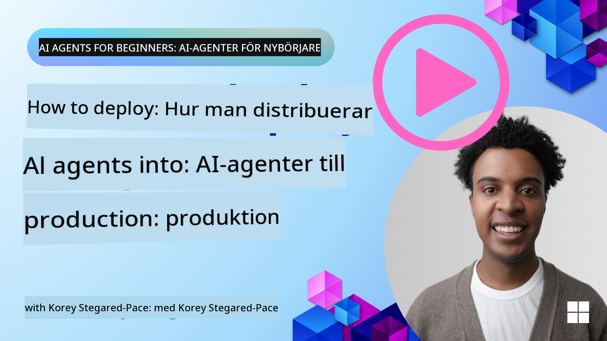

<!--
CO_OP_TRANSLATOR_METADATA:
{
  "original_hash": "1ad5de6a6388d02c145a92dd04358bab",
  "translation_date": "2025-07-12T13:39:16+00:00",
  "source_file": "10-ai-agents-production/README.md",
  "language_code": "sv"
}
-->

> _(Klicka på bilden ovan för att se videon till denna lektion)_
# AI-agenter i produktion

## Introduktion

Denna lektion kommer att täcka:

- Hur du effektivt planerar driftsättningen av din AI-agent i produktion.
- Vanliga misstag och problem som kan uppstå när du driftsätter din AI-agent i produktion.
- Hur du hanterar kostnader samtidigt som du behåller prestandan hos din AI-agent.

## Lärandemål

Efter att ha genomfört denna lektion kommer du att kunna/förstå:

- Tekniker för att förbättra prestanda, kostnader och effektivitet i ett produktionssystem med AI-agenter.
- Vad och hur du ska utvärdera dina AI-agenter.
- Hur du kontrollerar kostnader vid driftsättning av AI-agenter i produktion.

Det är viktigt att driftsätta AI-agenter som är pålitliga. Kolla även in lektionen "Building Trustworthy AI Agents".

## Utvärdering av AI-agenter

Före, under och efter driftsättning av AI-agenter är det avgörande att ha ett korrekt system för att utvärdera dina AI-agenter. Detta säkerställer att ditt system är i linje med dina och användarnas mål.

För att utvärdera en AI-agent är det viktigt att kunna bedöma inte bara agentens output utan även hela systemet som din AI-agent verkar i. Detta inkluderar men är inte begränsat till:

- Den initiala modellförfrågan.
- Agentens förmåga att identifiera användarens avsikt.
- Agentens förmåga att välja rätt verktyg för att utföra uppgiften.
- Verktygets svar på agentens förfrågan.
- Agentens förmåga att tolka verktygets svar.
- Användarens feedback på agentens svar.

Detta gör att du kan identifiera förbättringsområden på ett mer modulärt sätt. Du kan sedan övervaka effekten av förändringar i modeller, prompts, verktyg och andra komponenter med bättre effektivitet.

## Vanliga problem och möjliga lösningar med AI-agenter

| **Problem**                                    | **Möjlig lösning**                                                                                                                                                                                                        |
| ---------------------------------------------- | -------------------------------------------------------------------------------------------------------------------------------------------------------------------------------------------------------------------------- |
| AI-agenten utför inte uppgifter konsekvent     | - Förfina prompten som ges till AI-agenten; var tydlig med målen. - Identifiera var det kan hjälpa att dela upp uppgifterna i deluppgifter och låta flera agenter hantera dem.                                            |
| AI-agenten fastnar i oändliga loopar            | - Säkerställ att du har tydliga avslutningsvillkor så att agenten vet när processen ska stoppas. - För komplexa uppgifter som kräver resonemang och planering, använd en större modell specialiserad på resonemangsuppgifter. |
| AI-agentens verktygsanrop fungerar dåligt       | - Testa och validera verktygets output utanför agentsystemet. - Förfina definierade parametrar, prompts och namngivning av verktyg.                                                                                     |
| Multi-agent system fungerar inkonsekvent        | - Förfina prompts till varje agent för att säkerställa att de är specifika och tydligt skiljer sig från varandra. - Bygg ett hierarkiskt system med en "routing"- eller kontrollagent som avgör vilken agent som är rätt.  |

## Kostnadshantering

Här är några strategier för att hantera kostnader vid driftsättning av AI-agenter i produktion:

- **Caching av svar** – Att identifiera vanliga förfrågningar och uppgifter och tillhandahålla svaren innan de går igenom ditt agentbaserade system är ett bra sätt att minska volymen av liknande förfrågningar. Du kan till och med implementera ett flöde för att avgöra hur lik en förfrågan är dina cachade svar med hjälp av enklare AI-modeller.

- **Använda mindre modeller** – Små språkmodeller (SLM) kan prestera väl i vissa agentbaserade användningsfall och minskar kostnaderna avsevärt. Som nämnts tidigare är det bästa sättet att förstå hur väl en SLM presterar i ditt fall att bygga ett utvärderingssystem för att jämföra prestanda mot större modeller.

- **Använda en routermodell** – En liknande strategi är att använda en variation av modeller och storlekar. Du kan använda en LLM/SLM eller serverlös funktion för att dirigera förfrågningar baserat på komplexitet till de mest lämpliga modellerna. Detta hjälper också till att minska kostnader samtidigt som prestandan säkerställs för rätt uppgifter.

## Grattis

Detta är för närvarande den sista lektionen i "AI Agents for Beginners".

Vi planerar att fortsätta lägga till lektioner baserat på feedback och förändringar i denna ständigt växande bransch, så titta gärna förbi igen inom en snar framtid.

Om du vill fortsätta lära dig och bygga med AI-agenter, gå med i <a href="https://discord.gg/kzRShWzttr" target="_blank">Azure AI Community Discord</a>.

Vi håller workshops, community-rundabordssamtal och "fråga mig vad som helst"-sessioner där.

Vi har också en Learn-samling med ytterligare material som kan hjälpa dig att börja bygga AI-agenter i produktion.

## Föregående lektion

[Metacognition Design Pattern](../09-metacognition/README.md)

**Ansvarsfriskrivning**:  
Detta dokument har översatts med hjälp av AI-översättningstjänsten [Co-op Translator](https://github.com/Azure/co-op-translator). Även om vi strävar efter noggrannhet, vänligen observera att automatiska översättningar kan innehålla fel eller brister. Det ursprungliga dokumentet på dess modersmål bör betraktas som den auktoritativa källan. För kritisk information rekommenderas professionell mänsklig översättning. Vi ansvarar inte för några missförstånd eller feltolkningar som uppstår vid användning av denna översättning.