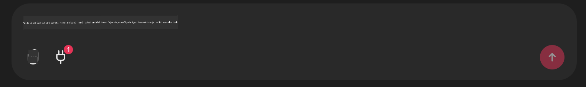

<!--
CO_OP_TRANSLATOR_METADATA:
{
  "original_hash": "9bf0395cbc541ce8db2a9699c8678dfc",
  "translation_date": "2025-07-12T14:22:50+00:00",
  "source_file": "11-mcp/code_samples/github-mcp/README.md",
  "language_code": "sv"
}
-->
# Github MCP Server Exempel

## Beskrivning

Detta var en demo skapad för AI Agents Hackathon som hölls via Microsoft Reactor.

Verktyget används för att rekommendera hackathon-projekt baserat på en användares Github-repos.  
Detta görs genom:

1. **Github Agent** – Använder Github MCP Server för att hämta repos och information om dessa repos.  
2. **Hackathon Agent** – Tar data från Github Agent och kommer med kreativa hackathon-projektidéer baserat på projekten, språken som användaren använder och projektspåren för AI Agents hackathon.  
3. **Events Agent** – Baserat på förslaget från hackathon-agenten rekommenderar events-agenten relevanta evenemang från AI Agent Hackathon-serien.  

## Köra koden

### Miljövariabler

Denna demo använder Azure Open AI Service, Semantic Kernel, Github MCP Server och Azure AI Search.

Se till att du har rätt miljövariabler inställda för att använda dessa verktyg:

```python
AZURE_OPENAI_CHAT_DEPLOYMENT_NAME=""
AZURE_OPENAI_EMBEDDING_DEPLOYMENT_NAME=""
AZURE_OPENAI_ENDPOINT=""
AZURE_OPENAI_API_KEY=""
AZURE_OPENAI_API_VERSION=""
AZURE_SEARCH_SERVICE_ENDPOINT=""
AZURE_SEARCH_API_KEY=""
```

## Köra Chainlit Servern

För att ansluta till MCP-servern använder denna demo Chainlit som chattgränssnitt.

För att starta servern, använd följande kommando i din terminal:

```bash
chainlit run app.py -w
```

Detta bör starta din Chainlit-server på `localhost:8000` samt fylla din Azure AI Search Index med innehållet från `event-descriptions.md`.

## Ansluta till MCP Servern

För att ansluta till Github MCP Server, välj "plug"-ikonen under chattfältet "Type your message here..":



Därifrån kan du klicka på "Connect an MCP" för att lägga till kommandot för att ansluta till Github MCP Server:

```bash
npx -y @modelcontextprotocol/server-github --env GITHUB_PERSONAL_ACCESS_TOKEN=[YOUR PERSONAL ACCESS TOKEN]
```

Byt ut "[YOUR PERSONAL ACCESS TOKEN]" mot din faktiska Personal Access Token.

Efter anslutning bör du se en (1) bredvid plug-ikonen som bekräftelse på att den är ansluten. Om inte, försök starta om chainlit-servern med `chainlit run app.py -w`.

## Använda Demon

För att starta agentflödet för att rekommendera hackathon-projekt kan du skriva ett meddelande som:

"Recommend hackathon projects for the Github user koreyspace"

Router Agent kommer att analysera din förfrågan och avgöra vilken kombination av agenter (GitHub, Hackathon och Events) som är bäst lämpad att hantera din fråga. Agenterna samarbetar för att ge omfattande rekommendationer baserat på analys av Github-repos, projektidéer och relevanta teknikevenemang.

**Ansvarsfriskrivning**:  
Detta dokument har översatts med hjälp av AI-översättningstjänsten [Co-op Translator](https://github.com/Azure/co-op-translator). Även om vi strävar efter noggrannhet, vänligen observera att automatiska översättningar kan innehålla fel eller brister. Det ursprungliga dokumentet på dess modersmål bör betraktas som den auktoritativa källan. För kritisk information rekommenderas professionell mänsklig översättning. Vi ansvarar inte för några missförstånd eller feltolkningar som uppstår vid användning av denna översättning.