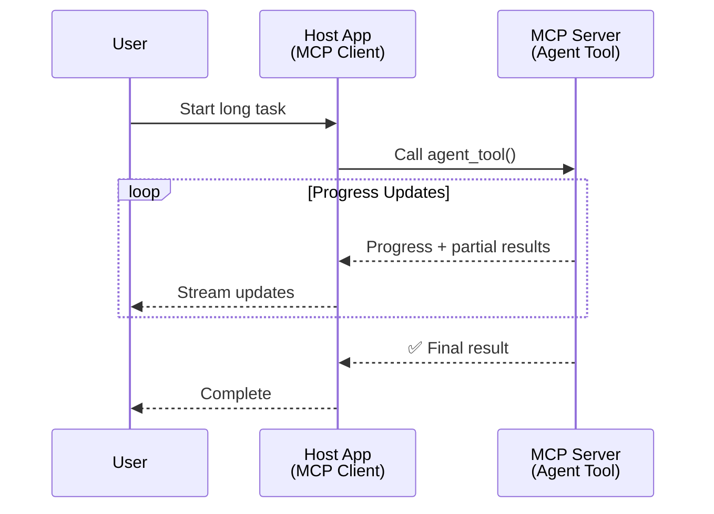
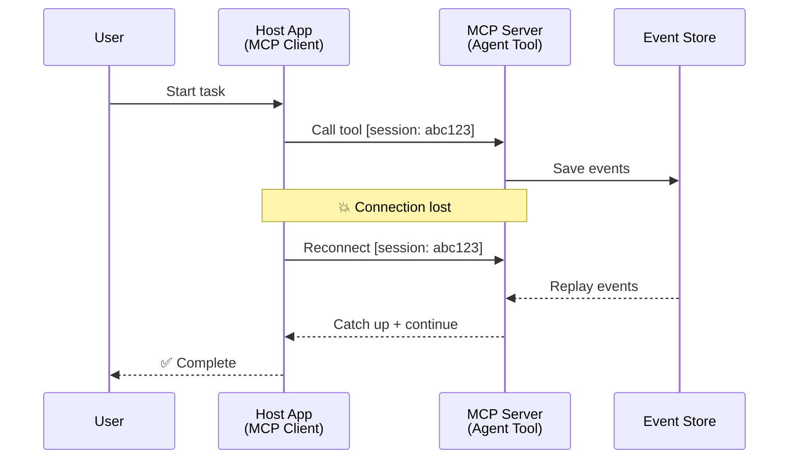
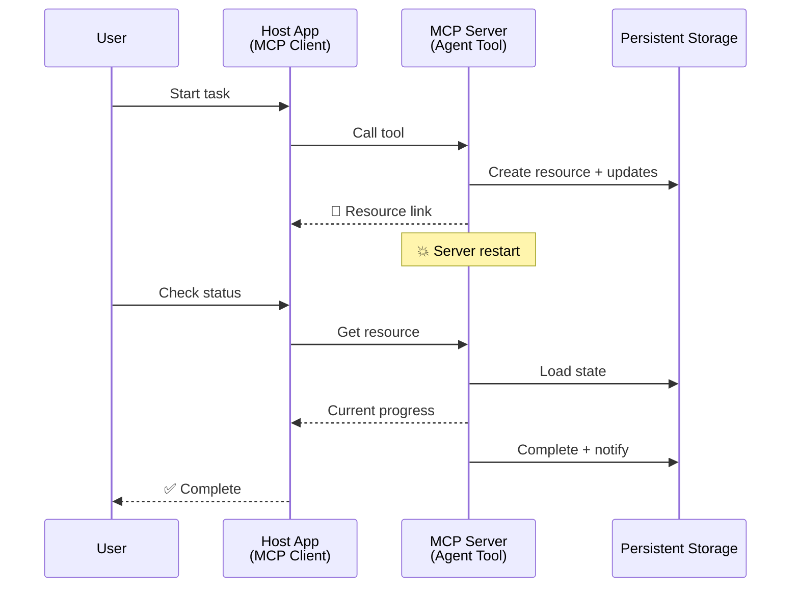
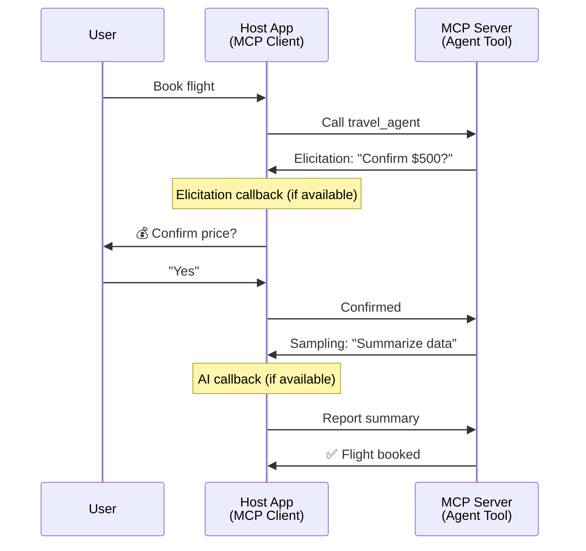
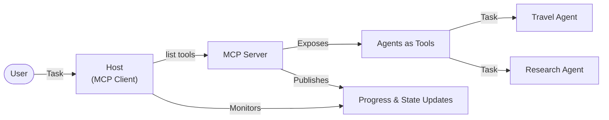

<!--
CO_OP_TRANSLATOR_METADATA:
{
  "original_hash": "5cc6836626047aa055e8960c8484a7d0",
  "translation_date": "2025-08-21T14:41:31+00:00",
  "source_file": "11-mcp/code_samples/mcp-agents/README.md",
  "language_code": "sv"
}
-->
# Bygga kommunikationssystem mellan agenter med MCP

> TL;DR - Kan du bygga Agent2Agent-kommunikation med MCP? Ja!

MCP har utvecklats avsevärt bortom sitt ursprungliga mål att "tillhandahålla kontext till LLMs". Med de senaste förbättringarna, inklusive [återupptagbara strömmar](https://modelcontextprotocol.io/docs/concepts/transports#resumability-and-redelivery), [elicitering](https://modelcontextprotocol.io/specification/2025-06-18/client/elicitation), [sampling](https://modelcontextprotocol.io/specification/2025-06-18/client/sampling) och notifieringar ([framsteg](https://modelcontextprotocol.io/specification/2025-06-18/basic/utilities/progress) och [resurser](https://modelcontextprotocol.io/specification/2025-06-18/schema#resourceupdatednotification)), erbjuder MCP nu en robust grund för att bygga komplexa kommunikationssystem mellan agenter.

## Missuppfattningen om Agent/Verktyg

När fler utvecklare utforskar verktyg med agentliknande beteenden (körs under längre perioder, kan kräva ytterligare input under exekvering, etc.), är en vanlig missuppfattning att MCP är olämpligt, främst eftersom tidiga exempel på dess verktygsprimitive fokuserade på enkla begär-svar-mönster.

Denna uppfattning är föråldrad. MCP-specifikationen har förbättrats avsevärt under de senaste månaderna med funktioner som fyller gapet för att bygga långvariga agentliknande beteenden:

- **Streaming & Partiella Resultat**: Realtidsuppdateringar under exekvering
- **Återupptagbarhet**: Klienter kan återansluta och fortsätta efter avbrott
- **Hållbarhet**: Resultat överlever serveromstarter (t.ex. via resurslänkar)
- **Fleromgångsinteraktioner**: Interaktiv input under exekvering via elicitering och sampling

Dessa funktioner kan kombineras för att möjliggöra komplexa agentliknande och multi-agent-applikationer, alla implementerade på MCP-protokollet.

För referens kommer vi att hänvisa till en agent som ett "verktyg" som är tillgängligt på en MCP-server. Detta innebär att det finns en värdapplikation som implementerar en MCP-klient som etablerar en session med MCP-servern och kan anropa agenten.

## Vad gör ett MCP-verktyg "agentliknande"?

Innan vi dyker in i implementeringen, låt oss fastställa vilka infrastrukturella kapaciteter som behövs för att stödja långvariga agenter.

> Vi definierar en agent som en enhet som kan arbeta autonomt under längre perioder, kapabel att hantera komplexa uppgifter som kan kräva flera interaktioner eller justeringar baserat på realtidsfeedback.

### 1. Streaming & Partiella Resultat

Traditionella begär-svar-mönster fungerar inte för långvariga uppgifter. Agenter behöver tillhandahålla:

- Realtidsuppdateringar om framsteg
- Mellanresultat

**MCP-stöd**: Resursuppdateringsnotifieringar möjliggör streaming av partiella resultat, även om detta kräver noggrann design för att undvika konflikter med JSON-RPC:s 1:1 begär/svar-modell.

| Funktion                  | Användningsfall                                                                                                                                                                       | MCP-stöd                                                                                   |
| ------------------------- | ------------------------------------------------------------------------------------------------------------------------------------------------------------------------------------- | ------------------------------------------------------------------------------------------ |
| Realtidsuppdateringar om framsteg | Användaren begär en kodbasmigreringsuppgift. Agenten streamar framsteg: "10% - Analyserar beroenden... 25% - Konverterar TypeScript-filer... 50% - Uppdaterar importer..."          | ✅ Framstegsnotifieringar                                                                  |
| Partiella Resultat        | Uppgiften "Generera en bok" streamar partiella resultat, t.ex. 1) Berättelsens struktur, 2) Kapitellista, 3) Varje kapitel när det är klart. Värden kan inspektera, avbryta eller omdirigera vid varje steg. | ✅ Notifieringar kan "utökas" för att inkludera partiella resultat, se förslag på PR 383, 776 |

<div align="center" style="font-style: italic; font-size: 0.95em; margin-bottom: 0.5em;">
<strong>Figur 1:</strong> Denna diagram illustrerar hur en MCP-agent streamar realtidsuppdateringar och partiella resultat till värdapplikationen under en långvarig uppgift, vilket gör det möjligt för användaren att övervaka exekveringen i realtid.
</div>



### 2. Återupptagbarhet

Agenter måste hantera nätverksavbrott smidigt:

- Återanslutning efter (klient) avbrott
- Fortsättning från där de slutade (meddelandeåterleverans)

**MCP-stöd**: MCP StreamableHTTP-transport stöder idag sessionsåterupptagning och meddelandeåterleverans med sessions-ID och senaste händelse-ID. Det viktiga här är att servern måste implementera en EventStore som möjliggör händelseuppspelning vid klientåteranslutning.  
Observera att det finns ett communityförslag (PR #975) som utforskar transportoberoende återupptagbara strömmar.

| Funktion      | Användningsfall                                                                                                                                                   | MCP-stöd                                                                |
| ------------- | ----------------------------------------------------------------------------------------------------------------------------------------------------------------- | ----------------------------------------------------------------------- |
| Återupptagbarhet | Klienten kopplas bort under en långvarig uppgift. Vid återanslutning återupptas sessionen med missade händelser uppspelade, fortsätter sömlöst från där den slutade. | ✅ StreamableHTTP-transport med sessions-ID, händelseuppspelning och EventStore |

<div align="center" style="font-style: italic; font-size: 0.95em; margin-bottom: 0.5em;">
<strong>Figur 2:</strong> Denna diagram visar hur MCP:s StreamableHTTP-transport och EventStore möjliggör sömlös sessionsåterupptagning: om klienten kopplas bort kan den återansluta och spela upp missade händelser, fortsätta uppgiften utan förlust av framsteg.
</div>



### 3. Hållbarhet

Långvariga agenter behöver persistent tillstånd:

- Resultat överlever serveromstarter
- Status kan hämtas utanför bandet
- Framstegsspårning över sessioner

**MCP-stöd**: MCP stöder nu en Resurslänk-returtyp för verktygsanrop. Idag är ett möjligt mönster att designa ett verktyg som skapar en resurs och omedelbart returnerar en resurslänk. Verktyget kan fortsätta att hantera uppgiften i bakgrunden och uppdatera resursen. I sin tur kan klienten välja att polla tillståndet för denna resurs för att få partiella eller fullständiga resultat (baserat på vilka resursuppdateringar servern tillhandahåller) eller prenumerera på resursen för uppdateringsnotifieringar.

En begränsning här är att polling av resurser eller prenumeration på uppdateringar kan konsumera resurser med konsekvenser i stor skala. Det finns ett öppet communityförslag (inklusive #992) som utforskar möjligheten att inkludera webhooks eller triggers som servern kan anropa för att notifiera klienten/värdapplikationen om uppdateringar.

| Funktion    | Användningsfall                                                                                                                                        | MCP-stöd                                                        |
| ----------- | ----------------------------------------------------------------------------------------------------------------------------------------------------- | ---------------------------------------------------------------- |
| Hållbarhet | Servern kraschar under en datamigreringsuppgift. Resultat och framsteg överlever omstart, klienten kan kontrollera status och fortsätta från persistent resurs. | ✅ Resurslänkar med persistent lagring och statusnotifieringar |

Idag är ett vanligt mönster att designa ett verktyg som skapar en resurs och omedelbart returnerar en resurslänk. Verktyget kan i bakgrunden hantera uppgiften, utfärda resursnotifieringar som fungerar som framstegsuppdateringar eller inkludera partiella resultat, och uppdatera innehållet i resursen vid behov.

<div align="center" style="font-style: italic; font-size: 0.95em; margin-bottom: 0.5em;">
<strong>Figur 3:</strong> Denna diagram demonstrerar hur MCP-agenter använder persistenta resurser och statusnotifieringar för att säkerställa att långvariga uppgifter överlever serveromstarter, vilket gör det möjligt för klienter att kontrollera framsteg och hämta resultat även efter fel.
</div>



### 4. Fleromgångsinteraktioner

Agenter behöver ofta ytterligare input under exekvering:

- Mänsklig förtydligande eller godkännande
- AI-assistans för komplexa beslut
- Dynamisk parameterjustering

**MCP-stöd**: Fullt stöd via sampling (för AI-input) och elicitering (för mänsklig input).

| Funktion                 | Användningsfall                                                                                                                                     | MCP-stöd                                           |
| ------------------------ | --------------------------------------------------------------------------------------------------------------------------------------------------- | ------------------------------------------------- |
| Fleromgångsinteraktioner | Resebokningsagenten begär prisbekräftelse från användaren och ber sedan AI att sammanfatta reseinformationen innan bokningstransaktionen slutförs. | ✅ Elicitering för mänsklig input, sampling för AI-input |

<div align="center" style="font-style: italic; font-size: 0.95em; margin-bottom: 0.5em;">
<strong>Figur 4:</strong> Denna diagram visar hur MCP-agenter interaktivt kan elicitering mänsklig input eller begära AI-assistans under exekvering, vilket stödjer komplexa, fleromgångsarbetsflöden som bekräftelser och dynamiskt beslutsfattande.
</div>



## Implementering av långvariga agenter på MCP - Kodöversikt

Som en del av denna artikel tillhandahåller vi ett [kodarkiv](https://github.com/victordibia/ai-tutorials/tree/main/MCP%20Agents) som innehåller en komplett implementering av långvariga agenter med MCP Python SDK och StreamableHTTP-transport för sessionsåterupptagning och meddelandeåterleverans. Implementeringen demonstrerar hur MCP-funktioner kan kombineras för att möjliggöra sofistikerade agentliknande beteenden.

Specifikt implementerar vi en server med två primära agentverktyg:

- **Reseagent** - Simulerar en resebokningstjänst med prisbekräftelse via elicitering
- **Forskningsagent** - Utför forskningsuppgifter med AI-assisterade sammanfattningar via sampling

Båda agenterna demonstrerar realtidsuppdateringar, interaktiva bekräftelser och fullständiga sessionsåterupptagningsmöjligheter.

### Viktiga implementeringskoncept

Följande avsnitt visar server-side agentimplementering och klient-side värdhantering för varje funktion:

#### Streaming & Framstegsuppdateringar - Realtidsstatus för uppgifter

Streaming gör det möjligt för agenter att tillhandahålla realtidsuppdateringar under långvariga uppgifter, vilket håller användarna informerade om uppgiftsstatus och mellanresultat.

**Serverimplementering (agent skickar framstegsnotifieringar):**

```python
# From server/server.py - Travel agent sending progress updates
for i, step in enumerate(steps):
    await ctx.session.send_progress_notification(
        progress_token=ctx.request_id,
        progress=i * 25,
        total=100,
        message=step,
        related_request_id=str(ctx.request_id)
    )
    await anyio.sleep(2)  # Simulate work

# Alternative: Log messages for detailed step-by-step updates
await ctx.session.send_log_message(
    level="info",
    data=f"Processing step {current_step}/{steps} ({progress_percent}%)",
    logger="long_running_agent",
    related_request_id=ctx.request_id,
)
```

**Klientimplementering (värd tar emot framstegsuppdateringar):**

```python
# From client/client.py - Client handling real-time notifications
async def message_handler(message) -> None:
    if isinstance(message, types.ServerNotification):
        if isinstance(message.root, types.LoggingMessageNotification):
            console.print(f"📡 [dim]{message.root.params.data}[/dim]")
        elif isinstance(message.root, types.ProgressNotification):
            progress = message.root.params
            console.print(f"🔄 [yellow]{progress.message} ({progress.progress}/{progress.total})[/yellow]")

# Register message handler when creating session
async with ClientSession(
    read_stream, write_stream,
    message_handler=message_handler
) as session:
```

#### Elicitering - Begäran om användarinmatning

Elicitering gör det möjligt för agenter att begära användarinmatning under exekvering. Detta är viktigt för bekräftelser, förtydliganden eller godkännanden under långvariga uppgifter.

**Serverimplementering (agent begär bekräftelse):**

```python
# From server/server.py - Travel agent requesting price confirmation
elicit_result = await ctx.session.elicit(
    message=f"Please confirm the estimated price of $1200 for your trip to {destination}",
    requestedSchema=PriceConfirmationSchema.model_json_schema(),
    related_request_id=ctx.request_id,
)

if elicit_result and elicit_result.action == "accept":
    # Continue with booking
    logger.info(f"User confirmed price: {elicit_result.content}")
elif elicit_result and elicit_result.action == "decline":
    # Cancel the booking
    booking_cancelled = True
```

**Klientimplementering (värd tillhandahåller eliciteringscallback):**

```python
# From client/client.py - Client handling elicitation requests
async def elicitation_callback(context, params):
    console.print(f"💬 Server is asking for confirmation:")
    console.print(f"   {params.message}")

    response = console.input("Do you accept? (y/n): ").strip().lower()

    if response in ['y', 'yes']:
        return types.ElicitResult(
            action="accept",
            content={"confirm": True, "notes": "Confirmed by user"}
        )
    else:
        return types.ElicitResult(
            action="decline",
            content={"confirm": False, "notes": "Declined by user"}
        )

# Register the callback when creating the session
async with ClientSession(
    read_stream, write_stream,
    elicitation_callback=elicitation_callback
) as session:
```

#### Sampling - Begäran om AI-assistans

Sampling gör det möjligt för agenter att begära LLM-assistans för komplexa beslut eller innehållsgenerering under exekvering. Detta möjliggör hybrid arbetsflöden mellan människa och AI.

**Serverimplementering (agent begär AI-assistans):**

```python
# From server/server.py - Research agent requesting AI summary
sampling_result = await ctx.session.create_message(
    messages=[
        SamplingMessage(
            role="user",
            content=TextContent(type="text", text=f"Please summarize the key findings for research on: {topic}")
        )
    ],
    max_tokens=100,
    related_request_id=ctx.request_id,
)

if sampling_result and sampling_result.content:
    if sampling_result.content.type == "text":
        sampling_summary = sampling_result.content.text
        logger.info(f"Received sampling summary: {sampling_summary}")
```

**Klientimplementering (värd tillhandahåller samplingcallback):**

```python
# From client/client.py - Client handling sampling requests
async def sampling_callback(context, params):
    message_text = params.messages[0].content.text if params.messages else 'No message'
    console.print(f"🧠 Server requested sampling: {message_text}")

    # In a real application, this could call an LLM API
    # For demo purposes, we provide a mock response
    mock_response = "Based on current research, MCP has evolved significantly..."

    return types.CreateMessageResult(
        role="assistant",
        content=types.TextContent(type="text", text=mock_response),
        model="interactive-client",
        stopReason="endTurn"
    )

# Register the callback when creating the session
async with ClientSession(
    read_stream, write_stream,
    sampling_callback=sampling_callback,
    elicitation_callback=elicitation_callback
) as session:
```

#### Återupptagbarhet - Sessionskontinuitet vid avbrott

Återupptagbarhet säkerställer att långvariga agentuppgifter kan överleva klientavbrott och fortsätta sömlöst vid återanslutning. Detta implementeras genom EventStores och återupptagningstokens.

**EventStore-implementering (server håller sessionsstatus):**

```python
# From server/event_store.py - Simple in-memory event store
class SimpleEventStore(EventStore):
    def __init__(self):
        self._events: list[tuple[StreamId, EventId, JSONRPCMessage]] = []
        self._event_id_counter = 0

    async def store_event(self, stream_id: StreamId, message: JSONRPCMessage) -> EventId:
        """Store an event and return its ID."""
        self._event_id_counter += 1
        event_id = str(self._event_id_counter)
        self._events.append((stream_id, event_id, message))
        return event_id

    async def replay_events_after(self, last_event_id: EventId, send_callback: EventCallback) -> StreamId | None:
        """Replay events after the specified ID for resumption."""
        # Find events after the last known event and replay them
        for _, event_id, message in self._events[start_index:]:
            await send_callback(EventMessage(message, event_id))

# From server/server.py - Passing event store to session manager
def create_server_app(event_store: Optional[EventStore] = None) -> Starlette:
    server = ResumableServer()

    # Create session manager with event store for resumption
    session_manager = StreamableHTTPSessionManager(
        app=server,
        event_store=event_store,  # Event store enables session resumption
        json_response=False,
        security_settings=security_settings,
    )

    return Starlette(routes=[Mount("/mcp", app=session_manager.handle_request)])

# Usage: Initialize with event store
event_store = SimpleEventStore()
app = create_server_app(event_store)
```

**Klientmetadata med återupptagningstoken (klient återansluter med lagrad status):**

```python
# From client/client.py - Client resumption with metadata
if existing_tokens and existing_tokens.get("resumption_token"):
    # Use existing resumption token to continue where we left off
    metadata = ClientMessageMetadata(
        resumption_token=existing_tokens["resumption_token"],
    )
else:
    # Create callback to save resumption token when received
    def enhanced_callback(token: str):
        protocol_version = getattr(session, 'protocol_version', None)
        token_manager.save_tokens(session_id, token, protocol_version, command, args)

    metadata = ClientMessageMetadata(
        on_resumption_token_update=enhanced_callback,
    )

# Send request with resumption metadata
result = await session.send_request(
    types.ClientRequest(
        types.CallToolRequest(
            method="tools/call",
            params=types.CallToolRequestParams(name=command, arguments=args)
        )
    ),
    types.CallToolResult,
    metadata=metadata,
)
```

Värdapplikationen håller sessions-ID och återupptagningstokens lokalt, vilket gör det möjligt att återansluta till befintliga sessioner utan att förlora framsteg eller status.

### Kodorganisation

<div align="center" style="font-style: italic; font-size: 0.95em; margin-bottom: 0.5em;">
<strong>Figur 5:</strong> MCP-baserad agentarkitektur
</div>



**Viktiga filer:**

- **`server/server.py`** - Återupptagbar MCP-server med rese- och forskningsagenter som demonstrerar elicitering, sampling och framstegsuppdateringar
- **`client/client.py`** - Interaktiv värdapplikation med återupptagningsstöd, callback-hanterare och tokenhantering
- **`server/event_store.py`** - EventStore-implementering som möjliggör sessionsåterupptagning och meddelandeåterleverans

## Utvidgning till multi-agent-kommunikation på MCP

Implementeringen ovan kan utvidgas till multi-agent-system genom att förbättra värdapplikationens intelligens och omfattning:

- **Intelligent uppgiftsnedbrytning**: Värden analyserar komplexa användarförfrågningar och bryter ner dem i deluppgifter för olika specialiserade agenter
- **Multi-server-koordinering**: Värden upprätthåller anslutningar till flera MCP-servrar, var och en exponerar olika agentkapaciteter
- **Uppgiftsstatushantering**: Värden spårar framsteg över flera samtidiga agentuppgifter, hanterar beroenden och sekvensering
- **Resiliens & omförsök**: Värden hanterar fel, implementerar omförsökslogik och omdirigerar uppgifter när agenter blir otillgängliga
- **Resultatsyntes**: Värden kombinerar utdata från flera agenter till sammanhängande slutresultat

Värden utvecklas från en enkel klient till en intelligent orkestrator, som koordinerar distribuerade agentkapaciteter samtidigt som den bibehåller samma MCP-protokollgrund.

## Slutsats

MCP:s förbättrade kapaciteter - resursnotifieringar, elicitering/sampling, återupptagbara strömmar och persistenta resurser - möjliggör komplexa interaktioner mellan agenter samtidigt som protokollets enkelhet bibehålls.

## Kom igång

Redo att bygga ditt eget Agent2Agent-system? Följ dessa steg:

### 1. Kör demon

```bash
# Start the server with event store for resumption
python -m server.server --port 8006

# In another terminal, run the interactive client
python -m client.client --url http://127.0.0.1:8006/mcp
```

**Tillgängliga kommandon i interaktivt läge:**

- `travel_agent` - Boka resor med prisbekräftelse via elicitering
- `research_agent` - Forska om ämnen med AI-assisterade sammanfattningar via sampling
- `list` - Visa alla tillgängliga verktyg
- `clean-tokens` - Rensa återupptagningstokens
- `help` - Visa detaljerad kommandohjälp
- `quit` - Avsluta klienten

### 2. Testa återupptagningskapaciteter

- Starta en långvarig agent (t.ex. `travel_agent`)
- Avbryt klienten under exekvering (Ctrl+C)
- Starta om klienten - den kommer automatiskt att återuppta från där den slutade

### 3. Utforska och utvidga

- **Utforska exemplen**: Kolla in detta [mcp-agents](https://github.com/victordibia/ai-tutorials/tree/main/MCP%20Agents)
- **Gå med i communityn**: Delta i MCP-diskussioner på GitHub
- **Experimentera**: Börja med en enkel långvarig uppgift och lägg gradvis till streaming, återupptagbarhet och multi-agent-koordinering

Detta demonstrerar hur MCP möjliggör intelligenta agentbeteenden samtidigt som verktygsbaserad enkelhet bibehålls.

Sammanfattningsvis utvecklas MCP-protokollspecifikationen snabbt; läsaren uppmuntras att granska den officiella dokumentationswebbplatsen för de senaste uppdateringarna - https://modelcontextprotocol.io/introduction

**Ansvarsfriskrivning**:  
Detta dokument har översatts med hjälp av AI-översättningstjänsten [Co-op Translator](https://github.com/Azure/co-op-translator). Även om vi strävar efter noggrannhet, vänligen notera att automatiska översättningar kan innehålla fel eller felaktigheter. Det ursprungliga dokumentet på dess originalspråk bör betraktas som den auktoritativa källan. För kritisk information rekommenderas professionell mänsklig översättning. Vi ansvarar inte för eventuella missförstånd eller feltolkningar som uppstår vid användning av denna översättning.