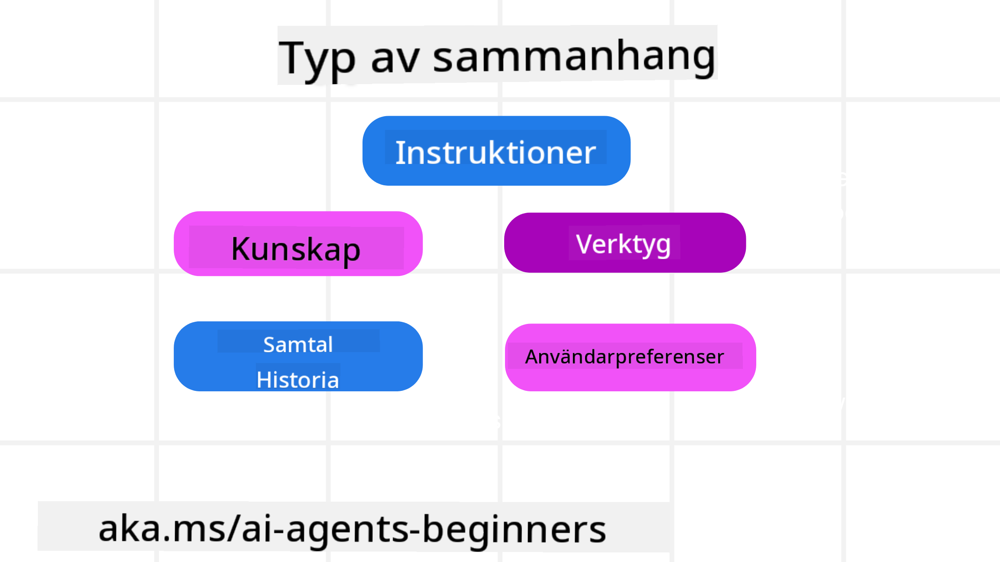
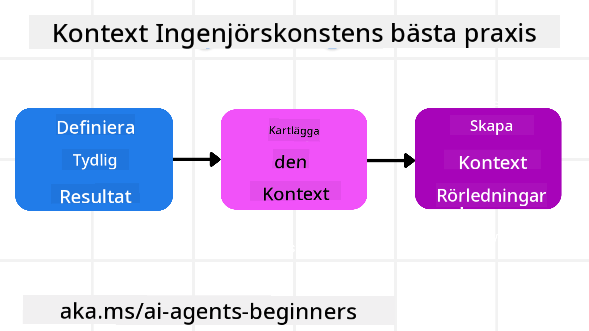

<!--
CO_OP_TRANSLATOR_METADATA:
{
  "original_hash": "cb7e50f471905ce6fdb92a30269a7a98",
  "translation_date": "2025-09-04T10:08:00+00:00",
  "source_file": "12-context-engineering/README.md",
  "language_code": "sv"
}
-->
# Kontextutformning för AI-agenter

> _(Klicka på bilden ovan för att se videon till denna lektion)_

Att förstå komplexiteten i den applikation du bygger en AI-agent för är avgörande för att skapa en pålitlig sådan. Vi behöver bygga AI-agenter som effektivt hanterar information för att möta komplexa behov bortom enbart promptutformning.

I denna lektion kommer vi att titta på vad kontextutformning är och dess roll i att bygga AI-agenter.

## Introduktion

Denna lektion kommer att täcka:

• **Vad kontextutformning är** och varför det skiljer sig från promptutformning.

• **Strategier för effektiv kontextutformning**, inklusive hur man skriver, väljer, komprimerar och isolerar information.

• **Vanliga kontextfel** som kan förstöra din AI-agent och hur man åtgärdar dem.

## Lärandemål

Efter att ha slutfört denna lektion kommer du att förstå hur man:

• **Definierar kontextutformning** och skiljer det från promptutformning.

• **Identifierar de viktigaste komponenterna i kontext** i applikationer för stora språkmodeller (LLM).

• **Tillämpa strategier för att skriva, välja, komprimera och isolera kontext** för att förbättra agentens prestanda.

• **Känna igen vanliga kontextfel** som förgiftning, distraktion, förvirring och konflikt, samt implementera tekniker för att motverka dessa.

## Vad är kontextutformning?

För AI-agenter är kontext det som styr planeringen av en AI-agent för att vidta vissa åtgärder. Kontextutformning handlar om att säkerställa att AI-agenten har rätt information för att slutföra nästa steg i uppgiften. Kontextfönstret är begränsat i storlek, så som agentbyggare måste vi skapa system och processer för att hantera tillägg, borttagning och komprimering av information i kontextfönstret.

### Promptutformning vs Kontextutformning

Promptutformning fokuserar på en enda uppsättning statiska instruktioner för att effektivt vägleda AI-agenter med en uppsättning regler. Kontextutformning handlar om att hantera en dynamisk uppsättning information, inklusive den ursprungliga prompten, för att säkerställa att AI-agenten har vad den behöver över tid. Huvudidén med kontextutformning är att göra denna process repeterbar och pålitlig.

### Typer av kontext

Det är viktigt att komma ihåg att kontext inte bara är en sak. Informationen som AI-agenten behöver kan komma från en mängd olika källor, och det är upp till oss att säkerställa att agenten har tillgång till dessa källor:

De typer av kontext som en AI-agent kan behöva hantera inkluderar:

• **Instruktioner:** Dessa är som agentens "regler" – prompts, systemmeddelanden, få-exempel (som visar AI:n hur man gör något) och beskrivningar av verktyg den kan använda. Här kombineras fokus på promptutformning med kontextutformning.

• **Kunskap:** Detta omfattar fakta, information hämtad från databaser eller långsiktiga minnen som agenten har ackumulerat. Detta inkluderar att integrera ett Retrieval Augmented Generation (RAG)-system om en agent behöver tillgång till olika kunskapskällor och databaser.

• **Verktyg:** Detta är definitioner av externa funktioner, API:er och MCP-servrar som agenten kan anropa, tillsammans med feedback (resultat) den får från att använda dem.

• **Konversationshistorik:** Den pågående dialogen med en användare. Med tiden blir dessa konversationer längre och mer komplexa, vilket innebär att de tar upp plats i kontextfönstret.

• **Användarpreferenser:** Information som lärts in om en användares tycken och ogillanden över tid. Dessa kan lagras och användas vid viktiga beslut för att hjälpa användaren.

## Strategier för effektiv kontextutformning

### Planeringsstrategier

Bra kontextutformning börjar med bra planering. Här är ett tillvägagångssätt som hjälper dig att börja tänka på hur du kan tillämpa konceptet kontextutformning:

1. **Definiera tydliga resultat** – Resultaten av de uppgifter som AI-agenter kommer att tilldelas bör vara tydligt definierade. Svara på frågan – "Hur kommer världen att se ut när AI-agenten är klar med sin uppgift?" Med andra ord, vilken förändring, information eller respons ska användaren ha efter att ha interagerat med AI-agenten.

2. **Kartlägg kontexten** – När du har definierat resultaten av AI-agenten måste du svara på frågan "Vilken information behöver AI-agenten för att slutföra denna uppgift?". På så sätt kan du börja kartlägga var informationen kan finnas.

3. **Skapa kontextpipelines** – Nu när du vet var informationen finns måste du svara på frågan "Hur ska agenten få denna information?". Detta kan göras på olika sätt, inklusive RAG, användning av MCP-servrar och andra verktyg.

### Praktiska strategier

Planering är viktigt, men när informationen börjar flöda in i agentens kontextfönster behöver vi ha praktiska strategier för att hantera den:

#### Hantering av kontext

Även om viss information automatiskt kommer att läggas till i kontextfönstret handlar kontextutformning om att ta en mer aktiv roll i denna information, vilket kan göras med några strategier:

1. **Agentens anteckningsblock**  
   Detta gör det möjligt för en AI-agent att föra anteckningar om relevant information om aktuella uppgifter och användarinteraktioner under en enda session. Detta bör existera utanför kontextfönstret i en fil eller runtime-objekt som agenten senare kan hämta under denna session om det behövs.

2. **Minnen**  
   Anteckningsblock är bra för att hantera information utanför kontextfönstret för en enda session. Minnen gör det möjligt för agenter att lagra och hämta relevant information över flera sessioner. Detta kan inkludera sammanfattningar, användarpreferenser och feedback för framtida förbättringar.

3. **Komprimering av kontext**  
   När kontextfönstret växer och närmar sig sin gräns kan tekniker som sammanfattning och trimning användas. Detta innebär att antingen behålla endast den mest relevanta informationen eller ta bort äldre meddelanden.

4. **Multi-agent-system**  
   Att utveckla multi-agent-system är en form av kontextutformning eftersom varje agent har sitt eget kontextfönster. Hur denna kontext delas och överförs mellan olika agenter är något att planera när man bygger dessa system.

5. **Sandlådemiljöer**  
   Om en agent behöver köra kod eller bearbeta stora mängder information i ett dokument kan detta ta upp många tokens för att bearbeta resultaten. Istället för att lagra allt detta i kontextfönstret kan agenten använda en sandlådemiljö som kan köra denna kod och endast läsa resultaten och annan relevant information.

6. **Runtime-tillståndsobjekt**  
   Detta görs genom att skapa informationsbehållare för att hantera situationer där agenten behöver ha tillgång till viss information. För en komplex uppgift skulle detta göra det möjligt för en agent att lagra resultaten av varje deluppgift steg för steg, vilket gör att kontexten förblir kopplad endast till den specifika deluppgiften.

### Exempel på kontextutformning

Låt oss säga att vi vill att en AI-agent ska **"Boka en resa till Paris åt mig."**

• En enkel agent som endast använder promptutformning kanske bara svarar: **"Okej, när vill du åka till Paris?"**. Den bearbetade bara din direkta fråga vid det tillfället.

• En agent som använder de kontextutformningsstrategier vi har gått igenom skulle göra mycket mer. Innan den ens svarar, kan dess system:

  ◦ **Kontrollera din kalender** för tillgängliga datum (hämta realtidsdata).  
  ◦ **Minnas tidigare resepreferenser** (från långtidsminne) som ditt föredragna flygbolag, budget eller om du föredrar direktflyg.  
  ◦ **Identifiera tillgängliga verktyg** för att boka flyg och hotell.  

- Sedan skulle ett exempel på svar kunna vara: "Hej [Ditt namn]! Jag ser att du är ledig första veckan i oktober. Ska jag leta efter direktflyg till Paris med [Föredraget flygbolag] inom din vanliga budget på [Budget]?" Detta rikare, kontextmedvetna svar visar kraften i kontextutformning.

## Vanliga kontextfel

### Kontextförgiftning

**Vad det är:** När en hallucination (falsk information genererad av LLM) eller ett fel kommer in i kontexten och upprepade gånger refereras till, vilket gör att agenten strävar efter omöjliga mål eller utvecklar nonsensstrategier.

**Vad man ska göra:** Implementera **validering av kontext** och **karantän**. Validera information innan den läggs till i långtidsminnet. Om potentiell förgiftning upptäcks, starta nya kontexttrådar för att förhindra att den dåliga informationen sprids.

**Exempel på resebokning:** Din agent hallucinerar ett **direktflyg från en liten lokal flygplats till en avlägsen internationell stad** som inte faktiskt erbjuder internationella flyg. Denna icke-existerande flygdetalj sparas i kontexten. Senare, när du ber agenten att boka, försöker den gång på gång hitta biljetter för denna omöjliga rutt, vilket leder till upprepade fel.

**Lösning:** Implementera ett steg som **validerar flygets existens och rutter med ett realtids-API** _innan_ flygdetaljen läggs till i agentens arbetskontext. Om valideringen misslyckas, "karantäniseras" den felaktiga informationen och används inte vidare.

### Kontextdistraktion

**Vad det är:** När kontexten blir så stor att modellen fokuserar för mycket på den ackumulerade historiken istället för att använda det den lärt sig under träningen, vilket leder till repetitiva eller oproduktiva handlingar. Modeller kan börja göra misstag även innan kontextfönstret är fullt.

**Vad man ska göra:** Använd **sammanfattning av kontext**. Komprimera periodiskt ackumulerad information till kortare sammanfattningar, behåll viktiga detaljer och ta bort överflödig historik. Detta hjälper till att "nollställa" fokus.

**Exempel på resebokning:** Du har diskuterat olika drömresmål under en längre tid, inklusive en detaljerad återblick på din backpackingresa för två år sedan. När du slutligen ber om att **"hitta ett billigt flyg för nästa månad"**, fastnar agenten i de gamla, irrelevanta detaljerna och fortsätter att fråga om din backpackingutrustning eller tidigare resplaner, istället för att fokusera på din aktuella begäran.

**Lösning:** Efter ett visst antal turer eller när kontexten blir för stor, bör agenten **sammanfatta de mest aktuella och relevanta delarna av konversationen** – med fokus på dina nuvarande resdatum och destination – och använda den kondenserade sammanfattningen för nästa LLM-anrop, samtidigt som den mindre relevanta historiken tas bort.

### Kontextförvirring

**Vad det är:** När onödig kontext, ofta i form av för många tillgängliga verktyg, gör att modellen genererar dåliga svar eller anropar irrelevanta verktyg. Mindre modeller är särskilt känsliga för detta.

**Vad man ska göra:** Implementera **hantering av verktygsuppsättningar** med hjälp av RAG-tekniker. Lagra verktygsbeskrivningar i en vektordatabas och välj _endast_ de mest relevanta verktygen för varje specifik uppgift. Forskning visar att det är bäst att begränsa verktygsvalen till färre än 30.

**Exempel på resebokning:** Din agent har tillgång till dussintals verktyg: `book_flight`, `book_hotel`, `rent_car`, `find_tours`, `currency_converter`, `weather_forecast`, `restaurant_reservations`, etc. Du frågar, **"Vad är det bästa sättet att ta sig runt i Paris?"** På grund av det stora antalet verktyg blir agenten förvirrad och försöker anropa `book_flight` _inom_ Paris, eller `rent_car` trots att du föredrar kollektivtrafik, eftersom verktygsbeskrivningarna kan överlappa eller att den helt enkelt inte kan avgöra vilket som är bäst.

**Lösning:** Använd **RAG över verktygsbeskrivningar**. När du frågar om att ta sig runt i Paris, hämtar systemet dynamiskt _endast_ de mest relevanta verktygen som `rent_car` eller `public_transport_info` baserat på din fråga, och presenterar en fokuserad "verktygsuppsättning" för LLM.

### Kontextkonflikt

**Vad det är:** När motstridig information finns inom kontexten, vilket leder till inkonsekvent resonemang eller dåliga slutgiltiga svar. Detta händer ofta när information anländer i etapper och tidiga, felaktiga antaganden kvarstår i kontexten.

**Vad man ska göra:** Använd **beskärning av kontext** och **avlastning**. Beskärning innebär att ta bort föråldrad eller motstridig information när nya detaljer anländer. Avlastning ger modellen en separat "anteckningsyta" för att bearbeta information utan att belasta huvudkontexten.

**Exempel på resebokning:** Du säger först till din agent, **"Jag vill flyga ekonomiklass."** Senare i konversationen ändrar du dig och säger, **"För denna resa, låt oss ta businessklass."** Om båda instruktionerna kvarstår i kontexten kan agenten få motstridiga sökresultat eller bli förvirrad över vilken preferens som ska prioriteras.

**Lösning:** Implementera **beskärning av kontext**. När en ny instruktion motsäger en gammal, tas den äldre instruktionen bort eller uttryckligen åsidosätts i kontexten. Alternativt kan agenten använda en **anteckningsyta** för att förena motstridiga preferenser innan den fattar ett beslut, vilket säkerställer att endast den slutgiltiga, konsekventa instruktionen styr dess handlingar.

## Har du fler frågor om kontextutformning?

Gå med i [Azure AI Foundry Discord](https://aka.ms/ai-agents/discord) för att träffa andra elever, delta i öppet hus och få svar på dina frågor om AI-agenter.

---

**Ansvarsfriskrivning**:  
Detta dokument har översatts med hjälp av AI-översättningstjänsten [Co-op Translator](https://github.com/Azure/co-op-translator). Även om vi strävar efter noggrannhet, vänligen notera att automatiska översättningar kan innehålla fel eller felaktigheter. Det ursprungliga dokumentet på dess originalspråk bör betraktas som den auktoritativa källan. För kritisk information rekommenderas professionell mänsklig översättning. Vi ansvarar inte för eventuella missförstånd eller feltolkningar som uppstår vid användning av denna översättning.