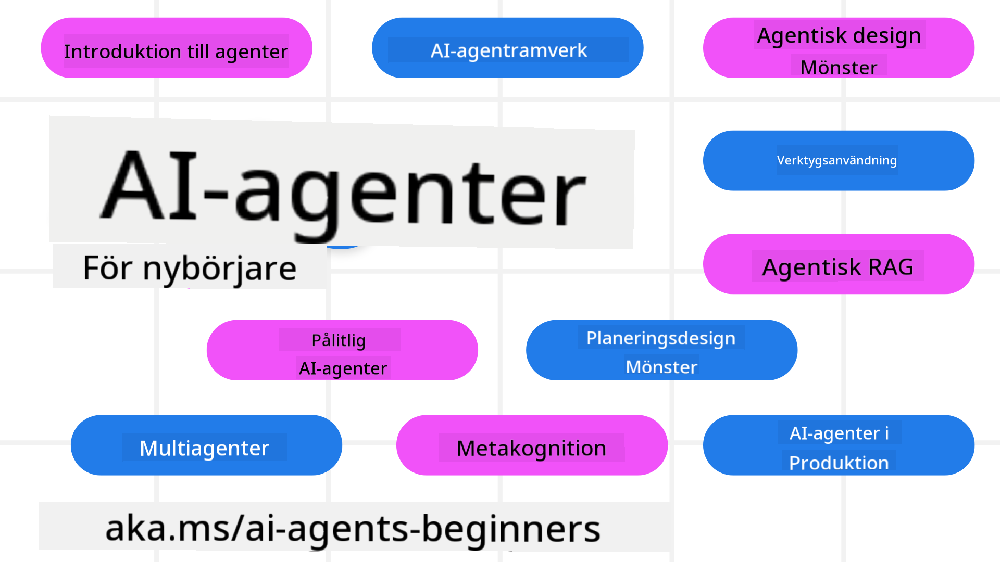

<!--
CO_OP_TRANSLATOR_METADATA:
{
  "original_hash": "6b07046397366e6f6f4524c9ddeba1e1",
  "translation_date": "2025-07-12T14:52:44+00:00",
  "source_file": "README.md",
  "language_code": "sv"
}
-->
# AI-agenter för nybörjare - En kurs

## 11 lektioner som lär dig allt du behöver veta för att börja bygga AI-agenter

  
  
  
  

### 🌐 Fler språk stöds

#### Stöds via GitHub Action (Automatiserat & Alltid uppdaterat)

[Franska](../fr/README.md) | [Spanska](../es/README.md) | [Tyska](../de/README.md) | [Ryska](../ru/README.md) | [Arabiska](../ar/README.md) | [Persiska (Farsi)](../fa/README.md) | [Urdu](../ur/README.md) | [Kinesiska (Förenklad)](../zh/README.md) | [Kinesiska (Traditionell, Macau)](../mo/README.md) | [Kinesiska (Traditionell, Hong Kong)](../hk/README.md) | [Kinesiska (Traditionell, Taiwan)](../tw/README.md) | [Japanska](../ja/README.md) | [Koreanska](../ko/README.md) | [Hindi](../hi/README.md) | [Bengali](../bn/README.md) | [Marathi](../mr/README.md) | [Nepali](../ne/README.md) | [Punjabi (Gurmukhi)](../pa/README.md) | [Portugisiska (Portugal)](../pt/README.md) | [Portugisiska (Brasilien)](../br/README.md) | [Italienska](../it/README.md) | [Polska](../pl/README.md) | [Turkiska](../tr/README.md) | [Grekiska](../el/README.md) | [Thailändska](../th/README.md) | [Svenska](./README.md) | [Danska](../da/README.md) | [Norska](../no/README.md) | [Finska](../fi/README.md) | [Holländska](../nl/README.md) | [Hebreiska](../he/README.md) | [Vietnamesiska](../vi/README.md) | [Indonesiska](../id/README.md) | [Malajiska](../ms/README.md) | [Tagalog (Filippinska)](../tl/README.md) | [Swahili](../sw/README.md) | [Ungerska](../hu/README.md) | [Tjeckiska](../cs/README.md) | [Slovakiska](../sk/README.md) | [Rumänska](../ro/README.md) | [Bulgariska](../bg/README.md) | [Serbiska (Kyrilliska)](../sr/README.md) | [Kroatiska](../hr/README.md) | [Slovenska](../sl/README.md) | [Ukrainska](../uk/README.md) | [Burmese (Myanmar)](../my/README.md)

**Om du vill ha fler språkstöd finns de listade [här](https://github.com/Azure/co-op-translator/blob/main/getting_started/supported-languages.md)**

  
  

## 🌱 Kom igång

Den här kursen innehåller 11 lektioner som täcker grunderna i att bygga AI-agenter. Varje lektion tar upp ett eget ämne, så börja där du vill!

Kursen har stöd för flera språk. Se våra [tillgängliga språk här](../..).

Om det är första gången du bygger med Generative AI-modeller, kolla in vår kurs [Generative AI For Beginners](https://aka.ms/genai-beginners) som innehåller 21 lektioner om att bygga med GenAI.

Glöm inte att [stjärnmärka (🌟) det här repot](https://docs.github.com/en/get-started/exploring-projects-on-github/saving-repositories-with-stars?WT.mc_id=academic-105485-koreyst) och [forka det här repot](https://github.com/microsoft/ai-agents-for-beginners/fork) för att kunna köra koden.

### Vad du behöver

Varje lektion i kursen innehåller kodexempel som finns i mappen code_samples. Du kan [forka det här repot](https://github.com/microsoft/ai-agents-for-beginners/fork) för att skapa din egen kopia.

Kodexemplen i dessa övningar använder Azure AI Foundry och GitHub Model Catalogs för att interagera med språkmodeller:

- [Github Models](https://aka.ms/ai-agents-beginners/github-models) - Gratis / Begränsat  
- [Azure AI Foundry](https://aka.ms/ai-agents-beginners/ai-foundry) - Kräver Azure-konto

Den här kursen använder också följande AI Agent-ramverk och tjänster från Microsoft:

- [Azure AI Agent Service](https://aka.ms/ai-agents-beginners/ai-agent-service)  
- [Semantic Kernel](https://aka.ms/ai-agents-beginners/semantic-kernel)  
- [AutoGen](https://aka.ms/ai-agents/autogen)

För mer information om hur du kör koden för den här kursen, gå till [Course Setup](./00-course-setup/README.md).

## 🙏 Vill du hjälpa till?

Har du förslag eller hittat stavfel eller kodfel? [Skapa ett ärende](https://github.com/microsoft/ai-agents-for-beginners/issues?WT.mc_id=academic-105485-koreyst) eller [skicka en pull request](https://github.com/microsoft/ai-agents-for-beginners/pulls?WT.mc_id=academic-105485-koreyst)

Om du fastnar eller har frågor om att bygga AI-agenter, gå med i vår [Azure AI Foundry Community Discord](https://discord.gg/kzRShWzttr)

Om du har produktfeedback eller stöter på fel under byggandet, besök vårt [Azure AI Foundry Developer Forum](https://aka.ms/azureaifoundry/forum)

## 📂 Varje lektion innehåller

- En skriftlig lektion i README och en kort video  
- Python-kodexempel som stöder Azure AI Foundry och Github Models (Gratis)  
- Länkar till extra resurser för att fortsätta din inlärning  

## 🗃️ Lektioner

| **Lektion**                              | **Text & Kod**                                     | **Video**                                                  | **Extra lärande**                                                                     |
|------------------------------------------|----------------------------------------------------|------------------------------------------------------------|----------------------------------------------------------------------------------------|
| Introduktion till AI-agenter och användningsområden | [Länk](./01-intro-to-ai-agents/README.md)          | [Video](https://youtu.be/3zgm60bXmQk?si=z8QygFvYQv-9WtO1)  | [Länk](https://aka.ms/ai-agents-beginners/collection?WT.mc_id=academic-105485-koreyst) |
| Utforska AI-agentramverk                  | [Länk](./02-explore-agentic-frameworks/README.md)  | [Video](https://youtu.be/ODwF-EZo_O8?si=Vawth4hzVaHv-u0H)  | [Länk](https://aka.ms/ai-agents-beginners/collection?WT.mc_id=academic-105485-koreyst) |
| Förstå AI-agentdesignmönster              | [Länk](./03-agentic-design-patterns/README.md)     | [Video](https://youtu.be/m9lM8qqoOEA?si=BIzHwzstTPL8o9GF)  | [Länk](https://aka.ms/ai-agents-beginners/collection?WT.mc_id=academic-105485-koreyst) |
| Designmönster för verktygsanvändning     | [Länk](./04-tool-use/README.md)                    | [Video](https://youtu.be/vieRiPRx-gI?si=2z6O2Xu2cu_Jz46N)  | [Länk](https://aka.ms/ai-agents-beginners/collection?WT.mc_id=academic-105485-koreyst) |
| Agentic RAG                              | [Länk](./05-agentic-rag/README.md)                 | [Video](https://youtu.be/WcjAARvdL7I?si=gKPWsQpKiIlDH9A3)  | [Länk](https://aka.ms/ai-agents-beginners/collection?WT.mc_id=academic-105485-koreyst) |
| Bygga pålitliga AI-agenter                | [Länk](./06-building-trustworthy-agents/README.md) | [Video](https://youtu.be/iZKkMEGBCUQ?si=jZjpiMnGFOE9L8OK ) | [Länk](https://aka.ms/ai-agents-beginners/collection?WT.mc_id=academic-105485-koreyst) |
| Designmönster för planering                | [Länk](./07-planning-design/README.md)             | [Video](https://youtu.be/kPfJ2BrBCMY?si=6SC_iv_E5-mzucnC)  | [Länk](https://aka.ms/ai-agents-beginners/collection?WT.mc_id=academic-105485-koreyst) |
| Designmönster för multi-agent              | [Länk](./08-multi-agent/README.md)                 | [Video](https://youtu.be/V6HpE9hZEx0?si=rMgDhEu7wXo2uo6g)  | [Länk](https://aka.ms/ai-agents-beginners/collection?WT.mc_id=academic-105485-koreyst) |
| Designmönster för metakognition            | [Länk](./09-metacognition/README.md)               | [Video](https://youtu.be/His9R6gw6Ec?si=8gck6vvdSNCt6OcF)  | [Länk](https://aka.ms/ai-agents-beginners/collection?WT.mc_id=academic-105485-koreyst) |
| AI-agenter i produktion                    | [Länk](./10-ai-agents-production/README.md)        | [Video](https://youtu.be/l4TP6IyJxmQ?si=31dnhexRo6yLRJDl)  | [Länk](https://aka.ms/ai-agents-beginners/collection?WT.mc_id=academic-105485-koreyst) |
| AI-agenter med MCP                         | [Länk](./11-mcp/README.md)                         |                                                            | [Länk](https://aka.ms/mcp-for-beginners)                                               |

## 🎒 Andra kurser

Vårt team producerar fler kurser! Kolla in:
- [**NY** Model Context Protocol (MCP) för nybörjare](https://github.com/microsoft/mcp-for-beginners?WT.mc_id=academic-105485-koreyst)
- [Generativ AI för nybörjare med .NET](https://github.com/microsoft/Generative-AI-for-beginners-dotnet?WT.mc_id=academic-105485-koreyst)
- [Generativ AI för nybörjare](https://github.com/microsoft/generative-ai-for-beginners?WT.mc_id=academic-105485-koreyst)
- [ML för nybörjare](https://aka.ms/ml-beginners?WT.mc_id=academic-105485-koreyst)
- [Data Science för nybörjare](https://aka.ms/datascience-beginners?WT.mc_id=academic-105485-koreyst)
- [AI för nybörjare](https://aka.ms/ai-beginners?WT.mc_id=academic-105485-koreyst)
- [Cybersäkerhet för nybörjare](https://github.com/microsoft/Security-101??WT.mc_id=academic-96948-sayoung)
- [Webbutveckling för nybörjare](https://aka.ms/webdev-beginners?WT.mc_id=academic-105485-koreyst)
- [IoT för nybörjare](https://aka.ms/iot-beginners?WT.mc_id=academic-105485-koreyst)
- [XR-utveckling för nybörjare](https://github.com/microsoft/xr-development-for-beginners?WT.mc_id=academic-105485-koreyst)
- [Bemästra GitHub Copilot för AI-parprogrammering](https://aka.ms/GitHubCopilotAI?WT.mc_id=academic-105485-koreyst)
- [Bemästra GitHub Copilot för C#/.NET-utvecklare](https://github.com/microsoft/mastering-github-copilot-for-dotnet-csharp-developers?WT.mc_id=academic-105485-koreyst)
- [Välj ditt eget Copilot-äventyr](https://github.com/microsoft/CopilotAdventures?WT.mc_id=academic-105485-koreyst)

## 🌟 Tack från communityn

Tack till [Shivam Goyal](https://www.linkedin.com/in/shivam2003/) för att ha bidragit med viktiga kodexempel som visar Agentic RAG.

## Bidra

Det här projektet välkomnar bidrag och förslag. De flesta bidrag kräver att du godkänner ett
Contributor License Agreement (CLA) som intygar att du har rätt att, och faktiskt gör det, ge oss
rättigheterna att använda ditt bidrag. För mer information, besök
<https://cla.opensource.microsoft.com>.

När du skickar in en pull request kommer en CLA-bot automatiskt att avgöra om du behöver lämna in
en CLA och märka PR:n på lämpligt sätt (t.ex. statuskontroll, kommentar). Följ bara instruktionerna
från boten. Du behöver bara göra detta en gång för alla repos som använder vår CLA.

Det här projektet har antagit [Microsoft Open Source Code of Conduct](https://opensource.microsoft.com/codeofconduct/).
För mer information, se [Code of Conduct FAQ](https://opensource.microsoft.com/codeofconduct/faq/) eller
kontakta [opencode@microsoft.com](mailto:opencode@microsoft.com) vid ytterligare frågor eller kommentarer.

## Varumärken

Det här projektet kan innehålla varumärken eller logotyper för projekt, produkter eller tjänster. Auktoriserad användning av Microsofts
varumärken eller logotyper är föremål för och måste följa
[Microsofts riktlinjer för varumärken och varumärkesanvändning](https://www.microsoft.com/legal/intellectualproperty/trademarks/usage/general).
Användning av Microsofts varumärken eller logotyper i modifierade versioner av detta projekt får inte skapa förvirring eller antyda Microsofts sponsring.
All användning av tredjeparts varumärken eller logotyper är föremål för dessa tredjeparts policyer.

**Ansvarsfriskrivning**:  
Detta dokument har översatts med hjälp av AI-översättningstjänsten [Co-op Translator](https://github.com/Azure/co-op-translator). Även om vi strävar efter noggrannhet, vänligen observera att automatiska översättningar kan innehålla fel eller brister. Det ursprungliga dokumentet på dess modersmål bör betraktas som den auktoritativa källan. För kritisk information rekommenderas professionell mänsklig översättning. Vi ansvarar inte för eventuella missförstånd eller feltolkningar som uppstår vid användning av denna översättning.