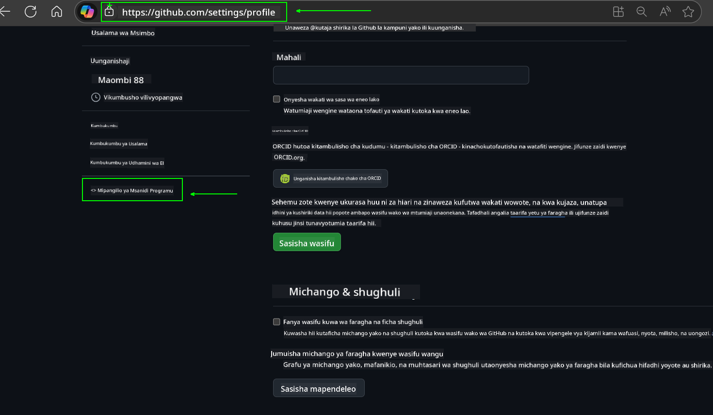
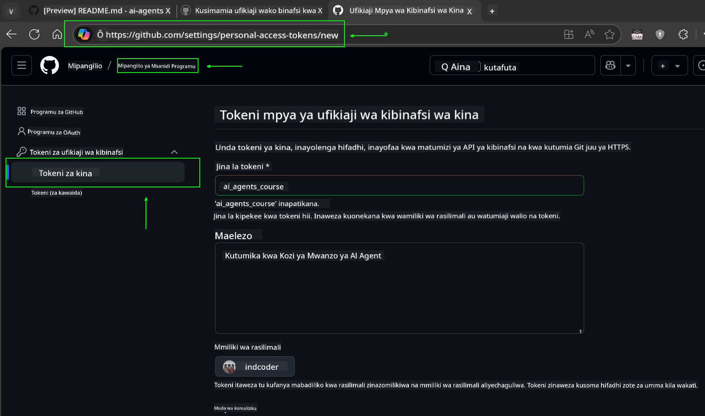
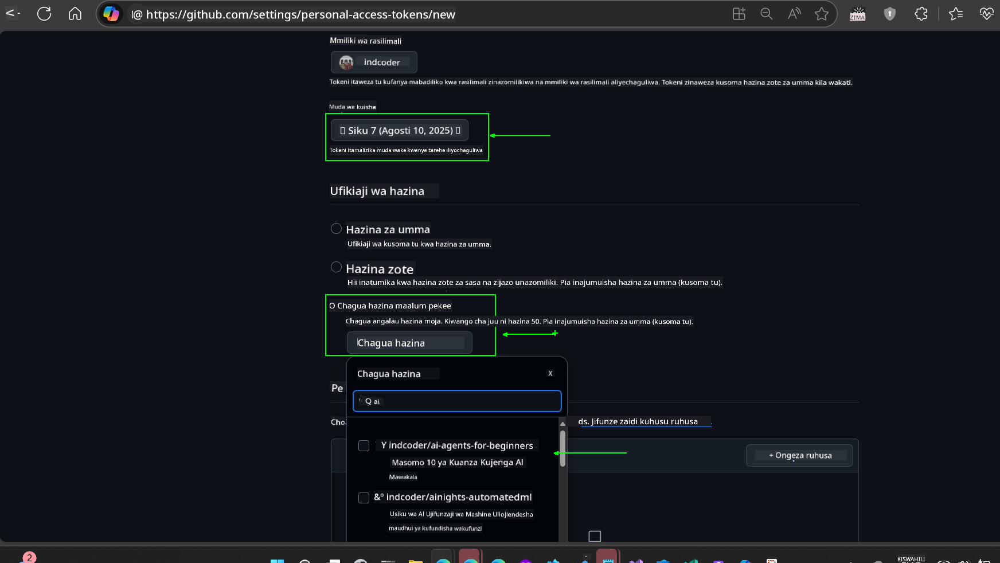
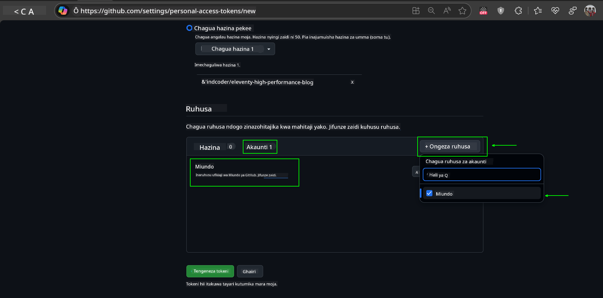
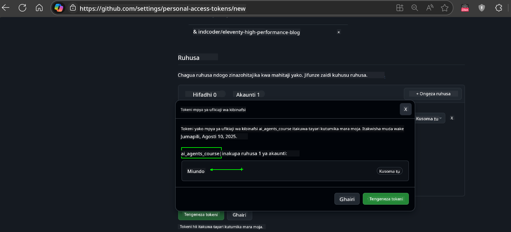
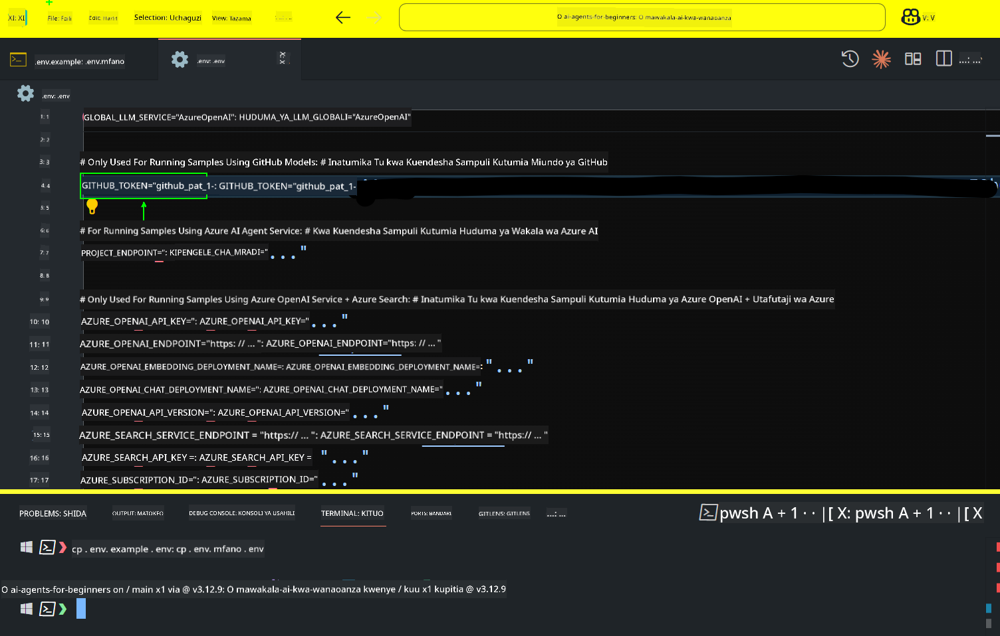

<!--
CO_OP_TRANSLATOR_METADATA:
{
  "original_hash": "c55b973b1562abf5aadf6a4028265ac5",
  "translation_date": "2025-08-29T19:55:26+00:00",
  "source_file": "00-course-setup/README.md",
  "language_code": "sw"
}
-->
# Kuweka Kozi

## Utangulizi

Somo hili litafundisha jinsi ya kuendesha sampuli za msimbo wa kozi hii.

## Jiunge na Wanafunzi Wengine na Pata Msaada

Kabla ya kuanza kunakili repo yako, jiunge na [AI Agents For Beginners Discord channel](https://aka.ms/ai-agents/discord) ili kupata msaada wowote wa kuanzisha, maswali yoyote kuhusu kozi, au kuungana na wanafunzi wengine.

## Nakili au Fork Repo Hii

Ili kuanza, tafadhali nakili au fork Repo ya GitHub. Hii itakupa toleo lako la nyenzo za kozi ili uweze kuendesha, kujaribu, na kurekebisha msimbo!

Hii inaweza kufanyika kwa kubofya kiungo cha

Unafaa sasa kuwa na toleo lako la forked la kozi hii katika kiungo kifuatacho:


## Kuendesha Msimbo

Kozi hii inatoa mfululizo wa Jupyter Notebooks ambazo unaweza kuendesha ili kupata uzoefu wa vitendo wa kujenga AI Agents.

Sampuli za msimbo zinatumia:

**Inahitaji Akaunti ya GitHub - Bure**:

1) Semantic Kernel Agent Framework + GitHub Models Marketplace. Imewekwa alama kama (semantic-kernel.ipynb)
2) AutoGen Framework + GitHub Models Marketplace. Imewekwa alama kama (autogen.ipynb)

**Inahitaji Usajili wa Azure**:
3) Azure AI Foundry + Azure AI Agent Service. Imewekwa alama kama (azureaiagent.ipynb)

Tunapendekeza ujaribu aina zote tatu za mifano ili kuona ni ipi inakufaa zaidi.

Chaguo lolote utakalochagua, litaamua hatua za kuanzisha unazohitaji kufuata hapa chini:

## Mahitaji

- Python 3.12+
  - **NOTE**: Ikiwa huna Python3.12 iliyosakinishwa, hakikisha unaisakinisha. Kisha unda venv yako ukitumia python3.12 ili kuhakikisha matoleo sahihi yamesakinishwa kutoka kwenye faili ya requirements.txt.
- Akaunti ya GitHub - Kwa Ufikiaji wa GitHub Models Marketplace
- Usajili wa Azure - Kwa Ufikiaji wa Azure AI Foundry
- Akaunti ya Azure AI Foundry - Kwa Ufikiaji wa Azure AI Agent Service

Tumeshirikisha faili ya `requirements.txt` katika mzizi wa repo hii ambayo ina vifurushi vyote vya Python vinavyohitajika kuendesha sampuli za msimbo.

Unaweza kuvisakinisha kwa kuendesha amri ifuatayo kwenye terminal yako katika mzizi wa repo:

```bash
pip install -r requirements.txt
```
Tunapendekeza kuunda mazingira ya Python virtual ili kuepuka migogoro na matatizo yoyote.

## Kuanzisha VSCode
Hakikisha unatumia toleo sahihi la Python katika VSCode.


## Kuanzisha Sampuli zinazotumia GitHub Models 

### Hatua ya 1: Pata GitHub Personal Access Token (PAT) Yako

Kozi hii inatumia GitHub Models Marketplace, ikitoa ufikiaji wa bure kwa Large Language Models (LLMs) ambazo utatumia kujenga AI Agents.

Ili kutumia GitHub Models, utahitaji kuunda [GitHub Personal Access Token](https://docs.github.com/en/authentication/keeping-your-account-and-data-secure/managing-your-personal-access-tokens).

Hii inaweza kufanyika kwa kwenda kwenye akaunti yako ya GitHub.

Tafadhali fuata [Kanuni ya Upendeleo Mdogo](https://docs.github.com/en/get-started/learning-to-code/storing-your-secrets-safely) wakati wa kuunda token yako. Hii inamaanisha unapaswa kutoa tokeni ruhusa zinazohitajika tu kuendesha sampuli za msimbo katika kozi hii.

1. Chagua chaguo la `Fine-grained tokens` upande wa kushoto wa skrini yako kwa kwenda kwenye **Developer settings**
   

    Kisha chagua `Generate new token`.

    

2. Weka jina la kuelezea kwa tokeni yako linaloonyesha kusudi lake, ili iwe rahisi kutambua baadaye.

    🔐 Pendekezo la Muda wa Tokeni

    Muda uliopendekezwa: Siku 30
    Kwa usalama zaidi, unaweza kuchagua muda mfupi—kama siku 7 🛡️
    Ni njia nzuri ya kuweka lengo la kibinafsi na kukamilisha kozi wakati kasi yako ya kujifunza iko juu 🚀.

    

3. Punguza wigo wa tokeni kwa fork ya repo hii.

    

4. Punguza ruhusa za tokeni: Chini ya **Permissions**, bofya kichupo cha **Account**, na bofya kitufe cha "+ Add permissions". Dropdown itaonekana. Tafadhali tafuta **Models** na weka alama kwenye kisanduku chake.
    

5. Thibitisha ruhusa zinazohitajika kabla ya kuunda tokeni. 

6. Kabla ya kuunda tokeni, hakikisha uko tayari kuhifadhi tokeni katika sehemu salama kama hifadhi ya meneja wa nywila, kwani haitatolewa tena baada ya kuunda. 

Nakili tokeni yako mpya ambayo umekuja kuunda. Sasa utaongeza hii kwenye faili yako ya `.env` iliyojumuishwa katika kozi hii.

### Hatua ya 2: Unda Faili Yako ya `.env`

Ili kuunda faili yako ya `.env` endesha amri ifuatayo kwenye terminal yako.

```bash
cp .env.example .env
```

Hii itanakili faili ya mfano na kuunda `.env` katika saraka yako ambapo utaweka maadili ya vigezo vya mazingira.

Kwa tokeni yako iliyokopiwa, fungua faili ya `.env` katika mhariri wako wa maandishi unaopenda na weka tokeni yako kwenye sehemu ya `GITHUB_TOKEN`.


Sasa unapaswa kuwa na uwezo wa kuendesha sampuli za msimbo wa kozi hii.

## Kuanzisha Sampuli zinazotumia Azure AI Foundry na Azure AI Agent Service

### Hatua ya 1: Pata Endpoint ya Mradi wa Azure Yako

Fuata hatua za kuunda hub na mradi katika Azure AI Foundry zilizopatikana hapa: [Hub resources overview](https://learn.microsoft.com/en-us/azure/ai-foundry/concepts/ai-resources)

Baada ya kuunda mradi wako, utahitaji kupata string ya muunganisho wa mradi wako.

Hii inaweza kufanyika kwa kwenda kwenye ukurasa wa **Overview** wa mradi wako katika portal ya Azure AI Foundry.


### Hatua ya 2: Unda Faili Yako ya `.env`

Ili kuunda faili yako ya `.env` endesha amri ifuatayo kwenye terminal yako.

```bash
cp .env.example .env
```

Hii itanakili faili ya mfano na kuunda `.env` katika saraka yako ambapo utaweka maadili ya vigezo vya mazingira.

Kwa tokeni yako iliyokopiwa, fungua faili ya `.env` katika mhariri wako wa maandishi unaopenda na weka tokeni yako kwenye sehemu ya `PROJECT_ENDPOINT`.

### Hatua ya 3: Ingia kwenye Azure

Kama utaratibu bora wa usalama, tutatumia [uthibitishaji bila funguo](https://learn.microsoft.com/azure/developer/ai/keyless-connections?tabs=csharp%2Cazure-cli?WT.mc_id=academic-105485-koreyst) kuingia kwenye Azure OpenAI kwa Microsoft Entra ID.

Kisha, fungua terminal na endesha `az login --use-device-code` ili kuingia kwenye akaunti yako ya Azure.

Baada ya kuingia, chagua usajili wako kwenye terminal.

## Vigezo vya Mazingira vya Ziada - Azure Search na Azure OpenAI 

Kwa Somo la Agentic RAG - Somo la 5 - kuna sampuli zinazotumia Azure Search na Azure OpenAI.

Ikiwa unataka kuendesha sampuli hizi, utahitaji kuongeza vigezo vifuatavyo vya mazingira kwenye faili yako ya `.env`:

### Ukurasa wa Muhtasari (Mradi)

- `AZURE_SUBSCRIPTION_ID` - Angalia **Project details** kwenye ukurasa wa **Overview** wa mradi wako.

- `AZURE_AI_PROJECT_NAME` - Angalia juu ya ukurasa wa **Overview** wa mradi wako.

- `AZURE_OPENAI_SERVICE` - Pata hii kwenye kichupo cha **Included capabilities** kwa **Azure OpenAI Service** kwenye ukurasa wa **Overview**.

### Kituo cha Usimamizi

- `AZURE_OPENAI_RESOURCE_GROUP` - Nenda kwenye **Project properties** kwenye ukurasa wa **Overview** wa **Management Center**.

- `GLOBAL_LLM_SERVICE` - Chini ya **Connected resources**, pata jina la muunganisho wa **Azure AI Services**. Ikiwa halipo, angalia **Azure portal** chini ya kikundi chako cha rasilimali kwa jina la rasilimali za AI Services.

### Ukurasa wa Models + Endpoints

- `AZURE_OPENAI_EMBEDDING_DEPLOYMENT_NAME` - Chagua mfano wako wa embedding (mfano, `text-embedding-ada-002`) na kumbuka **Deployment name** kutoka kwa maelezo ya mfano.

- `AZURE_OPENAI_CHAT_DEPLOYMENT_NAME` - Chagua mfano wako wa mazungumzo (mfano, `gpt-4o-mini`) na kumbuka **Deployment name** kutoka kwa maelezo ya mfano.

### Azure Portal

- `AZURE_OPENAI_ENDPOINT` - Tafuta **Azure AI services**, bofya juu yake, kisha nenda kwenye **Resource Management**, **Keys and Endpoint**, shuka chini kwenye "Azure OpenAI endpoints", na nakili ile inayosema "Language APIs".

- `AZURE_OPENAI_API_KEY` - Kutoka skrini hiyo hiyo, nakili KEY 1 au KEY 2.

- `AZURE_SEARCH_SERVICE_ENDPOINT` - Pata rasilimali yako ya **Azure AI Search**, bofya juu yake, na angalia **Overview**.

- `AZURE_SEARCH_API_KEY` - Kisha nenda kwenye **Settings** na kisha **Keys** ili kunakili funguo kuu au sekondari ya msimamizi.

### Ukurasa wa Nje

- `AZURE_OPENAI_API_VERSION` - Tembelea ukurasa wa [API version lifecycle](https://learn.microsoft.com/en-us/azure/ai-services/openai/api-version-deprecation#latest-ga-api-release) chini ya **Latest GA API release**.

### Kuanzisha uthibitishaji bila funguo

Badala ya kuweka maelezo yako ya kuingia, tutatumia muunganisho bila funguo na Azure OpenAI. Ili kufanya hivyo, tutaleta `DefaultAzureCredential` na baadaye kuita kazi ya `DefaultAzureCredential` ili kupata uthibitisho.

```python
from azure.identity import DefaultAzureCredential, InteractiveBrowserCredential
```

## Umekwama Mahali Fulani?

Ikiwa unakutana na matatizo yoyote kuendesha mpangilio huu, jiunge kwenye

## Somo Lijalo

Sasa uko tayari kuendesha msimbo wa kozi hii. Furahia kujifunza zaidi kuhusu ulimwengu wa AI Agents!

[Utangulizi wa AI Agents na Matumizi ya Agents](../01-intro-to-ai-agents/README.md)

---

**Kanusho**:  
Hati hii imetafsiriwa kwa kutumia huduma ya tafsiri ya AI [Co-op Translator](https://github.com/Azure/co-op-translator). Ingawa tunajitahidi kuhakikisha usahihi, tafsiri za kiotomatiki zinaweza kuwa na makosa au kutokuwa sahihi. Hati ya asili katika lugha yake ya awali inapaswa kuchukuliwa kama chanzo cha mamlaka. Kwa taarifa muhimu, tafsiri ya kitaalamu ya binadamu inapendekezwa. Hatutawajibika kwa kutoelewana au tafsiri zisizo sahihi zinazotokana na matumizi ya tafsiri hii.