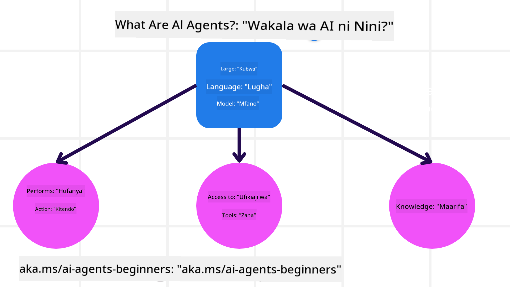
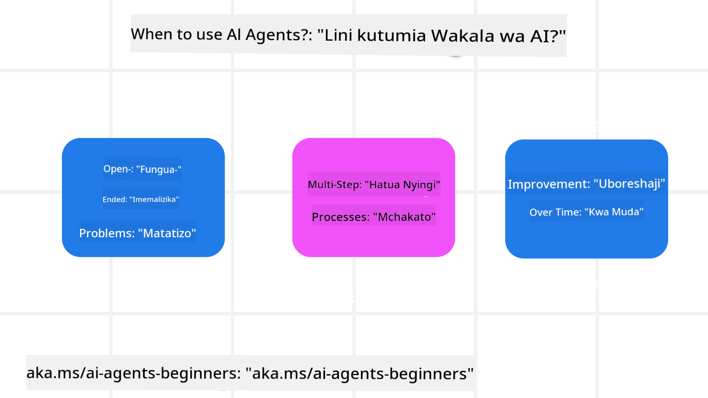

<!--
CO_OP_TRANSLATOR_METADATA:
{
  "original_hash": "d84943abc8f001ad4670418d32c2d899",
  "translation_date": "2025-07-12T08:10:43+00:00",
  "source_file": "01-intro-to-ai-agents/README.md",
  "language_code": "sw"
}
-->
kuungana na wapenzi wengine wa kujifunza na Wajenzi wa Wakala wa AI na kuuliza maswali yoyote unayoweza kuwa nayo kuhusu kozi hii.

Ili kuanza kozi hii, tunaanza kwa kupata uelewa bora wa ni nini Wakala wa AI ni na jinsi tunavyoweza kuvitumia katika programu na michakato tunayoijenga.

## Utangulizi

Somo hili linajumuisha:

- Wakala wa AI ni nini na ni aina gani tofauti za wakala zipo?
- Matumizi gani ni bora kwa Wakala wa AI na zinaweza kutusaidia vipi?
- Ni vipengele gani vya msingi tunapotengeneza Suluhisho za Wakala?

## Malengo ya Kujifunza
Baada ya kumaliza somo hili, unapaswa kuwa na uwezo wa:

- Kuelewa dhana za Wakala wa AI na jinsi zinavyotofautiana na suluhisho zingine za AI.
- Kutumia Wakala wa AI kwa ufanisi zaidi.
- Kubuni suluhisho za Wakala kwa ufanisi kwa watumiaji na wateja.

## Kufafanua Wakala wa AI na Aina za Wakala wa AI

### Wakala wa AI ni Nini?

Wakala wa AI ni **mifumo** inayowezesha **Modeli Kubwa za Lugha (LLMs)** **kutekeleza vitendo** kwa kuongeza uwezo wao kwa kuwapa LLMs **ufikiaji wa zana** na **maarifa**.

Tuchambue ufafanuzi huu kwa sehemu ndogo:

- **Mfumo** - Ni muhimu kufikiria wakala si kipengele kimoja tu bali kama mfumo wa vipengele vingi. Kiwango cha msingi, vipengele vya Wakala wa AI ni:
  - **Mazingira** - Eneo lililobainishwa ambapo Wakala wa AI anafanya kazi. Kwa mfano, kama tungekuwa na wakala wa AI wa kuhifadhi safari, mazingira yanaweza kuwa mfumo wa kuhifadhi safari ambao Wakala wa AI hutumia kutekeleza kazi.
  - **Vihisi** - Mazingira yana taarifa na hutoa mrejesho. Wakala wa AI hutumia vihisi kukusanya na kufasiri taarifa hii kuhusu hali ya sasa ya mazingira. Katika mfano wa Wakala wa Kuhifadhi Safari, mfumo wa kuhifadhi unaweza kutoa taarifa kama upatikanaji wa hoteli au bei za ndege.
  - **Vitendo** - Mara Wakala wa AI anapopokea hali ya sasa ya mazingira, kwa kazi ya sasa wakala huamua kitendo cha kufanya kubadilisha mazingira. Kwa wakala wa kuhifadhi safari, inaweza kuwa kuhifadhi chumba kilichopo kwa mtumiaji.

**Modeli Kubwa za Lugha** - Dhana ya wakala ilikuwepo kabla ya kuundwa kwa LLMs. Faida ya kujenga Wakala wa AI kwa LLM ni uwezo wao wa kufasiri lugha ya binadamu na data. Uwezo huu unawawezesha LLM kufasiri taarifa za mazingira na kuunda mpango wa kubadilisha mazingira.

**Kutekeleza Vitendo** - Nje ya mifumo ya Wakala wa AI, LLMs zinaweza tu kutengeneza maudhui au taarifa kulingana na maelekezo ya mtumiaji. Ndani ya mifumo ya Wakala wa AI, LLMs zinaweza kutekeleza kazi kwa kufasiri ombi la mtumiaji na kutumia zana zinazopatikana katika mazingira yao.

**Ufikiaji wa Zana** - Zana ambazo LLM ina ufikiaji wake zinaamuliwa na 1) mazingira ambayo inafanya kazi ndani yake na 2) mtengenezaji wa Wakala wa AI. Kwa mfano wa wakala wa safari, zana za wakala zimezuiliwa na shughuli zinazopatikana katika mfumo wa kuhifadhi, na/au mtengenezaji anaweza kupunguza ufikiaji wa zana za wakala kwa ndege tu.

**Kumbukumbu+Maarifa** - Kumbukumbu inaweza kuwa ya muda mfupi katika muktadha wa mazungumzo kati ya mtumiaji na wakala. Kwa muda mrefu, nje ya taarifa zinazotolewa na mazingira, Wakala wa AI pia wanaweza kupata maarifa kutoka kwa mifumo mingine, huduma, zana, na hata wakala wengine. Katika mfano wa wakala wa safari, maarifa haya yanaweza kuwa taarifa kuhusu mapendeleo ya safari ya mtumiaji yaliyoko katika hifadhidata ya wateja.

### Aina Tofauti za Wakala

Sasa tunapokuwa na ufafanuzi wa jumla wa Wakala wa AI, tuchunguze baadhi ya aina maalum za wakala na jinsi zingetumika kwa wakala wa kuhifadhi safari.

| **Aina ya Wakala**            | **Maelezo**                                                                                                                         | **Mfano**                                                                                                                                                                                                                   |
| ----------------------------- | ----------------------------------------------------------------------------------------------------------------------------------- | --------------------------------------------------------------------------------------------------------------------------------------------------------------------------------------------------------------------------- |
| **Wakala wa Mwitikio Rahisi** | Hufanya vitendo mara moja kulingana na sheria zilizowekwa awali.                                                                    | Wakala wa safari hufasiri muktadha wa barua pepe na kupeleka malalamiko ya safari kwa huduma kwa wateja.                                                                                                                    |
| **Wakala wa Mwitikio wa Mfano**| Hufanya vitendo kulingana na mfano wa dunia na mabadiliko ya mfano huo.                                                             | Wakala wa safari huweka kipaumbele njia zilizo na mabadiliko makubwa ya bei kulingana na upatikanaji wa data za bei za zamani.                                                                                              |
| **Wakala wa Lengo**            | Huunda mipango kufanikisha malengo maalum kwa kufasiri lengo na kuamua vitendo vya kufikia lengo hilo.                              | Wakala wa safari huhifadhi safari kwa kuamua mipango ya usafiri inayohitajika (gari, usafiri wa umma, ndege) kutoka mahali ulipo hadi mahali unapotaka kwenda.                                                                 |
| **Wakala wa Thamani**          | Huzingatia mapendeleo na kupima mabadiliko kwa nambari ili kuamua jinsi ya kufikia malengo.                                         | Wakala wa safari hujaribu kupata thamani kubwa kwa kupima urahisi dhidi ya gharama wakati wa kuhifadhi safari.                                                                                                              |
| **Wakala wa Kujifunza**        | Huboresha kwa muda kwa kujibu mrejesho na kurekebisha vitendo ipasavyo.                                                             | Wakala wa safari huboresha kwa kutumia mrejesho wa wateja kutoka kwa tafiti za baada ya safari kufanya marekebisho kwa uhifadhi wa baadaye.                                                                                   |
| **Wakala wa Msingi wa Ngazi**  | Huwa na wakala wengi katika mfumo wa ngazi, ambapo wakala wa ngazi ya juu hugawanya kazi kuwa kazi ndogo kwa wakala wa ngazi ya chini kukamilisha. | Wakala wa safari huondoa safari kwa kugawanya kazi kuwa kazi ndogo (kwa mfano, kuondoa uhifadhi maalum) na wakala wa ngazi ya chini kuzikamilisha, wakiripoti kwa wakala wa ngazi ya juu.                                         |
| **Mifumo ya Wakala Wengi (MAS)**| Wakala hufanya kazi kwa uhuru, kwa ushirikiano au ushindani.                                                                        | Ushirikiano: Wakala wengi huhifadhi huduma maalum za safari kama hoteli, ndege, na burudani. Ushindani: Wakala wengi husimamia na kushindana juu ya kalenda ya uhifadhi wa hoteli ili kuhifadhi wateja katika hoteli.             |

## Wakati wa Kutumia Wakala wa AI

Katika sehemu ya awali, tulitumia mfano wa Wakala wa Safari kuelezea jinsi aina tofauti za wakala zinavyoweza kutumika katika hali tofauti za uhifadhi wa safari. Tutaendelea kutumia programu hii katika kozi nzima.

Tuchunguze aina za matumizi ambayo Wakala wa AI hutumika vyema:

- **Matatizo Yasiyo na Mwisho Wazi** - kuruhusu LLM kuamua hatua zinazohitajika kukamilisha kazi kwa sababu haiwezi kila wakati kuwekwa kwa mkono katika mchakato.
- **Mchakato wa Hatua Nyingi** - kazi zinazohitaji ngazi ya ugumu ambapo Wakala wa AI anahitaji kutumia zana au taarifa kwa mizunguko mingi badala ya kupata mara moja.
- **Kuboresha kwa Muda** - kazi ambapo wakala anaweza kuboresha kwa muda kwa kupokea mrejesho kutoka kwa mazingira au watumiaji ili kutoa huduma bora.

Tutazungumzia zaidi kuhusu kuzingatia matumizi ya Wakala wa AI katika somo la Kujenga Wakala wa AI wa Kuaminika.

## Misingi ya Suluhisho za Wakala

### Maendeleo ya Wakala

Hatua ya kwanza katika kubuni mfumo wa Wakala wa AI ni kufafanua zana, vitendo, na tabia. Katika kozi hii, tunazingatia kutumia **Huduma ya Wakala wa AI ya Azure** kufafanua Wakala wetu. Huduma hii inatoa vipengele kama:

- Uchaguzi wa Modeli za Wazi kama OpenAI, Mistral, na Llama
- Matumizi ya Data Zilizoruhusiwa kupitia watoa huduma kama Tripadvisor
- Matumizi ya zana za OpenAPI 3.0 zilizostandishwa

### Mifumo ya Wakala

Mawasiliano na LLM hufanyika kupitia maelekezo. Kutokana na asili ya nusu-jiendesha ya Wakala wa AI, si kila wakati inawezekana au inahitajika kuwasilisha tena maelekezo kwa LLM baada ya mabadiliko ya mazingira. Tunatumia **Mifumo ya Wakala** inayotuwezesha kuwasilisha maelekezo kwa LLM kwa hatua nyingi kwa njia inayoweza kupanuka.

Kozi hii imegawanywa katika baadhi ya mifumo maarufu ya Wakala kwa sasa.

### Mifumo ya Kifurushi cha Wakala

Mifumo ya Kifurushi cha Wakala inaruhusu watengenezaji kutekeleza mifumo ya wakala kupitia msimbo. Mifumo hii hutoa templeti, viendelezi, na zana kwa ushirikiano bora wa Wakala wa AI. Faida hizi hutoa uwezo wa uangalizi bora na utatuzi wa matatizo ya mifumo ya Wakala wa AI.

Katika kozi hii, tutachunguza mfumo wa AutoGen unaotegemea utafiti na mfumo wa Agent unaotumika tayari kutoka Semantic Kernel.

## Somo lililopita

[Mpangilio wa Kozi](../00-course-setup/README.md)

## Somo lijalo

[Kuchunguza Mifumo ya Wakala](../02-explore-agentic-frameworks/README.md)

**Kiarifu cha Kutotegemea**:  
Hati hii imetafsiriwa kwa kutumia huduma ya tafsiri ya AI [Co-op Translator](https://github.com/Azure/co-op-translator). Ingawa tunajitahidi kwa usahihi, tafadhali fahamu kwamba tafsiri za kiotomatiki zinaweza kuwa na makosa au upungufu wa usahihi. Hati ya asili katika lugha yake ya asili inapaswa kuchukuliwa kama chanzo cha mamlaka. Kwa taarifa muhimu, tafsiri ya kitaalamu inayofanywa na binadamu inapendekezwa. Hatubebei dhamana kwa kutoelewana au tafsiri potofu zinazotokana na matumizi ya tafsiri hii.