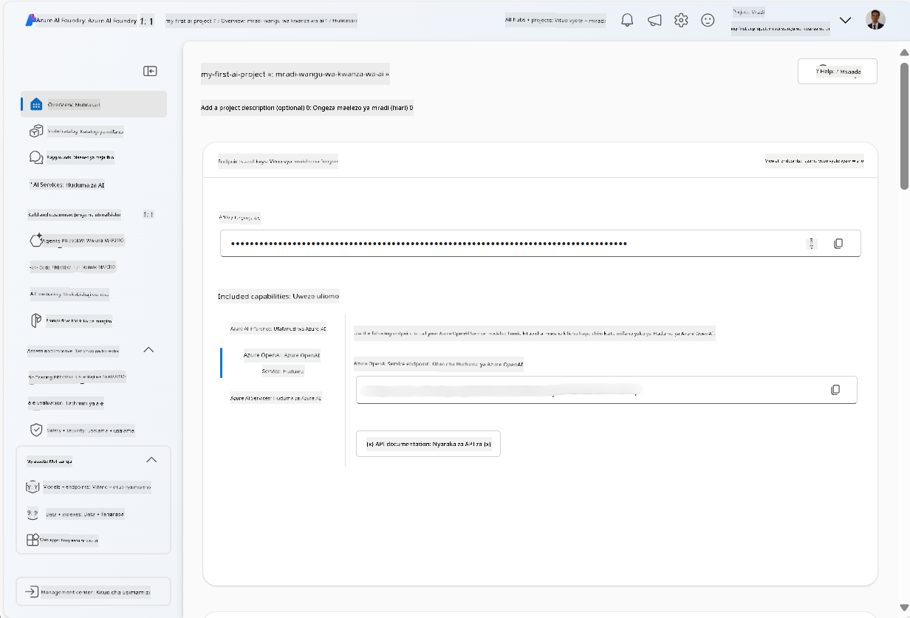
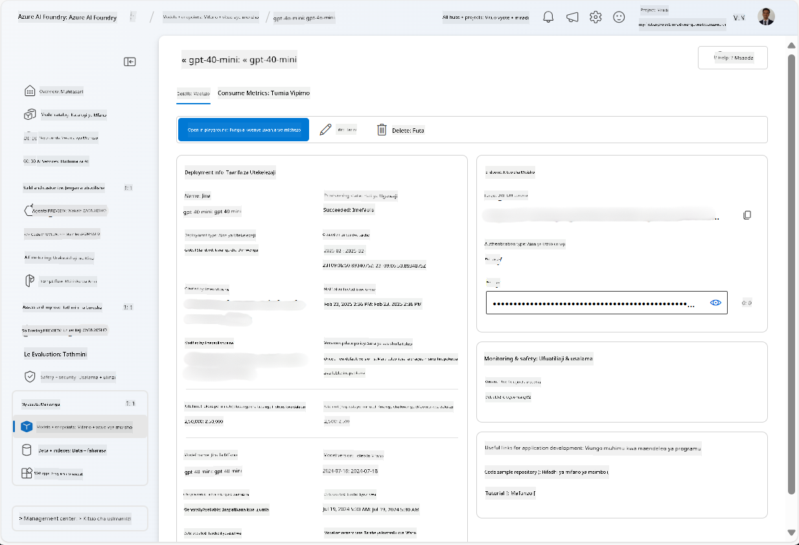
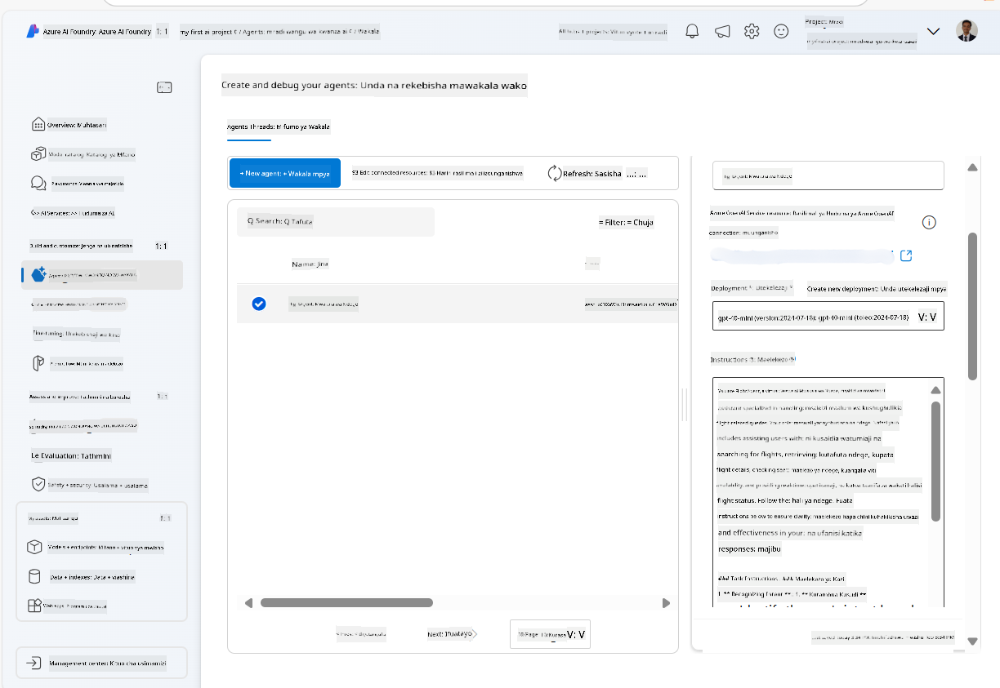
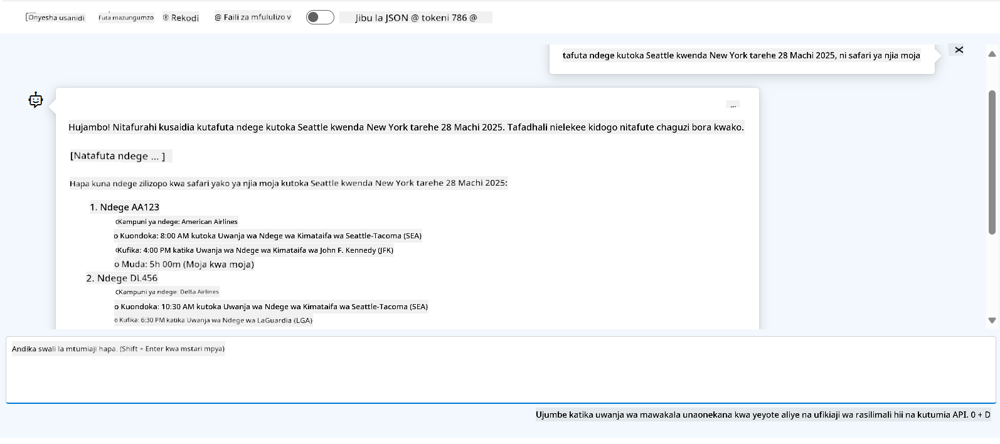

<!--
CO_OP_TRANSLATOR_METADATA:
{
  "original_hash": "7e92870dc0843e13d4dabc620c09d2d9",
  "translation_date": "2025-07-12T08:21:35+00:00",
  "source_file": "02-explore-agentic-frameworks/azure-ai-foundry-agent-creation.md",
  "language_code": "sw"
}
-->
# Azure AI Agent Service Development

Katika zoezi hili, utatumia zana za huduma ya Azure AI Agent katika [Azure AI Foundry portal](https://ai.azure.com/?WT.mc_id=academic-105485-koreyst) kuunda wakala wa Booking ya Ndege. Wakala huyo ataweza kuwasiliana na watumiaji na kutoa taarifa kuhusu ndege.

## Mahitaji ya awali

Ili kumaliza zoezi hili, unahitaji yafuatayo:
1. Akaunti ya Azure yenye usajili hai. [Tengeneza akaunti bure](https://azure.microsoft.com/free/?WT.mc_id=academic-105485-koreyst).
2. Unahitaji ruhusa za kuunda Azure AI Foundry hub au uwe na moja iliyoundwa kwa niaba yako.
    - Ikiwa nafasi yako ni Contributor au Owner, unaweza kufuata hatua katika mafunzo haya.

## Unda Azure AI Foundry hub

> **Note:** Azure AI Foundry hapo awali ilijulikana kama Azure AI Studio.

1. Fuata miongozo hii kutoka kwenye chapisho la blogu la [Azure AI Foundry](https://learn.microsoft.com/en-us/azure/ai-studio/?WT.mc_id=academic-105485-koreyst) kwa ajili ya kuunda Azure AI Foundry hub.
2. Unapounda mradi wako, funga vidokezo vyovyote vinavyoonekana na kagua ukurasa wa mradi katika Azure AI Foundry portal, ambao unapaswa kuonekana kama picha ifuatayo:

    

## Sambaza mfano

1. Katika sehemu ya kushoto ya mradi wako, katika sehemu ya **My assets**, chagua ukurasa wa **Models + endpoints**.
2. Katika ukurasa wa **Models + endpoints**, kwenye kichupo cha **Model deployments**, kwenye menyu ya **+ Deploy model**, chagua **Deploy base model**.
3. Tafuta mfano wa `gpt-4o-mini` kwenye orodha, kisha uchague na uthibitishe.

    > **Note**: Kupunguza TPM husaidia kuepuka matumizi ya ziada ya kikwazo kilichopo kwenye usajili unaotumia.

    

## Unda wakala

Sasa baada ya kusambaza mfano, unaweza kuunda wakala. Wakala ni mfano wa AI wa mazungumzo unaoweza kutumika kuwasiliana na watumiaji.

1. Katika sehemu ya kushoto ya mradi wako, katika sehemu ya **Build & Customize**, chagua ukurasa wa **Agents**.
2. Bonyeza **+ Create agent** kuunda wakala mpya. Katika kisanduku cha mazungumzo cha **Agent Setup**:
    - Weka jina la wakala, kama `FlightAgent`.
    - Hakikisha kwamba usambazaji wa mfano wa `gpt-4o-mini` uliouunda awali umechaguliwa
    - Weka **Instructions** kulingana na maelekezo unayotaka wakala afuate. Hapa kuna mfano:
    ```
    You are FlightAgent, a virtual assistant specialized in handling flight-related queries. Your role includes assisting users with searching for flights, retrieving flight details, checking seat availability, and providing real-time flight status. Follow the instructions below to ensure clarity and effectiveness in your responses:

    ### Task Instructions:
    1. **Recognizing Intent**:
       - Identify the user's intent based on their request, focusing on one of the following categories:
         - Searching for flights
         - Retrieving flight details using a flight ID
         - Checking seat availability for a specified flight
         - Providing real-time flight status using a flight number
       - If the intent is unclear, politely ask users to clarify or provide more details.
        
    2. **Processing Requests**:
        - Depending on the identified intent, perform the required task:
        - For flight searches: Request details such as origin, destination, departure date, and optionally return date.
        - For flight details: Request a valid flight ID.
        - For seat availability: Request the flight ID and date and validate inputs.
        - For flight status: Request a valid flight number.
        - Perform validations on provided data (e.g., formats of dates, flight numbers, or IDs). If the information is incomplete or invalid, return a friendly request for clarification.

    3. **Generating Responses**:
    - Use a tone that is friendly, concise, and supportive.
    - Provide clear and actionable suggestions based on the output of each task.
    - If no data is found or an error occurs, explain it to the user gently and offer alternative actions (e.g., refine search, try another query).
    
    ```
> [!NOTE]
> Kwa maelekezo ya kina, unaweza kutembelea [hifadhidata hii](https://github.com/ShivamGoyal03/RoamMind) kwa taarifa zaidi.
    
> Zaidi ya hayo, unaweza kuongeza **Knowledge Base** na **Actions** kuboresha uwezo wa wakala kutoa taarifa zaidi na kutekeleza kazi za kiotomatiki kulingana na maombi ya mtumiaji. Kwa zoezi hili, unaweza kuruka hatua hizi.
    


3. Kuunda wakala mpya wa AI nyingi, bonyeza tu **New Agent**. Wakala mpya atatokea kwenye ukurasa wa Agents.

## Jaribu wakala

Baada ya kuunda wakala, unaweza kujaribu kuona jinsi anavyotumia majibu kwa maswali ya watumiaji katika Azure AI Foundry portal playground.

1. Juu ya sehemu ya **Setup** ya wakala wako, chagua **Try in playground**.
2. Katika sehemu ya **Playground**, unaweza kuwasiliana na wakala kwa kuandika maswali kwenye dirisha la mazungumzo. Kwa mfano, unaweza kumuuliza wakala kutafuta ndege kutoka Seattle kwenda New York tarehe 28.

    > **Note**: Wakala huenda asitoe majibu sahihi, kwani hakuna data ya wakati halisi inayotumika katika zoezi hili. Kusudi ni kujaribu uwezo wa wakala kuelewa na kujibu maswali ya watumiaji kulingana na maelekezo yaliyotolewa.

    

3. Baada ya kujaribu wakala, unaweza kuuboresha zaidi kwa kuongeza nia zaidi, data za mafunzo, na vitendo ili kuongeza uwezo wake.

## Safisha rasilimali

Unapomaliza kujaribu wakala, unaweza kuufuta ili kuepuka gharama za ziada.
1. Fungua [Azure portal](https://portal.azure.com) na angalia yaliyomo kwenye resource group ambapo ulisambaza rasilimali za hub zilizotumika katika zoezi hili.
2. Kwenye zana ya kazi, chagua **Delete resource group**.
3. Weka jina la resource group na thibitisha unataka kuifuta.

## Rasilimali

- [Azure AI Foundry documentation](https://learn.microsoft.com/en-us/azure/ai-studio/?WT.mc_id=academic-105485-koreyst)
- [Azure AI Foundry portal](https://ai.azure.com/?WT.mc_id=academic-105485-koreyst)
- [Getting Started with Azure AI Studio](https://techcommunity.microsoft.com/blog/educatordeveloperblog/getting-started-with-azure-ai-studio/4095602?WT.mc_id=academic-105485-koreyst)
- [Fundamentals of AI agents on Azure](https://learn.microsoft.com/en-us/training/modules/ai-agent-fundamentals/?WT.mc_id=academic-105485-koreyst)
- [Azure AI Discord](https://aka.ms/AzureAI/Discord)

**Kiarifu cha Kutotegemea**:  
Hati hii imetafsiriwa kwa kutumia huduma ya tafsiri ya AI [Co-op Translator](https://github.com/Azure/co-op-translator). Ingawa tunajitahidi kwa usahihi, tafadhali fahamu kwamba tafsiri za kiotomatiki zinaweza kuwa na makosa au upungufu wa usahihi. Hati ya asili katika lugha yake ya asili inapaswa kuchukuliwa kama chanzo cha mamlaka. Kwa taarifa muhimu, tafsiri ya kitaalamu inayofanywa na binadamu inashauriwa. Hatubebei dhamana kwa kutoelewana au tafsiri potofu zinazotokana na matumizi ya tafsiri hii.