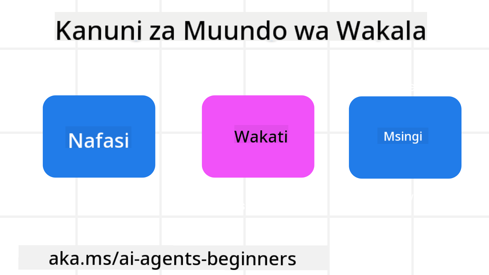

<!--
CO_OP_TRANSLATOR_METADATA:
{
  "original_hash": "4c46e4ff9e349c521e2b0b17f51afa64",
  "translation_date": "2025-08-29T20:00:28+00:00",
  "source_file": "03-agentic-design-patterns/README.md",
  "language_code": "sw"
}
-->

> _(Bofya picha hapo juu kutazama video ya somo hili)_
# Kanuni za Ubunifu wa Mawakala wa AI

## Utangulizi

Kuna njia nyingi za kufikiria kuhusu kujenga Mifumo ya Mawakala wa AI. Kwa kuwa ukosefu wa uwazi ni kipengele na si kasoro katika muundo wa Generative AI, mara nyingine wahandisi hukumbana na changamoto ya kujua wapi pa kuanzia. Tumeunda seti ya Kanuni za Ubunifu wa UX zinazomlenga binadamu ili kuwawezesha watengenezaji kujenga mifumo ya mawakala inayolenga wateja ili kutatua mahitaji yao ya kibiashara. Kanuni hizi za ubunifu si usanifu wa lazima bali ni sehemu ya kuanzia kwa timu zinazofafanua na kujenga uzoefu wa mawakala.

Kwa ujumla, mawakala wanapaswa:

- Kupanua na kuongeza uwezo wa binadamu (kama vile ubunifu wa mawazo, utatuzi wa matatizo, uendeshaji wa kiotomatiki, n.k.)
- Kujaza mapengo ya maarifa (kunipa maarifa ya haraka kuhusu nyanja za maarifa, tafsiri, n.k.)
- Kuwezesha na kusaidia ushirikiano kwa njia tunazopendelea kufanya kazi na wengine
- Kutufanya kuwa matoleo bora ya sisi wenyewe (mfano, kocha wa maisha/msimamizi wa kazi, kutusaidia kujifunza udhibiti wa hisia na ustadi wa utulivu wa akili, kujenga uvumilivu, n.k.)

## Somo Hili Litashughulikia

- Kanuni za Ubunifu wa Mawakala ni nini
- Miongozo ya kufuata wakati wa kutekeleza kanuni hizi za ubunifu
- Mifano ya kutumia kanuni za ubunifu

## Malengo ya Kujifunza

Baada ya kukamilisha somo hili, utaweza:

1. Kuelezea Kanuni za Ubunifu wa Mawakala ni nini
2. Kuelezea miongozo ya kutumia Kanuni za Ubunifu wa Mawakala
3. Kuelewa jinsi ya kujenga wakala kwa kutumia Kanuni za Ubunifu wa Mawakala

## Kanuni za Ubunifu wa Mawakala

### Wakala (Nafasi)

Hii ni mazingira ambayo wakala hufanya kazi. Kanuni hizi zinaelekeza jinsi tunavyobuni mawakala kwa kushiriki katika ulimwengu wa kimwili na wa kidijitali.

- **Kuunganisha, si kubomoa** – kusaidia kuunganisha watu na watu wengine, matukio, na maarifa yanayoweza kutekelezeka ili kuwezesha ushirikiano na muunganiko.
  - Mawakala husaidia kuunganisha matukio, maarifa, na watu.
  - Mawakala huleta watu karibu zaidi. Hawajabuniwa kuchukua nafasi au kudharau watu.
- **Kupatikana kwa urahisi lakini mara nyingine kuwa wasioonekana** – wakala hufanya kazi kwa kiasi kikubwa nyuma ya pazia na hujitokeza tu inapofaa na inafaa.
  - Wakala ni rahisi kupatikana na kugundulika kwa watumiaji waliothibitishwa kwenye kifaa au jukwaa lolote.
  - Wakala huunga mkono pembejeo na matokeo ya njia nyingi (sauti, maandishi, n.k.).
  - Wakala anaweza kubadilika kwa urahisi kati ya mbele na nyuma ya pazia; kati ya hali ya proakti na reakti, kulingana na mahitaji ya mtumiaji.
  - Wakala anaweza kufanya kazi kwa njia isiyoonekana, lakini mchakato wake wa nyuma na ushirikiano na Mawakala wengine ni wazi na unadhibitiwa na mtumiaji.

### Wakala (Wakati)

Hii ni jinsi wakala anavyofanya kazi kwa muda. Kanuni hizi zinaelekeza jinsi tunavyobuni mawakala wanaoshirikiana katika nyakati za zamani, za sasa, na za baadaye.

- **Zamani**: Kutafakari historia inayojumuisha hali na muktadha.
  - Wakala hutoa matokeo yanayofaa zaidi kwa msingi wa uchambuzi wa data ya kihistoria iliyo tajiri zaidi ya tukio, watu, au hali.
  - Wakala huunda miunganisho kutoka kwa matukio ya zamani na kutafakari kwa bidii kumbukumbu ili kushughulikia hali za sasa.
- **Sasa**: Kusukuma zaidi ya kutoa taarifa.
  - Wakala hujumuisha mbinu ya kina ya kushirikiana na watu. Tukio linapotokea, Wakala huenda zaidi ya taarifa ya kawaida au hali nyingine ya kawaida. Wakala anaweza kurahisisha mtiririko au kutoa vidokezo vya nguvu ili kuelekeza umakini wa mtumiaji kwa wakati unaofaa.
  - Wakala hutoa taarifa kulingana na mazingira ya muktadha, mabadiliko ya kijamii na kitamaduni, na yaliyobinafsishwa kwa nia ya mtumiaji.
  - Mwingiliano wa wakala unaweza kuwa wa hatua kwa hatua, ukibadilika/kukua kwa ugumu ili kuwawezesha watumiaji kwa muda mrefu.
- **Baadaye**: Kubadilika na kuendelea.
  - Wakala hubadilika kwa vifaa, majukwaa, na njia mbalimbali.
  - Wakala hubadilika kulingana na tabia ya mtumiaji, mahitaji ya ufikivu, na ni rahisi kubinafsishwa.
  - Wakala huundwa na hubadilika kupitia mwingiliano wa mara kwa mara na mtumiaji.

### Wakala (Msingi)

Haya ni mambo muhimu katika msingi wa muundo wa wakala.

- **Kubali kutokuwa na uhakika lakini jenga uaminifu**.
  - Kiwango fulani cha kutokuwa na uhakika wa Wakala kinatarajiwa. Kutokuwa na uhakika ni kipengele muhimu cha muundo wa wakala.
  - Uaminifu na uwazi ni tabaka za msingi za muundo wa Wakala.
  - Binadamu wana udhibiti wa wakati Wakala yupo/amezimwa na hali ya Wakala inaonekana wazi wakati wote.

## Miongozo ya Kutekeleza Kanuni Hizi

Unapotumia kanuni za ubunifu zilizotangulia, tumia miongozo ifuatayo:

1. **Uwazi**: Mjulishe mtumiaji kwamba AI inahusika, jinsi inavyofanya kazi (ikiwa ni pamoja na vitendo vya zamani), na jinsi ya kutoa maoni na kurekebisha mfumo.
2. **Udhibiti**: Mruhusu mtumiaji kubinafsisha, kubainisha mapendeleo na kubinafsisha, na kuwa na udhibiti wa mfumo na sifa zake (ikiwa ni pamoja na uwezo wa kusahau).
3. **Uthabiti**: Lenga uzoefu thabiti, wa njia nyingi kwenye vifaa na sehemu za mwisho. Tumia vipengele vya UI/UX vilivyozoeleka inapowezekana (mfano, ikoni ya kipaza sauti kwa mwingiliano wa sauti) na punguza mzigo wa kiakili wa mteja kadri inavyowezekana (mfano, lenga majibu mafupi, msaada wa kuona, na maudhui ya ‘Jifunze Zaidi’).

## Jinsi ya Kubuni Wakala wa Kusafiri kwa Kutumia Kanuni na Miongozo Hii

Fikiria unaunda Wakala wa Kusafiri, hapa kuna jinsi unavyoweza kufikiria kutumia Kanuni za Ubunifu na Miongozo:

1. **Uwazi** – Mjulishe mtumiaji kwamba Wakala wa Kusafiri ni Wakala unaotumia AI. Toa maelekezo ya msingi ya jinsi ya kuanza (mfano, ujumbe wa “Habari”, vidokezo vya mfano). Andika wazi hili kwenye ukurasa wa bidhaa. Onyesha orodha ya vidokezo ambavyo mtumiaji ameuliza hapo awali. Eleza wazi jinsi ya kutoa maoni (alama ya juu na chini, kitufe cha Tuma Maoni, n.k.). Eleza wazi ikiwa Wakala ana vizuizi vya matumizi au mada.
2. **Udhibiti** – Hakikisha ni wazi jinsi mtumiaji anavyoweza kurekebisha Wakala baada ya kuundwa na vitu kama System Prompt. Mruhusu mtumiaji kuchagua jinsi Wakala anavyotoa maelezo kwa kina, mtindo wake wa uandishi, na maelezo yoyote ambayo Wakala hapaswi kuzungumzia. Ruhusu mtumiaji kuona na kufuta faili au data yoyote inayohusiana, vidokezo, na mazungumzo ya zamani.
3. **Uthabiti** – Hakikisha ikoni za Shiriki Kidokezo, ongeza faili au picha na tagi mtu au kitu ni za kawaida na zinazotambulika. Tumia ikoni ya kipande cha karatasi kuonyesha kupakia/kushiriki faili na Wakala, na ikoni ya picha kuonyesha kupakia michoro.

### Una Maswali Zaidi Kuhusu Mifumo ya Ubunifu wa Mawakala wa AI?

Jiunge na [Azure AI Foundry Discord](https://aka.ms/ai-agents/discord) ili kukutana na wanafunzi wengine, kuhudhuria saa za ofisi na kupata majibu ya maswali yako kuhusu Mawakala wa AI.

## Rasilimali za Ziada

## Somo Lililopita

[Kuchunguza Mifumo ya Mawakala](../02-explore-agentic-frameworks/README.md)

## Somo Lijalo

[Muundo wa Matumizi ya Zana](../04-tool-use/README.md)

---

**Kanusho**:  
Hati hii imetafsiriwa kwa kutumia huduma ya kutafsiri ya AI [Co-op Translator](https://github.com/Azure/co-op-translator). Ingawa tunajitahidi kuhakikisha usahihi, tafadhali fahamu kuwa tafsiri za kiotomatiki zinaweza kuwa na makosa au kutokuwa sahihi. Hati ya asili katika lugha yake ya awali inapaswa kuzingatiwa kama chanzo cha mamlaka. Kwa taarifa muhimu, tafsiri ya kitaalamu ya binadamu inapendekezwa. Hatutawajibika kwa kutoelewana au tafsiri zisizo sahihi zinazotokana na matumizi ya tafsiri hii.