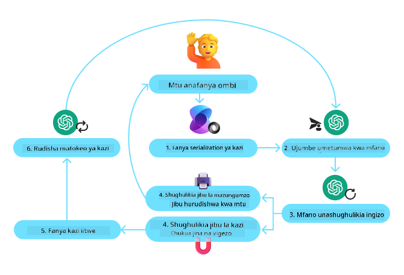
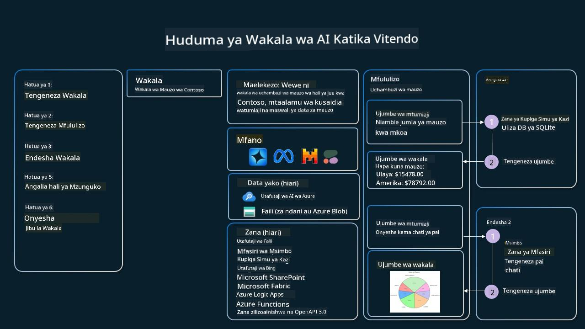

<!--
CO_OP_TRANSLATOR_METADATA:
{
  "original_hash": "88258b03f2893aa2e69eb8fb24baabbc",
  "translation_date": "2025-07-12T09:41:00+00:00",
  "source_file": "04-tool-use/README.md",
  "language_code": "sw"
}
-->
[](https://youtu.be/vieRiPRx-gI?si=cEZ8ApnT6Sus9rhn)

> _(Bonyeza picha hapo juu kutazama video ya somo hili)_

# Mfano wa Ubunifu wa Matumizi ya Zana

Zana ni za kuvutia kwa sababu zinawawezesha mawakala wa AI kuwa na uwezo mpana zaidi. Badala ya wakala kuwa na seti ndogo ya vitendo anavyoweza kufanya, kwa kuongeza zana, wakala sasa anaweza kufanya vitendo vingi zaidi. Katika sura hii, tutaangalia Mfano wa Ubunifu wa Matumizi ya Zana, unaoelezea jinsi mawakala wa AI wanavyoweza kutumia zana maalum kufikia malengo yao.

## Utangulizi

Katika somo hili, tunatafuta kujibu maswali yafuatayo:

- Mfano wa ubunifu wa matumizi ya zana ni nini?
- Ni matumizi gani yanayofaa kwa mfano huu?
- Ni vipengele/vipande gani vinavyohitajika kutekeleza mfano huu wa ubunifu?
- Ni mambo gani maalum yanayopaswa kuzingatiwa wakati wa kutumia Mfano wa Ubunifu wa Matumizi ya Zana kujenga mawakala wa AI wa kuaminika?

## Malengo ya Kujifunza

Baada ya kumaliza somo hili, utaweza:

- Kuelezea Mfano wa Ubunifu wa Matumizi ya Zana na kusudi lake.
- Kutambua matumizi yanayofaa kwa Mfano wa Ubunifu wa Matumizi ya Zana.
- Kuelewa vipengele muhimu vinavyohitajika kutekeleza mfano huu.
- Kutambua mambo ya kuzingatia kuhakikisha kuaminika kwa mawakala wa AI wanaotumia mfano huu wa ubunifu.

## Mfano wa Ubunifu wa Matumizi ya Zana ni Nini?

**Mfano wa Ubunifu wa Matumizi ya Zana** unalenga kuwapa LLMs uwezo wa kuingiliana na zana za nje ili kufanikisha malengo maalum. Zana ni msimbo unaoweza kutekelezwa na wakala kufanya vitendo. Zana inaweza kuwa kazi rahisi kama kalkuleta, au wito wa API kwa huduma ya mtu wa tatu kama kutafuta bei za hisa au hali ya hewa. Katika muktadha wa mawakala wa AI, zana zimeundwa kutekelezwa na mawakala kama majibu kwa **miito ya kazi inayotokana na mfano**.

## Ni Matumizi Gani Yanayofaa Kwa Mfano Huu?

Mawakala wa AI wanaweza kutumia zana kukamilisha kazi ngumu, kupata taarifa, au kufanya maamuzi. Mfano wa ubunifu wa matumizi ya zana hutumika mara nyingi katika hali zinazohitaji mwingiliano wa moja kwa moja na mifumo ya nje, kama vile hifadhidata, huduma za wavuti, au tafsiri za msimbo. Uwezo huu ni muhimu kwa matumizi mbalimbali ikiwemo:

- **Kupata Taarifa kwa Muda Halisi:** Mawakala wanaweza kuuliza API za nje au hifadhidata kupata data za hivi karibuni (mfano, kuuliza hifadhidata ya SQLite kwa uchambuzi wa data, kupata bei za hisa au taarifa za hali ya hewa).
- **Utekelezaji na Tafsiri ya Msimbo:** Mawakala wanaweza kutekeleza msimbo au skiripti kutatua matatizo ya hisabati, kuandaa ripoti, au kufanya majaribio.
- **Uendeshaji wa Kazi za Kiarifa:** Kuendesha kazi zinazojirudia au zenye hatua nyingi kwa kuunganisha zana kama ratiba za kazi, huduma za barua pepe, au njia za data.
- **Huduma kwa Wateja:** Mawakala wanaweza kuingiliana na mifumo ya CRM, majukwaa ya tiketi, au hifadhidata za maarifa kutatua maswali ya watumiaji.
- **Uundaji na Uhariri wa Maudhui:** Mawakala wanaweza kutumia zana kama wachunguzi wa sarufi, muhtasari wa maandishi, au wakaguzi wa usalama wa maudhui kusaidia kazi za uundaji wa maudhui.

## Ni Vipengele/Vipande Gani Vinavyohitajika Kutekeleza Mfano wa Ubunifu wa Matumizi ya Zana?

Vipande hivi vinamruhusu wakala wa AI kufanya kazi nyingi tofauti. Tuchunguze vipengele muhimu vinavyohitajika kutekeleza Mfano wa Ubunifu wa Matumizi ya Zana:

- **Mifumo ya Kazi/Zana**: Maelezo ya kina ya zana zinazopatikana, ikijumuisha jina la kazi, kusudi, vigezo vinavyohitajika, na matokeo yanayotarajiwa. Mifumo hii inawawezesha LLM kuelewa zana zilizopo na jinsi ya kuunda maombi sahihi.

- **Mantiki ya Utekelezaji wa Kazi**: Inasimamia jinsi na lini zana zinapoitwa kulingana na nia ya mtumiaji na muktadha wa mazungumzo. Hii inaweza kujumuisha moduli za kupanga, mbinu za kuongoza, au mtiririko wa masharti unaoamua matumizi ya zana kwa wakati halisi.

- **Mfumo wa Usimamizi wa Ujumbe**: Vipengele vinavyosimamia mtiririko wa mazungumzo kati ya maingizo ya mtumiaji, majibu ya LLM, miito ya zana, na matokeo ya zana.

- **Mfumo wa Uunganishaji wa Zana**: Miundombinu inayounganisha wakala na zana mbalimbali, iwe ni kazi rahisi au huduma za nje zenye ugumu.

- **Usimamizi wa Makosa na Uthibitishaji**: Mbinu za kushughulikia kushindwa kwa utekelezaji wa zana, kuthibitisha vigezo, na kusimamia majibu yasiyotarajiwa.

- **Usimamizi wa Hali**: Kufuatilia muktadha wa mazungumzo, mwingiliano wa awali na zana, na data endelevu kuhakikisha uthabiti katika mazungumzo yenye mizunguko mingi.

Sasa, tuchunguze kwa undani zaidi Kuitwa kwa Kazi/Zana.

### Kuitwa kwa Kazi/Zana

Kuitwa kwa kazi ni njia kuu tunayowezesha Modeli Kubwa za Lugha (LLMs) kuingiliana na zana. Mara nyingi utaona maneno 'Kazi' na 'Zana' yakitumiwa kwa maana moja kwa maana kwamba 'kazi' (vipande vya msimbo vinavyoweza kutumika tena) ni 'zana' ambazo mawakala hutumia kutekeleza kazi. Ili msimbo wa kazi uitwe, LLM lazima linganishe ombi la mtumiaji na maelezo ya kazi. Hii hufanyika kwa kutuma mfumo wenye maelezo ya kazi zote zinazopatikana kwa LLM. LLM kisha huchagua kazi inayofaa zaidi kwa kazi hiyo na kurudisha jina na hoja zake. Kazi iliyochaguliwa huitwa, jibu lake hurudishwa kwa LLM, ambalo hutumia taarifa hiyo kujibu ombi la mtumiaji.

Kwa waendelezaji kutekeleza kuitwa kwa kazi kwa mawakala, utahitaji:

1. Mfano wa LLM unaounga mkono kuitwa kwa kazi
2. Mfumo wenye maelezo ya kazi
3. Msimbo wa kila kazi iliyobainishwa

Tuchukue mfano wa kupata saa ya sasa katika jiji kufafanua:

1. **Anzisha LLM inayounga mkono kuitwa kwa kazi:**

    Sio modeli zote zinaunga mkono kuitwa kwa kazi, hivyo ni muhimu kuhakikisha LLM unayotumia ina uwezo huo. <a href="https://learn.microsoft.com/azure/ai-services/openai/how-to/function-calling" target="_blank">Azure OpenAI</a> inaunga mkono kuitwa kwa kazi. Tunaweza kuanza kwa kuanzisha mteja wa Azure OpenAI.

    ```python
    # Initialize the Azure OpenAI client
    client = AzureOpenAI(
        azure_endpoint = os.getenv("AZURE_OPENAI_ENDPOINT"), 
        api_key=os.getenv("AZURE_OPENAI_API_KEY"),  
        api_version="2024-05-01-preview"
    )
    ```

1. **Tengeneza Mfumo wa Kazi:**

    Ifuatayo tutaelezea mfumo wa JSON unaojumuisha jina la kazi, maelezo ya kazi hiyo, na majina pamoja na maelezo ya vigezo vya kazi.
    Kisha tutapita mfumo huu kwa mteja tuliyemwanzisha awali, pamoja na ombi la mtumiaji la kupata saa katika San Francisco. Muhimu kuelewa ni kwamba **miito ya zana** ndio inayorudishwa, **sio** jibu la mwisho la swali. Kama ilivyoelezwa awali, LLM hurudisha jina la kazi iliyochaguliwa na hoja zitakazotumika.

    ```python
    # Function description for the model to read
    tools = [
        {
            "type": "function",
            "function": {
                "name": "get_current_time",
                "description": "Get the current time in a given location",
                "parameters": {
                    "type": "object",
                    "properties": {
                        "location": {
                            "type": "string",
                            "description": "The city name, e.g. San Francisco",
                        },
                    },
                    "required": ["location"],
                },
            }
        }
    ]
    ```
   
    ```python
  
    # Initial user message
    messages = [{"role": "user", "content": "What's the current time in San Francisco"}] 
  
    # First API call: Ask the model to use the function
      response = client.chat.completions.create(
          model=deployment_name,
          messages=messages,
          tools=tools,
          tool_choice="auto",
      )
  
      # Process the model's response
      response_message = response.choices[0].message
      messages.append(response_message)
  
      print("Model's response:")  

      print(response_message)
  
    ```

    ```bash
    Model's response:
    ChatCompletionMessage(content=None, role='assistant', function_call=None, tool_calls=[ChatCompletionMessageToolCall(id='call_pOsKdUlqvdyttYB67MOj434b', function=Function(arguments='{"location":"San Francisco"}', name='get_current_time'), type='function')])
    ```
  
1. **Msimbo wa kazi unaohitajika kutekeleza kazi:**

    Sasa LLM imechagua kazi itakayotekelezwa, msimbo unaotekeleza kazi unapaswa kuandikwa na kutekelezwa.
    Tunaweza kutekeleza msimbo wa kupata saa ya sasa kwa Python. Pia tutahitaji kuandika msimbo wa kutoa jina na hoja kutoka kwa response_message kupata matokeo ya mwisho.

    ```python
      def get_current_time(location):
        """Get the current time for a given location"""
        print(f"get_current_time called with location: {location}")  
        location_lower = location.lower()
        
        for key, timezone in TIMEZONE_DATA.items():
            if key in location_lower:
                print(f"Timezone found for {key}")  
                current_time = datetime.now(ZoneInfo(timezone)).strftime("%I:%M %p")
                return json.dumps({
                    "location": location,
                    "current_time": current_time
                })
      
        print(f"No timezone data found for {location_lower}")  
        return json.dumps({"location": location, "current_time": "unknown"})
    ```

    ```python
     # Handle function calls
      if response_message.tool_calls:
          for tool_call in response_message.tool_calls:
              if tool_call.function.name == "get_current_time":
     
                  function_args = json.loads(tool_call.function.arguments)
     
                  time_response = get_current_time(
                      location=function_args.get("location")
                  )
     
                  messages.append({
                      "tool_call_id": tool_call.id,
                      "role": "tool",
                      "name": "get_current_time",
                      "content": time_response,
                  })
      else:
          print("No tool calls were made by the model.")  
  
      # Second API call: Get the final response from the model
      final_response = client.chat.completions.create(
          model=deployment_name,
          messages=messages,
      )
  
      return final_response.choices[0].message.content
     ```

    ```bash
      get_current_time called with location: San Francisco
      Timezone found for san francisco
      The current time in San Francisco is 09:24 AM.
     ```

Kuitwa kwa Kazi ni msingi wa muundo wa matumizi ya zana kwa mawakala wengi, ingawa kutekeleza kutoka mwanzo kunaweza kuwa changamoto wakati mwingine.
Kama tulivyojifunza katika [Somo la 2](../../../02-explore-agentic-frameworks), mifumo ya agentic hutupatia vipande vilivyotengenezwa tayari kutekeleza matumizi ya zana.

## Mifano ya Matumizi ya Zana kwa Mifumo ya Agentic

Hapa kuna mifano ya jinsi unavyoweza kutekeleza Mfano wa Ubunifu wa Matumizi ya Zana kwa kutumia mifumo tofauti ya agentic:

### Semantic Kernel

<a href="https://learn.microsoft.com/azure/ai-services/agents/overview" target="_blank">Semantic Kernel</a> ni mfumo wa AI wa chanzo huria kwa waendelezaji wa .NET, Python, na Java wanaofanya kazi na Modeli Kubwa za Lugha (LLMs). Unarahisisha mchakato wa kuitwa kwa kazi kwa kuelezea kazi zako na vigezo vyake kwa mfano kupitia mchakato unaoitwa <a href="https://learn.microsoft.com/semantic-kernel/concepts/ai-services/chat-completion/function-calling/?pivots=programming-language-python#1-serializing-the-functions" target="_blank">serializing</a>. Pia hushughulikia mawasiliano ya mzunguko kati ya mfano na msimbo wako. Faida nyingine ya kutumia mfumo wa agentic kama Semantic Kernel ni kwamba unakuwezesha kufikia zana zilizojengwa tayari kama <a href="https://github.com/microsoft/semantic-kernel/blob/main/python/samples/getting_started_with_agents/openai_assistant/step4_assistant_tool_file_search.py" target="_blank">Utafutaji Faili</a> na <a href="https://github.com/microsoft/semantic-kernel/blob/main/python/samples/getting_started_with_agents/openai_assistant/step3_assistant_tool_code_interpreter.py" target="_blank">Mfasiri wa Msimbo</a>.

Mchoro ufuatao unaonyesha mchakato wa kuitwa kwa kazi na Semantic Kernel:



Katika Semantic Kernel, kazi/zana huitwa <a href="https://learn.microsoft.com/semantic-kernel/concepts/plugins/?pivots=programming-language-python" target="_blank">Plugins</a>. Tunaweza kubadilisha kazi `get_current_time` tuliyoiona awali kuwa plugin kwa kuibadilisha kuwa darasa lenye kazi ndani yake. Pia tunaweza kuleta dekoreta `kernel_function`, inayochukua maelezo ya kazi. Unapounda kernel na GetCurrentTimePlugin, kernel itafanya serialization ya kazi na vigezo vyake moja kwa moja, ikaunda mfumo wa kutuma kwa LLM katika mchakato.

```python
from semantic_kernel.functions import kernel_function

class GetCurrentTimePlugin:
    async def __init__(self, location):
        self.location = location

    @kernel_function(
        description="Get the current time for a given location"
    )
    def get_current_time(location: str = ""):
        ...

```

```python 
from semantic_kernel import Kernel

# Create the kernel
kernel = Kernel()

# Create the plugin
get_current_time_plugin = GetCurrentTimePlugin(location)

# Add the plugin to the kernel
kernel.add_plugin(get_current_time_plugin)
```
  
### Azure AI Agent Service

<a href="https://learn.microsoft.com/azure/ai-services/agents/overview" target="_blank">Azure AI Agent Service</a> ni mfumo mpya wa agentic ulioundwa kuwasaidia waendelezaji kujenga, kupeleka, na kupanua mawakala wa AI wa ubora wa juu kwa usalama bila kuhitaji kusimamia rasilimali za kompyuta na hifadhi. Ni muhimu hasa kwa matumizi ya biashara kwa kuwa ni huduma inayosimamiwa kikamilifu yenye usalama wa kiwango cha biashara.

Ukilinganisha na kuendeleza moja kwa moja kwa API ya LLM, Azure AI Agent Service inatoa faida kadhaa, ikiwemo:

- Kuitwa kwa zana kiotomatiki – huna haja ya kuchambua miito ya zana, kuitisha zana, na kushughulikia majibu; yote haya hufanyika upande wa seva
- Usimamizi salama wa data – badala ya kusimamia hali ya mazungumzo mwenyewe, unaweza kutegemea threads kuhifadhi taarifa zote unazohitaji
- Zana zilizopo tayari – Zana unazoweza kutumia kuingiliana na vyanzo vyako vya data, kama Bing, Azure AI Search, na Azure Functions.

Zana zinazopatikana katika Azure AI Agent Service zinaweza kugawanywa katika makundi mawili:

1. Zana za Maarifa:
    - <a href="https://learn.microsoft.com/azure/ai-services/agents/how-to/tools/bing-grounding?tabs=python&pivots=overview" target="_blank">Kuweka Msingi na Bing Search</a>
    - <a href="https://learn.microsoft.com/azure/ai-services/agents/how-to/tools/file-search?tabs=python&pivots=overview" target="_blank">Utafutaji Faili</a>
    - <a href="https://learn.microsoft.com/azure/ai-services/agents/how-to/tools/azure-ai-search?tabs=azurecli%2Cpython&pivots=overview-azure-ai-search" target="_blank">Azure AI Search</a>

2. Zana za Vitendo:
    - <a href="https://learn.microsoft.com/azure/ai-services/agents/how-to/tools/function-calling?tabs=python&pivots=overview" target="_blank">Kuitwa kwa Kazi</a>
    - <a href="https://learn.microsoft.com/azure/ai-services/agents/how-to/tools/code-interpreter?tabs=python&pivots=overview" target="_blank">Mfasiri wa Msimbo</a>
    - <a href="https://learn.microsoft.com/azure/ai-services/agents/how-to/tools/openapi-spec?tabs=python&pivots=overview" target="_blank">Zana zilizoainishwa na OpenAI</a>
    - <a href="https://learn.microsoft.com/azure/ai-services/agents/how-to/tools/azure-functions?pivots=overview" target="_blank">Azure Functions</a>

Huduma ya Agent inatuwezesha kutumia zana hizi pamoja kama `toolset`. Pia inatumia `threads` zinazofuatilia historia ya ujumbe kutoka kwa mazungumzo fulani.

Fikiria wewe ni wakala wa mauzo katika kampuni iitwayo Contoso. Unataka kuendeleza wakala wa mazungumzo unaoweza kujibu maswali kuhusu data zako za mauzo.

Picha ifuatayo inaonyesha jinsi unavyoweza kutumia Azure AI Agent Service kuchambua data zako za mauzo:



Ili kutumia zana yoyote ya huduma hii tunaweza kuunda mteja na kufafanua zana au seti ya zana. Kutekeleza hili kwa vitendo tunaweza kutumia msimbo wa Python ufuatao. LLM itakuwa na uwezo wa kuangalia seti ya zana na kuamua kama itatumia kazi iliyoundwa na mtumiaji, `fetch_sales_data_using_sqlite_query`, au Mfasiri wa Msimbo aliyejengwa tayari kulingana na ombi la mtumiaji.

```python 
import os
from azure.ai.projects import AIProjectClient
from azure.identity import DefaultAzureCredential
from fecth_sales_data_functions import fetch_sales_data_using_sqlite_query # fetch_sales_data_using_sqlite_query function which can be found in a fetch_sales_data_functions.py file.
from azure.ai.projects.models import ToolSet, FunctionTool, CodeInterpreterTool

project_client = AIProjectClient.from_connection_string(
    credential=DefaultAzureCredential(),
    conn_str=os.environ["PROJECT_CONNECTION_STRING"],
)

# Initialize function calling agent with the fetch_sales_data_using_sqlite_query function and adding it to the toolset
fetch_data_function = FunctionTool(fetch_sales_data_using_sqlite_query)
toolset = ToolSet()
toolset.add(fetch_data_function)

# Initialize Code Interpreter tool and adding it to the toolset. 
code_interpreter = code_interpreter = CodeInterpreterTool()
toolset = ToolSet()
toolset.add(code_interpreter)

agent = project_client.agents.create_agent(
    model="gpt-4o-mini", name="my-agent", instructions="You are helpful agent", 
    toolset=toolset
)
```

## Ni Mambo Gani Maalum Yanayopaswa Kuzingatiwa Wakati wa Kutumia Mfano wa Ubunifu wa Matumizi ya Zana Kujenga Mawakala wa AI wa Kuaminika?

Shaka ya kawaida kuhusu SQL inayotengenezwa kwa nguvu na LLM ni usalama, hasa hatari ya sindano ya SQL au vitendo vya uovu, kama kufuta au kuharibu hifadhidata. Ingawa hofu hizi ni halali, zinaweza kupunguzwa kwa ufanisi kwa kusanidi vibali vya upatikanaji wa hifadhidata ipasavyo. Kwa hifadhidata nyingi, hii inahusisha kusanidi hifadhidata kuwa ya kusoma tu. Kwa huduma za hifadhidata kama PostgreSQL au Azure SQL, programu inapaswa kupewa jukumu la kusoma tu (SELECT).

Kukimbia programu katika mazingira salama kunaboresha zaidi ulinzi. Katika mazingira ya biashara, data kawaida hutolewa na kubadilishwa kutoka mifumo ya uendeshaji hadi hifadhidata au ghala la data la kusoma tu lenye mfumo rahisi kwa mtumiaji. Njia hii inahakikisha data iko salama, imeboreshwa kwa utendaji na upatikanaji, na programu ina upatikanaji wa kusoma tu uliodhibitiwa.

## Rasilimali Zaidi

-

Azure AI Agents Service Workshop</a>
- <a href="https://github.com/Azure-Samples/contoso-creative-writer/tree/main/docs/workshop" target="_blank">Warsha ya Waandishi Wenye Wakala Wengi wa Contoso Creative</a>
- <a href="https://learn.microsoft.com/semantic-kernel/concepts/ai-services/chat-completion/function-calling/?pivots=programming-language-python#1-serializing-the-functions" target="_blank">Mafunzo ya Kupiga Simu za Kazi za Semantic Kernel</a>
- <a href="https://github.com/microsoft/semantic-kernel/blob/main/python/samples/getting_started_with_agents/openai_assistant/step3_assistant_tool_code_interpreter.py" target="_blank">Mfasiri wa Msimbo wa Semantic Kernel</a>
- <a href="https://microsoft.github.io/autogen/dev/user-guide/core-user-guide/components/tools.html" target="_blank">Vifaa vya Autogen</a>

## Somo Lililopita

[Uelewa wa Mifumo ya Muundo wa Agentic](../03-agentic-design-patterns/README.md)

## Somo Linalofuata

[Agentic RAG](../05-agentic-rag/README.md)

**Kiarifu cha Kutotegemea**:  
Hati hii imetafsiriwa kwa kutumia huduma ya tafsiri ya AI [Co-op Translator](https://github.com/Azure/co-op-translator). Ingawa tunajitahidi kwa usahihi, tafadhali fahamu kwamba tafsiri za kiotomatiki zinaweza kuwa na makosa au upungufu wa usahihi. Hati ya asili katika lugha yake ya asili inapaswa kuchukuliwa kama chanzo cha mamlaka. Kwa taarifa muhimu, tafsiri ya kitaalamu inayofanywa na binadamu inapendekezwa. Hatubebei dhamana kwa kutoelewana au tafsiri potofu zinazotokana na matumizi ya tafsiri hii.