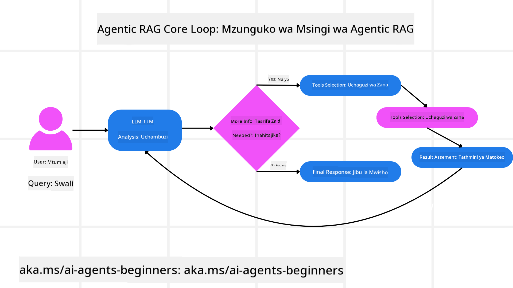
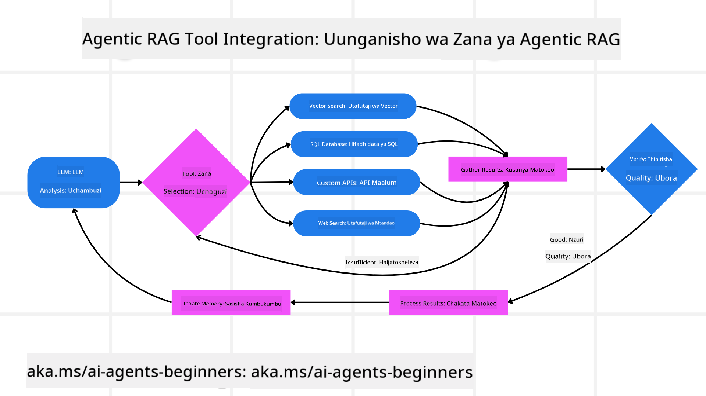
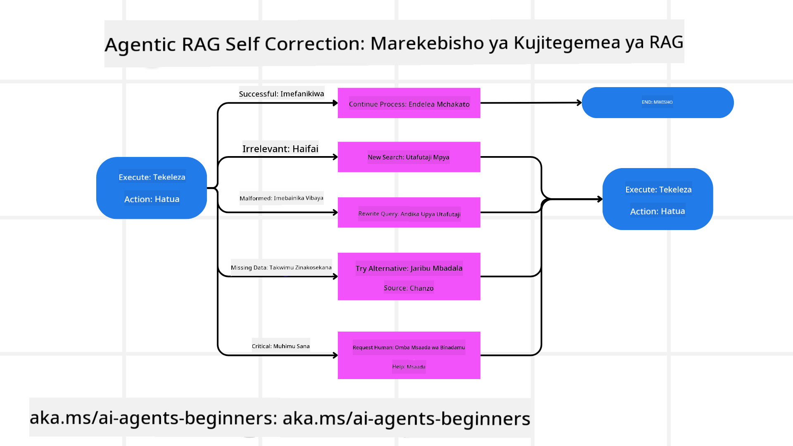
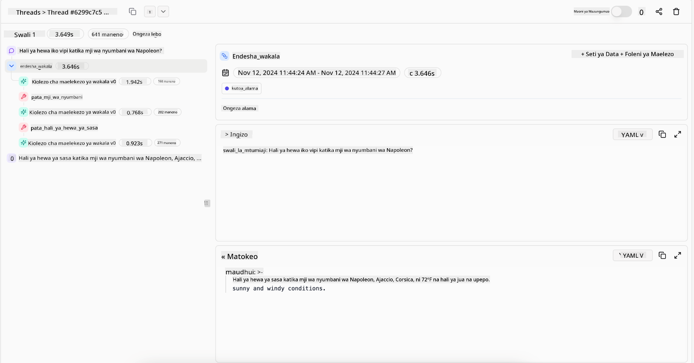
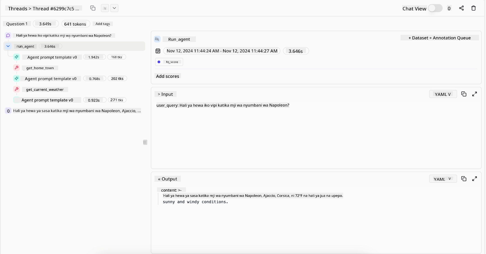

<!--
CO_OP_TRANSLATOR_METADATA:
{
  "original_hash": "7622aa72f9e676e593339f5f694ecd7d",
  "translation_date": "2025-07-12T10:09:51+00:00",
  "source_file": "05-agentic-rag/README.md",
  "language_code": "sw"
}
-->

> _(Bonyeza picha hapo juu kutazama video ya somo hili)_

# Agentic RAG

Somo hili linatoa muhtasari kamili wa Agentic Retrieval-Augmented Generation (Agentic RAG), mtindo mpya wa AI ambapo mifano mikubwa ya lugha (LLMs) huandaa hatua zao zinazofuata kwa uhuru huku wakivuta taarifa kutoka vyanzo vya nje. Tofauti na mifumo ya kawaida ya kupata kisha kusoma, Agentic RAG huhusisha mwendelezo wa miito kwa LLM, ikichanganywa na miito ya zana au kazi pamoja na matokeo yaliyopangwa. Mfumo huu hutathmini matokeo, kuboresha maswali, kuitisha zana zaidi inapohitajika, na kuendelea mzunguko huu hadi suluhisho linaloridhisha lifanikishwe.

## Utangulizi

Somo hili litashughulikia

- **Kuelewa Agentic RAG:** Jifunze kuhusu mtindo mpya wa AI ambapo mifano mikubwa ya lugha (LLMs) huandaa hatua zao zinazofuata kwa uhuru huku wakivuta taarifa kutoka vyanzo vya data vya nje.
- **Kufahamu Mtindo wa Iterative Maker-Checker:** Elewa mzunguko wa miito ya kurudi-rudi kwa LLM, ikichanganywa na miito za zana au kazi pamoja na matokeo yaliyopangwa, yaliyoundwa kuboresha usahihi na kushughulikia maswali yaliyopotoshwa.
- **Kuchunguza Matumizi Halisi:** Tambua hali ambapo Agentic RAG huonyesha ubora, kama katika mazingira yanayoweka usahihi kipaumbele, mwingiliano mgumu wa hifadhidata, na michakato mirefu ya kazi.

## Malengo ya Kujifunza

Baada ya kumaliza somo hili, utajua jinsi ya/kuelewa:

- **Kuelewa Agentic RAG:** Jifunze kuhusu mtindo mpya wa AI ambapo mifano mikubwa ya lugha (LLMs) huandaa hatua zao zinazofuata kwa uhuru huku wakivuta taarifa kutoka vyanzo vya data vya nje.
- **Mtindo wa Iterative Maker-Checker:** Fahamu dhana ya mzunguko wa miito ya kurudi-rudi kwa LLM, ikichanganywa na miito za zana au kazi pamoja na matokeo yaliyopangwa, yaliyoundwa kuboresha usahihi na kushughulikia maswali yaliyopotoshwa.
- **Kumiliki Mchakato wa Ufafanuzi:** Elewa uwezo wa mfumo kumiliki mchakato wake wa kufikiri, kufanya maamuzi juu ya jinsi ya kushughulikia matatizo bila kutegemea njia zilizopangwa awali.
- **Mchakato wa Kazi:** Fahamu jinsi mfano wa agentic unavyoamua peke yake kupata ripoti za mwenendo wa soko, kubaini data za washindani, kuoanisha vipimo vya mauzo ya ndani, kuunganisha matokeo, na kutathmini mkakati.
- **Mizunguko ya Kurudi-Rudi, Uunganishaji wa Zana, na Kumbukumbu:** Jifunze kuhusu utegemezi wa mfumo kwa muundo wa mwingiliano wa mzunguko, kudumisha hali na kumbukumbu katika hatua mbalimbali ili kuepuka mizunguko ya kurudia na kufanya maamuzi yenye ufahamu.
- **Kushughulikia Aina za Kushindwa na Kujirekebisha:** Chunguza mbinu thabiti za kujirekebisha za mfumo, ikiwa ni pamoja na kurudia na kuuliza tena, kutumia zana za uchunguzi, na kutegemea usimamizi wa binadamu.
- **Mipaka ya Uwakilishi:** Elewa vikwazo vya Agentic RAG, ikizingatia uhuru wa eneo maalum, utegemezi wa miundombinu, na kuheshimu mipaka ya usalama.
- **Matumizi Halisi na Thamani:** Tambua hali ambapo Agentic RAG huonyesha ubora, kama katika mazingira yanayoweka usahihi kipaumbele, mwingiliano mgumu wa hifadhidata, na michakato mirefu ya kazi.
- **Uendeshaji, Uwajibikaji, na Uaminifu:** Jifunze umuhimu wa uendeshaji na uwazi, ikiwa ni pamoja na ufafanuzi wa maamuzi, udhibiti wa upendeleo, na usimamizi wa binadamu.

## Agentic RAG ni Nini?

Agentic Retrieval-Augmented Generation (Agentic RAG) ni mtindo mpya wa AI ambapo mifano mikubwa ya lugha (LLMs) huandaa hatua zao zinazofuata kwa uhuru huku wakivuta taarifa kutoka vyanzo vya nje. Tofauti na mifumo ya kawaida ya kupata kisha kusoma, Agentic RAG huhusisha mwendelezo wa miito kwa LLM, ikichanganywa na miito ya zana au kazi pamoja na matokeo yaliyopangwa. Mfumo huu hutathmini matokeo, kuboresha maswali, kuitisha zana zaidi inapohitajika, na kuendelea mzunguko huu hadi suluhisho linaloridhisha lifanikishwe. Mtindo huu wa “maker-checker” unaorudiwa huboresha usahihi, kushughulikia maswali yaliyopotoshwa, na kuhakikisha matokeo bora.

Mfumo huu unamiliki mchakato wake wa kufikiri, kuandika upya maswali yaliyoshindwa, kuchagua mbinu tofauti za kupata taarifa, na kuunganisha zana nyingi—kama vile utafutaji wa vector katika Azure AI Search, hifadhidata za SQL, au API maalum—kabla ya kumaliza jibu lake. Sifa ya kipekee ya mfumo wa agentic ni uwezo wake wa kumiliki mchakato wake wa kufikiri. Matumizi ya RAG ya kawaida hutegemea njia zilizopangwa awali, lakini mfumo wa agentic huamua kwa uhuru mfuatano wa hatua kulingana na ubora wa taarifa anazopata.

## Kufafanua Agentic Retrieval-Augmented Generation (Agentic RAG)

Agentic Retrieval-Augmented Generation (Agentic RAG) ni mtindo mpya katika maendeleo ya AI ambapo LLMs si tu huvuta taarifa kutoka vyanzo vya data vya nje bali pia huandaa hatua zao zinazofuata kwa uhuru. Tofauti na mifumo ya kawaida ya kupata kisha kusoma au mfuatano wa maagizo yaliyopangwa kwa makini, Agentic RAG huhusisha mzunguko wa miito ya kurudi-rudi kwa LLM, ikichanganywa na miito za zana au kazi pamoja na matokeo yaliyopangwa. Kila mara, mfumo hutathmini matokeo aliyopata, kuamua kama kuboresha maswali, kuitisha zana zaidi inapohitajika, na kuendelea mzunguko huu hadi kufanikisha suluhisho linaloridhisha.

Mtindo huu wa “maker-checker” unaorudiwa umeundwa kuboresha usahihi, kushughulikia maswali yaliyopotoshwa kwa hifadhidata zilizopangwa (mfano NL2SQL), na kuhakikisha matokeo yenye usawa na ubora wa juu. Badala ya kutegemea mnyororo wa maagizo yaliyoundwa kwa makini, mfumo unamiliki mchakato wake wa kufikiri. Unaweza kuandika upya maswali yaliyoshindwa, kuchagua mbinu tofauti za kupata taarifa, na kuunganisha zana nyingi—kama vile utafutaji wa vector katika Azure AI Search, hifadhidata za SQL, au API maalum—kabla ya kumaliza jibu lake. Hii huondoa haja ya mifumo tata ya upangaji. Badala yake, mzunguko rahisi wa “miito ya LLM → matumizi ya zana → miito ya LLM → …” unaweza kutoa matokeo ya hali ya juu na yenye msingi mzuri.

## Kumiliki Mchakato wa Ufafanuzi

Sifa ya kipekee inayofanya mfumo kuwa “agentic” ni uwezo wake wa kumiliki mchakato wake wa kufikiri. Matumizi ya RAG ya kawaida mara nyingi hutegemea binadamu kupanga njia kwa mfano: mnyororo wa mawazo unaoelezea nini cha kupata na lini.
Lakini mfumo ukiwa kweli agentic, huamua ndani yake jinsi ya kushughulikia tatizo. Sio tu kutekeleza maandishi; huamua kwa uhuru mfuatano wa hatua kulingana na ubora wa taarifa anazopata.
Kwa mfano, ikiwa utaombwa kuunda mkakati wa uzinduzi wa bidhaa, hautegemei tu maandishi yanayoelezea mchakato mzima wa utafiti na maamuzi. Badala yake, mfano wa agentic huamua peke yake:

1. Kupata ripoti za mwenendo wa soko wa sasa kwa kutumia Bing Web Grounding
2. Kubaini data muhimu za washindani kwa kutumia Azure AI Search.
3. Kuoanisha vipimo vya mauzo ya ndani vya kihistoria kwa kutumia Azure SQL Database.
4. Kuunganisha matokeo kuwa mkakati mmoja unaoratibiwa kupitia Azure OpenAI Service.
5. Kutathmini mkakati kwa mapungufu au kutokubaliana, na kuamsha mzunguko mwingine wa upatikanaji ikiwa ni lazima.
Hatua zote hizi—kuboresha maswali, kuchagua vyanzo, kurudia hadi “kuridhika” na jibu—huamuliwa na mfano, si maandishi yaliyopangwa na binadamu.

## Mizunguko ya Kurudi-Rudi, Uunganishaji wa Zana, na Kumbukumbu

Mfumo wa agentic hutegemea muundo wa mwingiliano wa mzunguko:

- **Mwito wa Awali:** Lengo la mtumiaji (yaani, maelekezo ya mtumiaji) huwasilishwa kwa LLM.
- **Kuitisha Zana:** Ikiwa mfano unatambua taarifa zinazokosekana au maelekezo yasiyoeleweka, huchagua zana au mbinu ya upatikanaji—kama swali la hifadhidata ya vector (mfano Azure AI Search Hybrid juu ya data binafsi) au mwito wa SQL uliopangwa—kukusanya muktadha zaidi.
- **Tathmini na Kuboresha:** Baada ya kupitia data iliyorejeshwa, mfano huamua kama taarifa ni za kutosha. Ikiwa si hivyo, huboresha swali, kujaribu zana tofauti, au kubadilisha mbinu yake.
- **Rudia Hadi Kuridhika:** Mzunguko huu unaendelea hadi mfano uamue kuwa na uwazi na ushahidi wa kutosha kutoa jibu la mwisho lenye mantiki.
- **Kumbukumbu na Hali:** Kwa kuwa mfumo hudumisha hali na kumbukumbu katika hatua mbalimbali, unaweza kukumbuka majaribio ya awali na matokeo yake, kuepuka mizunguko ya kurudia na kufanya maamuzi yenye ufahamu zaidi anapoendelea.

Kwa muda, hii huunda hisia ya uelewa unaoendelea, ikimruhusu mfano kuendesha kazi ngumu zenye hatua nyingi bila kuhitaji binadamu kuingilia kati mara kwa mara au kubadilisha maelekezo.

## Kushughulikia Aina za Kushindwa na Kujirekebisha

Uhuru wa Agentic RAG pia unahusisha mbinu thabiti za kujirekebisha. Wakati mfumo unakutana na vikwazo—kama kupata nyaraka zisizohusiana au maswali yaliyopotoshwa—unaweza:

- **Kurudia na Kuuliza Tena:** Badala ya kutoa majibu ya thamani ndogo, mfano hujaribu mbinu mpya za utafutaji, kuandika upya maswali ya hifadhidata, au kuangalia seti nyingine za data.
- **Kutumia Zana za Uchunguzi:** Mfumo unaweza kuitisha kazi za ziada zilizoundwa kusaidia kutatua hatua zake za kufikiri au kuthibitisha usahihi wa data iliyopatikana. Zana kama Azure AI Tracing zitakuwa muhimu kuwezesha ufuatiliaji thabiti na uangalizi.
- **Kutegemea Usimamizi wa Binadamu:** Kwa hali zenye hatari kubwa au zinazoshindwa mara kwa mara, mfano unaweza kuonyesha kutokuwa na uhakika na kuomba mwongozo wa binadamu. Mara binadamu atakapotoa maoni ya marekebisho, mfano unaweza kujifunza kutoka somo hilo kwa siku zijazo.

Mbinu hii ya kurudia na yenye mabadiliko inaruhusu mfano kuboresha kwa kuendelea, kuhakikisha si mfumo wa mara moja tu bali unaojifunza kutokana na makosa yake wakati wa kikao fulani.

## Mipaka ya Uwakilishi

Licha ya uhuru wake ndani ya kazi, Agentic RAG si sawa na Akili ya Jumla ya Bandia (AGI). Uwezo wake wa “agentic” unahusishwa na zana, vyanzo vya data, na sera zinazotolewa na waendelezaji binadamu. Hawawezi kubuni zana zao wenyewe au kutoka nje ya mipaka ya eneo iliyowekwa. Badala yake, hujivunia kuandaa rasilimali zilizopo kwa njia ya mabadiliko.
Tofauti kuu na aina za AI zilizoendelea ni:

1. **Uhuru wa Eneo Maalum:** Mifumo ya Agentic RAG inalenga kufanikisha malengo yaliyowekwa na mtumiaji ndani ya eneo linalojulikana, ikitumia mikakati kama kuandika upya maswali au kuchagua zana kuboresha matokeo.
2. **Utegemezi wa Miundombinu:** Uwezo wa mfumo unategemea zana na data zilizounganishwa na waendelezaji. Hawawezi kuvuka mipaka hii bila kuingilia kati kwa binadamu.
3. **Heshima kwa Mipaka ya Usalama:** Miongozo ya maadili, sheria za uzingatiaji, na sera za biashara ni muhimu sana. Uhuru wa wakala daima unazuiliwa na hatua za usalama na mifumo ya usimamizi (kwa matumaini?)

## Matumizi Halisi na Thamani

Agentic RAG huangaza katika hali zinazohitaji kuboresha kwa mzunguko na usahihi:

1. **Mazingira Yanayoweka Usahihi Kipaumbele:** Katika ukaguzi wa uzingatiaji, uchambuzi wa kanuni, au utafiti wa kisheria, mfano wa agentic unaweza kuthibitisha ukweli mara kwa mara, kushauriana na vyanzo vingi, na kuandika upya maswali hadi apate jibu lililokaguliwa kikamilifu.
2. **Mwingiliano Mgumu wa Hifadhidata:** Wakati wa kushughulikia data iliyopangwa ambapo maswali mara nyingi yanaweza kushindwa au kuhitaji marekebisho, mfumo unaweza kuboresha maswali yake kwa uhuru kwa kutumia Azure SQL au Microsoft Fabric OneLake, kuhakikisha upatikanaji wa mwisho unalingana na nia ya mtumiaji.
3. **Michakato Mirefu ya Kazi:** Vikao virefu vinaweza kubadilika kadri taarifa mpya zinavyojitokeza. Agentic RAG inaweza kuendelea kuingiza data mpya, kubadilisha mikakati anapoendelea kujifunza zaidi kuhusu tatizo.

## Uendeshaji, Uwajibikaji, na Uaminifu

Mifumo hii inapoendelea kuwa huru zaidi katika kufikiri, uendeshaji na uwazi ni muhimu:

- **Ufafanuzi wa Maamuzi:** Mfano unaweza kutoa rekodi ya maswali aliyoyafanya, vyanzo alivyotembelea, na hatua za kufikiri alizochukua kufikia hitimisho lake. Zana kama Azure AI Content Safety na Azure AI Tracing / GenAIOps zinaweza kusaidia kudumisha uwazi na kupunguza hatari.
- **Udhibiti wa Upendeleo na Upatikanaji wa Data Sawia:** Waendelezaji wanaweza kurekebisha mikakati ya upatikanaji kuhakikisha vyanzo vya data vinavyowakilisha kwa usawa vinazingatiwa, na kufanya ukaguzi wa mara kwa mara wa matokeo kugundua upendeleo au mifumo isiyo sawa kwa kutumia mifano maalum kwa mashirika ya sayansi ya data ya hali ya juu yanayotumia Azure Machine Learning.
- **Usimamizi wa Binadamu na Uzingatiaji:** Kwa kazi nyeti, ukaguzi wa binadamu unabaki muhimu. Agentic RAG haisaidii kuondoa maamuzi ya binadamu katika maamuzi yenye hatari kubwa—badala yake huongeza kwa kutoa chaguzi zilizokaguliwa kwa kina zaidi.

Kuwa na zana zinazotoa rekodi wazi ya hatua ni muhimu. Bila hizo, kutatua matatizo ya mchakato wenye hatua nyingi kunaweza kuwa vigumu sana. Angalia mfano ufuatao kutoka Literal AI (kampuni nyuma ya Chainlit) kwa Agent run:

## Hitimisho

Agentic RAG inawakilisha mabadiliko ya asili katika jinsi mifumo ya AI inavyoshughulikia kazi ngumu, zenye data nyingi. Kwa kutumia muundo wa mwingiliano wa mzunguko, kuchagua zana kwa uhuru, na kuboresha maswali hadi kufanikisha matokeo bora, mfumo unavuka utegemezi wa maagizo ya kawaida na kuwa mtengenezaji maamuzi mwenye uelewa wa muktadha na uwezo wa kubadilika. Ingawa bado umefungwa na miundombinu na miongozo ya maadili iliyowekwa na binadamu, uwezo huu wa agentic unaruhusu mwingiliano wa AI wenye utajiri zaidi, wenye mabadiliko, na hatimaye wenye manufaa zaidi kwa mashirika na watumiaji wa mwisho.

## Rasilimali Zaidi

- <a href="https://learn.microsoft.com/training/modules/use-own-data-azure-openai" target="_blank">Tekeleza Retrieval Augmented Generation (RAG) na Azure OpenAI Service: Jifunze jinsi ya kutumia data yako mwenyewe na Azure OpenAI Service. Moduli hii ya Microsoft Learn inatoa mwongozo kamili wa kutekeleza RAG

- <a href="https://learn.microsoft.com/azure/ai-studio/concepts/evaluation-approach-gen-ai" target="_blank">Tathmini ya programu za AI za kizazi na Azure AI Foundry: Makala hii inashughulikia tathmini na kulinganisha mifano kwa kutumia seti za data zinazopatikana hadharani, ikiwa ni pamoja na programu za Agentic AI na miundo ya RAG</a>
- <a href="https://weaviate.io/blog/what-is-agentic-rag" target="_blank">Agentic RAG ni Nini | Weaviate</a>
- <a href="https://ragaboutit.com/agentic-rag-a-complete-guide-to-agent-based-retrieval-augmented-generation/" target="_blank">Agentic RAG: Mwongozo Kamili wa Uzalishaji ulioboreshwa kwa kutumia Wakala – Habari kutoka generation RAG</a>
- <a href="https://huggingface.co/learn/cookbook/agent_rag" target="_blank">Agentic RAG: boresha RAG yako kwa kurekebisha maswali na kujijiuliza mwenyewe! Kitabu cha Mapishi cha AI cha Chanzo Huria cha Hugging Face</a>
- <a href="https://youtu.be/aQ4yQXeB1Ss?si=2HUqBzHoeB5tR04U" target="_blank">Kuongeza Tabaka za Agentic kwenye RAG</a>
- <a href="https://www.youtube.com/watch?v=zeAyuLc_f3Q&t=244s" target="_blank">Mustakabali wa Msaidizi wa Maarifa: Jerry Liu</a>
- <a href="https://www.youtube.com/watch?v=AOSjiXP1jmQ" target="_blank">Jinsi ya Kujenga Mifumo ya Agentic RAG</a>
- <a href="https://ignite.microsoft.com/sessions/BRK102?source=sessions" target="_blank">Kutumia Huduma ya Wakala ya Azure AI Foundry kuongeza wingi wa mawakala wako wa AI</a>

### Makala za Kitaaluma

- <a href="https://arxiv.org/abs/2303.17651" target="_blank">2303.17651 Self-Refine: Uboreshaji wa Mara kwa Mara kwa Kujiripoti</a>
- <a href="https://arxiv.org/abs/2303.11366" target="_blank">2303.11366 Reflexion: Wakala wa Lugha wenye Mafunzo ya Kuimarisha kwa Maneno</a>
- <a href="https://arxiv.org/abs/2305.11738" target="_blank">2305.11738 CRITIC: Mifano Mikubwa ya Lugha Inaweza Kujirekebisha kwa Kupitia Ukosoaji wa Kifaa</a>
- <a href="https://arxiv.org/abs/2501.09136" target="_blank">2501.09136 Agentic Retrieval-Augmented Generation: Utafiti juu ya Agentic RAG</a>

## Somo lililopita

[Tool Use Design Pattern](../04-tool-use/README.md)

## Somo lijalo

[Building Trustworthy AI Agents](../06-building-trustworthy-agents/README.md)

**Kiarifu cha Kutotegemea**:  
Hati hii imetafsiriwa kwa kutumia huduma ya tafsiri ya AI [Co-op Translator](https://github.com/Azure/co-op-translator). Ingawa tunajitahidi kwa usahihi, tafadhali fahamu kwamba tafsiri za kiotomatiki zinaweza kuwa na makosa au upungufu wa usahihi. Hati ya asili katika lugha yake ya asili inapaswa kuchukuliwa kama chanzo cha mamlaka. Kwa taarifa muhimu, tafsiri ya kitaalamu inayofanywa na binadamu inapendekezwa. Hatubebei dhamana kwa kutoelewana au tafsiri potofu zinazotokana na matumizi ya tafsiri hii.