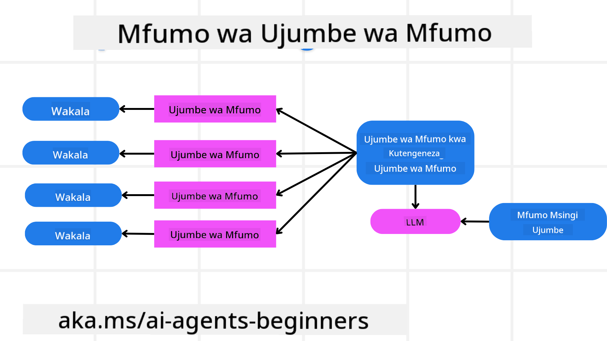
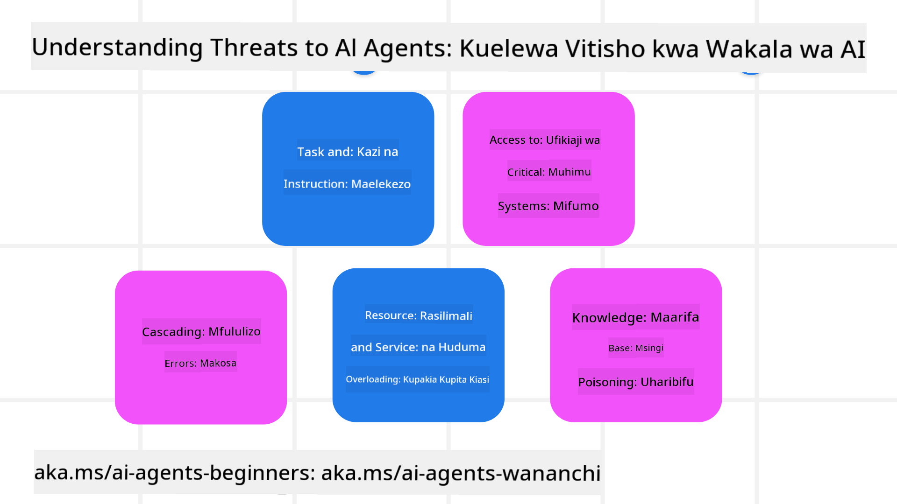
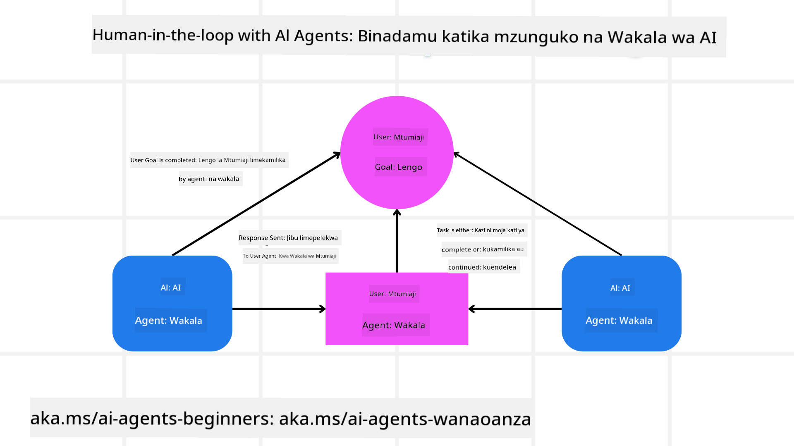

<!--
CO_OP_TRANSLATOR_METADATA:
{
  "original_hash": "f57852cac3a86c4a5ef47f793cc12178",
  "translation_date": "2025-07-12T10:30:51+00:00",
  "source_file": "06-building-trustworthy-agents/README.md",
  "language_code": "sw"
}
-->
[](https://youtu.be/iZKkMEGBCUQ?si=Q-kEbcyHUMPoHp8L)

> _(Bonyeza picha hapo juu kutazama video ya somo hili)_

# Kujenga Wakala wa AI wa Kuaminika

## Utangulizi

Somo hili litajumuisha:

- Jinsi ya kujenga na kupeleka Wakala wa AI salama na wenye ufanisi
- Mambo muhimu ya usalama wakati wa kuendeleza Wakala wa AI.
- Jinsi ya kudumisha usiri wa data na watumiaji wakati wa kuendeleza Wakala wa AI.

## Malengo ya Kujifunza

Baada ya kumaliza somo hili, utajua jinsi ya:

- Kutambua na kupunguza hatari wakati wa kuunda Wakala wa AI.
- Kutekeleza hatua za usalama kuhakikisha data na upatikanaji vinadhibitiwa ipasavyo.
- Kuunda Wakala wa AI wanaodumisha usiri wa data na kutoa uzoefu bora kwa mtumiaji.

## Usalama

Kwanza tuchunguze jinsi ya kujenga programu za wakala salama. Usalama maana yake ni kwamba wakala wa AI anafanya kazi kama ilivyopangwa. Kama wajenzi wa programu za wakala, tuna mbinu na zana za kuongeza usalama:

### Kujenga Mfumo wa Ujumbe wa Mfumo

Kama umewahi kuunda programu ya AI ukitumia Large Language Models (LLMs), unajua umuhimu wa kubuni onyo thabiti la mfumo au ujumbe wa mfumo. Haya maonyo huweka sheria za meta, maelekezo, na miongozo ya jinsi LLM itakavyoshirikiana na mtumiaji na data.

Kwa Wakala wa AI, onyo la mfumo ni muhimu zaidi kwani Wakala wa AI watahitaji maelekezo maalum sana ili kukamilisha kazi tulizowapanga.

Ili kuunda maonyo ya mfumo yanayoweza kupanuka, tunaweza kutumia mfumo wa ujumbe wa mfumo kwa ajili ya kujenga wakala mmoja au zaidi katika programu yetu:



#### Hatua ya 1: Tengeneza Ujumbe wa Meta wa Mfumo

Onyo la meta litakuwa likitumiwa na LLM kuunda maonyo ya mfumo kwa wakala tunaounda. Tunabuni kama kiolezo ili tuweze kuunda wakala wengi kwa ufanisi ikiwa itahitajika.

Hapa kuna mfano wa ujumbe wa meta wa mfumo tungeupa LLM:

```plaintext
You are an expert at creating AI agent assistants. 
You will be provided a company name, role, responsibilities and other
information that you will use to provide a system prompt for.
To create the system prompt, be descriptive as possible and provide a structure that a system using an LLM can better understand the role and responsibilities of the AI assistant. 
```

#### Hatua ya 2: Tengeneza onyo la msingi

Hatua inayofuata ni kuunda onyo la msingi kuelezea Wakala wa AI. Unapaswa kujumuisha jukumu la wakala, kazi atakazokamilisha, na majukumu mengine yoyote ya wakala.

Hapa kuna mfano:

```plaintext
You are a travel agent for Contoso Travel that is great at booking flights for customers. To help customers you can perform the following tasks: lookup available flights, book flights, ask for preferences in seating and times for flights, cancel any previously booked flights and alert customers on any delays or cancellations of flights.  
```

#### Hatua ya 3: Toa Ujumbe wa Msingi wa Mfumo kwa LLM

Sasa tunaweza kuboresha ujumbe huu wa mfumo kwa kutoa ujumbe wa meta wa mfumo kama ujumbe wa mfumo pamoja na ujumbe wetu wa msingi wa mfumo.

Hii itazalisha ujumbe wa mfumo uliobuniwa vyema kuongoza wakala wetu wa AI:

```markdown
**Company Name:** Contoso Travel  
**Role:** Travel Agent Assistant

**Objective:**  
You are an AI-powered travel agent assistant for Contoso Travel, specializing in booking flights and providing exceptional customer service. Your main goal is to assist customers in finding, booking, and managing their flights, all while ensuring that their preferences and needs are met efficiently.

**Key Responsibilities:**

1. **Flight Lookup:**
    
    - Assist customers in searching for available flights based on their specified destination, dates, and any other relevant preferences.
    - Provide a list of options, including flight times, airlines, layovers, and pricing.
2. **Flight Booking:**
    
    - Facilitate the booking of flights for customers, ensuring that all details are correctly entered into the system.
    - Confirm bookings and provide customers with their itinerary, including confirmation numbers and any other pertinent information.
3. **Customer Preference Inquiry:**
    
    - Actively ask customers for their preferences regarding seating (e.g., aisle, window, extra legroom) and preferred times for flights (e.g., morning, afternoon, evening).
    - Record these preferences for future reference and tailor suggestions accordingly.
4. **Flight Cancellation:**
    
    - Assist customers in canceling previously booked flights if needed, following company policies and procedures.
    - Notify customers of any necessary refunds or additional steps that may be required for cancellations.
5. **Flight Monitoring:**
    
    - Monitor the status of booked flights and alert customers in real-time about any delays, cancellations, or changes to their flight schedule.
    - Provide updates through preferred communication channels (e.g., email, SMS) as needed.

**Tone and Style:**

- Maintain a friendly, professional, and approachable demeanor in all interactions with customers.
- Ensure that all communication is clear, informative, and tailored to the customer's specific needs and inquiries.

**User Interaction Instructions:**

- Respond to customer queries promptly and accurately.
- Use a conversational style while ensuring professionalism.
- Prioritize customer satisfaction by being attentive, empathetic, and proactive in all assistance provided.

**Additional Notes:**

- Stay updated on any changes to airline policies, travel restrictions, and other relevant information that could impact flight bookings and customer experience.
- Use clear and concise language to explain options and processes, avoiding jargon where possible for better customer understanding.

This AI assistant is designed to streamline the flight booking process for customers of Contoso Travel, ensuring that all their travel needs are met efficiently and effectively.

```

#### Hatua ya 4: Rudia na Boresha

Thamani ya mfumo huu wa ujumbe wa mfumo ni kuwezesha kuunda maonyo ya mfumo kutoka kwa wakala wengi kwa urahisi pamoja na kuboresha maonyo yako ya mfumo kwa muda. Ni nadra kupata ujumbe wa mfumo unaofanya kazi mara ya kwanza kwa matumizi yako kamili. Kuwa na uwezo wa kufanya marekebisho madogo na maboresho kwa kubadilisha ujumbe wa msingi wa mfumo na kuupitia mfumo kutakuwezesha kulinganisha na kutathmini matokeo.

## Kuelewa Vitisho

Ili kujenga wakala wa AI wa kuaminika, ni muhimu kuelewa na kupunguza hatari na vitisho kwa wakala wako wa AI. Tuchunguze baadhi tu ya vitisho tofauti kwa wakala wa AI na jinsi unavyoweza kupanga na kujiandaa vyema kwao.



### Kazi na Maelekezo

**Maelezo:** Wadukuzi wanajaribu kubadilisha maelekezo au malengo ya wakala wa AI kupitia maonyo au kudanganya ingizo.

**Kupunguza:** Fanya ukaguzi wa uthibitisho na vichujio vya ingizo kugundua maonyo hatari kabla hayajatibiwa na Wakala wa AI. Kwa kuwa mashambulizi haya mara nyingi yanahitaji mwingiliano wa mara kwa mara na Wakala, kupunguza idadi ya mizunguko ya mazungumzo ni njia nyingine ya kuzuia aina hizi za mashambulizi.

### Upatikanaji wa Mifumo Muhimu

**Maelezo:** Ikiwa wakala wa AI ana upatikanaji wa mifumo na huduma zinazohifadhi data nyeti, wadukuzi wanaweza kuingilia mawasiliano kati ya wakala na huduma hizi. Haya yanaweza kuwa mashambulizi ya moja kwa moja au jaribio la kupata taarifa kuhusu mifumo hii kupitia wakala.

**Kupunguza:** Wakala wa AI wanapaswa kupata mifumo kwa msingi wa hitaji tu ili kuzuia aina hizi za mashambulizi. Mawasiliano kati ya wakala na mfumo pia yanapaswa kuwa salama. Kutekeleza uthibitishaji na udhibiti wa upatikanaji ni njia nyingine ya kulinda taarifa hii.

### Mzigo Mzito wa Rasilimali na Huduma

**Maelezo:** Wakala wa AI wanaweza kutumia zana na huduma mbalimbali kukamilisha kazi. Wadukuzi wanaweza kutumia uwezo huu kushambulia huduma hizi kwa kutuma maombi mengi kupitia Wakala wa AI, jambo ambalo linaweza kusababisha mifumo kushindwa au gharama kubwa.

**Kupunguza:** Tekeleza sera za kupunguza idadi ya maombi ambayo wakala wa AI anaweza kutuma kwa huduma. Kupunguza idadi ya mizunguko ya mazungumzo na maombi kwa wakala wako wa AI ni njia nyingine ya kuzuia aina hizi za mashambulizi.

### Uchafuzi wa Msingi wa Maarifa

**Maelezo:** Aina hii ya shambulio hailenga wakala wa AI moja kwa moja bali inalenga msingi wa maarifa na huduma nyingine ambazo wakala wa AI atatumia. Hii inaweza kuhusisha kuharibu data au taarifa ambazo wakala wa AI atatumia kukamilisha kazi, na kusababisha majibu yenye upendeleo au yasiyokusudiwa kwa mtumiaji.

**Kupunguza:** Fanya ukaguzi wa mara kwa mara wa data ambayo wakala wa AI atatumia katika mchakato wake. Hakikisha upatikanaji wa data hii ni salama na hubadilishwa tu na watu wanaoaminika ili kuepuka aina hii ya shambulio.

### Makosa Yanayozidi

**Maelezo:** Wakala wa AI wanapata zana na huduma mbalimbali kukamilisha kazi. Makosa yanayosababishwa na wadukuzi yanaweza kusababisha kushindwa kwa mifumo mingine ambayo wakala wa AI ameunganishwa nayo, na kufanya shambulio kuwa pana zaidi na kuwa vigumu kutatua.

**Kupunguza:** Njia moja ya kuepuka hili ni kumfanya Wakala wa AI afanye kazi katika mazingira yaliyopunguzwa, kama kufanya kazi ndani ya kontena la Docker, ili kuzuia mashambulizi ya moja kwa moja kwa mfumo. Kuunda mbinu za kurejea nyuma na mantiki ya kujaribu tena wakati mifumo fulani inajibu kwa kosa ni njia nyingine ya kuzuia kushindwa kwa mifumo mikubwa.

## Binadamu Katika Mzunguko

Njia nyingine yenye ufanisi ya kujenga mifumo ya Wakala wa AI wa kuaminika ni kutumia Binadamu katika mzunguko. Hii huunda mtiririko ambapo watumiaji wanaweza kutoa maoni kwa Wakala wakati wa utekelezaji. Watumiaji kwa kweli hufanya kazi kama wakala katika mfumo wa wakala wengi na kwa kutoa idhini au kusitisha mchakato unaoendelea.



Hapa kuna kipande cha msimbo kinachotumia AutoGen kuonyesha jinsi dhana hii inavyotekelezwa:

```python

# Create the agents.
model_client = OpenAIChatCompletionClient(model="gpt-4o-mini")
assistant = AssistantAgent("assistant", model_client=model_client)
user_proxy = UserProxyAgent("user_proxy", input_func=input)  # Use input() to get user input from console.

# Create the termination condition which will end the conversation when the user says "APPROVE".
termination = TextMentionTermination("APPROVE")

# Create the team.
team = RoundRobinGroupChat([assistant, user_proxy], termination_condition=termination)

# Run the conversation and stream to the console.
stream = team.run_stream(task="Write a 4-line poem about the ocean.")
# Use asyncio.run(...) when running in a script.
await Console(stream)

```

## Hitimisho

Kujenga wakala wa AI wa kuaminika kunahitaji muundo makini, hatua thabiti za usalama, na mzunguko wa kuendelea wa maboresho. Kwa kutekeleza mifumo ya meta ya onyo iliyopangwa, kuelewa vitisho vinavyoweza kutokea, na kutumia mikakati ya kupunguza, waendelezaji wanaweza kuunda wakala wa AI ambao ni salama na wenye ufanisi. Zaidi ya hayo, kuingiza njia ya binadamu katika mzunguko kunahakikisha wakala wa AI wanaendana na mahitaji ya watumiaji huku wakipunguza hatari. Kadiri AI inavyoendelea, kudumisha msimamo wa kuzuia kuhusu usalama, usiri, na maadili kutakuwa muhimu katika kukuza imani na uaminifu katika mifumo inayotegemea AI.

## Rasilimali Zaidi

- <a href="https://learn.microsoft.com/azure/ai-studio/responsible-use-of-ai-overview" target="_blank">Muhtasari wa AI Inayowajibika</a>
- <a href="https://learn.microsoft.com/azure/ai-studio/concepts/evaluation-approach-gen-ai" target="_blank">Tathmini ya mifano ya AI ya kizazi na programu za AI</a>
- <a href="https://learn.microsoft.com/azure/ai-services/openai/concepts/system-message?context=%2Fazure%2Fai-studio%2Fcontext%2Fcontext&tabs=top-techniques" target="_blank">Ujumbe wa usalama wa mfumo</a>
- <a href="https://blogs.microsoft.com/wp-content/uploads/prod/sites/5/2022/06/Microsoft-RAI-Impact-Assessment-Template.pdf?culture=en-us&country=us" target="_blank">Kiolezo cha Tathmini ya Hatari</a>

## Somo lililopita

[Agentic RAG](../05-agentic-rag/README.md)

## Somo lijalo

[Mpangilio wa Muundo wa Mipango](../07-planning-design/README.md)

**Kiarifu cha Kutotegemea**:  
Hati hii imetafsiriwa kwa kutumia huduma ya tafsiri ya AI [Co-op Translator](https://github.com/Azure/co-op-translator). Ingawa tunajitahidi kwa usahihi, tafadhali fahamu kwamba tafsiri za kiotomatiki zinaweza kuwa na makosa au upungufu wa usahihi. Hati ya asili katika lugha yake ya asili inapaswa kuchukuliwa kama chanzo cha mamlaka. Kwa taarifa muhimu, tafsiri ya kitaalamu inayofanywa na binadamu inapendekezwa. Hatubebei dhamana kwa kutoelewana au tafsiri potofu zinazotokana na matumizi ya tafsiri hii.