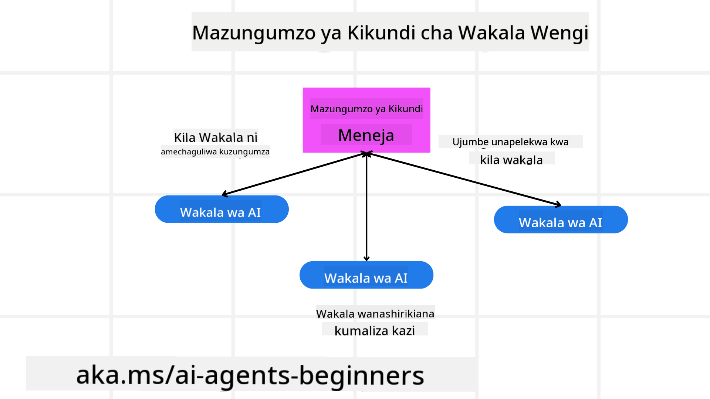
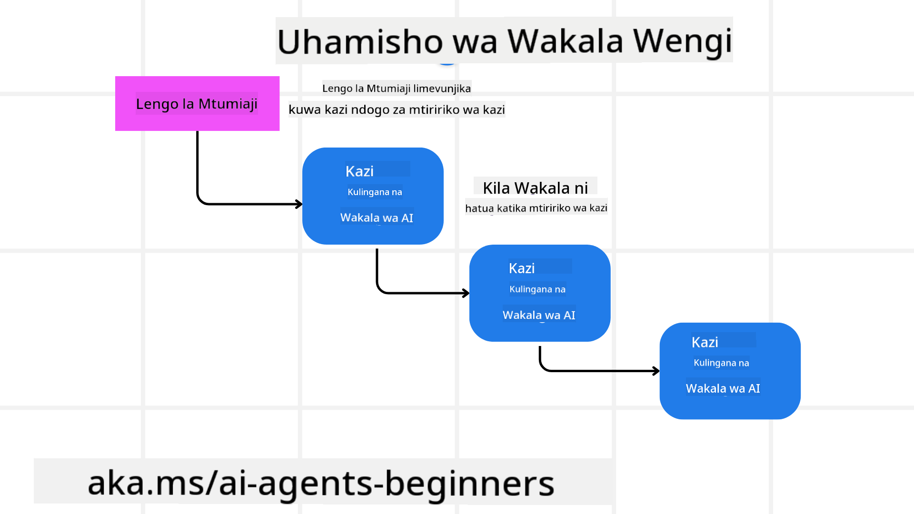
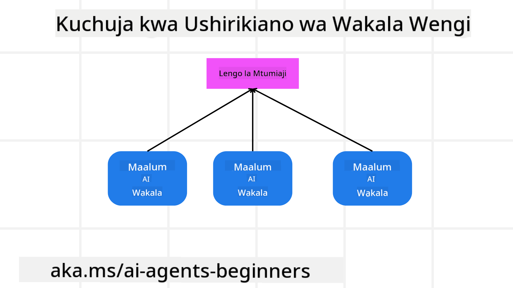

<!--
CO_OP_TRANSLATOR_METADATA:
{
  "original_hash": "c692a8975d7d5b99575a553de1c5e8a7",
  "translation_date": "2025-07-12T11:22:15+00:00",
  "source_file": "08-multi-agent/README.md",
  "language_code": "sw"
}
-->

> _(Bonyeza picha hapo juu kutazama video ya somo hili)_

# Mifumo ya muundo wa mawakala wengi

Mara tu unapoanza kufanya kazi kwenye mradi unaohusisha mawakala wengi, utahitaji kuzingatia muundo wa mawakala wengi. Hata hivyo, huenda si mara moja kueleweka lini kubadili kuwa mawakala wengi na faida zake ni zipi.

## Utangulizi

Katika somo hili, tunatafuta kujibu maswali yafuatayo:

- Ni hali gani ambapo mawakala wengi yanatumika?
- Ni faida gani za kutumia mawakala wengi badala ya wakala mmoja anayefanya kazi nyingi?
- Ni vipengele gani vya msingi vya kutekeleza muundo wa mawakala wengi?
- Tunawezaje kuona jinsi mawakala wengi wanavyoshirikiana?

## Malengo ya Kujifunza

Baada ya somo hili, unapaswa kuwa na uwezo wa:

- Kutambua hali ambapo mawakala wengi yanatumika
- Kutambua faida za kutumia mawakala wengi badala ya wakala mmoja.
- Kuelewa vipengele vya msingi vya kutekeleza muundo wa mawakala wengi.

Picha kubwa ni ipi?

*Mawakala wengi ni muundo wa kubuni unaowezesha mawakala wengi kufanya kazi pamoja kufikia lengo moja.*

Muundo huu unatumika sana katika nyanja mbalimbali, ikiwa ni pamoja na roboti, mifumo huru, na kompyuta zilizosambazwa.

## Hali Ambapo Mawakala Wengi Yanatumika

Je, ni hali gani nzuri za kutumia mawakala wengi? Jibu ni kwamba kuna hali nyingi ambapo kutumia mawakala wengi ni faida hasa katika hali zifuatazo:

- **Mzigo mkubwa wa kazi**: Mizigo mikubwa ya kazi inaweza kugawanywa kuwa kazi ndogo ndogo na kugawanywa kwa mawakala tofauti, kuruhusu usindikaji sambamba na kukamilika kwa haraka. Mfano wa hili ni kama kazi kubwa ya usindikaji data.
- **Kazi ngumu**: Kazi ngumu, kama mzigo mkubwa wa kazi, zinaweza kugawanywa kuwa kazi ndogo ndogo na kugawanywa kwa mawakala tofauti, kila mmoja akibobea katika sehemu fulani ya kazi. Mfano mzuri ni magari huru ambapo mawakala tofauti hushughulikia urambazaji, kugundua vikwazo, na mawasiliano na magari mengine.
- **Utaalamu tofauti**: Mawakala tofauti wanaweza kuwa na utaalamu tofauti, kuruhusu kushughulikia sehemu tofauti za kazi kwa ufanisi zaidi kuliko wakala mmoja. Mfano mzuri ni sekta ya afya ambapo mawakala wanaweza kusimamia uchunguzi, mipango ya matibabu, na ufuatiliaji wa mgonjwa.

## Faida za Kutumia Mawakala Wengi Badala ya Wakala Mmoja

Mfumo wa wakala mmoja unaweza kufanya kazi vizuri kwa kazi rahisi, lakini kwa kazi ngumu zaidi, kutumia mawakala wengi kunaweza kuleta faida kadhaa:

- **Utaalamu**: Kila wakala anaweza kuwa na utaalamu wa kazi fulani. Kukosekana kwa utaalamu katika wakala mmoja kunamaanisha kuwa wakala huyo anaweza kufanya kila kitu lakini anaweza kuchanganyikiwa anapokumbana na kazi ngumu. Kwa mfano, anaweza kufanya kazi ambayo si bora kwake.
- **Uwezo wa kupanuka**: Ni rahisi kupanua mifumo kwa kuongeza mawakala zaidi badala ya kumlazimisha wakala mmoja.
- **Uvumilivu wa hitilafu**: Ikiwa wakala mmoja atashindwa, wengine wanaweza kuendelea kufanya kazi, kuhakikisha uaminifu wa mfumo.

Tuchukue mfano, tuchukue kupanga safari kwa mtumiaji. Mfumo wa wakala mmoja ungetakiwa kushughulikia kila sehemu ya mchakato wa kupanga safari, kuanzia kutafuta ndege hadi kuhifadhi hoteli na magari ya kukodisha. Ili kufanikisha hili kwa wakala mmoja, wakala huyo angenahitaji zana za kushughulikia kazi zote hizi. Hii inaweza kusababisha mfumo mgumu na mkubwa ambao ni mgumu kudumisha na kupanua. Mfumo wa mawakala wengi, kwa upande mwingine, unaweza kuwa na mawakala tofauti waliobobea katika kutafuta ndege, kuhifadhi hoteli, na magari ya kukodisha. Hii itafanya mfumo kuwa rahisi, rahisi kudumisha, na unaoweza kupanuka.

Linganisheni hii na ofisi ya usafiri inayendeshwa kama duka la familia dhidi ya ofisi ya usafiri inayendeshwa kama tawi la shirika. Duka la familia lingekuwa na wakala mmoja anayeshughulikia kila sehemu ya mchakato wa kupanga safari, wakati tawi la shirika lingekuwa na mawakala tofauti wakishughulikia sehemu tofauti za mchakato huo.

## Vipengele vya Msingi vya Kutekeleza Muundo wa Mawakala Wengi

Kabla hujatekeleza muundo wa mawakala wengi, unahitaji kuelewa vipengele vya msingi vinavyounda muundo huo.

Tufanye hili kuwa halisi kwa kuangalia tena mfano wa kupanga safari kwa mtumiaji. Katika kesi hii, vipengele vya msingi ni pamoja na:

- **Mawasiliano ya Mawakala**: Mawakala wa kutafuta ndege, kuhifadhi hoteli, na magari ya kukodisha wanahitaji kuwasiliana na kushirikiana taarifa kuhusu mapendeleo na vizingiti vya mtumiaji. Unahitaji kuamua itifaki na mbinu za mawasiliano haya. Hii inamaanisha kuwa wakala wa kutafuta ndege anahitaji kuwasiliana na wakala wa kuhifadhi hoteli kuhakikisha hoteli imetengwa kwa tarehe zile zile za ndege. Hii inamaanisha mawakala wanapaswa kushirikiana taarifa kuhusu tarehe za safari za mtumiaji, hivyo unahitaji kuamua *ni mawakala gani yanayoshirikiana taarifa na jinsi wanavyoshirikiana*.
- **Mekanismo za Kuratibu**: Mawakala wanahitaji kuratibu hatua zao kuhakikisha mapendeleo na vizingiti vya mtumiaji vinazingatiwa. Mfano wa mapendeleo ya mtumiaji ni kama wanataka hoteli karibu na uwanja wa ndege wakati kizuizi kinaweza kuwa magari ya kukodisha yanapatikana tu uwanjani. Hii inamaanisha wakala wa kuhifadhi hoteli anahitaji kuratibu na wakala wa magari ya kukodisha kuhakikisha mapendeleo na vizingiti vinazingatiwa. Hii inamaanisha unahitaji kuamua *jinsi mawakala wanavyoratibiana*.
- **Mimari ya Wakala**: Mawakala wanahitaji kuwa na muundo wa ndani wa kufanya maamuzi na kujifunza kutokana na mwingiliano na mtumiaji. Hii inamaanisha wakala wa kutafuta ndege anahitaji kuwa na muundo wa ndani wa kufanya maamuzi kuhusu ndege gani za kupendekeza kwa mtumiaji. Hii inamaanisha unahitaji kuamua *jinsi mawakala wanavyofanya maamuzi na kujifunza kutokana na mwingiliano na mtumiaji*. Mfano wa jinsi wakala anavyojifunza na kuboresha ni kama wakala wa kutafuta ndege kutumia mfano wa kujifunza mashine kupendekeza ndege kulingana na mapendeleo ya mtumiaji yaliyopita.
- **Uwazi wa Mwingiliano wa Mawakala Wengi**: Unahitaji kuwa na uwazi wa jinsi mawakala wengi wanavyoshirikiana. Hii inamaanisha unahitaji zana na mbinu za kufuatilia shughuli na mwingiliano wa mawakala. Hii inaweza kuwa kwa njia ya zana za kurekodi na kufuatilia, zana za kuona picha, na vipimo vya utendaji.
- **Mifumo ya Mawakala Wengi**: Kuna mifumo tofauti ya kutekeleza mifumo ya mawakala wengi, kama vile miundo ya kati, isiyo ya kati, na mchanganyiko. Unahitaji kuamua mfumo unaofaa zaidi kwa matumizi yako.
- **Mtu katika mzunguko**: Katika hali nyingi, utakuwa na mtu katika mzunguko na unahitaji kuelekeza mawakala lini waomba usaidizi wa mtu. Hii inaweza kuwa kwa njia ya mtumiaji kuomba hoteli au ndege maalum ambayo mawakala hawajapendekeza au kuomba uthibitisho kabla ya kuhifadhi ndege au hoteli.

## Uwazi wa Mwingiliano wa Mawakala Wengi

Ni muhimu kuwa na uwazi wa jinsi mawakala wengi wanavyoshirikiana. Uwazi huu ni muhimu kwa ajili ya kutatua matatizo, kuboresha, na kuhakikisha ufanisi wa mfumo mzima. Ili kufanikisha hili, unahitaji zana na mbinu za kufuatilia shughuli na mwingiliano wa mawakala. Hii inaweza kuwa kwa njia ya zana za kurekodi na kufuatilia, zana za kuona picha, na vipimo vya utendaji.

Kwa mfano, katika kesi ya kupanga safari kwa mtumiaji, unaweza kuwa na dashibodi inayoonyesha hali ya kila wakala, mapendeleo na vizingiti vya mtumiaji, na mwingiliano kati ya mawakala. Dashibodi hii inaweza kuonyesha tarehe za safari za mtumiaji, ndege zilizopendekezwa na wakala wa ndege, hoteli zilizopendekezwa na wakala wa hoteli, na magari ya kukodisha yaliyopendekezwa na wakala wa magari. Hii itakupa picha wazi ya jinsi mawakala wanavyoshirikiana na kama mapendeleo na vizingiti vya mtumiaji vinazingatiwa.

Tuchunguze kila kipengele kwa undani zaidi.

- **Zana za Kurekodi na Kufuatilia**: Unataka kurekodi kila hatua inayochukuliwa na wakala. Kuingia kwa logi kunaweza kuhifadhi taarifa kuhusu wakala aliyefanya hatua, hatua iliyochukuliwa, wakati wa hatua, na matokeo ya hatua. Taarifa hizi zinaweza kutumika kutatua matatizo, kuboresha, na zaidi.
- **Zana za Kuonyesha Picha**: Zana za kuona picha zinaweza kusaidia kuona mwingiliano kati ya mawakala kwa njia rahisi kueleweka. Kwa mfano, unaweza kuwa na mchoro unaoonyesha mtiririko wa taarifa kati ya mawakala. Hii inaweza kusaidia kubaini vikwazo, ufanisi mdogo, na matatizo mengine katika mfumo.
- **Vipimo vya Utendaji**: Vipimo vya utendaji vinaweza kusaidia kufuatilia ufanisi wa mfumo wa mawakala wengi. Kwa mfano, unaweza kufuatilia muda unaochukuliwa kukamilisha kazi, idadi ya kazi zilizokamilika kwa wakati fulani, na usahihi wa mapendekezo yaliyotolewa na mawakala. Taarifa hizi zinaweza kusaidia kubaini maeneo ya kuboresha na kuboresha mfumo.

## Mifumo ya Mawakala Wengi

Tuchunguze mifumo halisi tunayotumia kuunda programu za mawakala wengi. Hapa kuna mifumo kadhaa ya kuvutia inayostahili kuzingatiwa:

### Gumzo la kikundi

Mfumo huu ni mzuri unapotaka kuunda programu ya gumzo la kikundi ambapo mawakala wengi wanaweza kuwasiliana. Matumizi ya kawaida ni ushirikiano wa timu, msaada kwa wateja, na mitandao ya kijamii.

Katika mfumo huu, kila wakala anawakilisha mtumiaji katika gumzo la kikundi, na ujumbe hubadilishana kati ya mawakala kwa kutumia itifaki ya ujumbe. Mawakala wanaweza kutuma ujumbe kwa gumzo la kikundi, kupokea ujumbe kutoka kwa gumzo la kikundi, na kujibu ujumbe kutoka kwa mawakala wengine.

Mfumo huu unaweza kutekelezwa kwa kutumia muundo wa kati ambapo ujumbe wote hupitishwa kupitia seva kuu, au muundo usio wa kati ambapo ujumbe hubadilishana moja kwa moja.

### Kuwezesha kazi kuhamishwa

Mfumo huu ni mzuri unapotaka kuunda programu ambapo mawakala wengi wanaweza kuhamishiana kazi.

Matumizi ya kawaida ni msaada kwa wateja, usimamizi wa kazi, na otomatiki ya mtiririko wa kazi.

Katika mfumo huu, kila wakala anawakilisha kazi au hatua katika mtiririko wa kazi, na mawakala wanaweza kuhamishiana kazi kwa mawakala wengine kulingana na sheria zilizowekwa.

### Kuchuja kwa ushirikiano

Mfumo huu ni mzuri unapotaka kuunda programu ambapo mawakala wengi wanaweza kushirikiana kutoa mapendekezo kwa watumiaji.

Sababu ya mawakala wengi kushirikiana ni kwamba kila wakala ana utaalamu tofauti na anaweza kuchangia mchakato wa mapendekezo kwa njia tofauti.

Tuchukue mfano ambapo mtumiaji anataka mapendekezo ya hisa bora ya kununua kwenye soko la hisa.

- **Mtaalamu wa sekta**: Wakala mmoja anaweza kuwa mtaalamu wa sekta fulani.
- **Uchambuzi wa kiufundi**: Wakala mwingine anaweza kuwa mtaalamu wa uchambuzi wa kiufundi.
- **Uchambuzi wa msingi**: na wakala mwingine anaweza kuwa mtaalamu wa uchambuzi wa msingi. Kwa kushirikiana, mawakala hawa wanaweza kutoa mapendekezo kamili zaidi kwa mtumiaji.

## Mfano: Mchakato wa kurejeshewa fedha

Fikiria hali ambapo mteja anajaribu kupata marejesho ya fedha kwa bidhaa, kunaweza kuwa na mawakala wengi wanaohusika katika mchakato huu lakini tugawe kati ya mawakala maalum kwa mchakato huu na mawakala wa jumla wanaoweza kutumika katika michakato mingine.

**Mawakala maalum kwa mchakato wa kurejeshewa fedha**:

Haya ni baadhi ya mawakala yanayoweza kushiriki katika mchakato wa kurejeshewa fedha:

- **Wakala wa mteja**: Wakala huyu anawakilisha mteja na anahusika kuanzisha mchakato wa kurejeshewa fedha.
- **Wakala wa muuzaji**: Wakala huyu anawakilisha muuzaji na anahusika kusindika marejesho ya fedha.
- **Wakala wa malipo**: Wakala huyu anawakilisha mchakato wa malipo na anahusika kurejesha malipo kwa mteja.
- **Wakala wa utatuzi**: Wakala huyu anawakilisha mchakato wa utatuzi na anahusika kutatua matatizo yoyote yanayotokea wakati wa mchakato wa kurejeshewa fedha.
- **Wakala wa ufuataji wa sheria**: Wakala huyu anawakilisha mchakato wa ufuataji wa sheria na anahakikisha mchakato wa kurejeshewa fedha unazingatia kanuni na sera.

**Mawakala wa jumla**:

Mawakala hawa wanaweza kutumika katika sehemu nyingine za biashara yako.

- **Wakala wa usafirishaji**: Wakala huyu anawakilisha mchakato wa usafirishaji na anahusika kusafirisha bidhaa kurudi kwa muuzaji. Wakala huyu anaweza kutumika kwa mchakato wa kurejeshewa fedha na kwa usafirishaji wa jumla wa bidhaa kwa mfano kwa ununuzi.
- **Wakala wa maoni**: Wakala huyu anawakilisha mchakato wa ukusanyaji maoni na anahusika kukusanya maoni kutoka kwa mteja. Maoni yanaweza kukusanywa wakati wowote si tu wakati wa mchakato wa kurejeshewa fedha.
- **Wakala wa kupandisha ngazi**: Wakala huyu anawakilisha mchakato wa kupandisha ngazi na anahusika kupandisha matatizo kwa ngazi ya msaada wa juu zaidi. Unaweza kutumia aina hii ya wakala kwa mchakato wowote unaohitaji kupandisha tatizo.
- **Wakala wa taarifa**: Wakala huyu anawakilisha mchakato wa taarifa na anahusika kutuma taarifa kwa mteja katika hatua mbalimbali za mchakato wa kurejeshewa fedha.
- **Wakala wa uchambuzi**: Wakala huyu anawakilisha mchakato wa uchambuzi na anahusika kuchambua data zinazohusiana na mchakato wa kurejeshewa fedha.
- **Wakala wa ukaguzi**: Wakala huyu anawakilisha mchakato wa ukaguzi na anahusika kukagua mchakato wa kurejeshewa fedha kuhakikisha unafanyika kwa usahihi.
- **Wakala wa ripoti**: Wakala huyu anawakilisha mchakato wa ripoti na anahusika kutengeneza ripoti kuhusu mchakato wa kurejeshewa fedha.
- **Wakala wa maarifa**: Wakala huyu anawakilisha mchakato wa maarifa na anahusika kudumisha hifadhidata ya maarifa inayohusiana na mchakato wa kurejeshewa fedha. Wakala huyu anaweza kuwa na maarifa kuhusu marejesho na sehemu nyingine za biashara yako.
- **Wakala wa usalama**: Wakala huyu anawakilisha mchakato wa usalama na anahakikisha usalama wa mchakato wa kurejeshewa fedha.
- **Wakala wa ubora**: Wakala huyu anawakilisha mchakato wa ubora na anahakikisha ubora wa mchakato wa kurejeshewa fedha.

Kuna mawakala wengi waliotajwa hapo juu, kwa mchakato maalum wa kurejeshewa fedha na pia kwa mawakala wa jumla wanaoweza kutumika sehemu nyingine za biashara yako. Natumai hii inakupa wazo la jinsi unavyoweza kuamua mawakala gani kutumia katika mfumo wako wa mawakala wengi.

## Kazi ya nyumbani
## Somo lililopita

[Mpango wa Ubunifu](../07-planning-design/README.md)

## Somo lijalo

[Metakognition katika Wakala wa AI](../09-metacognition/README.md)

**Kiarifu cha Kutotegemea**:  
Hati hii imetafsiriwa kwa kutumia huduma ya tafsiri ya AI [Co-op Translator](https://github.com/Azure/co-op-translator). Ingawa tunajitahidi kwa usahihi, tafadhali fahamu kuwa tafsiri za kiotomatiki zinaweza kuwa na makosa au upungufu wa usahihi. Hati ya asili katika lugha yake ya asili inapaswa kuchukuliwa kama chanzo cha mamlaka. Kwa taarifa muhimu, tafsiri ya kitaalamu inayofanywa na binadamu inapendekezwa. Hatubebei dhamana kwa kutoelewana au tafsiri potofu zinazotokana na matumizi ya tafsiri hii.