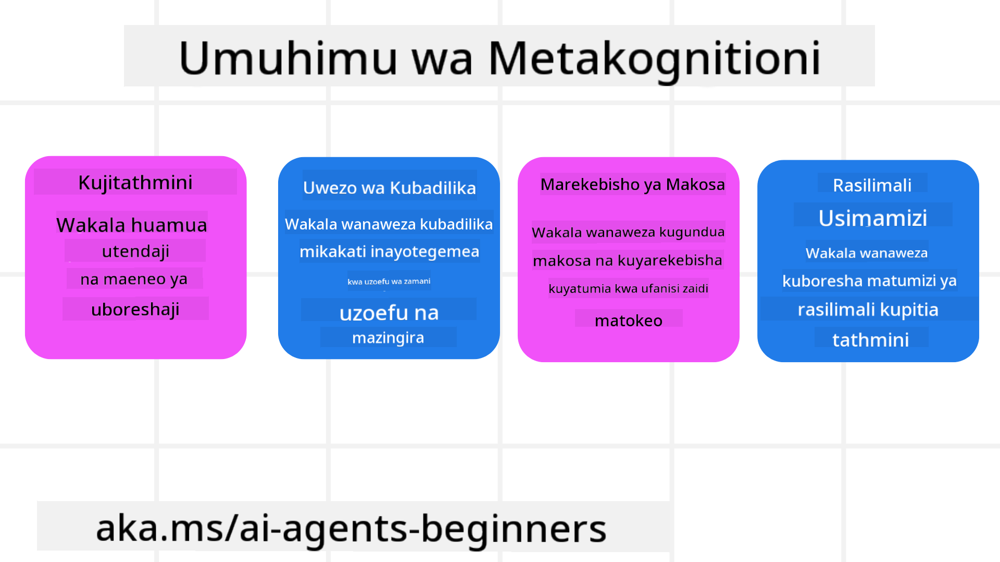
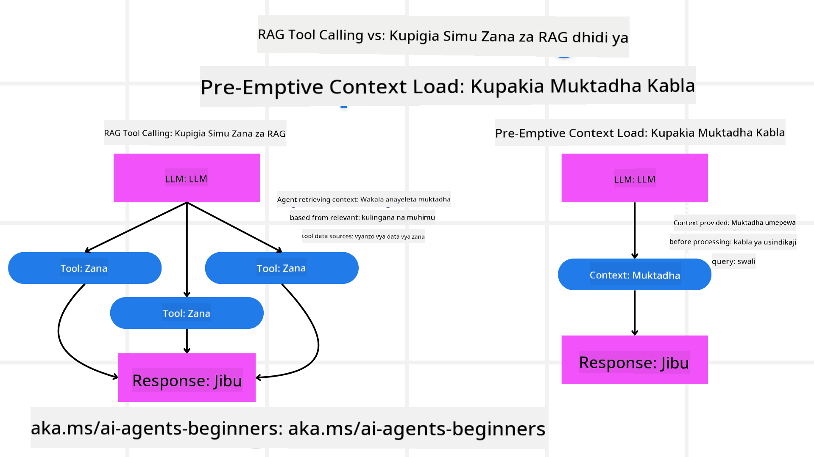

<!--
CO_OP_TRANSLATOR_METADATA:
{
  "original_hash": "8cbf460468c802c7994aa62e0e0779c9",
  "translation_date": "2025-07-12T13:06:46+00:00",
  "source_file": "09-metacognition/README.md",
  "language_code": "sw"
}
-->
[](https://youtu.be/His9R6gw6Ec?si=3_RMb8VprNvdLRhX)

> _(Bonyeza picha hapo juu kutazama video ya somo hili)_
# Metakognisheni katika Wakala wa AI

## Utangulizi

Karibu kwenye somo la metakognisheni katika wakala wa AI! Sura hii imeandaliwa kwa ajili ya wanaoanza ambao wanavutiwa na jinsi wakala wa AI wanavyoweza kufikiria kuhusu michakato yao ya kufikiri. Mwisho wa somo hili, utaelewa dhana muhimu na utakuwa na mifano ya vitendo ya kutumia metakognisheni katika muundo wa wakala wa AI.

## Malengo ya Kujifunza

Baada ya kumaliza somo hili, utaweza:

1. Kuelewa athari za mizunguko ya hoja katika ufafanuzi wa wakala.
2. Kutumia mbinu za upangaji na tathmini kusaidia wakala wanaojirekebisha wenyewe.
3. Kuunda wakala wako mwenye uwezo wa kubadilisha msimbo ili kutekeleza kazi.

## Utangulizi wa Metakognisheni

Metakognisheni inahusu michakato ya juu ya kifikra inayohusisha kufikiria kuhusu kufikiri kwa mtu mwenyewe. Kwa wakala wa AI, hii inamaanisha uwezo wa kutathmini na kurekebisha vitendo vyao kulingana na uelewa wa nafsi na uzoefu wa zamani. Metakognisheni, au "kufikiria kuhusu kufikiri," ni dhana muhimu katika maendeleo ya mifumo ya AI yenye uwezo wa kujitambua. Inahusisha mifumo ya AI kuwa na ufahamu wa michakato yao ya ndani na uwezo wa kufuatilia, kudhibiti, na kubadilisha tabia zao ipasavyo. Kama tunavyofanya tunaposoma hali ya mazingira au tunapotazama tatizo. Uelewa huu wa nafsi unaweza kusaidia mifumo ya AI kufanya maamuzi bora, kubaini makosa, na kuboresha utendaji wao kwa muda — tena ikirudi kwenye jaribio la Turing na mjadala kuhusu kama AI itachukua nafasi.

Katika muktadha wa mifumo ya AI yenye uwezo wa wakala, metakognisheni inaweza kusaidia kushughulikia changamoto kadhaa, kama vile:
- Uwazi: Kuhakikisha mifumo ya AI inaweza kueleza hoja na maamuzi yao.
- Hoja: Kuongeza uwezo wa mifumo ya AI kusintetiza taarifa na kufanya maamuzi sahihi.
- Urekebishaji: Kuruhusu mifumo ya AI kubadilika kwa mazingira mapya na hali zinazo badilika.
- Uelewa: Kuboresha usahihi wa mifumo ya AI katika kutambua na kufasiri data kutoka mazingira yao.

### Metakognisheni ni Nini?

Metakognisheni, au "kufikiria kuhusu kufikiri," ni mchakato wa juu wa kifikra unaojumuisha uelewa wa nafsi na udhibiti wa michakato ya kifikra ya mtu mwenyewe. Katika ulimwengu wa AI, metakognisheni huwapa wakala uwezo wa kutathmini na kubadilisha mikakati na vitendo vyao, na kusababisha uwezo bora wa kutatua matatizo na kufanya maamuzi. Kwa kuelewa metakognisheni, unaweza kubuni wakala wa AI ambao si tu werevu zaidi bali pia wana uwezo wa kubadilika na ufanisi zaidi. Katika metakognisheni halisi, utaona AI ikitoa hoja wazi kuhusu hoja zake mwenyewe.

Mfano: “Nilipa kipaumbele kwa ndege za bei nafuu kwa sababu… huenda nikipoteza ndege za moja kwa moja, hivyo nawarudia kuangalia tena.”  
Kufuata jinsi au kwa nini ilichagua njia fulani.  
- Kurekodi kwamba ilifanya makosa kwa sababu ilitegemea sana mapendeleo ya mtumiaji kutoka mara ya mwisho, hivyo inabadilisha mkakati wake wa kufanya maamuzi, siyo tu pendekezo la mwisho.  
- Kuchambua mifumo kama, “Kila ninapoona mtumiaji akitaja ‘kuna watu wengi sana,’ sihitaji tu kuondoa vivutio fulani bali pia kutafakari kwamba njia yangu ya kuchagua ‘vivutio bora’ ni mbaya ikiwa kila mara ninapanga kwa umaarufu.”

### Umuhimu wa Metakognisheni kwa Wakala wa AI

Metakognisheni ina nafasi muhimu katika muundo wa wakala wa AI kwa sababu kadhaa:



- Kujitathmini: Wakala wanaweza kutathmini utendaji wao na kubaini maeneo ya kuboresha.
- Uwezo wa Kubadilika: Wakala wanaweza kubadilisha mikakati yao kulingana na uzoefu wa zamani na mazingira yanayobadilika.
- Marekebisho ya Makosa: Wakala wanaweza kugundua na kurekebisha makosa kwa kujitegemea, na kusababisha matokeo sahihi zaidi.
- Usimamizi wa Rasilimali: Wakala wanaweza kuboresha matumizi ya rasilimali, kama vile muda na nguvu za kompyuta, kwa kupanga na kutathmini vitendo vyao.

## Vipengele vya Wakala wa AI

Kabla ya kuingia kwenye michakato ya metakognisheni, ni muhimu kuelewa vipengele vya msingi vya wakala wa AI. Wakala wa AI kawaida hujumuisha:

- Persona: Tabia na sifa za wakala, zinazobainisha jinsi anavyoshirikiana na watumiaji.
- Zana: Uwezo na kazi ambazo wakala anaweza kutekeleza.
- Ujuzi: Maarifa na utaalamu ambao wakala anamiliki.

Vipengele hivi hufanya kazi pamoja kuunda "kitengo cha utaalamu" kinachoweza kutekeleza kazi maalum.

**Mfano**:  
Fikiria wakala wa usafiri, huduma za wakala ambazo si tu kupanga likizo yako bali pia kubadilisha njia yake kulingana na data ya wakati halisi na uzoefu wa safari za wateja wa zamani.

### Mfano: Metakognisheni katika Huduma ya Wakala wa Usafiri

Fikiria unabuni huduma ya wakala wa usafiri inayotumia AI. Wakala huyu, "Travel Agent," husaidia watumiaji kupanga likizo zao. Ili kuingiza metakognisheni, Travel Agent inahitaji kutathmini na kurekebisha vitendo vyake kulingana na uelewa wa nafsi na uzoefu wa zamani. Hapa ni jinsi metakognisheni inaweza kuhusika:

#### Kazi ya Sasa

Kazi ya sasa ni kusaidia mtumiaji kupanga safari kwenda Paris.

#### Hatua za Kumaliza Kazi

1. **Kusanya Mapendeleo ya Mtumiaji**: Muulize mtumiaji kuhusu tarehe za safari, bajeti, maslahi (mfano, makumbusho, vyakula, ununuzi), na mahitaji maalum.
2. **Pata Taarifa**: Tafuta chaguzi za ndege, malazi, vivutio, na mikahawa inayolingana na mapendeleo ya mtumiaji.
3. **Tengeneza Mapendekezo**: Toa ratiba ya kibinafsi yenye maelezo ya ndege, uhifadhi wa hoteli, na shughuli zilizopendekezwa.
4. **Rekebisha Kulingana na Maoni**: Muulize mtumiaji maoni kuhusu mapendekezo na fanya marekebisho yanayohitajika.

#### Rasilimali Zinazohitajika

- Ufikiaji wa hifadhidata za uhifadhi wa ndege na hoteli.
- Taarifa kuhusu vivutio na mikahawa ya Paris.
- Data ya maoni ya mtumiaji kutoka mawasiliano ya awali.

#### Uzoefu na Kujitathmini

Travel Agent hutumia metakognisheni kutathmini utendaji wake na kujifunza kutokana na uzoefu wa zamani. Kwa mfano:

1. **Kuchambua Maoni ya Mtumiaji**: Travel Agent hupitia maoni ya mtumiaji ili kubaini mapendekezo yaliyoipokelewa vyema na yale ambayo hayakufaa. Hurekebisha mapendekezo yake ya baadaye ipasavyo.
2. **Uwezo wa Kubadilika**: Ikiwa mtumiaji amewahi kusema haapendi maeneo yenye watu wengi, Travel Agent atajiepusha kupendekeza vivutio maarufu wakati wa saa za kilele siku zijazo.
3. **Marekebisho ya Makosa**: Ikiwa Travel Agent alifanya kosa katika uhifadhi wa zamani, kama kupendekeza hoteli iliyokuwa imejaa, hujifunza kuangalia upatikanaji kwa makini zaidi kabla ya kutoa mapendekezo.

#### Mfano wa Msimamizi wa Programu

Hapa kuna mfano rahisi wa jinsi msimbo wa Travel Agent unavyoweza kuonekana unapoingiza metakognisheni:

```python
class Travel_Agent:
    def __init__(self):
        self.user_preferences = {}
        self.experience_data = []

    def gather_preferences(self, preferences):
        self.user_preferences = preferences

    def retrieve_information(self):
        # Search for flights, hotels, and attractions based on preferences
        flights = search_flights(self.user_preferences)
        hotels = search_hotels(self.user_preferences)
        attractions = search_attractions(self.user_preferences)
        return flights, hotels, attractions

    def generate_recommendations(self):
        flights, hotels, attractions = self.retrieve_information()
        itinerary = create_itinerary(flights, hotels, attractions)
        return itinerary

    def adjust_based_on_feedback(self, feedback):
        self.experience_data.append(feedback)
        # Analyze feedback and adjust future recommendations
        self.user_preferences = adjust_preferences(self.user_preferences, feedback)

# Example usage
travel_agent = Travel_Agent()
preferences = {
    "destination": "Paris",
    "dates": "2025-04-01 to 2025-04-10",
    "budget": "moderate",
    "interests": ["museums", "cuisine"]
}
travel_agent.gather_preferences(preferences)
itinerary = travel_agent.generate_recommendations()
print("Suggested Itinerary:", itinerary)
feedback = {"liked": ["Louvre Museum"], "disliked": ["Eiffel Tower (too crowded)"]}
travel_agent.adjust_based_on_feedback(feedback)
```

#### Kwa Nini Metakognisheni ni Muhimu

- **Kujitathmini**: Wakala wanaweza kuchambua utendaji wao na kubaini maeneo ya kuboresha.
- **Uwezo wa Kubadilika**: Wakala wanaweza kubadilisha mikakati kulingana na maoni na hali zinazo badilika.
- **Marekebisho ya Makosa**: Wakala wanaweza kugundua na kurekebisha makosa kwa kujitegemea.
- **Usimamizi wa Rasilimali**: Wakala wanaweza kuboresha matumizi ya rasilimali kama muda na nguvu za kompyuta.

Kwa kuingiza metakognisheni, Travel Agent anaweza kutoa mapendekezo ya usafiri yaliyo ya kibinafsi na sahihi zaidi, kuboresha uzoefu wa mtumiaji kwa ujumla.

---

## 2. Upangaji kwa Wakala

Upangaji ni sehemu muhimu ya tabia ya wakala wa AI. Unahusisha kupanga hatua zinazohitajika kufikia lengo, ukizingatia hali ya sasa, rasilimali, na vizingiti vinavyoweza kutokea.

### Vipengele vya Upangaji

- **Kazi ya Sasa**: Eleza kazi kwa uwazi.
- **Hatua za Kumaliza Kazi**: Gawanya kazi katika hatua ndogo zinazoweza kudhibitiwa.
- **Rasilimali Zinazohitajika**: Tambua rasilimali muhimu.
- **Uzoefu**: Tumia uzoefu wa zamani kusaidia kupanga.

**Mfano**:  
Hapa ni hatua ambazo Travel Agent anahitaji kuchukua kusaidia mtumiaji kupanga safari yake kwa ufanisi:

### Hatua za Travel Agent

1. **Kusanya Mapendeleo ya Mtumiaji**  
   - Muulize mtumiaji maelezo kuhusu tarehe za safari, bajeti, maslahi, na mahitaji maalum.  
   - Mifano: "Unapanga kusafiri lini?" "Bajeti yako ni kiasi gani?" "Unapenda shughuli gani wakati wa likizo?"

2. **Pata Taarifa**  
   - Tafuta chaguzi za usafiri kulingana na mapendeleo ya mtumiaji.  
   - **Ndege**: Tafuta ndege zinazopatikana ndani ya bajeti na tarehe zilizopendekezwa.  
   - **Malazi**: Tafuta hoteli au nyumba za kukodisha zinazolingana na mapendeleo ya mtumiaji kuhusu eneo, bei, na huduma.  
   - **Vivutio na Mikahawa**: Tambua vivutio maarufu, shughuli, na mikahawa inayolingana na maslahi ya mtumiaji.

3. **Tengeneza Mapendekezo**  
   - Kusanya taarifa zilizopatikana na kuunda ratiba ya kibinafsi.  
   - Toa maelezo kama chaguzi za ndege, uhifadhi wa hoteli, na shughuli zilizopendekezwa, ukihakikisha mapendekezo yanalingana na mapendeleo ya mtumiaji.

4. **Wasilisha Ratiba kwa Mtumiaji**  
   - Shiriki ratiba iliyopendekezwa kwa mtumiaji ili apitie.  
   - Mfano: "Hii ni ratiba iliyopendekezwa kwa safari yako ya Paris. Inajumuisha maelezo ya ndege, uhifadhi wa hoteli, na orodha ya shughuli na mikahawa iliyopendekezwa. Niambie maoni yako!"

5. **Pokea Maoni**  
   - Muulize mtumiaji maoni kuhusu ratiba iliyopendekezwa.  
   - Mifano: "Je, unapenda chaguzi za ndege?" "Je, hoteli inakidhi mahitaji yako?" "Kuna shughuli zozote ungependa kuongeza au kuondoa?"

6. **Rekebisha Kulingana na Maoni**  
   - Badilisha ratiba kulingana na maoni ya mtumiaji.  
   - Fanya mabadiliko yanayohitajika kwa mapendekezo ya ndege, malazi, na shughuli ili kuendana zaidi na mapendeleo ya mtumiaji.

7. **Thibitisho la Mwisho**  
   - Wasilisha ratiba iliyorekebishwa kwa mtumiaji kwa ajili ya uthibitisho wa mwisho.  
   - Mfano: "Nimefanya marekebisho kulingana na maoni yako. Hii ni ratiba iliyosasishwa. Je, kila kitu kinaonekana sawa kwako?"

8. **Fanya Uhifadhi na Thibitisha**  
   - Mara mtumiaji anapokubali ratiba, endelea na uhifadhi wa ndege, malazi, na shughuli zilizopangwa.  
   - Tuma maelezo ya uthibitisho kwa mtumiaji.

9. **Toa Msaada Endelevu**  
   - Kuwa tayari kusaidia mtumiaji kwa mabadiliko au maombi ya ziada kabla na wakati wa safari.  
   - Mfano: "Kama unahitaji msaada zaidi wakati wa safari yako, jisikie huru kunifikia wakati wowote!"

### Mfano wa Mwingiliano

```python
class Travel_Agent:
    def __init__(self):
        self.user_preferences = {}
        self.experience_data = []

    def gather_preferences(self, preferences):
        self.user_preferences = preferences

    def retrieve_information(self):
        flights = search_flights(self.user_preferences)
        hotels = search_hotels(self.user_preferences)
        attractions = search_attractions(self.user_preferences)
        return flights, hotels, attractions

    def generate_recommendations(self):
        flights, hotels, attractions = self.retrieve_information()
        itinerary = create_itinerary(flights, hotels, attractions)
        return itinerary

    def adjust_based_on_feedback(self, feedback):
        self.experience_data.append(feedback)
        self.user_preferences = adjust_preferences(self.user_preferences, feedback)

# Example usage within a booing request
travel_agent = Travel_Agent()
preferences = {
    "destination": "Paris",
    "dates": "2025-04-01 to 2025-04-10",
    "budget": "moderate",
    "interests": ["museums", "cuisine"]
}
travel_agent.gather_preferences(preferences)
itinerary = travel_agent.generate_recommendations()
print("Suggested Itinerary:", itinerary)
feedback = {"liked": ["Louvre Museum"], "disliked": ["Eiffel Tower (too crowded)"]}
travel_agent.adjust_based_on_feedback(feedback)
```

## 3. Mfumo wa RAG wa Marekebisho

Kwanza, tuanze kwa kuelewa tofauti kati ya Zana ya RAG na Upakiaji wa Muktadha wa Awali



### Uzalishaji Ulioboreshwa kwa Kupata Taarifa (RAG)

RAG huunganisha mfumo wa kupata taarifa na mfano wa uzalishaji. Wakati swali linapotolewa, mfumo wa kupata taarifa huchukua nyaraka au data zinazohusiana kutoka chanzo cha nje, na taarifa hii hutumika kuongeza maingizo kwa mfano wa uzalishaji. Hii husaidia mfano kutoa majibu sahihi zaidi na yanayofaa kwa muktadha.

Katika mfumo wa RAG, wakala hupata taarifa muhimu kutoka kwenye hifadhidata ya maarifa na kuitumia kutoa majibu au vitendo vinavyofaa.

### Mbinu ya RAG ya Marekebisho

Mbinu ya RAG ya Marekebisho inalenga kutumia mbinu za RAG kurekebisha makosa na kuboresha usahihi wa wakala wa AI. Hii inahusisha:

1. **Mbinu ya Kuamsha**: Kutumia amsha maalum kuongoza wakala kupata taarifa zinazofaa.
2. **Zana**: Kutekeleza algoriti na mifumo inayomruhusu wakala kutathmini umuhimu wa taarifa zilizopatikana na kutoa majibu sahihi.
3. **Tathmini**: Kuendelea kutathmini utendaji wa wakala na kufanya marekebisho ili kuboresha usahihi na ufanisi.

#### Mfano: RAG ya Marekebisho katika Wakala wa Utafutaji

Fikiria wakala wa utafutaji anayepata taarifa kutoka mtandao kujibu maswali ya watumiaji. Mbinu ya RAG ya Marekebisho inaweza kujumuisha:

1. **Mbinu ya Kuamsha**: Kuunda maswali ya utafutaji kulingana na maingizo ya mtumiaji.
2. **Zana**: Kutumia usindikaji wa lugha asilia na algoriti za kujifunza mashine kupanga na kuchuja matokeo ya utafutaji.
3. **Tathmini**: Kuchambua maoni ya mtumiaji kubaini na kurekebisha makosa katika taarifa zilizopatikana.

### RAG ya Marekebisho katika Travel Agent

RAG ya Marekebisho (Retrieval-Augmented Generation) huongeza uwezo wa AI kupata na kuzalisha taarifa huku ikirekebisha makosa yoyote. Tuchunguze jinsi Travel Agent anavyoweza kutumia mbinu ya RAG ya Marekebisho kutoa mapendekezo ya usafiri yaliyo sahihi na yanayofaa zaidi.

Hii inahusisha:

- **Mbinu ya Kuamsha:** Kutumia amsha maalum kuongoza wakala kupata taarifa zinazofaa.
- **Zana:** Kutekeleza algoriti na mifumo inayomruhusu wakala kutathmini umuhimu wa taarifa zilizopatikana na kutoa majibu sahihi.
- **Tathmini:** Kuendelea kutathmini utendaji wa wakala na kufanya marekebisho ili kuboresha usahihi na ufanisi.

#### Hatua za Kutekeleza RAG ya Marekebisho katika Travel Agent

1. **Mwingiliano wa Awali na Mtumiaji**  
   - Travel Agent hukusanya mapendeleo ya awali kutoka kwa mtumiaji, kama vile mahali pa kwenda, tarehe za safari, bajeti, na maslahi.  
   - Mfano:

     ```python
     preferences = {
         "destination": "Paris",
         "dates": "2025-04-01 to 2025-04-10",
         "budget": "moderate",
         "interests": ["museums", "cuisine"]
     }
     ```

2. **Kupata Taarifa**  
   - Travel Agent hupata taarifa kuhusu ndege, malazi, vivutio, na mikahawa kulingana na mapendeleo ya mtumiaji.  
   - Mfano:

     ```python
     flights = search_flights(preferences)
     hotels = search_hotels(preferences)
     attractions = search_attractions(preferences)
     ```

3. **Kutengeneza Mapendekezo ya Awali**  
   - Travel Agent hutumia taarifa zilizopatikana kutengeneza ratiba ya kibinafsi.  
   - Mfano:

     ```python
     itinerary = create_itinerary(flights, hotels, attractions)
     print("Suggested Itinerary:", itinerary)
     ```

4. **Kukusanya Maoni ya Mtumiaji**  
   - Travel Agent huuliza mtumiaji maoni kuhusu mapendekezo ya awali.  
   - Mfano:

     @@CODE_BLOCK_5
### Kupakia Muktadha Kabla ya Wakati

Kupakia Muktadha Kabla ya Wakati kunahusisha kupakia muktadha au taarifa muhimu zinazohusiana na mada ndani ya modeli kabla ya kuchakata swali. Hii inamaanisha modeli ina ufikiaji wa taarifa hizi tangu mwanzo, jambo linalosaidia kutoa majibu yenye taarifa zaidi bila ya kuhitaji kutafuta data za ziada wakati wa mchakato.

Hapa kuna mfano rahisi wa jinsi kupakia muktadha kabla ya wakati kunavyoweza kuonekana kwa programu ya mawakala wa usafiri kwa Python:

#### Maelezo

1. **Uanzishaji (`__init__` method)**: Darasa la `TravelAgent` linapakia awali kamusi yenye taarifa kuhusu maeneo maarufu kama Paris, Tokyo, New York, na Sydney. Kamusi hii ina maelezo kama nchi, sarafu, lugha, na vivutio vikuu kwa kila eneo.

2. **Kupata Taarifa (`get_destination_info` method)**: Wakati mtumiaji anauliza kuhusu eneo fulani, njia ya `get_destination_info` inachukua taarifa husika kutoka kwenye kamusi iliyopakiwa awali.

Kwa kupakia muktadha kabla, programu ya mawakala wa usafiri inaweza kujibu maswali ya watumiaji haraka bila ya kuhitaji kutafuta taarifa kutoka chanzo cha nje kwa wakati halisi. Hii inafanya programu kuwa na ufanisi zaidi na yenye majibu ya haraka.

### Kuanzisha Mpango kwa Lengo Kabla ya Kurudia

Kuanzisha mpango kwa lengo kunahusisha kuanza na malengo wazi au matokeo yanayotarajiwa akilini. Kwa kufafanua lengo hili mapema, modeli inaweza kulitumia kama kanuni ya kuongoza mchakato mzima wa kurudia. Hii husaidia kuhakikisha kila mzunguko unakaribia kufanikisha matokeo yanayohitajika, na kufanya mchakato kuwa na ufanisi na umakini zaidi.

Hapa kuna mfano wa jinsi unavyoweza kuanzisha mpango wa safari kwa lengo kabla ya kurudia kwa mawakala wa usafiri kwa Python:

### Hali ya Mfano

Mwakala wa usafiri anataka kupanga likizo maalum kwa mteja. Lengo ni kuunda ratiba ya safari inayoongeza kuridhika kwa mteja kulingana na mapendeleo na bajeti yao.

### Hatua

1. Fafanua mapendeleo na bajeti ya mteja.
2. Anzisha mpango wa awali kulingana na mapendeleo haya.
3. Rudia kuboresha mpango, ukizingatia kuridhika kwa mteja.

#### Msimbo wa Python

#### Maelezo ya Msimbo

1. **Uanzishaji (`__init__` method)**: Darasa la `TravelAgent` linaanzishwa na orodha ya maeneo yanayowezekana, kila moja likiwa na sifa kama jina, gharama, na aina ya shughuli.

2. **Kuanzisha Mpango (`bootstrap_plan` method)**: Njia hii huunda mpango wa awali wa safari kulingana na mapendeleo na bajeti ya mteja. Inapitia orodha ya maeneo na kuyaongeza kwenye mpango ikiwa yanakidhi mapendeleo ya mteja na yanapatikana ndani ya bajeti.

3. **Kulinganisha Mapendeleo (`match_preferences` method)**: Njia hii huangalia kama eneo linaendana na mapendeleo ya mteja.

4. **Kurudia Mpango (`iterate_plan` method)**: Njia hii huboresha mpango wa awali kwa kujaribu kubadilisha kila eneo kwenye mpango na lingine bora zaidi, ikizingatia mapendeleo ya mteja na vizingiti vya bajeti.

5. **Kuhesabu Gharama (`calculate_cost` method)**: Njia hii huhesabu jumla ya gharama ya mpango wa sasa, ikiwa ni pamoja na eneo jipya linalowezekana.

#### Matumizi ya Mfano

- **Mpango wa Awali**: Mwakala wa usafiri huunda mpango wa awali kulingana na mapendeleo ya mteja kwa kutembelea maeneo na bajeti ya $2000.
- **Mpango Ulioboreshwa**: Mwakala wa usafiri hurudia mpango, ukiboresha kulingana na mapendeleo na bajeti ya mteja.

Kwa kuanzisha mpango kwa lengo wazi (mfano, kuongeza kuridhika kwa mteja) na kurudia kuboresha mpango, mwakala wa usafiri anaweza kuunda ratiba ya safari iliyobinafsishwa na iliyoboreshwa kwa mteja. Njia hii inahakikisha mpango wa safari unalingana na mapendeleo na bajeti ya mteja tangu mwanzo na kuboreshwa kila mzunguko.

### Kutumia LLM kwa Upangaji Upya na Kuweka Alama

Modeli Kubwa za Lugha (LLMs) zinaweza kutumika kwa upangaji upya na kuweka alama kwa kutathmini umuhimu na ubora wa nyaraka zilizopatikana au majibu yaliyotengenezwa. Hivi ndivyo inavyofanya kazi:

**Uchukuaji:** Hatua ya awali ya kuchukua seti ya nyaraka au majibu yanayowezekana kulingana na swali.

**Upangaji Upya:** LLM hutathmini wagombea hawa na kuwapangia upya kulingana na umuhimu na ubora wao. Hatua hii huhakikisha taarifa zenye umuhimu zaidi na ubora wa juu zinaonyeshwa kwanza.

**Kuweka Alama:** LLM huweka alama kwa kila mgombea, ikionyesha umuhimu na ubora wake. Hii husaidia kuchagua jibu au nyaraka bora kwa mtumiaji.

Kwa kutumia LLM kwa upangaji upya na kuweka alama, mfumo unaweza kutoa taarifa sahihi zaidi na zinazohusiana na muktadha, kuboresha uzoefu wa mtumiaji kwa ujumla.

Hapa kuna mfano wa jinsi mwakala wa usafiri anavyoweza kutumia Modeli Kubwa ya Lugha (LLM) kwa upangaji upya na kuweka alama kwa maeneo ya kusafiria kulingana na mapendeleo ya mtumiaji kwa Python:

#### Hali ya Mfano - Safari Kulingana na Mapendeleo

Mwakala wa usafiri anataka kupendekeza maeneo bora ya kusafiria kwa mteja kulingana na mapendeleo yao. LLM itasaidia kupanga upya na kuweka alama maeneo ili kuhakikisha chaguzi zinazofaa zaidi zinaonyeshwa.

#### Hatua:

1. Kusanya mapendeleo ya mtumiaji.
2. Pata orodha ya maeneo yanayowezekana ya kusafiria.
3. Tumia LLM kupanga upya na kuweka alama maeneo kulingana na mapendeleo ya mtumiaji.

Hivi ndivyo unavyoweza kusasisha mfano wa awali kutumia Azure OpenAI Services:

#### Mahitaji

1. Unahitaji kuwa na usajili wa Azure.
2. Tengeneza rasilimali ya Azure OpenAI na upate API key yako.

#### Msimbo wa Mfano wa Python

#### Maelezo ya Msimbo - Mteja wa Mapendeleo

1. **Uanzishaji**: Darasa la `TravelAgent` linaanzishwa na orodha ya maeneo yanayowezekana ya kusafiria, kila moja likiwa na sifa kama jina na maelezo.

2. **Kupata Mapendekezo (`get_recommendations` method)**: Njia hii hutengeneza ombi kwa huduma ya Azure OpenAI kulingana na mapendeleo ya mtumiaji na kutuma ombi la HTTP POST kwa API ya Azure OpenAI kupata maeneo yaliyopangwa upya na kuwekwa alama.

3. **Kutengeneza Ombi (`generate_prompt` method)**: Njia hii huunda ombi kwa Azure OpenAI, ikijumuisha mapendeleo ya mtumiaji na orodha ya maeneo. Ombi linaongoza modeli kupanga upya na kuweka alama maeneo kulingana na mapendeleo yaliyotolewa.

4. **Kuitisha API**: Maktaba ya `requests` hutumika kutuma ombi la HTTP POST kwa API ya Azure OpenAI. Jibu lina maeneo yaliyopangwa upya na kuwekwa alama.

5. **Matumizi ya Mfano**: Mwakala wa usafiri anakusanya mapendeleo ya mtumiaji (mfano, shauku ya kutembelea maeneo ya kihistoria na tamaduni tofauti) na kutumia huduma ya Azure OpenAI kupata mapendekezo yaliyopangwa upya na kuwekwa alama kwa maeneo ya kusafiria.

Hakikisha kubadilisha `your_azure_openai_api_key` na API key halisi ya Azure OpenAI na `https://your-endpoint.com/...` na URL halisi ya huduma yako ya Azure OpenAI.

Kwa kutumia LLM kwa upangaji upya na kuweka alama, mwakala wa usafiri anaweza kutoa mapendekezo ya kusafiri yaliyo bora zaidi na yaliyoendana na mteja, kuboresha uzoefu wao kwa ujumla.

### RAG: Mbinu ya Kuanzisha vs Chombo

Retrieval-Augmented Generation (RAG) inaweza kuwa mbinu ya kuanzisha au chombo katika maendeleo ya mawakala wa AI. Kuelewa tofauti kati ya hizi mbili kunaweza kusaidia kutumia RAG kwa ufanisi zaidi katika miradi yako.

#### RAG kama Mbinu ya Kuanzisha

**Ni nini?**

- Kama mbinu ya kuanzisha, RAG inahusisha kuunda maswali maalum au maelekezo ya kuongoza upatikanaji wa taarifa muhimu kutoka kwenye maktaba kubwa au hifadhidata. Taarifa hii hutumika kisha kuzalisha majibu au vitendo.

**Inavyofanya kazi:**

1. **Kuunda Maelekezo**: Tengeneza maelekezo au maswali yaliyoandaliwa vizuri kulingana na kazi au maingizo ya mtumiaji.
2. **Kupata Taarifa**: Tumia maelekezo kutafuta data muhimu kutoka kwenye hifadhidata au chanzo kilichopo.
3. **Kuzalisha Jibu**: Changanya taarifa zilizopatikana na modeli za AI za kuzalisha majibu kamili na yenye muktadha.

**Mfano kwa Mwakala wa Usafiri**:

- Maingizo ya Mtumiaji: "Nataka kutembelea makumbusho huko Paris."
- Maelekezo: "Tafuta makumbusho maarufu huko Paris."
- Taarifa Iliyo Patikana: Maelezo kuhusu Louvre Museum, Musée d'Orsay, n.k.
- Jibu Lililotengenezwa: "Hapa kuna makumbusho maarufu huko Paris: Louvre Museum, Musée d'Orsay, na Centre Pompidou."

#### RAG kama Chombo

**Ni nini?**

- Kama chombo, RAG ni mfumo uliounganishwa unaoendesha mchakato wa upatikanaji na uzalishaji kiotomatiki, kurahisisha waendelezaji kutekeleza kazi ngumu za AI bila kuandika maelekezo kwa kila swali.

**Inavyofanya kazi:**

1. **Uunganishaji**: Ingiza RAG ndani ya usanifu wa wakala wa AI, ikiruhusu kushughulikia kiotomatiki mchakato wa upatikanaji na uzalishaji.
2. **Uendeshaji wa Kiotomatiki**: Chombo hufanya mchakato mzima, kuanzia kupokea maingizo ya mtumiaji hadi kutoa jibu la mwisho, bila kuhitaji maelekezo maalum kwa kila hatua.
3. **Ufanisi**: Huongeza utendaji wa wakala kwa kurahisisha mchakato wa upatikanaji na uzalishaji, kuruhusu majibu ya haraka na sahihi zaidi.

**Mfano kwa Mwakala wa Usafiri**:

- Maingizo ya Mtumiaji: "Nataka kutembelea makumbusho huko Paris."
- Chombo cha RAG: Hupata taarifa kuhusu makumbusho na kuzalisha jibu.
- Jibu Lililotengenezwa: "Hapa kuna makumbusho maarufu huko Paris: Louvre Museum, Musée d'Orsay, na Centre Pompidou."

### Mlinganisho

| Kipengele               | Mbinu ya Kuanzisha                                      | Chombo                                               |
|------------------------|---------------------------------------------------------|-----------------------------------------------------|
| **Kazi ya Mkono vs Kiotomatiki** | Kuunda maelekezo kwa kila swali kwa mkono.             | Mchakato wa kiotomatiki wa upatikanaji na uzalishaji.|
| **Udhibiti**            | Hutoa udhibiti zaidi juu ya mchakato wa upatikanaji.    | Hurahisisha na kuendesha mchakato wa upatikanaji na uzalishaji.|
| **Uwezo wa Kubadilika** | Inaruhusu maelekezo maalum kulingana na mahitaji.       | Ufanisi zaidi kwa utekelezaji mkubwa.                |
| **Ugumu**               | Inahitaji kuunda na kurekebisha maelekezo.              | Rahisi kuingiza ndani ya usanifu wa wakala wa AI.   |

### Mifano ya Kivitendo

**Mfano wa Mbinu ya Kuanzisha:**

**Mfano wa Chombo:**

### Kutathmini Umuhimu

Kutathmini umuhimu ni sehemu muhimu ya utendaji wa wakala wa AI. Inahakikisha taarifa zinazopatikana na kuzalishwa na wakala ni sahihi, za maana, na zenye manufaa kwa mtumiaji. Tuchunguze jinsi ya kutathmini umuhimu katika mawakala wa AI, ikiwa ni pamoja na mifano na mbinu za vitendo.

#### Dhahania Muhimu katika Kutathmini Umuhimu

1. **Uelewa wa Muktadha**:
   - Wakala lazima aelewe muktadha wa swali la mtumiaji ili kupata na kutoa taarifa zinazofaa.
   - Mfano: Ikiwa mtumiaji anauliza "mikahawa bora huko Paris," wakala anapaswa kuzingatia mapendeleo ya mtumiaji kama aina ya chakula na bajeti.

2. **Usahihi**:
   - Taarifa zinazotolewa na wakala zinapaswa kuwa sahihi na za kisasa.
   - Mfano: Kupendekeza mikahawa iliyo wazi sasa na yenye maoni mazuri badala ya zile zilizofungwa au za zamani.

3. **Nia ya Mtumiaji**:
   - Wakala anapaswa kubaini nia ya mtumiaji nyuma ya swali ili kutoa taarifa zinazofaa zaidi.
   - Mfano: Ikiwa mtumiaji anauliza "hoteli za bei nafuu," wakala anapaswa kuzingatia chaguzi za bei nafuu.

4. **Mzunguko wa Maoni**:
   - Kukusanya na kuchambua maoni ya watumiaji mara kwa mara husaidia wakala kuboresha mchakato wa kutathmini umuhimu.
   - Mfano: Kujumuisha alama na maoni ya watumiaji kuhusu mapendekezo ya awali ili kuboresha majibu yajayo.

#### Mbinu za Vitendo za Kutathmini Umuhimu

1. **Kuweka Alama ya Umuhimu**:
   - Weka alama ya umuhimu kwa kila kipengee kilichopatikana kulingana na jinsi kinavyolingana na swali na mapendeleo ya mtumiaji.
   - Mfano:

2. **Kuchuja na Kupangilia**:
   - Chuja vitu visivyo na umuhimu na panga vilivyobaki kulingana na alama zao za umuhimu.
   - Mfano:

3. **Usindikaji wa Lugha Asilia (NLP)**:
   - Tumia mbinu za NLP kuelewa swali la mtumiaji na kupata taarifa zinazofaa.
   - Mfano:

4. **Ujumuishaji wa Maoni ya Mtumiaji**:
   - Kusanya maoni ya mtumiaji juu ya mapendekezo yaliyotolewa na uyatumie kurekebisha tathmini za umuhimu kwa siku zijazo.
   - Mfano:

#### Mfano: Kutathmini Umuhimu kwa Mwakala wa Usafiri

Hapa kuna mfano wa vitendo wa jinsi Mwakala wa Usafiri anavyoweza kutathmini umuhimu wa mapendekezo ya kusafiri:

### Kutafuta kwa Nia

Kutafuta kwa nia kunahusisha kuelewa na kufasiri kusudi au lengo lililo nyuma ya swali la mtumiaji ili kupata na kutoa taarifa zinazofaa na zenye manufaa zaidi. Njia hii haizingatii tu maneno muhimu bali inalenga kuelewa mahitaji halisi na muktadha wa mtumiaji.

#### Dhahania Muhimu katika Kutafuta kwa Nia

1. **Kuelewa Nia ya Mtumiaji**:
   - Nia ya mtumiaji inaweza kugawanywa katika aina kuu tatu: ya taarifa, ya kuvinjari, na ya muamala.
     - **Nia ya Taarifa**: Mtumiaji anatafuta taarifa kuhusu mada (mfano, "Makumbusho bora huko Paris?").
     - **Nia ya Kuvinjari**: Mtumiaji anataka kufikia tovuti au ukurasa maalum (mfano, "Tovuti rasmi ya Louvre Museum").
     - **Nia ya Muamala**: Mtumiaji anakusudia kufanya muamala, kama kuweka tiketi au kununua (mfano, "Weka tiketi ya ndege kwenda Paris").

2. **Uelewa wa Muktadha**:
   - Kuchambua muktadha wa swali la mtumiaji husaidia kubaini kwa usahihi nia yao. Hii ni pamoja na kuzingatia maingizo ya awali, mapendeleo ya mtumiaji, na maelezo maalum ya swali la sasa.

3. **Usindikaji wa Lugha Asilia (NLP)**:
   - Mbinu za NLP hutumika kuelewa na kufasiri maswali ya lugha asilia yanayotolewa na watumiaji. Hii ni pamoja na utambuzi wa vitu, uchambuzi wa hisia, na uchambuzi wa swali.

4. **Ubinafsishaji**:
   - Kubinafsisha matokeo ya utafutaji kulingana na historia ya mtumiaji, mapendeleo, na maoni huongeza umuhimu wa taarifa zinazopatikana.
#### Mfano wa Kivitendo: Kutafuta kwa Kusudi katika Wakala wa Usafiri

Tuchukue Wakala wa Usafiri kama mfano kuona jinsi kutafuta kwa kusudi kunavyoweza kutekelezwa.

1. **Kukusanya Mapendeleo ya Mtumiaji**

   ```python
   class Travel_Agent:
       def __init__(self):
           self.user_preferences = {}

       def gather_preferences(self, preferences):
           self.user_preferences = preferences
   ```

2. **Kuelewa Kusudi la Mtumiaji**

   ```python
   def identify_intent(query):
       if "book" in query or "purchase" in query:
           return "transactional"
       elif "website" in query or "official" in query:
           return "navigational"
       else:
           return "informational"
   ```

3. **Uelewa wa Muktadha**

   ```python
   def analyze_context(query, user_history):
       # Combine current query with user history to understand context
       context = {
           "current_query": query,
           "user_history": user_history
       }
       return context
   ```

4. **Kutafuta na Kubinafsisha Matokeo**

   ```python
   def search_with_intent(query, preferences, user_history):
       intent = identify_intent(query)
       context = analyze_context(query, user_history)
       if intent == "informational":
           search_results = search_information(query, preferences)
       elif intent == "navigational":
           search_results = search_navigation(query)
       elif intent == "transactional":
           search_results = search_transaction(query, preferences)
       personalized_results = personalize_results(search_results, user_history)
       return personalized_results

   def search_information(query, preferences):
       # Example search logic for informational intent
       results = search_web(f"best {preferences['interests']} in {preferences['destination']}")
       return results

   def search_navigation(query):
       # Example search logic for navigational intent
       results = search_web(query)
       return results

   def search_transaction(query, preferences):
       # Example search logic for transactional intent
       results = search_web(f"book {query} to {preferences['destination']}")
       return results

   def personalize_results(results, user_history):
       # Example personalization logic
       personalized = [result for result in results if result not in user_history]
       return personalized[:10]  # Return top 10 personalized results
   ```

5. **Matumizi ya Mfano**

   ```python
   travel_agent = Travel_Agent()
   preferences = {
       "destination": "Paris",
       "interests": ["museums", "cuisine"]
   }
   travel_agent.gather_preferences(preferences)
   user_history = ["Louvre Museum website", "Book flight to Paris"]
   query = "best museums in Paris"
   results = search_with_intent(query, preferences, user_history)
   print("Search Results:", results)
   ```

---

## 4. Kutengeneza Msimbo kama Chombo

Wakala wa kutengeneza msimbo hutumia mifano ya AI kuandika na kutekeleza msimbo, kutatua matatizo magumu na kuendesha kazi kwa njia ya kiotomatiki.

### Wakala wa Kutengeneza Msimbo

Wakala wa kutengeneza msimbo hutumia mifano ya AI inayozalisha kuandika na kutekeleza msimbo. Wakala hawa wanaweza kutatua matatizo magumu, kuendesha kazi za kiotomatiki, na kutoa maarifa muhimu kwa kuzalisha na kuendesha msimbo katika lugha mbalimbali za programu.

#### Matumizi ya Kivitendo

1. **Uundaji wa Msimbo wa Kiotomatiki**: Tengeneza vipande vya msimbo kwa kazi maalum, kama vile uchambuzi wa data, kuchambua wavuti, au kujifunza kwa mashine.
2. **SQL kama RAG**: Tumia maswali ya SQL kupata na kusimamia data kutoka kwa hifadhidata.
3. **Kutatua Matatizo**: Tengeneza na endesha msimbo kutatua matatizo maalum, kama kuboresha algoriti au kuchambua data.

#### Mfano: Wakala wa Kutengeneza Msimbo kwa Uchambuzi wa Data

Fikiria unaunda wakala wa kutengeneza msimbo. Hivi ndivyo unavyoweza kufanya kazi:

1. **Kazi**: Chambua seti ya data ili kubaini mwenendo na mifumo.
2. **Hatua**:
   - Pakia seti ya data kwenye chombo cha uchambuzi wa data.
   - Tengeneza maswali ya SQL kuchuja na kujumlisha data.
   - Endesha maswali na upate matokeo.
   - Tumia matokeo kutengeneza michoro na maarifa.
3. **Rasilimali Zinazohitajika**: Upatikanaji wa seti ya data, zana za uchambuzi wa data, na uwezo wa SQL.
4. **Uzoefu**: Tumia matokeo ya uchambuzi wa zamani kuboresha usahihi na umuhimu wa uchambuzi wa baadaye.

### Mfano: Wakala wa Kutengeneza Msimbo kwa Wakala wa Usafiri

Katika mfano huu, tutaunda wakala wa kutengeneza msimbo, Wakala wa Usafiri, kusaidia watumiaji kupanga safari zao kwa kuzalisha na kutekeleza msimbo. Wakala huyu anaweza kushughulikia kazi kama kupata chaguzi za usafiri, kuchuja matokeo, na kuandaa ratiba kwa kutumia AI inayozalisha.

#### Muhtasari wa Wakala wa Kutengeneza Msimbo

1. **Kukusanya Mapendeleo ya Mtumiaji**: Anakusanya maelezo kutoka kwa mtumiaji kama vile mahali pa kwenda, tarehe za safari, bajeti, na maslahi.
2. **Kutengeneza Msimbo wa Kupata Data**: Anazalisha vipande vya msimbo kupata taarifa kuhusu ndege, hoteli, na vivutio.
3. **Kutekeleza Msimbo Uliotengenezwa**: Anaendesha msimbo uliotengenezwa kupata taarifa za wakati halisi.
4. **Kutengeneza Ratiba**: Anaunganisha data iliyopatikana katika mpango wa safari uliobinafsishwa.
5. **Kurekebisha Kulingana na Maoni**: Anapokea maoni ya mtumiaji na kuzalisha msimbo upya ikiwa ni lazima kuboresha matokeo.

#### Utekelezaji Hatua kwa Hatua

1. **Kukusanya Mapendeleo ya Mtumiaji**

   ```python
   class Travel_Agent:
       def __init__(self):
           self.user_preferences = {}

       def gather_preferences(self, preferences):
           self.user_preferences = preferences
   ```

2. **Kutengeneza Msimbo wa Kupata Data**

   ```python
   def generate_code_to_fetch_data(preferences):
       # Example: Generate code to search for flights based on user preferences
       code = f"""
       def search_flights():
           import requests
           response = requests.get('https://api.example.com/flights', params={preferences})
           return response.json()
       """
       return code

   def generate_code_to_fetch_hotels(preferences):
       # Example: Generate code to search for hotels
       code = f"""
       def search_hotels():
           import requests
           response = requests.get('https://api.example.com/hotels', params={preferences})
           return response.json()
       """
       return code
   ```

3. **Kutekeleza Msimbo Uliotengenezwa**

   ```python
   def execute_code(code):
       # Execute the generated code using exec
       exec(code)
       result = locals()
       return result

   travel_agent = Travel_Agent()
   preferences = {
       "destination": "Paris",
       "dates": "2025-04-01 to 2025-04-10",
       "budget": "moderate",
       "interests": ["museums", "cuisine"]
   }
   travel_agent.gather_preferences(preferences)
   
   flight_code = generate_code_to_fetch_data(preferences)
   hotel_code = generate_code_to_fetch_hotels(preferences)
   
   flights = execute_code(flight_code)
   hotels = execute_code(hotel_code)

   print("Flight Options:", flights)
   print("Hotel Options:", hotels)
   ```

4. **Kutengeneza Ratiba**

   ```python
   def generate_itinerary(flights, hotels, attractions):
       itinerary = {
           "flights": flights,
           "hotels": hotels,
           "attractions": attractions
       }
       return itinerary

   attractions = search_attractions(preferences)
   itinerary = generate_itinerary(flights, hotels, attractions)
   print("Suggested Itinerary:", itinerary)
   ```

5. **Kurekebisha Kulingana na Maoni**

   ```python
   def adjust_based_on_feedback(feedback, preferences):
       # Adjust preferences based on user feedback
       if "liked" in feedback:
           preferences["favorites"] = feedback["liked"]
       if "disliked" in feedback:
           preferences["avoid"] = feedback["disliked"]
       return preferences

   feedback = {"liked": ["Louvre Museum"], "disliked": ["Eiffel Tower (too crowded)"]}
   updated_preferences = adjust_based_on_feedback(feedback, preferences)
   
   # Regenerate and execute code with updated preferences
   updated_flight_code = generate_code_to_fetch_data(updated_preferences)
   updated_hotel_code = generate_code_to_fetch_hotels(updated_preferences)
   
   updated_flights = execute_code(updated_flight_code)
   updated_hotels = execute_code(updated_hotel_code)
   
   updated_itinerary = generate_itinerary(updated_flights, updated_hotels, attractions)
   print("Updated Itinerary:", updated_itinerary)
   ```

### Kutumia Uelewa wa Mazingira na Ufafanuzi

Kulingana na muundo wa jedwali kunaweza kuboresha mchakato wa kuzalisha maswali kwa kutumia uelewa wa mazingira na ufafanuzi.

Hapa kuna mfano wa jinsi hii inavyoweza kufanyika:

1. **Kuelewa Muundo**: Mfumo utaelewa muundo wa jedwali na kutumia taarifa hii kuimarisha uzalishaji wa maswali.
2. **Kurekebisha Kulingana na Maoni**: Mfumo utakagua mapendeleo ya mtumiaji kulingana na maoni na kufikiria ni sehemu gani za muundo zinahitaji kusasishwa.
3. **Kuzalisha na Kutekeleza Maswali**: Mfumo utazalisha na kutekeleza maswali kupata data mpya za ndege na hoteli kulingana na mapendeleo mapya.

Hapa kuna mfano wa msimbo wa Python uliosasishwa unaojumuisha dhana hizi:

```python
def adjust_based_on_feedback(feedback, preferences, schema):
    # Adjust preferences based on user feedback
    if "liked" in feedback:
        preferences["favorites"] = feedback["liked"]
    if "disliked" in feedback:
        preferences["avoid"] = feedback["disliked"]
    # Reasoning based on schema to adjust other related preferences
    for field in schema:
        if field in preferences:
            preferences[field] = adjust_based_on_environment(feedback, field, schema)
    return preferences

def adjust_based_on_environment(feedback, field, schema):
    # Custom logic to adjust preferences based on schema and feedback
    if field in feedback["liked"]:
        return schema[field]["positive_adjustment"]
    elif field in feedback["disliked"]:
        return schema[field]["negative_adjustment"]
    return schema[field]["default"]

def generate_code_to_fetch_data(preferences):
    # Generate code to fetch flight data based on updated preferences
    return f"fetch_flights(preferences={preferences})"

def generate_code_to_fetch_hotels(preferences):
    # Generate code to fetch hotel data based on updated preferences
    return f"fetch_hotels(preferences={preferences})"

def execute_code(code):
    # Simulate execution of code and return mock data
    return {"data": f"Executed: {code}"}

def generate_itinerary(flights, hotels, attractions):
    # Generate itinerary based on flights, hotels, and attractions
    return {"flights": flights, "hotels": hotels, "attractions": attractions}

# Example schema
schema = {
    "favorites": {"positive_adjustment": "increase", "negative_adjustment": "decrease", "default": "neutral"},
    "avoid": {"positive_adjustment": "decrease", "negative_adjustment": "increase", "default": "neutral"}
}

# Example usage
preferences = {"favorites": "sightseeing", "avoid": "crowded places"}
feedback = {"liked": ["Louvre Museum"], "disliked": ["Eiffel Tower (too crowded)"]}
updated_preferences = adjust_based_on_feedback(feedback, preferences, schema)

# Regenerate and execute code with updated preferences
updated_flight_code = generate_code_to_fetch_data(updated_preferences)
updated_hotel_code = generate_code_to_fetch_hotels(updated_preferences)

updated_flights = execute_code(updated_flight_code)
updated_hotels = execute_code(updated_hotel_code)

updated_itinerary = generate_itinerary(updated_flights, updated_hotels, feedback["liked"])
print("Updated Itinerary:", updated_itinerary)
```

#### Maelezo - Kuweka Kwenye Msingi wa Maoni

1. **Uelewa wa Muundo**: Kamusi ya `schema` inaeleza jinsi mapendeleo yanavyopaswa kurekebishwa kulingana na maoni. Inajumuisha sehemu kama `favorites` na `avoid`, pamoja na marekebisho yanayolingana.
2. **Kurekebisha Mapendeleo (`adjust_based_on_feedback` method)**: Njia hii inarekebisha mapendeleo kulingana na maoni ya mtumiaji na muundo.
3. **Marekebisho Yanayotegemea Mazingira (`adjust_based_on_environment` method)**: Njia hii hubinafsisha marekebisho kulingana na muundo na maoni.
4. **Kuzalisha na Kutekeleza Maswali**: Mfumo unazalisha msimbo wa kupata data mpya za ndege na hoteli kulingana na mapendeleo yaliyorekebishwa na kuiga utekelezaji wa maswali haya.
5. **Kutengeneza Ratiba**: Mfumo hutengeneza ratiba iliyosasishwa kulingana na data mpya za ndege, hoteli, na vivutio.

Kwa kufanya mfumo uwe na uelewa wa mazingira na kufikiria kulingana na muundo, unaweza kuzalisha maswali sahihi zaidi na yenye umuhimu, na hivyo kutoa mapendekezo bora ya usafiri na uzoefu wa mtumiaji uliobinafsishwa zaidi.

### Kutumia SQL kama Mbinu ya Retrieval-Augmented Generation (RAG)

SQL (Structured Query Language) ni chombo chenye nguvu cha kuingiliana na hifadhidata. Inapotumika kama sehemu ya mbinu ya Retrieval-Augmented Generation (RAG), SQL inaweza kupata data muhimu kutoka kwa hifadhidata ili kutoa majibu au hatua katika wakala wa AI. Tuchunguze jinsi SQL inavyoweza kutumika kama mbinu ya RAG katika muktadha wa Wakala wa Usafiri.

#### Dhana Muhimu

1. **Mwingiliano na Hifadhidata**:
   - SQL hutumika kuuliza hifadhidata, kupata taarifa muhimu, na kusimamia data.
   - Mfano: Kupata maelezo ya ndege, hoteli, na vivutio kutoka kwa hifadhidata ya usafiri.

2. **Uunganisho na RAG**:
   - Maswali ya SQL huzalishwa kulingana na maelezo na mapendeleo ya mtumiaji.
   - Data iliyopatikana hutumika kutoa mapendekezo au hatua zilizobinafsishwa.

3. **Uzalishaji wa Maswali ya Muda Halisi**:
   - Wakala wa AI huzalisha maswali ya SQL ya muktadha na mahitaji ya mtumiaji.
   - Mfano: Kubinafsisha maswali ya SQL kuchuja matokeo kulingana na bajeti, tarehe, na maslahi.

#### Matumizi

- **Uundaji wa Msimbo wa Kiotomatiki**: Tengeneza vipande vya msimbo kwa kazi maalum.
- **SQL kama RAG**: Tumia maswali ya SQL kusimamia data.
- **Kutatua Matatizo**: Tengeneza na endesha msimbo kutatua matatizo.

**Mfano**: Wakala wa uchambuzi wa data:

1. **Kazi**: Chambua seti ya data kutafuta mwenendo.
2. **Hatua**:
   - Pakia seti ya data.
   - Tengeneza maswali ya SQL kuchuja data.
   - Endesha maswali na upate matokeo.
   - Tengeneza michoro na maarifa.
3. **Rasilimali**: Upatikanaji wa seti ya data, uwezo wa SQL.
4. **Uzoefu**: Tumia matokeo ya zamani kuboresha uchambuzi wa baadaye.

#### Mfano wa Kivitendo: Kutumia SQL katika Wakala wa Usafiri

1. **Kukusanya Mapendeleo ya Mtumiaji**

   ```python
   class Travel_Agent:
       def __init__(self):
           self.user_preferences = {}

       def gather_preferences(self, preferences):
           self.user_preferences = preferences
   ```

2. **Kutengeneza Maswali ya SQL**

   ```python
   def generate_sql_query(table, preferences):
       query = f"SELECT * FROM {table} WHERE "
       conditions = []
       for key, value in preferences.items():
           conditions.append(f"{key}='{value}'")
       query += " AND ".join(conditions)
       return query
   ```

3. **Kutekeleza Maswali ya SQL**

   ```python
   import sqlite3

   def execute_sql_query(query, database="travel.db"):
       connection = sqlite3.connect(database)
       cursor = connection.cursor()
       cursor.execute(query)
       results = cursor.fetchall()
       connection.close()
       return results
   ```

4. **Kutengeneza Mapendekezo**

   ```python
   def generate_recommendations(preferences):
       flight_query = generate_sql_query("flights", preferences)
       hotel_query = generate_sql_query("hotels", preferences)
       attraction_query = generate_sql_query("attractions", preferences)
       
       flights = execute_sql_query(flight_query)
       hotels = execute_sql_query(hotel_query)
       attractions = execute_sql_query(attraction_query)
       
       itinerary = {
           "flights": flights,
           "hotels": hotels,
           "attractions": attractions
       }
       return itinerary

   travel_agent = Travel_Agent()
   preferences = {
       "destination": "Paris",
       "dates": "2025-04-01 to 2025-04-10",
       "budget": "moderate",
       "interests": ["museums", "cuisine"]
   }
   travel_agent.gather_preferences(preferences)
   itinerary = generate_recommendations(preferences)
   print("Suggested Itinerary:", itinerary)
   ```

#### Mfano wa Maswali ya SQL

1. **Swali la Ndege**

   ```sql
   SELECT * FROM flights WHERE destination='Paris' AND dates='2025-04-01 to 2025-04-10' AND budget='moderate';
   ```

2. **Swali la Hoteli**

   ```sql
   SELECT * FROM hotels WHERE destination='Paris' AND budget='moderate';
   ```

3. **Swali la Vivutio**

   ```sql
   SELECT * FROM attractions WHERE destination='Paris' AND interests='museums, cuisine';
   ```

Kwa kutumia SQL kama sehemu ya mbinu ya Retrieval-Augmented Generation (RAG), mawakala wa AI kama Wakala wa Usafiri wanaweza kupata na kutumia data muhimu kwa wakati halisi kutoa mapendekezo sahihi na yaliyobinafsishwa.

### Mfano wa Metakognition

Ili kuonyesha utekelezaji wa metakognition, tutaunda wakala rahisi anayefikiria juu ya mchakato wake wa kufanya maamuzi wakati anapotatua tatizo. Kwa mfano huu, tutaunda mfumo ambapo wakala anajaribu kuboresha uchaguzi wa hoteli, lakini kisha anapitia tena sababu zake na kurekebisha mkakati wake anapogundua makosa au uchaguzi usiofaa.

Tutafanya simulizi hii kwa mfano rahisi ambapo wakala huchagua hoteli kulingana na mchanganyiko wa bei na ubora, lakini atafikiria juu ya maamuzi yake na kurekebisha mtazamo wake ipasavyo.

#### Jinsi hii inavyoonyesha metakognition:

1. **Uamuzi wa Awali**: Wakala atachagua hoteli ya bei nafuu zaidi, bila kuelewa athari za ubora.
2. **Kutafakari na Kutathmini**: Baada ya uchaguzi wa awali, wakala atakagua kama hoteli ni chaguo "mbaya" kwa kutumia maoni ya mtumiaji. Ikiwa atagundua kuwa ubora wa hoteli ulikuwa mdogo sana, atafikiria tena sababu zake.
3. **Kurekebisha Mkakati**: Wakala atarekebisha mkakati wake kulingana na tafakari hiyo na kubadilisha kutoka "bei nafuu zaidi" kwenda "ubora wa juu zaidi", hivyo kuboresha mchakato wake wa kufanya maamuzi katika mizunguko ya baadaye.

Hapa kuna mfano:

```python
class HotelRecommendationAgent:
    def __init__(self):
        self.previous_choices = []  # Stores the hotels chosen previously
        self.corrected_choices = []  # Stores the corrected choices
        self.recommendation_strategies = ['cheapest', 'highest_quality']  # Available strategies

    def recommend_hotel(self, hotels, strategy):
        """
        Recommend a hotel based on the chosen strategy.
        The strategy can either be 'cheapest' or 'highest_quality'.
        """
        if strategy == 'cheapest':
            recommended = min(hotels, key=lambda x: x['price'])
        elif strategy == 'highest_quality':
            recommended = max(hotels, key=lambda x: x['quality'])
        else:
            recommended = None
        self.previous_choices.append((strategy, recommended))
        return recommended

    def reflect_on_choice(self):
        """
        Reflect on the last choice made and decide if the agent should adjust its strategy.
        The agent considers if the previous choice led to a poor outcome.
        """
        if not self.previous_choices:
            return "No choices made yet."

        last_choice_strategy, last_choice = self.previous_choices[-1]
        # Let's assume we have some user feedback that tells us whether the last choice was good or not
        user_feedback = self.get_user_feedback(last_choice)

        if user_feedback == "bad":
            # Adjust strategy if the previous choice was unsatisfactory
            new_strategy = 'highest_quality' if last_choice_strategy == 'cheapest' else 'cheapest'
            self.corrected_choices.append((new_strategy, last_choice))
            return f"Reflecting on choice. Adjusting strategy to {new_strategy}."
        else:
            return "The choice was good. No need to adjust."

    def get_user_feedback(self, hotel):
        """
        Simulate user feedback based on hotel attributes.
        For simplicity, assume if the hotel is too cheap, the feedback is "bad".
        If the hotel has quality less than 7, feedback is "bad".
        """
        if hotel['price'] < 100 or hotel['quality'] < 7:
            return "bad"
        return "good"

# Simulate a list of hotels (price and quality)
hotels = [
    {'name': 'Budget Inn', 'price': 80, 'quality': 6},
    {'name': 'Comfort Suites', 'price': 120, 'quality': 8},
    {'name': 'Luxury Stay', 'price': 200, 'quality': 9}
]

# Create an agent
agent = HotelRecommendationAgent()

# Step 1: The agent recommends a hotel using the "cheapest" strategy
recommended_hotel = agent.recommend_hotel(hotels, 'cheapest')
print(f"Recommended hotel (cheapest): {recommended_hotel['name']}")

# Step 2: The agent reflects on the choice and adjusts strategy if necessary
reflection_result = agent.reflect_on_choice()
print(reflection_result)

# Step 3: The agent recommends again, this time using the adjusted strategy
adjusted_recommendation = agent.recommend_hotel(hotels, 'highest_quality')
print(f"Adjusted hotel recommendation (highest_quality): {adjusted_recommendation['name']}")
```

#### Uwezo wa Metakognition wa Wakala

Kitu muhimu hapa ni uwezo wa wakala wa:
- Kutathmini chaguzi zake za awali na mchakato wa kufanya maamuzi.
- Kurekebisha mkakati wake kulingana na tafakari hiyo, yaani metakognition inavyofanya kazi.

Hii ni aina rahisi ya metakognition ambapo mfumo unaweza kurekebisha mchakato wake wa kufikiria kulingana na maoni ya ndani.

### Hitimisho

Metakognition ni chombo chenye nguvu kinachoweza kuongeza uwezo wa mawakala wa AI kwa kiasi kikubwa. Kwa kuingiza michakato ya metakognition, unaweza kubuni mawakala wenye akili zaidi, yanayobadilika, na yenye ufanisi. Tumia rasilimali za ziada kuchunguza zaidi ulimwengu wa kuvutia wa metakognition katika mawakala wa AI.

## Somo lililopita

[Multi-Agent Design Pattern](../08-multi-agent/README.md)

## Somo lijalo

[AI Agents in Production](../10-ai-agents-production/README.md)

**Kiarifu cha Kutotegemea**:  
Hati hii imetafsiriwa kwa kutumia huduma ya tafsiri ya AI [Co-op Translator](https://github.com/Azure/co-op-translator). Ingawa tunajitahidi kwa usahihi, tafadhali fahamu kuwa tafsiri za kiotomatiki zinaweza kuwa na makosa au upungufu wa usahihi. Hati ya asili katika lugha yake ya asili inapaswa kuchukuliwa kama chanzo cha mamlaka. Kwa taarifa muhimu, tafsiri ya kitaalamu inayofanywa na binadamu inapendekezwa. Hatubebei dhamana kwa kutoelewana au tafsiri potofu zinazotokana na matumizi ya tafsiri hii.