<!--
CO_OP_TRANSLATOR_METADATA:
{
  "original_hash": "5cc6836626047aa055e8960c8484a7d0",
  "translation_date": "2025-08-29T21:16:35+00:00",
  "source_file": "11-agentic-protocols/code_samples/mcp-agents/README.md",
  "language_code": "sw"
}
-->
# Kujenga Mifumo ya Mawasiliano ya Wakala kwa Wakala kwa MCP

> Kwa ufupi - Je, Unaweza Kujenga Mawasiliano ya Wakala2Wakala kwa MCP? Ndiyo!

MCP imebadilika sana zaidi ya lengo lake la awali la "kutoa muktadha kwa LLMs". Kwa maboresho ya hivi karibuni ikiwa ni pamoja na [mitiririko inayoweza kuendelea](https://modelcontextprotocol.io/docs/concepts/transports#resumability-and-redelivery), [uchochezi](https://modelcontextprotocol.io/specification/2025-06-18/client/elicitation), [uchanganuzi](https://modelcontextprotocol.io/specification/2025-06-18/client/sampling), na arifa ([maendeleo](https://modelcontextprotocol.io/specification/2025-06-18/basic/utilities/progress) na [rasilimali](https://modelcontextprotocol.io/specification/2025-06-18/schema#resourceupdatednotification)), MCP sasa inatoa msingi thabiti wa kujenga mifumo changamano ya mawasiliano ya wakala kwa wakala.

## Dhana Potofu Kuhusu Wakala/Zana

Kadri watengenezaji zaidi wanavyochunguza zana zenye tabia za kiwakala (zinafanya kazi kwa muda mrefu, zinaweza kuhitaji pembejeo za ziada katikati ya utekelezaji, n.k.), dhana potofu ya kawaida ni kwamba MCP haifai hasa kwa sababu mifano ya awali ya zana zake ililenga mifumo rahisi ya ombi-jibu.

Mtazamo huu umepitwa na wakati. Maelezo ya MCP yameboreshwa sana katika miezi michache iliyopita na uwezo unaofunga pengo la kujenga tabia za kiwakala za muda mrefu:

- **Mitiririko & Matokeo ya Sehemu**: Sasisho za maendeleo ya wakati halisi wakati wa utekelezaji
- **Uwezo wa Kuendelea**: Wateja wanaweza kuunganishwa tena na kuendelea baada ya kukatika
- **Ustahimilivu**: Matokeo yanadumu hata baada ya seva kuanzishwa upya (mfano, kupitia viungo vya rasilimali)
- **Mizunguko Mingi**: Mwingiliano wa pembejeo katikati ya utekelezaji kupitia uchochezi na uchanganuzi

Vipengele hivi vinaweza kuunganishwa ili kuwezesha programu changamano za kiwakala na wakala wengi, zote zikitumia itifaki ya MCP.

Kwa marejeleo, tutarejelea wakala kama "zana" inayopatikana kwenye seva ya MCP. Hii inaashiria uwepo wa programu mwenyeji inayotekeleza mteja wa MCP ambaye huanzisha kikao na seva ya MCP na inaweza kuita wakala.

## Nini Hufanya Zana ya MCP Kuwa ya Kiwakala?

Kabla ya kuingia kwenye utekelezaji, hebu tuweke wazi uwezo wa miundombinu unaohitajika kusaidia mawakala wa muda mrefu.

> Tutafafanua wakala kama chombo kinachoweza kufanya kazi kwa uhuru kwa muda mrefu, chenye uwezo wa kushughulikia kazi changamano zinazoweza kuhitaji mwingiliano au marekebisho mengi kulingana na maoni ya wakati halisi.

### 1. Mitiririko & Matokeo ya Sehemu

Mifumo ya jadi ya ombi-jibu haifanyi kazi kwa kazi za muda mrefu. Mawakala wanahitaji kutoa:

- Sasisho za maendeleo ya wakati halisi
- Matokeo ya kati

**Msaada wa MCP**: Arifa za sasisho za rasilimali zinawezesha mitiririko ya matokeo ya sehemu, ingawa hii inahitaji muundo makini ili kuepuka migongano na modeli ya ombi/jibu ya JSON-RPC ya 1:1.

| Kipengele                  | Matumizi                                                                                                                                                                       | Msaada wa MCP                                                                              |
| -------------------------- | ------------------------------------------------------------------------------------------------------------------------------------------------------------------------------ | ------------------------------------------------------------------------------------------ |
| Sasisho za Maendeleo ya Wakati Halisi | Mtumiaji anaomba kazi ya uhamishaji wa msimbo. Wakala anatiririsha maendeleo: "10% - Kuchambua utegemezi... 25% - Kubadilisha faili za TypeScript... 50% - Kusasisha uagizaji..."          | ✅ Arifa za maendeleo                                                                  |
| Matokeo ya Sehemu            | Kazi ya "Tengeneza kitabu" inatiririsha matokeo ya sehemu, mfano, 1) Muhtasari wa hadithi, 2) Orodha ya sura, 3) Kila sura inavyokamilika. Mwenyeji anaweza kuchunguza, kufuta, au kuelekeza upya katika hatua yoyote. | ✅ Arifa zinaweza "kupanuliwa" kujumuisha matokeo ya sehemu angalia mapendekezo kwenye PR 383, 776 |

<div align="center" style="font-style: italic; font-size: 0.95em; margin-bottom: 0.5em;">
<strong>Mchoro 1:</strong> Mchoro huu unaonyesha jinsi wakala wa MCP anavyotiririsha sasisho za maendeleo ya wakati halisi na matokeo ya sehemu kwa programu mwenyeji wakati wa kazi ya muda mrefu, kuwezesha mtumiaji kufuatilia utekelezaji kwa wakati halisi.
</div>


### 2. Uwezo wa Kuendelea

Mawakala lazima washughulikie kukatika kwa mtandao kwa ustadi:

- Kuunganishwa tena baada ya kukatika (kwa mteja)
- Kuendelea kutoka walipoacha (kurudisha ujumbe)

**Msaada wa MCP**: Usafirishaji wa StreamableHTTP wa MCP leo unasaidia kuendelea kwa kikao na kurudisha ujumbe kwa kutumia vitambulisho vya kikao na vitambulisho vya tukio la mwisho. Kumbuka muhimu hapa ni kwamba seva lazima itekeleze EventStore inayowezesha kurudisha matukio wakati mteja anaunganishwa tena.  
Kumbuka kuwa kuna pendekezo la jamii (PR #975) linalochunguza mitiririko inayoweza kuendelea bila kujali usafirishaji.

| Kipengele      | Matumizi                                                                                                                                                   | Msaada wa MCP                                                                |
| ------------ | ---------------------------------------------------------------------------------------------------------------------------------------------------------- | -------------------------------------------------------------------------- |
| Uwezo wa Kuendelea | Mteja anakatika wakati wa kazi ya muda mrefu. Baada ya kuunganishwa tena, kikao kinaendelea na matukio yaliyokosa yanarudishwa, kuendelea bila mshono kutoka walipoacha. | ✅ Usafirishaji wa StreamableHTTP na vitambulisho vya kikao, kurudisha matukio, na EventStore |

```mermaid
sequenceDiagram
    participant User
    participant Host as Host App<br/>(MCP Client)
    participant Server as MCP Server<br/>(Agent Tool)
    participant Store as Event Store

    User->>Host: Start task
    Host->>Server: Call tool [session: abc123]
    Server->>Store: Save events

    Note over Host,Server: 💥 Connection lost

    Host->>Server: Reconnect [session: abc123]
    Store-->>Server: Replay events
    Server-->>Host: Catch up + continue
    Host-->>User: ✅ Complete
```

<div align="center" style="font-style: italic; font-size: 0.95em; margin-bottom: 0.5em;">
<strong>Mchoro 2:</strong> Mchoro huu unaonyesha jinsi usafirishaji wa StreamableHTTP wa MCP na hifadhi ya matukio inavyowezesha kuendelea kwa kikao bila mshono: ikiwa mteja anakatika, anaweza kuunganishwa tena na kurudisha matukio yaliyokosa, kuendelea na kazi bila kupoteza maendeleo.
</div>



### 3. Ustahimilivu

Mawakala wa muda mrefu wanahitaji hali ya kudumu:

- Matokeo yanadumu hata baada ya seva kuanzishwa upya
- Hali inaweza kupatikana nje ya mtandao
- Ufuatiliaji wa maendeleo kati ya vikao

**Msaada wa MCP**: MCP sasa inasaidia aina ya kurudi kwa kiungo cha rasilimali kwa miito ya zana. Leo, muundo unaowezekana ni kubuni zana inayounda rasilimali na mara moja kurudisha kiungo cha rasilimali. Zana inaweza kuendelea kushughulikia kazi kwa usuli na kusasisha rasilimali. Kwa upande wake, mteja anaweza kuchagua kuchunguza hali ya rasilimali hii kupata matokeo ya sehemu au kamili (kulingana na sasisho za rasilimali ambazo seva inatoa) au kujisajili kwa rasilimali kwa arifa za sasisho.

Kikwazo kimoja hapa ni kwamba kuchunguza rasilimali au kujisajili kwa sasisho kunaweza kutumia rasilimali na kuwa na athari kwa kiwango. Kuna pendekezo la jamii lililofunguliwa (ikiwa ni pamoja na #992) linalochunguza uwezekano wa kujumuisha webhooks au vichochezi ambavyo seva inaweza kuita ili kuarifu programu mwenyeji ya mteja kuhusu sasisho.

| Kipengele    | Matumizi                                                                                                                                        | Msaada wa MCP                                                        |
| ---------- | ----------------------------------------------------------------------------------------------------------------------------------------------- | ------------------------------------------------------------------ |
| Ustahimilivu | Seva inashindwa wakati wa kazi ya uhamishaji wa data. Matokeo na maendeleo yanadumu baada ya kuanzishwa upya, mteja anaweza kuangalia hali na kuendelea kutoka rasilimali ya kudumu. | ✅ Viungo vya rasilimali na hifadhi ya kudumu na arifa za hali |

Leo, muundo wa kawaida ni kubuni zana inayounda rasilimali na mara moja kurudisha kiungo cha rasilimali. Zana inaweza kushughulikia kazi kwa usuli, kutoa arifa za rasilimali zinazohudumu kama sasisho za maendeleo au kujumuisha matokeo ya sehemu, na kusasisha maudhui katika rasilimali kama inavyohitajika.

```mermaid
sequenceDiagram
    participant User
    participant Host as Host App<br/>(MCP Client)
    participant Server as MCP Server<br/>(Agent Tool)
    participant DB as Persistent Storage

    User->>Host: Start task
    Host->>Server: Call tool
    Server->>DB: Create resource + updates
    Server-->>Host: 🔗 Resource link

    Note over Server: 💥 Server restart

    User->>Host: Check status
    Host->>Server: Get resource
    Server->>DB: Load state
    Server-->>Host: Current progress
    Server->>DB: Complete + notify
    Host-->>User: ✅ Complete
```

<div align="center" style="font-style: italic; font-size: 0.95em; margin-bottom: 0.5em;">
<strong>Mchoro 3:</strong> Mchoro huu unaonyesha jinsi mawakala wa MCP wanavyotumia rasilimali za kudumu na arifa za hali kuhakikisha kwamba kazi za muda mrefu zinadumu hata baada ya seva kuanzishwa upya, kuruhusu wateja kuangalia maendeleo na kupata matokeo hata baada ya kushindwa.
</div>



### 4. Mwingiliano wa Mizunguko Mingi

Mawakala mara nyingi wanahitaji pembejeo za ziada katikati ya utekelezaji:

- Ufafanuzi au idhini ya binadamu
- Msaada wa AI kwa maamuzi changamano
- Marekebisho ya vigezo kwa njia ya nguvu

**Msaada wa MCP**: Inasaidiwa kikamilifu kupitia uchanganuzi (kwa pembejeo za AI) na uchochezi (kwa pembejeo za binadamu).

| Kipengele                 | Matumizi                                                                                                                                     | Msaada wa MCP                                           |
| ----------------------- | -------------------------------------------------------------------------------------------------------------------------------------------- | ----------------------------------------------------- |
| Mwingiliano wa Mizunguko Mingi | Wakala wa uhifadhi wa safari anaomba uthibitisho wa bei kutoka kwa mtumiaji, kisha anaomba AI kufupisha data ya safari kabla ya kukamilisha muamala wa uhifadhi. | ✅ Uchochezi kwa pembejeo za binadamu, uchanganuzi kwa pembejeo za AI |

```mermaid
sequenceDiagram
    participant User
    participant Host as Host App<br/>(MCP Client)
    participant Server as MCP Server<br/>(Agent Tool)

    User->>Host: Book flight
    Host->>Server: Call travel_agent

    Server->>Host: Elicitation: "Confirm $500?"
    Note over Host: Elicitation callback (if available)
    Host->>User: 💰 Confirm price?
    User->>Host: "Yes"
    Host->>Server: Confirmed

    Server->>Host: Sampling: "Summarize data"
    Note over Host: AI callback (if available)
    Host->>Server: Report summary

    Server->>Host: ✅ Flight booked
```

<div align="center" style="font-style: italic; font-size: 0.95em; margin-bottom: 0.5em;">
<strong>Mchoro 4:</strong> Mchoro huu unaonyesha jinsi mawakala wa MCP wanavyoweza kuomba pembejeo za binadamu au msaada wa AI katikati ya utekelezaji, kusaidia mizunguko changamano ya kazi kama uthibitisho na maamuzi ya nguvu.
</div>



## Utekelezaji wa Mawakala wa Muda Mrefu kwa MCP - Muhtasari wa Msimbo

Kama sehemu ya makala hii, tunatoa [hifadhi ya msimbo](https://github.com/victordibia/ai-tutorials/tree/main/MCP%20Agents) inayojumuisha utekelezaji kamili wa mawakala wa muda mrefu kwa kutumia MCP Python SDK na usafirishaji wa StreamableHTTP kwa kuendelea kwa kikao na kurudisha ujumbe. Utekelezaji unaonyesha jinsi uwezo wa MCP unavyoweza kuunganishwa kuwezesha tabia za kiwakala za kisasa.

Hasa, tunatekeleza seva yenye zana mbili kuu za wakala:

- **Wakala wa Safari** - Inasimulia huduma ya uhifadhi wa safari na uthibitisho wa bei kupitia uchochezi
- **Wakala wa Utafiti** - Hufanya kazi za utafiti na muhtasari unaosaidiwa na AI kupitia uchanganuzi

Mawakala wote wawili wanaonyesha sasisho za maendeleo ya wakati halisi, uthibitisho wa mwingiliano, na uwezo kamili wa kuendelea kwa kikao.

### Dhana Muhimu za Utekelezaji

Sehemu zifuatazo zinaonyesha utekelezaji wa wakala upande wa seva na utunzaji wa mwenyeji upande wa mteja kwa kila uwezo:

#### Mitiririko & Sasisho za Maendeleo - Hali ya Kazi ya Wakati Halisi

Mitiririko inawezesha mawakala kutoa sasisho za maendeleo ya wakati halisi wakati wa kazi za muda mrefu, kuwaweka watumiaji wakifahamu hali ya kazi na matokeo ya kati.

**Utekelezaji wa Seva (wakala anatuma arifa za maendeleo):**

```python
# From server/server.py - Travel agent sending progress updates
for i, step in enumerate(steps):
    await ctx.session.send_progress_notification(
        progress_token=ctx.request_id,
        progress=i * 25,
        total=100,
        message=step,
        related_request_id=str(ctx.request_id)
    )
    await anyio.sleep(2)  # Simulate work

# Alternative: Log messages for detailed step-by-step updates
await ctx.session.send_log_message(
    level="info",
    data=f"Processing step {current_step}/{steps} ({progress_percent}%)",
    logger="long_running_agent",
    related_request_id=ctx.request_id,
)
```

**Utekelezaji wa Mteja (mwenyeji anapokea sasisho za maendeleo):**

```python
# From client/client.py - Client handling real-time notifications
async def message_handler(message) -> None:
    if isinstance(message, types.ServerNotification):
        if isinstance(message.root, types.LoggingMessageNotification):
            console.print(f"📡 [dim]{message.root.params.data}[/dim]")
        elif isinstance(message.root, types.ProgressNotification):
            progress = message.root.params
            console.print(f"🔄 [yellow]{progress.message} ({progress.progress}/{progress.total})[/yellow]")

# Register message handler when creating session
async with ClientSession(
    read_stream, write_stream,
    message_handler=message_handler
) as session:
```

#### Uchochezi - Kuomba Pembejeo za Mtumiaji

Uchochezi unawezesha mawakala kuomba pembejeo za mtumiaji katikati ya utekelezaji. Hii ni muhimu kwa uthibitisho, ufafanuzi, au idhini wakati wa kazi za muda mrefu.

**Utekelezaji wa Seva (wakala anaomba uthibitisho):**

```python
# From server/server.py - Travel agent requesting price confirmation
elicit_result = await ctx.session.elicit(
    message=f"Please confirm the estimated price of $1200 for your trip to {destination}",
    requestedSchema=PriceConfirmationSchema.model_json_schema(),
    related_request_id=ctx.request_id,
)

if elicit_result and elicit_result.action == "accept":
    # Continue with booking
    logger.info(f"User confirmed price: {elicit_result.content}")
elif elicit_result and elicit_result.action == "decline":
    # Cancel the booking
    booking_cancelled = True
```

**Utekelezaji wa Mteja (mwenyeji hutoa callback ya uchochezi):**

```python
# From client/client.py - Client handling elicitation requests
async def elicitation_callback(context, params):
    console.print(f"💬 Server is asking for confirmation:")
    console.print(f"   {params.message}")

    response = console.input("Do you accept? (y/n): ").strip().lower()

    if response in ['y', 'yes']:
        return types.ElicitResult(
            action="accept",
            content={"confirm": True, "notes": "Confirmed by user"}
        )
    else:
        return types.ElicitResult(
            action="decline",
            content={"confirm": False, "notes": "Declined by user"}
        )

# Register the callback when creating the session
async with ClientSession(
    read_stream, write_stream,
    elicitation_callback=elicitation_callback
) as session:
```

#### Uchanganuzi - Kuomba Msaada wa AI

Uchanganuzi unaruhusu mawakala kuomba msaada wa LLM kwa maamuzi changamano au uzalishaji wa maudhui wakati wa utekelezaji. Hii inawezesha kazi za pamoja za binadamu na AI.

**Utekelezaji wa Seva (wakala anaomba msaada wa AI):**

```python
# From server/server.py - Research agent requesting AI summary
sampling_result = await ctx.session.create_message(
    messages=[
        SamplingMessage(
            role="user",
            content=TextContent(type="text", text=f"Please summarize the key findings for research on: {topic}")
        )
    ],
    max_tokens=100,
    related_request_id=ctx.request_id,
)

if sampling_result and sampling_result.content:
    if sampling_result.content.type == "text":
        sampling_summary = sampling_result.content.text
        logger.info(f"Received sampling summary: {sampling_summary}")
```

**Utekelezaji wa Mteja (mwenyeji hutoa callback ya uchanganuzi):**

```python
# From client/client.py - Client handling sampling requests
async def sampling_callback(context, params):
    message_text = params.messages[0].content.text if params.messages else 'No message'
    console.print(f"🧠 Server requested sampling: {message_text}")

    # In a real application, this could call an LLM API
    # For demo purposes, we provide a mock response
    mock_response = "Based on current research, MCP has evolved significantly..."

    return types.CreateMessageResult(
        role="assistant",
        content=types.TextContent(type="text", text=mock_response),
        model="interactive-client",
        stopReason="endTurn"
    )

# Register the callback when creating the session
async with ClientSession(
    read_stream, write_stream,
    sampling_callback=sampling_callback,
    elicitation_callback=elicitation_callback
) as session:
```

#### Uwezo wa Kuendelea - Mwendelezo wa Kikao Baada ya Kukatika

Uwezo wa kuendelea unahakikisha kwamba kazi za wakala wa muda mrefu zinaweza kuendelea hata baada ya mteja kukatika na kuendelea bila mshono baada ya kuunganishwa tena. Hii inatekelezwa kupitia hifadhi ya matukio na tokeni za kuendelea.

**Utekelezaji wa Hifadhi ya Matukio (seva inashikilia hali ya kikao):**

```python
# From server/event_store.py - Simple in-memory event store
class SimpleEventStore(EventStore):
    def __init__(self):
        self._events: list[tuple[StreamId, EventId, JSONRPCMessage]] = []
        self._event_id_counter = 0

    async def store_event(self, stream_id: StreamId, message: JSONRPCMessage) -> EventId:
        """Store an event and return its ID."""
        self._event_id_counter += 1
        event_id = str(self._event_id_counter)
        self._events.append((stream_id, event_id, message))
        return event_id

    async def replay_events_after(self, last_event_id: EventId, send_callback: EventCallback) -> StreamId | None:
        """Replay events after the specified ID for resumption."""
        # Find events after the last known event and replay them
        for _, event_id, message in self._events[start_index:]:
            await send_callback(EventMessage(message, event_id))

# From server/server.py - Passing event store to session manager
def create_server_app(event_store: Optional[EventStore] = None) -> Starlette:
    server = ResumableServer()

    # Create session manager with event store for resumption
    session_manager = StreamableHTTPSessionManager(
        app=server,
        event_store=event_store,  # Event store enables session resumption
        json_response=False,
        security_settings=security_settings,
    )

    return Starlette(routes=[Mount("/mcp", app=session_manager.handle_request)])

# Usage: Initialize with event store
event_store = SimpleEventStore()
app = create_server_app(event_store)
```

**Metadata ya Mteja na Tokeni ya Kuendelea (mteja anaunganishwa tena kwa kutumia hali iliyohifadhiwa):**

```python
# From client/client.py - Client resumption with metadata
if existing_tokens and existing_tokens.get("resumption_token"):
    # Use existing resumption token to continue where we left off
    metadata = ClientMessageMetadata(
        resumption_token=existing_tokens["resumption_token"],
    )
else:
    # Create callback to save resumption token when received
    def enhanced_callback(token: str):
        protocol_version = getattr(session, 'protocol_version', None)
        token_manager.save_tokens(session_id, token, protocol_version, command, args)

    metadata = ClientMessageMetadata(
        on_resumption_token_update=enhanced_callback,
    )

# Send request with resumption metadata
result = await session.send_request(
    types.ClientRequest(
        types.CallToolRequest(
            method="tools/call",
            params=types.CallToolRequestParams(name=command, arguments=args)
        )
    ),
    types.CallToolResult,
    metadata=metadata,
)
```

Programu mwenyeji inahifadhi vitambulisho vya kikao na tokeni za kuendelea kwa ndani, ikiruhusu kuunganishwa tena kwa vikao vilivyopo bila kupoteza maendeleo au hali.

### Mpangilio wa Msimbo

<div align="center" style="font-style: italic; font-size: 0.95em; margin-bottom: 0.5em;">
<strong>Mchoro 5:</strong> Usanifu wa mfumo wa wakala unaotegemea MCP
</div>


**Faili Muhimu:**

- **`server/server.py`** - Seva ya MCP inayoweza kuendelea na mawakala wa safari na utafiti wanaoonyesha uchochezi, uchanganuzi, na sasisho za maendeleo
- **`client/client.py`** - Programu mwenyeji ya mwingiliano yenye msaada wa kuendelea, vishughulikia callback, na usimamizi wa tokeni
- **`server/event_store.py`** - Utekelezaji wa hifadhi ya matukio unaowezesha kuendelea kwa kikao na kurudisha ujumbe

## Kupanua Mawasiliano ya Wakala Wengi kwa MCP

Utekelezaji hapo juu unaweza kupanuliwa kwa mifumo ya wakala wengi kwa kuboresha akili na upeo wa programu mwenyeji:

- **Uchambuzi wa Kazi za Kijanja**: Mwenyeji anachambua maombi changamano ya mtumiaji na kuyagawanya katika kazi ndogo kwa mawakala maalum tofauti
- **Uratibu wa Seva Nyingi**: Mwenyeji unadumisha miunganisho na seva nyingi za MCP, kila moja ikitoa uwezo tofauti wa wakala
- **Usimamizi wa Hali ya Kazi**: Mwenyeji unafuatilia maendeleo katika kazi nyingi za wakala zinazofanyika kwa wakati mmoja, kushughulikia utegemezi na mpangilio
- **Ustahimilivu & Jaribio Tena**: Mwenyeji unasimamia kushindwa, kutekeleza mantiki ya jaribio tena, na kuelekeza kazi upya wakati mawakala hawapatikani
- **Muungano wa Matokeo**: Mwenyeji unachanganya matokeo kutoka kwa mawakala wengi kuwa matokeo ya mwisho yenye mshikamano

Mwenyeji hubadilika kutoka mteja rahisi hadi mratibu mwenye akili, akiratibu uwezo wa wakala waliotawanyika huku akidumisha msingi sawa wa itifaki ya MCP.

## Hitimisho

Uwezo ulioboreshwa wa MCP - arifa za rasilimali, uchochezi/uchanganuzi, mitiririko inayoweza kuendelea, na rasilimali za kudumu - huwezesha mwingiliano changamano wa wakala kwa wakala huku ukidumisha urahisi wa itifaki.

## Kuanza

Tayari kujenga mfumo wako wa wakala2wakala? Fuata hatua hizi:

### 1. Endesha Demo

```bash
# Start the server with event store for resumption
python -m server.server --port 8006

# In another terminal, run the interactive client
python -m client.client --url http://127.0.0.1:8006/mcp
```

**Amri zinazopatikana katika hali ya mwingiliano:**

- `travel_agent` - Uhifadhi wa safari na uthibitisho wa bei kupitia uchochezi
- `research_agent` - Mada za utafiti na muhtasari unaosaidiwa na AI kupitia uchanganuzi

---

**Kanusho**:  
Hati hii imetafsiriwa kwa kutumia huduma ya kutafsiri ya AI [Co-op Translator](https://github.com/Azure/co-op-translator). Ingawa tunajitahidi kuhakikisha usahihi, tafadhali fahamu kuwa tafsiri za kiotomatiki zinaweza kuwa na makosa au kutokuwa sahihi. Hati ya asili katika lugha yake ya awali inapaswa kuzingatiwa kama chanzo cha mamlaka. Kwa taarifa muhimu, tafsiri ya kitaalamu ya binadamu inapendekezwa. Hatutawajibika kwa kutoelewana au tafsiri zisizo sahihi zinazotokana na matumizi ya tafsiri hii.