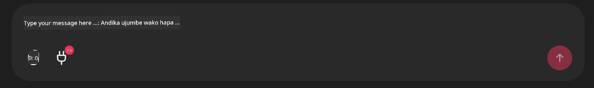

<!--
CO_OP_TRANSLATOR_METADATA:
{
  "original_hash": "9bf0395cbc541ce8db2a9699c8678dfc",
  "translation_date": "2025-07-12T14:24:06+00:00",
  "source_file": "11-mcp/code_samples/github-mcp/README.md",
  "language_code": "sw"
}
-->
# Mfano wa Github MCP Server

## Maelezo

Hii ilikuwa demo iliyotengenezwa kwa ajili ya AI Agents Hackathon iliyofanyika kupitia Microsoft Reactor.

Zana hii hutumika kupendekeza miradi ya hackathon kulingana na repos za mtumiaji kwenye Github. Hii hufanyika kwa:

1. **Github Agent** - Kutumia Github MCP Server kupata repos na taarifa kuhusu repos hizo.
2. **Hackathon Agent** - Huchukua data kutoka kwa Github Agent na kuja na mawazo ya ubunifu ya miradi ya hackathon kulingana na miradi, lugha zinazotumika na njia za mradi kwa ajili ya AI Agents hackathon.
3. **Events Agent** - Kulingana na mapendekezo ya hackathon agent, events agent atapendekeza matukio yanayohusiana kutoka kwenye mfululizo wa AI Agent Hackathon.

## Kuendesha Msimbo

### Mabadiliko ya Mazingira

Demo hii inatumia Azure Open AI Service, Semantic Kernel, Github MCP Server na Azure AI Search.

Hakikisha umeweka mabadiliko ya mazingira yanayofaa ili kutumia zana hizi:

```python
AZURE_OPENAI_CHAT_DEPLOYMENT_NAME=""
AZURE_OPENAI_EMBEDDING_DEPLOYMENT_NAME=""
AZURE_OPENAI_ENDPOINT=""
AZURE_OPENAI_API_KEY=""
AZURE_OPENAI_API_VERSION=""
AZURE_SEARCH_SERVICE_ENDPOINT=""
AZURE_SEARCH_API_KEY=""
``` 

## Kuendesha Chainlit Server

Ili kuunganishwa na MCP server, demo hii inatumia Chainlit kama kiolesura cha mazungumzo.

Ili kuendesha server, tumia amri ifuatayo kwenye terminal yako:

```bash
chainlit run app.py -w
```

Hii inapaswa kuanzisha server yako ya Chainlit kwenye `localhost:8000` pamoja na kujaza Azure AI Search Index yako na maudhui ya `event-descriptions.md`.

## Kuunganishwa na MCP Server

Ili kuunganishwa na Github MCP Server, chagua ikoni ya "plug" chini ya kisanduku cha mazungumzo cha "Type your message here..":



Kutoka hapo unaweza kubofya "Connect an MCP" kuongeza amri ya kuunganishwa na Github MCP Server:

```bash
npx -y @modelcontextprotocol/server-github --env GITHUB_PERSONAL_ACCESS_TOKEN=[YOUR PERSONAL ACCESS TOKEN]
```

Badilisha "[YOUR PERSONAL ACCESS TOKEN]" na Tokeni yako halali ya Ufikiaji Binafsi.

Baada ya kuunganishwa, unapaswa kuona (1) kando ya ikoni ya plug kuthibitisha kuwa umeunganishwa. Ikiwa sivyo, jaribu kuanzisha tena server ya chainlit kwa kutumia `chainlit run app.py -w`.

## Kutumia Demo

Ili kuanzisha mtiririko wa kazi wa wakala wa kupendekeza miradi ya hackathon, unaweza kuandika ujumbe kama:

"Recommend hackathon projects for the Github user koreyspace"

Router Agent atachambua ombi lako na kubaini mchanganyiko gani wa mawakala (GitHub, Hackathon, na Events) unafaa zaidi kushughulikia swali lako. Mawakala hufanya kazi pamoja kutoa mapendekezo kamili kulingana na uchambuzi wa repos za GitHub, ubunifu wa miradi, na matukio muhimu ya teknolojia.

**Kiarifu cha Kutotegemea**:  
Hati hii imetafsiriwa kwa kutumia huduma ya tafsiri ya AI [Co-op Translator](https://github.com/Azure/co-op-translator). Ingawa tunajitahidi kwa usahihi, tafadhali fahamu kwamba tafsiri za kiotomatiki zinaweza kuwa na makosa au upungufu wa usahihi. Hati ya asili katika lugha yake ya asili inapaswa kuchukuliwa kama chanzo cha mamlaka. Kwa taarifa muhimu, tafsiri ya kitaalamu inayofanywa na binadamu inapendekezwa. Hatubebei dhamana kwa kutoelewana au tafsiri potofu zinazotokana na matumizi ya tafsiri hii.