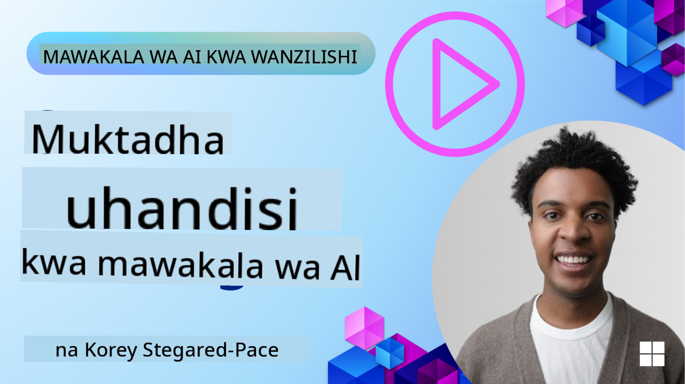
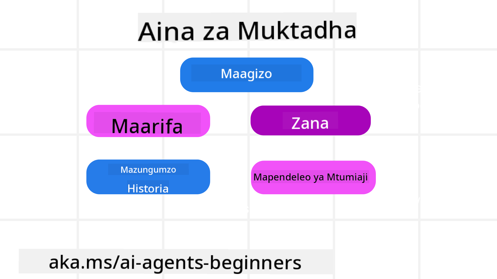
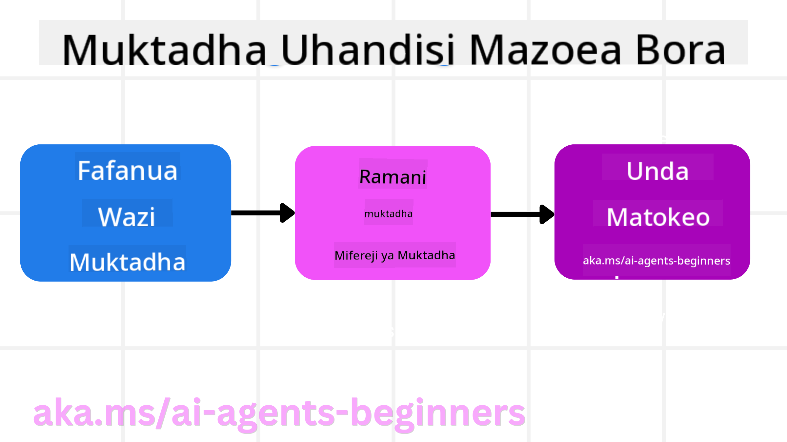

<!--
CO_OP_TRANSLATOR_METADATA:
{
  "original_hash": "cb7e50f471905ce6fdb92a30269a7a98",
  "translation_date": "2025-09-04T10:22:42+00:00",
  "source_file": "12-context-engineering/README.md",
  "language_code": "sw"
}
-->
# Uhandisi wa Muktadha kwa Mawakala wa AI

> _(Bofya picha hapo juu kutazama video ya somo hili)_

Kuelewa ugumu wa programu unayojenga wakala wa AI kwa ajili yake ni muhimu ili kuunda wakala wa kuaminika. Tunahitaji kujenga Mawakala wa AI ambao wanadhibiti taarifa kwa ufanisi ili kushughulikia mahitaji magumu zaidi ya uhandisi wa maelekezo.

Katika somo hili, tutachunguza uhandisi wa muktadha ni nini na jukumu lake katika kujenga Mawakala wa AI.

## Utangulizi

Somo hili litashughulikia:

• **Uhandisi wa Muktadha ni nini** na kwa nini ni tofauti na uhandisi wa maelekezo.

• **Mikakati ya Uhandisi wa Muktadha wa Ufanisi**, ikijumuisha jinsi ya kuandika, kuchagua, kubana, na kutenganisha taarifa.

• **Mifumo ya Kushindwa kwa Muktadha** ambayo inaweza kuharibu wakala wako wa AI na jinsi ya kuirekebisha.

## Malengo ya Kujifunza

Baada ya kukamilisha somo hili, utajua jinsi ya:

• **Kufafanua uhandisi wa muktadha** na kutofautisha na uhandisi wa maelekezo.

• **Kutambua vipengele muhimu vya muktadha** katika programu za LLM (Large Language Model).

• **Kutumia mikakati ya kuandika, kuchagua, kubana, na kutenganisha muktadha** ili kuboresha utendaji wa wakala.

• **Kutambua mifumo ya kushindwa kwa muktadha** kama vile uchafuzi, usumbufu, mkanganyiko, na mgongano, na kutekeleza mbinu za kupunguza.

## Uhandisi wa Muktadha ni Nini?

Kwa Mawakala wa AI, muktadha ndio unaoendesha upangaji wa wakala wa AI kuchukua hatua fulani. Uhandisi wa Muktadha ni mazoezi ya kuhakikisha wakala wa AI ana taarifa sahihi za kukamilisha hatua inayofuata ya kazi. Dirisha la muktadha lina ukubwa mdogo, kwa hivyo kama wajenzi wa mawakala tunahitaji kuunda mifumo na michakato ya kudhibiti kuongeza, kuondoa, na kubana taarifa katika dirisha la muktadha.

### Uhandisi wa Maelekezo vs Uhandisi wa Muktadha

Uhandisi wa maelekezo unazingatia seti moja ya maelekezo ya kudumu ili kuelekeza Mawakala wa AI kwa ufanisi kwa seti ya sheria. Uhandisi wa muktadha ni jinsi ya kudhibiti seti ya taarifa inayobadilika, ikijumuisha maelekezo ya awali, ili kuhakikisha wakala wa AI ana kile anachohitaji kwa muda. Wazo kuu la uhandisi wa muktadha ni kufanya mchakato huu uwe wa kurudiwa na wa kuaminika.

### Aina za Muktadha

Ni muhimu kukumbuka kuwa muktadha si kitu kimoja tu. Taarifa ambazo wakala wa AI anahitaji zinaweza kutoka kwa vyanzo mbalimbali, na ni jukumu letu kuhakikisha wakala anaweza kufikia vyanzo hivi:

Aina za muktadha ambazo wakala wa AI anaweza kuhitaji kudhibiti ni pamoja na:

• **Maelekezo:** Hizi ni kama "sheria" za wakala – maelekezo, ujumbe wa mfumo, mifano ya "few-shot" (kuonyesha AI jinsi ya kufanya kitu), na maelezo ya zana anazoweza kutumia. Hapa ndipo uhandisi wa maelekezo unachanganyika na uhandisi wa muktadha.

• **Maarifa:** Hii inajumuisha ukweli, taarifa zilizopatikana kutoka kwa hifadhidata, au kumbukumbu za muda mrefu ambazo wakala amekusanya. Hii inajumuisha kuunganisha mfumo wa RAG (Retrieval Augmented Generation) ikiwa wakala anahitaji kufikia hifadhi za maarifa na hifadhidata tofauti.

• **Zana:** Hizi ni maelezo ya kazi za nje, API, na MCP Servers ambazo wakala anaweza kuita, pamoja na maoni (matokeo) anayopata kutoka kuzitumia.

• **Historia ya Mazungumzo:** Mazungumzo yanayoendelea na mtumiaji. Kadri muda unavyopita, mazungumzo haya yanakuwa marefu na magumu zaidi, ambayo yanamaanisha yanachukua nafasi katika dirisha la muktadha.

• **Mapendeleo ya Mtumiaji:** Taarifa zilizojifunza kuhusu anachopenda au asichopenda mtumiaji kwa muda. Hizi zinaweza kuhifadhiwa na kuitwa wakati wa kufanya maamuzi muhimu ili kumsaidia mtumiaji.

## Mikakati ya Uhandisi wa Muktadha wa Ufanisi

### Mikakati ya Mipango

Uhandisi mzuri wa muktadha huanza na mipango mizuri. Hapa kuna mbinu ambayo itakusaidia kuanza kufikiria jinsi ya kutumia dhana ya uhandisi wa muktadha:

1. **Fafanua Matokeo Wazi** - Matokeo ya kazi ambazo Mawakala wa AI watapewa yanapaswa kufafanuliwa wazi. Jibu swali - "Dunia itakuwaje wakala wa AI akimaliza kazi yake?" Kwa maneno mengine, ni mabadiliko gani, taarifa, au majibu ambayo mtumiaji anapaswa kuwa nayo baada ya kuingiliana na wakala wa AI.

2. **Ramani Muktadha** - Baada ya kufafanua matokeo ya wakala wa AI, unahitaji kujibu swali "Ni taarifa gani wakala wa AI anahitaji ili kukamilisha kazi hii?". Kwa njia hii unaweza kuanza kuratibu muktadha wa mahali ambapo taarifa hiyo inaweza kupatikana.

3. **Unda Mifumo ya Muktadha** - Sasa kwa kuwa unajua mahali taarifa ilipo, unahitaji kujibu swali "Wakala atapataje taarifa hii?". Hii inaweza kufanywa kwa njia mbalimbali ikijumuisha RAG, matumizi ya MCP servers na zana nyingine.

### Mikakati ya Kivitendo

Mipango ni muhimu lakini mara taarifa zinapoanza kuingia katika dirisha la muktadha la wakala wetu, tunahitaji kuwa na mikakati ya kivitendo ya kuisimamia:

#### Kudhibiti Muktadha

Wakati taarifa fulani itaongezwa kwenye dirisha la muktadha kiotomatiki, uhandisi wa muktadha unahusu kuchukua jukumu la kazi zaidi ya taarifa hii, ambayo inaweza kufanywa kwa mikakati kadhaa:

1. **Scratchpad ya Wakala**  
Hii inaruhusu wakala wa AI kuchukua noti za taarifa muhimu kuhusu kazi za sasa na mwingiliano wa mtumiaji wakati wa kikao kimoja. Hii inapaswa kuwepo nje ya dirisha la muktadha katika faili au kitu cha runtime ambacho wakala anaweza kukipata baadaye wakati wa kikao hiki ikiwa inahitajika.

2. **Kumbukumbu**  
Scratchpads ni nzuri kwa kudhibiti taarifa nje ya dirisha la muktadha la kikao kimoja. Kumbukumbu zinawezesha mawakala kuhifadhi na kupata taarifa muhimu katika vikao vingi. Hii inaweza kujumuisha muhtasari, mapendeleo ya mtumiaji, na maoni ya maboresho ya baadaye.

3. **Kubana Muktadha**  
Wakati dirisha la muktadha linakua na linakaribia kikomo chake, mbinu kama muhtasari na kupunguza zinaweza kutumika. Hii inajumuisha ama kuhifadhi tu taarifa muhimu zaidi au kuondoa ujumbe wa zamani.

4. **Mifumo ya Mawakala Wengi**  
Kuunda mfumo wa mawakala wengi ni aina ya uhandisi wa muktadha kwa sababu kila wakala ana dirisha lake la muktadha. Jinsi muktadha huo unavyoshirikiwa na kupitishwa kwa mawakala tofauti ni jambo lingine la kupanga wakati wa kujenga mifumo hii.

5. **Mazingira ya Sandbox**  
Ikiwa wakala anahitaji kuendesha baadhi ya msimbo au kuchakata kiasi kikubwa cha taarifa katika hati, hii inaweza kuchukua idadi kubwa ya tokeni kuchakata matokeo. Badala ya kuwa na haya yote kuhifadhiwa katika dirisha la muktadha, wakala anaweza kutumia mazingira ya sandbox ambayo yanaweza kuendesha msimbo huu na kusoma tu matokeo na taarifa nyingine muhimu.

6. **Vitu vya Hali ya Runtime**  
Hii inafanywa kwa kuunda vyombo vya taarifa ili kudhibiti hali ambapo wakala anahitaji kuwa na ufikiaji wa taarifa fulani. Kwa kazi ngumu, hii ingewezesha wakala kuhifadhi matokeo ya kila hatua ndogo ya kazi hatua kwa hatua, kuruhusu muktadha kubaki umeunganishwa tu na hatua ndogo husika.

### Mfano wa Uhandisi wa Muktadha

Tuseme tunataka wakala wa AI **"Nipangie safari ya kwenda Paris."**

• Wakala rahisi anayetumia uhandisi wa maelekezo pekee anaweza kujibu: **"Sawa, ungependa kwenda Paris lini?"**. Anachakata tu swali lako la moja kwa moja wakati ulipouliza.

• Wakala anayezingatia mikakati ya uhandisi wa muktadha iliyofunikwa angefanya zaidi. Kabla ya kujibu, mfumo wake unaweza:

  ◦ **Kuangalia kalenda yako** kwa tarehe zinazopatikana (kupata data ya wakati halisi).

 ◦ **Kukumbuka mapendeleo ya safari za zamani** (kutoka kumbukumbu za muda mrefu) kama shirika la ndege unalopendelea, bajeti, au kama unapendelea safari za moja kwa moja.

 ◦ **Kutambua zana zinazopatikana** kwa uhifadhi wa ndege na hoteli.

- Kisha, jibu la mfano linaweza kuwa: **"Habari [Jina Lako]! Naona uko huru wiki ya kwanza ya Oktoba. Nianze kutafuta safari za moja kwa moja kwenda Paris na [Shirika la Ndege Unalopendelea] ndani ya bajeti yako ya kawaida ya [Bajeti]?"**. Jibu hili lenye muktadha mzuri linaonyesha nguvu ya uhandisi wa muktadha.

## Mifumo ya Kushindwa kwa Muktadha

### Uchafuzi wa Muktadha

**Ni nini:** Wakati halusination (taarifa ya uongo iliyotolewa na LLM) au kosa linaingia katika muktadha na linarejelewa mara kwa mara, likisababisha wakala kufuata malengo yasiyowezekana au kuunda mikakati ya kipuuzi.

**Cha kufanya:** Tekeleza **uthibitishaji wa muktadha** na **karantini**. Thibitisha taarifa kabla ya kuongezwa kwenye kumbukumbu za muda mrefu. Ikiwa uchafuzi unawezekana unagunduliwa, anza nyuzi mpya za muktadha ili kuzuia taarifa mbaya kuenea.

**Mfano wa Uhifadhi wa Safari:** Wakala wako anahusisha **safari ya moja kwa moja kutoka uwanja mdogo wa ndege wa ndani kwenda mji wa kimataifa wa mbali** ambao hauwezi kutoa safari za kimataifa. Maelezo haya ya safari yasiyokuwepo yanahifadhiwa katika muktadha. Baadaye, unapomwomba wakala kuhifadhi, anaendelea kujaribu kutafuta tiketi kwa njia hii isiyowezekana, na kusababisha makosa ya mara kwa mara.

**Suluhisho:** Tekeleza hatua inayothibitisha **uwepo wa safari na njia kupitia API ya wakati halisi** _kabla_ ya kuongeza maelezo ya safari kwenye muktadha wa kazi wa wakala. Ikiwa uthibitishaji unashindwa, taarifa isiyo sahihi "inawekwa karantini" na haitumiki tena.

### Usumbufu wa Muktadha

**Ni nini:** Wakati muktadha unakuwa mkubwa sana kiasi kwamba modeli inazingatia sana historia iliyokusanywa badala ya kutumia kile ilichojifunza wakati wa mafunzo, na kusababisha vitendo vya kurudia au visivyo na msaada. Modeli zinaweza kuanza kufanya makosa hata kabla ya dirisha la muktadha kujaa.

**Cha kufanya:** Tumia **muhtasari wa muktadha**. Mara kwa mara banisha taarifa iliyokusanywa katika muhtasari mfupi, ukihifadhi maelezo muhimu huku ukiondoa historia isiyohitajika. Hii husaidia "kuweka upya" umakini.

**Mfano wa Uhifadhi wa Safari:** Umekuwa ukijadili maeneo mbalimbali ya ndoto ya kusafiri kwa muda mrefu, ikijumuisha maelezo ya kina ya safari yako ya kubeba mizigo kutoka miaka miwili iliyopita. Unapouliza hatimaye **"nipatie safari ya bei nafuu kwa mwezi ujao,"** wakala anazidiwa na maelezo ya zamani yasiyohusiana na anaendelea kuuliza kuhusu vifaa vyako vya kubeba mizigo au ratiba za zamani, akipuuza ombi lako la sasa.

**Suluhisho:** Baada ya idadi fulani ya zamu au wakati muktadha unakua mkubwa sana, wakala anapaswa **kufupisha sehemu za hivi karibuni na muhimu za mazungumzo** – akizingatia tarehe zako za kusafiri za sasa na marudio – na kutumia muhtasari huo uliobanwa kwa simu inayofuata ya LLM, akiondoa mazungumzo ya kihistoria yasiyo muhimu.

### Mkanganyiko wa Muktadha

**Ni nini:** Wakati muktadha usio wa lazima, mara nyingi kwa njia ya zana nyingi zinazopatikana, unasababisha modeli kutoa majibu mabaya au kuita zana zisizohusiana. Modeli ndogo zinaathirika zaidi na hili.

**Cha kufanya:** Tekeleza **usimamizi wa mzigo wa zana** kwa kutumia mbinu za RAG. Hifadhi maelezo ya zana katika hifadhidata ya vector na uchague _tu_ zana zinazohusiana zaidi kwa kila kazi maalum. Utafiti unaonyesha kupunguza uteuzi wa zana hadi chini ya 30.

**Mfano wa Uhifadhi wa Safari:** Wakala wako ana ufikiaji wa zana nyingi: `book_flight`, `book_hotel`, `rent_car`, `find_tours`, `currency_converter`, `weather_forecast`, `restaurant_reservations`, nk. Unauliza, **"Njia bora ya kuzunguka Paris ni ipi?"** Kwa sababu ya idadi kubwa ya zana, wakala anachanganyikiwa na anajaribu kuita `book_flight` _ndani_ ya Paris, au `rent_car` ingawa unapendelea usafiri wa umma, kwa sababu maelezo ya zana yanaweza kuingiliana au hawezi kutambua bora zaidi.

**Suluhisho:** Tumia **RAG juu ya maelezo ya zana**. Unapouliza kuhusu kuzunguka Paris, mfumo unapata _tu_ zana zinazohusiana zaidi kama `rent_car` au `public_transport_info` kulingana na swali lako, na kuwasilisha "mzigo" wa zana uliozingatia kwa LLM.

### Mgongano wa Muktadha

**Ni nini:** Wakati taarifa zinazokinzana zipo ndani ya muktadha, na kusababisha hoja zisizo thabiti au majibu mabaya ya mwisho. Hili mara nyingi hutokea wakati taarifa zinapofika kwa hatua, na dhana za awali zisizo sahihi zinabaki katika muktadha.

**Cha kufanya:** Tumia **kupunguza muktadha** na **kuondoa mzigo**. Kupunguza kunamaanisha kuondoa taarifa za zamani au zinazokinzana wakati maelezo mapya yanapofika. Kuondoa mzigo kunampa modeli "scratchpad" tofauti ya kuchakata taarifa bila kuchafua muktadha mkuu.

**Mfano wa Uhifadhi wa Safari:** Awali unamwambia wakala wako, **"Nataka kusafiri daraja la uchumi."** Baadaye katika mazungumzo, unabadilisha mawazo yako na kusema, **"Kwa safari hii, hebu twende daraja la biashara."** Ikiwa maagizo yote mawili yanabaki katika muktadha, wakala anaweza kupokea matokeo ya utafutaji yanayokinzana au kuchanganyikiwa kuhusu ni upendeleo gani wa kuzingatia.

**Suluhisho:** Tekeleza **kupunguza muktadha**. Wakati maagizo mapya yanapingana na ya zamani, agizo la zamani linaondolewa au linazidiwa waziwazi katika muktadha. Vinginevyo, wakala anaweza kutumia **scratchpad** kupatanisha mapendeleo yanayokinzana kabla ya kuamua, kuhakikisha tu agizo la mwisho, thabiti linaongoza vitendo vyake.

## Una Maswali Zaidi Kuhusu Uhandisi wa Muktadha?

Jiunge na [Azure AI Foundry Discord](https://aka.ms/ai-agents/discord) ili kukutana na wanafunzi wengine, kuhudhuria masaa ya ofisi, na kupata majibu ya maswali yako kuhusu Mawakala wa AI.

---

**Kanusho**:  
Hati hii imetafsiriwa kwa kutumia huduma ya tafsiri ya AI [Co-op Translator](https://github.com/Azure/co-op-translator). Ingawa tunajitahidi kuhakikisha usahihi, tafsiri za kiotomatiki zinaweza kuwa na makosa au kutokuwa sahihi. Hati ya asili katika lugha yake ya awali inapaswa kuchukuliwa kama chanzo cha mamlaka. Kwa taarifa muhimu, tafsiri ya kitaalamu ya binadamu inapendekezwa. Hatutawajibika kwa kutoelewana au tafsiri zisizo sahihi zinazotokana na matumizi ya tafsiri hii.