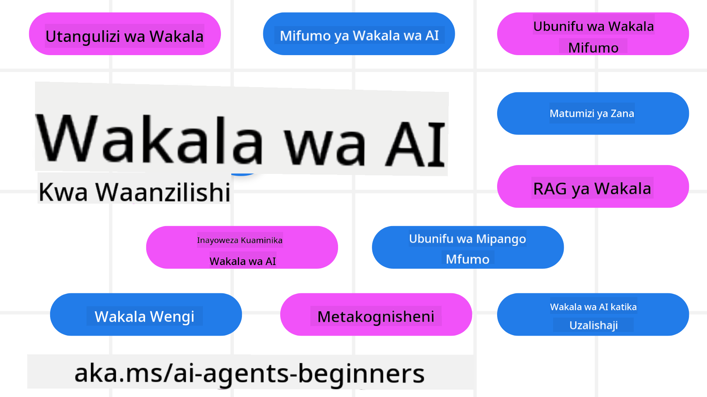

<!--
CO_OP_TRANSLATOR_METADATA:
{
  "original_hash": "6b07046397366e6f6f4524c9ddeba1e1",
  "translation_date": "2025-07-12T14:57:44+00:00",
  "source_file": "README.md",
  "language_code": "sw"
}
-->
# Wakala wa AI kwa Waanzilishi - Kozi

## Masomo 11 yanayofundisha kila kitu unachohitaji kujua kuanza kujenga Wakala wa AI

  
  
  
  

### 🌐 Msaada wa Lugha Nyingi

#### Unaungwa mkono kupitia GitHub Action (Moja kwa moja & Daima Imeboreshwa)

[French](../fr/README.md) | [Spanish](../es/README.md) | [German](../de/README.md) | [Russian](../ru/README.md) | [Arabic](../ar/README.md) | [Persian (Farsi)](../fa/README.md) | [Urdu](../ur/README.md) | [Chinese (Simplified)](../zh/README.md) | [Chinese (Traditional, Macau)](../mo/README.md) | [Chinese (Traditional, Hong Kong)](../hk/README.md) | [Chinese (Traditional, Taiwan)](../tw/README.md) | [Japanese](../ja/README.md) | [Korean](../ko/README.md) | [Hindi](../hi/README.md) | [Bengali](../bn/README.md) | [Marathi](../mr/README.md) | [Nepali](../ne/README.md) | [Punjabi (Gurmukhi)](../pa/README.md) | [Portuguese (Portugal)](../pt/README.md) | [Portuguese (Brazil)](../br/README.md) | [Italian](../it/README.md) | [Polish](../pl/README.md) | [Turkish](../tr/README.md) | [Greek](../el/README.md) | [Thai](../th/README.md) | [Swedish](../sv/README.md) | [Danish](../da/README.md) | [Norwegian](../no/README.md) | [Finnish](../fi/README.md) | [Dutch](../nl/README.md) | [Hebrew](../he/README.md) | [Vietnamese](../vi/README.md) | [Indonesian](../id/README.md) | [Malay](../ms/README.md) | [Tagalog (Filipino)](../tl/README.md) | [Swahili](./README.md) | [Hungarian](../hu/README.md) | [Czech](../cs/README.md) | [Slovak](../sk/README.md) | [Romanian](../ro/README.md) | [Bulgarian](../bg/README.md) | [Serbian (Cyrillic)](../sr/README.md) | [Croatian](../hr/README.md) | [Slovenian](../sl/README.md) | [Ukrainian](../uk/README.md) | [Burmese (Myanmar)](../my/README.md)

**Kama unataka lugha zaidi za tafsiri ziongezwe, zipo [hapa](https://github.com/Azure/co-op-translator/blob/main/getting_started/supported-languages.md)**

  
  

## 🌱 Kuanzia

Kozi hii ina masomo 11 yanayofunika misingi ya kujenga Wakala wa AI. Kila somo lina mada yake, hivyo anza popote unapotaka!

Kozi hii ina msaada wa lugha nyingi. Tembelea [lugha zinazopatikana hapa](../..).

Kama hii ni mara yako ya kwanza kujenga kwa kutumia mifano ya Generative AI, angalia kozi yetu ya [Generative AI For Beginners](https://aka.ms/genai-beginners), ambayo ina masomo 21 kuhusu kujenga kwa GenAI.

Usisahau [kutoa nyota (🌟) kwenye repo hii](https://docs.github.com/en/get-started/exploring-projects-on-github/saving-repositories-with-stars?WT.mc_id=academic-105485-koreyst) na [kufork repo hii](https://github.com/microsoft/ai-agents-for-beginners/fork) ili kuendesha msimbo.

### Unachohitaji

Kila somo katika kozi hii lina mifano ya msimbo, ambayo inaweza kupatikana kwenye folda ya code_samples. Unaweza [kufork repo hii](https://github.com/microsoft/ai-agents-for-beginners/fork) kuunda nakala yako mwenyewe.

Mfano wa msimbo katika mazoezi haya unatumia Azure AI Foundry na GitHub Model Catalogs kwa ajili ya kuingiliana na Mifano ya Lugha:

- [Github Models](https://aka.ms/ai-agents-beginners/github-models) - Bure / Iliyopunguzwa  
- [Azure AI Foundry](https://aka.ms/ai-agents-beginners/ai-foundry) - Inahitaji Akaunti ya Azure

Kozi hii pia inatumia mifumo na huduma zifuatazo za Wakala wa AI kutoka Microsoft:

- [Azure AI Agent Service](https://aka.ms/ai-agents-beginners/ai-agent-service)  
- [Semantic Kernel](https://aka.ms/ai-agents-beginners/semantic-kernel)  
- [AutoGen](https://aka.ms/ai-agents/autogen)

Kwa maelezo zaidi kuhusu jinsi ya kuendesha msimbo wa kozi hii, tembelea [Course Setup](./00-course-setup/README.md).

## 🙏 Unataka kusaidia?

Je, una mapendekezo au umeona makosa ya tahajia au msimbo? [Toa tatizo](https://github.com/microsoft/ai-agents-for-beginners/issues?WT.mc_id=academic-105485-koreyst) au [Tengeneza pull request](https://github.com/microsoft/ai-agents-for-beginners/pulls?WT.mc_id=academic-105485-koreyst)

Kama unakumbwa na changamoto au una maswali kuhusu kujenga Wakala wa AI, jiunge na [Azure AI Foundry Community Discord](https://discord.gg/kzRShWzttr)

Kama una maoni kuhusu bidhaa au makosa wakati wa kujenga, tembelea [Azure AI Foundry Developer Forum](https://aka.ms/azureaifoundry/forum)

## 📂 Kila somo linajumuisha

- Somo lililoandikwa kwenye README na video fupi  
- Mifano ya msimbo wa Python inayounga mkono Azure AI Foundry na Github Models (Bure)  
- Viungo vya rasilimali za ziada ili kuendeleza kujifunza kwako

## 🗃️ Masomo

| **Somo**                                | **Maandishi & Msimbo**                              | **Video**                                                  | **Mafunzo Zaidi**                                                                     |
|----------------------------------------|----------------------------------------------------|------------------------------------------------------------|----------------------------------------------------------------------------------------|
| Utangulizi wa Wakala wa AI na Matumizi | [Link](./01-intro-to-ai-agents/README.md)          | [Video](https://youtu.be/3zgm60bXmQk?si=z8QygFvYQv-9WtO1)  | [Link](https://aka.ms/ai-agents-beginners/collection?WT.mc_id=academic-105485-koreyst) |
| Kuchunguza Mifumo ya Wakala wa AI      | [Link](./02-explore-agentic-frameworks/README.md)  | [Video](https://youtu.be/ODwF-EZo_O8?si=Vawth4hzVaHv-u0H)  | [Link](https://aka.ms/ai-agents-beginners/collection?WT.mc_id=academic-105485-koreyst) |
| Kuelewa Mifumo ya Ubunifu wa Wakala wa AI | [Link](./03-agentic-design-patterns/README.md)     | [Video](https://youtu.be/m9lM8qqoOEA?si=BIzHwzstTPL8o9GF)  | [Link](https://aka.ms/ai-agents-beginners/collection?WT.mc_id=academic-105485-koreyst) |
| Mfano wa Ubunifu wa Matumizi ya Zana  | [Link](./04-tool-use/README.md)                    | [Video](https://youtu.be/vieRiPRx-gI?si=2z6O2Xu2cu_Jz46N)  | [Link](https://aka.ms/ai-agents-beginners/collection?WT.mc_id=academic-105485-koreyst) |
| Agentic RAG                           | [Link](./05-agentic-rag/README.md)                 | [Video](https://youtu.be/WcjAARvdL7I?si=gKPWsQpKiIlDH9A3)  | [Link](https://aka.ms/ai-agents-beginners/collection?WT.mc_id=academic-105485-koreyst) |
| Kujenga Wakala wa AI wa Kuaminika      | [Link](./06-building-trustworthy-agents/README.md) | [Video](https://youtu.be/iZKkMEGBCUQ?si=jZjpiMnGFOE9L8OK ) | [Link](https://aka.ms/ai-agents-beginners/collection?WT.mc_id=academic-105485-koreyst) |
| Mfano wa Ubunifu wa Mipango            | [Link](./07-planning-design/README.md)             | [Video](https://youtu.be/kPfJ2BrBCMY?si=6SC_iv_E5-mzucnC)  | [Link](https://aka.ms/ai-agents-beginners/collection?WT.mc_id=academic-105485-koreyst) |
| Mfano wa Ubunifu wa Wakala Wengi       | [Link](./08-multi-agent/README.md)                 | [Video](https://youtu.be/V6HpE9hZEx0?si=rMgDhEu7wXo2uo6g)  | [Link](https://aka.ms/ai-agents-beginners/collection?WT.mc_id=academic-105485-koreyst) |
| Mfano wa Ubunifu wa Metacognition      | [Link](./09-metacognition/README.md)               | [Video](https://youtu.be/His9R6gw6Ec?si=8gck6vvdSNCt6OcF)  | [Link](https://aka.ms/ai-agents-beginners/collection?WT.mc_id=academic-105485-koreyst) |
| Wakala wa AI Katika Uzalishaji          | [Link](./10-ai-agents-production/README.md)        | [Video](https://youtu.be/l4TP6IyJxmQ?si=31dnhexRo6yLRJDl)  | [Link](https://aka.ms/ai-agents-beginners/collection?WT.mc_id=academic-105485-koreyst) |
| Wakala wa AI na MCP                    | [Link](./11-mcp/README.md)                         |                                                            | [Link](https://aka.ms/mcp-for-beginners)                                               |

## 🎒 Kozi Nyingine

Timu yetu hutengeneza kozi nyingine pia! Angalia:
- [**MPYA** Itifaki ya Muktadha wa Mfano (MCP) Kwa Waanzilishi](https://github.com/microsoft/mcp-for-beginners?WT.mc_id=academic-105485-koreyst)
- [AI Inayotengeneza kwa Waanzilishi kwa kutumia .NET](https://github.com/microsoft/Generative-AI-for-beginners-dotnet?WT.mc_id=academic-105485-koreyst)
- [AI Inayotengeneza kwa Waanzilishi](https://github.com/microsoft/generative-ai-for-beginners?WT.mc_id=academic-105485-koreyst)
- [ML kwa Waanzilishi](https://aka.ms/ml-beginners?WT.mc_id=academic-105485-koreyst)
- [Sayansi ya Data kwa Waanzilishi](https://aka.ms/datascience-beginners?WT.mc_id=academic-105485-koreyst)
- [AI kwa Waanzilishi](https://aka.ms/ai-beginners?WT.mc_id=academic-105485-koreyst)
- [Usalama wa Mtandao kwa Waanzilishi](https://github.com/microsoft/Security-101??WT.mc_id=academic-96948-sayoung)
- [Uendelezaji wa Tovuti kwa Waanzilishi](https://aka.ms/webdev-beginners?WT.mc_id=academic-105485-koreyst)
- [IoT kwa Waanzilishi](https://aka.ms/iot-beginners?WT.mc_id=academic-105485-koreyst)
- [Uendelezaji wa XR kwa Waanzilishi](https://github.com/microsoft/xr-development-for-beginners?WT.mc_id=academic-105485-koreyst)
- [Kuwa Mtaalamu wa GitHub Copilot kwa Uandishi wa Programu kwa AI kwa Pamoja](https://aka.ms/GitHubCopilotAI?WT.mc_id=academic-105485-koreyst)
- [Kuwa Mtaalamu wa GitHub Copilot kwa Waendelezaji wa C#/.NET](https://github.com/microsoft/mastering-github-copilot-for-dotnet-csharp-developers?WT.mc_id=academic-105485-koreyst)
- [Chagua Safari Yako ya Copilot](https://github.com/microsoft/CopilotAdventures?WT.mc_id=academic-105485-koreyst)

## 🌟 Shukrani kwa Jamii

Asante kwa [Shivam Goyal](https://www.linkedin.com/in/shivam2003/) kwa kuchangia mifano muhimu ya msimbo inayoonyesha Agentic RAG.

## Kuchangia

Mradi huu unakaribisha michango na mapendekezo. Michango mingi inahitaji ukakubali
Mkataba wa Leseni ya Mchango (CLA) unaothibitisha kuwa una haki, na kwa kweli unatoa,
haki za kutumia mchango wako. Kwa maelezo, tembelea
<https://cla.opensource.microsoft.com>.

Unapowasilisha ombi la pull, bot ya CLA itabaini moja kwa moja kama unahitaji kutoa
CLA na kuandaa PR ipasavyo (mfano, ukaguzi wa hali, maoni). Fuata tu maelekezo
yanayotolewa na bot. Hii itabidi ufanye mara moja tu kwa hifadhidata zote zinazotumia CLA yetu.

Mradi huu umechukua [Kanuni za Maadili za Chanzo Huria za Microsoft](https://opensource.microsoft.com/codeofconduct/).
Kwa taarifa zaidi angalia [Maswali Yanayoulizwa Mara kwa Mara kuhusu Kanuni za Maadili](https://opensource.microsoft.com/codeofconduct/faq/) au
wasiliana na [opencode@microsoft.com](mailto:opencode@microsoft.com) kwa maswali au maoni zaidi.

## Alama za Biashara

Mradi huu unaweza kuwa na alama za biashara au nembo za miradi, bidhaa, au huduma. Matumizi yaliyothibitishwa ya
alama za biashara au nembo za Microsoft yanategemea na lazima yafuatilie
[Mwongozo wa Alama za Biashara na Brand wa Microsoft](https://www.microsoft.com/legal/intellectualproperty/trademarks/usage/general).
Matumizi ya alama za biashara au nembo za Microsoft katika matoleo yaliyobadilishwa ya mradi huu hayapaswi kusababisha mkanganyiko au kuashiria udhamini wa Microsoft.
Matumizi yoyote ya alama za biashara au nembo za wahusika wengine yanategemea sera za wahusika hao.

**Kiarifu cha Kutotegemea**:  
Hati hii imetafsiriwa kwa kutumia huduma ya tafsiri ya AI [Co-op Translator](https://github.com/Azure/co-op-translator). Ingawa tunajitahidi kwa usahihi, tafadhali fahamu kuwa tafsiri za kiotomatiki zinaweza kuwa na makosa au upungufu wa usahihi. Hati ya asili katika lugha yake ya asili inapaswa kuchukuliwa kama chanzo cha mamlaka. Kwa taarifa muhimu, tafsiri ya kitaalamu inayofanywa na binadamu inapendekezwa. Hatubebei dhamana kwa kutoelewana au tafsiri potofu zinazotokana na matumizi ya tafsiri hii.