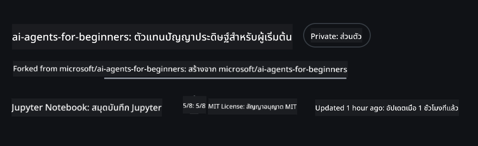
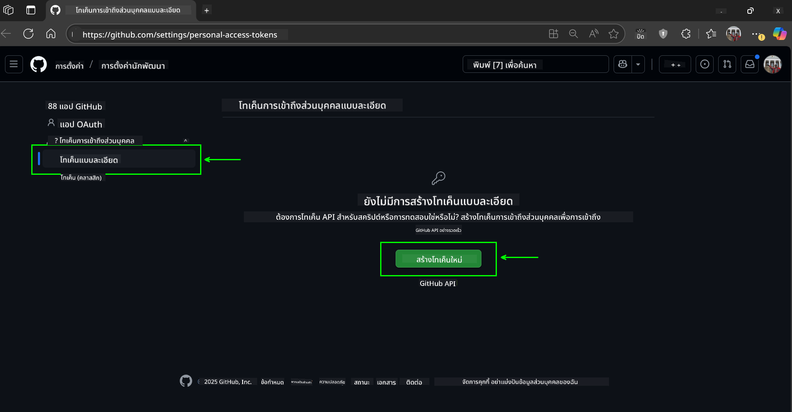
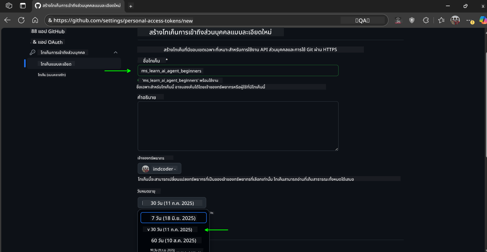
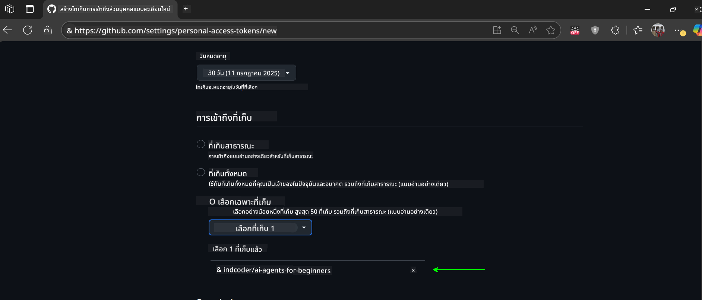
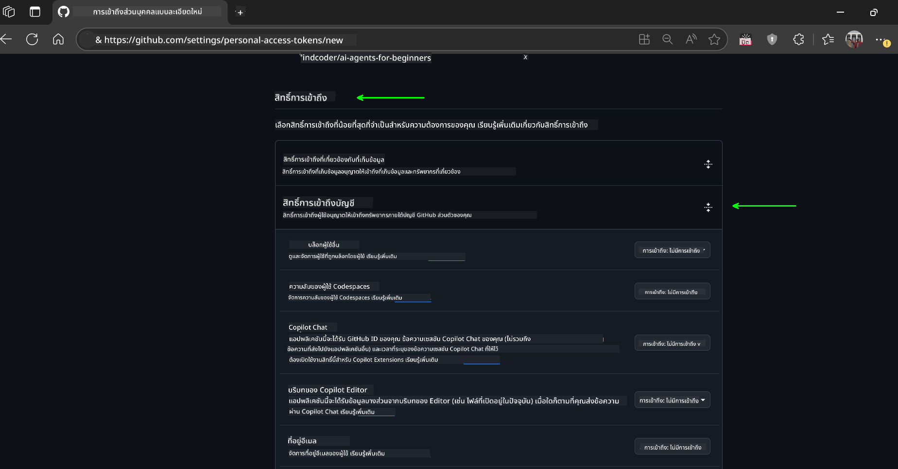
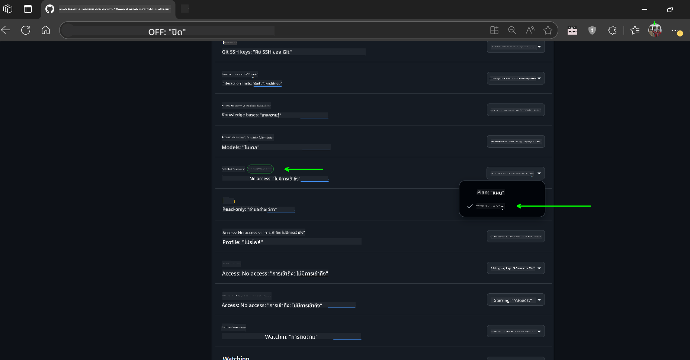
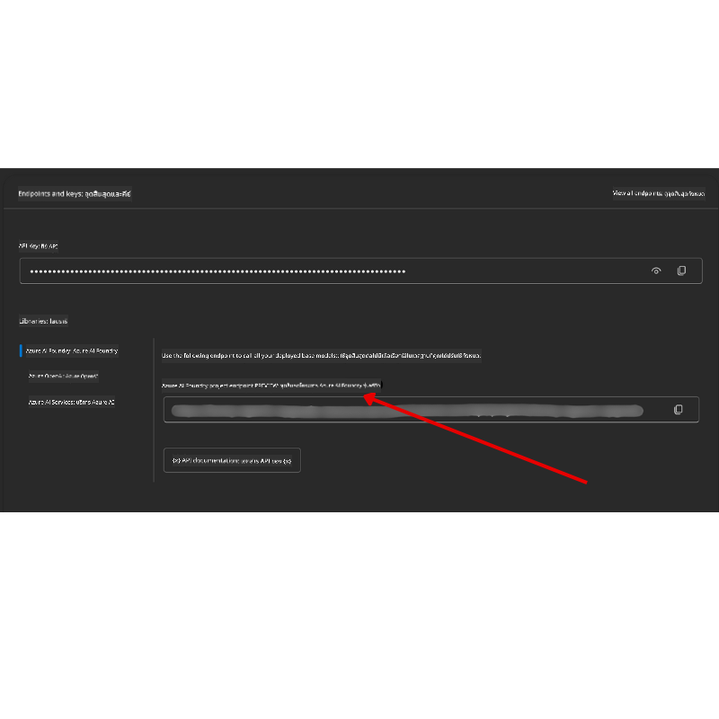

<!--
CO_OP_TRANSLATOR_METADATA:
{
  "original_hash": "c6a79c8f2b56a80370ff7e447765524f",
  "translation_date": "2025-07-23T08:47:04+00:00",
  "source_file": "00-course-setup/README.md",
  "language_code": "th"
}
-->
# การตั้งค่าคอร์ส

## บทนำ

บทเรียนนี้จะครอบคลุมวิธีการรันตัวอย่างโค้ดในคอร์สนี้

## โคลนหรือ Fork Repo นี้

เริ่มต้นโดยการโคลนหรือ Fork GitHub Repository เพื่อสร้างเวอร์ชันของคุณเองสำหรับเนื้อหาคอร์ส เพื่อให้คุณสามารถรัน ทดสอบ และปรับแต่งโค้ดได้!

สามารถทำได้โดยคลิกลิงก์ไปยัง

คุณควรมีเวอร์ชัน Fork ของคอร์สนี้ในลิงก์ต่อไปนี้:



## การรันโค้ด

คอร์สนี้มีชุด Jupyter Notebooks ที่คุณสามารถรันเพื่อสัมผัสประสบการณ์การสร้าง AI Agents ด้วยตัวเอง

ตัวอย่างโค้ดใช้:

**ต้องมีบัญชี GitHub - ฟรี**:

1) Semantic Kernel Agent Framework + GitHub Models Marketplace ระบุว่า (semantic-kernel.ipynb)
2) AutoGen Framework + GitHub Models Marketplace ระบุว่า (autogen.ipynb)

**ต้องมีการสมัครสมาชิก Azure**:
3) Azure AI Foundry + Azure AI Agent Service ระบุว่า (azureaiagent.ipynb)

เราขอแนะนำให้คุณลองใช้ตัวอย่างทั้งสามประเภทเพื่อดูว่าแบบใดเหมาะกับคุณที่สุด

ตัวเลือกที่คุณเลือกจะกำหนดขั้นตอนการตั้งค่าที่คุณต้องทำตามด้านล่าง:

## ความต้องการ

- Python 3.12+
  - **NOTE**: หากคุณยังไม่มี Python 3.12 ติดตั้งอยู่ ให้ติดตั้งก่อน จากนั้นสร้าง venv โดยใช้ python3.12 เพื่อให้แน่ใจว่าเวอร์ชันที่ถูกต้องจะถูกติดตั้งจากไฟล์ requirements.txt
- บัญชี GitHub - สำหรับการเข้าถึง GitHub Models Marketplace
- การสมัครสมาชิก Azure - สำหรับการเข้าถึง Azure AI Foundry
- บัญชี Azure AI Foundry - สำหรับการเข้าถึง Azure AI Agent Service

เราได้รวมไฟล์ `requirements.txt` ไว้ใน root ของ repository นี้ ซึ่งมี Python packages ที่จำเป็นทั้งหมดสำหรับการรันตัวอย่างโค้ด

คุณสามารถติดตั้งได้โดยรันคำสั่งต่อไปนี้ใน terminal ที่ root ของ repository:

```bash
pip install -r requirements.txt
```
เราขอแนะนำให้สร้าง Python virtual environment เพื่อหลีกเลี่ยงปัญหาและความขัดแย้งใดๆ

## การตั้งค่า VSCode
ตรวจสอบให้แน่ใจว่าคุณใช้เวอร์ชัน Python ที่ถูกต้องใน VSCode


## การตั้งค่าสำหรับตัวอย่างที่ใช้ GitHub Models 

### ขั้นตอนที่ 1: ดึง GitHub Personal Access Token (PAT) ของคุณ

คอร์สนี้ใช้ GitHub Models Marketplace ซึ่งให้การเข้าถึง Large Language Models (LLMs) ฟรีที่คุณจะใช้ในการสร้าง AI Agents

ในการใช้ GitHub Models คุณจะต้องสร้าง [GitHub Personal Access Token](https://docs.github.com/en/authentication/keeping-your-account-and-data-secure/managing-your-personal-access-tokens)

สามารถทำได้โดยไปที่บัญชี GitHub ของคุณ

โปรดปฏิบัติตาม [หลักการของการให้สิทธิ์น้อยที่สุด](https://docs.github.com/en/get-started/learning-to-code/storing-your-secrets-safely) เมื่อสร้าง token ของคุณ ซึ่งหมายความว่าคุณควรให้สิทธิ์ token เฉพาะที่จำเป็นสำหรับการรันตัวอย่างโค้ดในคอร์สนี้

1. เลือกตัวเลือก `Fine-grained tokens` ที่ด้านซ้ายของหน้าจอ

    จากนั้นเลือก `Generate new token`

    

1. ใส่ชื่อที่อธิบายถึง token ของคุณเพื่อสะท้อนถึงวัตถุประสงค์ ทำให้ง่ายต่อการระบุในภายหลัง ตั้งค่าวันหมดอายุ (แนะนำ: 30 วัน; คุณสามารถเลือกช่วงเวลาที่สั้นกว่า เช่น 7 วัน หากต้องการความปลอดภัยมากขึ้น)

    

1. จำกัดขอบเขตของ token ให้กับ fork ของ repository นี้

    

1. จำกัดสิทธิ์ของ token: ภายใต้ **Permissions** ให้เปิด **Account Permissions** ไปที่ **Models** และเปิดใช้งานเฉพาะการเข้าถึงแบบอ่านที่จำเป็นสำหรับ GitHub Models

    

    

คัดลอก token ใหม่ที่คุณเพิ่งสร้างขึ้น คุณจะเพิ่ม token นี้ลงในไฟล์ `.env` ที่รวมอยู่ในคอร์สนี้

### ขั้นตอนที่ 2: สร้างไฟล์ `.env` ของคุณ

ในการสร้างไฟล์ `.env` ให้รันคำสั่งต่อไปนี้ใน terminal ของคุณ

```bash
cp .env.example .env
```

คำสั่งนี้จะคัดลอกไฟล์ตัวอย่างและสร้าง `.env` ในไดเรกทอรีของคุณ ซึ่งคุณจะเติมค่าตัวแปรสภาพแวดล้อม

เมื่อคุณคัดลอก token แล้ว ให้เปิดไฟล์ `.env` ใน text editor ที่คุณชื่นชอบและวาง token ลงในฟิลด์ `GITHUB_TOKEN`

คุณควรจะสามารถรันตัวอย่างโค้ดในคอร์สนี้ได้แล้ว

## การตั้งค่าสำหรับตัวอย่างที่ใช้ Azure AI Foundry และ Azure AI Agent Service

### ขั้นตอนที่ 1: ดึง Azure Project Endpoint ของคุณ

ทำตามขั้นตอนการสร้าง hub และ project ใน Azure AI Foundry ได้ที่นี่: [Hub resources overview](https://learn.microsoft.com/en-us/azure/ai-foundry/concepts/ai-resources)

เมื่อคุณสร้าง project แล้ว คุณจะต้องดึง connection string สำหรับ project ของคุณ

สามารถทำได้โดยไปที่หน้า **Overview** ของ project ใน Azure AI Foundry portal



### ขั้นตอนที่ 2: สร้างไฟล์ `.env` ของคุณ

ในการสร้างไฟล์ `.env` ให้รันคำสั่งต่อไปนี้ใน terminal ของคุณ

```bash
cp .env.example .env
```

คำสั่งนี้จะคัดลอกไฟล์ตัวอย่างและสร้าง `.env` ในไดเรกทอรีของคุณ ซึ่งคุณจะเติมค่าตัวแปรสภาพแวดล้อม

เมื่อคุณคัดลอก token แล้ว ให้เปิดไฟล์ `.env` ใน text editor ที่คุณชื่นชอบและวาง token ลงในฟิลด์ `PROJECT_ENDPOINT`

### ขั้นตอนที่ 3: ลงชื่อเข้าใช้ Azure

เพื่อความปลอดภัยที่ดีที่สุด เราจะใช้ [keyless authentication](https://learn.microsoft.com/azure/developer/ai/keyless-connections?tabs=csharp%2Cazure-cli?WT.mc_id=academic-105485-koreyst) เพื่อยืนยันตัวตนกับ Azure OpenAI ด้วย Microsoft Entra ID

จากนั้นเปิด terminal และรัน `az login --use-device-code` เพื่อเข้าสู่บัญชี Azure ของคุณ

เมื่อคุณเข้าสู่ระบบแล้ว ให้เลือก subscription ของคุณใน terminal

## ตัวแปรสภาพแวดล้อมเพิ่มเติม - Azure Search และ Azure OpenAI 

สำหรับบทเรียน Agentic RAG - บทเรียนที่ 5 - มีตัวอย่างที่ใช้ Azure Search และ Azure OpenAI

หากคุณต้องการรันตัวอย่างเหล่านี้ คุณจะต้องเพิ่มตัวแปรสภาพแวดล้อมต่อไปนี้ลงในไฟล์ `.env` ของคุณ:

### หน้า Overview (Project)

- `AZURE_SUBSCRIPTION_ID` - ตรวจสอบ **Project details** ในหน้า **Overview** ของ project ของคุณ

- `AZURE_AI_PROJECT_NAME` - ดูที่ด้านบนของหน้า **Overview** สำหรับ project ของคุณ

- `AZURE_OPENAI_SERVICE` - ค้นหานี้ในแท็บ **Included capabilities** สำหรับ **Azure OpenAI Service** ในหน้า **Overview**

### Management Center

- `AZURE_OPENAI_RESOURCE_GROUP` - ไปที่ **Project properties** ในหน้า **Overview** ของ **Management Center**

- `GLOBAL_LLM_SERVICE` - ภายใต้ **Connected resources** ค้นหาชื่อการเชื่อมต่อ **Azure AI Services** หากไม่พบ ให้ตรวจสอบ **Azure portal** ใน resource group ของคุณสำหรับชื่อ resource AI Services

### หน้า Models + Endpoints

- `AZURE_OPENAI_EMBEDDING_DEPLOYMENT_NAME` - เลือกรุ่น embedding ของคุณ (เช่น `text-embedding-ada-002`) และจดชื่อ **Deployment name** จากรายละเอียดของรุ่น

- `AZURE_OPENAI_CHAT_DEPLOYMENT_NAME` - เลือกรุ่น chat ของคุณ (เช่น `gpt-4o-mini`) และจดชื่อ **Deployment name** จากรายละเอียดของรุ่น

### Azure Portal

- `AZURE_OPENAI_ENDPOINT` - ค้นหา **Azure AI services** คลิกที่มัน จากนั้นไปที่ **Resource Management**, **Keys and Endpoint**, เลื่อนลงไปที่ "Azure OpenAI endpoints" และคัดลอก endpoint ที่ระบุว่า "Language APIs"

- `AZURE_OPENAI_API_KEY` - จากหน้าจอเดียวกัน คัดลอก KEY 1 หรือ KEY 2

- `AZURE_SEARCH_SERVICE_ENDPOINT` - ค้นหา resource **Azure AI Search** ของคุณ คลิกที่มัน และดูที่ **Overview**

- `AZURE_SEARCH_API_KEY` - จากนั้นไปที่ **Settings** และ **Keys** เพื่อคัดลอก admin key หลักหรือรอง

### หน้าเว็บภายนอก

- `AZURE_OPENAI_API_VERSION` - เยี่ยมชมหน้า [API version lifecycle](https://learn.microsoft.com/en-us/azure/ai-services/openai/api-version-deprecation#latest-ga-api-release) ภายใต้ **Latest GA API release**

### ตั้งค่า keyless authentication

แทนที่จะ hardcode credentials ของคุณ เราจะใช้ keyless connection กับ Azure OpenAI โดยการ import `DefaultAzureCredential` และเรียกใช้ฟังก์ชัน `DefaultAzureCredential` เพื่อรับ credential

```python
from azure.identity import DefaultAzureCredential, InteractiveBrowserCredential
```

## ติดปัญหาที่ไหน?

หากคุณมีปัญหาในการตั้งค่านี้ เข้าร่วมใน

## บทเรียนถัดไป

คุณพร้อมที่จะรันโค้ดสำหรับคอร์สนี้แล้ว ขอให้สนุกกับการเรียนรู้เพิ่มเติมเกี่ยวกับโลกของ AI Agents!

[Introduction to AI Agents and Agent Use Cases](../01-intro-to-ai-agents/README.md)

**ข้อจำกัดความรับผิดชอบ**:  
เอกสารนี้ได้รับการแปลโดยใช้บริการแปลภาษา AI [Co-op Translator](https://github.com/Azure/co-op-translator) แม้ว่าเราจะพยายามให้การแปลมีความถูกต้องมากที่สุด แต่โปรดทราบว่าการแปลโดยอัตโนมัติอาจมีข้อผิดพลาดหรือความไม่ถูกต้อง เอกสารต้นฉบับในภาษาต้นทางควรถือเป็นแหล่งข้อมูลที่เชื่อถือได้ สำหรับข้อมูลที่สำคัญ ขอแนะนำให้ใช้บริการแปลภาษามนุษย์ที่เป็นมืออาชีพ เราไม่รับผิดชอบต่อความเข้าใจผิดหรือการตีความที่ผิดพลาดซึ่งเกิดจากการใช้การแปลนี้