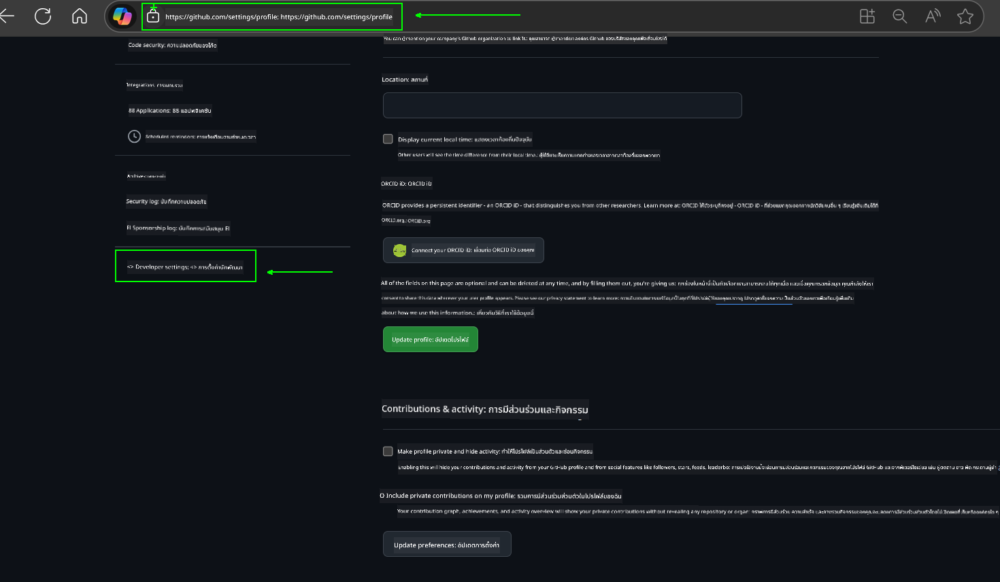
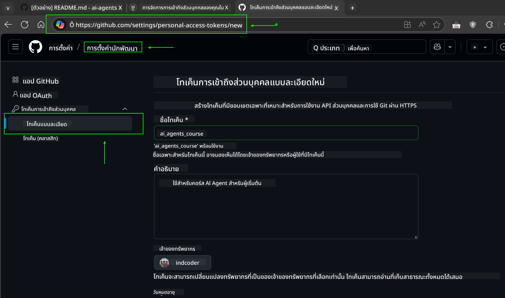
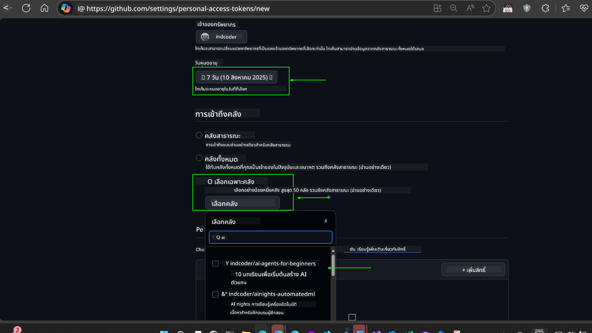
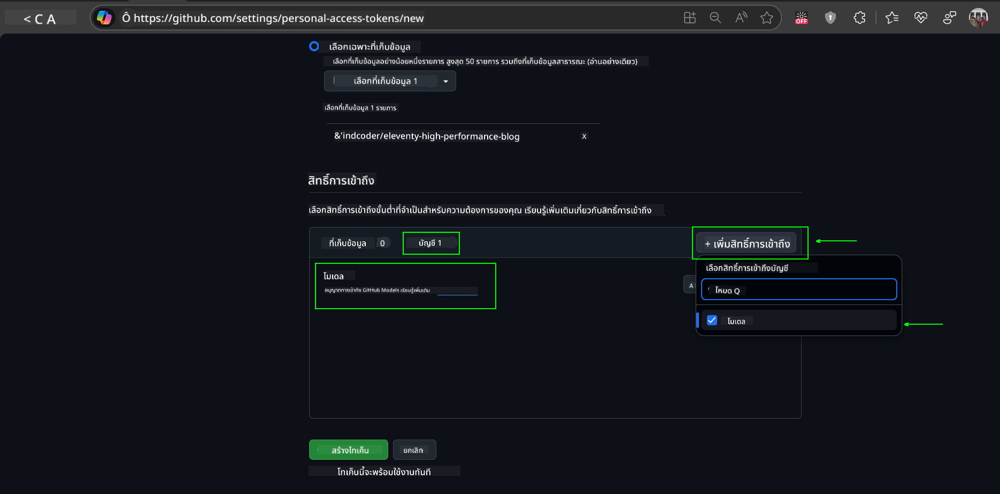
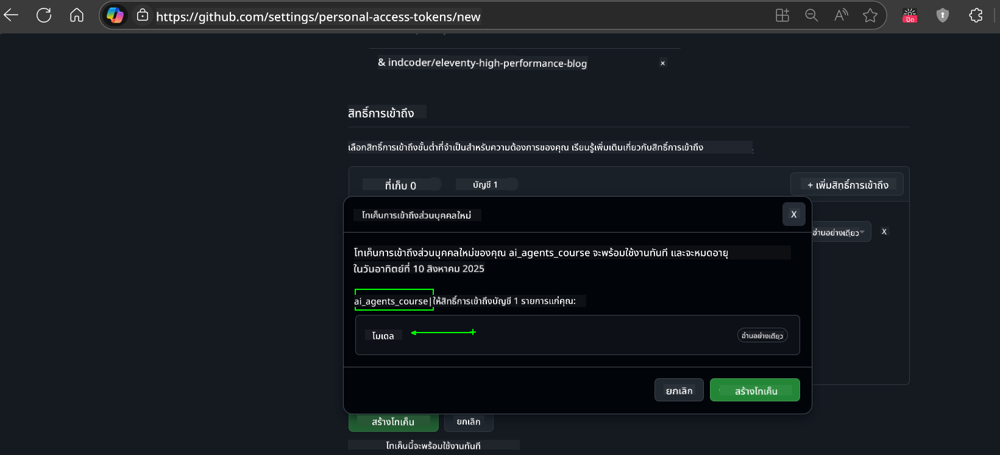
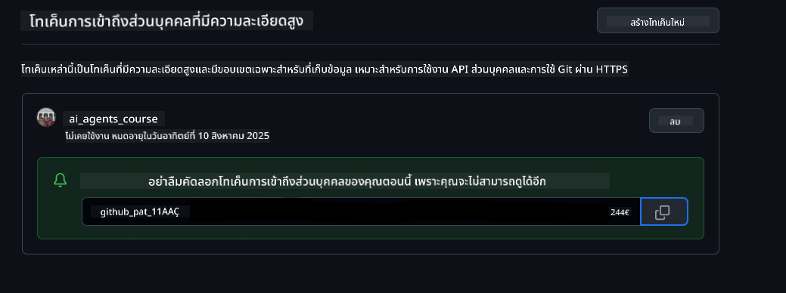
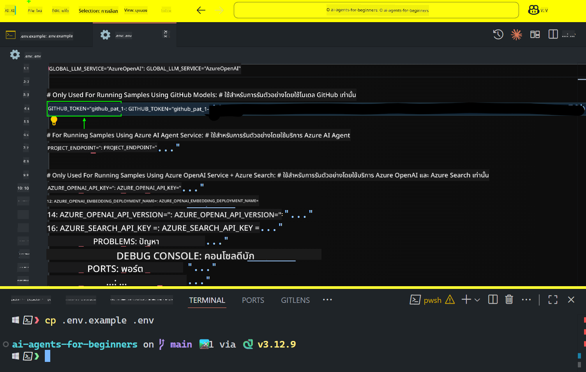

<!--
CO_OP_TRANSLATOR_METADATA:
{
  "original_hash": "c55b973b1562abf5aadf6a4028265ac5",
  "translation_date": "2025-08-29T15:11:02+00:00",
  "source_file": "00-course-setup/README.md",
  "language_code": "th"
}
-->
# การตั้งค่าคอร์ส

## บทนำ

บทเรียนนี้จะครอบคลุมวิธีการรันตัวอย่างโค้ดของคอร์สนี้

## เข้าร่วมกับผู้เรียนคนอื่นและขอความช่วยเหลือ

ก่อนที่คุณจะเริ่มโคลน repo ของคุณ เข้าร่วม [AI Agents For Beginners Discord channel](https://aka.ms/ai-agents/discord) เพื่อขอความช่วยเหลือเกี่ยวกับการตั้งค่า ถามคำถามเกี่ยวกับคอร์ส หรือเชื่อมต่อกับผู้เรียนคนอื่น ๆ

## โคลนหรือ Fork Repo นี้

เริ่มต้นโดยการโคลนหรือ fork GitHub Repository นี้ เพื่อสร้างเวอร์ชันของคอร์สที่เป็นของคุณเอง เพื่อให้คุณสามารถรัน ทดสอบ และปรับแต่งโค้ดได้!

คุณสามารถทำได้โดยคลิกลิงก์ไปยัง

คุณควรมีเวอร์ชัน fork ของคอร์สนี้ในลิงก์ต่อไปนี้:


## การรันโค้ด

คอร์สนี้มี Jupyter Notebooks หลายตัวที่คุณสามารถรันเพื่อสัมผัสประสบการณ์การสร้าง AI Agents ด้วยตัวเอง

ตัวอย่างโค้ดใช้:

**ต้องมีบัญชี GitHub - ฟรี**:

1) Semantic Kernel Agent Framework + GitHub Models Marketplace ระบุว่า (semantic-kernel.ipynb)  
2) AutoGen Framework + GitHub Models Marketplace ระบุว่า (autogen.ipynb)

**ต้องมีการสมัครสมาชิก Azure**:  
3) Azure AI Foundry + Azure AI Agent Service ระบุว่า (azureaiagent.ipynb)

เราแนะนำให้คุณลองตัวอย่างทั้งสามประเภทเพื่อดูว่าแบบใดเหมาะกับคุณที่สุด

ตัวเลือกที่คุณเลือกจะกำหนดขั้นตอนการตั้งค่าที่คุณต้องทำตามด้านล่าง:

## ข้อกำหนด

- Python 3.12+
  - **NOTE**: หากคุณยังไม่ได้ติดตั้ง Python 3.12 ให้ติดตั้งก่อน จากนั้นสร้าง venv โดยใช้ python3.12 เพื่อให้แน่ใจว่ามีการติดตั้งเวอร์ชันที่ถูกต้องจากไฟล์ requirements.txt
- บัญชี GitHub - สำหรับการเข้าถึง GitHub Models Marketplace
- การสมัครสมาชิก Azure - สำหรับการเข้าถึง Azure AI Foundry
- บัญชี Azure AI Foundry - สำหรับการเข้าถึง Azure AI Agent Service

เราได้รวมไฟล์ `requirements.txt` ไว้ใน root ของ repository นี้ ซึ่งมีแพ็กเกจ Python ที่จำเป็นทั้งหมดสำหรับการรันตัวอย่างโค้ด

คุณสามารถติดตั้งได้โดยรันคำสั่งต่อไปนี้ใน terminal ที่ root ของ repository:

```bash
pip install -r requirements.txt
```

เราแนะนำให้สร้าง Python virtual environment เพื่อหลีกเลี่ยงปัญหาความขัดแย้งใด ๆ

## การตั้งค่า VSCode

ตรวจสอบให้แน่ใจว่าคุณใช้เวอร์ชัน Python ที่ถูกต้องใน VSCode


## การตั้งค่าสำหรับตัวอย่างที่ใช้ GitHub Models

### ขั้นตอนที่ 1: ดึง GitHub Personal Access Token (PAT) ของคุณ

คอร์สนี้ใช้ GitHub Models Marketplace ซึ่งให้การเข้าถึง Large Language Models (LLMs) ฟรีที่คุณจะใช้ในการสร้าง AI Agents

ในการใช้ GitHub Models คุณจะต้องสร้าง [GitHub Personal Access Token](https://docs.github.com/en/authentication/keeping-your-account-and-data-secure/managing-your-personal-access-tokens)

คุณสามารถทำได้โดยไปที่บัญชี GitHub ของคุณ

โปรดปฏิบัติตาม [หลักการของ Least Privilege](https://docs.github.com/en/get-started/learning-to-code/storing-your-secrets-safely) เมื่อสร้างโทเค็นของคุณ ซึ่งหมายความว่าคุณควรให้สิทธิ์โทเค็นเฉพาะที่จำเป็นสำหรับการรันตัวอย่างโค้ดในคอร์สนี้เท่านั้น

1. เลือกตัวเลือก `Fine-grained tokens` ทางด้านซ้ายของหน้าจอโดยไปที่ **Developer settings**  
   

   จากนั้นเลือก `Generate new token`

   

2. ใส่ชื่อที่อธิบายถึงโทเค็นของคุณเพื่อสะท้อนถึงวัตถุประสงค์ ทำให้ง่ายต่อการระบุในภายหลัง

    🔐 **คำแนะนำเกี่ยวกับระยะเวลาของโทเค็น**  
    ระยะเวลาที่แนะนำ: 30 วัน  
    หากต้องการเพิ่มความปลอดภัย คุณสามารถเลือกช่วงเวลาที่สั้นกว่า เช่น 7 วัน 🛡️  
    นี่เป็นวิธีที่ดีในการตั้งเป้าหมายส่วนตัวและทำคอร์สให้เสร็จในขณะที่คุณยังมีแรงจูงใจในการเรียนรู้ 🚀

    

3. จำกัดขอบเขตของโทเค็นให้เฉพาะ fork ของ repository นี้

    

4. จำกัดสิทธิ์ของโทเค็น: ภายใต้ **Permissions** คลิกแท็บ **Account** และคลิกปุ่ม "+ Add permissions" จะมี dropdown ปรากฏขึ้น ค้นหา **Models** และทำเครื่องหมายในช่อง

    

5. ตรวจสอบสิทธิ์ที่จำเป็นก่อนสร้างโทเค็น  
   

6. ก่อนสร้างโทเค็น ตรวจสอบให้แน่ใจว่าคุณพร้อมที่จะเก็บโทเค็นในที่ปลอดภัย เช่น password manager vault เนื่องจากโทเค็นจะไม่แสดงอีกหลังจากที่คุณสร้างมันแล้ว  
   

คัดลอกโทเค็นใหม่ที่คุณเพิ่งสร้างขึ้น ตอนนี้คุณจะเพิ่มโทเค็นนี้ลงในไฟล์ `.env` ที่รวมอยู่ในคอร์สนี้

### ขั้นตอนที่ 2: สร้างไฟล์ `.env` ของคุณ

เพื่อสร้างไฟล์ `.env` ให้รันคำสั่งต่อไปนี้ใน terminal ของคุณ

```bash
cp .env.example .env
```

คำสั่งนี้จะคัดลอกไฟล์ตัวอย่างและสร้าง `.env` ในไดเรกทอรีของคุณ ซึ่งคุณจะเติมค่าของ environment variables

เมื่อคุณคัดลอกโทเค็นแล้ว ให้เปิดไฟล์ `.env` ใน text editor ที่คุณชื่นชอบและวางโทเค็นลงในฟิลด์ `GITHUB_TOKEN`  


ตอนนี้คุณควรจะสามารถรันตัวอย่างโค้ดในคอร์สนี้ได้แล้ว

## การตั้งค่าสำหรับตัวอย่างที่ใช้ Azure AI Foundry และ Azure AI Agent Service

### ขั้นตอนที่ 1: ดึง Azure Project Endpoint ของคุณ

ทำตามขั้นตอนการสร้าง hub และ project ใน Azure AI Foundry ได้ที่นี่: [Hub resources overview](https://learn.microsoft.com/en-us/azure/ai-foundry/concepts/ai-resources)

เมื่อคุณสร้างโปรเจกต์เสร็จแล้ว คุณจะต้องดึง connection string สำหรับโปรเจกต์ของคุณ

คุณสามารถทำได้โดยไปที่หน้า **Overview** ของโปรเจกต์ใน Azure AI Foundry portal


### ขั้นตอนที่ 2: สร้างไฟล์ `.env` ของคุณ

เพื่อสร้างไฟล์ `.env` ให้รันคำสั่งต่อไปนี้ใน terminal ของคุณ

```bash
cp .env.example .env
```

คำสั่งนี้จะคัดลอกไฟล์ตัวอย่างและสร้าง `.env` ในไดเรกทอรีของคุณ ซึ่งคุณจะเติมค่าของ environment variables

เมื่อคุณคัดลอกโทเค็นแล้ว ให้เปิดไฟล์ `.env` ใน text editor ที่คุณชื่นชอบและวางโทเค็นลงในฟิลด์ `PROJECT_ENDPOINT`

### ขั้นตอนที่ 3: ลงชื่อเข้าใช้ Azure

เพื่อความปลอดภัยที่ดีที่สุด เราจะใช้ [keyless authentication](https://learn.microsoft.com/azure/developer/ai/keyless-connections?tabs=csharp%2Cazure-cli?WT.mc_id=academic-105485-koreyst) เพื่อยืนยันตัวตนกับ Azure OpenAI ด้วย Microsoft Entra ID

จากนั้นเปิด terminal และรัน `az login --use-device-code` เพื่อเข้าสู่บัญชี Azure ของคุณ

เมื่อคุณเข้าสู่ระบบแล้ว ให้เลือก subscription ของคุณใน terminal

## Environment Variables เพิ่มเติม - Azure Search และ Azure OpenAI

สำหรับบทเรียน Agentic RAG - บทที่ 5 มีตัวอย่างที่ใช้ Azure Search และ Azure OpenAI

หากคุณต้องการรันตัวอย่างเหล่านี้ คุณจะต้องเพิ่ม environment variables ต่อไปนี้ในไฟล์ `.env` ของคุณ:

### หน้า Overview (Project)

- `AZURE_SUBSCRIPTION_ID` - ตรวจสอบ **Project details** ในหน้า **Overview** ของโปรเจกต์ของคุณ

- `AZURE_AI_PROJECT_NAME` - ดูที่ด้านบนของหน้า **Overview** ของโปรเจกต์ของคุณ

- `AZURE_OPENAI_SERVICE` - ค้นหาในแท็บ **Included capabilities** สำหรับ **Azure OpenAI Service** ในหน้า **Overview**

### Management Center

- `AZURE_OPENAI_RESOURCE_GROUP` - ไปที่ **Project properties** ในหน้า **Overview** ของ **Management Center**

- `GLOBAL_LLM_SERVICE` - ภายใต้ **Connected resources** ค้นหาชื่อการเชื่อมต่อ **Azure AI Services** หากไม่พบ ให้ตรวจสอบใน **Azure portal** ภายใต้ resource group ของคุณสำหรับชื่อทรัพยากร AI Services

### หน้า Models + Endpoints

- `AZURE_OPENAI_EMBEDDING_DEPLOYMENT_NAME` - เลือกรุ่น embedding ของคุณ (เช่น `text-embedding-ada-002`) และจดชื่อ **Deployment name** จากรายละเอียดของรุ่น

- `AZURE_OPENAI_CHAT_DEPLOYMENT_NAME` - เลือกรุ่น chat ของคุณ (เช่น `gpt-4o-mini`) และจดชื่อ **Deployment name** จากรายละเอียดของรุ่น

### Azure Portal

- `AZURE_OPENAI_ENDPOINT` - ค้นหา **Azure AI services** คลิกที่มัน จากนั้นไปที่ **Resource Management**, **Keys and Endpoint**, เลื่อนลงไปที่ "Azure OpenAI endpoints" และคัดลอก endpoint ที่ระบุว่า "Language APIs"

- `AZURE_OPENAI_API_KEY` - จากหน้าจอเดียวกัน คัดลอก KEY 1 หรือ KEY 2

- `AZURE_SEARCH_SERVICE_ENDPOINT` - ค้นหา **Azure AI Search** resource ของคุณ คลิกที่มัน และดูที่ **Overview**

- `AZURE_SEARCH_API_KEY` - จากนั้นไปที่ **Settings** และ **Keys** เพื่อคัดลอก primary หรือ secondary admin key

### External Webpage

- `AZURE_OPENAI_API_VERSION` - เยี่ยมชมหน้า [API version lifecycle](https://learn.microsoft.com/en-us/azure/ai-services/openai/api-version-deprecation#latest-ga-api-release) ภายใต้ **Latest GA API release**

### ตั้งค่า keyless authentication

แทนที่จะ hardcode credentials ของคุณ เราจะใช้ keyless connection กับ Azure OpenAI โดยการ import `DefaultAzureCredential` และเรียกใช้ฟังก์ชัน `DefaultAzureCredential` เพื่อรับ credential

```python
from azure.identity import DefaultAzureCredential, InteractiveBrowserCredential
```

## ติดปัญหาที่ไหนหรือเปล่า?

หากคุณมีปัญหาในการรันการตั้งค่านี้ เข้าร่วมใน

## บทเรียนถัดไป

ตอนนี้คุณพร้อมที่จะรันโค้ดสำหรับคอร์สนี้แล้ว ขอให้สนุกกับการเรียนรู้เพิ่มเติมเกี่ยวกับโลกของ AI Agents!

[Introduction to AI Agents and Agent Use Cases](../01-intro-to-ai-agents/README.md)

---

**ข้อจำกัดความรับผิดชอบ**:  
เอกสารนี้ได้รับการแปลโดยใช้บริการแปลภาษา AI [Co-op Translator](https://github.com/Azure/co-op-translator) แม้ว่าเราจะพยายามให้การแปลมีความถูกต้อง แต่โปรดทราบว่าการแปลอัตโนมัติอาจมีข้อผิดพลาดหรือความไม่แม่นยำ เอกสารต้นฉบับในภาษาต้นทางควรถือเป็นแหล่งข้อมูลที่เชื่อถือได้ สำหรับข้อมูลที่สำคัญ แนะนำให้ใช้บริการแปลภาษาจากผู้เชี่ยวชาญ เราไม่รับผิดชอบต่อความเข้าใจผิดหรือการตีความที่ผิดพลาดซึ่งเกิดจากการใช้การแปลนี้