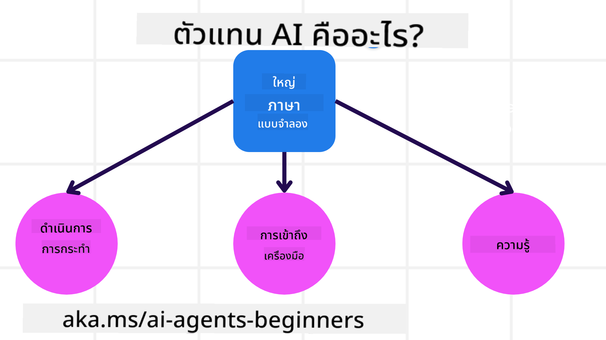
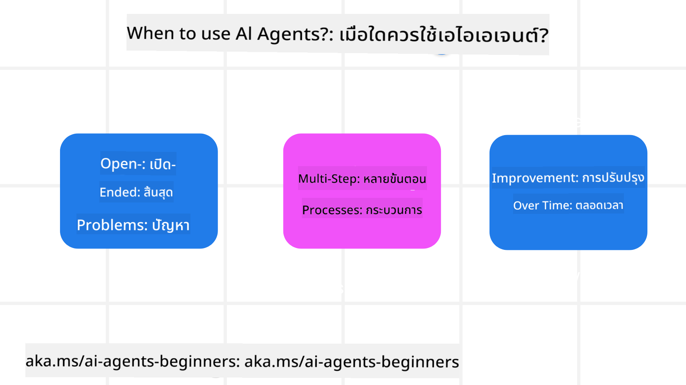

<!--
CO_OP_TRANSLATOR_METADATA:
{
  "original_hash": "d84943abc8f001ad4670418d32c2d899",
  "translation_date": "2025-07-12T08:07:19+00:00",
  "source_file": "01-intro-to-ai-agents/README.md",
  "language_code": "th"
}
-->
เพื่อพบปะผู้เรียนและผู้สร้าง AI Agent คนอื่น ๆ และสอบถามคำถามใด ๆ ที่คุณมีเกี่ยวกับคอร์สนี้

เพื่อเริ่มต้นคอร์สนี้ เราจะเริ่มด้วยการทำความเข้าใจให้ดียิ่งขึ้นว่า AI Agents คืออะไร และเราจะใช้พวกมันในแอปพลิเคชันและเวิร์กโฟลว์ที่เราสร้างอย่างไร

## บทนำ

บทเรียนนี้ครอบคลุม:

- AI Agents คืออะไร และมีประเภทของเอเจนต์ต่าง ๆ อะไรบ้าง?
- กรณีการใช้งานใดที่เหมาะสมที่สุดสำหรับ AI Agents และพวกมันช่วยเราได้อย่างไร?
- องค์ประกอบพื้นฐานบางอย่างในการออกแบบโซลูชันแบบ Agentic คืออะไร?

## เป้าหมายการเรียนรู้
หลังจากเรียนบทเรียนนี้เสร็จ คุณควรจะสามารถ:

- เข้าใจแนวคิดของ AI Agent และความแตกต่างจากโซลูชัน AI อื่น ๆ
- ใช้ AI Agents อย่างมีประสิทธิภาพสูงสุด
- ออกแบบโซลูชันแบบ Agentic อย่างมีประสิทธิผลสำหรับทั้งผู้ใช้และลูกค้า

## การนิยาม AI Agents และประเภทของ AI Agents

### AI Agents คืออะไร?

AI Agents คือ **ระบบ** ที่ช่วยให้ **Large Language Models (LLMs)** สามารถ **ดำเนินการต่าง ๆ** ได้โดยการขยายความสามารถของพวกมันด้วยการให้ LLMs **เข้าถึงเครื่องมือ** และ **ความรู้**

เรามาแยกคำจำกัดความนี้ออกเป็นส่วนย่อย ๆ:

- **ระบบ** - สิ่งสำคัญคือต้องคิดว่าเอเจนต์ไม่ใช่แค่ส่วนประกอบเดียว แต่เป็นระบบที่ประกอบด้วยหลายส่วน ในระดับพื้นฐาน ส่วนประกอบของ AI Agent ได้แก่:
  - **สภาพแวดล้อม** - พื้นที่ที่กำหนดซึ่ง AI Agent ทำงานอยู่ เช่น ถ้าเรามี AI Agent สำหรับจองทริป สภาพแวดล้อมอาจเป็นระบบจองทริปที่ AI Agent ใช้ในการทำงานให้เสร็จ
  - **เซ็นเซอร์** - สภาพแวดล้อมมีข้อมูลและให้ข้อมูลตอบกลับ AI Agents ใช้เซ็นเซอร์เพื่อรวบรวมและตีความข้อมูลเกี่ยวกับสถานะปัจจุบันของสภาพแวดล้อม ในตัวอย่าง Travel Booking Agent ระบบจองทริปสามารถให้ข้อมูลเช่น ความพร้อมของโรงแรมหรือราคาตั๋วเครื่องบิน
  - **แอคชูเอเตอร์** - เมื่อ AI Agent ได้รับสถานะปัจจุบันของสภาพแวดล้อมแล้ว สำหรับงานปัจจุบันเอเจนต์จะกำหนดว่าควรทำอะไรเพื่อเปลี่ยนแปลงสภาพแวดล้อม ในกรณีของ travel booking agent อาจเป็นการจองห้องว่างให้กับผู้ใช้

**Large Language Models** - แนวคิดของเอเจนต์มีมาก่อนการสร้าง LLMs ข้อได้เปรียบของการสร้าง AI Agents ด้วย LLMs คือความสามารถในการตีความภาษามนุษย์และข้อมูล ความสามารถนี้ช่วยให้ LLMs สามารถตีความข้อมูลจากสภาพแวดล้อมและกำหนดแผนเพื่อเปลี่ยนแปลงสภาพแวดล้อมได้

**ดำเนินการ** - นอกเหนือจากระบบ AI Agent แล้ว LLMs จะถูกจำกัดให้อยู่ในสถานการณ์ที่การดำเนินการคือการสร้างเนื้อหาหรือข้อมูลตามคำสั่งของผู้ใช้ แต่ในระบบ AI Agent LLMs สามารถทำงานให้สำเร็จได้โดยการตีความคำขอของผู้ใช้และใช้เครื่องมือที่มีในสภาพแวดล้อมของพวกมัน

**เข้าถึงเครื่องมือ** - เครื่องมือที่ LLM เข้าถึงได้ถูกกำหนดโดย 1) สภาพแวดล้อมที่มันทำงานอยู่ และ 2) ผู้พัฒนา AI Agent สำหรับตัวอย่าง travel agent เครื่องมือของเอเจนต์ถูกจำกัดโดยการดำเนินการที่มีในระบบจอง และ/หรือผู้พัฒนาสามารถจำกัดการเข้าถึงเครื่องมือของเอเจนต์ให้เฉพาะเที่ยวบินได้

**หน่วยความจำ+ความรู้** - หน่วยความจำอาจเป็นระยะสั้นในบริบทของการสนทนาระหว่างผู้ใช้กับเอเจนต์ ในระยะยาว นอกเหนือจากข้อมูลที่สภาพแวดล้อมให้มา AI Agents ยังสามารถดึงความรู้จากระบบอื่น ๆ บริการ เครื่องมือ และแม้แต่เอเจนต์อื่น ๆ ได้ ในตัวอย่าง travel agent ความรู้นี้อาจเป็นข้อมูลเกี่ยวกับความชอบการเดินทางของผู้ใช้ที่เก็บไว้ในฐานข้อมูลลูกค้า

### ประเภทของเอเจนต์ต่าง ๆ

ตอนนี้ที่เรามีคำจำกัดความทั่วไปของ AI Agents แล้ว มาดูประเภทเอเจนต์เฉพาะและวิธีการนำไปใช้กับ travel booking AI agent กัน

| **ประเภทเอเจนต์**             | **คำอธิบาย**                                                                                                                        | **ตัวอย่าง**                                                                                                                                                                                                                  |
| ----------------------------- | ---------------------------------------------------------------------------------------------------------------------------------- | ---------------------------------------------------------------------------------------------------------------------------------------------------------------------------------------------------------------------------- |
| **Simple Reflex Agents**      | ดำเนินการทันทีตามกฎที่กำหนดไว้ล่วงหน้า                                                                                         | Travel agent ตีความบริบทของอีเมลและส่งต่อคำร้องเรียนเกี่ยวกับการเดินทางไปยังฝ่ายบริการลูกค้า                                                                                                                             |
| **Model-Based Reflex Agents** | ดำเนินการตามแบบจำลองของโลกและการเปลี่ยนแปลงในแบบจำลองนั้น                                                                         | Travel agent ให้ความสำคัญกับเส้นทางที่มีการเปลี่ยนแปลงราคามากโดยอิงจากการเข้าถึงข้อมูลราคาย้อนหลัง                                                                                                                     |
| **Goal-Based Agents**         | สร้างแผนเพื่อบรรลุเป้าหมายเฉพาะโดยตีความเป้าหมายและกำหนดการดำเนินการเพื่อไปถึงเป้าหมายนั้น                                      | Travel agent จองการเดินทางโดยกำหนดการจัดเตรียมการเดินทางที่จำเป็น (รถยนต์ ขนส่งสาธารณะ เที่ยวบิน) จากตำแหน่งปัจจุบันไปยังจุดหมาย                                                                                          |
| **Utility-Based Agents**      | พิจารณาความชอบและชั่งน้ำหนักการแลกเปลี่ยนเชิงตัวเลขเพื่อกำหนดวิธีการบรรลุเป้าหมาย                                               | Travel agent เพิ่มประโยชน์สูงสุดโดยชั่งน้ำหนักความสะดวกสบายกับค่าใช้จ่ายเมื่อจองการเดินทาง                                                                                                                                |
| **Learning Agents**           | ปรับปรุงตัวเองเมื่อเวลาผ่านไปโดยตอบสนองต่อข้อเสนอแนะและปรับการดำเนินการตามนั้น                                                    | Travel agent ปรับปรุงโดยใช้ข้อเสนอแนะจากลูกค้าจากแบบสำรวจหลังการเดินทางเพื่อปรับปรุงการจองในอนาคต                                                                                                                        |
| **Hierarchical Agents**       | มีหลายเอเจนต์ในระบบแบบชั้น โดยเอเจนต์ระดับสูงจะแบ่งงานออกเป็นงานย่อยสำหรับเอเจนต์ระดับต่ำให้ทำงานเสร็จ                             | Travel agent ยกเลิกทริปโดยแบ่งงานออกเป็นงานย่อย (เช่น ยกเลิกการจองเฉพาะ) และให้เอเจนต์ระดับต่ำทำงานเหล่านั้นเสร็จแล้วรายงานกลับไปยังเอเจนต์ระดับสูง                                                                                 |
| **Multi-Agent Systems (MAS)** | เอเจนต์ทำงานเสร็จอย่างอิสระ ทั้งแบบร่วมมือหรือแข่งขันกัน                                                                         | ร่วมมือ: เอเจนต์หลายตัวจองบริการเดินทางเฉพาะ เช่น โรงแรม เที่ยวบิน และความบันเทิง แข่งขัน: เอเจนต์หลายตัวจัดการและแข่งขันกันในปฏิทินการจองโรงแรมร่วมเพื่อจองลูกค้าเข้าพักโรงแรมเดียวกัน                                            |

## เมื่อใดควรใช้ AI Agents

ในส่วนก่อนหน้า เราใช้กรณีการใช้งาน Travel Agent เพื่ออธิบายว่าเอเจนต์ประเภทต่าง ๆ สามารถใช้ในสถานการณ์ต่าง ๆ ของการจองทริปได้อย่างไร เราจะใช้แอปพลิเคชันนี้ต่อไปตลอดคอร์ส

มาดูประเภทของกรณีการใช้งานที่ AI Agents เหมาะสมที่สุด:

- **ปัญหาที่เปิดกว้าง** - ให้ LLM กำหนดขั้นตอนที่จำเป็นในการทำงานให้เสร็จ เพราะไม่สามารถเขียนโค้ดตายตัวในเวิร์กโฟลว์ได้เสมอไป
- **กระบวนการหลายขั้นตอน** - งานที่ต้องการความซับซ้อนในระดับที่ AI Agent ต้องใช้เครื่องมือหรือข้อมูลหลายรอบ ไม่ใช่แค่ดึงข้อมูลครั้งเดียว
- **การปรับปรุงเมื่อเวลาผ่านไป** - งานที่เอเจนต์สามารถปรับปรุงตัวเองได้เมื่อเวลาผ่านไปโดยรับข้อเสนอแนะจากสภาพแวดล้อมหรือผู้ใช้เพื่อให้บริการได้ดีขึ้น

เราจะพูดถึงข้อควรพิจารณาเพิ่มเติมเกี่ยวกับการใช้ AI Agents ในบทเรียน Building Trustworthy AI Agents

## พื้นฐานของโซลูชันแบบ Agentic

### การพัฒนาเอเจนต์

ขั้นตอนแรกในการออกแบบระบบ AI Agent คือการกำหนดเครื่องมือ การดำเนินการ และพฤติกรรม ในคอร์สนี้ เราจะเน้นการใช้ **Azure AI Agent Service** เพื่อกำหนดเอเจนต์ของเรา ซึ่งมีฟีเจอร์เช่น:

- การเลือกโมเดลเปิด เช่น OpenAI, Mistral และ Llama
- การใช้ข้อมูลที่ได้รับอนุญาตผ่านผู้ให้บริการ เช่น Tripadvisor
- การใช้เครื่องมือ OpenAPI 3.0 มาตรฐาน

### รูปแบบ Agentic

การสื่อสารกับ LLMs ผ่านการส่งคำสั่ง (prompts) เนื่องจาก AI Agents มีลักษณะกึ่งอัตโนมัติ จึงไม่สามารถหรือไม่จำเป็นต้องส่งคำสั่งใหม่ด้วยมือทุกครั้งหลังจากมีการเปลี่ยนแปลงในสภาพแวดล้อม เราจึงใช้ **รูปแบบ Agentic** ที่ช่วยให้เราส่งคำสั่งไปยัง LLM หลายขั้นตอนได้อย่างมีประสิทธิภาพมากขึ้น

คอร์สนี้แบ่งออกเป็นรูปแบบ Agentic ที่ได้รับความนิยมในปัจจุบันบางส่วน

### เฟรมเวิร์ก Agentic

เฟรมเวิร์ก Agentic ช่วยให้นักพัฒนาสามารถนำรูปแบบ Agentic ไปใช้ผ่านโค้ด เฟรมเวิร์กเหล่านี้มีเทมเพลต ปลั๊กอิน และเครื่องมือสำหรับการทำงานร่วมกันของ AI Agent ที่ดีขึ้น ซึ่งช่วยให้สามารถสังเกตและแก้ไขปัญหาระบบ AI Agent ได้ดีขึ้น

ในคอร์สนี้ เราจะสำรวจเฟรมเวิร์ก AutoGen ที่เน้นงานวิจัย และเฟรมเวิร์ก Agent ที่พร้อมใช้งานจริงจาก Semantic Kernel

## บทเรียนก่อนหน้า

[Course Setup](../00-course-setup/README.md)

## บทเรียนถัดไป

[Exploring Agentic Frameworks](../02-explore-agentic-frameworks/README.md)

**ข้อจำกัดความรับผิดชอบ**:  
เอกสารนี้ได้รับการแปลโดยใช้บริการแปลภาษาอัตโนมัติ [Co-op Translator](https://github.com/Azure/co-op-translator) แม้เราจะพยายามให้ความถูกต้องสูงสุด แต่โปรดทราบว่าการแปลอัตโนมัติอาจมีข้อผิดพลาดหรือความไม่ถูกต้อง เอกสารต้นฉบับในภาษาต้นทางถือเป็นแหล่งข้อมูลที่เชื่อถือได้ สำหรับข้อมูลที่สำคัญ ขอแนะนำให้ใช้บริการแปลโดยผู้เชี่ยวชาญมนุษย์ เราไม่รับผิดชอบต่อความเข้าใจผิดหรือการตีความผิดใด ๆ ที่เกิดจากการใช้การแปลนี้