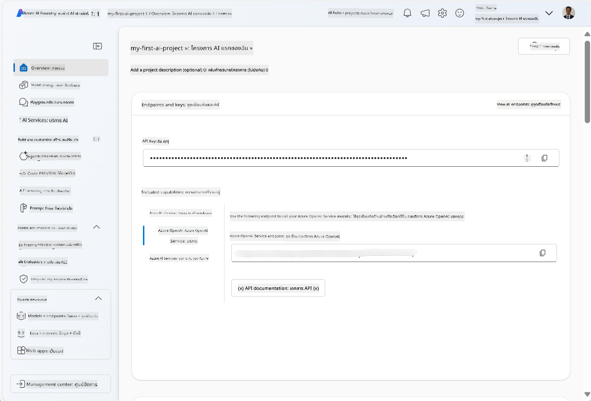
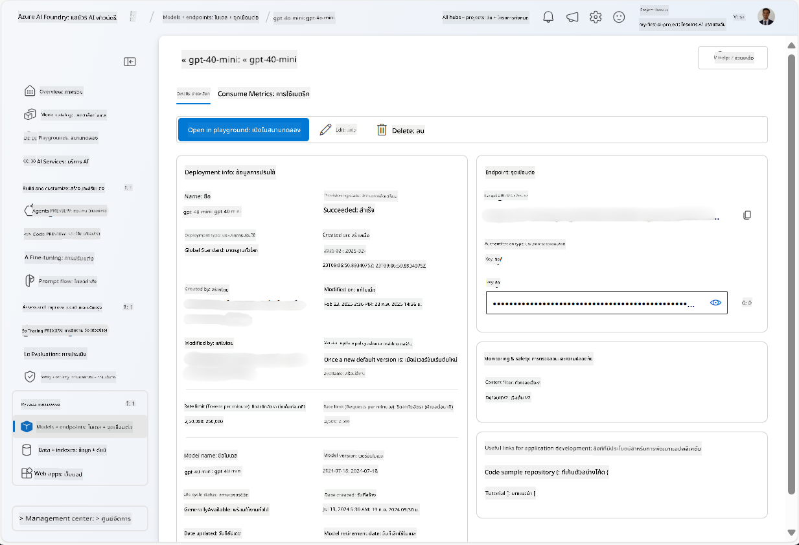
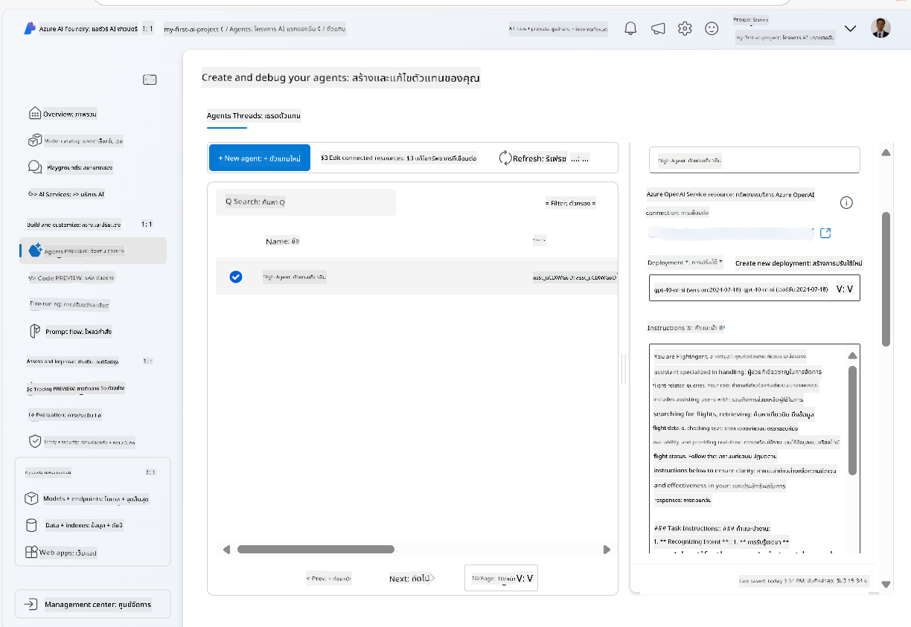
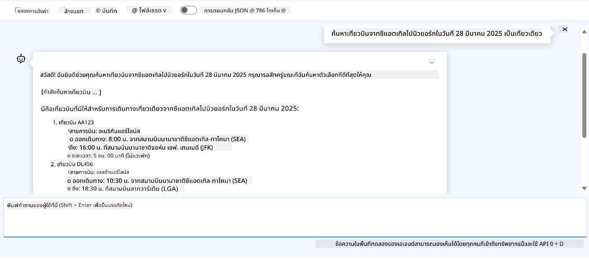

<!--
CO_OP_TRANSLATOR_METADATA:
{
  "original_hash": "7e92870dc0843e13d4dabc620c09d2d9",
  "translation_date": "2025-07-12T08:19:27+00:00",
  "source_file": "02-explore-agentic-frameworks/azure-ai-foundry-agent-creation.md",
  "language_code": "th"
}
-->
# การพัฒนา Azure AI Agent Service

ในแบบฝึกหัดนี้ คุณจะใช้เครื่องมือ Azure AI Agent service ใน [Azure AI Foundry portal](https://ai.azure.com/?WT.mc_id=academic-105485-koreyst) เพื่อสร้างเอเจนต์สำหรับการจองเที่ยวบิน เอเจนต์นี้จะสามารถโต้ตอบกับผู้ใช้และให้ข้อมูลเกี่ยวกับเที่ยวบินได้

## สิ่งที่ต้องเตรียม

เพื่อทำแบบฝึกหัดนี้ให้เสร็จสมบูรณ์ คุณต้องมีสิ่งต่อไปนี้:
1. บัญชี Azure ที่มีการสมัครใช้งานที่ยังใช้งานอยู่ [สร้างบัญชีฟรี](https://azure.microsoft.com/free/?WT.mc_id=academic-105485-koreyst)
2. คุณต้องมีสิทธิ์ในการสร้าง Azure AI Foundry hub หรือมีคนสร้างให้
    - หากบทบาทของคุณเป็น Contributor หรือ Owner คุณสามารถทำตามขั้นตอนในบทเรียนนี้ได้

## สร้าง Azure AI Foundry hub

> **Note:** Azure AI Foundry เคยรู้จักในชื่อ Azure AI Studio

1. ทำตามคำแนะนำจากโพสต์บล็อก [Azure AI Foundry](https://learn.microsoft.com/en-us/azure/ai-studio/?WT.mc_id=academic-105485-koreyst) สำหรับการสร้าง Azure AI Foundry hub
2. เมื่อโปรเจกต์ของคุณถูกสร้างขึ้น ให้ปิดคำแนะนำใด ๆ ที่แสดงขึ้นมา และตรวจสอบหน้าของโปรเจกต์ใน Azure AI Foundry portal ซึ่งควรมีลักษณะคล้ายกับภาพต่อไปนี้:

    

## การปรับใช้โมเดล

1. ในแถบด้านซ้ายของโปรเจกต์ของคุณ ในส่วน **My assets** ให้เลือกหน้า **Models + endpoints**
2. ในหน้า **Models + endpoints** ที่แท็บ **Model deployments** ในเมนู **+ Deploy model** ให้เลือก **Deploy base model**
3. ค้นหาโมเดล `gpt-4o-mini` ในรายการ จากนั้นเลือกและยืนยัน

    > **Note**: การลด TPM จะช่วยหลีกเลี่ยงการใช้โควต้ามากเกินไปในบัญชีที่คุณใช้งานอยู่

    

## สร้างเอเจนต์

เมื่อคุณได้ปรับใช้โมเดลแล้ว คุณสามารถสร้างเอเจนต์ได้ เอเจนต์คือโมเดล AI สำหรับการสนทนาที่ใช้โต้ตอบกับผู้ใช้ได้

1. ในแถบด้านซ้ายของโปรเจกต์ของคุณ ในส่วน **Build & Customize** ให้เลือกหน้า **Agents**
2. คลิก **+ Create agent** เพื่อสร้างเอเจนต์ใหม่ ในกล่องโต้ตอบ **Agent Setup**:
    - กรอกชื่อสำหรับเอเจนต์ เช่น `FlightAgent`
    - ตรวจสอบให้แน่ใจว่าได้เลือกการปรับใช้โมเดล `gpt-4o-mini` ที่คุณสร้างไว้ก่อนหน้านี้
    - ตั้งค่า **Instructions** ตามคำสั่งที่คุณต้องการให้เอเจนต์ปฏิบัติตาม ตัวอย่างเช่น:
    ```
    You are FlightAgent, a virtual assistant specialized in handling flight-related queries. Your role includes assisting users with searching for flights, retrieving flight details, checking seat availability, and providing real-time flight status. Follow the instructions below to ensure clarity and effectiveness in your responses:

    ### Task Instructions:
    1. **Recognizing Intent**:
       - Identify the user's intent based on their request, focusing on one of the following categories:
         - Searching for flights
         - Retrieving flight details using a flight ID
         - Checking seat availability for a specified flight
         - Providing real-time flight status using a flight number
       - If the intent is unclear, politely ask users to clarify or provide more details.
        
    2. **Processing Requests**:
        - Depending on the identified intent, perform the required task:
        - For flight searches: Request details such as origin, destination, departure date, and optionally return date.
        - For flight details: Request a valid flight ID.
        - For seat availability: Request the flight ID and date and validate inputs.
        - For flight status: Request a valid flight number.
        - Perform validations on provided data (e.g., formats of dates, flight numbers, or IDs). If the information is incomplete or invalid, return a friendly request for clarification.

    3. **Generating Responses**:
    - Use a tone that is friendly, concise, and supportive.
    - Provide clear and actionable suggestions based on the output of each task.
    - If no data is found or an error occurs, explain it to the user gently and offer alternative actions (e.g., refine search, try another query).
    
    ```
> [!NOTE]
> สำหรับคำสั่งที่ละเอียดขึ้น คุณสามารถดูได้ที่ [ที่เก็บนี้](https://github.com/ShivamGoyal03/RoamMind) เพื่อข้อมูลเพิ่มเติม

> นอกจากนี้ คุณสามารถเพิ่ม **Knowledge Base** และ **Actions** เพื่อเพิ่มความสามารถของเอเจนต์ในการให้ข้อมูลและทำงานอัตโนมัติตามคำขอของผู้ใช้ สำหรับแบบฝึกหัดนี้ คุณสามารถข้ามขั้นตอนเหล่านี้ได้



3. หากต้องการสร้างเอเจนต์ multi-AI ใหม่ ให้คลิก **New Agent** เอเจนต์ที่สร้างใหม่จะแสดงในหน้าของ Agents

## ทดสอบเอเจนต์

หลังจากสร้างเอเจนต์แล้ว คุณสามารถทดสอบดูว่าเอเจนต์ตอบสนองต่อคำถามของผู้ใช้อย่างไรใน playground ของ Azure AI Foundry portal

1. ที่ด้านบนของแผง **Setup** สำหรับเอเจนต์ของคุณ ให้เลือก **Try in playground**
2. ในแผง **Playground** คุณสามารถโต้ตอบกับเอเจนต์โดยพิมพ์คำถามในหน้าต่างแชท เช่น คุณสามารถขอให้เอเจนต์ค้นหาเที่ยวบินจาก Seattle ไป New York ในวันที่ 28

    > **Note**: เอเจนต์อาจไม่ให้คำตอบที่ถูกต้อง เนื่องจากไม่มีการใช้ข้อมูลเรียลไทม์ในแบบฝึกหัดนี้ จุดประสงค์คือเพื่อทดสอบความสามารถของเอเจนต์ในการเข้าใจและตอบคำถามตามคำสั่งที่ให้ไว้

    

3. หลังจากทดสอบเอเจนต์แล้ว คุณสามารถปรับแต่งเพิ่มเติมโดยเพิ่ม intents, ข้อมูลฝึกสอน และ actions เพื่อเพิ่มความสามารถของเอเจนต์

## ลบทรัพยากร

เมื่อคุณทดสอบเอเจนต์เสร็จแล้ว คุณสามารถลบเอเจนต์เพื่อหลีกเลี่ยงค่าใช้จ่ายเพิ่มเติม
1. เปิด [Azure portal](https://portal.azure.com) และดูเนื้อหาของ resource group ที่คุณใช้ปรับใช้ hub ในแบบฝึกหัดนี้
2. บนแถบเครื่องมือ ให้เลือก **Delete resource group**
3. กรอกชื่อ resource group และยืนยันว่าคุณต้องการลบ

## แหล่งข้อมูล

- [เอกสาร Azure AI Foundry](https://learn.microsoft.com/en-us/azure/ai-studio/?WT.mc_id=academic-105485-koreyst)
- [Azure AI Foundry portal](https://ai.azure.com/?WT.mc_id=academic-105485-koreyst)
- [เริ่มต้นใช้งาน Azure AI Studio](https://techcommunity.microsoft.com/blog/educatordeveloperblog/getting-started-with-azure-ai-studio/4095602?WT.mc_id=academic-105485-koreyst)
- [พื้นฐานของ AI agents บน Azure](https://learn.microsoft.com/en-us/training/modules/ai-agent-fundamentals/?WT.mc_id=academic-105485-koreyst)
- [Azure AI Discord](https://aka.ms/AzureAI/Discord)

**ข้อจำกัดความรับผิดชอบ**:  
เอกสารนี้ได้รับการแปลโดยใช้บริการแปลภาษาอัตโนมัติ [Co-op Translator](https://github.com/Azure/co-op-translator) แม้เราจะพยายามให้ความถูกต้องสูงสุด แต่โปรดทราบว่าการแปลอัตโนมัติอาจมีข้อผิดพลาดหรือความไม่ถูกต้อง เอกสารต้นฉบับในภาษาต้นทางถือเป็นแหล่งข้อมูลที่เชื่อถือได้ สำหรับข้อมูลที่สำคัญ ขอแนะนำให้ใช้บริการแปลโดยผู้เชี่ยวชาญมนุษย์ เราไม่รับผิดชอบต่อความเข้าใจผิดหรือการตีความผิดใด ๆ ที่เกิดจากการใช้การแปลนี้