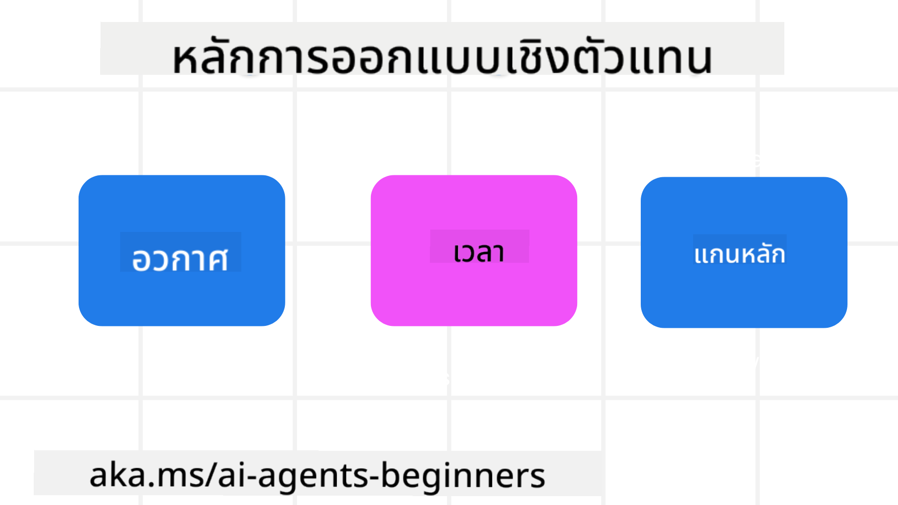

<!--
CO_OP_TRANSLATOR_METADATA:
{
  "original_hash": "4c46e4ff9e349c521e2b0b17f51afa64",
  "translation_date": "2025-08-29T15:16:56+00:00",
  "source_file": "03-agentic-design-patterns/README.md",
  "language_code": "th"
}
-->

> _(คลิกที่ภาพด้านบนเพื่อดูวิดีโอของบทเรียนนี้)_
# หลักการออกแบบ AI Agentic

## บทนำ

มีหลายวิธีในการคิดเกี่ยวกับการสร้างระบบ AI Agentic เนื่องจากความคลุมเครือเป็นคุณสมบัติที่สำคัญในงานออกแบบ Generative AI บางครั้งวิศวกรอาจพบว่ามันยากที่จะเริ่มต้น เราได้สร้างชุดหลักการออกแบบ UX ที่เน้นมนุษย์เพื่อช่วยให้นักพัฒนาสร้างระบบตัวแทนที่เน้นลูกค้าเพื่อตอบสนองความต้องการทางธุรกิจ หลักการออกแบบเหล่านี้ไม่ใช่สถาปัตยกรรมที่กำหนดไว้ แต่เป็นจุดเริ่มต้นสำหรับทีมที่กำลังนิยามและสร้างประสบการณ์ตัวแทน

โดยทั่วไป ตัวแทนควร:

- ขยายและเพิ่มขีดความสามารถของมนุษย์ (การระดมความคิด การแก้ปัญหา การทำงานอัตโนมัติ ฯลฯ)
- เติมเต็มช่องว่างความรู้ (ช่วยให้เข้าใจโดเมนความรู้ การแปล ฯลฯ)
- อำนวยความสะดวกและสนับสนุนการทำงานร่วมกันในวิธีที่เราชอบทำงานกับผู้อื่น
- ทำให้เราเป็นเวอร์ชันที่ดีกว่าของตัวเอง (เช่น โค้ชชีวิต/ผู้จัดการงาน ช่วยให้เราเรียนรู้การควบคุมอารมณ์และทักษะการมีสติ สร้างความยืดหยุ่น ฯลฯ)

## บทเรียนนี้จะครอบคลุม

- หลักการออกแบบ Agentic คืออะไร
- แนวทางที่ควรปฏิบัติเมื่อใช้หลักการออกแบบเหล่านี้
- ตัวอย่างการใช้หลักการออกแบบ

## เป้าหมายการเรียนรู้

หลังจากจบบทเรียนนี้ คุณจะสามารถ:

1. อธิบายว่าหลักการออกแบบ Agentic คืออะไร
2. อธิบายแนวทางการใช้หลักการออกแบบ Agentic
3. เข้าใจวิธีการสร้างตัวแทนโดยใช้หลักการออกแบบ Agentic

## หลักการออกแบบ Agentic

### ตัวแทน (พื้นที่)

นี่คือสภาพแวดล้อมที่ตัวแทนทำงาน หลักการเหล่านี้ช่วยให้เราออกแบบตัวแทนสำหรับการมีส่วนร่วมในโลกทางกายภาพและดิจิทัล

- **เชื่อมโยง ไม่ใช่ลดทอน** – ช่วยเชื่อมโยงผู้คนกับคนอื่น ๆ เหตุการณ์ และความรู้ที่สามารถนำไปใช้ได้ เพื่อส่งเสริมการทำงานร่วมกันและการเชื่อมต่อ
  - ตัวแทนช่วยเชื่อมโยงเหตุการณ์ ความรู้ และผู้คน
  - ตัวแทนช่วยให้ผู้คนใกล้ชิดกันมากขึ้น ไม่ได้ออกแบบมาเพื่อแทนที่หรือทำให้ผู้คนด้อยค่า
- **เข้าถึงได้ง่ายแต่บางครั้งก็ไม่ปรากฏตัว** – ตัวแทนทำงานส่วนใหญ่ในเบื้องหลังและจะกระตุ้นเราเมื่อมันเกี่ยวข้องและเหมาะสม
  - ตัวแทนสามารถค้นพบและเข้าถึงได้ง่ายสำหรับผู้ใช้ที่ได้รับอนุญาตบนอุปกรณ์หรือแพลตฟอร์มใด ๆ
  - ตัวแทนรองรับการป้อนข้อมูลและผลลัพธ์หลายรูปแบบ (เสียง ข้อความ ฯลฯ)
  - ตัวแทนสามารถเปลี่ยนระหว่างการทำงานในเบื้องหน้าและเบื้องหลังได้อย่างราบรื่น ขึ้นอยู่กับการรับรู้ความต้องการของผู้ใช้
  - ตัวแทนอาจทำงานในรูปแบบที่ไม่ปรากฏตัว แต่กระบวนการเบื้องหลังและการทำงานร่วมกับตัวแทนอื่น ๆ นั้นโปร่งใสและควบคุมได้โดยผู้ใช้

### ตัวแทน (เวลา)

นี่คือวิธีที่ตัวแทนทำงานในช่วงเวลา หลักการเหล่านี้ช่วยให้เราออกแบบตัวแทนที่มีปฏิสัมพันธ์กับอดีต ปัจจุบัน และอนาคต

- **อดีต**: สะท้อนประวัติที่รวมถึงสถานะและบริบท
  - ตัวแทนให้ผลลัพธ์ที่เกี่ยวข้องมากขึ้นโดยการวิเคราะห์ข้อมูลประวัติที่หลากหลายมากกว่าที่จะดูแค่เหตุการณ์ ผู้คน หรือสถานะ
  - ตัวแทนสร้างการเชื่อมโยงจากเหตุการณ์ในอดีตและสะท้อนความทรงจำเพื่อมีส่วนร่วมกับสถานการณ์ปัจจุบัน
- **ปัจจุบัน**: กระตุ้นมากกว่าการแจ้งเตือน
  - ตัวแทนมีวิธีการที่ครอบคลุมในการมีปฏิสัมพันธ์กับผู้คน เมื่อเหตุการณ์เกิดขึ้น ตัวแทนไปไกลกว่าการแจ้งเตือนแบบคงที่หรือรูปแบบที่เป็นทางการ ตัวแทนสามารถทำให้กระบวนการง่ายขึ้นหรือสร้างคำแนะนำแบบไดนามิกเพื่อดึงดูดความสนใจของผู้ใช้ในเวลาที่เหมาะสม
  - ตัวแทนส่งข้อมูลตามบริบท สภาพแวดล้อมทางสังคมและวัฒนธรรม และปรับให้เหมาะกับเจตนาของผู้ใช้
  - การมีปฏิสัมพันธ์กับตัวแทนสามารถค่อย ๆ พัฒนาและเติบโตในความซับซ้อนเพื่อเพิ่มพลังให้ผู้ใช้ในระยะยาว
- **อนาคต**: ปรับตัวและพัฒนา
  - ตัวแทนปรับตัวให้เข้ากับอุปกรณ์ แพลตฟอร์ม และรูปแบบต่าง ๆ
  - ตัวแทนปรับตัวให้เข้ากับพฤติกรรมของผู้ใช้ ความต้องการการเข้าถึง และสามารถปรับแต่งได้อย่างอิสระ
  - ตัวแทนถูกกำหนดรูปแบบและพัฒนาโดยการมีปฏิสัมพันธ์กับผู้ใช้อย่างต่อเนื่อง

### ตัวแทน (แกนหลัก)

นี่คือองค์ประกอบสำคัญในแกนหลักของการออกแบบตัวแทน

- **ยอมรับความไม่แน่นอนแต่สร้างความไว้วางใจ**
  - ระดับหนึ่งของความไม่แน่นอนในตัวแทนเป็นสิ่งที่คาดหวัง ความไม่แน่นอนเป็นองค์ประกอบสำคัญของการออกแบบตัวแทน
  - ความไว้วางใจและความโปร่งใสเป็นชั้นพื้นฐานของการออกแบบตัวแทน
  - มนุษย์ควบคุมได้ว่าตัวแทนจะเปิด/ปิดเมื่อใด และสถานะของตัวแทนจะมองเห็นได้ชัดเจนตลอดเวลา

## แนวทางการใช้หลักการเหล่านี้

เมื่อคุณใช้หลักการออกแบบข้างต้น ให้ปฏิบัติตามแนวทางต่อไปนี้:

1. **ความโปร่งใส**: แจ้งให้ผู้ใช้ทราบว่ามี AI เข้ามาเกี่ยวข้อง วิธีการทำงาน (รวมถึงการกระทำในอดีต) และวิธีการให้ข้อเสนอแนะและปรับเปลี่ยนระบบ
2. **การควบคุม**: ให้ผู้ใช้สามารถปรับแต่ง ระบุความชอบ และปรับเปลี่ยนระบบและคุณลักษณะต่าง ๆ ได้ (รวมถึงความสามารถในการลืม)
3. **ความสม่ำเสมอ**: มุ่งเน้นประสบการณ์ที่สม่ำเสมอและรองรับหลายรูปแบบบนอุปกรณ์และจุดเชื่อมต่อ ใช้องค์ประกอบ UI/UX ที่คุ้นเคยเมื่อเป็นไปได้ (เช่น ไอคอนไมโครโฟนสำหรับการโต้ตอบด้วยเสียง) และลดภาระทางความคิดของลูกค้าให้มากที่สุด (เช่น มุ่งเน้นการตอบกลับที่กระชับ การช่วยเหลือด้วยภาพ และเนื้อหา ‘เรียนรู้เพิ่มเติม’)

## วิธีการออกแบบตัวแทนการเดินทางโดยใช้หลักการและแนวทางเหล่านี้

ลองจินตนาการว่าคุณกำลังออกแบบตัวแทนการเดินทาง นี่คือวิธีที่คุณสามารถใช้หลักการและแนวทางการออกแบบ:

1. **ความโปร่งใส** – แจ้งให้ผู้ใช้ทราบว่าตัวแทนการเดินทางเป็นตัวแทนที่เปิดใช้งาน AI ให้คำแนะนำพื้นฐานเกี่ยวกับวิธีการเริ่มต้น (เช่น ข้อความ “สวัสดี” ตัวอย่างคำสั่ง) ระบุสิ่งนี้อย่างชัดเจนในหน้าผลิตภัณฑ์ แสดงรายการคำสั่งที่ผู้ใช้เคยถามในอดีต ทำให้ชัดเจนว่าจะแสดงความคิดเห็นได้อย่างไร (ปุ่มถูกใจและไม่ถูกใจ ปุ่มส่งความคิดเห็น ฯลฯ) ระบุอย่างชัดเจนว่าตัวแทนมีข้อจำกัดในการใช้งานหรือหัวข้อหรือไม่
2. **การควบคุม** – ทำให้ชัดเจนว่าผู้ใช้สามารถปรับเปลี่ยนตัวแทนหลังจากที่มันถูกสร้างขึ้นได้อย่างไร เช่น การตั้งค่าคำสั่งระบบ ให้ผู้ใช้เลือกได้ว่าตัวแทนจะมีความละเอียดมากแค่ไหน สไตล์การเขียน และข้อจำกัดในสิ่งที่ตัวแทนไม่ควรพูดถึง อนุญาตให้ผู้ใช้ดูและลบไฟล์หรือข้อมูล คำสั่ง และการสนทนาในอดีตที่เกี่ยวข้อง
3. **ความสม่ำเสมอ** – ตรวจสอบให้แน่ใจว่าไอคอนสำหรับการแชร์คำสั่ง เพิ่มไฟล์หรือรูปภาพ และแท็กบุคคลหรือสิ่งของนั้นเป็นมาตรฐานและจดจำได้ ใช้ไอคอนคลิปหนีบกระดาษเพื่อแสดงการอัปโหลด/แชร์ไฟล์กับตัวแทน และไอคอนรูปภาพเพื่อแสดงการอัปโหลดกราฟิก

### มีคำถามเพิ่มเติมเกี่ยวกับรูปแบบการออกแบบ AI Agentic?

เข้าร่วม [Azure AI Foundry Discord](https://aka.ms/ai-agents/discord) เพื่อพบปะกับผู้เรียนคนอื่น ๆ เข้าร่วมชั่วโมงสำนักงาน และรับคำตอบสำหรับคำถามเกี่ยวกับ AI Agents ของคุณ

## แหล่งข้อมูลเพิ่มเติม

## บทเรียนก่อนหน้า

[สำรวจกรอบงาน Agentic](../02-explore-agentic-frameworks/README.md)

## บทเรียนถัดไป

[รูปแบบการออกแบบการใช้เครื่องมือ](../04-tool-use/README.md)

---

**ข้อจำกัดความรับผิดชอบ**:  
เอกสารนี้ได้รับการแปลโดยใช้บริการแปลภาษา AI [Co-op Translator](https://github.com/Azure/co-op-translator) แม้ว่าเราจะพยายามให้การแปลมีความถูกต้อง แต่โปรดทราบว่าการแปลอัตโนมัติอาจมีข้อผิดพลาดหรือความไม่แม่นยำ เอกสารต้นฉบับในภาษาต้นทางควรถือเป็นแหล่งข้อมูลที่เชื่อถือได้ สำหรับข้อมูลที่สำคัญ ขอแนะนำให้ใช้บริการแปลภาษามนุษย์มืออาชีพ เราจะไม่รับผิดชอบต่อความเข้าใจผิดหรือการตีความที่ผิดพลาดซึ่งเกิดจากการใช้การแปลนี้