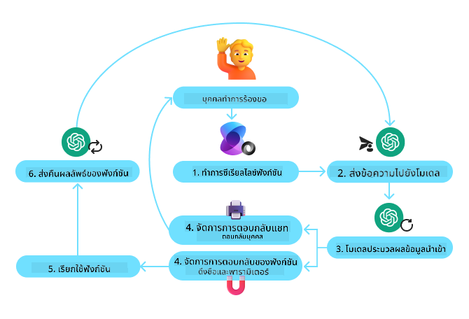
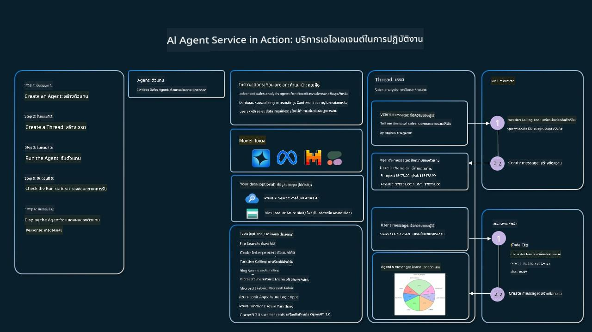

<!--
CO_OP_TRANSLATOR_METADATA:
{
  "original_hash": "88258b03f2893aa2e69eb8fb24baabbc",
  "translation_date": "2025-07-12T09:35:21+00:00",
  "source_file": "04-tool-use/README.md",
  "language_code": "th"
}
-->
[](https://youtu.be/vieRiPRx-gI?si=cEZ8ApnT6Sus9rhn)

> _(คลิกที่ภาพด้านบนเพื่อดูวิดีโอของบทเรียนนี้)_

# รูปแบบการออกแบบการใช้เครื่องมือ

เครื่องมือเป็นสิ่งที่น่าสนใจเพราะช่วยให้ AI agents มีความสามารถที่หลากหลายมากขึ้น แทนที่จะจำกัดแค่ชุดของการกระทำที่ทำได้ เมื่อเพิ่มเครื่องมือเข้าไป ตัว agent จะสามารถทำงานได้หลากหลายมากขึ้น ในบทนี้เราจะมาดูรูปแบบการออกแบบการใช้เครื่องมือ (Tool Use Design Pattern) ซึ่งอธิบายว่า AI agents สามารถใช้เครื่องมือเฉพาะเพื่อบรรลุเป้าหมายได้อย่างไร

## บทนำ

ในบทเรียนนี้ เราจะตอบคำถามดังต่อไปนี้:

- รูปแบบการออกแบบการใช้เครื่องมือคืออะไร?
- มีกรณีการใช้งานแบบใดบ้างที่สามารถนำไปใช้ได้?
- องค์ประกอบหรือบล็อกพื้นฐานที่จำเป็นสำหรับการนำรูปแบบนี้ไปใช้มีอะไรบ้าง?
- มีข้อควรพิจารณาพิเศษอะไรบ้างในการใช้รูปแบบการออกแบบการใช้เครื่องมือเพื่อสร้าง AI agents ที่น่าเชื่อถือ?

## เป้าหมายการเรียนรู้

หลังจากเรียนจบบทนี้ คุณจะสามารถ:

- อธิบายรูปแบบการออกแบบการใช้เครื่องมือและวัตถุประสงค์ของมันได้
- ระบุกรณีการใช้งานที่เหมาะสมกับรูปแบบการออกแบบการใช้เครื่องมือ
- เข้าใจองค์ประกอบหลักที่จำเป็นสำหรับการนำรูปแบบนี้ไปใช้
- ตระหนักถึงข้อควรพิจารณาเพื่อให้มั่นใจว่า AI agents ที่ใช้รูปแบบนี้มีความน่าเชื่อถือ

## รูปแบบการออกแบบการใช้เครื่องมือคืออะไร?

**รูปแบบการออกแบบการใช้เครื่องมือ** มุ่งเน้นที่การให้ LLMs มีความสามารถในการโต้ตอบกับเครื่องมือภายนอกเพื่อบรรลุเป้าหมายเฉพาะ เครื่องมือคือโค้ดที่ agent สามารถเรียกใช้เพื่อทำงานต่าง ๆ เครื่องมืออาจเป็นฟังก์ชันง่าย ๆ เช่น เครื่องคิดเลข หรือการเรียก API ไปยังบริการภายนอก เช่น การตรวจสอบราคาหุ้นหรือพยากรณ์อากาศ ในบริบทของ AI agents เครื่องมือถูกออกแบบมาให้ agent เรียกใช้ได้ตามการเรียกฟังก์ชันที่สร้างโดยโมเดล (model-generated function calls)

## กรณีการใช้งานที่สามารถนำไปใช้ได้มีอะไรบ้าง?

AI Agents สามารถใช้เครื่องมือเพื่อทำงานที่ซับซ้อน ดึงข้อมูล หรือช่วยตัดสินใจ รูปแบบการออกแบบการใช้เครื่องมือมักถูกใช้ในสถานการณ์ที่ต้องมีการโต้ตอบแบบไดนามิกกับระบบภายนอก เช่น ฐานข้อมูล บริการเว็บ หรือโปรแกรมแปลความหมายโค้ด ความสามารถนี้มีประโยชน์ในหลายกรณีใช้งาน เช่น:

- **การดึงข้อมูลแบบไดนามิก:** Agent สามารถสอบถาม API ภายนอกหรือฐานข้อมูลเพื่อดึงข้อมูลที่เป็นปัจจุบัน (เช่น การสอบถามฐานข้อมูล SQLite เพื่อวิเคราะห์ข้อมูล ดึงราคาหุ้น หรือข้อมูลสภาพอากาศ)
- **การรันและแปลความหมายโค้ด:** Agent สามารถรันโค้ดหรือสคริปต์เพื่อแก้ปัญหาทางคณิตศาสตร์ สร้างรายงาน หรือจำลองสถานการณ์
- **การทำงานอัตโนมัติของเวิร์กโฟลว์:** อัตโนมัติกระบวนการที่ซ้ำซ้อนหรือหลายขั้นตอนโดยเชื่อมต่อเครื่องมือต่าง ๆ เช่น ตัวจัดตารางงาน อีเมล หรือสายงานข้อมูล
- **การสนับสนุนลูกค้า:** Agent สามารถโต้ตอบกับระบบ CRM แพลตฟอร์มตั๋ว หรือฐานความรู้เพื่อแก้ไขคำถามของผู้ใช้
- **การสร้างและแก้ไขเนื้อหา:** Agent สามารถใช้เครื่องมือตรวจสอบไวยากรณ์ สรุปข้อความ หรือประเมินความปลอดภัยของเนื้อหาเพื่อช่วยงานสร้างสรรค์เนื้อหา

## องค์ประกอบ/บล็อกพื้นฐานที่จำเป็นสำหรับการนำรูปแบบการใช้เครื่องมือไปใช้มีอะไรบ้าง?

บล็อกเหล่านี้ช่วยให้ AI agent สามารถทำงานได้หลากหลาย มาดูองค์ประกอบหลักที่จำเป็นสำหรับการนำรูปแบบการใช้เครื่องมือไปใช้กัน:

- **ฟังก์ชัน/สคีมาของเครื่องมือ:** คำจำกัดความรายละเอียดของเครื่องมือที่มีอยู่ รวมถึงชื่อฟังก์ชัน วัตถุประสงค์ พารามิเตอร์ที่ต้องการ และผลลัพธ์ที่คาดหวัง สคีมเหล่านี้ช่วยให้ LLM เข้าใจว่าเครื่องมือใดบ้างที่มีและวิธีสร้างคำขอที่ถูกต้อง

- **ตรรกะการเรียกใช้ฟังก์ชัน:** กำหนดวิธีและเวลาที่เครื่องมือถูกเรียกใช้ตามเจตนาของผู้ใช้และบริบทการสนทนา อาจรวมถึงโมดูลวางแผน กลไกการกำหนดเส้นทาง หรือเงื่อนไขที่กำหนดการใช้เครื่องมือแบบไดนามิก

- **ระบบจัดการข้อความ:** ส่วนประกอบที่จัดการการไหลของการสนทนาระหว่างอินพุตของผู้ใช้ การตอบกลับของ LLM การเรียกใช้เครื่องมือ และผลลัพธ์จากเครื่องมือ

- **โครงสร้างการเชื่อมต่อเครื่องมือ:** โครงสร้างพื้นฐานที่เชื่อมต่อ agent กับเครื่องมือต่าง ๆ ไม่ว่าจะเป็นฟังก์ชันง่าย ๆ หรือบริการภายนอกที่ซับซ้อน

- **การจัดการข้อผิดพลาดและการตรวจสอบ:** กลไกจัดการความล้มเหลวในการเรียกใช้เครื่องมือ ตรวจสอบพารามิเตอร์ และจัดการกับการตอบกลับที่ไม่คาดคิด

- **การจัดการสถานะ:** ติดตามบริบทการสนทนา การโต้ตอบกับเครื่องมือก่อนหน้า และข้อมูลถาวรเพื่อให้มั่นใจในความสอดคล้องตลอดการสนทนาหลายรอบ

ต่อไปเราจะมาดูรายละเอียดของการเรียกใช้ฟังก์ชัน/เครื่องมือกัน

### การเรียกใช้ฟังก์ชัน/เครื่องมือ

การเรียกใช้ฟังก์ชันเป็นวิธีหลักที่ช่วยให้ Large Language Models (LLMs) โต้ตอบกับเครื่องมือได้ คุณจะเห็นคำว่า 'Function' และ 'Tool' ใช้แทนกันได้ เพราะ 'ฟังก์ชัน' (บล็อกโค้ดที่ใช้ซ้ำได้) คือ 'เครื่องมือ' ที่ agent ใช้ทำงาน เพื่อให้โค้ดของฟังก์ชันถูกเรียกใช้ LLM ต้องเปรียบเทียบคำขอของผู้ใช้กับคำอธิบายของฟังก์ชัน โดยจะส่งสคีมาที่มีคำอธิบายของฟังก์ชันทั้งหมดให้ LLM จากนั้น LLM จะเลือกฟังก์ชันที่เหมาะสมที่สุดสำหรับงานนั้นและส่งชื่อฟังก์ชันพร้อมอาร์กิวเมนต์กลับมา ฟังก์ชันที่ถูกเลือกจะถูกเรียกใช้ ผลลัพธ์จะถูกส่งกลับไปยัง LLM ซึ่งจะใช้ข้อมูลนี้เพื่อตอบคำขอของผู้ใช้

สำหรับนักพัฒนาที่ต้องการนำการเรียกใช้ฟังก์ชันไปใช้กับ agent จำเป็นต้องมี:

1. โมเดล LLM ที่รองรับการเรียกใช้ฟังก์ชัน
2. สคีมาที่มีคำอธิบายฟังก์ชัน
3. โค้ดของแต่ละฟังก์ชันที่อธิบายไว้

เรามาดูตัวอย่างการดึงเวลาปัจจุบันในเมืองหนึ่งเพื่ออธิบาย:

1. **เริ่มต้น LLM ที่รองรับการเรียกใช้ฟังก์ชัน:**

    ไม่ใช่ทุกรุ่นที่รองรับการเรียกใช้ฟังก์ชัน ดังนั้นจึงควรตรวจสอบว่า LLM ที่ใช้งานรองรับหรือไม่ <a href="https://learn.microsoft.com/azure/ai-services/openai/how-to/function-calling" target="_blank">Azure OpenAI</a> รองรับการเรียกใช้ฟังก์ชัน เราสามารถเริ่มต้นโดยการสร้าง client ของ Azure OpenAI

    ```python
    # Initialize the Azure OpenAI client
    client = AzureOpenAI(
        azure_endpoint = os.getenv("AZURE_OPENAI_ENDPOINT"), 
        api_key=os.getenv("AZURE_OPENAI_API_KEY"),  
        api_version="2024-05-01-preview"
    )
    ```

1. **สร้างสคีมาฟังก์ชัน:**

    ต่อไปเราจะกำหนดสคีมา JSON ที่มีชื่อฟังก์ชัน คำอธิบายของฟังก์ชัน และชื่อพร้อมคำอธิบายของพารามิเตอร์ฟังก์ชัน จากนั้นเราจะส่งสคีมานี้ไปยัง client ที่สร้างไว้ พร้อมกับคำขอของผู้ใช้เพื่อค้นหาเวลาที่ซานฟรานซิสโก สิ่งสำคัญที่ต้องทราบคือ **การเรียกใช้เครื่องมือ** คือสิ่งที่ถูกส่งกลับมา **ไม่ใช่** คำตอบสุดท้ายของคำถาม ตามที่กล่าวไว้ก่อนหน้านี้ LLM จะส่งชื่อฟังก์ชันที่เลือกสำหรับงานนั้นและอาร์กิวเมนต์ที่จะส่งให้ฟังก์ชัน

    ```python
    # Function description for the model to read
    tools = [
        {
            "type": "function",
            "function": {
                "name": "get_current_time",
                "description": "Get the current time in a given location",
                "parameters": {
                    "type": "object",
                    "properties": {
                        "location": {
                            "type": "string",
                            "description": "The city name, e.g. San Francisco",
                        },
                    },
                    "required": ["location"],
                },
            }
        }
    ]
    ```
   
    ```python
  
    # Initial user message
    messages = [{"role": "user", "content": "What's the current time in San Francisco"}] 
  
    # First API call: Ask the model to use the function
      response = client.chat.completions.create(
          model=deployment_name,
          messages=messages,
          tools=tools,
          tool_choice="auto",
      )
  
      # Process the model's response
      response_message = response.choices[0].message
      messages.append(response_message)
  
      print("Model's response:")  

      print(response_message)
  
    ```

    ```bash
    Model's response:
    ChatCompletionMessage(content=None, role='assistant', function_call=None, tool_calls=[ChatCompletionMessageToolCall(id='call_pOsKdUlqvdyttYB67MOj434b', function=Function(arguments='{"location":"San Francisco"}', name='get_current_time'), type='function')])
    ```
  
1. **โค้ดฟังก์ชันที่จำเป็นสำหรับการทำงาน:**

    เมื่อ LLM เลือกฟังก์ชันที่ต้องรันแล้ว โค้ดที่ทำงานนั้นต้องถูกเขียนและรัน เราสามารถเขียนโค้ดเพื่อดึงเวลาปัจจุบันใน Python ได้ นอกจากนี้ยังต้องเขียนโค้ดเพื่อดึงชื่อและอาร์กิวเมนต์จาก response_message เพื่อให้ได้ผลลัพธ์สุดท้าย

    ```python
      def get_current_time(location):
        """Get the current time for a given location"""
        print(f"get_current_time called with location: {location}")  
        location_lower = location.lower()
        
        for key, timezone in TIMEZONE_DATA.items():
            if key in location_lower:
                print(f"Timezone found for {key}")  
                current_time = datetime.now(ZoneInfo(timezone)).strftime("%I:%M %p")
                return json.dumps({
                    "location": location,
                    "current_time": current_time
                })
      
        print(f"No timezone data found for {location_lower}")  
        return json.dumps({"location": location, "current_time": "unknown"})
    ```

    ```python
     # Handle function calls
      if response_message.tool_calls:
          for tool_call in response_message.tool_calls:
              if tool_call.function.name == "get_current_time":
     
                  function_args = json.loads(tool_call.function.arguments)
     
                  time_response = get_current_time(
                      location=function_args.get("location")
                  )
     
                  messages.append({
                      "tool_call_id": tool_call.id,
                      "role": "tool",
                      "name": "get_current_time",
                      "content": time_response,
                  })
      else:
          print("No tool calls were made by the model.")  
  
      # Second API call: Get the final response from the model
      final_response = client.chat.completions.create(
          model=deployment_name,
          messages=messages,
      )
  
      return final_response.choices[0].message.content
     ```

    ```bash
      get_current_time called with location: San Francisco
      Timezone found for san francisco
      The current time in San Francisco is 09:24 AM.
     ```

การเรียกใช้ฟังก์ชันเป็นหัวใจหลักของรูปแบบการใช้เครื่องมือของ agent ส่วนใหญ่ แม้การสร้างขึ้นเองตั้งแต่ต้นอาจท้าทาย แต่ตามที่เราเรียนรู้ใน [บทเรียน 2](../../../02-explore-agentic-frameworks) agentic frameworks มีบล็อกพื้นฐานที่สร้างไว้ล่วงหน้าเพื่อช่วยในการนำรูปแบบการใช้เครื่องมือไปใช้

## ตัวอย่างการใช้เครื่องมือกับ Agentic Frameworks

นี่คือตัวอย่างวิธีการนำรูปแบบการใช้เครื่องมือไปใช้โดยใช้ agentic frameworks ต่าง ๆ:

### Semantic Kernel

<a href="https://learn.microsoft.com/azure/ai-services/agents/overview" target="_blank">Semantic Kernel</a> เป็นเฟรมเวิร์ก AI แบบโอเพนซอร์สสำหรับนักพัฒนา .NET, Python และ Java ที่ทำงานกับ Large Language Models (LLMs) มันช่วยให้ง่ายขึ้นในการใช้การเรียกฟังก์ชันโดยอัตโนมัติอธิบายฟังก์ชันและพารามิเตอร์ของคุณให้กับโมเดลผ่านกระบวนการที่เรียกว่า <a href="https://learn.microsoft.com/semantic-kernel/concepts/ai-services/chat-completion/function-calling/?pivots=programming-language-python#1-serializing-the-functions" target="_blank">serializing</a> นอกจากนี้ยังจัดการการสื่อสารไปมาระหว่างโมเดลกับโค้ดของคุณ ข้อดีอีกอย่างของการใช้ agentic framework อย่าง Semantic Kernel คือช่วยให้เข้าถึงเครื่องมือที่สร้างไว้ล่วงหน้า เช่น <a href="https://github.com/microsoft/semantic-kernel/blob/main/python/samples/getting_started_with_agents/openai_assistant/step4_assistant_tool_file_search.py" target="_blank">File Search</a> และ <a href="https://github.com/microsoft/semantic-kernel/blob/main/python/samples/getting_started_with_agents/openai_assistant/step3_assistant_tool_code_interpreter.py" target="_blank">Code Interpreter</a>

แผนภาพต่อไปนี้แสดงกระบวนการเรียกใช้ฟังก์ชันกับ Semantic Kernel:



ใน Semantic Kernel ฟังก์ชัน/เครื่องมือถูกเรียกว่า <a href="https://learn.microsoft.com/semantic-kernel/concepts/plugins/?pivots=programming-language-python" target="_blank">Plugins</a> เราสามารถแปลงฟังก์ชัน `get_current_time` ที่เห็นก่อนหน้านี้ให้เป็นปลั๊กอินโดยเปลี่ยนเป็นคลาสที่มีฟังก์ชันอยู่ภายใน และนำเข้า decorator `kernel_function` ซึ่งรับคำอธิบายของฟังก์ชัน เมื่อคุณสร้าง kernel ด้วย GetCurrentTimePlugin kernel จะทำการ serialize ฟังก์ชันและพารามิเตอร์โดยอัตโนมัติ สร้างสคีมาเพื่อส่งไปยัง LLM ในกระบวนการนี้

```python
from semantic_kernel.functions import kernel_function

class GetCurrentTimePlugin:
    async def __init__(self, location):
        self.location = location

    @kernel_function(
        description="Get the current time for a given location"
    )
    def get_current_time(location: str = ""):
        ...

```

```python 
from semantic_kernel import Kernel

# Create the kernel
kernel = Kernel()

# Create the plugin
get_current_time_plugin = GetCurrentTimePlugin(location)

# Add the plugin to the kernel
kernel.add_plugin(get_current_time_plugin)
```
  
### Azure AI Agent Service

<a href="https://learn.microsoft.com/azure/ai-services/agents/overview" target="_blank">Azure AI Agent Service</a> เป็น agentic framework รุ่นใหม่ที่ออกแบบมาเพื่อให้นักพัฒนาสามารถสร้าง ปรับใช้ และขยาย AI agents คุณภาพสูงได้อย่างปลอดภัยโดยไม่ต้องจัดการทรัพยากรคอมพิวเตอร์และที่เก็บข้อมูลเบื้องหลัง เหมาะอย่างยิ่งสำหรับแอปพลิเคชันองค์กรเพราะเป็นบริการที่มีการจัดการเต็มรูปแบบพร้อมความปลอดภัยระดับองค์กร

เมื่อเทียบกับการพัฒนาด้วย LLM API โดยตรง Azure AI Agent Service มีข้อได้เปรียบหลายประการ เช่น:

- การเรียกใช้เครื่องมืออัตโนมัติ – ไม่ต้องแยกวิเคราะห์การเรียกเครื่องมือ เรียกใช้เครื่องมือ และจัดการผลลัพธ์ เพราะทั้งหมดนี้ทำบนเซิร์ฟเวอร์
- การจัดการข้อมูลอย่างปลอดภัย – แทนที่จะจัดการสถานะการสนทนาเอง คุณสามารถใช้ threads เพื่อเก็บข้อมูลทั้งหมดที่ต้องการ
- เครื่องมือพร้อมใช้งาน – เครื่องมือที่ช่วยให้คุณโต้ตอบกับแหล่งข้อมูล เช่น Bing, Azure AI Search และ Azure Functions

เครื่องมือที่มีใน Azure AI Agent Service แบ่งออกเป็นสองประเภท:

1. เครื่องมือความรู้:
    - <a href="https://learn.microsoft.com/azure/ai-services/agents/how-to/tools/bing-grounding?tabs=python&pivots=overview" target="_blank">Grounding with Bing Search</a>
    - <a href="https://learn.microsoft.com/azure/ai-services/agents/how-to/tools/file-search?tabs=python&pivots=overview" target="_blank">File Search</a>
    - <a href="https://learn.microsoft.com/azure/ai-services/agents/how-to/tools/azure-ai-search?tabs=azurecli%2Cpython&pivots=overview-azure-ai-search" target="_blank">Azure AI Search</a>

2. เครื่องมือปฏิบัติการ:
    - <a href="https://learn.microsoft.com/azure/ai-services/agents/how-to/tools/function-calling?tabs=python&pivots=overview" target="_blank">Function Calling</a>
    - <a href="https://learn.microsoft.com/azure/ai-services/agents/how-to/tools/code-interpreter?tabs=python&pivots=overview" target="_blank">Code Interpreter</a>
    - <a href="https://learn.microsoft.com/azure/ai-services/agents/how-to/tools/openapi-spec?tabs=python&pivots=overview" target="_blank">OpenAI defined tools</a>
    - <a href="https://learn.microsoft.com/azure/ai-services/agents/how-to/tools/azure-functions?pivots=overview" target="_blank">Azure Functions</a>

Agent Service ช่วยให้เราสามารถใช้เครื่องมือเหล่านี้ร่วมกันเป็น `toolset` และใช้ `threads` เพื่อติดตามประวัติข้อความจากการสนทนาแต่ละชุด

ลองนึกภาพว่าคุณเป็นตัวแทนฝ่ายขายของบริษัทชื่อ Contoso คุณต้องการพัฒนา conversational agent ที่สามารถตอบคำถามเกี่ยวกับข้อมูลการขายของคุณได้

ภาพต่อไปนี้แสดงวิธีที่คุณสามารถใช้ Azure AI Agent Service เพื่อวิเคราะห์ข้อมูลการขายของคุณ:



เพื่อใช้เครื่องมือใด ๆ กับบริการนี้ เราสามารถสร้าง client และกำหนดเครื่องมือหรือชุดเครื่องมือ ในการใช้งานจริง เราสามารถใช้โค้ด Python ดังต่อไปนี้ LLM จะสามารถดู toolset และตัดสินใจว่าจะใช้ฟังก์ชันที่ผู้ใช้สร้างขึ้น `fetch_sales_data_using_sqlite_query` หรือ Code Interpreter ที่สร้างไว้ล่วงหน้าขึ้นอยู่กับคำขอของผู้ใช้

```python 
import os
from azure.ai.projects import AIProjectClient
from azure.identity import DefaultAzureCredential
from fecth_sales_data_functions import fetch_sales_data_using_sqlite_query # fetch_sales_data_using_sqlite_query function which can be found in a fetch_sales_data_functions.py file.
from azure.ai.projects.models import ToolSet, FunctionTool, CodeInterpreterTool

project_client = AIProjectClient.from_connection_string(
    credential=DefaultAzureCredential(),
    conn_str=os.environ["PROJECT_CONNECTION_STRING"],
)

# Initialize function calling agent with the fetch_sales_data_using_sqlite_query function and adding it to the toolset
fetch_data_function = FunctionTool(fetch_sales_data_using_sqlite_query)
toolset = ToolSet()
toolset.add(fetch_data_function)

# Initialize Code Interpreter tool and adding it to the toolset. 
code_interpreter = code_interpreter = CodeInterpreterTool()
toolset = ToolSet()
toolset.add(code_interpreter)

agent = project_client.agents.create_agent(
    model="gpt-4o-mini", name="my-agent", instructions="You are helpful agent", 
    toolset=toolset
)
```

## ข้อควรพิจารณาพิเศษในการใช้รูปแบบการออกแบบการใช้เครื่องมือเพื่อสร้าง AI agents ที่น่าเชื่อถือ

ข้อกังวลทั่วไปเกี่ยวกับ SQL ที่สร้างขึ้นแบบไดนามิกโดย LLM คือเรื่องความปลอดภัย โดยเฉพาะความเสี่ยงจาก SQL injection หรือการกระทำที่เป็นอันตราย เช่น การลบหรือแก้ไขฐานข้อมูล แม้ว่าข้อกังวลเหล่านี้จะมีเหตุผล แต่สามารถลดความเสี่ยงได้อย่างมีประสิทธิภาพโดยการกำหนดสิทธิ์การเข้าถึงฐานข้อมูลอย่างเหมาะสม สำหรับฐานข้อมูลส่วนใหญ่จะตั้งค่าให้เป็นแบบอ่านอย่างเดียว สำหรับบริการฐานข้อมูลอย่าง PostgreSQL หรือ Azure SQL ควรกำหนดบทบาทแอปเป็นแบบอ่านอย่างเดียว (SELECT)

การรันแอปในสภาพแวดล้อมที่ปลอดภัยช่วยเพิ่มการป้องกันอีกชั้น ในสถานการณ์องค์กร ข้อมูลมักถูกดึงและแปลงจากระบบปฏิบัติการไปยังฐานข้อมูลหรือคลังข้อมูลแบบอ่านอย่างเดียวที่มีสคีมาที่ใช้งานง่าย วิธีนี้ช่วยให้ข้อมูลปลอดภัย ปรับแต่งเพื่อประสิทธิภาพและการเข้าถึง และแอปมีสิทธิ์เข้าถึงแบบอ่านอย่างเดียวเท่านั้น

## แหล่งข้อมูลเพิ่มเติม

-

Azure AI Agents Service Workshop</a>
- <a href="https://github.com/Azure-Samples/contoso-creative-writer/tree/main/docs/workshop" target="_blank">เวิร์กช็อป Contoso Creative Writer Multi-Agent</a>
- <a href="https://learn.microsoft.com/semantic-kernel/concepts/ai-services/chat-completion/function-calling/?pivots=programming-language-python#1-serializing-the-functions" target="_blank">บทเรียนการเรียกใช้ฟังก์ชันใน Semantic Kernel</a>
- <a href="https://github.com/microsoft/semantic-kernel/blob/main/python/samples/getting_started_with_agents/openai_assistant/step3_assistant_tool_code_interpreter.py" target="_blank">ตัวแปลโค้ด Semantic Kernel</a>
- <a href="https://microsoft.github.io/autogen/dev/user-guide/core-user-guide/components/tools.html" target="_blank">เครื่องมือ Autogen</a>

## บทเรียนก่อนหน้า

[ทำความเข้าใจรูปแบบการออกแบบ Agentic](../03-agentic-design-patterns/README.md)

## บทเรียนถัดไป

[Agentic RAG](../05-agentic-rag/README.md)

**ข้อจำกัดความรับผิดชอบ**:  
เอกสารนี้ได้รับการแปลโดยใช้บริการแปลภาษาอัตโนมัติ [Co-op Translator](https://github.com/Azure/co-op-translator) แม้เราจะพยายามให้ความถูกต้องสูงสุด แต่โปรดทราบว่าการแปลอัตโนมัติอาจมีข้อผิดพลาดหรือความไม่ถูกต้อง เอกสารต้นฉบับในภาษาต้นทางถือเป็นแหล่งข้อมูลที่เชื่อถือได้ สำหรับข้อมูลที่สำคัญ ขอแนะนำให้ใช้บริการแปลโดยผู้เชี่ยวชาญมนุษย์ เราไม่รับผิดชอบต่อความเข้าใจผิดหรือการตีความผิดใด ๆ ที่เกิดจากการใช้การแปลนี้