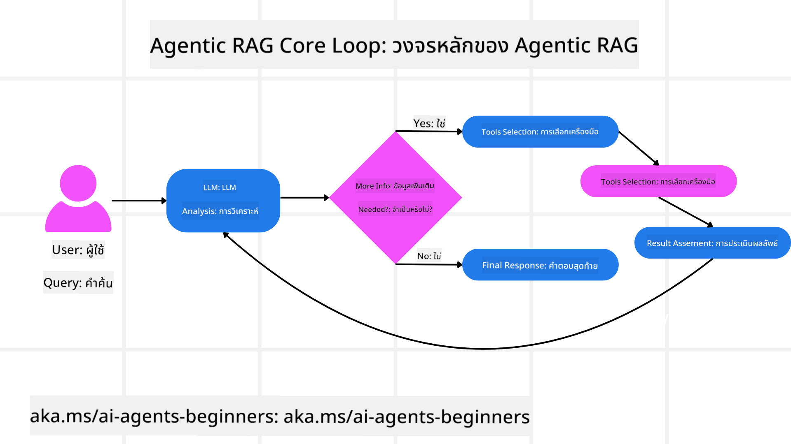
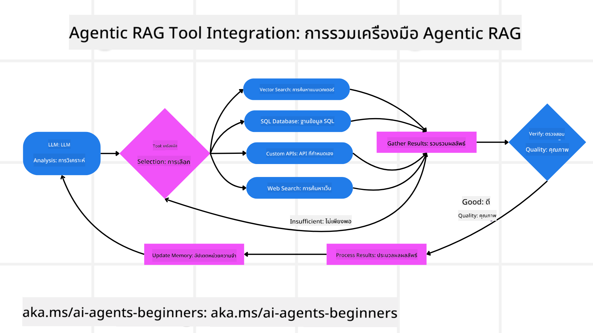
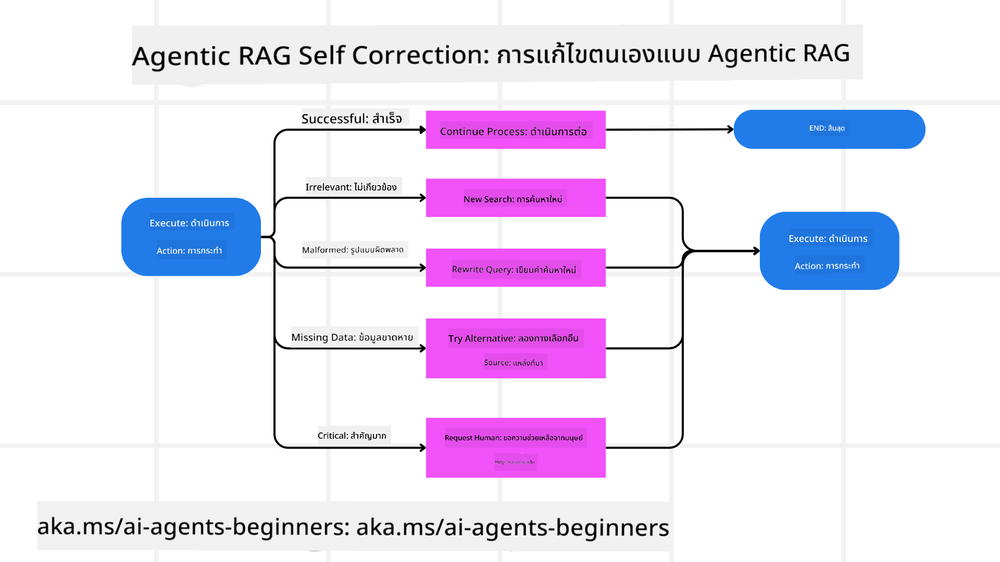

<!--
CO_OP_TRANSLATOR_METADATA:
{
  "original_hash": "7622aa72f9e676e593339f5f694ecd7d",
  "translation_date": "2025-07-12T10:03:38+00:00",
  "source_file": "05-agentic-rag/README.md",
  "language_code": "th"
}
-->

> _(คลิกที่ภาพด้านบนเพื่อดูวิดีโอบทเรียนนี้)_

# Agentic RAG

บทเรียนนี้นำเสนอภาพรวมอย่างละเอียดของ Agentic Retrieval-Augmented Generation (Agentic RAG) ซึ่งเป็นแนวทาง AI ที่กำลังเกิดขึ้นใหม่ โดยที่โมเดลภาษาขนาดใหญ่ (LLMs) วางแผนขั้นตอนถัดไปด้วยตนเองในขณะที่ดึงข้อมูลจากแหล่งภายนอก แตกต่างจากรูปแบบการดึงข้อมูลแบบคงที่ที่อ่านข้อมูลทีหลัง Agentic RAG มีการเรียกใช้ LLM ซ้ำ ๆ สลับกับการเรียกใช้เครื่องมือหรือฟังก์ชันและผลลัพธ์ที่มีโครงสร้าง ระบบจะประเมินผลลัพธ์ ปรับปรุงคำค้น เรียกใช้เครื่องมือเพิ่มเติมหากจำเป็น และดำเนินการวนซ้ำจนกว่าจะได้คำตอบที่น่าพอใจ

## บทนำ

บทเรียนนี้จะครอบคลุม

- **ทำความเข้าใจ Agentic RAG:** เรียนรู้เกี่ยวกับแนวทาง AI ที่กำลังเกิดขึ้นใหม่ซึ่งโมเดลภาษาขนาดใหญ่ (LLMs) วางแผนขั้นตอนถัดไปด้วยตนเองในขณะที่ดึงข้อมูลจากแหล่งข้อมูลภายนอก
- **เข้าใจสไตล์ Maker-Checker แบบวนซ้ำ:** เข้าใจวงจรการเรียกใช้ LLM ซ้ำ ๆ สลับกับการเรียกใช้เครื่องมือหรือฟังก์ชันและผลลัพธ์ที่มีโครงสร้าง ซึ่งออกแบบมาเพื่อเพิ่มความถูกต้องและจัดการกับคำค้นที่ผิดรูปแบบ
- **สำรวจการใช้งานจริง:** ระบุสถานการณ์ที่ Agentic RAG โดดเด่น เช่น สภาพแวดล้อมที่เน้นความถูกต้องเป็นหลัก การโต้ตอบกับฐานข้อมูลที่ซับซ้อน และเวิร์กโฟลว์ที่ยาวนาน

## เป้าหมายการเรียนรู้

หลังจากจบบทเรียนนี้ คุณจะรู้วิธี/เข้าใจเรื่องต่อไปนี้:

- **เข้าใจ Agentic RAG:** เรียนรู้เกี่ยวกับแนวทาง AI ที่กำลังเกิดขึ้นใหม่ซึ่งโมเดลภาษาขนาดใหญ่ (LLMs) วางแผนขั้นตอนถัดไปด้วยตนเองในขณะที่ดึงข้อมูลจากแหล่งข้อมูลภายนอก
- **สไตล์ Maker-Checker แบบวนซ้ำ:** เข้าใจแนวคิดของวงจรการเรียกใช้ LLM ซ้ำ ๆ สลับกับการเรียกใช้เครื่องมือหรือฟังก์ชันและผลลัพธ์ที่มีโครงสร้าง ซึ่งออกแบบมาเพื่อเพิ่มความถูกต้องและจัดการกับคำค้นที่ผิดรูปแบบ
- **เป็นเจ้าของกระบวนการเหตุผล:** เข้าใจความสามารถของระบบในการเป็นเจ้าของกระบวนการเหตุผลของตนเอง ตัดสินใจว่าจะจัดการกับปัญหาอย่างไรโดยไม่ต้องพึ่งพาเส้นทางที่กำหนดไว้ล่วงหน้า
- **เวิร์กโฟลว์:** เข้าใจว่าโมเดล agentic ตัดสินใจด้วยตนเองอย่างไรในการดึงรายงานแนวโน้มตลาด ระบุข้อมูลคู่แข่ง เชื่อมโยงเมตริกการขายภายใน สังเคราะห์ผลลัพธ์ และประเมินกลยุทธ์
- **วงจรวนซ้ำ การผสานเครื่องมือ และหน่วยความจำ:** เรียนรู้เกี่ยวกับรูปแบบการโต้ตอบแบบวนซ้ำของระบบ การรักษาสถานะและหน่วยความจำข้ามขั้นตอนเพื่อหลีกเลี่ยงการวนซ้ำซ้ำซ้อนและตัดสินใจอย่างมีข้อมูล
- **จัดการกับโหมดล้มเหลวและการแก้ไขตนเอง:** สำรวจกลไกการแก้ไขตนเองที่แข็งแกร่งของระบบ รวมถึงการวนซ้ำและการถามซ้ำ การใช้เครื่องมือวินิจฉัย และการพึ่งพาการดูแลของมนุษย์
- **ขอบเขตของ Agency:** เข้าใจข้อจำกัดของ Agentic RAG โดยเน้นที่ความเป็นอิสระในโดเมนเฉพาะ การพึ่งพาโครงสร้างพื้นฐาน และการเคารพกฎเกณฑ์
- **กรณีใช้งานจริงและคุณค่า:** ระบุสถานการณ์ที่ Agentic RAG โดดเด่น เช่น สภาพแวดล้อมที่เน้นความถูกต้องเป็นหลัก การโต้ตอบกับฐานข้อมูลที่ซับซ้อน และเวิร์กโฟลว์ที่ยาวนาน
- **การกำกับดูแล ความโปร่งใส และความน่าเชื่อถือ:** เรียนรู้ความสำคัญของการกำกับดูแลและความโปร่งใส รวมถึงการอธิบายเหตุผล การควบคุมอคติ และการดูแลของมนุษย์

## Agentic RAG คืออะไร?

Agentic Retrieval-Augmented Generation (Agentic RAG) เป็นแนวทาง AI ที่กำลังเกิดขึ้นใหม่ซึ่งโมเดลภาษาขนาดใหญ่ (LLMs) วางแผนขั้นตอนถัดไปด้วยตนเองในขณะที่ดึงข้อมูลจากแหล่งภายนอก แตกต่างจากรูปแบบการดึงข้อมูลแบบคงที่ที่อ่านข้อมูลทีหลัง Agentic RAG มีการเรียกใช้ LLM ซ้ำ ๆ สลับกับการเรียกใช้เครื่องมือหรือฟังก์ชันและผลลัพธ์ที่มีโครงสร้าง ระบบจะประเมินผลลัพธ์ ปรับปรุงคำค้น เรียกใช้เครื่องมือเพิ่มเติมหากจำเป็น และดำเนินการวนซ้ำจนกว่าจะได้คำตอบที่น่าพอใจ รูปแบบ “maker-checker” แบบวนซ้ำนี้ช่วยเพิ่มความถูกต้อง จัดการกับคำค้นที่ผิดรูปแบบ และรับประกันผลลัพธ์คุณภาพสูง

ระบบเป็นเจ้าของกระบวนการเหตุผลของตนเองอย่างแข็งขัน โดยเขียนคำค้นที่ล้มเหลวใหม่ เลือกวิธีการดึงข้อมูลที่แตกต่าง และผสานเครื่องมือหลายอย่าง เช่น การค้นหาเวกเตอร์ใน Azure AI Search, ฐานข้อมูล SQL หรือ API ที่กำหนดเอง ก่อนสรุปคำตอบ คุณสมบัติที่โดดเด่นของระบบ agentic คือความสามารถในการเป็นเจ้าของกระบวนการเหตุผลของตนเอง การใช้งาน RAG แบบดั้งเดิมมักพึ่งพาเส้นทางที่กำหนดไว้ล่วงหน้า แต่ระบบ agentic จะกำหนดลำดับขั้นตอนโดยอัตโนมัติตามคุณภาพของข้อมูลที่พบ

## การกำหนด Agentic Retrieval-Augmented Generation (Agentic RAG)

Agentic Retrieval-Augmented Generation (Agentic RAG) เป็นแนวทางใหม่ในการพัฒนา AI ที่โมเดลภาษาขนาดใหญ่ (LLMs) ไม่เพียงแต่ดึงข้อมูลจากแหล่งข้อมูลภายนอกเท่านั้น แต่ยังวางแผนขั้นตอนถัดไปด้วยตนเอง แตกต่างจากรูปแบบการดึงข้อมูลแบบคงที่หรือชุดคำสั่งที่เขียนไว้ล่วงหน้า Agentic RAG มีวงจรการเรียกใช้ LLM ซ้ำ ๆ สลับกับการเรียกใช้เครื่องมือหรือฟังก์ชันและผลลัพธ์ที่มีโครงสร้าง ในทุกขั้นตอน ระบบจะประเมินผลลัพธ์ที่ได้รับ ตัดสินใจว่าจะปรับปรุงคำค้นหรือไม่ เรียกใช้เครื่องมือเพิ่มเติมหากจำเป็น และดำเนินการวนซ้ำจนกว่าจะได้คำตอบที่น่าพอใจ

รูปแบบ “maker-checker” แบบวนซ้ำนี้ออกแบบมาเพื่อเพิ่มความถูกต้อง จัดการกับคำค้นที่ผิดรูปแบบสำหรับฐานข้อมูลที่มีโครงสร้าง (เช่น NL2SQL) และรับประกันผลลัพธ์ที่สมดุลและมีคุณภาพสูง แทนที่จะพึ่งพาชุดคำสั่งที่ออกแบบมาอย่างละเอียด ระบบจะเป็นเจ้าของกระบวนการเหตุผลของตนเองอย่างแข็งขัน สามารถเขียนคำค้นที่ล้มเหลวใหม่ เลือกวิธีการดึงข้อมูลที่แตกต่าง และผสานเครื่องมือหลายอย่าง เช่น การค้นหาเวกเตอร์ใน Azure AI Search, ฐานข้อมูล SQL หรือ API ที่กำหนดเอง ก่อนสรุปคำตอบ วิธีนี้ช่วยลดความจำเป็นในการใช้กรอบการประสานงานที่ซับซ้อนมากเกินไป โดยใช้วงจรที่ค่อนข้างเรียบง่าย “เรียก LLM → ใช้เครื่องมือ → เรียก LLM → …” เพื่อให้ได้ผลลัพธ์ที่ซับซ้อนและมีพื้นฐานดี

## การเป็นเจ้าของกระบวนการเหตุผล

คุณสมบัติที่ทำให้ระบบเป็น “agentic” คือความสามารถในการเป็นเจ้าของกระบวนการเหตุผลของตนเอง การใช้งาน RAG แบบดั้งเดิมมักพึ่งพามนุษย์กำหนดเส้นทางให้โมเดล เช่น โซ่ความคิดที่ระบุว่าจะดึงข้อมูลอะไรและเมื่อไร แต่เมื่อระบบเป็น agentic จริง ๆ มันจะตัดสินใจภายในว่าจะจัดการกับปัญหาอย่างไร ไม่ใช่แค่รันสคริปต์ แต่เป็นการกำหนดลำดับขั้นตอนโดยอัตโนมัติตามคุณภาพของข้อมูลที่พบ

ตัวอย่างเช่น หากถูกขอให้สร้างกลยุทธ์การเปิดตัวผลิตภัณฑ์ ระบบจะไม่พึ่งพาแค่คำสั่งที่ระบุขั้นตอนการวิจัยและตัดสินใจทั้งหมด แต่โมเดล agentic จะตัดสินใจด้วยตนเองในการ:

1. ดึงรายงานแนวโน้มตลาดปัจจุบันโดยใช้ Bing Web Grounding
2. ระบุข้อมูลคู่แข่งที่เกี่ยวข้องโดยใช้ Azure AI Search
3. เชื่อมโยงเมตริกการขายภายในในอดีตโดยใช้ Azure SQL Database
4. สังเคราะห์ผลลัพธ์เป็นกลยุทธ์ที่สอดคล้องกันผ่าน Azure OpenAI Service
5. ประเมินกลยุทธ์เพื่อหาช่องว่างหรือความไม่สอดคล้อง และเรียกดึงข้อมูลเพิ่มเติมหากจำเป็น

ทุกขั้นตอนเหล่านี้—การปรับปรุงคำค้น เลือกแหล่งข้อมูล วนซ้ำจน “พอใจ” กับคำตอบ—ถูกตัดสินใจโดยโมเดล ไม่ใช่เขียนสคริปต์ล่วงหน้าโดยมนุษย์

## วงจรวนซ้ำ การผสานเครื่องมือ และหน่วยความจำ

ระบบ agentic พึ่งพารูปแบบการโต้ตอบแบบวนซ้ำ:

- **การเรียกครั้งแรก:** เป้าหมายของผู้ใช้ (หรือคำสั่งผู้ใช้) ถูกส่งไปยัง LLM
- **การเรียกใช้เครื่องมือ:** หากโมเดลพบว่าข้อมูลไม่ครบถ้วนหรือคำสั่งไม่ชัดเจน มันจะเลือกเครื่องมือหรือวิธีการดึงข้อมูล เช่น การค้นหาฐานข้อมูลเวกเตอร์ (เช่น Azure AI Search Hybrid search บนข้อมูลส่วนตัว) หรือการเรียก SQL ที่มีโครงสร้าง เพื่อรวบรวมบริบทเพิ่มเติม
- **การประเมินและปรับปรุง:** หลังจากตรวจสอบข้อมูลที่ได้รับ โมเดลจะตัดสินใจว่าข้อมูลเพียงพอหรือไม่ หากไม่เพียงพอ จะปรับปรุงคำค้น ลองใช้เครื่องมืออื่น หรือปรับวิธีการ
- **ทำซ้ำจนพอใจ:** วงจรนี้ดำเนินต่อไปจนกว่าโมเดลจะมั่นใจว่ามีความชัดเจนและหลักฐานเพียงพอที่จะให้คำตอบสุดท้ายที่มีเหตุผลดี
- **หน่วยความจำและสถานะ:** เนื่องจากระบบรักษาสถานะและหน่วยความจำข้ามขั้นตอน มันจึงสามารถจดจำความพยายามก่อนหน้าและผลลัพธ์ หลีกเลี่ยงการวนซ้ำซ้ำซ้อน และตัดสินใจอย่างมีข้อมูลมากขึ้นในแต่ละขั้นตอน

เมื่อเวลาผ่านไป สิ่งนี้สร้างความเข้าใจที่พัฒนาไปเรื่อย ๆ ช่วยให้โมเดลสามารถจัดการงานที่ซับซ้อนและหลายขั้นตอนได้โดยไม่ต้องมีมนุษย์แทรกแซงหรือปรับคำสั่งอย่างต่อเนื่อง

## การจัดการโหมดล้มเหลวและการแก้ไขตนเอง

ความเป็นอิสระของ Agentic RAG ยังรวมถึงกลไกการแก้ไขตนเองที่แข็งแกร่ง เมื่อระบบเจอทางตัน เช่น ดึงเอกสารที่ไม่เกี่ยวข้องหรือพบคำค้นที่ผิดรูปแบบ มันสามารถ:

- **วนซ้ำและถามซ้ำ:** แทนที่จะส่งคำตอบที่มีคุณค่าน้อย โมเดลจะลองกลยุทธ์การค้นหาใหม่ เขียนคำค้นฐานข้อมูลใหม่ หรือดูชุดข้อมูลทางเลือก
- **ใช้เครื่องมือวินิจฉัย:** ระบบอาจเรียกใช้ฟังก์ชันเพิ่มเติมที่ช่วยตรวจสอบขั้นตอนเหตุผลหรือยืนยันความถูกต้องของข้อมูลที่ดึงมา เครื่องมืออย่าง Azure AI Tracing จะมีความสำคัญในการเปิดใช้งานการสังเกตและการตรวจสอบที่แข็งแกร่ง
- **พึ่งพาการดูแลของมนุษย์:** สำหรับสถานการณ์ที่มีความเสี่ยงสูงหรือเกิดความล้มเหลวซ้ำ ๆ โมเดลอาจแจ้งความไม่แน่ใจและขอคำแนะนำจากมนุษย์ เมื่อได้รับข้อเสนอแนะที่แก้ไขแล้ว โมเดลสามารถนำบทเรียนไปใช้ในอนาคต

วิธีการแบบวนซ้ำและไดนามิกนี้ช่วยให้โมเดลพัฒนาตัวเองอย่างต่อเนื่อง ทำให้ไม่ใช่แค่ระบบที่ทำงานครั้งเดียว แต่เป็นระบบที่เรียนรู้จากความผิดพลาดในแต่ละเซสชัน

## ขอบเขตของ Agency

แม้ว่าจะมีความเป็นอิสระภายในงาน Agentic RAG ไม่ใช่ปัญญาประดิษฐ์ทั่วไป (Artificial General Intelligence) ความสามารถ “agentic” ของมันจำกัดอยู่ที่เครื่องมือ แหล่งข้อมูล และนโยบายที่นักพัฒนามนุษย์จัดเตรียมให้ มันไม่สามารถสร้างเครื่องมือของตัวเองหรือก้าวออกนอกขอบเขตโดเมนที่กำหนดไว้ได้ แต่จะโดดเด่นในการประสานงานทรัพยากรที่มีอยู่แบบไดนามิก

ความแตกต่างสำคัญจาก AI ขั้นสูงอื่น ๆ ได้แก่:

1. **ความเป็นอิสระเฉพาะโดเมน:** ระบบ Agentic RAG มุ่งเน้นการบรรลุเป้าหมายที่ผู้ใช้กำหนดภายในโดเมนที่รู้จัก โดยใช้กลยุทธ์เช่น การเขียนคำค้นใหม่หรือการเลือกเครื่องมือเพื่อปรับปรุงผลลัพธ์
2. **พึ่งพาโครงสร้างพื้นฐาน:** ความสามารถของระบบขึ้นอยู่กับเครื่องมือและข้อมูลที่นักพัฒนาผสานรวมเข้าด้วยกัน มันไม่สามารถก้าวข้ามขอบเขตเหล่านี้โดยไม่มีการแทรกแซงจากมนุษย์
3. **เคารพกฎเกณฑ์:** แนวทางจริยธรรม กฎระเบียบ และนโยบายทางธุรกิจยังคงมีความสำคัญอย่างยิ่ง อิสระของ agent จะถูกจำกัดด้วยมาตรการความปลอดภัยและกลไกการดูแล (หวังว่า)

## กรณีใช้งานจริงและคุณค่า

Agentic RAG โดดเด่นในสถานการณ์ที่ต้องการการปรับปรุงและความแม่นยำแบบวนซ้ำ:

1. **สภาพแวดล้อมที่เน้นความถูกต้องเป็นหลัก:** ในการตรวจสอบความสอดคล้อง การวิเคราะห์กฎระเบียบ หรือการวิจัยทางกฎหมาย โมเดล agentic สามารถตรวจสอบข้อเท็จจริงซ้ำ ๆ ปรึกษาหลายแหล่งข้อมูล และเขียนคำค้นใหม่จนกว่าจะได้คำตอบที่ผ่านการตรวจสอบอย่างละเอียด
2. **การโต้ตอบกับฐานข้อมูลที่ซับซ้อน:** เมื่อจัดการกับข้อมูลที่มีโครงสร้างซึ่งคำค้นอาจล้มเหลวบ่อยครั้งหรือจำเป็นต้องปรับปรุง ระบบสามารถปรับปรุงคำค้นโดยอัตโนมัติด้วย Azure SQL หรือ Microsoft Fabric OneLake เพื่อให้การดึงข้อมูลสุดท้ายสอดคล้องกับเจตนาของผู้ใช้
3. **เวิร์กโฟลว์ที่ยาวนาน:** เซสชันที่ดำเนินนานขึ้นอาจพัฒนาไปตามข้อมูลใหม่ที่ปรากฏ Agentic RAG สามารถผนวกข้อมูลใหม่อย่างต่อเนื่อง ปรับกลยุทธ์ตามที่เรียนรู้เกี่ยวกับปัญหา

## การกำกับดูแล ความโปร่งใส และความน่าเชื่อถือ

เมื่อระบบเหล่านี้มีความเป็นอิสระในการเหตุผลมากขึ้น การกำกับดูแลและความโปร่งใสจึงมีความสำคัญ:

- **เหตุผลที่อธิบายได้:** โมเดลสามารถให้เส้นทางตรวจสอบของคำค้นที่ทำ แหล่งข้อมูลที่ปรึกษา และขั้นตอนเหตุผลที่ใช้ในการสรุปผล เครื่องมืออย่าง Azure AI Content Safety และ Azure AI Tracing / GenAIOps ช่วยรักษาความโปร่งใสและลดความเสี่ยง
- **การควบคุมอคติและการดึงข้อมูลที่สมดุล:** นักพัฒนาสามารถปรับแต่งกลยุทธ์การดึงข้อมูลเพื่อให้พิจารณาแหล่งข้อมูลที่สมดุลและเป็นตัวแทน และตรวจสอบผลลัพธ์เป็นประจำเพื่อค้นหาอคติหรือรูปแบบที่เบ้โดยใช้โมเดลที่กำหนดเองสำหรับองค์กรวิทยาศาสตร์ข้อมูลขั้นสูงที่ใช้ Azure Machine Learning
- **การดูแลของมนุษย์และการปฏิบัติตาม:** สำหรับงานที่ละเอียดอ่อน การตรวจสอบโดยมนุษย์ยังค

- <a href="https://learn.microsoft.com/azure/ai-studio/concepts/evaluation-approach-gen-ai" target="_blank">การประเมินแอปพลิเคชัน AI สร้างสรรค์ด้วย Azure AI Foundry: บทความนี้ครอบคลุมการประเมินและเปรียบเทียบโมเดลบนชุดข้อมูลสาธารณะ รวมถึงแอปพลิเคชัน Agentic AI และสถาปัตยกรรม RAG</a>
- <a href="https://weaviate.io/blog/what-is-agentic-rag" target="_blank">Agentic RAG คืออะไร | Weaviate</a>
- <a href="https://ragaboutit.com/agentic-rag-a-complete-guide-to-agent-based-retrieval-augmented-generation/" target="_blank">Agentic RAG: คู่มือครบถ้วนสำหรับการสร้างสรรค์ด้วย Retrieval Augmented Generation แบบใช้เอเจนต์ – ข่าวสารจาก generation RAG</a>
- <a href="https://huggingface.co/learn/cookbook/agent_rag" target="_blank">Agentic RAG: เพิ่มประสิทธิภาพ RAG ของคุณด้วยการปรับปรุงคำค้นและการค้นหาด้วยตนเอง! Hugging Face Open-Source AI Cookbook</a>
- <a href="https://youtu.be/aQ4yQXeB1Ss?si=2HUqBzHoeB5tR04U" target="_blank">การเพิ่มชั้น Agentic ให้กับ RAG</a>
- <a href="https://www.youtube.com/watch?v=zeAyuLc_f3Q&t=244s" target="_blank">อนาคตของผู้ช่วยความรู้: Jerry Liu</a>
- <a href="https://www.youtube.com/watch?v=AOSjiXP1jmQ" target="_blank">วิธีสร้างระบบ Agentic RAG</a>
- <a href="https://ignite.microsoft.com/sessions/BRK102?source=sessions" target="_blank">การใช้ Azure AI Foundry Agent Service เพื่อขยายขนาดเอเจนต์ AI ของคุณ</a>

### เอกสารวิชาการ

- <a href="https://arxiv.org/abs/2303.17651" target="_blank">2303.17651 Self-Refine: การปรับปรุงแบบวนซ้ำด้วยการตอบกลับด้วยตนเอง</a>
- <a href="https://arxiv.org/abs/2303.11366" target="_blank">2303.11366 Reflexion: เอเจนต์ภาษาโดยใช้การเรียนรู้เสริมด้วยคำพูด</a>
- <a href="https://arxiv.org/abs/2305.11738" target="_blank">2305.11738 CRITIC: โมเดลภาษาขนาดใหญ่สามารถแก้ไขตัวเองได้ด้วยการวิจารณ์แบบโต้ตอบกับเครื่องมือ</a>
- <a href="https://arxiv.org/abs/2501.09136" target="_blank">2501.09136 Agentic Retrieval-Augmented Generation: การสำรวจเกี่ยวกับ Agentic RAG</a>

## บทเรียนก่อนหน้า

[รูปแบบการใช้เครื่องมือ](../04-tool-use/README.md)

## บทเรียนถัดไป

[การสร้างเอเจนต์ AI ที่น่าเชื่อถือ](../06-building-trustworthy-agents/README.md)

**ข้อจำกัดความรับผิดชอบ**:  
เอกสารนี้ได้รับการแปลโดยใช้บริการแปลภาษาอัตโนมัติ [Co-op Translator](https://github.com/Azure/co-op-translator) แม้เราจะพยายามให้ความถูกต้องสูงสุด แต่โปรดทราบว่าการแปลอัตโนมัติอาจมีข้อผิดพลาดหรือความไม่ถูกต้อง เอกสารต้นฉบับในภาษาต้นทางถือเป็นแหล่งข้อมูลที่เชื่อถือได้ สำหรับข้อมูลที่สำคัญ ขอแนะนำให้ใช้บริการแปลโดยผู้เชี่ยวชาญมนุษย์ เราไม่รับผิดชอบต่อความเข้าใจผิดหรือการตีความผิดใด ๆ ที่เกิดจากการใช้การแปลนี้