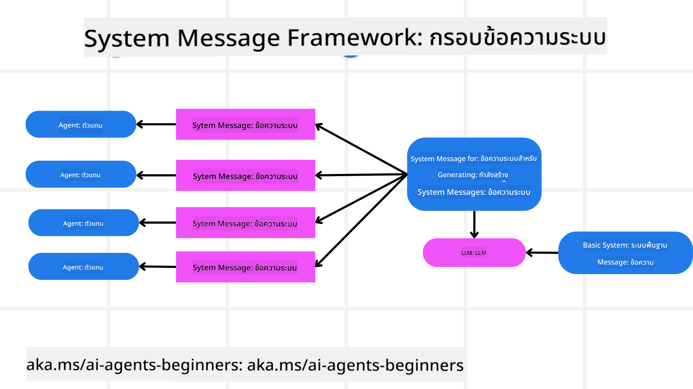
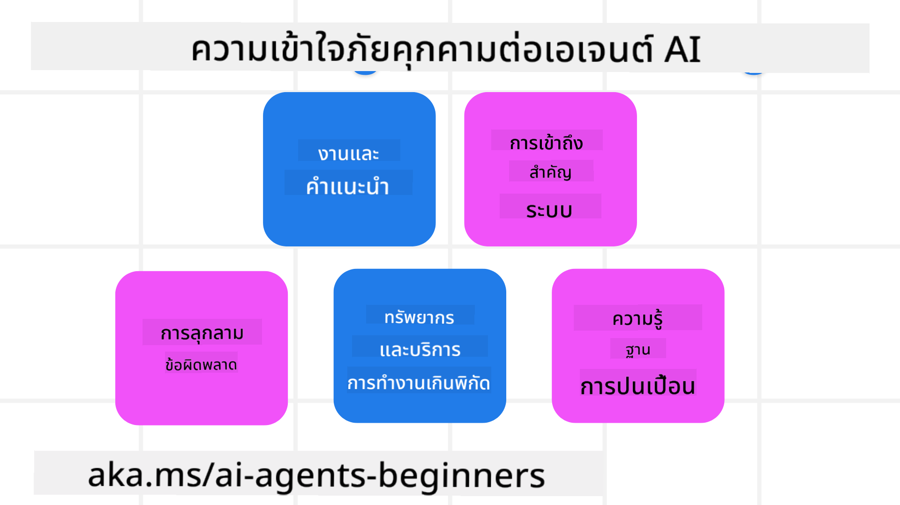
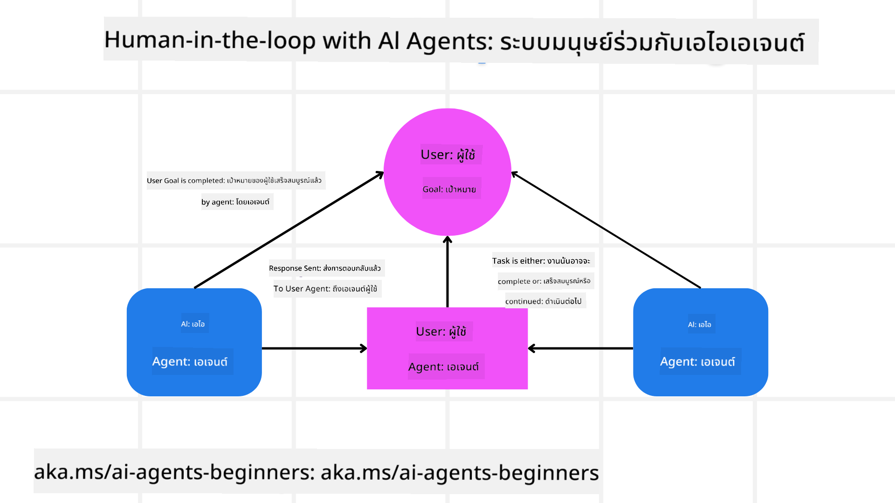

<!--
CO_OP_TRANSLATOR_METADATA:
{
  "original_hash": "f57852cac3a86c4a5ef47f793cc12178",
  "translation_date": "2025-07-12T10:27:39+00:00",
  "source_file": "06-building-trustworthy-agents/README.md",
  "language_code": "th"
}
-->
[](https://youtu.be/iZKkMEGBCUQ?si=Q-kEbcyHUMPoHp8L)

> _(คลิกที่ภาพด้านบนเพื่อดูวิดีโอของบทเรียนนี้)_

# การสร้าง AI Agents ที่น่าเชื่อถือ

## บทนำ

บทเรียนนี้จะครอบคลุม:

- วิธีการสร้างและนำ AI Agents ที่ปลอดภัยและมีประสิทธิภาพไปใช้งาน
- ข้อควรพิจารณาด้านความปลอดภัยที่สำคัญเมื่อพัฒนา AI Agents
- วิธีการรักษาความเป็นส่วนตัวของข้อมูลและผู้ใช้เมื่อพัฒนา AI Agents

## เป้าหมายการเรียนรู้

หลังจากจบบทเรียนนี้ คุณจะสามารถ:

- ระบุและลดความเสี่ยงเมื่อสร้าง AI Agents
- นำมาตรการด้านความปลอดภัยมาใช้เพื่อให้แน่ใจว่าการจัดการข้อมูลและการเข้าถึงเป็นไปอย่างเหมาะสม
- สร้าง AI Agents ที่รักษาความเป็นส่วนตัวของข้อมูลและมอบประสบการณ์ผู้ใช้ที่มีคุณภาพ

## ความปลอดภัย

เรามาเริ่มต้นด้วยการสร้างแอปพลิเคชัน agentic ที่ปลอดภัยกันก่อน ความปลอดภัยหมายถึง AI agent ทำงานตามที่ออกแบบไว้ ในฐานะผู้สร้างแอปพลิเคชัน agentic เรามีวิธีการและเครื่องมือเพื่อเพิ่มความปลอดภัยสูงสุด:

### การสร้างกรอบระบบข้อความ (System Message Framework)

ถ้าคุณเคยสร้างแอป AI โดยใช้ Large Language Models (LLMs) คุณจะเข้าใจความสำคัญของการออกแบบ system prompt หรือ system message ที่แข็งแกร่ง ข้อความเหล่านี้จะกำหนดกฎเกณฑ์หลัก คำแนะนำ และแนวทางสำหรับการที่ LLM จะโต้ตอบกับผู้ใช้และข้อมูล

สำหรับ AI Agents ระบบ prompt มีความสำคัญมากขึ้นเพราะ AI Agents ต้องการคำสั่งที่เฉพาะเจาะจงสูงเพื่อทำงานที่เราออกแบบไว้ให้สำเร็จ

เพื่อสร้าง system prompts ที่สามารถขยายได้ เราสามารถใช้กรอบระบบข้อความสำหรับสร้างหนึ่งหรือหลาย agents ในแอปพลิเคชันของเรา:



#### ขั้นตอนที่ 1: สร้าง Meta System Message

meta prompt จะถูกใช้โดย LLM เพื่อสร้าง system prompts สำหรับ agents ที่เราสร้าง เราออกแบบเป็นเทมเพลตเพื่อให้สามารถสร้าง agents หลายตัวได้อย่างมีประสิทธิภาพหากจำเป็น

นี่คือตัวอย่าง meta system message ที่เราจะให้กับ LLM:

```plaintext
You are an expert at creating AI agent assistants. 
You will be provided a company name, role, responsibilities and other
information that you will use to provide a system prompt for.
To create the system prompt, be descriptive as possible and provide a structure that a system using an LLM can better understand the role and responsibilities of the AI assistant. 
```

#### ขั้นตอนที่ 2: สร้าง prompt พื้นฐาน

ขั้นตอนถัดไปคือการสร้าง prompt พื้นฐานเพื่ออธิบาย AI Agent คุณควรรวมบทบาทของ agent งานที่ agent จะทำ และความรับผิดชอบอื่น ๆ ของ agent

นี่คือตัวอย่าง:

```plaintext
You are a travel agent for Contoso Travel that is great at booking flights for customers. To help customers you can perform the following tasks: lookup available flights, book flights, ask for preferences in seating and times for flights, cancel any previously booked flights and alert customers on any delays or cancellations of flights.  
```

#### ขั้นตอนที่ 3: ส่งมอบ Basic System Message ให้กับ LLM

ตอนนี้เราสามารถปรับแต่ง system message นี้โดยการให้ meta system message เป็น system message และรวมกับ basic system message ของเรา

สิ่งนี้จะสร้าง system message ที่ออกแบบมาอย่างดียิ่งขึ้นเพื่อชี้นำ AI agents ของเรา:

```markdown
**Company Name:** Contoso Travel  
**Role:** Travel Agent Assistant

**Objective:**  
You are an AI-powered travel agent assistant for Contoso Travel, specializing in booking flights and providing exceptional customer service. Your main goal is to assist customers in finding, booking, and managing their flights, all while ensuring that their preferences and needs are met efficiently.

**Key Responsibilities:**

1. **Flight Lookup:**
    
    - Assist customers in searching for available flights based on their specified destination, dates, and any other relevant preferences.
    - Provide a list of options, including flight times, airlines, layovers, and pricing.
2. **Flight Booking:**
    
    - Facilitate the booking of flights for customers, ensuring that all details are correctly entered into the system.
    - Confirm bookings and provide customers with their itinerary, including confirmation numbers and any other pertinent information.
3. **Customer Preference Inquiry:**
    
    - Actively ask customers for their preferences regarding seating (e.g., aisle, window, extra legroom) and preferred times for flights (e.g., morning, afternoon, evening).
    - Record these preferences for future reference and tailor suggestions accordingly.
4. **Flight Cancellation:**
    
    - Assist customers in canceling previously booked flights if needed, following company policies and procedures.
    - Notify customers of any necessary refunds or additional steps that may be required for cancellations.
5. **Flight Monitoring:**
    
    - Monitor the status of booked flights and alert customers in real-time about any delays, cancellations, or changes to their flight schedule.
    - Provide updates through preferred communication channels (e.g., email, SMS) as needed.

**Tone and Style:**

- Maintain a friendly, professional, and approachable demeanor in all interactions with customers.
- Ensure that all communication is clear, informative, and tailored to the customer's specific needs and inquiries.

**User Interaction Instructions:**

- Respond to customer queries promptly and accurately.
- Use a conversational style while ensuring professionalism.
- Prioritize customer satisfaction by being attentive, empathetic, and proactive in all assistance provided.

**Additional Notes:**

- Stay updated on any changes to airline policies, travel restrictions, and other relevant information that could impact flight bookings and customer experience.
- Use clear and concise language to explain options and processes, avoiding jargon where possible for better customer understanding.

This AI assistant is designed to streamline the flight booking process for customers of Contoso Travel, ensuring that all their travel needs are met efficiently and effectively.

```

#### ขั้นตอนที่ 4: ปรับปรุงและพัฒนา

คุณค่าของกรอบระบบข้อความนี้คือช่วยให้การสร้าง system messages สำหรับหลาย agents ง่ายขึ้นและสามารถปรับปรุง system messages ของคุณได้ตามเวลา แทบจะไม่มี system message ตัวไหนที่ใช้งานครบถ้วนตั้งแต่ครั้งแรก การปรับแต่งเล็กน้อยและพัฒนาผ่านการเปลี่ยนแปลง basic system message และรันผ่านระบบจะช่วยให้คุณเปรียบเทียบและประเมินผลลัพธ์ได้

## การเข้าใจภัยคุกคาม

เพื่อสร้าง AI agents ที่น่าเชื่อถือ สิ่งสำคัญคือต้องเข้าใจและลดความเสี่ยงและภัยคุกคามต่อ AI agent ของคุณ มาดูภัยคุกคามบางประเภทที่เกิดขึ้นกับ AI agents และวิธีการวางแผนและเตรียมรับมือให้ดียิ่งขึ้น



### งานและคำสั่ง

**คำอธิบาย:** ผู้โจมตีพยายามเปลี่ยนคำสั่งหรือเป้าหมายของ AI agent ผ่านการ prompt หรือการจัดการข้อมูลนำเข้า

**การลดความเสี่ยง:** ดำเนินการตรวจสอบความถูกต้องและกรองข้อมูลนำเข้าเพื่อตรวจจับ prompt ที่อาจเป็นอันตรายก่อนที่จะถูกประมวลผลโดย AI Agent เนื่องจากการโจมตีเหล่านี้มักต้องมีการโต้ตอบกับ Agent บ่อยครั้ง การจำกัดจำนวนรอบการสนทนาเป็นอีกวิธีหนึ่งในการป้องกันการโจมตีประเภทนี้

### การเข้าถึงระบบสำคัญ

**คำอธิบาย:** หาก AI agent สามารถเข้าถึงระบบและบริการที่เก็บข้อมูลสำคัญ ผู้โจมตีอาจเจาะช่องทางการสื่อสารระหว่าง agent กับบริการเหล่านี้ได้ ซึ่งอาจเป็นการโจมตีโดยตรงหรือพยายามรวบรวมข้อมูลเกี่ยวกับระบบเหล่านี้ผ่าน agent

**การลดความเสี่ยง:** AI agents ควรเข้าถึงระบบเฉพาะเมื่อจำเป็นเท่านั้นเพื่อป้องกันการโจมตีประเภทนี้ การสื่อสารระหว่าง agent กับระบบควรมีความปลอดภัย การนำระบบยืนยันตัวตนและควบคุมการเข้าถึงมาใช้เป็นอีกวิธีหนึ่งในการปกป้องข้อมูลนี้

### การใช้งานทรัพยากรและบริการเกินขีดจำกัด

**คำอธิบาย:** AI agents สามารถเข้าถึงเครื่องมือและบริการต่าง ๆ เพื่อทำงานให้สำเร็จ ผู้โจมตีอาจใช้ความสามารถนี้โจมตีบริการเหล่านี้โดยส่งคำขอจำนวนมากผ่าน AI Agent ซึ่งอาจทำให้ระบบล่มหรือเกิดค่าใช้จ่ายสูง

**การลดความเสี่ยง:** กำหนดนโยบายจำกัดจำนวนคำขอที่ AI agent สามารถส่งไปยังบริการได้ การจำกัดจำนวนรอบการสนทนาและคำขอที่ส่งไปยัง AI agent เป็นอีกวิธีหนึ่งในการป้องกันการโจมตีประเภทนี้

### การปนเปื้อนฐานความรู้

**คำอธิบาย:** การโจมตีประเภทนี้ไม่ได้มุ่งเป้าไปที่ AI agent โดยตรง แต่โจมตีฐานความรู้และบริการอื่น ๆ ที่ AI agent ใช้ อาจเป็นการทำลายข้อมูลหรือข้อมูลที่ AI agent ใช้ทำงาน ทำให้เกิดการตอบสนองที่มีอคติหรือไม่ตั้งใจต่อผู้ใช้

**การลดความเสี่ยง:** ตรวจสอบข้อมูลที่ AI agent ใช้ในกระบวนการทำงานอย่างสม่ำเสมอ ให้แน่ใจว่าการเข้าถึงข้อมูลนี้ปลอดภัยและมีการเปลี่ยนแปลงโดยบุคคลที่เชื่อถือได้เท่านั้นเพื่อป้องกันการโจมตีประเภทนี้

### ข้อผิดพลาดที่ลุกลาม

**คำอธิบาย:** AI agents เข้าถึงเครื่องมือและบริการต่าง ๆ เพื่อทำงาน ข้อผิดพลาดที่เกิดจากผู้โจมตีอาจทำให้ระบบอื่น ๆ ที่ AI agent เชื่อมต่อเกิดความล้มเหลว ทำให้การโจมตีขยายวงกว้างและยากต่อการแก้ไข

**การลดความเสี่ยง:** วิธีหนึ่งในการป้องกันคือให้ AI Agent ทำงานในสภาพแวดล้อมจำกัด เช่น การทำงานใน Docker container เพื่อป้องกันการโจมตีระบบโดยตรง การสร้างกลไก fallback และตรรกะการลองใหม่เมื่อระบบบางส่วนตอบกลับด้วยข้อผิดพลาดเป็นอีกวิธีหนึ่งในการป้องกันความล้มเหลวของระบบในวงกว้าง

## การมีมนุษย์เข้ามามีส่วนร่วม (Human-in-the-Loop)

อีกวิธีที่มีประสิทธิภาพในการสร้างระบบ AI Agent ที่น่าเชื่อถือคือการใช้ Human-in-the-loop ซึ่งสร้างกระบวนการที่ผู้ใช้สามารถให้ข้อเสนอแนะกับ Agents ในระหว่างการทำงาน ผู้ใช้จะทำหน้าที่เป็น agent ในระบบ multi-agent โดยให้การอนุมัติหรือยุติกระบวนการที่กำลังทำงาน



นี่คือตัวอย่างโค้ดที่ใช้ AutoGen เพื่อแสดงการนำแนวคิดนี้ไปใช้:

```python

# Create the agents.
model_client = OpenAIChatCompletionClient(model="gpt-4o-mini")
assistant = AssistantAgent("assistant", model_client=model_client)
user_proxy = UserProxyAgent("user_proxy", input_func=input)  # Use input() to get user input from console.

# Create the termination condition which will end the conversation when the user says "APPROVE".
termination = TextMentionTermination("APPROVE")

# Create the team.
team = RoundRobinGroupChat([assistant, user_proxy], termination_condition=termination)

# Run the conversation and stream to the console.
stream = team.run_stream(task="Write a 4-line poem about the ocean.")
# Use asyncio.run(...) when running in a script.
await Console(stream)

```

## สรุป

การสร้าง AI agents ที่น่าเชื่อถือจำเป็นต้องมีการออกแบบอย่างรอบคอบ มาตรการความปลอดภัยที่แข็งแกร่ง และการปรับปรุงอย่างต่อเนื่อง ด้วยการนำระบบ meta prompting ที่มีโครงสร้างมาใช้ เข้าใจภัยคุกคามที่อาจเกิดขึ้น และใช้กลยุทธ์ลดความเสี่ยง นักพัฒนาสามารถสร้าง AI agents ที่ปลอดภัยและมีประสิทธิภาพ นอกจากนี้ การผสมผสานแนวทาง human-in-the-loop ยังช่วยให้ AI agents สอดคล้องกับความต้องการของผู้ใช้ในขณะที่ลดความเสี่ยง เมื่อ AI พัฒนาต่อไป การรักษาท่าทีเชิงรุกด้านความปลอดภัย ความเป็นส่วนตัว และจริยธรรมจะเป็นกุญแจสำคัญในการสร้างความไว้วางใจและความน่าเชื่อถือในระบบที่ขับเคลื่อนด้วย AI

## แหล่งข้อมูลเพิ่มเติม

- <a href="https://learn.microsoft.com/azure/ai-studio/responsible-use-of-ai-overview" target="_blank">ภาพรวม Responsible AI</a>
- <a href="https://learn.microsoft.com/azure/ai-studio/concepts/evaluation-approach-gen-ai" target="_blank">การประเมินโมเดล AI สร้างสรรค์และแอปพลิเคชัน AI</a>
- <a href="https://learn.microsoft.com/azure/ai-services/openai/concepts/system-message?context=%2Fazure%2Fai-studio%2Fcontext%2Fcontext&tabs=top-techniques" target="_blank">ข้อความระบบเพื่อความปลอดภัย</a>
- <a href="https://blogs.microsoft.com/wp-content/uploads/prod/sites/5/2022/06/Microsoft-RAI-Impact-Assessment-Template.pdf?culture=en-us&country=us" target="_blank">เทมเพลตการประเมินความเสี่ยง</a>

## บทเรียนก่อนหน้า

[Agentic RAG](../05-agentic-rag/README.md)

## บทเรียนถัดไป

[Planning Design Pattern](../07-planning-design/README.md)

**ข้อจำกัดความรับผิดชอบ**:  
เอกสารนี้ได้รับการแปลโดยใช้บริการแปลภาษาอัตโนมัติ [Co-op Translator](https://github.com/Azure/co-op-translator) แม้เราจะพยายามให้ความถูกต้องสูงสุด แต่โปรดทราบว่าการแปลอัตโนมัติอาจมีข้อผิดพลาดหรือความไม่ถูกต้อง เอกสารต้นฉบับในภาษาต้นทางถือเป็นแหล่งข้อมูลที่เชื่อถือได้ สำหรับข้อมูลที่สำคัญ ขอแนะนำให้ใช้บริการแปลโดยผู้เชี่ยวชาญมนุษย์ เราไม่รับผิดชอบต่อความเข้าใจผิดหรือการตีความผิดใด ๆ ที่เกิดจากการใช้การแปลนี้