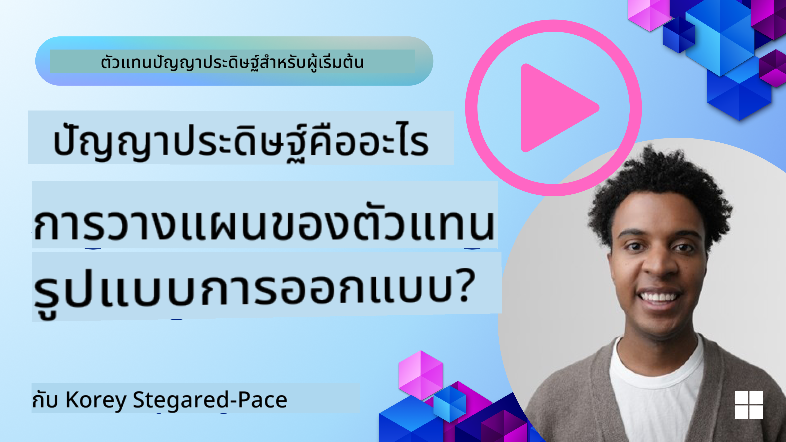
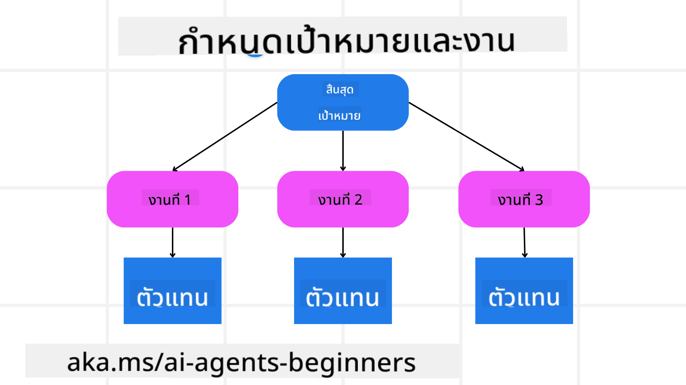

<!--
CO_OP_TRANSLATOR_METADATA:
{
  "original_hash": "a28d30590704ea13b6a08d4793cf9c2b",
  "translation_date": "2025-08-29T15:16:24+00:00",
  "source_file": "07-planning-design/README.md",
  "language_code": "th"
}
-->
[](https://youtu.be/kPfJ2BrBCMY?si=9pYpPXp0sSbK91Dr)

> _(คลิกที่ภาพด้านบนเพื่อดูวิดีโอของบทเรียนนี้)_

# การวางแผนการออกแบบ

## บทนำ

บทเรียนนี้จะครอบคลุมถึง

* การกำหนดเป้าหมายโดยรวมที่ชัดเจนและการแบ่งงานที่ซับซ้อนออกเป็นงานย่อยที่จัดการได้
* การใช้ผลลัพธ์ที่มีโครงสร้างเพื่อให้ได้คำตอบที่เชื่อถือได้และอ่านได้โดยเครื่อง
* การใช้แนวทางที่ขับเคลื่อนด้วยเหตุการณ์เพื่อจัดการกับงานแบบไดนามิกและอินพุตที่ไม่คาดคิด

## เป้าหมายการเรียนรู้

หลังจากจบบทเรียนนี้ คุณจะเข้าใจเกี่ยวกับ:

* การระบุและกำหนดเป้าหมายโดยรวมสำหรับตัวแทน AI เพื่อให้แน่ใจว่ามีความชัดเจนในสิ่งที่ต้องการบรรลุ
* การแยกงานที่ซับซ้อนออกเป็นงานย่อยที่จัดการได้และจัดระเบียบในลำดับที่มีเหตุผล
* การจัดเตรียมเครื่องมือที่เหมาะสมให้กับตัวแทน (เช่น เครื่องมือค้นหาหรือเครื่องมือวิเคราะห์ข้อมูล) ตัดสินใจว่าเมื่อใดและอย่างไรที่จะใช้ และจัดการกับสถานการณ์ที่ไม่คาดคิดที่เกิดขึ้น
* การประเมินผลลัพธ์ของงานย่อย วัดผลการปฏิบัติงาน และปรับปรุงการดำเนินการเพื่อปรับปรุงผลลัพธ์สุดท้าย

## การกำหนดเป้าหมายโดยรวมและการแบ่งงาน



งานส่วนใหญ่ในโลกความเป็นจริงมีความซับซ้อนเกินกว่าที่จะจัดการได้ในขั้นตอนเดียว ตัวแทน AI จำเป็นต้องมีวัตถุประสงค์ที่กระชับเพื่อเป็นแนวทางในการวางแผนและการดำเนินการ ตัวอย่างเช่น ลองพิจารณาเป้าหมาย:

    "สร้างแผนการเดินทาง 3 วัน"

แม้ว่าจะระบุได้ง่าย แต่ก็ยังต้องการการปรับแต่งเพิ่มเติม ยิ่งเป้าหมายชัดเจนมากเท่าใด ตัวแทน (และผู้ร่วมงานมนุษย์) ก็จะสามารถมุ่งเน้นไปที่การบรรลุผลลัพธ์ที่ถูกต้องได้ดีขึ้น เช่น การสร้างแผนการเดินทางที่ครอบคลุมพร้อมตัวเลือกเที่ยวบิน คำแนะนำโรงแรม และกิจกรรมที่แนะนำ

### การแยกงาน

งานที่ใหญ่หรือซับซ้อนสามารถจัดการได้ง่ายขึ้นเมื่อแบ่งออกเป็นงานย่อยที่มุ่งเน้นเป้าหมาย ตัวอย่างเช่น สำหรับแผนการเดินทาง คุณสามารถแยกเป้าหมายออกเป็น:

* การจองเที่ยวบิน
* การจองโรงแรม
* การเช่ารถ
* การปรับแต่งส่วนบุคคล

งานย่อยแต่ละงานสามารถจัดการได้โดยตัวแทนหรือกระบวนการเฉพาะ ตัวแทนหนึ่งอาจเชี่ยวชาญในการค้นหาข้อเสนอเที่ยวบินที่ดีที่สุด อีกตัวแทนหนึ่งมุ่งเน้นไปที่การจองโรงแรม เป็นต้น ตัวแทนที่ประสานงานหรือ "ตัวแทนปลายน้ำ" สามารถรวบรวมผลลัพธ์เหล่านี้เป็นแผนการเดินทางที่สอดคล้องกันสำหรับผู้ใช้ปลายทาง

แนวทางแบบแยกส่วนนี้ยังช่วยให้สามารถปรับปรุงได้ทีละขั้นตอน ตัวอย่างเช่น คุณสามารถเพิ่มตัวแทนเฉพาะสำหรับคำแนะนำด้านอาหารหรือกิจกรรมในท้องถิ่น และปรับปรุงแผนการเดินทางเมื่อเวลาผ่านไป

### ผลลัพธ์ที่มีโครงสร้าง

Large Language Models (LLMs) สามารถสร้างผลลัพธ์ที่มีโครงสร้าง (เช่น JSON) ซึ่งง่ายต่อการแยกวิเคราะห์และประมวลผลโดยตัวแทนหรือบริการปลายน้ำ สิ่งนี้มีประโยชน์อย่างยิ่งในบริบทของตัวแทนหลายตัว ซึ่งเราสามารถดำเนินการตามงานเหล่านี้หลังจากได้รับผลลัพธ์การวางแผนแล้ว สำหรับภาพรวมคร่าวๆ:

โค้ด Python ด้านล่างแสดงตัวอย่างตัวแทนการวางแผนที่แยกเป้าหมายออกเป็นงานย่อยและสร้างแผนที่มีโครงสร้าง:

```python
from pydantic import BaseModel
from enum import Enum
from typing import List, Optional, Union
import json
import os
from typing import Optional
from pprint import pprint
from autogen_core.models import UserMessage, SystemMessage, AssistantMessage
from autogen_ext.models.azure import AzureAIChatCompletionClient
from azure.core.credentials import AzureKeyCredential

class AgentEnum(str, Enum):
    FlightBooking = "flight_booking"
    HotelBooking = "hotel_booking"
    CarRental = "car_rental"
    ActivitiesBooking = "activities_booking"
    DestinationInfo = "destination_info"
    DefaultAgent = "default_agent"
    GroupChatManager = "group_chat_manager"

# Travel SubTask Model
class TravelSubTask(BaseModel):
    task_details: str
    assigned_agent: AgentEnum  # we want to assign the task to the agent

class TravelPlan(BaseModel):
    main_task: str
    subtasks: List[TravelSubTask]
    is_greeting: bool

client = AzureAIChatCompletionClient(
    model="gpt-4o-mini",
    endpoint="https://models.inference.ai.azure.com",
    # To authenticate with the model you will need to generate a personal access token (PAT) in your GitHub settings.
    # Create your PAT token by following instructions here: https://docs.github.com/en/authentication/keeping-your-account-and-data-secure/managing-your-personal-access-tokens
    credential=AzureKeyCredential(os.environ["GITHUB_TOKEN"]),
    model_info={
        "json_output": False,
        "function_calling": True,
        "vision": True,
        "family": "unknown",
    },
)

# Define the user message
messages = [
    SystemMessage(content="""You are an planner agent.
    Your job is to decide which agents to run based on the user's request.
                      Provide your response in JSON format with the following structure:
{'main_task': 'Plan a family trip from Singapore to Melbourne.',
 'subtasks': [{'assigned_agent': 'flight_booking',
               'task_details': 'Book round-trip flights from Singapore to '
                               'Melbourne.'}
    Below are the available agents specialised in different tasks:
    - FlightBooking: For booking flights and providing flight information
    - HotelBooking: For booking hotels and providing hotel information
    - CarRental: For booking cars and providing car rental information
    - ActivitiesBooking: For booking activities and providing activity information
    - DestinationInfo: For providing information about destinations
    - DefaultAgent: For handling general requests""", source="system"),
    UserMessage(
        content="Create a travel plan for a family of 2 kids from Singapore to Melboune", source="user"),
]

response = await client.create(messages=messages, extra_create_args={"response_format": 'json_object'})

response_content: Optional[str] = response.content if isinstance(
    response.content, str) else None
if response_content is None:
    raise ValueError("Response content is not a valid JSON string" )

pprint(json.loads(response_content))

# # Ensure the response content is a valid JSON string before loading it
# response_content: Optional[str] = response.content if isinstance(
#     response.content, str) else None
# if response_content is None:
#     raise ValueError("Response content is not a valid JSON string")

# # Print the response content after loading it as JSON
# pprint(json.loads(response_content))

# Validate the response content with the MathReasoning model
# TravelPlan.model_validate(json.loads(response_content))
```

### ตัวแทนการวางแผนพร้อมการประสานงานหลายตัวแทน

ในตัวอย่างนี้ Semantic Router Agent จะรับคำขอจากผู้ใช้ (เช่น "ฉันต้องการแผนโรงแรมสำหรับการเดินทางของฉัน")

ตัววางแผนจะ:

* รับแผนโรงแรม: ตัววางแผนจะรับข้อความของผู้ใช้และสร้างแผนการเดินทางที่มีโครงสร้างตามคำสั่งระบบ (รวมถึงรายละเอียดตัวแทนที่มีอยู่)
* แสดงรายการตัวแทนและเครื่องมือของพวกเขา: ตัวแทนที่ลงทะเบียนจะมีรายการตัวแทน (เช่น สำหรับเที่ยวบิน โรงแรม การเช่ารถ และกิจกรรม) พร้อมฟังก์ชันหรือเครื่องมือที่พวกเขาเสนอ
* ส่งแผนไปยังตัวแทนที่เกี่ยวข้อง: ขึ้นอยู่กับจำนวนงานย่อย ตัววางแผนอาจส่งข้อความโดยตรงไปยังตัวแทนเฉพาะ (สำหรับสถานการณ์งานเดียว) หรือประสานงานผ่านตัวจัดการแชทกลุ่มสำหรับการทำงานร่วมกันหลายตัวแทน
* สรุปผลลัพธ์: สุดท้าย ตัววางแผนจะสรุปแผนที่สร้างขึ้นเพื่อความชัดเจน

โค้ด Python ด้านล่างแสดงขั้นตอนเหล่านี้:

```python

from pydantic import BaseModel

from enum import Enum
from typing import List, Optional, Union

class AgentEnum(str, Enum):
    FlightBooking = "flight_booking"
    HotelBooking = "hotel_booking"
    CarRental = "car_rental"
    ActivitiesBooking = "activities_booking"
    DestinationInfo = "destination_info"
    DefaultAgent = "default_agent"
    GroupChatManager = "group_chat_manager"

# Travel SubTask Model

class TravelSubTask(BaseModel):
    task_details: str
    assigned_agent: AgentEnum # we want to assign the task to the agent

class TravelPlan(BaseModel):
    main_task: str
    subtasks: List[TravelSubTask]
    is_greeting: bool
import json
import os
from typing import Optional

from autogen_core.models import UserMessage, SystemMessage, AssistantMessage
from autogen_ext.models.openai import AzureOpenAIChatCompletionClient

# Create the client with type-checked environment variables

client = AzureOpenAIChatCompletionClient(
    azure_deployment=os.getenv("AZURE_OPENAI_DEPLOYMENT_NAME"),
    model=os.getenv("AZURE_OPENAI_DEPLOYMENT_NAME"),
    api_version=os.getenv("AZURE_OPENAI_API_VERSION"),
    azure_endpoint=os.getenv("AZURE_OPENAI_ENDPOINT"),
    api_key=os.getenv("AZURE_OPENAI_API_KEY"),
)

from pprint import pprint

# Define the user message

messages = [
    SystemMessage(content="""You are an planner agent.
    Your job is to decide which agents to run based on the user's request.
    Below are the available agents specialized in different tasks:
    - FlightBooking: For booking flights and providing flight information
    - HotelBooking: For booking hotels and providing hotel information
    - CarRental: For booking cars and providing car rental information
    - ActivitiesBooking: For booking activities and providing activity information
    - DestinationInfo: For providing information about destinations
    - DefaultAgent: For handling general requests""", source="system"),
    UserMessage(content="Create a travel plan for a family of 2 kids from Singapore to Melbourne", source="user"),
]

response = await client.create(messages=messages, extra_create_args={"response_format": TravelPlan})

# Ensure the response content is a valid JSON string before loading it

response_content: Optional[str] = response.content if isinstance(response.content, str) else None
if response_content is None:
    raise ValueError("Response content is not a valid JSON string")

# Print the response content after loading it as JSON

pprint(json.loads(response_content))
```

ผลลัพธ์จากโค้ดก่อนหน้านี้สามารถใช้เพื่อส่งไปยัง `assigned_agent` และสรุปแผนการเดินทางให้กับผู้ใช้ปลายทาง

```json
{
    "is_greeting": "False",
    "main_task": "Plan a family trip from Singapore to Melbourne.",
    "subtasks": [
        {
            "assigned_agent": "flight_booking",
            "task_details": "Book round-trip flights from Singapore to Melbourne."
        },
        {
            "assigned_agent": "hotel_booking",
            "task_details": "Find family-friendly hotels in Melbourne."
        },
        {
            "assigned_agent": "car_rental",
            "task_details": "Arrange a car rental suitable for a family of four in Melbourne."
        },
        {
            "assigned_agent": "activities_booking",
            "task_details": "List family-friendly activities in Melbourne."
        },
        {
            "assigned_agent": "destination_info",
            "task_details": "Provide information about Melbourne as a travel destination."
        }
    ]
}
```

ตัวอย่างโน้ตบุ๊กที่มีโค้ดตัวอย่างก่อนหน้านี้สามารถดูได้ [ที่นี่](07-autogen.ipynb)

### การวางแผนแบบวนซ้ำ

งานบางอย่างต้องการการทำซ้ำหรือการวางแผนใหม่ โดยที่ผลลัพธ์ของงานย่อยหนึ่งมีผลต่ออีกงานหนึ่ง ตัวอย่างเช่น หากตัวแทนพบรูปแบบข้อมูลที่ไม่คาดคิดขณะจองเที่ยวบิน อาจต้องปรับกลยุทธ์ก่อนดำเนินการจองโรงแรม

นอกจากนี้ ข้อเสนอแนะจากผู้ใช้ (เช่น มนุษย์ที่ตัดสินใจว่าต้องการเที่ยวบินที่เร็วกว่า) อาจกระตุ้นให้มีการวางแผนใหม่บางส่วน แนวทางแบบไดนามิกและแบบวนซ้ำนี้ช่วยให้มั่นใจได้ว่าผลลัพธ์สุดท้ายสอดคล้องกับข้อจำกัดในโลกแห่งความเป็นจริงและความต้องการของผู้ใช้ที่เปลี่ยนแปลงไป

ตัวอย่างโค้ด:

```python
from autogen_core.models import UserMessage, SystemMessage, AssistantMessage
#.. same as previous code and pass on the user history, current plan
messages = [
    SystemMessage(content="""You are a planner agent to optimize the
    Your job is to decide which agents to run based on the user's request.
    Below are the available agents specialized in different tasks:
    - FlightBooking: For booking flights and providing flight information
    - HotelBooking: For booking hotels and providing hotel information
    - CarRental: For booking cars and providing car rental information
    - ActivitiesBooking: For booking activities and providing activity information
    - DestinationInfo: For providing information about destinations
    - DefaultAgent: For handling general requests""", source="system"),
    UserMessage(content="Create a travel plan for a family of 2 kids from Singapore to Melbourne", source="user"),
    AssistantMessage(content=f"Previous travel plan - {TravelPlan}", source="assistant")
]
# .. re-plan and send the tasks to respective agents
```

สำหรับการวางแผนที่ครอบคลุมมากขึ้น ลองดู Magnetic One สำหรับการแก้ปัญหางานที่ซับซ้อน

## สรุป

ในบทความนี้ เราได้ดูตัวอย่างวิธีการสร้างตัววางแผนที่สามารถเลือกตัวแทนที่มีอยู่ตามงานได้แบบไดนามิก ผลลัพธ์ของตัววางแผนจะแยกงานและกำหนดตัวแทนเพื่อให้สามารถดำเนินการได้ โดยสมมติว่าตัวแทนมีฟังก์ชัน/เครื่องมือที่จำเป็นในการทำงาน นอกจากตัวแทนแล้ว คุณยังสามารถรวมรูปแบบอื่นๆ เช่น การสะท้อน การสรุป และการแชทแบบวนรอบเพื่อปรับแต่งเพิ่มเติม

## ทรัพยากรเพิ่มเติม

* AutoGen Magnetic One - ระบบตัวแทนทั่วไปสำหรับการแก้ปัญหางานที่ซับซ้อนและประสบความสำเร็จอย่างน่าประทับใจในเกณฑ์มาตรฐานตัวแทนที่ท้าทายหลายรายการ อ้างอิง:

ในระบบนี้ ตัวประสานงานจะสร้างแผนเฉพาะงานและมอบหมายงานเหล่านี้ให้กับตัวแทนที่มีอยู่ นอกจากการวางแผนแล้ว ตัวประสานงานยังใช้กลไกการติดตามเพื่อตรวจสอบความคืบหน้าของงานและวางแผนใหม่ตามความจำเป็น

### มีคำถามเพิ่มเติมเกี่ยวกับรูปแบบการออกแบบการวางแผนหรือไม่?

เข้าร่วม [Azure AI Foundry Discord](https://aka.ms/ai-agents/discord) เพื่อพบปะกับผู้เรียนคนอื่นๆ เข้าร่วมชั่วโมงทำการ และรับคำตอบสำหรับคำถามเกี่ยวกับ AI Agents ของคุณ

## บทเรียนก่อนหน้า

[การสร้างตัวแทน AI ที่น่าเชื่อถือ](../06-building-trustworthy-agents/README.md)

## บทเรียนถัดไป

[รูปแบบการออกแบบตัวแทนหลายตัว](../08-multi-agent/README.md)

---

**ข้อจำกัดความรับผิดชอบ**:  
เอกสารนี้ได้รับการแปลโดยใช้บริการแปลภาษา AI [Co-op Translator](https://github.com/Azure/co-op-translator) แม้ว่าเราจะพยายามให้การแปลมีความถูกต้อง แต่โปรดทราบว่าการแปลอัตโนมัติอาจมีข้อผิดพลาดหรือความไม่แม่นยำ เอกสารต้นฉบับในภาษาดั้งเดิมควรถือเป็นแหล่งข้อมูลที่เชื่อถือได้ สำหรับข้อมูลที่สำคัญ แนะนำให้ใช้บริการแปลภาษาจากผู้เชี่ยวชาญ เราไม่รับผิดชอบต่อความเข้าใจผิดหรือการตีความที่ผิดพลาดซึ่งเกิดจากการใช้การแปลนี้