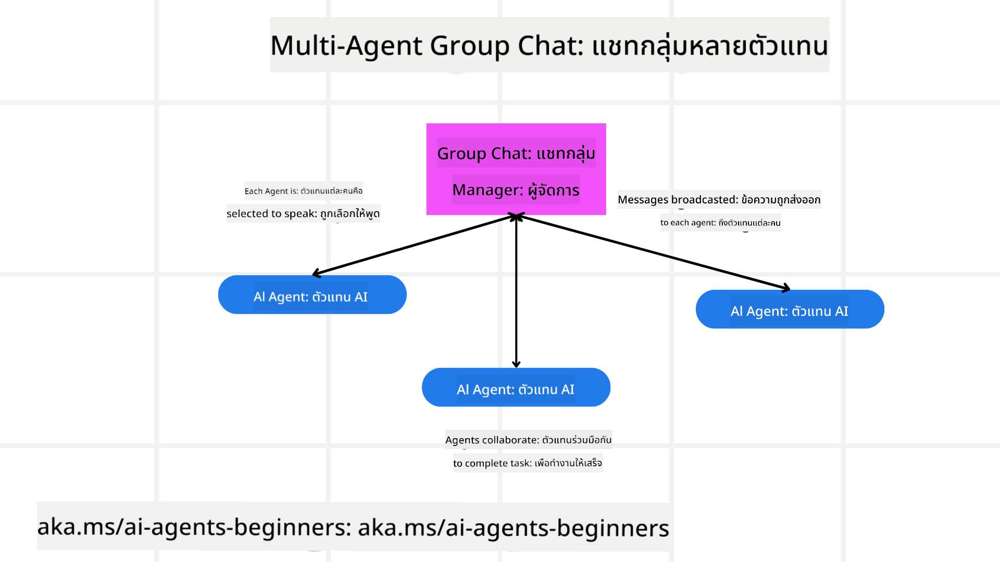
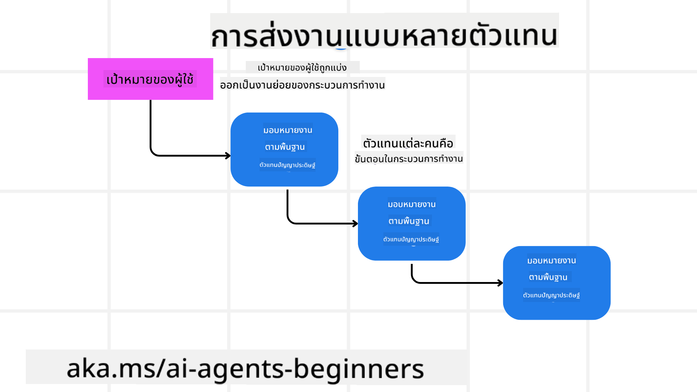
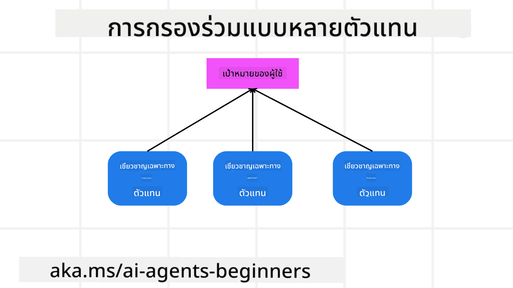

<!--
CO_OP_TRANSLATOR_METADATA:
{
  "original_hash": "c692a8975d7d5b99575a553de1c5e8a7",
  "translation_date": "2025-07-12T11:11:49+00:00",
  "source_file": "08-multi-agent/README.md",
  "language_code": "th"
}
-->

> _(คลิกที่ภาพด้านบนเพื่อดูวิดีโอของบทเรียนนี้)_

# รูปแบบการออกแบบแบบหลายเอเจนต์

ทันทีที่คุณเริ่มทำงานในโปรเจกต์ที่เกี่ยวข้องกับหลายเอเจนต์ คุณจะต้องพิจารณารูปแบบการออกแบบแบบหลายเอเจนต์ อย่างไรก็ตาม อาจไม่ชัดเจนทันทีว่าเมื่อไหร่ควรเปลี่ยนไปใช้หลายเอเจนต์และข้อดีของมันคืออะไร

## บทนำ

ในบทเรียนนี้ เราจะพยายามตอบคำถามดังต่อไปนี้:

- สถานการณ์ใดบ้างที่เหมาะสมกับการใช้หลายเอเจนต์?
- ข้อดีของการใช้หลายเอเจนต์เมื่อเทียบกับการใช้เอเจนต์เดียวที่ทำหลายงานคืออะไร?
- องค์ประกอบพื้นฐานของการนำรูปแบบการออกแบบหลายเอเจนต์ไปใช้มีอะไรบ้าง?
- เราจะมองเห็นการทำงานร่วมกันระหว่างหลายเอเจนต์ได้อย่างไร?

## เป้าหมายการเรียนรู้

หลังจากบทเรียนนี้ คุณควรจะสามารถ:

- ระบุสถานการณ์ที่เหมาะสมกับการใช้หลายเอเจนต์
- เข้าใจข้อดีของการใช้หลายเอเจนต์เมื่อเทียบกับเอเจนต์เดียว
- เข้าใจองค์ประกอบพื้นฐานของการนำรูปแบบการออกแบบหลายเอเจนต์ไปใช้

ภาพรวมคืออะไร?

*หลายเอเจนต์เป็นรูปแบบการออกแบบที่ช่วยให้หลายเอเจนต์ทำงานร่วมกันเพื่อบรรลุเป้าหมายร่วมกัน*

รูปแบบนี้ถูกใช้กันอย่างแพร่หลายในหลายสาขา เช่น หุ่นยนต์ ระบบอัตโนมัติ และการประมวลผลแบบกระจาย

## สถานการณ์ที่เหมาะสมกับการใช้หลายเอเจนต์

แล้วสถานการณ์ใดบ้างที่เหมาะกับการใช้หลายเอเจนต์? คำตอบคือมีหลายสถานการณ์ที่การใช้หลายเอเจนต์เป็นประโยชน์ โดยเฉพาะในกรณีต่อไปนี้:

- **งานที่มีปริมาณมาก**: งานที่มีปริมาณมากสามารถแบ่งเป็นงานย่อยๆ และมอบหมายให้เอเจนต์ต่างๆ ทำงานพร้อมกันได้ ทำให้ประมวลผลได้เร็วขึ้น ตัวอย่างเช่น งานประมวลผลข้อมูลขนาดใหญ่
- **งานที่ซับซ้อน**: งานที่ซับซ้อน เช่น งานที่มีปริมาณมาก สามารถแบ่งเป็นงานย่อยที่เอเจนต์แต่ละตัวเชี่ยวชาญในด้านเฉพาะ เช่น ในกรณียานยนต์อัตโนมัติที่เอเจนต์แต่ละตัวดูแลการนำทาง การตรวจจับสิ่งกีดขวาง และการสื่อสารกับยานยนต์อื่นๆ
- **ความเชี่ยวชาญที่หลากหลาย**: เอเจนต์แต่ละตัวอาจมีความเชี่ยวชาญที่แตกต่างกัน ทำให้สามารถจัดการงานในแต่ละด้านได้ดีกว่าเอเจนต์เดียว ตัวอย่างเช่น ในวงการดูแลสุขภาพที่เอเจนต์ดูแลการวินิจฉัย แผนการรักษา และการติดตามผู้ป่วย

## ข้อดีของการใช้หลายเอเจนต์เมื่อเทียบกับเอเจนต์เดียว

ระบบเอเจนต์เดียวอาจเหมาะกับงานง่ายๆ แต่สำหรับงานที่ซับซ้อน การใช้หลายเอเจนต์มีข้อดีหลายประการ:

- **ความเชี่ยวชาญเฉพาะด้าน**: เอเจนต์แต่ละตัวสามารถเชี่ยวชาญในงานเฉพาะด้านได้ การไม่มีความเชี่ยวชาญเฉพาะในเอเจนต์เดียวอาจทำให้สับสนเมื่อต้องจัดการงานซับซ้อน และอาจทำงานที่ไม่เหมาะสมกับความสามารถของตัวเอง
- **การขยายระบบ**: การเพิ่มจำนวนเอเจนต์ทำได้ง่ายกว่าการเพิ่มภาระให้เอเจนต์เดียว
- **ความทนทานต่อความผิดพลาด**: หากเอเจนต์ตัวใดล้มเหลว เอเจนต์ตัวอื่นยังสามารถทำงานต่อได้ ทำให้ระบบมีความน่าเชื่อถือ

ลองยกตัวอย่างการจองทริปสำหรับผู้ใช้ ระบบเอเจนต์เดียวจะต้องจัดการทุกขั้นตอน ตั้งแต่การหาตั๋วเครื่องบิน การจองโรงแรม และรถเช่า เพื่อให้เอเจนต์เดียวทำงานนี้ได้ จะต้องมีเครื่องมือสำหรับจัดการทุกงาน ซึ่งอาจทำให้ระบบซับซ้อนและดูแลรักษายาก ในขณะที่ระบบหลายเอเจนต์จะมีเอเจนต์เฉพาะสำหรับหาตั๋วเครื่องบิน จองโรงแรม และรถเช่า ทำให้ระบบมีความยืดหยุ่น ดูแลรักษาง่าย และขยายได้ง่ายกว่า

เปรียบเทียบกับสำนักงานท่องเที่ยวแบบร้านเล็กๆ ที่มีเอเจนต์เดียวดูแลทุกอย่าง กับสำนักงานท่องเที่ยวแบบแฟรนไชส์ที่มีเอเจนต์หลายตัวดูแลแต่ละส่วนของการจองทริป

## องค์ประกอบพื้นฐานของการนำรูปแบบการออกแบบหลายเอเจนต์ไปใช้

ก่อนจะนำรูปแบบการออกแบบหลายเอเจนต์ไปใช้ คุณต้องเข้าใจองค์ประกอบพื้นฐานที่ประกอบกันเป็นรูปแบบนี้

ขอยกตัวอย่างการจองทริปสำหรับผู้ใช้อีกครั้ง องค์ประกอบพื้นฐานจะประกอบด้วย:

- **การสื่อสารระหว่างเอเจนต์**: เอเจนต์ที่หาตั๋วเครื่องบิน จองโรงแรม และรถเช่าต้องสื่อสารและแลกเปลี่ยนข้อมูลเกี่ยวกับความต้องการและข้อจำกัดของผู้ใช้ คุณต้องกำหนดโปรโตคอลและวิธีการสื่อสาร เช่น เอเจนต์หาตั๋วเครื่องบินต้องสื่อสารกับเอเจนต์จองโรงแรมเพื่อให้แน่ใจว่าโรงแรมถูกจองในวันที่ตรงกับเที่ยวบิน นั่นหมายความว่าเอเจนต์ต้องแชร์ข้อมูลวันที่เดินทางของผู้ใช้ คุณต้องตัดสินใจ *ว่าเอเจนต์ใดแชร์ข้อมูลอะไรและแชร์อย่างไร*
- **กลไกการประสานงาน**: เอเจนต์ต้องประสานงานกันเพื่อให้ตรงกับความต้องการและข้อจำกัดของผู้ใช้ เช่น ผู้ใช้อาจต้องการโรงแรมใกล้สนามบิน ขณะที่ข้อจำกัดคือรถเช่ามีให้บริการเฉพาะที่สนามบิน ดังนั้นเอเจนต์จองโรงแรมต้องประสานกับเอเจนต์จองรถเช่าเพื่อให้ตรงกับความต้องการและข้อจำกัดนี้ คุณต้องตัดสินใจ *ว่าเอเจนต์ประสานงานกันอย่างไร*
- **สถาปัตยกรรมของเอเจนต์**: เอเจนต์ต้องมีโครงสร้างภายในที่ช่วยให้ตัดสินใจและเรียนรู้จากการโต้ตอบกับผู้ใช้ เช่น เอเจนต์หาตั๋วเครื่องบินต้องมีโครงสร้างภายในที่ช่วยตัดสินใจว่าจะแนะนำเที่ยวบินใดให้ผู้ใช้ คุณต้องตัดสินใจ *ว่าเอเจนต์ตัดสินใจและเรียนรู้อย่างไร* ตัวอย่างเช่น เอเจนต์หาตั๋วเครื่องบินอาจใช้โมเดลการเรียนรู้ของเครื่องเพื่อแนะนำเที่ยวบินตามความชอบในอดีตของผู้ใช้
- **การมองเห็นการโต้ตอบของหลายเอเจนต์**: คุณต้องมีเครื่องมือและเทคนิคในการติดตามกิจกรรมและการโต้ตอบของเอเจนต์ เช่น เครื่องมือบันทึกและตรวจสอบ เครื่องมือแสดงผล และตัวชี้วัดประสิทธิภาพ
- **รูปแบบของหลายเอเจนต์**: มีรูปแบบต่างๆ สำหรับการสร้างระบบหลายเอเจนต์ เช่น สถาปัตยกรรมแบบรวมศูนย์ แบบกระจาย และแบบผสม คุณต้องเลือกใช้รูปแบบที่เหมาะสมกับกรณีใช้งานของคุณ
- **มนุษย์ในวงจร**: ในหลายกรณีจะมีมนุษย์เข้ามาเกี่ยวข้อง และคุณต้องกำหนดว่าเอเจนต์ควรขอการแทรกแซงจากมนุษย์เมื่อใด เช่น ผู้ใช้ขอโรงแรมหรือเที่ยวบินเฉพาะที่เอเจนต์ไม่ได้แนะนำ หรือขอการยืนยันก่อนจอง

## การมองเห็นการโต้ตอบของหลายเอเจนต์

การมองเห็นว่าหลายเอเจนต์โต้ตอบกันอย่างไรเป็นสิ่งสำคัญสำหรับการแก้ไขปัญหา ปรับปรุง และรับประกันประสิทธิภาพของระบบโดยรวม เพื่อให้ได้มาซึ่งการมองเห็นนี้ คุณต้องมีเครื่องมือและเทคนิคในการติดตามกิจกรรมและการโต้ตอบของเอเจนต์ เช่น เครื่องมือบันทึกและตรวจสอบ เครื่องมือแสดงผล และตัวชี้วัดประสิทธิภาพ

ตัวอย่างเช่น ในกรณีการจองทริปสำหรับผู้ใช้ คุณอาจมีแดชบอร์ดที่แสดงสถานะของแต่ละเอเจนต์ ความต้องการและข้อจำกัดของผู้ใช้ และการโต้ตอบระหว่างเอเจนต์ แดชบอร์ดนี้อาจแสดงวันที่เดินทาง เที่ยวบินที่เอเจนต์หาตั๋วแนะนำ โรงแรมที่เอเจนต์จองแนะนำ และรถเช่าที่เอเจนต์แนะนำ ซึ่งจะช่วยให้เห็นภาพชัดเจนว่าเอเจนต์โต้ตอบกันอย่างไรและความต้องการของผู้ใช้ได้รับการตอบสนองหรือไม่

มาดูรายละเอียดแต่ละส่วนกัน

- **เครื่องมือบันทึกและตรวจสอบ**: คุณควรบันทึกการกระทำของเอเจนต์แต่ละตัว ข้อมูลในบันทึกอาจประกอบด้วยเอเจนต์ที่ทำการกระทำ การกระทำที่ทำ เวลา และผลลัพธ์ ข้อมูลนี้ช่วยในการแก้ไขปัญหาและปรับปรุงระบบ
- **เครื่องมือแสดงผล**: เครื่องมือแสดงผลช่วยให้เห็นการโต้ตอบระหว่างเอเจนต์ในรูปแบบที่เข้าใจง่าย เช่น กราฟแสดงการไหลของข้อมูลระหว่างเอเจนต์ ซึ่งช่วยระบุจุดคับข้องใจ ความไม่มีประสิทธิภาพ และปัญหาอื่นๆ ในระบบ
- **ตัวชี้วัดประสิทธิภาพ**: ตัวชี้วัดช่วยติดตามประสิทธิภาพของระบบหลายเอเจนต์ เช่น เวลาที่ใช้ในการทำงานให้เสร็จ จำนวนงานที่ทำได้ต่อหน่วยเวลา และความแม่นยำของคำแนะนำที่เอเจนต์ให้ ข้อมูลนี้ช่วยระบุจุดที่ต้องปรับปรุงและเพิ่มประสิทธิภาพระบบ

## รูปแบบของหลายเอเจนต์

มาดูรูปแบบที่ใช้สร้างแอปหลายเอเจนต์กัน มีรูปแบบที่น่าสนใจดังนี้:

### แชทกลุ่ม

รูปแบบนี้เหมาะสำหรับสร้างแอปแชทกลุ่มที่หลายเอเจนต์สามารถสื่อสารกันได้ กรณีใช้งานทั่วไป เช่น การทำงานเป็นทีม การสนับสนุนลูกค้า และเครือข่ายสังคม

ในรูปแบบนี้ เอเจนต์แต่ละตัวแทนผู้ใช้ในแชทกลุ่ม และส่งข้อความระหว่างกันโดยใช้โปรโตคอลการส่งข้อความ เอเจนต์สามารถส่ง รับ และตอบข้อความในกลุ่มได้

รูปแบบนี้สามารถใช้สถาปัตยกรรมแบบรวมศูนย์ที่ข้อความทั้งหมดผ่านเซิร์ฟเวอร์กลาง หรือแบบกระจายที่ข้อความส่งตรงระหว่างเอเจนต์

### การส่งงานต่อ

รูปแบบนี้เหมาะสำหรับแอปที่หลายเอเจนต์สามารถส่งงานต่อกันได้

กรณีใช้งานทั่วไป เช่น การสนับสนุนลูกค้า การจัดการงาน และระบบอัตโนมัติของเวิร์กโฟลว์

ในรูปแบบนี้ เอเจนต์แต่ละตัวแทนงานหรือขั้นตอนในเวิร์กโฟลว์ และสามารถส่งงานต่อให้เอเจนต์อื่นตามกฎที่กำหนดไว้

### การกรองแบบร่วมมือ

รูปแบบนี้เหมาะสำหรับแอปที่หลายเอเจนต์ร่วมมือกันเพื่อแนะนำสิ่งต่างๆ ให้ผู้ใช้

เหตุผลที่ต้องการให้หลายเอเจนต์ร่วมมือกันคือแต่ละเอเจนต์มีความเชี่ยวชาญต่างกันและสามารถช่วยในกระบวนการแนะนำในรูปแบบที่แตกต่างกัน

ยกตัวอย่างผู้ใช้ที่ต้องการคำแนะนำหุ้นที่ดีที่สุดในการลงทุน

- **ผู้เชี่ยวชาญอุตสาหกรรม**: เอเจนต์หนึ่งอาจเป็นผู้เชี่ยวชาญในอุตสาหกรรมเฉพาะ
- **การวิเคราะห์ทางเทคนิค**: เอเจนต์อีกตัวอาจเชี่ยวชาญการวิเคราะห์ทางเทคนิค
- **การวิเคราะห์พื้นฐาน**: เอเจนต์อีกตัวอาจเชี่ยวชาญการวิเคราะห์พื้นฐาน โดยการร่วมมือกัน เอเจนต์เหล่านี้จะให้คำแนะนำที่ครอบคลุมมากขึ้นแก่ผู้ใช้

## กรณีศึกษา: กระบวนการคืนเงิน

ลองพิจารณากรณีที่ลูกค้าต้องการขอคืนเงินสำหรับสินค้า อาจมีเอเจนต์หลายตัวเข้ามาเกี่ยวข้องในกระบวนการนี้ แต่เราจะแบ่งเอเจนต์ออกเป็นสองกลุ่ม คือเอเจนต์เฉพาะสำหรับกระบวนการคืนเงิน และเอเจนต์ทั่วไปที่ใช้ในกระบวนการอื่นๆ

**เอเจนต์เฉพาะสำหรับกระบวนการคืนเงิน**:

เอเจนต์ที่อาจเกี่ยวข้องในกระบวนการคืนเงิน ได้แก่:

- **เอเจนต์ลูกค้า**: แทนลูกค้าและรับผิดชอบเริ่มต้นกระบวนการคืนเงิน
- **เอเจนต์ผู้ขาย**: แทนผู้ขายและรับผิดชอบดำเนินการคืนเงิน
- **เอเจนต์การชำระเงิน**: แทนกระบวนการชำระเงินและรับผิดชอบคืนเงินให้ลูกค้า
- **เอเจนต์แก้ไขปัญหา**: แทนกระบวนการแก้ไขปัญหาและรับผิดชอบแก้ไขปัญหาที่เกิดขึ้นระหว่างกระบวนการคืนเงิน
- **เอเจนต์ปฏิบัติตามกฎระเบียบ**: แทนกระบวนการตรวจสอบและรับผิดชอบให้กระบวนการคืนเงินเป็นไปตามกฎระเบียบและนโยบาย

**เอเจนต์ทั่วไป**:

เอเจนต์เหล่านี้สามารถใช้ในส่วนอื่นๆ ของธุรกิจได้

- **เอเจนต์จัดส่ง**: แทนกระบวนการจัดส่งและรับผิดชอบจัดส่งสินค้ากลับไปยังผู้ขาย เอเจนต์นี้ใช้ได้ทั้งในกระบวนการคืนเงินและการจัดส่งสินค้าทั่วไป เช่น การซื้อสินค้า
- **เอเจนต์รับฟังความคิดเห็น**: แทนกระบวนการรับฟังความคิดเห็นและรับผิดชอบเก็บข้อมูลความคิดเห็นจากลูกค้า ซึ่งอาจเกิดขึ้นได้ทุกเวลา ไม่จำกัดเฉพาะในกระบวนการคืนเงิน
- **เอเจนต์ยกระดับปัญหา**: แทนกระบวนการยกระดับปัญหาและรับผิดชอบส่งต่อปัญหาไปยังระดับสนับสนุนที่สูงขึ้น ใช้ได้กับทุกกระบวนการที่ต้องการยกระดับปัญหา
- **เอเจนต์แจ้งเตือน**: แทนกระบวนการแจ้งเตือนและรับผิดชอบส่งการแจ้งเตือนไปยังลูกค้าในแต่ละขั้นตอนของกระบวนการคืนเงิน
- **เอเจนต์วิเคราะห์ข้อมูล**: แทนกระบวนการวิเคราะห์ข้อมูลและรับผิดชอบวิเคราะห์ข้อมูลที่เกี่ยวข้องกับกระบวนการคืนเงิน
- **เอเจนต์ตรวจสอบ**: แทนกระบวนการตรวจสอบและรับผิดชอบตรวจสอบกระบวนการคืนเงินให้ดำเนินการอย่างถูกต้อง
- **เอเจนต์รายงาน**: แทนกระบวนการรายงานและรับผิดชอบสร้างรายงานเกี่ยวกับกระบวนการคืนเงิน
- **เอเจนต์ความรู้**: แทนกระบวนการจัดการความรู้และรับผิดชอบดูแลฐานความรู้ที่เกี่ยวข้องกับกระบวนการคืนเงิน เอเจนต์นี้อาจมีความรู้ทั้งเรื่องการคืนเงินและส่วนอื่นๆ ของธุรกิจ
- **เอเจนต์ความปลอดภัย**: แทนกระบวนการรักษาความปลอดภัยและรับผิดชอบดูแลความปลอดภัยของกระบวนการคืนเงิน
- **เอเจนต์คุณภาพ**: แทนกระบวนการควบคุมคุณภาพและรับผิดชอบดูแลคุณภาพของกระบวนการคืนเงิน

มีเอเจนต์หลายตัวที่กล่าวถึงทั้งในส่วนของกระบวนการคืนเงินเฉพาะและเอเจนต์ทั่วไปที่ใช้ในส่วนอื่นๆ ของธุรกิจ หวังว่านี่จะช่วยให้คุณเห็นภาพว่าคุณจะเลือกใช้เอเจนต์ใดบ้างในระบบหลายเอเจนต์ของคุณ

## การบ้าน
## บทเรียนก่อนหน้า

[การวางแผนการออกแบบ](../07-planning-design/README.md)

## บทเรียนถัดไป

[การรู้คิดในตัวแทน AI](../09-metacognition/README.md)

**ข้อจำกัดความรับผิดชอบ**:  
เอกสารนี้ได้รับการแปลโดยใช้บริการแปลภาษาอัตโนมัติ [Co-op Translator](https://github.com/Azure/co-op-translator) แม้เราจะพยายามให้ความถูกต้องสูงสุด แต่โปรดทราบว่าการแปลอัตโนมัติอาจมีข้อผิดพลาดหรือความไม่ถูกต้อง เอกสารต้นฉบับในภาษาต้นทางถือเป็นแหล่งข้อมูลที่เชื่อถือได้ สำหรับข้อมูลที่สำคัญ ขอแนะนำให้ใช้บริการแปลโดยผู้เชี่ยวชาญมนุษย์ เราไม่รับผิดชอบต่อความเข้าใจผิดหรือการตีความผิดใด ๆ ที่เกิดจากการใช้การแปลนี้