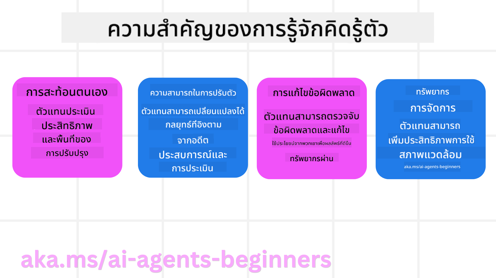
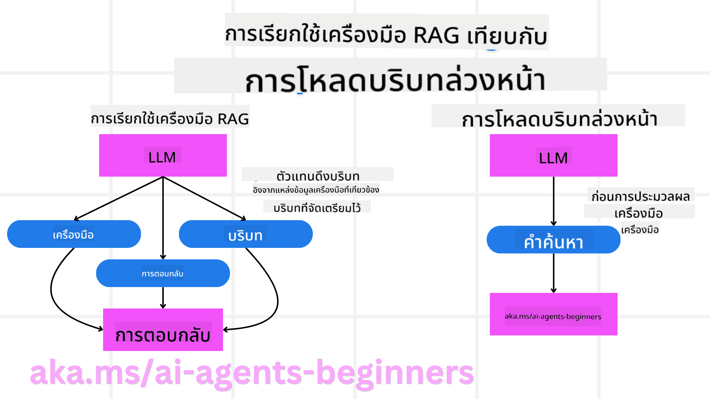

<!--
CO_OP_TRANSLATOR_METADATA:
{
  "original_hash": "8cbf460468c802c7994aa62e0e0779c9",
  "translation_date": "2025-07-12T12:40:08+00:00",
  "source_file": "09-metacognition/README.md",
  "language_code": "th"
}
-->
[](https://youtu.be/His9R6gw6Ec?si=3_RMb8VprNvdLRhX)

> _(คลิกที่ภาพด้านบนเพื่อดูวิดีโอบทเรียนนี้)_
# การรู้คิดรู้ตัวในเอเจนต์ AI

## บทนำ

ยินดีต้อนรับสู่บทเรียนเกี่ยวกับการรู้คิดรู้ตัวในเอเจนต์ AI! บทนี้ออกแบบมาสำหรับผู้เริ่มต้นที่สนใจว่าเอเจนต์ AI จะสามารถคิดเกี่ยวกับกระบวนการคิดของตัวเองได้อย่างไร เมื่อจบบทเรียนนี้ คุณจะเข้าใจแนวคิดสำคัญและมีตัวอย่างใช้งานจริงเพื่อประยุกต์ใช้การรู้คิดรู้ตัวในการออกแบบเอเจนต์ AI

## เป้าหมายการเรียนรู้

หลังจากเรียนจบบทนี้ คุณจะสามารถ:

1. เข้าใจผลกระทบของวงจรการให้เหตุผลในนิยามของเอเจนต์
2. ใช้เทคนิคการวางแผนและประเมินผลเพื่อช่วยเอเจนต์ที่สามารถแก้ไขตัวเองได้
3. สร้างเอเจนต์ของคุณเองที่สามารถจัดการโค้ดเพื่อทำงานให้สำเร็จ

## แนะนำการรู้คิดรู้ตัว

การรู้คิดรู้ตัวหมายถึงกระบวนการรับรู้ขั้นสูงที่เกี่ยวข้องกับการคิดเกี่ยวกับการคิดของตัวเอง สำหรับเอเจนต์ AI นั่นหมายถึงความสามารถในการประเมินและปรับเปลี่ยนการกระทำของตนเองโดยอิงจากความตระหนักรู้ในตัวเองและประสบการณ์ที่ผ่านมา การรู้คิดรู้ตัว หรือ "การคิดเกี่ยวกับการคิด" เป็นแนวคิดสำคัญในการพัฒนาระบบ AI ที่มีความเป็นตัวแทน (agentic) ซึ่งเกี่ยวข้องกับระบบ AI ที่ตระหนักถึงกระบวนการภายในของตนเอง และสามารถตรวจสอบ ควบคุม และปรับเปลี่ยนพฤติกรรมได้อย่างเหมาะสม คล้ายกับที่เราทำเมื่อเราสังเกตบรรยากาศหรือวิเคราะห์ปัญหา ความตระหนักรู้ในตัวเองนี้ช่วยให้ระบบ AI ตัดสินใจได้ดีขึ้น ระบุข้อผิดพลาด และพัฒนาประสิทธิภาพของตนเองเมื่อเวลาผ่านไป — ซึ่งเชื่อมโยงกลับไปยังการทดสอบทัวริงและการถกเถียงว่า AI จะเข้ามาควบคุมหรือไม่

ในบริบทของระบบ AI ที่มีความเป็นตัวแทน การรู้คิดรู้ตัวช่วยแก้ไขปัญหาหลายอย่าง เช่น:
- ความโปร่งใส: ทำให้ระบบ AI สามารถอธิบายเหตุผลและการตัดสินใจของตนเองได้
- การให้เหตุผล: เพิ่มความสามารถของระบบ AI ในการสังเคราะห์ข้อมูลและตัดสินใจอย่างมีเหตุผล
- การปรับตัว: ช่วยให้ระบบ AI ปรับตัวเข้ากับสภาพแวดล้อมใหม่และสถานการณ์ที่เปลี่ยนแปลงได้
- การรับรู้: ปรับปรุงความแม่นยำของระบบ AI ในการจดจำและตีความข้อมูลจากสภาพแวดล้อม

### การรู้คิดรู้ตัวคืออะไร?

การรู้คิดรู้ตัว หรือ "การคิดเกี่ยวกับการคิด" คือกระบวนการรับรู้ขั้นสูงที่เกี่ยวข้องกับความตระหนักรู้และการควบคุมตนเองของกระบวนการรับรู้ ในโลกของ AI การรู้คิดรู้ตัวช่วยให้เอเจนต์สามารถประเมินและปรับเปลี่ยนกลยุทธ์และการกระทำของตนเอง ส่งผลให้มีความสามารถในการแก้ปัญหาและตัดสินใจที่ดีขึ้น เมื่อเข้าใจการรู้คิดรู้ตัว คุณจะสามารถออกแบบเอเจนต์ AI ที่ไม่เพียงแค่ฉลาดขึ้น แต่ยังปรับตัวและมีประสิทธิภาพมากขึ้น ในการรู้คิดรู้ตัวอย่างแท้จริง คุณจะเห็น AI ให้เหตุผลเกี่ยวกับการให้เหตุผลของตัวเองอย่างชัดเจน

ตัวอย่าง: “ฉันเลือกไฟลท์ที่ถูกกว่าเพราะ... อาจจะพลาดไฟลท์ตรง ดังนั้นขอเช็คใหม่อีกครั้ง”
ติดตามว่าทำไมถึงเลือกเส้นทางนั้น
- สังเกตว่าทำผิดพลาดเพราะพึ่งพาความชอบของผู้ใช้จากครั้งก่อนมากเกินไป จึงปรับกลยุทธ์การตัดสินใจ ไม่ใช่แค่เปลี่ยนคำแนะนำสุดท้าย
- วิเคราะห์รูปแบบ เช่น “เมื่อใดก็ตามที่ผู้ใช้พูดว่า ‘คนเยอะเกินไป’ ฉันควรไม่แค่ตัดสถานที่ท่องเที่ยวบางแห่งออก แต่ยังต้องสะท้อนว่าการเลือก ‘สถานที่ยอดนิยม’ โดยจัดอันดับตามความนิยมอย่างเดียวอาจผิดพลาด”

### ความสำคัญของการรู้คิดรู้ตัวในเอเจนต์ AI

การรู้คิดรู้ตัวมีบทบาทสำคัญในการออกแบบเอเจนต์ AI ด้วยเหตุผลหลายประการ:



- การสะท้อนตนเอง: เอเจนต์สามารถประเมินประสิทธิภาพของตนเองและหาจุดที่ต้องปรับปรุง
- ความสามารถในการปรับตัว: เอเจนต์สามารถปรับกลยุทธ์ตามประสบการณ์ที่ผ่านมาและสภาพแวดล้อมที่เปลี่ยนแปลง
- การแก้ไขข้อผิดพลาด: เอเจนต์สามารถตรวจจับและแก้ไขข้อผิดพลาดได้ด้วยตนเอง ส่งผลให้ผลลัพธ์แม่นยำขึ้น
- การจัดการทรัพยากร: เอเจนต์สามารถวางแผนและประเมินการใช้ทรัพยากร เช่น เวลาและพลังงานคอมพิวเตอร์ ให้เกิดประสิทธิภาพสูงสุด

## องค์ประกอบของเอเจนต์ AI

ก่อนจะเข้าสู่กระบวนการรู้คิดรู้ตัว จำเป็นต้องเข้าใจองค์ประกอบพื้นฐานของเอเจนต์ AI เอเจนต์ AI โดยทั่วไปประกอบด้วย:

- บุคลิกภาพ: ลักษณะและคุณสมบัติของเอเจนต์ที่กำหนดวิธีการโต้ตอบกับผู้ใช้
- เครื่องมือ: ความสามารถและฟังก์ชันที่เอเจนต์สามารถทำได้
- ทักษะ: ความรู้และความเชี่ยวชาญที่เอเจนต์มี

องค์ประกอบเหล่านี้ทำงานร่วมกันเพื่อสร้าง "หน่วยความเชี่ยวชาญ" ที่สามารถทำงานเฉพาะได้

**ตัวอย่าง**:
ลองนึกถึงเอเจนต์ท่องเที่ยว ที่ไม่เพียงแค่ช่วยวางแผนวันหยุดของคุณ แต่ยังปรับเส้นทางตามข้อมูลเรียลไทม์และประสบการณ์การเดินทางของลูกค้าในอดีต

### ตัวอย่าง: การรู้คิดรู้ตัวในบริการเอเจนต์ท่องเที่ยว

สมมติว่าคุณกำลังออกแบบบริการเอเจนต์ท่องเที่ยวที่ขับเคลื่อนด้วย AI เอเจนต์นี้ชื่อว่า "Travel Agent" ช่วยผู้ใช้วางแผนวันหยุด เพื่อผนวกการรู้คิดรู้ตัว Travel Agent ต้องประเมินและปรับเปลี่ยนการกระทำตามความตระหนักรู้ในตัวเองและประสบการณ์ที่ผ่านมา นี่คือวิธีที่การรู้คิดรู้ตัวอาจมีบทบาท:

#### งานปัจจุบัน

งานปัจจุบันคือช่วยผู้ใช้วางแผนทริปไปปารีส

#### ขั้นตอนการทำงานให้สำเร็จ

1. **รวบรวมความชอบของผู้ใช้**: ถามผู้ใช้เกี่ยวกับวันที่เดินทาง งบประมาณ ความสนใจ (เช่น พิพิธภัณฑ์ อาหาร ช็อปปิ้ง) และข้อกำหนดพิเศษใดๆ
2. **ค้นหาข้อมูล**: ค้นหาไฟลท์ ที่พัก สถานที่ท่องเที่ยว และร้านอาหารที่ตรงกับความชอบของผู้ใช้
3. **สร้างคำแนะนำ**: เสนอแผนการเดินทางส่วนตัวพร้อมรายละเอียดไฟลท์ การจองโรงแรม และกิจกรรมแนะนำ
4. **ปรับตามคำติชม**: ขอคำติชมจากผู้ใช้เกี่ยวกับคำแนะนำและปรับเปลี่ยนตามความจำเป็น

#### ทรัพยากรที่ต้องใช้

- การเข้าถึงฐานข้อมูลการจองไฟลท์และโรงแรม
- ข้อมูลสถานที่ท่องเที่ยวและร้านอาหารในปารีส
- ข้อมูลคำติชมจากผู้ใช้ในอดีต

#### ประสบการณ์และการสะท้อนตนเอง

Travel Agent ใช้การรู้คิดรู้ตัวในการประเมินประสิทธิภาพและเรียนรู้จากประสบการณ์ที่ผ่านมา เช่น:

1. **วิเคราะห์คำติชมผู้ใช้**: Travel Agent ทบทวนคำติชมเพื่อดูว่าคำแนะนำใดได้รับการตอบรับดีและคำแนะนำใดไม่ดี จากนั้นปรับคำแนะนำในอนาคต
2. **ความสามารถในการปรับตัว**: หากผู้ใช้เคยบอกว่าไม่ชอบสถานที่ที่คนเยอะ Travel Agent จะหลีกเลี่ยงการแนะนำสถานที่ท่องเที่ยวยอดนิยมในช่วงเวลาที่คนเยอะในอนาคต
3. **แก้ไขข้อผิดพลาด**: หาก Travel Agent เคยแนะนำโรงแรมที่จองเต็ม มันจะเรียนรู้ที่จะตรวจสอบความพร้อมให้ละเอียดขึ้นก่อนแนะนำ

#### ตัวอย่างโค้ดสำหรับนักพัฒนา

นี่คือตัวอย่างโค้ดง่ายๆ ของ Travel Agent ที่ผนวกการรู้คิดรู้ตัว:

```python
class Travel_Agent:
    def __init__(self):
        self.user_preferences = {}
        self.experience_data = []

    def gather_preferences(self, preferences):
        self.user_preferences = preferences

    def retrieve_information(self):
        # Search for flights, hotels, and attractions based on preferences
        flights = search_flights(self.user_preferences)
        hotels = search_hotels(self.user_preferences)
        attractions = search_attractions(self.user_preferences)
        return flights, hotels, attractions

    def generate_recommendations(self):
        flights, hotels, attractions = self.retrieve_information()
        itinerary = create_itinerary(flights, hotels, attractions)
        return itinerary

    def adjust_based_on_feedback(self, feedback):
        self.experience_data.append(feedback)
        # Analyze feedback and adjust future recommendations
        self.user_preferences = adjust_preferences(self.user_preferences, feedback)

# Example usage
travel_agent = Travel_Agent()
preferences = {
    "destination": "Paris",
    "dates": "2025-04-01 to 2025-04-10",
    "budget": "moderate",
    "interests": ["museums", "cuisine"]
}
travel_agent.gather_preferences(preferences)
itinerary = travel_agent.generate_recommendations()
print("Suggested Itinerary:", itinerary)
feedback = {"liked": ["Louvre Museum"], "disliked": ["Eiffel Tower (too crowded)"]}
travel_agent.adjust_based_on_feedback(feedback)
```

#### ทำไมการรู้คิดรู้ตัวจึงสำคัญ

- **การสะท้อนตนเอง**: เอเจนต์สามารถวิเคราะห์ประสิทธิภาพและหาจุดที่ต้องปรับปรุง
- **ความสามารถในการปรับตัว**: เอเจนต์สามารถปรับกลยุทธ์ตามคำติชมและสถานการณ์ที่เปลี่ยนแปลง
- **การแก้ไขข้อผิดพลาด**: เอเจนต์สามารถตรวจจับและแก้ไขข้อผิดพลาดได้เอง
- **การจัดการทรัพยากร**: เอเจนต์สามารถเพิ่มประสิทธิภาพการใช้ทรัพยากร เช่น เวลาและพลังงานคอมพิวเตอร์

ด้วยการผนวกการรู้คิดรู้ตัว Travel Agent จะสามารถให้คำแนะนำการเดินทางที่เหมาะสมและแม่นยำมากขึ้น เพิ่มประสบการณ์ผู้ใช้โดยรวม

---

## 2. การวางแผนในเอเจนต์

การวางแผนเป็นองค์ประกอบสำคัญของพฤติกรรมเอเจนต์ AI ซึ่งเกี่ยวข้องกับการร่างขั้นตอนที่จำเป็นเพื่อบรรลุเป้าหมาย โดยพิจารณาสถานะปัจจุบัน ทรัพยากร และอุปสรรคที่อาจเกิดขึ้น

### องค์ประกอบของการวางแผน

- **งานปัจจุบัน**: กำหนดงานให้ชัดเจน
- **ขั้นตอนการทำงานให้สำเร็จ**: แบ่งงานออกเป็นขั้นตอนที่จัดการได้
- **ทรัพยากรที่ต้องใช้**: ระบุทรัพยากรที่จำเป็น
- **ประสบการณ์**: ใช้ประสบการณ์ที่ผ่านมาเพื่อช่วยวางแผน

**ตัวอย่าง**:
นี่คือขั้นตอนที่ Travel Agent ต้องทำเพื่อช่วยผู้ใช้วางแผนทริปอย่างมีประสิทธิภาพ:

### ขั้นตอนสำหรับ Travel Agent

1. **รวบรวมความชอบของผู้ใช้**
   - ถามผู้ใช้เกี่ยวกับวันที่เดินทาง งบประมาณ ความสนใจ และข้อกำหนดพิเศษ
   - ตัวอย่าง: "คุณวางแผนจะเดินทางเมื่อไหร่?" "งบประมาณของคุณประมาณเท่าไหร่?" "คุณชอบกิจกรรมอะไรในวันหยุด?"

2. **ค้นหาข้อมูล**
   - ค้นหาตัวเลือกการเดินทางที่ตรงกับความชอบของผู้ใช้
   - **ไฟลท์**: หาไฟลท์ที่มีในงบประมาณและวันที่ผู้ใช้ต้องการ
   - **ที่พัก**: หาโรงแรมหรือที่พักที่ตรงกับความชอบเรื่องทำเล ราคา และสิ่งอำนวยความสะดวก
   - **สถานที่ท่องเที่ยวและร้านอาหาร**: ระบุสถานที่และกิจกรรมที่ตรงกับความสนใจของผู้ใช้

3. **สร้างคำแนะนำ**
   - รวบรวมข้อมูลที่ได้เป็นแผนการเดินทางส่วนตัว
   - ให้รายละเอียดเช่น ตัวเลือกไฟลท์ การจองโรงแรม และกิจกรรมแนะนำ โดยปรับให้เหมาะกับความชอบของผู้ใช้

4. **นำเสนอแผนการเดินทางแก่ผู้ใช้**
   - แบ่งปันแผนการเดินทางที่เสนอให้ผู้ใช้ตรวจสอบ
   - ตัวอย่าง: "นี่คือแผนการเดินทางที่แนะนำสำหรับทริปไปปารีสของคุณ รวมไฟลท์ การจองโรงแรม และกิจกรรมแนะนำ แจ้งให้ฉันทราบความคิดเห็นของคุณได้เลย!"

5. **เก็บคำติชม**
   - ขอคำติชมจากผู้ใช้เกี่ยวกับแผนการเดินทางที่เสนอ
   - ตัวอย่าง: "คุณชอบตัวเลือกไฟลท์ไหม?" "โรงแรมเหมาะกับความต้องการของคุณหรือเปล่า?" "มีกิจกรรมใดที่คุณอยากเพิ่มหรือลบไหม?"

6. **ปรับตามคำติชม**
   - แก้ไขแผนการเดินทางตามคำติชมของผู้ใช้
   - ปรับเปลี่ยนไฟลท์ ที่พัก และกิจกรรมให้ตรงกับความชอบมากขึ้น

7. **ยืนยันแผนการเดินทางขั้นสุดท้าย**
   - นำเสนอแผนการเดินทางที่แก้ไขแล้วให้ผู้ใช้ยืนยัน
   - ตัวอย่าง: "ฉันได้ปรับตามคำติชมของคุณ นี่คือแผนการเดินทางที่อัปเดต ทุกอย่างดูโอเคไหม?"

8. **จองและยืนยันการจอง**
   - เมื่อผู้ใช้ยืนยันแผนการเดินทาง ดำเนินการจองไฟลท์ ที่พัก และกิจกรรมล่วงหน้า
   - ส่งรายละเอียดการยืนยันให้ผู้ใช้

9. **ให้การสนับสนุนต่อเนื่อง**
   - พร้อมช่วยเหลือผู้ใช้หากมีการเปลี่ยนแปลงหรือคำขอเพิ่มเติมก่อนและระหว่างทริป
   - ตัวอย่าง: "หากคุณต้องการความช่วยเหลือเพิ่มเติมระหว่างทริป ติดต่อฉันได้ตลอดเวลา!"

### ตัวอย่างการโต้ตอบ

```python
class Travel_Agent:
    def __init__(self):
        self.user_preferences = {}
        self.experience_data = []

    def gather_preferences(self, preferences):
        self.user_preferences = preferences

    def retrieve_information(self):
        flights = search_flights(self.user_preferences)
        hotels = search_hotels(self.user_preferences)
        attractions = search_attractions(self.user_preferences)
        return flights, hotels, attractions

    def generate_recommendations(self):
        flights, hotels, attractions = self.retrieve_information()
        itinerary = create_itinerary(flights, hotels, attractions)
        return itinerary

    def adjust_based_on_feedback(self, feedback):
        self.experience_data.append(feedback)
        self.user_preferences = adjust_preferences(self.user_preferences, feedback)

# Example usage within a booing request
travel_agent = Travel_Agent()
preferences = {
    "destination": "Paris",
    "dates": "2025-04-01 to 2025-04-10",
    "budget": "moderate",
    "interests": ["museums", "cuisine"]
}
travel_agent.gather_preferences(preferences)
itinerary = travel_agent.generate_recommendations()
print("Suggested Itinerary:", itinerary)
feedback = {"liked": ["Louvre Museum"], "disliked": ["Eiffel Tower (too crowded)"]}
travel_agent.adjust_based_on_feedback(feedback)
```

## 3. ระบบ RAG แบบแก้ไขข้อผิดพลาด

เริ่มต้นด้วยการทำความเข้าใจความแตกต่างระหว่าง RAG Tool กับ Pre-emptive Context Load



### Retrieval-Augmented Generation (RAG)

RAG ผสานระบบดึงข้อมูลเข้ากับโมเดลสร้างข้อความ เมื่อมีการถาม ระบบดึงข้อมูลจะค้นหาเอกสารหรือข้อมูลที่เกี่ยวข้องจากแหล่งภายนอก และข้อมูลที่ดึงมาใช้เสริมข้อมูลนำเข้าให้โมเดลสร้างข้อความ ช่วยให้โมเดลสร้างคำตอบที่แม่นยำและสอดคล้องกับบริบทมากขึ้น

ในระบบ RAG เอเจนต์จะดึงข้อมูลที่เกี่ยวข้องจากฐานความรู้และใช้ข้อมูลนั้นในการสร้างคำตอบหรือการกระทำที่เหมาะสม

### แนวทาง Corrective RAG

แนวทาง Corrective RAG มุ่งเน้นการใช้เทคนิค RAG เพื่อแก้ไขข้อผิดพลาดและเพิ่มความแม่นยำของเอเจนต์ AI ซึ่งประกอบด้วย:

1. **เทคนิคการกระตุ้น (Prompting Technique)**: ใช้คำกระตุ้นเฉพาะเพื่อชี้นำเอเจนต์ในการดึงข้อมูลที่เกี่ยวข้อง
2. **เครื่องมือ (Tool)**: ใช้อัลกอริทึมและกลไกที่ช่วยให้เอเจนต์ประเมินความเกี่ยวข้องของข้อมูลที่ดึงมาและสร้างคำตอบที่ถูกต้อง
3. **การประเมินผล (Evaluation)**: ประเมินประสิทธิภาพของเอเจนต์อย่างต่อเนื่องและปรับปรุงเพื่อเพิ่มความแม่นยำและประสิทธิภาพ

#### ตัวอย่าง: Corrective RAG ในเอเจนต์ค้นหา

ลองนึกถึงเอเจนต์ค้นหาที่ดึงข้อมูลจากเว็บเพื่อตอบคำถามผู้ใช้ แนวทาง Corrective RAG อาจประกอบด้วย:

1. **เทคนิคการกระตุ้น**: สร้างคำค้นหาตามข้อมูลที่ผู้ใช้ป้อน
2. **เครื่องมือ**: ใช้การประมวลผลภาษาธรรมชาติและอัลกอริทึมเรียนรู้เครื่องเพื่อจัดอันดับและกรองผลการค้นหา
3. **การประเมินผล**: วิเคราะห์คำติชมผู้ใช้เพื่อตรวจจับและแก้ไขความไม่ถูกต้องของข้อมูลที่ดึงมา

### Corrective RAG ใน Travel Agent

Corrective RAG (Retrieval-Augmented Generation) ช่วยเพิ่มความสามารถของ AI ในการดึงและสร้างข้อมูลพร้อมแก้ไขความไม่ถูกต้อง มาดูว่า Travel Agent จะใช้แนวทาง Corrective RAG เพื่อให้คำแนะนำการเดินทางที่แม่นยำและเหมาะสมมากขึ้นได้อย่างไร

ประกอบด้วย:

- **เทคนิคการกระตุ้น:** ใช้คำกระตุ้นเฉพาะเพื่อชี้นำเอเจนต์ในการดึงข้อมูลที่เกี่ยวข้อง
- **เครื่องมือ:** ใช้อัลกอริทึมและกลไกที่ช่วยให้เอเจนต์ประเมินความเกี่ยวข้องของข้อมูลที่ดึงมาและสร้างคำตอบที่ถูกต้อง
- **การประเมินผล:** ประเมินประสิทธิภาพของเอเจนต์อย่างต่อเนื่องและปรับปรุงเพื่อเพิ่มความแม่นยำและประสิทธิภาพ

#### ขั้นตอนการใช้ Corrective RAG ใน Travel Agent

1. **การโต้ตอบผู้ใช้เบื้องต้น**
   - Travel Agent รวบรวมความชอบเบื้องต้นจากผู้ใช้ เช่น จุดหมาย วันที่เดินทาง งบประมาณ และความสนใจ
### การโหลดบริบทล่วงหน้า

การโหลดบริบทล่วงหน้า (Pre-emptive Context Load) คือการนำข้อมูลบริบทหรือข้อมูลพื้นฐานที่เกี่ยวข้องเข้ามาในโมเดลก่อนที่จะประมวลผลคำถาม ซึ่งหมายความว่าโมเดลจะเข้าถึงข้อมูลนี้ตั้งแต่เริ่มต้น ช่วยให้สามารถสร้างคำตอบที่มีข้อมูลครบถ้วนมากขึ้นโดยไม่ต้องดึงข้อมูลเพิ่มเติมในระหว่างกระบวนการ

ตัวอย่างง่ายๆ ของการโหลดบริบทล่วงหน้าในแอปพลิเคชันตัวแทนท่องเที่ยวด้วย Python มีดังนี้:

#### คำอธิบาย

1. **การเริ่มต้น (`__init__` method)**: คลาส `TravelAgent` จะโหลดพจนานุกรมที่เก็บข้อมูลเกี่ยวกับจุดหมายปลายทางยอดนิยม เช่น ปารีส โตเกียว นิวยอร์ก และซิดนีย์ ซึ่งพจนานุกรมนี้ประกอบด้วยรายละเอียด เช่น ประเทศ สกุลเงิน ภาษา และสถานที่ท่องเที่ยวสำคัญของแต่ละจุดหมาย

2. **การดึงข้อมูล (`get_destination_info` method)**: เมื่อผู้ใช้สอบถามเกี่ยวกับจุดหมายปลายทางใดๆ เมธอดนี้จะดึงข้อมูลที่เกี่ยวข้องจากพจนานุกรมที่โหลดไว้ล่วงหน้า

ด้วยการโหลดบริบทล่วงหน้า แอปตัวแทนท่องเที่ยวจึงสามารถตอบคำถามของผู้ใช้ได้อย่างรวดเร็วโดยไม่ต้องดึงข้อมูลจากแหล่งภายนอกแบบเรียลไทม์ ทำให้แอปมีประสิทธิภาพและตอบสนองได้ดีขึ้น

### การเริ่มต้นแผนด้วยเป้าหมายก่อนการวนซ้ำ

การเริ่มต้นแผนด้วยเป้าหมายหมายถึงการตั้งวัตถุประสงค์หรือผลลัพธ์ที่ชัดเจนตั้งแต่ต้น โดยการกำหนดเป้าหมายนี้ล่วงหน้า โมเดลจะใช้เป็นหลักการนำทางตลอดกระบวนการวนซ้ำ ช่วยให้แต่ละรอบของการปรับปรุงแผนเคลื่อนที่ไปสู่เป้าหมายที่ต้องการอย่างมีประสิทธิภาพและมีจุดมุ่งหมาย

ตัวอย่างการเริ่มต้นแผนท่องเที่ยวด้วยเป้าหมายก่อนการวนซ้ำสำหรับตัวแทนท่องเที่ยวใน Python:

### สถานการณ์

ตัวแทนท่องเที่ยวต้องการวางแผนวันหยุดที่ปรับแต่งเฉพาะสำหรับลูกค้า โดยมีเป้าหมายเพื่อสร้างแผนการเดินทางที่เพิ่มความพึงพอใจของลูกค้าตามความชอบและงบประมาณ

### ขั้นตอน

1. กำหนดความชอบและงบประมาณของลูกค้า  
2. เริ่มต้นแผนเบื้องต้นตามความชอบเหล่านั้น  
3. วนซ้ำเพื่อปรับปรุงแผนให้เหมาะสมกับความพึงพอใจของลูกค้ามากขึ้น

#### โค้ด Python

#### คำอธิบายโค้ด

1. **การเริ่มต้น (`__init__` method)**: คลาส `TravelAgent` ถูกสร้างขึ้นพร้อมกับรายการจุดหมายปลายทางที่มีคุณสมบัติต่างๆ เช่น ชื่อ ค่าใช้จ่าย และประเภทกิจกรรม

2. **การเริ่มต้นแผน (`bootstrap_plan` method)**: เมธอดนี้สร้างแผนการเดินทางเบื้องต้นตามความชอบและงบประมาณของลูกค้า โดยวนลูปรายการจุดหมายปลายทางและเพิ่มเข้าแผนถ้าตรงกับความชอบและอยู่ในงบประมาณ

3. **การจับคู่ความชอบ (`match_preferences` method)**: เมธอดนี้ตรวจสอบว่าจุดหมายปลายทางตรงกับความชอบของลูกค้าหรือไม่

4. **การวนซ้ำแผน (`iterate_plan` method)**: เมธอดนี้ปรับปรุงแผนเบื้องต้นโดยพยายามแทนที่จุดหมายปลายทางในแผนด้วยตัวเลือกที่เหมาะสมกว่า โดยพิจารณาความชอบและข้อจำกัดด้านงบประมาณของลูกค้า

5. **การคำนวณค่าใช้จ่าย (`calculate_cost` method)**: เมธอดนี้คำนวณค่าใช้จ่ายรวมของแผนปัจจุบัน รวมถึงจุดหมายปลายทางใหม่ที่อาจเพิ่มเข้ามา

#### ตัวอย่างการใช้งาน

- **แผนเริ่มต้น**: ตัวแทนท่องเที่ยวสร้างแผนเบื้องต้นตามความชอบของลูกค้า เช่น การเที่ยวชมสถานที่ และงบประมาณ 2000 ดอลลาร์  
- **แผนที่ปรับปรุง**: ตัวแทนท่องเที่ยววนซ้ำแผนเพื่อเพิ่มประสิทธิภาพตามความชอบและงบประมาณของลูกค้า

ด้วยการเริ่มต้นแผนด้วยเป้าหมายที่ชัดเจน (เช่น การเพิ่มความพึงพอใจของลูกค้า) และการวนซ้ำเพื่อปรับปรุงแผน ตัวแทนท่องเที่ยวจึงสามารถสร้างแผนการเดินทางที่ปรับแต่งและเหมาะสมกับลูกค้าได้อย่างมีประสิทธิภาพ วิธีนี้ช่วยให้แผนการเดินทางสอดคล้องกับความชอบและงบประมาณของลูกค้าตั้งแต่ต้น และพัฒนาขึ้นในแต่ละรอบ

### การใช้ประโยชน์จาก LLM สำหรับการจัดอันดับใหม่และการให้คะแนน

โมเดลภาษาใหญ่ (LLM) สามารถนำมาใช้ในการจัดอันดับใหม่และการให้คะแนนโดยประเมินความเกี่ยวข้องและคุณภาพของเอกสารที่ดึงมา หรือคำตอบที่สร้างขึ้น วิธีการทำงานมีดังนี้:

**การดึงข้อมูล:** ขั้นตอนแรกจะดึงชุดเอกสารหรือคำตอบที่เป็นไปได้ตามคำถาม

**การจัดอันดับใหม่:** LLM จะประเมินชุดข้อมูลเหล่านี้และจัดอันดับใหม่ตามความเกี่ยวข้องและคุณภาพ เพื่อให้ข้อมูลที่เกี่ยวข้องและมีคุณภาพสูงสุดแสดงก่อน

**การให้คะแนน:** LLM จะให้คะแนนแต่ละตัวเลือกสะท้อนความเกี่ยวข้องและคุณภาพ ช่วยในการเลือกคำตอบหรือเอกสารที่ดีที่สุดสำหรับผู้ใช้

ด้วยการใช้ LLM ในการจัดอันดับใหม่และให้คะแนน ระบบจึงสามารถให้ข้อมูลที่แม่นยำและเหมาะสมกับบริบทมากขึ้น ส่งผลให้ประสบการณ์ของผู้ใช้ดีขึ้น

ตัวอย่างการใช้ LLM สำหรับจัดอันดับใหม่และให้คะแนนจุดหมายปลายทางท่องเที่ยวตามความชอบของผู้ใช้ใน Python:

#### สถานการณ์ - การท่องเที่ยวตามความชอบ

ตัวแทนท่องเที่ยวต้องการแนะนำจุดหมายปลายทางที่ดีที่สุดให้กับลูกค้าตามความชอบ โดยใช้ LLM เพื่อช่วยจัดอันดับและให้คะแนนจุดหมายปลายทางเพื่อให้ได้ตัวเลือกที่เหมาะสมที่สุด

#### ขั้นตอน:

1. รวบรวมความชอบของผู้ใช้  
2. ดึงรายการจุดหมายปลายทางที่เป็นไปได้  
3. ใช้ LLM เพื่อจัดอันดับใหม่และให้คะแนนจุดหมายปลายทางตามความชอบของผู้ใช้

นี่คือตัวอย่างการอัปเดตโค้ดเดิมให้ใช้ Azure OpenAI Services:

#### ข้อกำหนด

1. ต้องมีบัญชี Azure  
2. สร้างทรัพยากร Azure OpenAI และรับ API key

#### ตัวอย่างโค้ด Python

#### คำอธิบายโค้ด - Preference Booker

1. **การเริ่มต้น**: คลาส `TravelAgent` ถูกสร้างขึ้นพร้อมกับรายการจุดหมายปลายทางที่มีคุณสมบัติเช่น ชื่อและคำอธิบาย

2. **การขอคำแนะนำ (`get_recommendations` method)**: เมธอดนี้สร้าง prompt สำหรับบริการ Azure OpenAI ตามความชอบของผู้ใช้ และส่งคำขอ HTTP POST ไปยัง API ของ Azure OpenAI เพื่อรับการจัดอันดับใหม่และคะแนนของจุดหมายปลายทาง

3. **การสร้าง prompt (`generate_prompt` method)**: เมธอดนี้สร้าง prompt สำหรับ Azure OpenAI โดยรวมความชอบของผู้ใช้และรายการจุดหมายปลายทาง เพื่อชี้นำโมเดลให้จัดอันดับและให้คะแนนตามความชอบที่ระบุ

4. **การเรียก API**: ใช้ไลบรารี `requests` เพื่อส่งคำขอ HTTP POST ไปยัง API ของ Azure OpenAI และรับผลลัพธ์ที่มีการจัดอันดับและให้คะแนนใหม่

5. **ตัวอย่างการใช้งาน**: ตัวแทนท่องเที่ยวรวบรวมความชอบของผู้ใช้ (เช่น สนใจการเที่ยวชมสถานที่และวัฒนธรรมที่หลากหลาย) และใช้บริการ Azure OpenAI เพื่อรับคำแนะนำที่จัดอันดับและให้คะแนนใหม่สำหรับจุดหมายปลายทาง

อย่าลืมเปลี่ยน `your_azure_openai_api_key` เป็นคีย์ API จริงของคุณ และ `https://your-endpoint.com/...` เป็น URL ของ endpoint ที่ใช้งานจริงใน Azure OpenAI

ด้วยการใช้ LLM สำหรับการจัดอันดับใหม่และให้คะแนน ตัวแทนท่องเที่ยวจะสามารถให้คำแนะนำที่เหมาะสมและตรงกับความต้องการของลูกค้ามากขึ้น ช่วยเพิ่มประสบการณ์โดยรวมของลูกค้า

### RAG: เทคนิคการตั้งคำถาม vs เครื่องมือ

Retrieval-Augmented Generation (RAG) สามารถเป็นได้ทั้งเทคนิคการตั้งคำถามและเครื่องมือในการพัฒนาเอเจนต์ AI การเข้าใจความแตกต่างระหว่างสองแบบนี้จะช่วยให้คุณใช้ RAG ได้อย่างมีประสิทธิภาพมากขึ้นในโปรเจกต์ของคุณ

#### RAG ในฐานะเทคนิคการตั้งคำถาม

**คืออะไร?**

- เป็นเทคนิคการตั้งคำถามที่เกี่ยวข้องกับการสร้างคำถามหรือ prompt ที่ชัดเจนเพื่อชี้นำการดึงข้อมูลที่เกี่ยวข้องจากฐานข้อมูลหรือชุดข้อมูลขนาดใหญ่ ข้อมูลที่ดึงมาจะถูกใช้เพื่อสร้างคำตอบหรือดำเนินการต่างๆ

**วิธีการทำงาน:**

1. **สร้าง prompt**: สร้างคำถามหรือ prompt ที่มีโครงสร้างดีตามงานหรือข้อมูลที่ผู้ใช้ต้องการ  
2. **ดึงข้อมูล**: ใช้ prompt เพื่อค้นหาข้อมูลที่เกี่ยวข้องจากฐานความรู้หรือชุดข้อมูลที่มีอยู่  
3. **สร้างคำตอบ**: รวมข้อมูลที่ดึงมาเข้ากับโมเดล AI เพื่อสร้างคำตอบที่ครบถ้วนและสอดคล้อง

**ตัวอย่างในตัวแทนท่องเที่ยว**:

- คำถามผู้ใช้: "ฉันอยากไปเยี่ยมชมพิพิธภัณฑ์ในปารีส"  
- Prompt: "ค้นหาพิพิธภัณฑ์ชั้นนำในปารีส"  
- ข้อมูลที่ดึงมา: รายละเอียดเกี่ยวกับพิพิธภัณฑ์ลูฟร์, Musée d'Orsay เป็นต้น  
- คำตอบที่สร้าง: "นี่คือพิพิธภัณฑ์ชั้นนำในปารีส: พิพิธภัณฑ์ลูฟร์, Musée d'Orsay และ Centre Pompidou"

#### RAG ในฐานะเครื่องมือ

**คืออะไร?**

- เป็นระบบที่รวมการดึงข้อมูลและการสร้างคำตอบเข้าด้วยกันโดยอัตโนมัติ ช่วยให้นักพัฒนาสามารถใช้งานฟังก์ชัน AI ที่ซับซ้อนได้ง่ายขึ้นโดยไม่ต้องสร้าง prompt ด้วยตนเองสำหรับแต่ละคำถาม

**วิธีการทำงาน:**

1. **การผนวกรวม**: ฝัง RAG ในสถาปัตยกรรมของเอเจนต์ AI เพื่อจัดการการดึงข้อมูลและการสร้างคำตอบโดยอัตโนมัติ  
2. **อัตโนมัติ**: ระบบจัดการตั้งแต่รับคำถามผู้ใช้จนถึงสร้างคำตอบสุดท้ายโดยไม่ต้องมี prompt เฉพาะสำหรับแต่ละขั้นตอน  
3. **ประสิทธิภาพ**: ช่วยเพิ่มประสิทธิภาพของเอเจนต์ด้วยการทำให้กระบวนการดึงข้อมูลและสร้างคำตอบรวดเร็วและแม่นยำขึ้น

**ตัวอย่างในตัวแทนท่องเที่ยว**:

- คำถามผู้ใช้: "ฉันอยากไปเยี่ยมชมพิพิธภัณฑ์ในปารีส"  
- เครื่องมือ RAG: ดึงข้อมูลเกี่ยวกับพิพิธภัณฑ์และสร้างคำตอบโดยอัตโนมัติ  
- คำตอบที่สร้าง: "นี่คือพิพิธภัณฑ์ชั้นนำในปารีส: พิพิธภัณฑ์ลูฟร์, Musée d'Orsay และ Centre Pompidou"

### การเปรียบเทียบ

| ด้าน                     | เทคนิคการตั้งคำถาม                                      | เครื่องมือ                                               |
|--------------------------|---------------------------------------------------------|---------------------------------------------------------|
| **แบบแมนนวล vs อัตโนมัติ** | สร้าง prompt ด้วยตนเองสำหรับแต่ละคำถาม                  | กระบวนการดึงข้อมูลและสร้างคำตอบอัตโนมัติ               |
| **การควบคุม**            | ควบคุมกระบวนการดึงข้อมูลได้มากกว่า                      | ทำให้กระบวนการดึงข้อมูลและสร้างคำตอบเป็นไปอย่างราบรื่น  |
| **ความยืดหยุ่น**          | สามารถปรับแต่ง prompt ตามความต้องการเฉพาะได้           | เหมาะสำหรับการใช้งานขนาดใหญ่และซับซ้อน                  |
| **ความซับซ้อน**           | ต้องออกแบบและปรับแต่ง prompt อย่างละเอียด               | ง่ายต่อการผนวกรวมในสถาปัตยกรรมของเอเจนต์ AI            |

### ตัวอย่างใช้งานจริง

**ตัวอย่างเทคนิคการตั้งคำถาม:**

**ตัวอย่างเครื่องมือ:**

### การประเมินความเกี่ยวข้อง

การประเมินความเกี่ยวข้องเป็นส่วนสำคัญของประสิทธิภาพเอเจนต์ AI เพื่อให้แน่ใจว่าข้อมูลที่ดึงมาและสร้างขึ้นเหมาะสม ถูกต้อง และเป็นประโยชน์ต่อผู้ใช้ มาดูวิธีการประเมินความเกี่ยวข้องในเอเจนต์ AI พร้อมตัวอย่างและเทคนิคต่างๆ

#### แนวคิดสำคัญในการประเมินความเกี่ยวข้อง

1. **ความเข้าใจบริบท**:  
   - เอเจนต์ต้องเข้าใจบริบทของคำถามผู้ใช้เพื่อดึงและสร้างข้อมูลที่เกี่ยวข้อง  
   - ตัวอย่าง: ถ้าผู้ใช้ถามหา "ร้านอาหารที่ดีที่สุดในปารีส" เอเจนต์ควรพิจารณาความชอบ เช่น ประเภทอาหารและงบประมาณของผู้ใช้

2. **ความถูกต้อง**:  
   - ข้อมูลที่ให้ควรเป็นความจริงและทันสมัย  
   - ตัวอย่าง: แนะนำร้านอาหารที่เปิดให้บริการและมีรีวิวดีในปัจจุบัน แทนที่จะเป็นร้านที่ปิดไปแล้ว

3. **เจตนาของผู้ใช้**:  
   - เอเจนต์ควรตีความเจตนาของผู้ใช้เพื่อให้ข้อมูลที่ตรงกับความต้องการมากที่สุด  
   - ตัวอย่าง: ถ้าผู้ใช้ถามหา "โรงแรมราคาประหยัด" เอเจนต์ควรเน้นตัวเลือกที่ราคาไม่แพง

4. **วงจรฟีดแบ็ก**:  
   - การเก็บและวิเคราะห์ฟีดแบ็กจากผู้ใช้ช่วยให้เอเจนต์ปรับปรุงการประเมินความเกี่ยวข้องได้ดีขึ้น  
   - ตัวอย่าง: ใช้คะแนนและความคิดเห็นจากผู้ใช้เกี่ยวกับคำแนะนำก่อนหน้าเพื่อปรับปรุงคำตอบในอนาคต

#### เทคนิคปฏิบัติในการประเมินความเกี่ยวข้อง

1. **การให้คะแนนความเกี่ยวข้อง**:  
   - กำหนดคะแนนความเกี่ยวข้องให้กับแต่ละรายการที่ดึงมาโดยพิจารณาว่าตรงกับคำถามและความชอบของผู้ใช้มากน้อยแค่ไหน  
   - ตัวอย่าง:

2. **การกรองและจัดอันดับ**:  
   - กรองรายการที่ไม่เกี่ยวข้องออก และจัดอันดับรายการที่เหลือตามคะแนนความเกี่ยวข้อง  
   - ตัวอย่าง:

3. **การประมวลผลภาษาธรรมชาติ (NLP)**:  
   - ใช้เทคนิค NLP เพื่อเข้าใจคำถามของผู้ใช้และดึงข้อมูลที่เกี่ยวข้อง  
   - ตัวอย่าง:

4. **การผนวกฟีดแบ็กของผู้ใช้**:  
   - รวบรวมฟีดแบ็กจากผู้ใช้เกี่ยวกับคำแนะนำที่ได้รับ และใช้ข้อมูลนี้ปรับปรุงการประเมินความเกี่ยวข้องในอนาคต  
   - ตัวอย่าง:

#### ตัวอย่าง: การประเมินความเกี่ยวข้องในตัวแทนท่องเที่ยว

นี่คือตัวอย่างการประเมินความเกี่ยวข้องของคำแนะนำการท่องเที่ยวใน Travel Agent:

### การค้นหาด้วยเจตนา

การค้นหาด้วยเจตนาเป็นการเข้าใจและตีความวัตถุประสงค์หรือเป้าหมายที่แท้จริงเบื้องหลังคำถามของผู้ใช้ เพื่อดึงและสร้างข้อมูลที่เกี่ยวข้องและเป็นประโยชน์ที่สุด วิธีนี้ไม่ได้เน้นแค่การจับคู่คำหลัก แต่เน้นการเข้าใจความต้องการและบริบทของผู้ใช้จริงๆ

#### แนวคิดสำคัญในการค้นหาด้วยเจตนา

1. **การเข้าใจเจตนาของผู้ใช้**:  
   - เจตนาของผู้ใช้แบ่งออกเป็น 3 ประเภทหลัก ได้แก่ ข้อมูล (informational), นำทาง (navigational), และทำธุรกรรม (transactional)  
     - **เจตนาข้อมูล**: ผู้ใช้ต้องการข้อมูลเกี่ยวกับหัวข้อ เช่น "พิพิธภัณฑ์ที่ดีที่สุดในปารีสคืออะไร?"  
     - **เจตนานำทาง**: ผู้ใช้ต้องการไปยังเว็บไซต์หรือหน้าที่เฉพาะ เช่น "เว็บไซต์ทางการของพิพิธภัณฑ์ลูฟร์"  
     - **เจตนาทำธุรกรรม**: ผู้ใช้ต้องการทำธุรกรรม เช่น จองตั๋วเครื่องบินหรือซื้อสินค้า เช่น "จองตั๋วเครื่องบินไปปารีส"

2. **ความเข้าใจบริบท**:  
   - วิเคราะห์บริบทของคำถามผู้ใช้เพื่อระบุเจตนาอย่างแม่นยำ รวมถึงพิจารณาการโต้ตอบก่อนหน้า ความชอบของผู้ใช้ และรายละเอียดเฉพาะของคำ
#### ตัวอย่างใช้งานจริง: การค้นหาด้วยเจตนาใน Travel Agent

เรามาดู Travel Agent เป็นตัวอย่างเพื่อดูว่าการค้นหาด้วยเจตนาสามารถนำไปใช้ได้อย่างไร

1. **รวบรวมความชอบของผู้ใช้**

   ```python
   class Travel_Agent:
       def __init__(self):
           self.user_preferences = {}

       def gather_preferences(self, preferences):
           self.user_preferences = preferences
   ```

2. **ทำความเข้าใจเจตนาของผู้ใช้**

   ```python
   def identify_intent(query):
       if "book" in query or "purchase" in query:
           return "transactional"
       elif "website" in query or "official" in query:
           return "navigational"
       else:
           return "informational"
   ```

3. **ตระหนักถึงบริบท**

   ```python
   def analyze_context(query, user_history):
       # Combine current query with user history to understand context
       context = {
           "current_query": query,
           "user_history": user_history
       }
       return context
   ```

4. **ค้นหาและปรับผลลัพธ์ให้เหมาะกับแต่ละบุคคล**

   ```python
   def search_with_intent(query, preferences, user_history):
       intent = identify_intent(query)
       context = analyze_context(query, user_history)
       if intent == "informational":
           search_results = search_information(query, preferences)
       elif intent == "navigational":
           search_results = search_navigation(query)
       elif intent == "transactional":
           search_results = search_transaction(query, preferences)
       personalized_results = personalize_results(search_results, user_history)
       return personalized_results

   def search_information(query, preferences):
       # Example search logic for informational intent
       results = search_web(f"best {preferences['interests']} in {preferences['destination']}")
       return results

   def search_navigation(query):
       # Example search logic for navigational intent
       results = search_web(query)
       return results

   def search_transaction(query, preferences):
       # Example search logic for transactional intent
       results = search_web(f"book {query} to {preferences['destination']}")
       return results

   def personalize_results(results, user_history):
       # Example personalization logic
       personalized = [result for result in results if result not in user_history]
       return personalized[:10]  # Return top 10 personalized results
   ```

5. **ตัวอย่างการใช้งาน**

   ```python
   travel_agent = Travel_Agent()
   preferences = {
       "destination": "Paris",
       "interests": ["museums", "cuisine"]
   }
   travel_agent.gather_preferences(preferences)
   user_history = ["Louvre Museum website", "Book flight to Paris"]
   query = "best museums in Paris"
   results = search_with_intent(query, preferences, user_history)
   print("Search Results:", results)
   ```

---

## 4. การสร้างโค้ดเป็นเครื่องมือ

ตัวแทนที่สร้างโค้ดใช้โมเดล AI ในการเขียนและรันโค้ด เพื่อแก้ปัญหาที่ซับซ้อนและทำงานอัตโนมัติ

### ตัวแทนสร้างโค้ด

ตัวแทนสร้างโค้ดใช้โมเดล AI แบบสร้างสรรค์เพื่อเขียนและรันโค้ด ตัวแทนเหล่านี้สามารถแก้ปัญหาที่ซับซ้อน ทำงานอัตโนมัติ และให้ข้อมูลเชิงลึกที่มีประโยชน์โดยการสร้างและรันโค้ดในภาษาการเขียนโปรแกรมต่างๆ

#### การใช้งานจริง

1. **การสร้างโค้ดอัตโนมัติ**: สร้างโค้ดสำหรับงานเฉพาะ เช่น การวิเคราะห์ข้อมูล การดึงข้อมูลเว็บ หรือการเรียนรู้ของเครื่อง
2. **SQL ในฐานะ RAG**: ใช้คำสั่ง SQL เพื่อดึงและจัดการข้อมูลจากฐานข้อมูล
3. **การแก้ปัญหา**: สร้างและรันโค้ดเพื่อแก้ปัญหาเฉพาะ เช่น การปรับแต่งอัลกอริทึมหรือวิเคราะห์ข้อมูล

#### ตัวอย่าง: ตัวแทนสร้างโค้ดสำหรับการวิเคราะห์ข้อมูล

สมมติว่าคุณกำลังออกแบบตัวแทนสร้างโค้ด นี่คือตัวอย่างการทำงาน:

1. **งาน**: วิเคราะห์ชุดข้อมูลเพื่อหาความโน้มเอียงและรูปแบบ
2. **ขั้นตอน**:
   - โหลดชุดข้อมูลเข้าสู่เครื่องมือวิเคราะห์ข้อมูล
   - สร้างคำสั่ง SQL เพื่อกรองและสรุปข้อมูล
   - รันคำสั่งและดึงผลลัพธ์
   - ใช้ผลลัพธ์สร้างภาพและข้อมูลเชิงลึก
3. **ทรัพยากรที่ต้องใช้**: การเข้าถึงชุดข้อมูล เครื่องมือวิเคราะห์ข้อมูล และความสามารถ SQL
4. **ประสบการณ์**: ใช้ผลการวิเคราะห์ที่ผ่านมาเพื่อปรับปรุงความแม่นยำและความเกี่ยวข้องของการวิเคราะห์ในอนาคต

### ตัวอย่าง: ตัวแทนสร้างโค้ดสำหรับ Travel Agent

ในตัวอย่างนี้ เราจะออกแบบตัวแทนสร้างโค้ด Travel Agent เพื่อช่วยผู้ใช้วางแผนการเดินทางโดยการสร้างและรันโค้ด ตัวแทนนี้สามารถจัดการงานต่างๆ เช่น ดึงตัวเลือกการเดินทาง กรองผลลัพธ์ และจัดทำแผนการเดินทางโดยใช้ AI แบบสร้างสรรค์

#### ภาพรวมของตัวแทนสร้างโค้ด

1. **รวบรวมความชอบของผู้ใช้**: รับข้อมูลจากผู้ใช้ เช่น จุดหมายปลายทาง วันที่เดินทาง งบประมาณ และความสนใจ
2. **สร้างโค้ดเพื่อดึงข้อมูล**: สร้างโค้ดเพื่อดึงข้อมูลเกี่ยวกับเที่ยวบิน โรงแรม และสถานที่ท่องเที่ยว
3. **รันโค้ดที่สร้างขึ้น**: รันโค้ดเพื่อดึงข้อมูลแบบเรียลไทม์
4. **สร้างแผนการเดินทาง**: รวบรวมข้อมูลที่ได้เป็นแผนการเดินทางเฉพาะบุคคล
5. **ปรับปรุงตามคำติชม**: รับคำติชมจากผู้ใช้และสร้างโค้ดใหม่หากจำเป็นเพื่อปรับปรุงผลลัพธ์

#### การดำเนินการทีละขั้นตอน

1. **รวบรวมความชอบของผู้ใช้**

   ```python
   class Travel_Agent:
       def __init__(self):
           self.user_preferences = {}

       def gather_preferences(self, preferences):
           self.user_preferences = preferences
   ```

2. **สร้างโค้ดเพื่อดึงข้อมูล**

   ```python
   def generate_code_to_fetch_data(preferences):
       # Example: Generate code to search for flights based on user preferences
       code = f"""
       def search_flights():
           import requests
           response = requests.get('https://api.example.com/flights', params={preferences})
           return response.json()
       """
       return code

   def generate_code_to_fetch_hotels(preferences):
       # Example: Generate code to search for hotels
       code = f"""
       def search_hotels():
           import requests
           response = requests.get('https://api.example.com/hotels', params={preferences})
           return response.json()
       """
       return code
   ```

3. **รันโค้ดที่สร้างขึ้น**

   ```python
   def execute_code(code):
       # Execute the generated code using exec
       exec(code)
       result = locals()
       return result

   travel_agent = Travel_Agent()
   preferences = {
       "destination": "Paris",
       "dates": "2025-04-01 to 2025-04-10",
       "budget": "moderate",
       "interests": ["museums", "cuisine"]
   }
   travel_agent.gather_preferences(preferences)
   
   flight_code = generate_code_to_fetch_data(preferences)
   hotel_code = generate_code_to_fetch_hotels(preferences)
   
   flights = execute_code(flight_code)
   hotels = execute_code(hotel_code)

   print("Flight Options:", flights)
   print("Hotel Options:", hotels)
   ```

4. **สร้างแผนการเดินทาง**

   ```python
   def generate_itinerary(flights, hotels, attractions):
       itinerary = {
           "flights": flights,
           "hotels": hotels,
           "attractions": attractions
       }
       return itinerary

   attractions = search_attractions(preferences)
   itinerary = generate_itinerary(flights, hotels, attractions)
   print("Suggested Itinerary:", itinerary)
   ```

5. **ปรับปรุงตามคำติชม**

   ```python
   def adjust_based_on_feedback(feedback, preferences):
       # Adjust preferences based on user feedback
       if "liked" in feedback:
           preferences["favorites"] = feedback["liked"]
       if "disliked" in feedback:
           preferences["avoid"] = feedback["disliked"]
       return preferences

   feedback = {"liked": ["Louvre Museum"], "disliked": ["Eiffel Tower (too crowded)"]}
   updated_preferences = adjust_based_on_feedback(feedback, preferences)
   
   # Regenerate and execute code with updated preferences
   updated_flight_code = generate_code_to_fetch_data(updated_preferences)
   updated_hotel_code = generate_code_to_fetch_hotels(updated_preferences)
   
   updated_flights = execute_code(updated_flight_code)
   updated_hotels = execute_code(updated_hotel_code)
   
   updated_itinerary = generate_itinerary(updated_flights, updated_hotels, attractions)
   print("Updated Itinerary:", updated_itinerary)
   ```

### การใช้ความตระหนักรู้ในสภาพแวดล้อมและการให้เหตุผล

การใช้โครงสร้างของตารางสามารถช่วยเพิ่มประสิทธิภาพในการสร้างคำสั่งค้นหาโดยอาศัยความตระหนักรู้ในสภาพแวดล้อมและการให้เหตุผล

นี่คือตัวอย่างวิธีการทำ:

1. **ทำความเข้าใจโครงสร้าง**: ระบบจะเข้าใจโครงสร้างของตารางและใช้ข้อมูลนี้เป็นฐานในการสร้างคำสั่งค้นหา
2. **ปรับตามคำติชม**: ระบบจะปรับความชอบของผู้ใช้ตามคำติชมและวิเคราะห์ว่าฟิลด์ใดในโครงสร้างควรได้รับการอัปเดต
3. **สร้างและรันคำสั่งค้นหา**: ระบบจะสร้างและรันคำสั่งค้นหาเพื่อดึงข้อมูลเที่ยวบินและโรงแรมที่อัปเดตตามความชอบใหม่

นี่คือตัวอย่างโค้ด Python ที่อัปเดตโดยรวมแนวคิดเหล่านี้:

```python
def adjust_based_on_feedback(feedback, preferences, schema):
    # Adjust preferences based on user feedback
    if "liked" in feedback:
        preferences["favorites"] = feedback["liked"]
    if "disliked" in feedback:
        preferences["avoid"] = feedback["disliked"]
    # Reasoning based on schema to adjust other related preferences
    for field in schema:
        if field in preferences:
            preferences[field] = adjust_based_on_environment(feedback, field, schema)
    return preferences

def adjust_based_on_environment(feedback, field, schema):
    # Custom logic to adjust preferences based on schema and feedback
    if field in feedback["liked"]:
        return schema[field]["positive_adjustment"]
    elif field in feedback["disliked"]:
        return schema[field]["negative_adjustment"]
    return schema[field]["default"]

def generate_code_to_fetch_data(preferences):
    # Generate code to fetch flight data based on updated preferences
    return f"fetch_flights(preferences={preferences})"

def generate_code_to_fetch_hotels(preferences):
    # Generate code to fetch hotel data based on updated preferences
    return f"fetch_hotels(preferences={preferences})"

def execute_code(code):
    # Simulate execution of code and return mock data
    return {"data": f"Executed: {code}"}

def generate_itinerary(flights, hotels, attractions):
    # Generate itinerary based on flights, hotels, and attractions
    return {"flights": flights, "hotels": hotels, "attractions": attractions}

# Example schema
schema = {
    "favorites": {"positive_adjustment": "increase", "negative_adjustment": "decrease", "default": "neutral"},
    "avoid": {"positive_adjustment": "decrease", "negative_adjustment": "increase", "default": "neutral"}
}

# Example usage
preferences = {"favorites": "sightseeing", "avoid": "crowded places"}
feedback = {"liked": ["Louvre Museum"], "disliked": ["Eiffel Tower (too crowded)"]}
updated_preferences = adjust_based_on_feedback(feedback, preferences, schema)

# Regenerate and execute code with updated preferences
updated_flight_code = generate_code_to_fetch_data(updated_preferences)
updated_hotel_code = generate_code_to_fetch_hotels(updated_preferences)

updated_flights = execute_code(updated_flight_code)
updated_hotels = execute_code(updated_hotel_code)

updated_itinerary = generate_itinerary(updated_flights, updated_hotels, feedback["liked"])
print("Updated Itinerary:", updated_itinerary)
```

#### คำอธิบาย - การจองตามคำติชม

1. **การตระหนักรู้โครงสร้าง**: พจนานุกรม `schema` กำหนดวิธีการปรับความชอบตามคำติชม รวมถึงฟิลด์เช่น `favorites` และ `avoid` พร้อมการปรับเปลี่ยนที่เกี่ยวข้อง
2. **การปรับความชอบ (`adjust_based_on_feedback` method)**: เมธอดนี้ปรับความชอบตามคำติชมของผู้ใช้และโครงสร้าง
3. **การปรับตามสภาพแวดล้อม (`adjust_based_on_environment` method)**: เมธอดนี้ปรับแต่งการปรับเปลี่ยนตามโครงสร้างและคำติชม
4. **การสร้างและรันคำสั่งค้นหา**: ระบบสร้างโค้ดเพื่อดึงข้อมูลเที่ยวบินและโรงแรมที่อัปเดตตามความชอบที่ปรับแล้ว และจำลองการรันคำสั่งเหล่านี้
5. **การสร้างแผนการเดินทาง**: ระบบสร้างแผนการเดินทางที่อัปเดตตามข้อมูลเที่ยวบิน โรงแรม และสถานที่ท่องเที่ยวใหม่

ด้วยการทำให้ระบบตระหนักรู้สภาพแวดล้อมและให้เหตุผลตามโครงสร้าง จะช่วยให้สร้างคำสั่งค้นหาที่แม่นยำและเกี่ยวข้องมากขึ้น ส่งผลให้คำแนะนำการเดินทางดีขึ้นและประสบการณ์ผู้ใช้เฉพาะบุคคลมากขึ้น

### การใช้ SQL เป็นเทคนิค Retrieval-Augmented Generation (RAG)

SQL (Structured Query Language) เป็นเครื่องมือที่ทรงพลังสำหรับการโต้ตอบกับฐานข้อมูล เมื่อใช้เป็นส่วนหนึ่งของแนวทาง Retrieval-Augmented Generation (RAG) SQL สามารถดึงข้อมูลที่เกี่ยวข้องจากฐานข้อมูลเพื่อช่วยในการสร้างคำตอบหรือการกระทำในตัวแทน AI มาดูวิธีการใช้ SQL เป็นเทคนิค RAG ในบริบทของ Travel Agent กัน

#### แนวคิดสำคัญ

1. **การโต้ตอบกับฐานข้อมูล**:
   - SQL ใช้สำหรับสืบค้นฐานข้อมูล ดึงข้อมูลที่เกี่ยวข้อง และจัดการข้อมูล
   - ตัวอย่าง: ดึงรายละเอียดเที่ยวบิน ข้อมูลโรงแรม และสถานที่ท่องเที่ยวจากฐานข้อมูลการเดินทาง

2. **การผสานกับ RAG**:
   - สร้างคำสั่ง SQL ตามข้อมูลและความชอบของผู้ใช้
   - ข้อมูลที่ดึงมาใช้สร้างคำแนะนำหรือการกระทำที่เหมาะสมกับแต่ละบุคคล

3. **การสร้างคำสั่งค้นหาแบบไดนามิก**:
   - ตัวแทน AI สร้างคำสั่ง SQL แบบไดนามิกตามบริบทและความต้องการของผู้ใช้
   - ตัวอย่าง: ปรับแต่งคำสั่ง SQL เพื่อกรองผลลัพธ์ตามงบประมาณ วันที่ และความสนใจ

#### การใช้งาน

- **การสร้างโค้ดอัตโนมัติ**: สร้างโค้ดสำหรับงานเฉพาะ
- **SQL ในฐานะ RAG**: ใช้คำสั่ง SQL เพื่อจัดการข้อมูล
- **การแก้ปัญหา**: สร้างและรันโค้ดเพื่อแก้ปัญหา

**ตัวอย่าง**: ตัวแทนวิเคราะห์ข้อมูล

1. **งาน**: วิเคราะห์ชุดข้อมูลเพื่อหาความโน้มเอียง
2. **ขั้นตอน**:
   - โหลดชุดข้อมูล
   - สร้างคำสั่ง SQL เพื่อกรองข้อมูล
   - รันคำสั่งและดึงผลลัพธ์
   - สร้างภาพและข้อมูลเชิงลึก
3. **ทรัพยากร**: การเข้าถึงชุดข้อมูล ความสามารถ SQL
4. **ประสบการณ์**: ใช้ผลลัพธ์ที่ผ่านมาเพื่อปรับปรุงการวิเคราะห์ในอนาคต

#### ตัวอย่างใช้งานจริง: การใช้ SQL ใน Travel Agent

1. **รวบรวมความชอบของผู้ใช้**

   ```python
   class Travel_Agent:
       def __init__(self):
           self.user_preferences = {}

       def gather_preferences(self, preferences):
           self.user_preferences = preferences
   ```

2. **สร้างคำสั่ง SQL**

   ```python
   def generate_sql_query(table, preferences):
       query = f"SELECT * FROM {table} WHERE "
       conditions = []
       for key, value in preferences.items():
           conditions.append(f"{key}='{value}'")
       query += " AND ".join(conditions)
       return query
   ```

3. **รันคำสั่ง SQL**

   ```python
   import sqlite3

   def execute_sql_query(query, database="travel.db"):
       connection = sqlite3.connect(database)
       cursor = connection.cursor()
       cursor.execute(query)
       results = cursor.fetchall()
       connection.close()
       return results
   ```

4. **สร้างคำแนะนำ**

   ```python
   def generate_recommendations(preferences):
       flight_query = generate_sql_query("flights", preferences)
       hotel_query = generate_sql_query("hotels", preferences)
       attraction_query = generate_sql_query("attractions", preferences)
       
       flights = execute_sql_query(flight_query)
       hotels = execute_sql_query(hotel_query)
       attractions = execute_sql_query(attraction_query)
       
       itinerary = {
           "flights": flights,
           "hotels": hotels,
           "attractions": attractions
       }
       return itinerary

   travel_agent = Travel_Agent()
   preferences = {
       "destination": "Paris",
       "dates": "2025-04-01 to 2025-04-10",
       "budget": "moderate",
       "interests": ["museums", "cuisine"]
   }
   travel_agent.gather_preferences(preferences)
   itinerary = generate_recommendations(preferences)
   print("Suggested Itinerary:", itinerary)
   ```

#### ตัวอย่างคำสั่ง SQL

1. **คำสั่งค้นหาเที่ยวบิน**

   ```sql
   SELECT * FROM flights WHERE destination='Paris' AND dates='2025-04-01 to 2025-04-10' AND budget='moderate';
   ```

2. **คำสั่งค้นหาโรงแรม**

   ```sql
   SELECT * FROM hotels WHERE destination='Paris' AND budget='moderate';
   ```

3. **คำสั่งค้นหาสถานที่ท่องเที่ยว**

   ```sql
   SELECT * FROM attractions WHERE destination='Paris' AND interests='museums, cuisine';
   ```

ด้วยการใช้ SQL เป็นส่วนหนึ่งของเทคนิค Retrieval-Augmented Generation (RAG) ตัวแทน AI อย่าง Travel Agent สามารถดึงและใช้ข้อมูลที่เกี่ยวข้องได้อย่างไดนามิก เพื่อให้คำแนะนำที่แม่นยำและเหมาะสมกับแต่ละบุคคล

### ตัวอย่าง Metacognition

เพื่อแสดงตัวอย่างการใช้งาน metacognition เราจะสร้างตัวแทนง่ายๆ ที่ *สะท้อนกระบวนการตัดสินใจของตัวเอง* ขณะกำลังแก้ปัญหา ในตัวอย่างนี้ เราจะสร้างระบบที่ตัวแทนพยายามเลือกโรงแรมที่เหมาะสมที่สุด แต่จะประเมินเหตุผลของตัวเองและปรับกลยุทธ์เมื่อพบว่ามีข้อผิดพลาดหรือการตัดสินใจที่ไม่เหมาะสม

เราจะจำลองโดยใช้ตัวอย่างง่ายๆ ที่ตัวแทนเลือกโรงแรมโดยพิจารณาจากราคากับคุณภาพ แต่จะ "สะท้อน" การตัดสินใจและปรับเปลี่ยนตามนั้น

#### วิธีที่แสดง metacognition นี้:

1. **การตัดสินใจเริ่มต้น**: ตัวแทนจะเลือกโรงแรมที่ถูกที่สุด โดยไม่พิจารณาคุณภาพ
2. **การสะท้อนและประเมินผล**: หลังจากเลือกครั้งแรก ตัวแทนจะตรวจสอบว่าโรงแรมเป็นตัวเลือกที่ "ไม่ดี" หรือไม่ โดยใช้คำติชมจากผู้ใช้ หากพบว่าคุณภาพต่ำเกินไป ตัวแทนจะสะท้อนเหตุผลของตัวเอง
3. **การปรับกลยุทธ์**: ตัวแทนจะปรับกลยุทธ์โดยเปลี่ยนจากการเลือก "ถูกที่สุด" เป็น "คุณภาพสูงสุด" เพื่อพัฒนากระบวนการตัดสินใจในรอบถัดไป

นี่คือตัวอย่าง:

```python
class HotelRecommendationAgent:
    def __init__(self):
        self.previous_choices = []  # Stores the hotels chosen previously
        self.corrected_choices = []  # Stores the corrected choices
        self.recommendation_strategies = ['cheapest', 'highest_quality']  # Available strategies

    def recommend_hotel(self, hotels, strategy):
        """
        Recommend a hotel based on the chosen strategy.
        The strategy can either be 'cheapest' or 'highest_quality'.
        """
        if strategy == 'cheapest':
            recommended = min(hotels, key=lambda x: x['price'])
        elif strategy == 'highest_quality':
            recommended = max(hotels, key=lambda x: x['quality'])
        else:
            recommended = None
        self.previous_choices.append((strategy, recommended))
        return recommended

    def reflect_on_choice(self):
        """
        Reflect on the last choice made and decide if the agent should adjust its strategy.
        The agent considers if the previous choice led to a poor outcome.
        """
        if not self.previous_choices:
            return "No choices made yet."

        last_choice_strategy, last_choice = self.previous_choices[-1]
        # Let's assume we have some user feedback that tells us whether the last choice was good or not
        user_feedback = self.get_user_feedback(last_choice)

        if user_feedback == "bad":
            # Adjust strategy if the previous choice was unsatisfactory
            new_strategy = 'highest_quality' if last_choice_strategy == 'cheapest' else 'cheapest'
            self.corrected_choices.append((new_strategy, last_choice))
            return f"Reflecting on choice. Adjusting strategy to {new_strategy}."
        else:
            return "The choice was good. No need to adjust."

    def get_user_feedback(self, hotel):
        """
        Simulate user feedback based on hotel attributes.
        For simplicity, assume if the hotel is too cheap, the feedback is "bad".
        If the hotel has quality less than 7, feedback is "bad".
        """
        if hotel['price'] < 100 or hotel['quality'] < 7:
            return "bad"
        return "good"

# Simulate a list of hotels (price and quality)
hotels = [
    {'name': 'Budget Inn', 'price': 80, 'quality': 6},
    {'name': 'Comfort Suites', 'price': 120, 'quality': 8},
    {'name': 'Luxury Stay', 'price': 200, 'quality': 9}
]

# Create an agent
agent = HotelRecommendationAgent()

# Step 1: The agent recommends a hotel using the "cheapest" strategy
recommended_hotel = agent.recommend_hotel(hotels, 'cheapest')
print(f"Recommended hotel (cheapest): {recommended_hotel['name']}")

# Step 2: The agent reflects on the choice and adjusts strategy if necessary
reflection_result = agent.reflect_on_choice()
print(reflection_result)

# Step 3: The agent recommends again, this time using the adjusted strategy
adjusted_recommendation = agent.recommend_hotel(hotels, 'highest_quality')
print(f"Adjusted hotel recommendation (highest_quality): {adjusted_recommendation['name']}")
```

#### ความสามารถ Metacognition ของตัวแทน

จุดสำคัญคือความสามารถของตัวแทนในการ:
- ประเมินการตัดสินใจและกระบวนการคิดก่อนหน้า
- ปรับกลยุทธ์ตามการสะท้อนนั้น นั่นคือ metacognition ในการปฏิบัติ

นี่เป็นรูปแบบง่ายๆ ของ metacognition ที่ระบบสามารถปรับกระบวนการคิดตามคำติชมภายในได้

### สรุป

Metacognition เป็นเครื่องมือที่ทรงพลังซึ่งช่วยเพิ่มศักยภาพของตัวแทน AI ได้อย่างมาก ด้วยการผนวกกระบวนการ metacognitive คุณสามารถออกแบบตัวแทนที่ฉลาด ปรับตัวได้ดี และมีประสิทธิภาพมากขึ้น ใช้ทรัพยากรเพิ่มเติมเพื่อสำรวจโลกที่น่าตื่นเต้นของ metacognition ในตัวแทน AI ต่อไป

## บทเรียนก่อนหน้า

[Multi-Agent Design Pattern](../08-multi-agent/README.md)

## บทเรียนถัดไป

[AI Agents in Production](../10-ai-agents-production/README.md)

**ข้อจำกัดความรับผิดชอบ**:  
เอกสารนี้ได้รับการแปลโดยใช้บริการแปลภาษาอัตโนมัติ [Co-op Translator](https://github.com/Azure/co-op-translator) แม้เราจะพยายามให้ความถูกต้องสูงสุด แต่โปรดทราบว่าการแปลอัตโนมัติอาจมีข้อผิดพลาดหรือความไม่ถูกต้อง เอกสารต้นฉบับในภาษาต้นทางถือเป็นแหล่งข้อมูลที่เชื่อถือได้ สำหรับข้อมูลที่สำคัญ ขอแนะนำให้ใช้บริการแปลโดยผู้เชี่ยวชาญมนุษย์ เราไม่รับผิดชอบต่อความเข้าใจผิดหรือการตีความผิดใด ๆ ที่เกิดจากการใช้การแปลนี้