<!--
CO_OP_TRANSLATOR_METADATA:
{
  "original_hash": "5cc6836626047aa055e8960c8484a7d0",
  "translation_date": "2025-08-29T16:05:18+00:00",
  "source_file": "11-agentic-protocols/code_samples/mcp-agents/README.md",
  "language_code": "th"
}
-->
# การสร้างระบบการสื่อสารระหว่างเอเจนต์ด้วย MCP

> สรุปสั้นๆ - คุณสามารถสร้างการสื่อสารระหว่างเอเจนต์บน MCP ได้หรือไม่? คำตอบคือ ได้!

MCP ได้พัฒนาไปไกลเกินกว่าเป้าหมายเริ่มต้นที่ "ให้บริบทแก่ LLMs" ด้วยการปรับปรุงล่าสุด เช่น [resumable streams](https://modelcontextprotocol.io/docs/concepts/transports#resumability-and-redelivery), [elicitation](https://modelcontextprotocol.io/specification/2025-06-18/client/elicitation), [sampling](https://modelcontextprotocol.io/specification/2025-06-18/client/sampling) และการแจ้งเตือน ([progress](https://modelcontextprotocol.io/specification/2025-06-18/basic/utilities/progress) และ [resources](https://modelcontextprotocol.io/specification/2025-06-18/schema#resourceupdatednotification)) MCP ได้กลายเป็นรากฐานที่แข็งแกร่งสำหรับการสร้างระบบการสื่อสารระหว่างเอเจนต์ที่ซับซ้อน

## ความเข้าใจผิดเกี่ยวกับ Agent/Tool

เมื่อมีนักพัฒนามากขึ้นที่สำรวจเครื่องมือที่มีพฤติกรรมแบบเอเจนต์ (ทำงานเป็นเวลานาน อาจต้องการข้อมูลเพิ่มเติมระหว่างการทำงาน ฯลฯ) ความเข้าใจผิดที่พบบ่อยคือ MCP ไม่เหมาะสม เนื่องจากตัวอย่างแรกๆ ของ primitive tools ของ MCP มุ่งเน้นไปที่รูปแบบการตอบสนองแบบง่ายๆ

ความเข้าใจนี้ล้าสมัยไปแล้ว สเปคของ MCP ได้รับการปรับปรุงอย่างมากในช่วงไม่กี่เดือนที่ผ่านมา โดยเพิ่มความสามารถที่ช่วยให้สามารถสร้างพฤติกรรมแบบเอเจนต์ที่ทำงานยาวนานได้:

- **Streaming & Partial Results**: อัปเดตความคืบหน้าแบบเรียลไทม์ระหว่างการทำงาน
- **Resumability**: ไคลเอนต์สามารถเชื่อมต่อใหม่และดำเนินการต่อหลังจากการตัดการเชื่อมต่อ
- **Durability**: ผลลัพธ์ยังคงอยู่แม้เซิร์ฟเวอร์จะรีสตาร์ท (เช่น ผ่าน resource links)
- **Multi-turn**: การป้อนข้อมูลแบบโต้ตอบระหว่างการทำงานผ่าน elicitation และ sampling

คุณสมบัติเหล่านี้สามารถนำมาประกอบกันเพื่อสร้างแอปพลิเคชันแบบเอเจนต์และหลายเอเจนต์ที่ซับซ้อน ซึ่งทั้งหมดนี้สามารถปรับใช้บนโปรโตคอล MCP ได้

สำหรับการอ้างอิง เราจะเรียกเอเจนต์ว่าเป็น "เครื่องมือ" ที่มีอยู่บนเซิร์ฟเวอร์ MCP ซึ่งหมายถึงการมีอยู่ของแอปพลิเคชันโฮสต์ที่ใช้งาน MCP client เพื่อสร้างเซสชันกับเซิร์ฟเวอร์ MCP และสามารถเรียกใช้เอเจนต์ได้

## อะไรทำให้ MCP Tool มีความเป็น "Agentic"?

ก่อนที่จะลงลึกถึงการใช้งาน เรามากำหนดความสามารถของโครงสร้างพื้นฐานที่จำเป็นสำหรับการสนับสนุนเอเจนต์ที่ทำงานยาวนาน

> เราจะกำหนดเอเจนต์ว่าเป็นเอนทิตีที่สามารถทำงานได้อย่างอิสระในระยะเวลานาน มีความสามารถในการจัดการงานที่ซับซ้อนซึ่งอาจต้องการการโต้ตอบหรือการปรับเปลี่ยนหลายครั้งตามข้อมูลย้อนกลับแบบเรียลไทม์

### 1. Streaming & Partial Results

รูปแบบการตอบสนองแบบดั้งเดิมไม่เหมาะสำหรับงานที่ใช้เวลานาน เอเจนต์จำเป็นต้องให้:

- การอัปเดตความคืบหน้าแบบเรียลไทม์
- ผลลัพธ์ระหว่างทาง

**การสนับสนุน MCP**: การแจ้งเตือนการอัปเดตทรัพยากรช่วยให้สามารถสตรีมผลลัพธ์บางส่วนได้ แม้ว่าจะต้องมีการออกแบบอย่างรอบคอบเพื่อหลีกเลี่ยงความขัดแย้งกับโมเดลการร้องขอ/ตอบสนอง 1:1 ของ JSON-RPC

| คุณสมบัติ                | กรณีการใช้งาน                                                                                                                                                                       | การสนับสนุน MCP                                                                          |
| ------------------------- | ---------------------------------------------------------------------------------------------------------------------------------------------------------------------------------- | ---------------------------------------------------------------------------------------- |
| การอัปเดตความคืบหน้าแบบเรียลไทม์ | ผู้ใช้ร้องขอให้ย้ายโค้ดเบส เอเจนต์สตรีมความคืบหน้า: "10% - กำลังวิเคราะห์ dependencies... 25% - กำลังแปลงไฟล์ TypeScript... 50% - กำลังอัปเดต imports..."          | ✅ การแจ้งเตือนความคืบหน้า                                                              |
| ผลลัพธ์บางส่วน            | งาน "สร้างหนังสือ" สตรีมผลลัพธ์บางส่วน เช่น 1) โครงเรื่อง 2) รายการบท 3) แต่ละบทเมื่อเสร็จสมบูรณ์ โฮสต์สามารถตรวจสอบ ยกเลิก หรือเปลี่ยนเส้นทางได้ในแต่ละขั้นตอน | ✅ การแจ้งเตือนสามารถ "ขยาย" เพื่อรวมผลลัพธ์บางส่วน ดูข้อเสนอใน PR 383, 776          |

```mermaid
sequenceDiagram
    participant User
    participant Host as Host App<br/>(MCP Client)
    participant Server as MCP Server<br/>(Agent Tool)

    User->>Host: Start long task
    Host->>Server: Call agent_tool()

    loop Progress Updates
        Server-->>Host: Progress + partial results
        Host-->>User: Stream updates
    end

    Server-->>Host: ✅ Final result
    Host-->>User: Complete
```

<strong>รูปที่ 1:</strong> แผนภาพนี้แสดงให้เห็นว่าเอเจนต์ MCP สตรีมการอัปเดตความคืบหน้าแบบเรียลไทม์และผลลัพธ์บางส่วนไปยังแอปพลิเคชันโฮสต์ระหว่างงานที่ใช้เวลานาน ช่วยให้ผู้ใช้สามารถติดตามการทำงานได้แบบเรียลไทม์

### 2. Resumability

เอเจนต์ต้องจัดการกับการขัดจังหวะของเครือข่ายได้อย่างราบรื่น:

- เชื่อมต่อใหม่หลังจากการตัดการเชื่อมต่อของไคลเอนต์
- ดำเนินการต่อจากจุดที่หยุดไว้ (การส่งข้อความซ้ำ)

**การสนับสนุน MCP**: MCP StreamableHTTP transport ในปัจจุบันรองรับการกลับมาเชื่อมต่อเซสชันและการส่งข้อความซ้ำด้วย session IDs และ last event IDs สิ่งสำคัญคือเซิร์ฟเวอร์ต้องมีการใช้งาน EventStore ที่ช่วยให้สามารถเล่นเหตุการณ์ซ้ำได้เมื่อไคลเอนต์เชื่อมต่อใหม่  
มีข้อเสนอจากชุมชน (PR #975) ที่สำรวจการสตรีมที่สามารถกลับมาเชื่อมต่อได้โดยไม่ขึ้นกับ transport

| คุณสมบัติ      | กรณีการใช้งาน                                                                                                                                                   | การสนับสนุน MCP                                                        |
| -------------- | -------------------------------------------------------------------------------------------------------------------------------------------------------------- | ---------------------------------------------------------------------- |
| Resumability   | ไคลเอนต์ตัดการเชื่อมต่อระหว่างงานที่ใช้เวลานาน เมื่อเชื่อมต่อใหม่ เซสชันจะกลับมาพร้อมเหตุการณ์ที่พลาดไปและดำเนินการต่อจากจุดที่หยุดไว้ได้อย่างราบรื่น | ✅ StreamableHTTP transport พร้อม session IDs, การเล่นเหตุการณ์ซ้ำ และ EventStore |

```mermaid
sequenceDiagram
    participant User
    participant Host as Host App<br/>(MCP Client)
    participant Server as MCP Server<br/>(Agent Tool)
    participant Store as Event Store

    User->>Host: Start task
    Host->>Server: Call tool [session: abc123]
    Server->>Store: Save events

    Note over Host,Server: 💥 Connection lost

    Host->>Server: Reconnect [session: abc123]
    Store-->>Server: Replay events
    Server-->>Host: Catch up + continue
    Host-->>User: ✅ Complete
```

<strong>รูปที่ 2:</strong> แผนภาพนี้แสดงให้เห็นว่า StreamableHTTP transport และ event store ของ MCP ช่วยให้การกลับมาเชื่อมต่อเซสชันเป็นไปอย่างราบรื่น: หากไคลเอนต์ตัดการเชื่อมต่อ สามารถเชื่อมต่อใหม่และเล่นเหตุการณ์ที่พลาดไปได้ ดำเนินงานต่อโดยไม่สูญเสียความคืบหน้า

### 3. Durability

เอเจนต์ที่ทำงานยาวนานต้องการสถานะที่คงทน:

- ผลลัพธ์ยังคงอยู่แม้เซิร์ฟเวอร์จะรีสตาร์ท
- สามารถดึงสถานะได้จากภายนอก
- การติดตามความคืบหน้าข้ามเซสชัน

**การสนับสนุน MCP**: MCP ปัจจุบันรองรับประเภทการคืนค่า Resource link สำหรับการเรียกใช้เครื่องมือ วันนี้ รูปแบบที่เป็นไปได้คือการออกแบบเครื่องมือที่สร้างทรัพยากรและคืนค่า resource link ทันที เครื่องมือสามารถดำเนินการจัดการงานในพื้นหลังและอัปเดตทรัพยากร ในทางกลับกัน ไคลเอนต์สามารถเลือกที่จะดึงสถานะของทรัพยากรนี้เพื่อรับผลลัพธ์บางส่วนหรือทั้งหมด (ขึ้นอยู่กับการอัปเดตทรัพยากรที่เซิร์ฟเวอร์ให้) หรือสมัครรับการแจ้งเตือนการอัปเดตทรัพยากร

ข้อจำกัดหนึ่งในที่นี้คือการดึงทรัพยากรหรือสมัครรับการอัปเดตอาจใช้ทรัพยากรและมีผลกระทบในระดับใหญ่ มีข้อเสนอจากชุมชน (รวมถึง #992) ที่สำรวจความเป็นไปได้ในการรวม webhooks หรือ triggers ที่เซิร์ฟเวอร์สามารถเรียกใช้เพื่อแจ้งเตือนไคลเอนต์/แอปพลิเคชันโฮสต์เกี่ยวกับการอัปเดต

| คุณสมบัติ    | กรณีการใช้งาน                                                                                                                                        | การสนับสนุน MCP                                                        |
| ------------ | --------------------------------------------------------------------------------------------------------------------------------------------------- | ---------------------------------------------------------------------- |
| Durability   | เซิร์ฟเวอร์ล่มระหว่างงานย้ายข้อมูล ผลลัพธ์และความคืบหน้ายังคงอยู่หลังการรีสตาร์ท ไคลเอนต์สามารถตรวจสอบสถานะและดำเนินการต่อจากทรัพยากรที่คงทนได้ | ✅ Resource links พร้อมการจัดเก็บข้อมูลที่คงทนและการแจ้งเตือนสถานะ |

วันนี้ รูปแบบทั่วไปคือการออกแบบเครื่องมือที่สร้างทรัพยากรและคืนค่า resource link ทันที เครื่องมือสามารถจัดการงานในพื้นหลัง ออกการแจ้งเตือนทรัพยากรที่ทำหน้าที่เป็นการอัปเดตความคืบหน้าหรือรวมผลลัพธ์บางส่วน และอัปเดตเนื้อหาในทรัพยากรตามความจำเป็น

<strong>รูปที่ 3:</strong> แผนภาพนี้แสดงให้เห็นว่าเอเจนต์ MCP ใช้ทรัพยากรที่คงทนและการแจ้งเตือนสถานะเพื่อให้แน่ใจว่างานที่ใช้เวลานานสามารถอยู่รอดจากการรีสตาร์ทเซิร์ฟเวอร์ได้ ช่วยให้ไคลเอนต์สามารถตรวจสอบความคืบหน้าและดึงผลลัพธ์ได้แม้หลังจากเกิดข้อผิดพลาด

### 4. Multi-Turn Interactions

เอเจนต์มักต้องการข้อมูลเพิ่มเติมระหว่างการทำงาน:

- การชี้แจงหรือการอนุมัติจากมนุษย์
- ความช่วยเหลือจาก AI สำหรับการตัดสินใจที่ซับซ้อน
- การปรับพารามิเตอร์แบบไดนามิก

**การสนับสนุน MCP**: รองรับอย่างเต็มที่ผ่าน sampling (สำหรับข้อมูลจาก AI) และ elicitation (สำหรับข้อมูลจากมนุษย์)

| คุณสมบัติ                 | กรณีการใช้งาน                                                                                                                                     | การสนับสนุน MCP                                           |
| ------------------------- | -------------------------------------------------------------------------------------------------------------------------------------------- | --------------------------------------------------------- |
| Multi-Turn Interactions   | เอเจนต์จองการเดินทางร้องขอการยืนยันราคาจากผู้ใช้ จากนั้นขอให้ AI สรุปข้อมูลการเดินทางก่อนดำเนินการจองให้เสร็จสมบูรณ์ | ✅ Elicitation สำหรับข้อมูลจากมนุษย์, sampling สำหรับข้อมูลจาก AI |

```mermaid
sequenceDiagram
    participant User
    participant Host as Host App<br/>(MCP Client)
    participant Server as MCP Server<br/>(Agent Tool)

    User->>Host: Book flight
    Host->>Server: Call travel_agent

    Server->>Host: Elicitation: "Confirm $500?"
    Note over Host: Elicitation callback (if available)
    Host->>User: 💰 Confirm price?
    User->>Host: "Yes"
    Host->>Server: Confirmed

    Server->>Host: Sampling: "Summarize data"
    Note over Host: AI callback (if available)
    Host->>Server: Report summary

    Server->>Host: ✅ Flight booked
```

<strong>รูปที่ 4:</strong> แผนภาพนี้แสดงให้เห็นว่าเอเจนต์ MCP สามารถโต้ตอบเพื่อขอข้อมูลจากมนุษย์หรือขอความช่วยเหลือจาก AI ระหว่างการทำงาน สนับสนุนเวิร์กโฟลว์ที่ซับซ้อนและหลายขั้นตอน เช่น การยืนยันและการตัดสินใจแบบไดนามิก

...

---

**ข้อจำกัดความรับผิดชอบ**:  
เอกสารนี้ได้รับการแปลโดยใช้บริการแปลภาษา AI [Co-op Translator](https://github.com/Azure/co-op-translator) แม้ว่าเราจะพยายามให้การแปลมีความถูกต้อง แต่โปรดทราบว่าการแปลโดยอัตโนมัติอาจมีข้อผิดพลาดหรือความไม่ถูกต้อง เอกสารต้นฉบับในภาษาดั้งเดิมควรถือเป็นแหล่งข้อมูลที่เชื่อถือได้ สำหรับข้อมูลที่สำคัญ ขอแนะนำให้ใช้บริการแปลภาษามืออาชีพ เราไม่รับผิดชอบต่อความเข้าใจผิดหรือการตีความผิดที่เกิดจากการใช้การแปลนี้