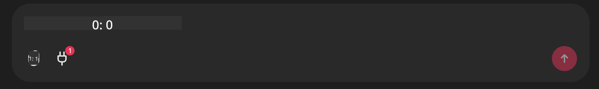

<!--
CO_OP_TRANSLATOR_METADATA:
{
  "original_hash": "9bf0395cbc541ce8db2a9699c8678dfc",
  "translation_date": "2025-07-12T14:22:42+00:00",
  "source_file": "11-mcp/code_samples/github-mcp/README.md",
  "language_code": "th"
}
-->
# Github MCP Server ตัวอย่าง

## คำอธิบาย

นี่คือเดโมที่สร้างขึ้นสำหรับ AI Agents Hackathon ซึ่งจัดโดย Microsoft Reactor

เครื่องมือนี้ใช้เพื่อแนะนำโปรเจกต์ hackathon โดยอ้างอิงจาก repos บน Github ของผู้ใช้  
โดยทำงานดังนี้:

1. **Github Agent** - ใช้ Github MCP Server เพื่อดึงข้อมูล repos และรายละเอียดของ repos เหล่านั้น  
2. **Hackathon Agent** - นำข้อมูลจาก Github Agent มาคิดไอเดียโปรเจกต์ hackathon ที่สร้างสรรค์ โดยอิงจากโปรเจกต์ ภาษาที่ผู้ใช้ใช้ และหัวข้อโปรเจกต์สำหรับ AI Agents hackathon  
3. **Events Agent** - จากคำแนะนำของ hackathon agent, events agent จะเสนอเหตุการณ์ที่เกี่ยวข้องจากชุดกิจกรรม AI Agent Hackathon

## การรันโค้ด

### ตัวแปรสภาพแวดล้อม

เดโมนี้ใช้ Azure Open AI Service, Semantic Kernel, Github MCP Server และ Azure AI Search

ตรวจสอบให้แน่ใจว่าคุณตั้งค่าตัวแปรสภาพแวดล้อมที่ถูกต้องเพื่อใช้เครื่องมือเหล่านี้:

```python
AZURE_OPENAI_CHAT_DEPLOYMENT_NAME=""
AZURE_OPENAI_EMBEDDING_DEPLOYMENT_NAME=""
AZURE_OPENAI_ENDPOINT=""
AZURE_OPENAI_API_KEY=""
AZURE_OPENAI_API_VERSION=""
AZURE_SEARCH_SERVICE_ENDPOINT=""
AZURE_SEARCH_API_KEY=""
```

## การรัน Chainlit Server

เพื่อเชื่อมต่อกับ MCP server เดโมนี้ใช้ Chainlit เป็นอินเทอร์เฟซแชท

ในการรันเซิร์ฟเวอร์ ให้ใช้คำสั่งต่อไปนี้ในเทอร์มินัลของคุณ:

```bash
chainlit run app.py -w
```

คำสั่งนี้จะเริ่มเซิร์ฟเวอร์ Chainlit ของคุณที่ `localhost:8000` และยังจะเติมข้อมูลใน Azure AI Search Index ด้วยเนื้อหาจาก `event-descriptions.md`

## การเชื่อมต่อกับ MCP Server

เพื่อเชื่อมต่อกับ Github MCP Server ให้เลือกไอคอน "ปลั๊ก" ใต้กล่องแชท "Type your message here..":



จากนั้นคุณสามารถคลิกที่ "Connect an MCP" เพื่อเพิ่มคำสั่งเชื่อมต่อกับ Github MCP Server:

```bash
npx -y @modelcontextprotocol/server-github --env GITHUB_PERSONAL_ACCESS_TOKEN=[YOUR PERSONAL ACCESS TOKEN]
```

แทนที่ "[YOUR PERSONAL ACCESS TOKEN]" ด้วย Personal Access Token ของคุณจริงๆ

หลังจากเชื่อมต่อแล้ว คุณควรเห็นตัวเลข (1) ข้างไอคอนปลั๊กเพื่อยืนยันว่าการเชื่อมต่อสำเร็จ หากไม่เห็น ให้ลองรีสตาร์ทเซิร์ฟเวอร์ chainlit ด้วยคำสั่ง `chainlit run app.py -w`

## การใช้งานเดโม

เพื่อเริ่มกระบวนการแนะนำโปรเจกต์ hackathon คุณสามารถพิมพ์ข้อความเช่น:

"Recommend hackathon projects for the Github user koreyspace"

Router Agent จะวิเคราะห์คำขอของคุณและกำหนดว่าการรวมตัวของ agent ใด (GitHub, Hackathon และ Events) เหมาะสมที่สุดในการจัดการคำถามของคุณ ตัวแทนเหล่านี้จะทำงานร่วมกันเพื่อให้คำแนะนำที่ครอบคลุมโดยอิงจากการวิเคราะห์ repository บน GitHub, การคิดไอเดียโปรเจกต์ และกิจกรรมเทคโนโลยีที่เกี่ยวข้อง

**ข้อจำกัดความรับผิดชอบ**:  
เอกสารนี้ได้รับการแปลโดยใช้บริการแปลภาษาอัตโนมัติ [Co-op Translator](https://github.com/Azure/co-op-translator) แม้เราจะพยายามให้ความถูกต้องสูงสุด แต่โปรดทราบว่าการแปลอัตโนมัติอาจมีข้อผิดพลาดหรือความไม่ถูกต้อง เอกสารต้นฉบับในภาษาต้นทางถือเป็นแหล่งข้อมูลที่เชื่อถือได้ สำหรับข้อมูลที่สำคัญ ขอแนะนำให้ใช้บริการแปลโดยผู้เชี่ยวชาญมนุษย์ เราไม่รับผิดชอบต่อความเข้าใจผิดหรือการตีความผิดใด ๆ ที่เกิดจากการใช้การแปลนี้