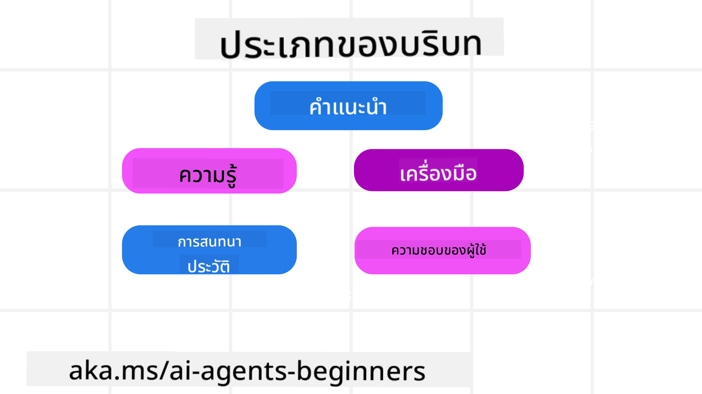
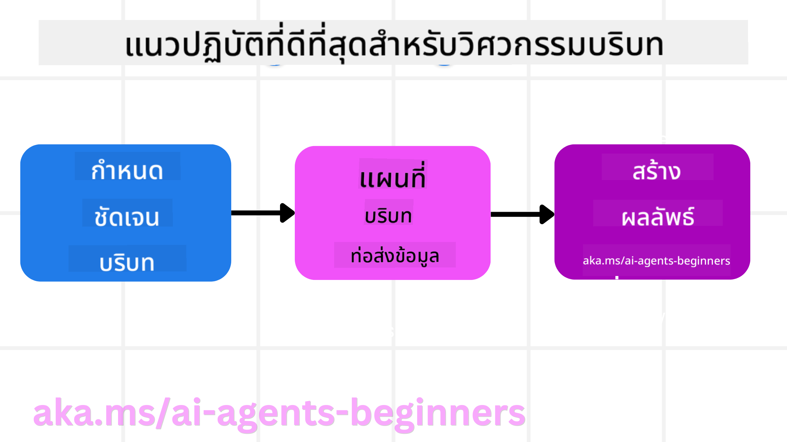

<!--
CO_OP_TRANSLATOR_METADATA:
{
  "original_hash": "cb7e50f471905ce6fdb92a30269a7a98",
  "translation_date": "2025-09-04T10:06:32+00:00",
  "source_file": "12-context-engineering/README.md",
  "language_code": "th"
}
-->
# การออกแบบบริบทสำหรับตัวแทน AI

> _(คลิกที่ภาพด้านบนเพื่อดูวิดีโอของบทเรียนนี้)_

การเข้าใจความซับซ้อนของแอปพลิเคชันที่คุณกำลังสร้างตัวแทน AI เป็นสิ่งสำคัญในการทำให้ตัวแทนมีความน่าเชื่อถือ เราจำเป็นต้องสร้างตัวแทน AI ที่สามารถจัดการข้อมูลได้อย่างมีประสิทธิภาพเพื่อตอบสนองความต้องการที่ซับซ้อน ซึ่งเกินกว่าการออกแบบคำสั่ง (Prompt Engineering)

ในบทเรียนนี้ เราจะมาดูว่า "การออกแบบบริบท" คืออะไร และมีบทบาทอย่างไรในการสร้างตัวแทน AI

## บทนำ

บทเรียนนี้จะครอบคลุม:

• **การออกแบบบริบทคืออะไร** และเหตุใดจึงแตกต่างจากการออกแบบคำสั่ง

• **กลยุทธ์สำหรับการออกแบบบริบทที่มีประสิทธิภาพ** รวมถึงวิธีการเขียน เลือก ย่อ และแยกข้อมูล

• **ข้อผิดพลาดทั่วไปเกี่ยวกับบริบท** ที่อาจทำให้ตัวแทน AI ทำงานผิดพลาด และวิธีแก้ไข

## เป้าหมายการเรียนรู้

หลังจากจบบทเรียนนี้ คุณจะสามารถ:

• **นิยามการออกแบบบริบท** และแยกแยะความแตกต่างจากการออกแบบคำสั่ง

• **ระบุองค์ประกอบสำคัญของบริบท** ในแอปพลิเคชันที่ใช้โมเดลภาษาขนาดใหญ่ (LLM)

• **ประยุกต์ใช้กลยุทธ์ในการเขียน เลือก ย่อ และแยกบริบท** เพื่อปรับปรุงประสิทธิภาพของตัวแทน

• **รับรู้ข้อผิดพลาดทั่วไปเกี่ยวกับบริบท** เช่น การปนเปื้อน การเบี่ยงเบน ความสับสน และความขัดแย้ง พร้อมทั้งนำเทคนิคการแก้ไขมาใช้

## การออกแบบบริบทคืออะไร?

สำหรับตัวแทน AI บริบทคือสิ่งที่กำหนดการวางแผนของตัวแทน AI ในการดำเนินการบางอย่าง การออกแบบบริบทคือการทำให้แน่ใจว่าตัวแทน AI มีข้อมูลที่เหมาะสมเพื่อทำงานในขั้นตอนถัดไปให้สำเร็จ หน้าต่างบริบทมีขนาดจำกัด ดังนั้นในฐานะผู้สร้างตัวแทน เราจำเป็นต้องสร้างระบบและกระบวนการเพื่อจัดการการเพิ่ม การลบ และการย่อข้อมูลในหน้าต่างบริบท

### การออกแบบคำสั่ง vs การออกแบบบริบท

การออกแบบคำสั่งมุ่งเน้นไปที่ชุดคำสั่งที่คงที่เพียงชุดเดียวเพื่อชี้นำตัวแทน AI อย่างมีประสิทธิภาพด้วยกฎที่กำหนดไว้ การออกแบบบริบทคือการจัดการชุดข้อมูลที่เปลี่ยนแปลงได้ รวมถึงคำสั่งเริ่มต้น เพื่อให้แน่ใจว่าตัวแทน AI มีสิ่งที่จำเป็นในระยะยาว แนวคิดหลักของการออกแบบบริบทคือการทำให้กระบวนการนี้สามารถทำซ้ำได้และเชื่อถือได้

### ประเภทของบริบท

สิ่งสำคัญคือต้องจำไว้ว่าบริบทไม่ได้เป็นเพียงสิ่งเดียว ข้อมูลที่ตัวแทน AI ต้องการอาจมาจากแหล่งต่างๆ และเป็นหน้าที่ของเราที่จะทำให้ตัวแทนสามารถเข้าถึงแหล่งข้อมูลเหล่านี้ได้:

ประเภทของบริบทที่ตัวแทน AI อาจต้องจัดการ ได้แก่:

• **คำสั่ง:** เช่น กฎของตัวแทน – คำสั่ง ข้อความระบบ ตัวอย่างแบบ few-shot (การแสดงให้ AI เห็นวิธีการทำบางสิ่ง) และคำอธิบายของเครื่องมือที่สามารถใช้ได้ นี่คือจุดที่การออกแบบคำสั่งและการออกแบบบริบทมาบรรจบกัน

• **ความรู้:** ครอบคลุมข้อเท็จจริง ข้อมูลที่ดึงมาจากฐานข้อมูล หรือความทรงจำระยะยาวที่ตัวแทนสะสมไว้ ซึ่งรวมถึงการผสานระบบ Retrieval Augmented Generation (RAG) หากตัวแทนต้องการเข้าถึงแหล่งความรู้และฐานข้อมูลต่างๆ

• **เครื่องมือ:** คำอธิบายของฟังก์ชันภายนอก API และ MCP Servers ที่ตัวแทนสามารถเรียกใช้ พร้อมทั้งผลลัพธ์ที่ได้จากการใช้งาน

• **ประวัติการสนทนา:** บทสนทนาที่ดำเนินอยู่กับผู้ใช้ เมื่อเวลาผ่านไป บทสนทนาเหล่านี้จะยาวขึ้นและซับซ้อนขึ้น ซึ่งหมายความว่าจะใช้พื้นที่ในหน้าต่างบริบทมากขึ้น

• **ความชอบของผู้ใช้:** ข้อมูลที่เรียนรู้เกี่ยวกับสิ่งที่ผู้ใช้ชอบหรือไม่ชอบเมื่อเวลาผ่านไป ซึ่งสามารถเรียกใช้เมื่อทำการตัดสินใจสำคัญเพื่อช่วยผู้ใช้

## กลยุทธ์สำหรับการออกแบบบริบทที่มีประสิทธิภาพ

### กลยุทธ์การวางแผน

การออกแบบบริบทที่ดีเริ่มต้นด้วยการวางแผนที่ดี นี่คือแนวทางที่จะช่วยให้คุณเริ่มคิดเกี่ยวกับการประยุกต์ใช้แนวคิดของการออกแบบบริบท:

1. **กำหนดผลลัพธ์ที่ชัดเจน** - ผลลัพธ์ของงานที่ตัวแทน AI จะได้รับมอบหมายควรถูกกำหนดไว้อย่างชัดเจน ตอบคำถามว่า "โลกจะเป็นอย่างไรเมื่อ AI Agent ทำงานเสร็จ?" หรือกล่าวอีกนัยหนึ่งคือ ผู้ใช้ควรได้รับการเปลี่ยนแปลง ข้อมูล หรือคำตอบแบบใดหลังจากโต้ตอบกับตัวแทน AI

2. **ทำแผนที่บริบท** - เมื่อคุณกำหนดผลลัพธ์ของตัวแทน AI แล้ว คุณต้องตอบคำถามว่า "ตัวแทน AI ต้องการข้อมูลอะไรเพื่อทำงานนี้ให้สำเร็จ?" วิธีนี้จะช่วยให้คุณเริ่มทำแผนที่บริบทของแหล่งข้อมูลที่สามารถหาได้

3. **สร้างท่อส่งบริบท** - เมื่อคุณรู้แล้วว่าข้อมูลอยู่ที่ไหน คุณต้องตอบคำถามว่า "ตัวแทนจะได้รับข้อมูลนี้ได้อย่างไร?" ซึ่งสามารถทำได้หลายวิธี เช่น RAG การใช้ MCP Servers และเครื่องมืออื่นๆ

### กลยุทธ์เชิงปฏิบัติ

การวางแผนเป็นสิ่งสำคัญ แต่เมื่อข้อมูลเริ่มไหลเข้าสู่หน้าต่างบริบทของตัวแทน เราจำเป็นต้องมีกลยุทธ์เชิงปฏิบัติเพื่อจัดการ:

#### การจัดการบริบท

ในขณะที่ข้อมูลบางส่วนจะถูกเพิ่มลงในหน้าต่างบริบทโดยอัตโนมัติ การออกแบบบริบทคือการมีบทบาทเชิงรุกในการจัดการข้อมูลนี้ ซึ่งสามารถทำได้ด้วยกลยุทธ์ดังนี้:

1. **สมุดบันทึกของตัวแทน (Agent Scratchpad)**  
   ช่วยให้ตัวแทน AI จดบันทึกข้อมูลที่เกี่ยวข้องเกี่ยวกับงานปัจจุบันและการโต้ตอบกับผู้ใช้ในเซสชันเดียว บันทึกนี้ควรอยู่ภายนอกหน้าต่างบริบทในไฟล์หรือออบเจ็กต์รันไทม์ที่ตัวแทนสามารถเรียกใช้ในภายหลังในเซสชันนี้หากจำเป็น

2. **ความทรงจำ (Memories)**  
   สมุดบันทึกเหมาะสำหรับการจัดการข้อมูลภายนอกหน้าต่างบริบทในเซสชันเดียว ความทรงจำช่วยให้ตัวแทนสามารถจัดเก็บและเรียกใช้ข้อมูลที่เกี่ยวข้องในหลายเซสชัน ซึ่งอาจรวมถึงสรุปข้อมูล ความชอบของผู้ใช้ และข้อเสนอแนะเพื่อการปรับปรุงในอนาคต

3. **การย่อบริบท (Compressing Context)**  
   เมื่อหน้าต่างบริบทเติบโตและใกล้ถึงขีดจำกัด เทคนิคเช่นการสรุปและการตัดแต่งสามารถนำมาใช้ได้ ซึ่งรวมถึงการเก็บเฉพาะข้อมูลที่เกี่ยวข้องที่สุดหรือการลบข้อความเก่าออก

4. **ระบบหลายตัวแทน (Multi-Agent Systems)**  
   การพัฒนาระบบหลายตัวแทนเป็นรูปแบบหนึ่งของการออกแบบบริบท เนื่องจากตัวแทนแต่ละตัวมีหน้าต่างบริบทของตัวเอง การแบ่งปันและส่งต่อบริบทระหว่างตัวแทนต่างๆ เป็นอีกสิ่งที่ต้องวางแผนเมื่อสร้างระบบเหล่านี้

5. **สภาพแวดล้อมแซนด์บ็อกซ์ (Sandbox Environments)**  
   หากตัวแทนจำเป็นต้องรันโค้ดหรือประมวลผลข้อมูลจำนวนมากในเอกสาร สิ่งนี้อาจใช้โทเค็นจำนวนมากในการประมวลผลผลลัพธ์ แทนที่จะเก็บข้อมูลทั้งหมดไว้ในหน้าต่างบริบท ตัวแทนสามารถใช้สภาพแวดล้อมแซนด์บ็อกซ์ที่สามารถรันโค้ดนี้และอ่านเฉพาะผลลัพธ์และข้อมูลที่เกี่ยวข้องอื่นๆ

6. **ออบเจ็กต์สถานะรันไทม์ (Runtime State Objects)**  
   ทำได้โดยการสร้างคอนเทนเนอร์ของข้อมูลเพื่อจัดการสถานการณ์ที่ตัวแทนจำเป็นต้องเข้าถึงข้อมูลบางอย่าง สำหรับงานที่ซับซ้อน สิ่งนี้จะช่วยให้ตัวแทนสามารถจัดเก็บผลลัพธ์ของแต่ละขั้นตอนย่อยทีละขั้นตอน ทำให้บริบทเชื่อมโยงเฉพาะกับขั้นตอนย่อยนั้นๆ

### ตัวอย่างการออกแบบบริบท

สมมติว่าเราต้องการให้ตัวแทน AI **"จองทริปไปปารีสให้ฉัน"**

• ตัวแทนง่ายๆ ที่ใช้เพียงการออกแบบคำสั่งอาจตอบว่า: **"โอเค คุณอยากไปปารีสเมื่อไหร่?"** ซึ่งเป็นการประมวลผลคำถามโดยตรงในเวลาที่ผู้ใช้ถามเท่านั้น

• ตัวแทนที่ใช้กลยุทธ์การออกแบบบริบทที่กล่าวถึงจะทำได้มากกว่านั้น ก่อนที่จะตอบกลับ ระบบอาจ:

  ◦ **ตรวจสอบปฏิทินของคุณ** เพื่อดูวันที่ว่าง (ดึงข้อมูลแบบเรียลไทม์)

  ◦ **เรียกคืนความชอบในการเดินทางที่ผ่านมา** (จากความทรงจำระยะยาว) เช่น สายการบินที่คุณชอบ งบประมาณ หรือว่าคุณชอบเที่ยวบินตรงหรือไม่

  ◦ **ระบุเครื่องมือที่ใช้ได้** สำหรับการจองเที่ยวบินและโรงแรม

- จากนั้น ตัวอย่างคำตอบอาจเป็น: **"สวัสดี [ชื่อของคุณ]! ฉันเห็นว่าคุณว่างในสัปดาห์แรกของเดือนตุลาคม ฉันควรหาตั๋วเที่ยวบินตรงไปปารีสกับ [สายการบินที่ชอบ] ในงบประมาณปกติของคุณ ([งบประมาณ]) ไหม?"** คำตอบที่มีบริบทและละเอียดเช่นนี้แสดงให้เห็นถึงพลังของการออกแบบบริบท

## ข้อผิดพลาดทั่วไปเกี่ยวกับบริบท

### การปนเปื้อนบริบท

**คืออะไร:** เมื่อเกิดภาพหลอน (ข้อมูลเท็จที่สร้างโดย LLM) หรือข้อผิดพลาดเข้าสู่บริบทและถูกอ้างอิงซ้ำๆ ทำให้ตัวแทนไล่ตามเป้าหมายที่เป็นไปไม่ได้หรือพัฒนากลยุทธ์ที่ไร้สาระ

**วิธีแก้ไข:** ใช้ **การตรวจสอบความถูกต้องของบริบท** และ **การกักกัน** ตรวจสอบความถูกต้องของข้อมูลก่อนที่จะเพิ่มลงในความทรงจำระยะยาว หากตรวจพบการปนเปื้อน ให้เริ่มเธรดบริบทใหม่เพื่อป้องกันไม่ให้ข้อมูลที่ผิดแพร่กระจาย

**ตัวอย่างการจองทริป:** ตัวแทนของคุณสร้างภาพหลอนเกี่ยวกับ **เที่ยวบินตรงจากสนามบินท้องถิ่นขนาดเล็กไปยังเมืองนานาชาติที่ห่างไกล** ซึ่งไม่มีเที่ยวบินระหว่างประเทศจริง รายละเอียดเที่ยวบินที่ไม่มีอยู่จริงนี้ถูกบันทึกลงในบริบท ต่อมาเมื่อคุณขอให้ตัวแทนจอง มันยังคงพยายามหาตั๋วสำหรับเส้นทางที่เป็นไปไม่ได้นี้ ทำให้เกิดข้อผิดพลาดซ้ำๆ

**วิธีแก้ไข:** เพิ่มขั้นตอนที่ **ตรวจสอบความถูกต้องของเที่ยวบินและเส้นทางด้วย API แบบเรียลไทม์** _ก่อน_ เพิ่มรายละเอียดเที่ยวบินลงในบริบทการทำงาน หากการตรวจสอบล้มเหลว ข้อมูลที่ผิดพลาดจะถูก "กักกัน" และไม่ถูกใช้งานต่อ

### การเบี่ยงเบนบริบท

**คืออะไร:** เมื่อบริบทมีขนาดใหญ่จนโมเดลมุ่งเน้นไปที่ประวัติสะสมมากเกินไป แทนที่จะใช้สิ่งที่เรียนรู้ระหว่างการฝึกอบรม ทำให้เกิดการกระทำที่ซ้ำซ้อนหรือไม่มีประโยชน์ โมเดลอาจเริ่มทำผิดพลาดแม้ก่อนที่หน้าต่างบริบทจะเต็ม

**วิธีแก้ไข:** ใช้ **การสรุปบริบท** บีบอัดข้อมูลที่สะสมเป็นระยะๆ ให้เป็นสรุปที่สั้นลง โดยเก็บรายละเอียดสำคัญไว้และลบประวัติที่ซ้ำซ้อนออก วิธีนี้ช่วย "รีเซ็ต" โฟกัส

**ตัวอย่างการจองทริป:** คุณได้พูดคุยเกี่ยวกับจุดหมายปลายทางในฝันต่างๆ เป็นเวลานาน รวมถึงการเล่ารายละเอียดเกี่ยวกับการเดินทางแบบแบ็คแพ็คเมื่อสองปีก่อน เมื่อคุณขอให้ **"หาตั๋วเครื่องบินราคาถูกสำหรับเดือนหน้า"** ตัวแทนกลับจมอยู่กับรายละเอียดเก่าๆ ที่ไม่เกี่ยวข้อง และถามเกี่ยวกับอุปกรณ์แบ็คแพ็คหรือแผนการเดินทางในอดีต แทนที่จะสนใจคำขอปัจจุบันของคุณ

**วิธีแก้ไข:** หลังจากจำนวนรอบการสนทนาที่กำหนดหรือเมื่อบริบทเติบโตมากเกินไป ตัวแทนควร **สรุปส่วนที่เกี่ยวข้องและสำคัญที่สุดของการสนทนา** – โดยมุ่งเน้นไปที่วันที่เดินทางและจุดหมายปลายทางปัจจุบันของคุณ – และใช้สรุปที่ย่อมานี้สำหรับการเรียก LLM ครั้งถัดไป โดยละทิ้งประวัติการสนทนาที่ไม่เกี่ยวข้อง

### ความสับสนในบริบท

**คืออะไร:** เมื่อบริบทที่ไม่จำเป็น เช่น เครื่องมือที่มีอยู่มากเกินไป ทำให้โมเดลสร้างคำตอบที่ไม่ดีหรือเรียกใช้เครื่องมือที่ไม่เกี่ยวข้อง โมเดลขนาดเล็กมีแนวโน้มที่จะเกิดปัญหานี้มากเป็นพิเศษ

**วิธีแก้ไข:** ใช้ **การจัดการเครื่องมือแบบเลือกสรร** ด้วยเทคนิค RAG เก็บคำอธิบายเครื่องมือไว้ในฐานข้อมูลเวกเตอร์และเลือกเฉพาะเครื่องมือที่เกี่ยวข้องที่สุดสำหรับงานแต่ละงาน งานวิจัยแสดงให้เห็นว่าการจำกัดการเลือกเครื่องมือให้น้อยกว่า 30 ชิ้นช่วยลดความสับสนได้

**ตัวอย่างการจองทริป:** ตัวแทนของคุณมีเครื่องมือให้ใช้งานหลายสิบรายการ เช่น `book_flight`, `book_hotel`, `rent_car`, `find_tours`, `currency_converter`, `weather_forecast`, `restaurant_reservations` เป็นต้น คุณถามว่า **"วิธีที่ดีที่สุดในการเดินทางในปารีสคืออะไร?"** เนื่องจากมีเครื่องมือจำนวนมาก ตัวแทนอาจสับสนและพยายามเรียกใช้ `book_flight` _ใน_ ปารีส หรือ `rent_car` แม้ว่าคุณจะชอบการขนส่งสาธารณะ เพราะคำอธิบายเครื่องมืออาจซ้อนทับกันหรือโมเดลไม่สามารถเลือกสิ่งที่ดีที่สุดได้

**วิธีแก้ไข:** ใช้ **RAG กับคำอธิบายเครื่องมือ** เมื่อคุณถามเกี่ยวกับการเดินทางในปารีส ระบบจะดึงเฉพาะเครื่องมือที่เกี่ยวข้องที่สุด เช่น `rent_car` หรือ `public_transport_info` ตามคำถามของคุณ โดยนำเสนอ "ชุดเครื่องมือ" ที่เน้นเฉพาะให้กับ LLM

### ความขัดแย้งในบริบท

**คืออะไร:** เมื่อข้อมูลที่ขัดแย้งกันอยู่ในบริบท ทำให้เกิดการให้เหตุผลที่ไม่สอดคล้องกันหรือคำตอบที่ไม่ดี สิ่งนี้มักเกิดขึ้นเมื่อข้อมูลมาถึงเป็นช่วงๆ และสมมติฐานที่ผิดในตอนแรกยังคงอยู่ในบริบท

**วิธีแก้ไข:** ใช้ **การตัดแต่งบริบท** และ **การถ่ายโอนข้อมูล** การตัดแต่งหมายถึงการลบข้อมูลที่ล้าสมัยหรือขัดแย้งออกเมื่อมีรายละเอียดใหม่เข้ามา การถ่ายโอนข้อมูลช่วยให้โมเดลมี "สมุดบันทึก" แยกต่างหากเพื่อประมวลผลข้อมูลโดยไม่ทำให้บริบทหลักยุ่งเหยิง

**ตัวอย่างการจองทริป:** คุณบอกตัวแทนในตอนแรกว่า **"ฉันอยากบินชั้นประหยัด"** ต่อมาในบทสนทนา คุณเปลี่ยนใจและบอกว่า **"จริงๆ แล้ว สำหรับทริปนี้ ฉันอยากไปชั้นธุรกิจ"** หากทั้งสองคำสั่งยังคงอยู่ในบริบท ตัวแทนอ

---

**ข้อจำกัดความรับผิดชอบ**:  
เอกสารนี้ได้รับการแปลโดยใช้บริการแปลภาษา AI [Co-op Translator](https://github.com/Azure/co-op-translator) แม้ว่าเราจะพยายามให้การแปลมีความถูกต้อง แต่โปรดทราบว่าการแปลอัตโนมัติอาจมีข้อผิดพลาดหรือความไม่แม่นยำ เอกสารต้นฉบับในภาษาต้นทางควรถือเป็นแหล่งข้อมูลที่เชื่อถือได้ สำหรับข้อมูลที่สำคัญ ขอแนะนำให้ใช้บริการแปลภาษาจากผู้เชี่ยวชาญ เราไม่รับผิดชอบต่อความเข้าใจผิดหรือการตีความที่ผิดพลาดซึ่งเกิดจากการใช้การแปลนี้