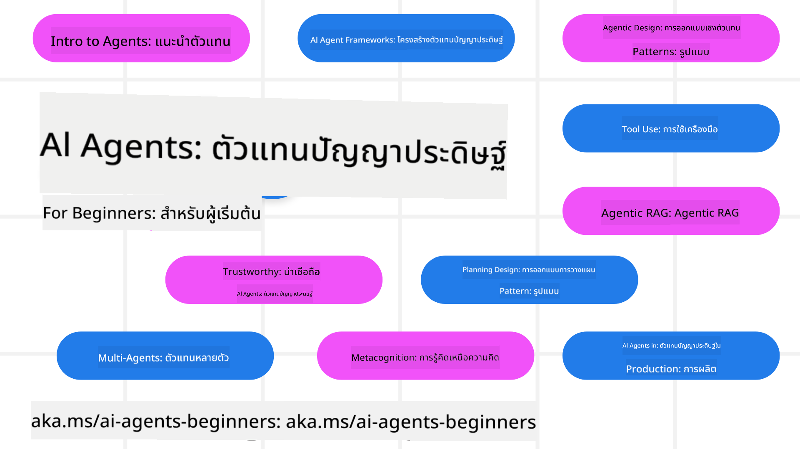

<!--
CO_OP_TRANSLATOR_METADATA:
{
  "original_hash": "9b4c2650691b24b20e0c912d01a466a2",
  "translation_date": "2025-08-21T13:08:24+00:00",
  "source_file": "README.md",
  "language_code": "th"
}
-->
# หลักสูตร AI Agents สำหรับผู้เริ่มต้น

## 11 บทเรียนที่สอนทุกสิ่งที่คุณจำเป็นต้องรู้เพื่อเริ่มต้นสร้าง AI Agents

  
  
  
  

### 🌐 รองรับหลายภาษา

#### รองรับผ่าน GitHub Action (อัตโนมัติและอัปเดตเสมอ)

[French](../fr/README.md) | [Spanish](../es/README.md) | [German](../de/README.md) | [Russian](../ru/README.md) | [Arabic](../ar/README.md) | [Persian (Farsi)](../fa/README.md) | [Urdu](../ur/README.md) | [Chinese (Simplified)](../zh/README.md) | [Chinese (Traditional, Macau)](../mo/README.md) | [Chinese (Traditional, Hong Kong)](../hk/README.md) | [Chinese (Traditional, Taiwan)](../tw/README.md) | [Japanese](../ja/README.md) | [Korean](../ko/README.md) | [Hindi](../hi/README.md) | [Bengali](../bn/README.md) | [Marathi](../mr/README.md) | [Nepali](../ne/README.md) | [Punjabi (Gurmukhi)](../pa/README.md) | [Portuguese (Portugal)](../pt/README.md) | [Portuguese (Brazil)](../br/README.md) | [Italian](../it/README.md) | [Polish](../pl/README.md) | [Turkish](../tr/README.md) | [Greek](../el/README.md) | [Thai](./README.md) | [Swedish](../sv/README.md) | [Danish](../da/README.md) | [Norwegian](../no/README.md) | [Finnish](../fi/README.md) | [Dutch](../nl/README.md) | [Hebrew](../he/README.md) | [Vietnamese](../vi/README.md) | [Indonesian](../id/README.md) | [Malay](../ms/README.md) | [Tagalog (Filipino)](../tl/README.md) | [Swahili](../sw/README.md) | [Hungarian](../hu/README.md) | [Czech](../cs/README.md) | [Slovak](../sk/README.md) | [Romanian](../ro/README.md) | [Bulgarian](../bg/README.md) | [Serbian (Cyrillic)](../sr/README.md) | [Croatian](../hr/README.md) | [Slovenian](../sl/README.md) | [Ukrainian](../uk/README.md) | [Burmese (Myanmar)](../my/README.md)

**หากคุณต้องการให้รองรับภาษาเพิ่มเติม สามารถดูรายการภาษาที่รองรับได้ [ที่นี่](https://github.com/Azure/co-op-translator/blob/main/getting_started/supported-languages.md)**

  
  

## 🌱 เริ่มต้นใช้งาน

หลักสูตรนี้มี 11 บทเรียนที่ครอบคลุมพื้นฐานของการสร้าง AI Agents แต่ละบทเรียนมีหัวข้อเฉพาะของตัวเอง คุณสามารถเริ่มต้นจากบทเรียนใดก็ได้ตามที่คุณต้องการ!

หลักสูตรนี้รองรับหลายภาษา คุณสามารถดู [ภาษาที่รองรับได้ที่นี่](../..)

หากนี่เป็นครั้งแรกที่คุณสร้างด้วยโมเดล Generative AI ลองดูหลักสูตร [Generative AI For Beginners](https://aka.ms/genai-beginners) ซึ่งมี 21 บทเรียนเกี่ยวกับการสร้างด้วย GenAI

อย่าลืม [เพิ่มดาว (🌟) ให้กับ repo นี้](https://docs.github.com/en/get-started/exploring-projects-on-github/saving-repositories-with-stars?WT.mc_id=academic-105485-koreyst) และ [fork repo นี้](https://github.com/microsoft/ai-agents-for-beginners/fork) เพื่อรันโค้ด

### สิ่งที่คุณต้องมี

แต่ละบทเรียนในหลักสูตรนี้มีตัวอย่างโค้ด ซึ่งสามารถพบได้ในโฟลเดอร์ code_samples คุณสามารถ [fork repo นี้](https://github.com/microsoft/ai-agents-for-beginners/fork) เพื่อสร้างสำเนาของคุณเอง

ตัวอย่างโค้ดในแบบฝึกหัดเหล่านี้ใช้ Azure AI Foundry และ GitHub Model Catalogs สำหรับการโต้ตอบกับ Language Models:

- [Github Models](https://aka.ms/ai-agents-beginners/github-models) - ฟรี / จำกัด
- [Azure AI Foundry](https://aka.ms/ai-agents-beginners/ai-foundry) - ต้องมีบัญชี Azure

หลักสูตรนี้ยังใช้เฟรมเวิร์กและบริการ AI Agent ต่อไปนี้จาก Microsoft:

- [Azure AI Agent Service](https://aka.ms/ai-agents-beginners/ai-agent-service)  
- [Semantic Kernel](https://aka.ms/ai-agents-beginners/semantic-kernel)  
- [AutoGen](https://aka.ms/ai-agents/autogen)  

สำหรับข้อมูลเพิ่มเติมเกี่ยวกับการรันโค้ดในหลักสูตรนี้ โปรดไปที่ [Course Setup](./00-course-setup/README.md)

## 🙏 ต้องการช่วยเหลือ?

คุณมีข้อเสนอแนะหรือพบข้อผิดพลาดในการสะกดหรือโค้ดหรือไม่? [สร้าง issue](https://github.com/microsoft/ai-agents-for-beginners/issues?WT.mc_id=academic-105485-koreyst) หรือ [สร้าง pull request](https://github.com/microsoft/ai-agents-for-beginners/pulls?WT.mc_id=academic-105485-koreyst)

หากคุณติดขัดหรือมีคำถามเกี่ยวกับการสร้าง AI Agents เข้าร่วม [Azure AI Foundry Community Discord](https://discord.gg/kzRShWzttr)

หากคุณมีข้อเสนอแนะเกี่ยวกับผลิตภัณฑ์หรือพบข้อผิดพลาดขณะสร้าง โปรดไปที่ [Azure AI Foundry Developer Forum](https://aka.ms/azureaifoundry/forum)

## 📂 แต่ละบทเรียนประกอบด้วย

- บทเรียนที่เขียนไว้ใน README และวิดีโอสั้น ๆ
- ตัวอย่างโค้ด Python ที่รองรับ Azure AI Foundry และ Github Models (ฟรี)
- ลิงก์ไปยังแหล่งข้อมูลเพิ่มเติมเพื่อเรียนรู้ต่อ

## 🗃️ บทเรียน

| **บทเรียน**                             | **ข้อความและโค้ด**                               | **วิดีโอ**                                                  | **การเรียนรู้เพิ่มเติม**                                                              |
|------------------------------------------|----------------------------------------------------|------------------------------------------------------------|----------------------------------------------------------------------------------------|
| แนะนำ AI Agents และกรณีการใช้งาน         | [ลิงก์](./01-intro-to-ai-agents/README.md)         | [วิดีโอ](https://youtu.be/3zgm60bXmQk?si=z8QygFvYQv-9WtO1)  | [ลิงก์](https://aka.ms/ai-agents-beginners/collection?WT.mc_id=academic-105485-koreyst) |
| การสำรวจเฟรมเวิร์ก AI Agentic            | [ลิงก์](./02-explore-agentic-frameworks/README.md) | [วิดีโอ](https://youtu.be/ODwF-EZo_O8?si=Vawth4hzVaHv-u0H)  | [ลิงก์](https://aka.ms/ai-agents-beginners/collection?WT.mc_id=academic-105485-koreyst) |
| การทำความเข้าใจรูปแบบการออกแบบ Agentic  | [ลิงก์](./03-agentic-design-patterns/README.md)    | [วิดีโอ](https://youtu.be/m9lM8qqoOEA?si=BIzHwzstTPL8o9GF)  | [ลิงก์](https://aka.ms/ai-agents-beginners/collection?WT.mc_id=academic-105485-koreyst) |
| รูปแบบการออกแบบการใช้เครื่องมือ          | [ลิงก์](./04-tool-use/README.md)                   | [วิดีโอ](https://youtu.be/vieRiPRx-gI?si=2z6O2Xu2cu_Jz46N)  | [ลิงก์](https://aka.ms/ai-agents-beginners/collection?WT.mc_id=academic-105485-koreyst) |
| Agentic RAG                              | [ลิงก์](./05-agentic-rag/README.md)                | [วิดีโอ](https://youtu.be/WcjAARvdL7I?si=gKPWsQpKiIlDH9A3)  | [ลิงก์](https://aka.ms/ai-agents-beginners/collection?WT.mc_id=academic-105485-koreyst) |
| การสร้าง AI Agents ที่น่าเชื่อถือ        | [ลิงก์](./06-building-trustworthy-agents/README.md)| [วิดีโอ](https://youtu.be/iZKkMEGBCUQ?si=jZjpiMnGFOE9L8OK ) | [ลิงก์](https://aka.ms/ai-agents-beginners/collection?WT.mc_id=academic-105485-koreyst) |
| รูปแบบการออกแบบการวางแผน                | [ลิงก์](./07-planning-design/README.md)            | [วิดีโอ](https://youtu.be/kPfJ2BrBCMY?si=6SC_iv_E5-mzucnC)  | [ลิงก์](https://aka.ms/ai-agents-beginners/collection?WT.mc_id=academic-105485-koreyst) |
| รูปแบบการออกแบบ Multi-Agent             | [ลิงก์](./08-multi-agent/README.md)                | [วิดีโอ](https://youtu.be/V6HpE9hZEx0?si=rMgDhEu7wXo2uo6g)  | [ลิงก์](https://aka.ms/ai-agents-beginners/collection?WT.mc_id=academic-105485-koreyst) |
| รูปแบบการออกแบบ Metacognition           | [ลิงก์](./09-metacognition/README.md)              | [วิดีโอ](https://youtu.be/His9R6gw6Ec?si=8gck6vvdSNCt6OcF)  | [ลิงก์](https://aka.ms/ai-agents-beginners/collection?WT.mc_id=academic-105485-koreyst) |
| AI Agents ในการผลิต                      | [ลิงก์](./10-ai-agents-production/README.md)       | [วิดีโอ](https://youtu.be/l4TP6IyJxmQ?si=31dnhexRo6yLRJDl)  | [ลิงก์](https://aka.ms/ai-agents-beginners/collection?WT.mc_id=academic-105485-koreyst) |
| AI Agents กับ MCP                        | [ลิงก์](./11-mcp/README.md)                        |                                                            | [ลิงก์](https://aka.ms/mcp-for-beginners)                                               |

## 🎒 หลักสูตรอื่น ๆ

ทีมของเราผลิตหลักสูตรอื่น ๆ ด้วย! ลองดู:
- [**ใหม่** โปรโตคอล Model Context (MCP) สำหรับผู้เริ่มต้น](https://github.com/microsoft/mcp-for-beginners?WT.mc_id=academic-105485-koreyst)  
- [Generative AI สำหรับผู้เริ่มต้นโดยใช้ .NET](https://github.com/microsoft/Generative-AI-for-beginners-dotnet?WT.mc_id=academic-105485-koreyst)  
- [Generative AI สำหรับผู้เริ่มต้น](https://github.com/microsoft/generative-ai-for-beginners?WT.mc_id=academic-105485-koreyst)  
- [Generative AI สำหรับผู้เริ่มต้นโดยใช้ Java](https://github.com/microsoft/generative-ai-for-beginners-java?WT.mc_id=academic-105485-koreyst)  
- [การเรียนรู้ของเครื่องสำหรับผู้เริ่มต้น](https://aka.ms/ml-beginners?WT.mc_id=academic-105485-koreyst)  
- [วิทยาศาสตร์ข้อมูลสำหรับผู้เริ่มต้น](https://aka.ms/datascience-beginners?WT.mc_id=academic-105485-koreyst)  
- [ปัญญาประดิษฐ์สำหรับผู้เริ่มต้น](https://aka.ms/ai-beginners?WT.mc_id=academic-105485-koreyst)  
- [ความปลอดภัยทางไซเบอร์สำหรับผู้เริ่มต้น](https://github.com/microsoft/Security-101??WT.mc_id=academic-96948-sayoung)  
- [การพัฒนาเว็บสำหรับผู้เริ่มต้น](https://aka.ms/webdev-beginners?WT.mc_id=academic-105485-koreyst)  
- [IoT สำหรับผู้เริ่มต้น](https://aka.ms/iot-beginners?WT.mc_id=academic-105485-koreyst)  
- [การพัฒนา XR สำหรับผู้เริ่มต้น](https://github.com/microsoft/xr-development-for-beginners?WT.mc_id=academic-105485-koreyst)  
- [การใช้งาน GitHub Copilot อย่างเชี่ยวชาญสำหรับการเขียนโปรแกรมคู่กับ AI](https://aka.ms/GitHubCopilotAI?WT.mc_id=academic-105485-koreyst)  
- [การใช้งาน GitHub Copilot อย่างเชี่ยวชาญสำหรับนักพัฒนา C#/.NET](https://github.com/microsoft/mastering-github-copilot-for-dotnet-csharp-developers?WT.mc_id=academic-105485-koreyst)  
- [เลือกการผจญภัย Copilot ของคุณเอง](https://github.com/microsoft/CopilotAdventures?WT.mc_id=academic-105485-koreyst)  

## 🌟 ขอบคุณชุมชน  

ขอขอบคุณ [Shivam Goyal](https://www.linkedin.com/in/shivam2003/) สำหรับการมีส่วนร่วมในตัวอย่างโค้ดสำคัญที่แสดงให้เห็นถึง Agentic RAG  

## การมีส่วนร่วม  

โครงการนี้ยินดีต้อนรับการมีส่วนร่วมและข้อเสนอแนะ การมีส่วนร่วมส่วนใหญ่ต้องการให้คุณยอมรับ  
Contributor License Agreement (CLA) เพื่อยืนยันว่าคุณมีสิทธิ์และได้มอบสิทธิ์ให้เรา  
ใช้ผลงานของคุณ รายละเอียดเพิ่มเติมสามารถดูได้ที่  
<https://cla.opensource.microsoft.com>  

เมื่อคุณส่ง pull request บอท CLA จะตรวจสอบโดยอัตโนมัติว่าคุณจำเป็นต้องให้  
CLA หรือไม่ และจะเพิ่มสถานะที่เหมาะสม (เช่น การตรวจสอบสถานะหรือคอมเมนต์)  
เพียงทำตามคำแนะนำที่บอทให้ไว้ คุณจะต้องทำสิ่งนี้เพียงครั้งเดียวสำหรับทุก repo ที่ใช้ CLA ของเรา  

โครงการนี้ได้นำ [Microsoft Open Source Code of Conduct](https://opensource.microsoft.com/codeofconduct/) มาใช้  
สำหรับข้อมูลเพิ่มเติม โปรดดูที่ [คำถามที่พบบ่อยเกี่ยวกับจรรยาบรรณ](https://opensource.microsoft.com/codeofconduct/faq/) หรือ  
ติดต่อ [opencode@microsoft.com](mailto:opencode@microsoft.com) หากมีคำถามหรือความคิดเห็นเพิ่มเติม  

## เครื่องหมายการค้า  

โครงการนี้อาจมีเครื่องหมายการค้าหรือโลโก้สำหรับโครงการ ผลิตภัณฑ์ หรือบริการ การใช้งานเครื่องหมายการค้าหรือโลโก้ของ Microsoft ต้องเป็นไปตาม  
[แนวทางการใช้เครื่องหมายการค้าและแบรนด์ของ Microsoft](https://www.microsoft.com/legal/intellectualproperty/trademarks/usage/general)  
การใช้เครื่องหมายการค้าหรือโลโก้ของ Microsoft ในเวอร์ชันที่แก้ไขของโครงการนี้ต้องไม่ทำให้เกิดความสับสนหรือบ่งบอกถึงการสนับสนุนจาก Microsoft  
การใช้เครื่องหมายการค้าหรือโลโก้ของบุคคลที่สามใด ๆ ต้องเป็นไปตามนโยบายของบุคคลที่สามนั้น ๆ  

**ข้อจำกัดความรับผิดชอบ**:  
เอกสารนี้ได้รับการแปลโดยใช้บริการแปลภาษา AI [Co-op Translator](https://github.com/Azure/co-op-translator) แม้ว่าเราจะพยายามให้การแปลมีความถูกต้อง แต่โปรดทราบว่าการแปลอัตโนมัติอาจมีข้อผิดพลาดหรือความไม่แม่นยำ เอกสารต้นฉบับในภาษาต้นทางควรถือเป็นแหล่งข้อมูลที่เชื่อถือได้ สำหรับข้อมูลที่สำคัญ ขอแนะนำให้ใช้บริการแปลภาษามนุษย์ที่เป็นมืออาชีพ เราจะไม่รับผิดชอบต่อความเข้าใจผิดหรือการตีความที่ผิดพลาดซึ่งเกิดจากการใช้การแปลนี้