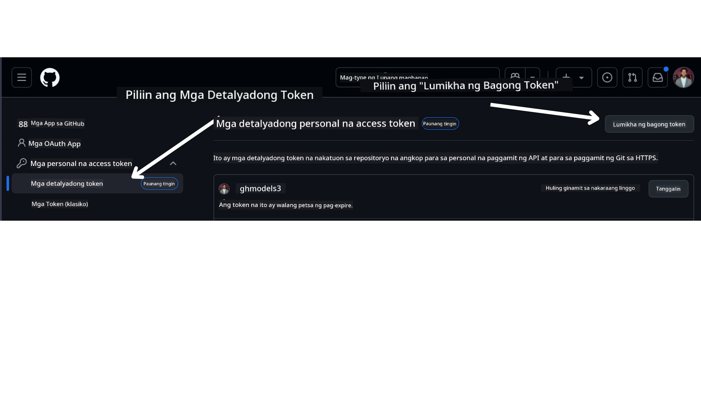

<!--
CO_OP_TRANSLATOR_METADATA:
{
  "original_hash": "76945069b52a49cd0432ae3e0b0ba22e",
  "translation_date": "2025-07-12T07:54:51+00:00",
  "source_file": "00-course-setup/README.md",
  "language_code": "tl"
}
-->
sa iyong GitHub Account.

Piliin ang opsyon na `Fine-grained tokens` sa kaliwang bahagi ng iyong screen.

Pagkatapos ay piliin ang `Generate new token`.



Hihilingin sa iyo na maglagay ng pangalan para sa iyong token, piliin ang petsa ng pag-expire (Inirerekomenda: 30 Araw), at piliin ang mga saklaw para sa iyong token (Public Repositories).

Kailangan mo ring i-edit ang mga permiso ng token na ito: Permissions -> Models -> Pinapayagan ang access sa GitHub Models

Kopyahin ang bagong token na iyong ginawa. Idadagdag mo ito ngayon sa iyong `.env` file na kasama sa kursong ito.

### Hakbang 2: Gumawa ng Iyong `.env` File

Upang gumawa ng iyong `.env` file, patakbuhin ang sumusunod na utos sa iyong terminal.

```bash
cp .env.example .env
```

Kokopyahin nito ang example file at gagawa ng `.env` sa iyong direktoryo kung saan mo ilalagay ang mga halaga para sa mga environment variables.

Kapag nakopya mo na ang iyong token, buksan ang `.env` file sa iyong paboritong text editor at i-paste ang iyong token sa `GITHUB_TOKEN` na field.

Dapat ay maaari mo nang patakbuhin ang mga code samples ng kursong ito.

## Pagsasaayos para sa Mga Sample na Gumagamit ng Azure AI Foundry at Azure AI Agent Service

### Hakbang 1: Kunin ang Iyong Azure Project Endpoint

Sundin ang mga hakbang sa paggawa ng hub at proyekto sa Azure AI Foundry na matatagpuan dito: [Hub resources overview](https://learn.microsoft.com/en-us/azure/ai-foundry/concepts/ai-resources)

Kapag nagawa mo na ang iyong proyekto, kailangan mong kunin ang connection string para sa iyong proyekto.

Magagawa ito sa pamamagitan ng pagpunta sa **Overview** na pahina ng iyong proyekto sa Azure AI Foundry portal.


### Hakbang 2: Gumawa ng Iyong `.env` File

Upang gumawa ng iyong `.env` file, patakbuhin ang sumusunod na utos sa iyong terminal.

```bash
cp .env.example .env
```

Kokopyahin nito ang example file at gagawa ng `.env` sa iyong direktoryo kung saan mo ilalagay ang mga halaga para sa mga environment variables.

Kapag nakopya mo na ang iyong token, buksan ang `.env` file sa iyong paboritong text editor at i-paste ang iyong token sa `PROJECT_ENDPOINT` na field.

### Hakbang 3: Mag-sign in sa Azure

Bilang isang best practice sa seguridad, gagamit tayo ng [keyless authentication](https://learn.microsoft.com/azure/developer/ai/keyless-connections?tabs=csharp%2Cazure-cli?WT.mc_id=academic-105485-koreyst) upang mag-authenticate sa Azure OpenAI gamit ang Microsoft Entra ID. Bago mo ito magawa, kailangan mo munang i-install ang **Azure CLI** ayon sa [mga tagubilin sa pag-install](https://learn.microsoft.com/cli/azure/install-azure-cli?WT.mc_id=academic-105485-koreyst) para sa iyong operating system.

Pagkatapos, buksan ang terminal at patakbuhin ang `az login --use-device-code` upang mag-sign in sa iyong Azure account.

Kapag nakalog-in ka na, piliin ang iyong subscription sa terminal.

## Karagdagang Environment Variables - Azure Search at Azure OpenAI

Para sa Agentic RAG Lesson - Lesson 5 - may mga sample na gumagamit ng Azure Search at Azure OpenAI.

Kung nais mong patakbuhin ang mga sample na ito, kailangan mong idagdag ang mga sumusunod na environment variables sa iyong `.env` file:

### Overview Page (Project)

- `AZURE_SUBSCRIPTION_ID` - Tingnan ang **Project details** sa **Overview** na pahina ng iyong proyekto.

- `AZURE_AI_PROJECT_NAME` - Makikita sa itaas ng **Overview** na pahina ng iyong proyekto.

- `AZURE_OPENAI_SERVICE` - Makikita sa tab na **Included capabilities** para sa **Azure OpenAI Service** sa **Overview** na pahina.

### Management Center

- `AZURE_OPENAI_RESOURCE_GROUP` - Pumunta sa **Project properties** sa **Overview** na pahina ng **Management Center**.

- `GLOBAL_LLM_SERVICE` - Sa ilalim ng **Connected resources**, hanapin ang pangalan ng koneksyon para sa **Azure AI Services**. Kung wala ito, tingnan sa **Azure portal** sa ilalim ng iyong resource group para sa pangalan ng AI Services resource.

### Models + Endpoints Page

- `AZURE_OPENAI_EMBEDDING_DEPLOYMENT_NAME` - Piliin ang iyong embedding model (hal., `text-embedding-ada-002`) at tandaan ang **Deployment name** mula sa detalye ng modelo.

- `AZURE_OPENAI_CHAT_DEPLOYMENT_NAME` - Piliin ang iyong chat model (hal., `gpt-4o-mini`) at tandaan ang **Deployment name** mula sa detalye ng modelo.

### Azure Portal

- `AZURE_OPENAI_ENDPOINT` - Hanapin ang **Azure AI services**, i-click ito, pagkatapos ay pumunta sa **Resource Management**, **Keys and Endpoint**, mag-scroll pababa sa "Azure OpenAI endpoints", at kopyahin ang nagsasabing "Language APIs".

- `AZURE_OPENAI_API_KEY` - Mula sa parehong screen, kopyahin ang KEY 1 o KEY 2.

- `AZURE_SEARCH_SERVICE_ENDPOINT` - Hanapin ang iyong **Azure AI Search** resource, i-click ito, at tingnan ang **Overview**.

- `AZURE_SEARCH_API_KEY` - Pagkatapos ay pumunta sa **Settings** at pagkatapos ay **Keys** upang kopyahin ang primary o secondary admin key.

### External Webpage

- `AZURE_OPENAI_API_VERSION` - Bisitahin ang [API version lifecycle](https://learn.microsoft.com/en-us/azure/ai-services/openai/api-version-deprecation#latest-ga-api-release) na pahina sa ilalim ng **Latest GA API release**.

### Pagsasaayos ng keyless authentication

Sa halip na i-hardcode ang iyong mga kredensyal, gagamit tayo ng keyless connection sa Azure OpenAI. Para dito, i-import natin ang `DefaultAzureCredential` at tatawagin ang function na `DefaultAzureCredential` upang makuha ang kredensyal.

```python
from azure.identity import DefaultAzureCredential, InteractiveBrowserCredential
```

## Nahirapan Ka Ba?

Kung may problema ka sa pagpapatakbo ng setup na ito, sumali sa aming

o

.

## Susunod na Aralin

Handa ka na ngayong patakbuhin ang code para sa kursong ito. Masayang pag-aaral tungkol sa mundo ng AI Agents!

[Introduction to AI Agents and Agent Use Cases](../01-intro-to-ai-agents/README.md)

**Paalala**:  
Ang dokumentong ito ay isinalin gamit ang AI translation service na [Co-op Translator](https://github.com/Azure/co-op-translator). Bagamat nagsusumikap kami para sa katumpakan, pakatandaan na ang mga awtomatikong pagsasalin ay maaaring maglaman ng mga pagkakamali o di-tumpak na impormasyon. Ang orihinal na dokumento sa orihinal nitong wika ang dapat ituring na pangunahing sanggunian. Para sa mahahalagang impormasyon, inirerekomenda ang propesyonal na pagsasalin ng tao. Hindi kami mananagot sa anumang hindi pagkakaunawaan o maling interpretasyon na maaaring magmula sa paggamit ng pagsasaling ito.