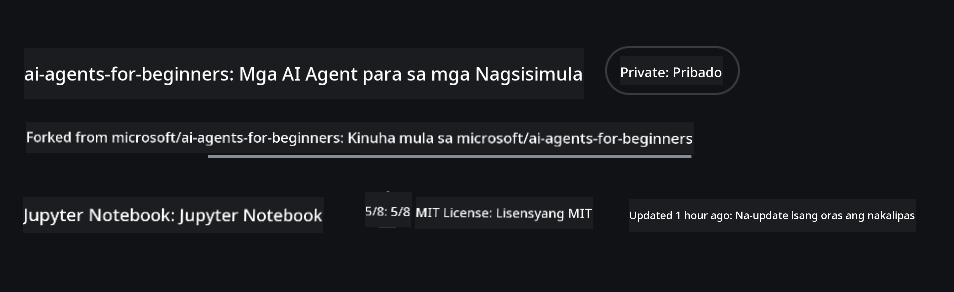
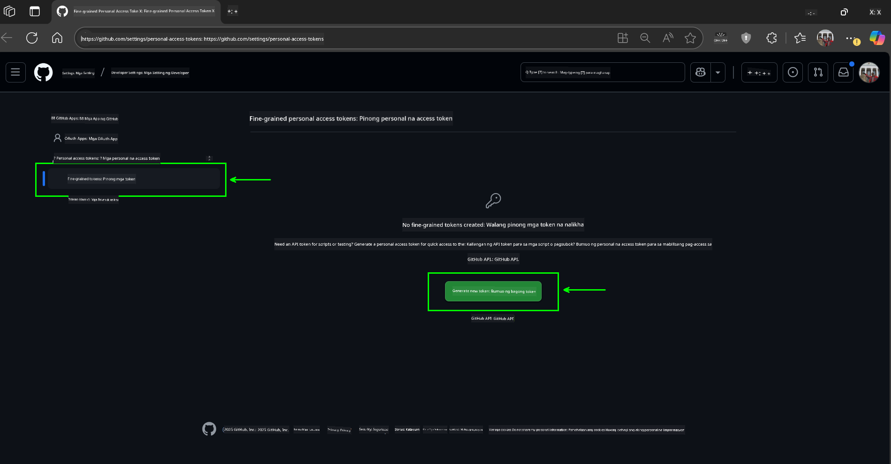
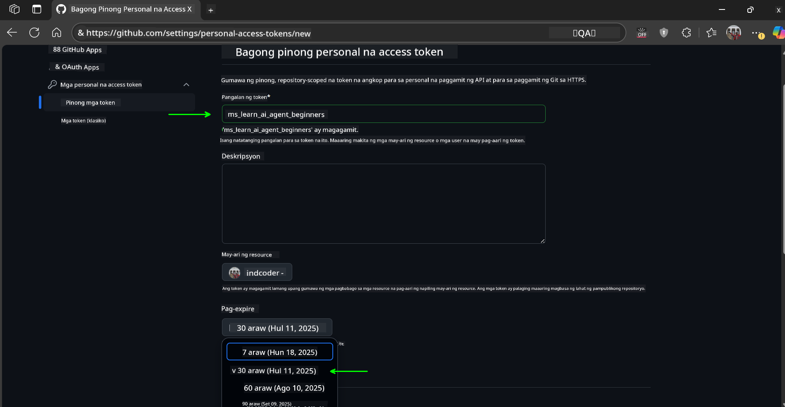
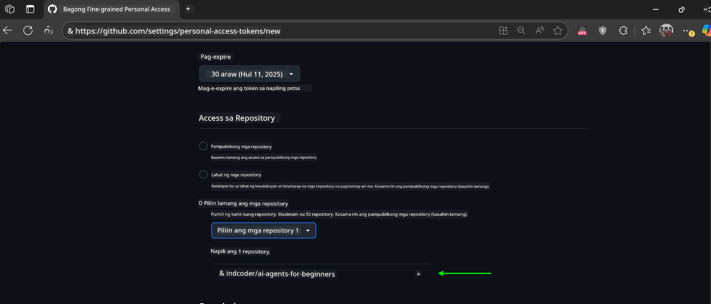
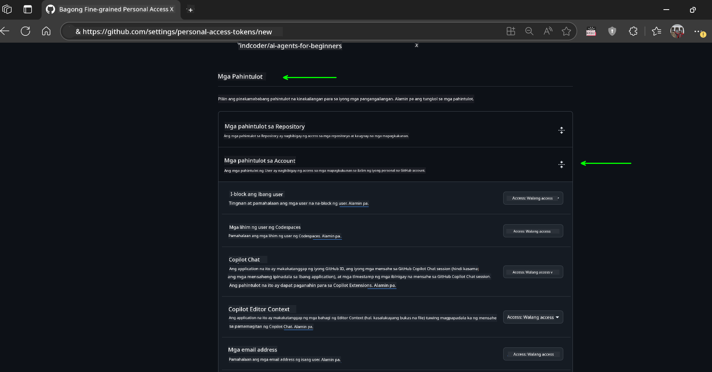
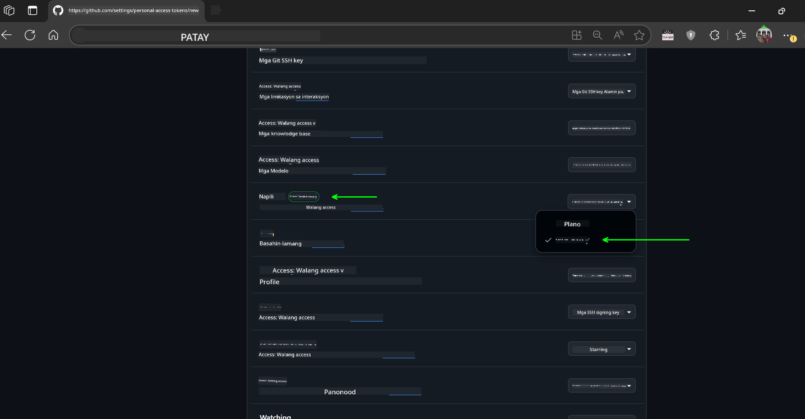
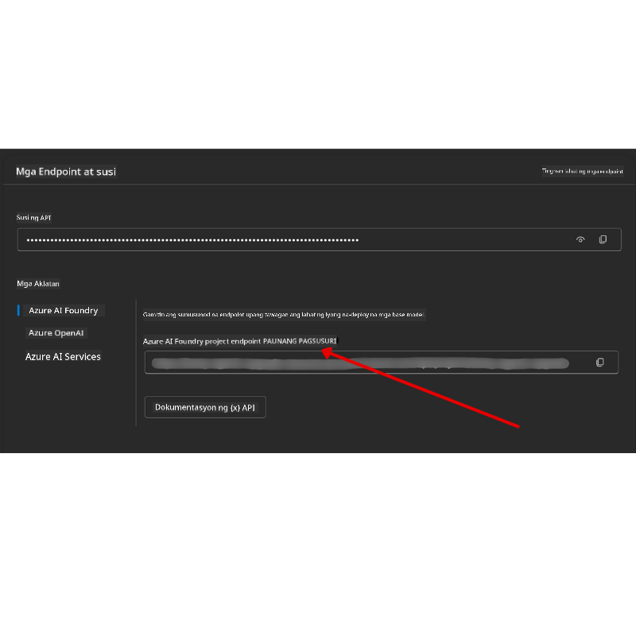

<!--
CO_OP_TRANSLATOR_METADATA:
{
  "original_hash": "c6a79c8f2b56a80370ff7e447765524f",
  "translation_date": "2025-07-23T09:02:45+00:00",
  "source_file": "00-course-setup/README.md",
  "language_code": "tl"
}
-->
# Pagsisimula ng Kurso

## Panimula

Ang araling ito ay magpapakita kung paano patakbuhin ang mga halimbawa ng code para sa kursong ito.

## I-clone o I-fork ang Repo na Ito

Upang magsimula, mangyaring i-clone o i-fork ang GitHub Repository. Magkakaroon ka ng sariling bersyon ng materyales ng kurso upang maipatupad, masubukan, at mabago ang code!

Magagawa ito sa pamamagitan ng pag-click sa link na:



## Pagpapatakbo ng Code

Ang kursong ito ay nag-aalok ng serye ng Jupyter Notebooks na maaari mong patakbuhin upang magkaroon ng hands-on na karanasan sa paggawa ng AI Agents.

Ang mga halimbawa ng code ay gumagamit ng alinman sa:

**Kailangan ng GitHub Account - Libre**:

1) Semantic Kernel Agent Framework + GitHub Models Marketplace. Tinatawag na (semantic-kernel.ipynb)
2) AutoGen Framework + GitHub Models Marketplace. Tinatawag na (autogen.ipynb)

**Kailangan ng Azure Subscription**:
3) Azure AI Foundry + Azure AI Agent Service. Tinatawag na (azureaiagent.ipynb)

Hinihikayat namin kayong subukan ang lahat ng tatlong uri ng halimbawa upang makita kung alin ang pinakamainam para sa inyo.

Anuman ang opsyon na pipiliin ninyo, ito ang magtatakda kung aling mga hakbang sa pagsisimula ang kailangang sundin sa ibaba:

## Mga Kinakailangan

- Python 3.12+
  - **NOTE**: Kung wala kang Python3.12 na naka-install, tiyaking i-install ito. Pagkatapos ay gumawa ng iyong venv gamit ang python3.12 upang matiyak na ang tamang mga bersyon ay mai-install mula sa requirements.txt file.
- Isang GitHub Account - Para sa Access sa GitHub Models Marketplace
- Azure Subscription - Para sa Access sa Azure AI Foundry
- Azure AI Foundry Account - Para sa Access sa Azure AI Agent Service

Kasama sa repository na ito ang isang `requirements.txt` file na naglalaman ng lahat ng kinakailangang Python packages upang patakbuhin ang mga halimbawa ng code.

Maaari mong i-install ang mga ito sa pamamagitan ng pagpapatakbo ng sumusunod na command sa iyong terminal sa root ng repository:

```bash
pip install -r requirements.txt
```
Inirerekumenda namin ang paggawa ng Python virtual environment upang maiwasan ang anumang mga conflict at isyu.

## Pagsisimula sa VSCode
Tiyakin na ginagamit mo ang tamang bersyon ng Python sa VSCode.


## Pagsisimula para sa Mga Halimbawa gamit ang GitHub Models 

### Hakbang 1: Kunin ang Iyong GitHub Personal Access Token (PAT)

Ang kursong ito ay gumagamit ng GitHub Models Marketplace, na nagbibigay ng libreng access sa Large Language Models (LLMs) na gagamitin mo upang bumuo ng AI Agents.

Upang magamit ang GitHub Models, kailangan mong gumawa ng [GitHub Personal Access Token](https://docs.github.com/en/authentication/keeping-your-account-and-data-secure/managing-your-personal-access-tokens).

Magagawa ito sa pamamagitan ng pagpunta sa iyong GitHub Account.

Mangyaring sundin ang [Principle of Least Privilege](https://docs.github.com/en/get-started/learning-to-code/storing-your-secrets-safely) kapag gumagawa ng iyong token. Nangangahulugan ito na dapat mo lamang ibigay ang token ng mga pahintulot na kinakailangan upang patakbuhin ang mga halimbawa ng code sa kursong ito.

1. Piliin ang opsyon na `Fine-grained tokens` sa kaliwang bahagi ng iyong screen.

    Pagkatapos piliin ang `Generate new token`.

    

1. Maglagay ng deskriptibong pangalan para sa iyong token na sumasalamin sa layunin nito, upang madali itong makilala sa hinaharap. Magtakda ng petsa ng pag-expire (inirerekomenda: 30 araw; maaari kang pumili ng mas maikling panahon tulad ng 7 araw kung mas gusto mo ang mas ligtas na paraan.)

    

1. Limitahan ang saklaw ng token sa iyong fork ng repository na ito.

    

1. Higpitan ang mga pahintulot ng token: Sa ilalim ng **Permissions**, i-toggle ang **Account Permissions**, mag-navigate sa **Models** at i-enable lamang ang read-access na kinakailangan para sa GitHub Models.

    

    

Kopyahin ang bagong token na iyong ginawa. Idadagdag mo ito ngayon sa iyong `.env` file na kasama sa kursong ito.

### Hakbang 2: Gumawa ng Iyong `.env` File

Upang gumawa ng iyong `.env` file, patakbuhin ang sumusunod na command sa iyong terminal.

```bash
cp .env.example .env
```

Ito ay kokopya sa example file at gagawa ng `.env` sa iyong direktoryo kung saan mo ilalagay ang mga halaga para sa mga environment variables.

Kapag nakopya na ang iyong token, buksan ang `.env` file sa iyong paboritong text editor at i-paste ang iyong token sa field na `GITHUB_TOKEN`.

Dapat mo nang magamit ang mga halimbawa ng code sa kursong ito.

## Pagsisimula para sa Mga Halimbawa gamit ang Azure AI Foundry at Azure AI Agent Service

### Hakbang 1: Kunin ang Iyong Azure Project Endpoint

Sundin ang mga hakbang sa paggawa ng hub at proyekto sa Azure AI Foundry na matatagpuan dito: [Hub resources overview](https://learn.microsoft.com/en-us/azure/ai-foundry/concepts/ai-resources)

Kapag nagawa mo na ang iyong proyekto, kakailanganin mong kunin ang connection string para sa iyong proyekto.

Magagawa ito sa pamamagitan ng pagpunta sa **Overview** page ng iyong proyekto sa Azure AI Foundry portal.



### Hakbang 2: Gumawa ng Iyong `.env` File

Upang gumawa ng iyong `.env` file, patakbuhin ang sumusunod na command sa iyong terminal.

```bash
cp .env.example .env
```

Ito ay kokopya sa example file at gagawa ng `.env` sa iyong direktoryo kung saan mo ilalagay ang mga halaga para sa mga environment variables.

Kapag nakopya na ang iyong token, buksan ang `.env` file sa iyong paboritong text editor at i-paste ang iyong token sa field na `PROJECT_ENDPOINT`.

### Hakbang 3: Mag-sign in sa Azure

Bilang isang security best practice, gagamit tayo ng [keyless authentication](https://learn.microsoft.com/azure/developer/ai/keyless-connections?tabs=csharp%2Cazure-cli?WT.mc_id=academic-105485-koreyst) upang mag-authenticate sa Azure OpenAI gamit ang Microsoft Entra ID.

Susunod, buksan ang terminal at patakbuhin ang `az login --use-device-code` upang mag-sign in sa iyong Azure account.

Kapag naka-login ka na, piliin ang iyong subscription sa terminal.

## Karagdagang Environment Variables - Azure Search at Azure OpenAI 

Para sa Agentic RAG Lesson - Lesson 5 - may mga halimbawa na gumagamit ng Azure Search at Azure OpenAI.

Kung nais mong patakbuhin ang mga halimbawang ito, kakailanganin mong idagdag ang sumusunod na environment variables sa iyong `.env` file:

### Overview Page (Project)

- `AZURE_SUBSCRIPTION_ID` - Tingnan ang **Project details** sa **Overview** page ng iyong proyekto.

- `AZURE_AI_PROJECT_NAME` - Tingnan ang itaas ng **Overview** page para sa iyong proyekto.

- `AZURE_OPENAI_SERVICE` - Hanapin ito sa **Included capabilities** tab para sa **Azure OpenAI Service** sa **Overview** page.

### Management Center

- `AZURE_OPENAI_RESOURCE_GROUP` - Pumunta sa **Project properties** sa **Overview** page ng **Management Center**.

- `GLOBAL_LLM_SERVICE` - Sa ilalim ng **Connected resources**, hanapin ang **Azure AI Services** connection name. Kung hindi nakalista, tingnan ang **Azure portal** sa ilalim ng iyong resource group para sa AI Services resource name.

### Models + Endpoints Page

- `AZURE_OPENAI_EMBEDDING_DEPLOYMENT_NAME` - Piliin ang iyong embedding model (hal. `text-embedding-ada-002`) at tandaan ang **Deployment name** mula sa model details.

- `AZURE_OPENAI_CHAT_DEPLOYMENT_NAME` - Piliin ang iyong chat model (hal. `gpt-4o-mini`) at tandaan ang **Deployment name** mula sa model details.

### Azure Portal

- `AZURE_OPENAI_ENDPOINT` - Hanapin ang **Azure AI services**, i-click ito, pagkatapos pumunta sa **Resource Management**, **Keys and Endpoint**, mag-scroll pababa sa "Azure OpenAI endpoints", at kopyahin ang isa na nagsasabing "Language APIs".

- `AZURE_OPENAI_API_KEY` - Mula sa parehong screen, kopyahin ang KEY 1 o KEY 2.

- `AZURE_SEARCH_SERVICE_ENDPOINT` - Hanapin ang iyong **Azure AI Search** resource, i-click ito, at tingnan ang **Overview**.

- `AZURE_SEARCH_API_KEY` - Pagkatapos pumunta sa **Settings** at pagkatapos **Keys** upang kopyahin ang primary o secondary admin key.

### External Webpage

- `AZURE_OPENAI_API_VERSION` - Bisitahin ang [API version lifecycle](https://learn.microsoft.com/en-us/azure/ai-services/openai/api-version-deprecation#latest-ga-api-release) page sa ilalim ng **Latest GA API release**.

### Setup keyless authentication

Sa halip na i-hardcode ang iyong mga kredensyal, gagamit tayo ng keyless connection sa Azure OpenAI. Upang gawin ito, mag-i-import tayo ng `DefaultAzureCredential` at tatawagin ang `DefaultAzureCredential` function upang makuha ang kredensyal.

```python
from azure.identity import DefaultAzureCredential, InteractiveBrowserCredential
```

## Nahihirapan?

Kung mayroon kang anumang isyu sa pagpapatakbo ng setup na ito, sumali sa aming.

## Susunod na Aralin

Handa ka na ngayong patakbuhin ang code para sa kursong ito. Masayang pag-aaral tungkol sa mundo ng AI Agents! 

[Introduction to AI Agents and Agent Use Cases](../01-intro-to-ai-agents/README.md)

**Paunawa**:  
Ang dokumentong ito ay isinalin gamit ang AI translation service na [Co-op Translator](https://github.com/Azure/co-op-translator). Bagama't sinisikap naming maging tumpak, pakitandaan na ang mga awtomatikong pagsasalin ay maaaring maglaman ng mga pagkakamali o hindi pagkakatugma. Ang orihinal na dokumento sa kanyang katutubong wika ang dapat ituring na opisyal na sanggunian. Para sa mahalagang impormasyon, inirerekomenda ang propesyonal na pagsasalin ng tao. Hindi kami mananagot sa anumang hindi pagkakaunawaan o maling interpretasyon na maaaring magmula sa paggamit ng pagsasaling ito.