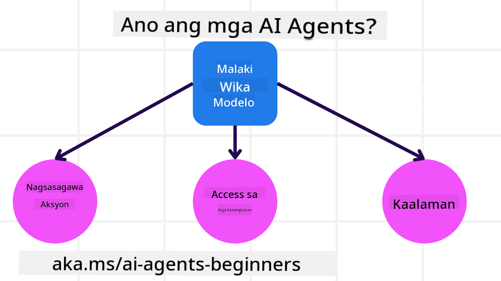
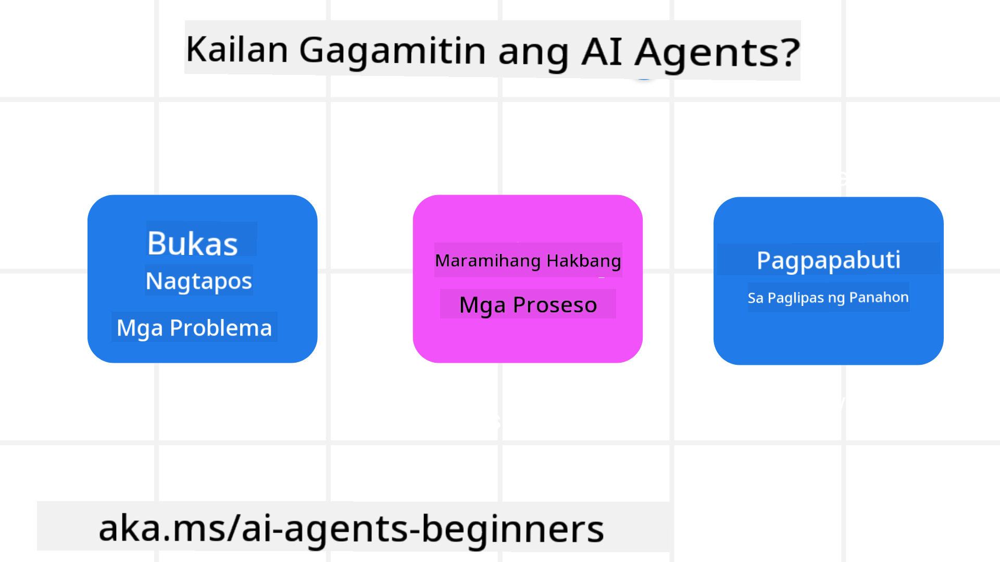

<!--
CO_OP_TRANSLATOR_METADATA:
{
  "original_hash": "d84943abc8f001ad4670418d32c2d899",
  "translation_date": "2025-07-12T08:10:18+00:00",
  "source_file": "01-intro-to-ai-agents/README.md",
  "language_code": "tl"
}
-->
makipag-ugnayan sa ibang mga nag-aaral at mga Tagabuo ng AI Agent at magtanong tungkol sa kursong ito.

Para simulan ang kursong ito, sisimulan natin sa mas malalim na pag-unawa kung ano ang AI Agents at kung paano natin sila magagamit sa mga aplikasyon at workflow na ating binubuo.

## Panimula

Tinutukoy ng araling ito ang mga sumusunod:

- Ano ang AI Agents at ano ang iba't ibang uri ng mga agent?
- Anong mga kaso ng paggamit ang pinakamainam para sa AI Agents at paano nila tayo matutulungan?
- Ano ang ilan sa mga pangunahing bahagi sa pagdidisenyo ng mga Agentic Solutions?

## Mga Layunin sa Pagkatuto
Pagkatapos makumpleto ang araling ito, dapat mong magawa ang mga sumusunod:

- Maunawaan ang mga konsepto ng AI Agent at kung paano ito naiiba sa ibang AI solutions.
- Magamit nang epektibo ang AI Agents.
- Magdisenyo ng mga Agentic solutions nang produktibo para sa mga gumagamit at mga customer.

## Pagpapakahulugan sa AI Agents at Mga Uri ng AI Agents

### Ano ang AI Agents?

Ang AI Agents ay mga **sistema** na nagpapahintulot sa **Large Language Models (LLMs)** na **magsagawa ng mga aksyon** sa pamamagitan ng pagpapalawak ng kanilang kakayahan sa pagbibigay ng **access sa mga kasangkapan** at **kaalaman** sa LLMs.

Hatiin natin ang kahulugang ito sa mas maliliit na bahagi:

- **Sistema** - Mahalaga na isipin ang mga agent hindi bilang isang solong bahagi lamang kundi bilang isang sistema ng maraming bahagi. Sa pinaka-pangunahing antas, ang mga bahagi ng AI Agent ay:
  - **Kapaligid (Environment)** - Ang tinukoy na espasyo kung saan gumagana ang AI Agent. Halimbawa, kung mayroon tayong travel booking AI Agent, ang kapaligiran ay maaaring ang travel booking system na ginagamit ng AI Agent upang tapusin ang mga gawain.
  - **Sensor** - Ang mga kapaligiran ay may impormasyon at nagbibigay ng feedback. Ginagamit ng AI Agents ang mga sensor upang mangalap at mag-interpret ng impormasyong ito tungkol sa kasalukuyang estado ng kapaligiran. Sa halimbawa ng Travel Booking Agent, maaaring magbigay ang travel booking system ng impormasyon tulad ng availability ng hotel o presyo ng flight.
  - **Actuators** - Kapag natanggap na ng AI Agent ang kasalukuyang estado ng kapaligiran, para sa kasalukuyang gawain, tinutukoy ng agent kung anong aksyon ang gagawin upang baguhin ang kapaligiran. Para sa travel booking agent, maaaring ito ay ang pag-book ng available na kwarto para sa gumagamit.

**Large Language Models** - Ang konsepto ng mga agent ay umiiral bago pa man malikha ang LLMs. Ang bentahe ng paggawa ng AI Agents gamit ang LLMs ay ang kanilang kakayahang mag-interpret ng wikang pantao at datos. Ang kakayahang ito ang nagpapahintulot sa LLMs na maunawaan ang impormasyon sa kapaligiran at bumuo ng plano upang baguhin ito.

**Pagsasagawa ng Aksyon** - Sa labas ng mga sistema ng AI Agent, limitado ang LLMs sa mga sitwasyon kung saan ang aksyon ay ang paglikha ng nilalaman o impormasyon base sa prompt ng gumagamit. Sa loob ng mga sistema ng AI Agent, nagagawa ng LLMs na tapusin ang mga gawain sa pamamagitan ng pag-interpret ng kahilingan ng gumagamit at paggamit ng mga kasangkapang available sa kanilang kapaligiran.

**Access sa mga Kasangkapan** - Ang mga kasangkapang naa-access ng LLM ay tinutukoy ng 1) ang kapaligirang kanilang pinaglilingkuran at 2) ang developer ng AI Agent. Sa halimbawa ng travel agent, limitado ang mga kasangkapan ng agent sa mga operasyon na available sa booking system, at/o maaaring limitahan ng developer ang access ng agent sa mga kasangkapan para sa mga flight.

**Memorya at Kaalaman** - Ang memorya ay maaaring panandalian sa konteksto ng pag-uusap sa pagitan ng gumagamit at ng agent. Pangmatagalan, bukod sa impormasyong ibinibigay ng kapaligiran, maaaring kumuha ang AI Agents ng kaalaman mula sa ibang mga sistema, serbisyo, kasangkapan, at maging mula sa ibang mga agent. Sa halimbawa ng travel agent, ang kaalamang ito ay maaaring impormasyon tungkol sa mga travel preferences ng gumagamit na nasa isang customer database.

### Iba't ibang Uri ng mga Agent

Ngayon na mayroon tayong pangkalahatang kahulugan ng AI Agents, tingnan natin ang ilang partikular na uri ng agent at kung paano sila iaaplay sa isang travel booking AI agent.

| **Uri ng Agent**              | **Paglalarawan**                                                                                                                     | **Halimbawa**                                                                                                                                                                                                                 |
| ----------------------------- | ----------------------------------------------------------------------------------------------------------------------------------- | ----------------------------------------------------------------------------------------------------------------------------------------------------------------------------------------------------------------------------- |
| **Simple Reflex Agents**      | Gumagawa ng agarang aksyon base sa mga paunang itinakdang patakaran.                                                                | Ang travel agent ay nag-iinterpret ng konteksto ng email at ipinapasa ang mga reklamo tungkol sa biyahe sa customer service.                                                                                                   |
| **Model-Based Reflex Agents** | Gumagawa ng aksyon base sa modelo ng mundo at mga pagbabago sa modelong iyon.                                                       | Pinaprioritize ng travel agent ang mga ruta na may malaking pagbabago sa presyo base sa access sa historical pricing data.                                                                                                     |
| **Goal-Based Agents**         | Gumagawa ng mga plano upang makamit ang mga tiyak na layunin sa pamamagitan ng pag-interpret ng layunin at pagtukoy ng mga aksyon.  | Nagbu-book ang travel agent ng biyahe sa pamamagitan ng pagtukoy ng mga kinakailangang travel arrangements (kotse, pampublikong transportasyon, mga flight) mula sa kasalukuyang lokasyon papunta sa destinasyon.                  |
| **Utility-Based Agents**      | Isinasaalang-alang ang mga kagustuhan at tinataya ang mga tradeoff nang numerikal upang matukoy kung paano makakamit ang mga layunin. | Pinapalaki ng travel agent ang utility sa pamamagitan ng pagtimbang ng kaginhawaan laban sa gastos kapag nagbu-book ng biyahe.                                                                                                  |
| **Learning Agents**           | Nagpapabuti sa paglipas ng panahon sa pamamagitan ng pagtugon sa feedback at pagsasaayos ng mga aksyon.                             | Pinapabuti ng travel agent ang serbisyo gamit ang feedback ng customer mula sa post-trip surveys upang gumawa ng mga pagbabago sa mga susunod na booking.                                                                       |
| **Hierarchical Agents**       | Binubuo ng maraming agent sa isang tiered system, kung saan ang mga higher-level agent ay naghahati ng mga gawain sa mga lower-level agent. | Kinakansela ng travel agent ang isang biyahe sa pamamagitan ng paghahati ng gawain sa mga subtasks (halimbawa, pagkansela ng mga partikular na booking) at pinapagawa ito sa mga lower-level agent na nag-uulat pabalik sa higher-level agent. |
| **Multi-Agent Systems (MAS)** | Ang mga agent ay nagtatrabaho nang independyente, maaaring magkatuwang o magkumpetensya.                                            | Cooperative: Maraming agent ang nagbu-book ng partikular na travel services tulad ng hotel, flight, at libangan. Competitive: Maraming agent ang nagma-manage at nakikipagkumpetensya sa isang shared hotel booking calendar para mag-book ng mga customer sa hotel. |

## Kailan Gamitin ang AI Agents

Sa naunang bahagi, ginamit natin ang halimbawa ng Travel Agent upang ipaliwanag kung paano magagamit ang iba't ibang uri ng agent sa iba't ibang senaryo ng travel booking. Patuloy nating gagamitin ang aplikasyon na ito sa buong kurso.

Tingnan natin ang mga uri ng kaso ng paggamit na pinakamainam para sa AI Agents:

- **Mga Problema na Bukas ang Sagot** - pinapayagan ang LLM na tukuyin ang mga kinakailangang hakbang upang matapos ang isang gawain dahil hindi ito palaging maaaring i-hardcode sa isang workflow.
- **Mga Proseso na Maraming Hakbang** - mga gawain na nangangailangan ng antas ng komplikasyon kung saan kailangang gumamit ang AI Agent ng mga kasangkapan o impormasyon sa maraming yugto sa halip na isang beses lang na pagkuha.
- **Pagpapabuti sa Paglipas ng Panahon** - mga gawain kung saan maaaring mag-improve ang agent sa pagdaan ng panahon sa pamamagitan ng pagtanggap ng feedback mula sa kapaligiran o mga gumagamit upang makapagbigay ng mas mahusay na serbisyo.

Tatalakayin pa natin ang iba pang mga konsiderasyon sa paggamit ng AI Agents sa aralin na "Building Trustworthy AI Agents."

## Mga Pangunahing Kaalaman sa Agentic Solutions

### Pagbuo ng Agent

Ang unang hakbang sa pagdidisenyo ng AI Agent system ay ang pagtukoy sa mga kasangkapan, aksyon, at mga pag-uugali. Sa kursong ito, nakatuon tayo sa paggamit ng **Azure AI Agent Service** upang tukuyin ang ating mga Agent. Nag-aalok ito ng mga tampok tulad ng:

- Pagpili ng Open Models tulad ng OpenAI, Mistral, at Llama
- Paggamit ng Licensed Data mula sa mga provider tulad ng Tripadvisor
- Paggamit ng standardized OpenAPI 3.0 tools

### Agentic Patterns

Ang komunikasyon sa LLMs ay sa pamamagitan ng mga prompt. Dahil sa semi-autonomous na katangian ng AI Agents, hindi palaging posible o kinakailangan na manu-manong i-reprompt ang LLM pagkatapos ng pagbabago sa kapaligiran. Ginagamit natin ang **Agentic Patterns** na nagpapahintulot sa atin na mag-prompt sa LLM sa maraming hakbang sa mas scalable na paraan.

Ang kursong ito ay hinati sa ilan sa mga kasalukuyang popular na Agentic patterns.

### Agentic Frameworks

Pinapayagan ng Agentic Frameworks ang mga developer na ipatupad ang mga agentic pattern sa pamamagitan ng code. Nag-aalok ang mga framework na ito ng mga template, plugin, at kasangkapan para sa mas mahusay na kolaborasyon ng AI Agent. Ang mga benepisyong ito ay nagbibigay ng kakayahan para sa mas mahusay na obserbasyon at troubleshooting ng mga sistema ng AI Agent.

Sa kursong ito, susuriin natin ang research-driven na AutoGen framework at ang production-ready na Agent framework mula sa Semantic Kernel.

## Nakaraang Aralin

[Course Setup](../00-course-setup/README.md)

## Susunod na Aralin

[Exploring Agentic Frameworks](../02-explore-agentic-frameworks/README.md)

**Paalala**:  
Ang dokumentong ito ay isinalin gamit ang AI translation service na [Co-op Translator](https://github.com/Azure/co-op-translator). Bagamat nagsusumikap kami para sa katumpakan, pakatandaan na ang mga awtomatikong pagsasalin ay maaaring maglaman ng mga pagkakamali o di-tumpak na impormasyon. Ang orihinal na dokumento sa orihinal nitong wika ang dapat ituring na pangunahing sanggunian. Para sa mahahalagang impormasyon, inirerekomenda ang propesyonal na pagsasalin ng tao. Hindi kami mananagot sa anumang hindi pagkakaunawaan o maling interpretasyon na maaaring magmula sa paggamit ng pagsasaling ito.